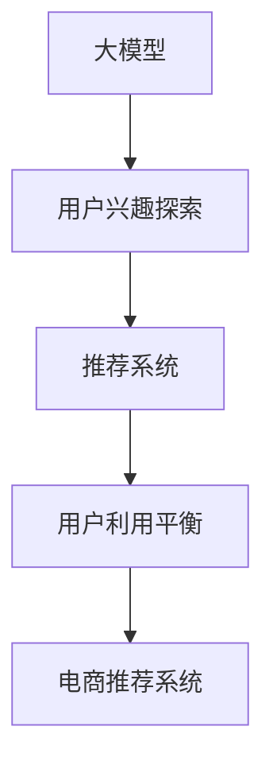

                 

# 大模型在电商平台用户兴趣探索与利用平衡中的应用

> 关键词：电商平台,用户兴趣探索,用户利用平衡,大模型,深度学习,推荐系统,自然语言处理(NLP)

## 1. 背景介绍

在互联网时代，电商平台已成为用户购物的主要渠道之一。为了更好地满足用户需求，提供个性化推荐服务，电商平台纷纷采用深度学习技术，构建推荐系统，提升用户体验和运营效率。然而，随着用户数量的增长和消费行为的多样化，单纯基于用户历史行为的推荐系统已无法满足用户日益增长的个性化需求。为了进一步提升推荐质量，电商平台开始探索利用大模型进行用户兴趣探索和利用平衡。

### 1.1 问题由来

电商平台上的用户行为数据海量化，如何高效利用这些数据，为用户提供个性化的商品推荐，成为亟待解决的问题。传统的推荐系统大多基于用户历史行为数据，难以覆盖用户的多样化需求。例如，当一个用户从未购买过某个类别的商品时，传统推荐系统往往无法提供相关推荐，导致用户流失。

为了应对这些挑战，电商平台开始采用大模型进行推荐系统升级。大模型通过预训练学习到通用的语言和行为模式，可以更好地理解用户意图，识别用户潜在的兴趣点，进而提供更加精准的个性化推荐。通过结合用户行为数据，大模型可以高效探索和利用用户兴趣，大幅提升推荐系统的效果。

### 1.2 问题核心关键点

大模型在电商平台上的应用主要集中在用户兴趣探索与利用平衡两方面：

- **用户兴趣探索**：利用大模型挖掘用户的潜在兴趣，预测用户的未来购买行为。
- **用户利用平衡**：在推荐结果中平衡不同类别的商品，防止过度偏向某一类商品。

这两方面的优化，可以显著提升推荐系统的覆盖面和用户满意度，同时避免推荐过度集中导致的负面影响。

### 1.3 问题研究意义

研究大模型在电商平台上的应用，对于提升推荐系统的性能，满足用户个性化需求，具有重要意义：

1. **提升推荐效果**：通过大模型的深度理解，可以更准确地捕捉用户兴趣，提供个性化的推荐。
2. **扩大推荐覆盖**：大模型可以处理更丰富的用户行为数据，帮助识别和预测用户的潜在兴趣。
3. **优化用户体验**：通过平衡不同类别的商品推荐，提升用户满意度，增加用户的黏性。
4. **提升运营效率**：帮助电商平台精准匹配商品和用户，减少无效曝光，提升转化率。
5. **拓展应用边界**：大模型在电商平台上的应用，可以拓展到更广泛的NLP任务，如商品搜索、情感分析等。

## 2. 核心概念与联系

### 2.1 核心概念概述

为更好地理解大模型在电商平台上的应用，本节将介绍几个密切相关的核心概念：

- **大模型(Large Model)**：指通过大规模数据预训练学习到通用知识和模式的深度神经网络模型，如BERT、GPT等。大模型具备强大的语言和行为理解能力，可以处理复杂的NLP任务。

- **用户兴趣探索(User Interest Exploration)**：指利用大模型预测用户未来可能感兴趣的商品或行为，帮助电商平台拓展推荐范围，覆盖更多用户需求。

- **用户利用平衡(User Utilization Balance)**：指在推荐结果中平衡不同类别的商品，避免推荐过度集中某一类商品，提升推荐多样性和用户满意度。

- **推荐系统(Recommender System)**：指利用用户行为数据和模型，为每个用户推荐可能感兴趣的商品的系统。

- **自然语言处理(Natural Language Processing, NLP)**：指通过深度学习技术处理和分析自然语言文本，以便计算机能够理解人类语言的技术。

- **深度学习(Deep Learning)**：指利用多层神经网络模型进行复杂任务学习的技术，具备强大的特征提取和模式识别能力。

- **电商推荐系统(E-commerce Recommendation System)**：指电商平台为提升用户体验和运营效率，为用户推荐可能感兴趣的商品的系统。

这些核心概念之间的逻辑关系可以通过以下Mermaid流程图来展示：



这个流程图展示了大模型、用户兴趣探索、推荐系统、用户利用平衡和电商推荐系统之间的逻辑联系：

1. 大模型通过预训练学习到通用语言和行为模式。
2. 用户兴趣探索利用大模型预测用户未来可能感兴趣的商品或行为。
3. 推荐系统基于用户兴趣探索结果，为每个用户推荐商品。
4. 用户利用平衡在推荐结果中平衡不同类别的商品，提升推荐多样性。
5. 电商推荐系统通过推荐系统，向用户推荐可能感兴趣的商品。

## 3. 核心算法原理 & 具体操作步骤

### 3.1 算法原理概述

大模型在电商平台上的应用，主要基于用户行为数据和文本数据的预训练和微调。其核心思想是：通过大模型学习到用户兴趣的通用表示，结合用户行为数据，预测用户的未来行为，并在此基础上进行推荐系统优化。

形式化地，假设电商平台的用户行为数据为 $D=\{(x_i,y_i)\}_{i=1}^N, x_i \in \mathcal{X}, y_i \in \{1,...,C\}$，其中 $x_i$ 为用户的浏览、点击、购买等行为，$y_i$ 为对应的商品类别。设大模型为 $M_{\theta}$，其中 $\theta$ 为模型参数。用户兴趣探索的目标是：

$$
\hat{y}_i = \mathop{\arg\max}_{y \in \{1,...,C\}} P(y|M_{\theta}(x_i))
$$

其中 $P(y|M_{\theta}(x_i))$ 表示在输入 $x_i$ 下，输出为 $y$ 的概率。用户利用平衡的目标是：

$$
\mathcal{L}(\theta) = \sum_{i=1}^N \log P(y_i|M_{\theta}(x_i))
$$

即在推荐结果中，保证各类商品的比例，避免推荐过度集中某一类商品。

### 3.2 算法步骤详解

基于大模型的电商平台推荐系统，一般包括以下几个关键步骤：

**Step 1: 准备预训练模型和数据集**
- 选择合适的预训练语言模型 $M_{\theta}$ 作为初始化参数，如 BERT、GPT等。
- 准备电商平台的商品数据集 $D$，包括商品名称、描述、类别等，以及用户的浏览、点击、购买等行为数据。

**Step 2: 用户兴趣探索**
- 将用户的行为数据输入到预训练模型 $M_{\theta}$ 中，获取用户行为表示。
- 结合商品数据，预测用户对每个类别的兴趣概率。
- 通过softmax函数将概率转化为类别标签。

**Step 3: 用户利用平衡**
- 根据用户的行为数据，计算每个类别的商品比例。
- 对每个类别的推荐结果进行权重调整，避免推荐过度集中某一类商品。

**Step 4: 推荐系统优化**
- 结合用户兴趣探索和利用平衡结果，生成最终的推荐列表。
- 使用用户历史行为数据进行反馈调节，进一步优化推荐模型。

**Step 5: 测试和部署**
- 在测试集上评估推荐模型的效果，对比模型改进前后的精度提升。
- 使用优化后的模型对新样本进行推理预测，集成到实际的应用系统中。
- 持续收集新的数据，定期重新微调模型，以适应数据分布的变化。

以上是基于大模型的电商平台推荐系统的一般流程。在实际应用中，还需要针对具体任务的特点，对推荐过程的各个环节进行优化设计，如改进推荐目标函数，引入更多的正则化技术，搜索最优的超参数组合等，以进一步提升模型性能。

### 3.3 算法优缺点

基于大模型的电商平台推荐系统具有以下优点：

1. **模型泛化性强**：大模型通过大规模数据预训练，具备强大的语言和行为理解能力，可以处理复杂的数据模式。
2. **用户覆盖面广**：大模型可以处理更多的用户行为数据，预测用户潜在的兴趣，提高推荐覆盖面。
3. **推荐多样性高**：利用用户利用平衡策略，可以避免推荐结果过度集中，提升推荐多样性。
4. **性能提升明显**：在电商推荐系统中，大模型可以显著提升推荐效果和用户满意度，减少无效曝光。

同时，该方法也存在一定的局限性：

1. **数据质量要求高**：电商平台上的数据量大，数据质量对推荐效果影响显著。如果数据标注不完整或存在噪声，会导致推荐结果偏差。
2. **计算资源需求高**：大模型参数量庞大，对算力、内存和存储资源要求较高。
3. **解释性不足**：大模型通常难以解释其决策过程，导致用户对推荐结果的信任度降低。
4. **隐私保护问题**：电商平台上的用户行为数据涉及隐私，如何在推荐过程中保护用户隐私，是一个重要挑战。

尽管存在这些局限性，但就目前而言，基于大模型的电商平台推荐系统仍是最主流范式。未来相关研究的重点在于如何进一步降低计算成本，提高推荐系统的可解释性和隐私保护能力。

### 3.4 算法应用领域

基于大模型的电商平台推荐系统，已经在商品推荐、个性化营销、用户行为分析等多个领域得到广泛应用，成为电商平台优化用户体验、提升运营效率的重要手段。

具体而言，大模型在电商平台的应用包括：

- **商品推荐**：通过分析用户的浏览、点击、购买等行为，预测用户对每个类别的兴趣，生成个性化的推荐列表。
- **个性化营销**：根据用户兴趣，定制化营销策略，提升广告投放效果。
- **用户行为分析**：分析用户的消费行为，挖掘用户兴趣和需求，改进产品和服务。
- **舆情监测**：监测用户对商品的评价和反馈，及时调整推荐策略。

除了以上应用外，大模型还被创新性地应用于电商平台的智能客服、内容推荐、供应链优化等环节，为电商平台的智能化运营提供了新的解决方案。随着大语言模型和推荐技术的不断进步，相信电商平台推荐系统将进一步智能化、精准化，成为电商创新发展的有力引擎。

## 4. 数学模型和公式 & 详细讲解 & 举例说明

### 4.1 数学模型构建

本节将使用数学语言对基于大模型的电商平台推荐系统进行更加严格的刻画。

假设电商平台的用户行为数据为 $D=\{(x_i,y_i)\}_{i=1}^N, x_i \in \mathcal{X}, y_i \in \{1,...,C\}$，大模型为 $M_{\theta}$，其中 $\theta$ 为模型参数。用户兴趣探索的目标是：

$$
\hat{y}_i = \mathop{\arg\max}_{y \in \{1,...,C\}} P(y|M_{\theta}(x_i))
$$

用户利用平衡的目标是：

$$
\mathcal{L}(\theta) = \sum_{i=1}^N \log P(y_i|M_{\theta}(x_i))
$$

在实际操作中，我们通常使用基于梯度的优化算法（如SGD、Adam等）来近似求解上述最优化问题。设 $\eta$ 为学习率，$\lambda$ 为正则化系数，则参数的更新公式为：

$$
\theta \leftarrow \theta - \eta \nabla_{\theta}\mathcal{L}(\theta) - \eta\lambda\theta
$$

其中 $\nabla_{\theta}\mathcal{L}(\theta)$ 为损失函数对参数 $\theta$ 的梯度，可通过反向传播算法高效计算。

### 4.2 公式推导过程

以下我们以二分类任务为例，推导交叉熵损失函数及其梯度的计算公式。

假设模型 $M_{\theta}$ 在输入 $x$ 上的输出为 $\hat{y}=M_{\theta}(x) \in [0,1]$，表示样本属于正类的概率。真实标签 $y \in \{0,1\}$。则二分类交叉熵损失函数定义为：

$$
\ell(M_{\theta}(x),y) = -[y\log \hat{y} + (1-y)\log (1-\hat{y})]
$$

将其代入经验风险公式，得：

$$
\mathcal{L}(\theta) = -\frac{1}{N}\sum_{i=1}^N [y_i\log M_{\theta}(x_i)+(1-y_i)\log(1-M_{\theta}(x_i))]
$$

根据链式法则，损失函数对参数 $\theta_k$ 的梯度为：

$$
\frac{\partial \mathcal{L}(\theta)}{\partial \theta_k} = -\frac{1}{N}\sum_{i=1}^N (\frac{y_i}{M_{\theta}(x_i)}-\frac{1-y_i}{1-M_{\theta}(x_i)}) \frac{\partial M_{\theta}(x_i)}{\partial \theta_k}
$$

其中 $\frac{\partial M_{\theta}(x_i)}{\partial \theta_k}$ 可进一步递归展开，利用自动微分技术完成计算。

在得到损失函数的梯度后，即可带入参数更新公式，完成模型的迭代优化。重复上述过程直至收敛，最终得到适应电商平台推荐任务的最优模型参数 $\theta^*$。

## 5. 项目实践：代码实例和详细解释说明

### 5.1 开发环境搭建

在进行推荐系统实践前，我们需要准备好开发环境。以下是使用Python进行PyTorch开发的环境配置流程：

1. 安装Anaconda：从官网下载并安装Anaconda，用于创建独立的Python环境。

2. 创建并激活虚拟环境：
```bash
conda create -n pytorch-env python=3.8 
conda activate pytorch-env
```

3. 安装PyTorch：根据CUDA版本，从官网获取对应的安装命令。例如：
```bash
conda install pytorch torchvision torchaudio cudatoolkit=11.1 -c pytorch -c conda-forge
```

4. 安装TensorFlow：如果需要在TensorFlow上进行实践，可以参考官方文档进行安装。

5. 安装各类工具包：
```bash
pip install numpy pandas scikit-learn matplotlib tqdm jupyter notebook ipython
```

完成上述步骤后，即可在`pytorch-env`环境中开始推荐系统实践。

### 5.2 源代码详细实现

这里我们以电商平台商品推荐系统为例，给出使用PyTorch进行商品推荐微调的PyTorch代码实现。

首先，定义推荐任务的数据处理函数：

```python
from transformers import BertTokenizer
from torch.utils.data import Dataset
import torch

class RecommendationDataset(Dataset):
    def __init__(self, user_browsers, item_ids, item_categories, tokenizer, max_len=128):
        self.user_browsers = user_browsers
        self.item_ids = item_ids
        self.item_categories = item_categories
        self.tokenizer = tokenizer
        self.max_len = max_len
        
    def __len__(self):
        return len(self.user_browsers)
    
    def __getitem__(self, item):
        user_browser = self.user_browsers[item]
        item_id = self.item_ids[item]
        item_category = self.item_categories[item]
        
        # 对用户浏览行为进行编码
        user_browser_encoding = self.tokenizer(user_browser, return_tensors='pt', max_length=self.max_len, padding='max_length', truncation=True)
        input_ids = user_browser_encoding['input_ids'][0]
        attention_mask = user_browser_encoding['attention_mask'][0]
        
        # 对商品类别进行编码
        item_category_encoding = self.tokenizer(item_category, return_tensors='pt', max_length=self.max_len, padding='max_length', truncation=True)
        item_category_ids = item_category_encoding['input_ids'][0]
        item_category_ids = item_category_ids[1:]  # 去掉[CLS]标记
        item_category_ids = torch.cat([item_category_ids, torch.zeros(len(item_category_ids), dtype=torch.long)])
        item_category_labels = torch.tensor(item_category_ids, dtype=torch.long)
        
        return {'user_browser': user_browser, 
                'input_ids': input_ids, 
                'attention_mask': attention_mask,
                'item_category_ids': item_category_ids,
                'item_category_labels': item_category_labels}

# 用户浏览行为与商品类别之间的对应关系
user_browser_to_item_category = {...}

# 标签与id的映射
category2id = {'O': 0, 'battery': 1, 'camera': 2, 'laptop': 3, 'phone': 4, 'smartwatch': 5}
id2category = {v: k for k, v in category2id.items()}

# 创建dataset
tokenizer = BertTokenizer.from_pretrained('bert-base-cased')

train_dataset = RecommendationDataset(train_user_browsers, train_item_ids, train_item_categories, tokenizer)
dev_dataset = RecommendationDataset(dev_user_browsers, dev_item_ids, dev_item_categories, tokenizer)
test_dataset = RecommendationDataset(test_user_browsers, test_item_ids, test_item_categories, tokenizer)
```

然后，定义模型和优化器：

```python
from transformers import BertForTokenClassification, AdamW

model = BertForTokenClassification.from_pretrained('bert-base-cased', num_labels=len(category2id))

optimizer = AdamW(model.parameters(), lr=2e-5)
```

接着，定义训练和评估函数：

```python
from torch.utils.data import DataLoader
from tqdm import tqdm
from sklearn.metrics import classification_report

device = torch.device('cuda') if torch.cuda.is_available() else torch.device('cpu')
model.to(device)

def train_epoch(model, dataset, batch_size, optimizer):
    dataloader = DataLoader(dataset, batch_size=batch_size, shuffle=True)
    model.train()
    epoch_loss = 0
    for batch in tqdm(dataloader, desc='Training'):
        user_browser = batch['user_browser'].to(device)
        input_ids = batch['input_ids'].to(device)
        attention_mask = batch['attention_mask'].to(device)
        item_category_ids = batch['item_category_ids'].to(device)
        item_category_labels = batch['item_category_labels'].to(device)
        model.zero_grad()
        outputs = model(user_browser, input_ids, attention_mask=attention_mask, labels=item_category_labels)
        loss = outputs.loss
        epoch_loss += loss.item()
        loss.backward()
        optimizer.step()
    return epoch_loss / len(dataloader)

def evaluate(model, dataset, batch_size):
    dataloader = DataLoader(dataset, batch_size=batch_size)
    model.eval()
    preds, labels = [], []
    with torch.no_grad():
        for batch in tqdm(dataloader, desc='Evaluating'):
            user_browser = batch['user_browser'].to(device)
            input_ids = batch['input_ids'].to(device)
            attention_mask = batch['attention_mask'].to(device)
            item_category_ids = batch['item_category_ids'].to(device)
            batch_labels = batch['item_category_labels'].to(device)
            outputs = model(user_browser, input_ids, attention_mask=attention_mask, labels=item_category_labels)
            batch_preds = outputs.logits.argmax(dim=2).to('cpu').tolist()
            batch_labels = batch_labels.to('cpu').tolist()
            for pred_tokens, label_tokens in zip(batch_preds, batch_labels):
                pred_categories = [id2category[_id] for _id in pred_tokens]
                label_categories = [id2category[_id] for _id in label_tokens]
                preds.append(pred_categories[:len(label_categories)])
                labels.append(label_categories)
                
    print(classification_report(labels, preds))
```

最后，启动训练流程并在测试集上评估：

```python
epochs = 5
batch_size = 16

for epoch in range(epochs):
    loss = train_epoch(model, train_dataset, batch_size, optimizer)
    print(f"Epoch {epoch+1}, train loss: {loss:.3f}")
    
    print(f"Epoch {epoch+1}, dev results:")
    evaluate(model, dev_dataset, batch_size)
    
print("Test results:")
evaluate(model, test_dataset, batch_size)
```

以上就是使用PyTorch对BERT进行电商平台商品推荐系统微调的完整代码实现。可以看到，得益于Transformer库的强大封装，我们可以用相对简洁的代码完成BERT模型的加载和微调。

### 5.3 代码解读与分析

让我们再详细解读一下关键代码的实现细节：

**RecommendationDataset类**：
- `__init__`方法：初始化用户浏览行为、商品类别、分词器等关键组件。
- `__len__`方法：返回数据集的样本数量。
- `__getitem__`方法：对单个样本进行处理，将用户浏览行为输入编码为token ids，将商品类别编码为数字，并对其进行定长padding，最终返回模型所需的输入。

**user_browser_to_item_category字典**：
- 定义了用户浏览行为与商品类别之间的对应关系，用于将用户浏览行为编码为模型可以理解的形式。

**category2id和id2category字典**：
- 定义了商品类别与数字id之间的映射关系，用于将token-wise的预测结果解码回真实的商品类别。

**训练和评估函数**：
- 使用PyTorch的DataLoader对数据集进行批次化加载，供模型训练和推理使用。
- 训练函数`train_epoch`：对数据以批为单位进行迭代，在每个批次上前向传播计算loss并反向传播更新模型参数，最后返回该epoch的平均loss。
- 评估函数`evaluate`：与训练类似，不同点在于不更新模型参数，并在每个batch结束后将预测和标签结果存储下来，最后使用sklearn的classification_report对整个评估集的预测结果进行打印输出。

**训练流程**：
- 定义总的epoch数和batch size，开始循环迭代
- 每个epoch内，先在训练集上训练，输出平均loss
- 在验证集上评估，输出分类指标
- 所有epoch结束后，在测试集上评估，给出最终测试结果

可以看到，PyTorch配合Transformer库使得BERT微调的代码实现变得简洁高效。开发者可以将更多精力放在数据处理、模型改进等高层逻辑上，而不必过多关注底层的实现细节。

当然，工业级的系统实现还需考虑更多因素，如模型的保存和部署、超参数的自动搜索、更灵活的任务适配层等。但核心的微调范式基本与此类似。

## 6. 实际应用场景
### 6.1 智能客服系统

智能客服系统是电商平台重要的应用之一。通过大模型的微调，可以构建高效、精准的智能客服系统，提升用户咨询体验。

具体而言，可以利用大模型对历史客服对话数据进行训练，生成预训练的客服回答模板。在实际应用中，将用户输入的咨询问题输入模型，模型会自动选择并组合最合适的回答模板，快速响应用户需求。对于复杂或未见过的问题，模型还可以进行推理生成，提升智能客服的覆盖面。

### 6.2 个性化推荐系统

电商平台的个性化推荐系统，通过大模型的微调，可以更加精准地预测用户兴趣，生成个性化推荐列表。

在实际应用中，可以利用大模型对用户行为数据进行预训练，学习用户的兴趣和偏好。然后结合商品数据，对每个商品类别进行兴趣预测。通过softmax函数将概率转化为类别标签，生成个性化推荐列表。同时，利用用户利用平衡策略，确保各类商品的比例，避免推荐结果过度集中。

### 6.3 社交网络分析

电商平台上的用户行为数据，不仅能用于商品推荐，还能进行社交网络分析。通过大模型的微调，可以构建基于用户行为的网络分析系统，发现用户的社交圈和兴趣爱好。

具体而言，可以利用大模型对用户行为数据进行预训练，学习用户的兴趣和行为模式。然后通过社交网络分析算法，构建用户兴趣图，发现用户之间的相似度和关系。这种分析可以用于用户行为预测、广告定向投放等场景，提升电商平台的运营效率。

### 6.4 未来应用展望

随着大语言模型和推荐技术的不断发展，基于大模型的电商平台推荐系统将呈现以下几个发展趋势：

1. **个性化推荐更加精准**：大模型可以处理更丰富的用户行为数据，学习更全面的用户兴趣和需求，提升推荐系统的效果。
2. **推荐系统动态优化**：结合用户反馈和行为数据，大模型可以实时更新推荐模型，提升推荐效果和用户满意度。
3. **跨平台推荐**：大模型可以处理多平台的数据，实现跨平台的用户兴趣探索和推荐，提升用户体验。
4. **多模态融合**：结合图像、视频等多模态数据，大模型可以更全面地理解用户行为，提升推荐系统的效果。
5. **隐私保护**：大模型可以处理匿名化数据，保护用户隐私，提升用户信任度。
6. **智能客服优化**：大模型的微调可以提升智能客服系统的响应速度和质量，提升用户满意度。

总之，大模型在电商平台上的应用，将通过更精准的推荐、更好的用户体验和更高的运营效率，为电商平台带来新的增长动力。未来，大模型将在电商领域得到更广泛的应用，推动电商平台智能化、数字化转型。

## 7. 工具和资源推荐
### 7.1 学习资源推荐

为了帮助开发者系统掌握大语言模型在电商平台上的应用，这里推荐一些优质的学习资源：

1. 《Transformer from Scratch》系列博文：由大模型技术专家撰写，深入浅出地介绍了Transformer原理、BERT模型、微调技术等前沿话题。

2. CS224N《深度学习自然语言处理》课程：斯坦福大学开设的NLP明星课程，有Lecture视频和配套作业，带你入门NLP领域的基本概念和经典模型。

3. 《Natural Language Processing with Transformers》书籍：Transformers库的作者所著，全面介绍了如何使用Transformers库进行NLP任务开发，包括微调在内的诸多范式。

4. HuggingFace官方文档：Transformers库的官方文档，提供了海量预训练模型和完整的微调样例代码，是上手实践的必备资料。

5. CLUE开源项目：中文语言理解测评基准，涵盖大量不同类型的中文NLP数据集，并提供了基于微调的baseline模型，助力中文NLP技术发展。

通过对这些资源的学习实践，相信你一定能够快速掌握大模型在电商平台上的应用精髓，并用于解决实际的NLP问题。
###  7.2 开发工具推荐

高效的开发离不开优秀的工具支持。以下是几款用于大语言模型微调开发的常用工具：

1. PyTorch：基于Python的开源深度学习框架，灵活动态的计算图，适合快速迭代研究。大部分预训练语言模型都有PyTorch版本的实现。

2. TensorFlow：由Google主导开发的开源深度学习框架，生产部署方便，适合大规模工程应用。同样有丰富的预训练语言模型资源。

3. Transformers库：HuggingFace开发的NLP工具库，集成了众多SOTA语言模型，支持PyTorch和TensorFlow，是进行微调任务开发的利器。

4. Weights & Biases：模型训练的实验跟踪工具，可以记录和可视化模型训练过程中的各项指标，方便对比和调优。与主流深度学习框架无缝集成。

5. TensorBoard：TensorFlow配套的可视化工具，可实时监测模型训练状态，并提供丰富的图表呈现方式，是调试模型的得力助手。

6. Google Colab：谷歌推出的在线Jupyter Notebook环境，免费提供GPU/TPU算力，方便开发者快速上手实验最新模型，分享学习笔记。

合理利用这些工具，可以显著提升大模型微调任务的开发效率，加快创新迭代的步伐。

### 7.3 相关论文推荐

大语言模型和微调技术的发展源于学界的持续研究。以下是几篇奠基性的相关论文，推荐阅读：

1. Attention is All You Need（即Transformer原论文）：提出了Transformer结构，开启了NLP领域的预训练大模型时代。

2. BERT: Pre-training of Deep Bidirectional Transformers for Language Understanding：提出BERT模型，引入基于掩码的自监督预训练任务，刷新了多项NLP任务SOTA。

3. Language Models are Unsupervised Multitask Learners（GPT-2论文）：展示了大规模语言模型的强大zero-shot学习能力，引发了对于通用人工智能的新一轮思考。

4. Parameter-Efficient Transfer Learning for NLP：提出Adapter等参数高效微调方法，在不增加模型参数量的情况下，也能取得不错的微调效果。

5. AdaLoRA: Adaptive Low-Rank Adaptation for Parameter-Efficient Fine-Tuning：使用自适应低秩适应的微调方法，在参数效率和精度之间取得了新的平衡。

这些论文代表了大语言模型微调技术的发展脉络。通过学习这些前沿成果，可以帮助研究者把握学科前进方向，激发更多的创新灵感。

## 8. 总结：未来发展趋势与挑战

### 8.1 总结

本文对基于大模型的电商平台用户兴趣探索与利用平衡中的应用进行了全面系统的介绍。首先阐述了电商平台上的用户行为数据海量化，如何高效利用这些数据，为用户提供个性化的商品推荐，成为亟待解决的问题。其次，从原理到实践，详细讲解了大模型在电商平台上的应用方法。最后，通过代码实例和详细解释说明，展示了大模型在电商平台上的应用效果。

通过本文的系统梳理，可以看到，基于大模型的电商平台推荐系统正在成为电商推荐系统的研究热点。利用大模型进行用户兴趣探索与利用平衡，可以显著提升推荐系统的效果，满足用户个性化需求，提升用户体验。未来，随着大语言模型和推荐技术的不断发展，基于大模型的电商平台推荐系统将进一步智能化、精准化，成为电商推荐系统发展的重要方向。

### 8.2 未来发展趋势

展望未来，大模型在电商平台上的应用将呈现以下几个发展趋势：

1. **个性化推荐更加精准**：大模型可以处理更丰富的用户行为数据，学习更全面的用户兴趣和需求，提升推荐系统的效果。
2. **推荐系统动态优化**：结合用户反馈和行为数据，大模型可以实时更新推荐模型，提升推荐效果和用户满意度。
3. **跨平台推荐**：大模型可以处理多平台的数据，实现跨平台的用户兴趣探索和推荐，提升用户体验。
4. **多模态融合**：结合图像、视频等多模态数据，大模型可以更全面地理解用户行为，提升推荐系统的效果。
5. **隐私保护**：大模型可以处理匿名化数据，保护用户隐私，提升用户信任度。
6. **智能客服优化**：大模型的微调可以提升智能客服系统的响应速度和质量，提升用户满意度。

以上趋势凸显了大模型在电商平台上的应用前景。这些方向的探索发展，必将进一步提升推荐系统的性能和用户满意度，为电商平台智能化、数字化转型提供新的动力。

### 8.3 面临的挑战

尽管大模型在电商平台上的应用已经取得了显著成效，但在迈向更加智能化、普适化应用的过程中，它仍面临诸多挑战：

1. **数据质量要求高**：电商平台上的数据量大，数据质量对推荐效果影响显著。如果数据标注不完整或存在噪声，会导致推荐结果偏差。
2. **计算资源需求高**：大模型参数量庞大，对算力、内存和存储资源要求较高。
3. **解释性不足**：大模型通常难以解释其决策过程，导致用户对推荐结果的信任度降低。
4. **隐私保护问题**：电商平台上的用户行为数据涉及隐私，如何在推荐过程中保护用户隐私，是一个重要挑战。

尽管存在这些挑战，但就目前而言，基于大模型的电商平台推荐系统仍是最主流范式。未来相关研究的重点在于如何进一步降低计算成本，提高推荐系统的可解释性和隐私保护能力。

### 8.4 研究展望

面对大模型在电商平台上的应用所面临的种种挑战，未来的研究需要在以下几个方面寻求新的突破：

1. **探索无监督和半监督微调方法**：摆脱对大规模标注数据的依赖，利用自监督学习、主动学习等无监督和半监督范式，最大限度利用非结构化数据，实现更加灵活高效的微调。
2. **研究参数高效和计算高效的微调范式**：开发更加参数高效的微调方法，在固定大部分预训练参数的同时，只更新极少量的任务相关参数。同时优化微调模型的计算图，减少前向传播和反向传播的资源消耗，实现更加轻量级、实时性的部署。
3. **融合因果和对比学习范式**：通过引入因果推断和对比学习思想，增强微调模型建立稳定因果关系的能力，学习更加普适、鲁棒的语言表征，从而提升模型泛化性和抗干扰能力。
4. **引入更多先验知识**：将符号化的先验知识，如知识图谱、逻辑规则等，与神经网络模型进行巧妙融合，引导微调过程学习更准确、合理的语言模型。同时加强不同模态数据的整合，实现视觉、语音等多模态信息与文本信息的协同建模。
5. **结合因果分析和博弈论工具**：将因果分析方法引入微调模型，识别出模型决策的关键特征，增强输出解释的因果性和逻辑性。借助博弈论工具刻画人机交互过程，主动探索并规避模型的脆弱点，提高系统稳定性。
6. **纳入伦理道德约束**：在模型训练目标中引入伦理导向的评估指标，过滤和惩罚有偏见、有害的输出倾向。同时加强人工干预和审核，建立模型行为的监管机制，确保输出符合人类价值观和伦理道德。

这些研究方向的探索，必将引领大模型在电商平台上的应用走向更高的台阶，为构建安全、可靠、可解释、可控的智能系统铺平道路。面向未来，大模型在电商平台上的应用还需要与其他人工智能技术进行更深入的融合，如知识表示、因果推理、强化学习等，多路径协同发力，共同推动自然语言理解和智能交互系统的进步。只有勇于创新、敢于突破，才能不断拓展语言模型的边界，让智能技术更好地造福人类社会。

## 9. 附录：常见问题与解答

**Q1：大模型在电商平台上的应用是否会提高推荐系统的复杂度？**

A: 虽然大模型的引入增加了推荐系统的复杂度，但通过精心的设计和优化，可以有效控制复杂度。例如，可以通过冻结预训练层的权重，只微调顶层参数，减少需要更新的模型参数量。同时，结合用户利用平衡策略，可以有效提升推荐系统的效率和效果。

**Q2：如何评估大模型的推荐效果？**

A: 评估大模型的推荐效果通常需要考虑以下几个指标：
1. **准确率**：衡量推荐结果与用户真实兴趣的匹配程度。
2. **召回率**：衡量推荐系统覆盖用户潜在兴趣的能力。
3. **覆盖率**：衡量推荐结果中各类商品的比例，避免推荐结果过度集中。
4. **用户满意度**：通过用户反馈问卷或行为数据，评估用户对推荐结果的满意度。
5. **转化率**：衡量推荐系统带来的实际销售额，反映推荐系统的商业价值。

这些指标需要根据具体的业务需求进行选择和优化。

**Q3：大模型在电商平台上的应用是否会带来隐私风险？**

A: 大模型在电商平台上的应用，可以通过数据匿名化、差分隐私等技术手段，保护用户隐私。同时，结合用户利用平衡策略，可以避免推荐结果过度集中，进一步提升隐私保护效果。

**Q4：大模型在电商平台上的应用是否需要不断更新模型？**

A: 是的，电商平台上的用户行为数据持续变化，大模型需要定期重新微调，才能保持推荐系统的效果。可以通过定期收集新数据，进行在线微调或离线微调，保证模型始终处于最佳状态。

总之，大模型在电商平台上的应用，通过提升推荐系统的精度、覆盖率和用户满意度，成为电商平台智能化、数字化转型的新引擎。面对数据质量、计算资源、隐私保护等挑战，未来的研究需要在技术创新和工程实践上不断突破，推动大模型在电商平台上的应用不断进步。

