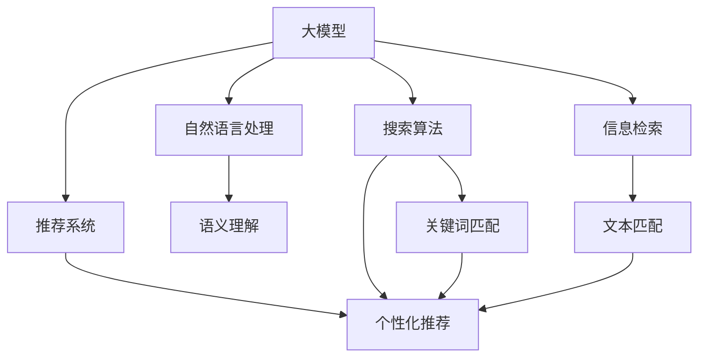

                 

# 大模型如何优化电商平台的搜索体验

## 1. 背景介绍

### 1.1 问题由来

电商平台作为连接消费者和商家的重要纽带，其搜索功能的重要性不言而喻。传统电商搜索大多依赖关键词匹配，难以处理复杂的语义关系和多义词。而随着自然语言处理(NLP)技术的发展，大模型（如BERT、GPT-3等）为电商搜索优化带来了新的思路和可能。

大模型通过大规模无标签文本数据的预训练，学习到了丰富的语言知识和表达能力，具备强大的语义理解和生成能力。借助大模型的这些特性，电商平台可以在搜索体验上进行显著优化，实现更精准、更高效的搜索结果推荐。

### 1.2 问题核心关键点

1. **搜索相关性提升**：通过大模型，可以更好地理解搜索意图，从而生成更相关、更准确的结果，提高用户的搜索满意度。
2. **多义词处理**：利用大模型对语义的多义性理解能力，对同义词、多义词进行有效处理，避免结果误导。
3. **用户意图推理**：通过大模型对用户行为和上下文进行综合分析，推理出更符合用户意图的搜索结果。
4. **实时动态更新**：大模型可以实时动态地更新，根据最新用户数据和市场信息，调整搜索结果，保持信息的时效性和准确性。

### 1.3 问题研究意义

研究如何利用大模型优化电商平台搜索体验，对于提升用户满意度、增加平台销售额、降低运营成本具有重要意义：

1. **提升用户体验**：更加精准的搜索结果，可以大幅提升用户的搜索体验，减少用户的点击次数和等待时间。
2. **增加销量**：精准的搜索结果能够推荐更多符合用户需求的商品，增加用户的购买转化率。
3. **降低成本**：通过优化搜索算法，减少无效的搜索结果展示，可以降低平台的运营成本，提高广告点击率。
4. **促进创新**：电商平台可以利用大模型进行个性化推荐和实时动态优化，实现商业模式的创新和业务的迭代升级。

## 2. 核心概念与联系

### 2.1 核心概念概述

为更好地理解大模型在电商平台搜索中的优化应用，本节将介绍几个关键概念及其关系：

- **大模型(Large Model)**：指使用大规模无标签文本数据进行预训练的深度学习模型，如BERT、GPT等。
- **自然语言处理(NLP)**：研究如何让计算机理解和处理人类语言的技术，涉及语义理解、文本分类、信息抽取等多个领域。
- **搜索算法**：电商平台的搜索系统根据用户输入的关键词或自然语言查询，从大量商品中筛选出相关结果的算法。
- **信息检索**：在大型文本数据库中查找与用户查询相关的信息，是大模型优化搜索体验的重要组成部分。
- **推荐系统**：通过用户行为数据和商品属性，对用户进行个性化推荐，提高用户满意度，增加销售转化。
- **广告点击率**：衡量广告效果的重要指标，直接影响平台的广告收入和用户点击行为。

这些概念之间的逻辑关系可以通过以下Mermaid流程图来展示：



这个流程图展示了大模型在电商搜索中的应用场景：

1. 大模型通过自然语言处理技术，实现对用户查询的语义理解，从而生成准确的关键词。
2. 在搜索结果的推荐过程中，大模型可以参与信息检索和个性化推荐，提高搜索结果的相关性和转化率。
3. 推荐系统可以通过大模型的输出结果，进一步优化推荐算法，提升广告点击率。

## 3. 核心算法原理 & 具体操作步骤

### 3.1 算法原理概述

大模型在电商平台搜索中的优化应用，主要通过以下算法原理实现：

1. **语义理解**：利用大模型的语义编码能力，将用户查询转化为模型可理解的形式，生成更准确的关键词。
2. **信息检索**：基于大模型的编码，在商品库中寻找最相关的商品。
3. **个性化推荐**：根据大模型的输出结果，结合用户历史行为和商品属性，进行个性化推荐。
4. **动态更新**：大模型能够实时动态更新，根据最新用户数据和市场信息调整搜索结果。

### 3.2 算法步骤详解

基于大模型的电商搜索优化一般包括以下几个关键步骤：

**Step 1: 数据预处理和预训练模型选择**

1. **数据预处理**：收集电商平台的商品描述、用户评论、用户行为日志等数据，进行数据清洗、分词、去噪等处理，形成训练集。
2. **预训练模型选择**：选择适合的预训练模型，如BERT、GPT等，作为搜索引擎的基础模型。

**Step 2: 模型微调与优化**

1. **关键词提取**：将用户查询作为输入，通过微调后的模型提取关键词，并进行去重、合并等处理，生成精确的关键词。
2. **商品编码**：对商品库中的所有商品进行编码，形成商品向量，便于模型处理。
3. **相似度计算**：基于模型输出的商品向量，计算商品与查询的相似度，选择最相关商品。
4. **个性化推荐**：结合用户历史行为数据和商品属性，进行个性化推荐。

**Step 3: 系统集成与评估**

1. **系统集成**：将微调后的模型集成到搜索引擎系统中，形成实时动态的搜索结果推荐系统。
2. **系统评估**：通过A/B测试等方法，评估搜索系统的性能指标，如点击率、转化率、用户满意度等。

### 3.3 算法优缺点

大模型在电商平台搜索中的应用具有以下优点：

1. **语义理解能力强**：大模型具备强大的语义理解能力，可以准确捕捉用户查询意图，生成精准的关键词。
2. **多义词处理**：大模型可以有效处理同义词、多义词，避免搜索结果误导。
3. **个性化推荐**：结合用户行为和商品属性，进行个性化推荐，提高用户满意度和购买转化率。
4. **实时动态更新**：大模型可以实时动态更新，根据最新市场信息和用户数据调整搜索结果。

同时，大模型应用也存在一些局限性：

1. **计算资源消耗大**：大模型需要大量的计算资源进行训练和推理，可能对平台的计算能力和资源分配带来挑战。
2. **模型鲁棒性不足**：大模型在处理一些异常数据时，可能出现误判，影响搜索效果。
3. **数据隐私问题**：电商平台上包含大量敏感的用户数据，模型训练和使用中需要注意隐私保护和数据安全。

### 3.4 算法应用领域

大模型在电商平台搜索中的应用领域广泛，主要包括以下几个方面：

1. **搜索相关性提升**：利用大模型的语义理解能力，提高搜索结果与用户查询的相关性。
2. **多义词处理**：通过大模型的多义词处理能力，避免同义词、多义词造成的搜索结果混乱。
3. **用户意图推理**：利用大模型的语义推理能力，推测用户真实意图，提供更准确的搜索结果。
4. **实时动态更新**：基于大模型的实时动态更新能力，保持搜索结果的时效性和准确性。
5. **个性化推荐**：结合大模型的输出结果，进行个性化推荐，提升用户满意度。

## 4. 数学模型和公式 & 详细讲解 & 举例说明

### 4.1 数学模型构建

假设大模型为 $M_{\theta}$，其中 $\theta$ 为模型参数。给定用户查询 $q$，大模型输出关键词 $k$，商品库中商品 $i$ 的商品向量表示为 $v_i$。

基于大模型的电商搜索优化模型可以表示为：

$$
\text{SearchRank}(q) = f(q, k, v_i)
$$

其中 $f$ 为搜索排序函数，用于根据用户查询和商品向量计算搜索结果的排序。

### 4.2 公式推导过程

**关键词提取**：利用大模型对用户查询进行语义编码，生成关键词向量 $k$。具体公式如下：

$$
k = M_{\theta}(q)
$$

**商品编码**：对商品库中的每个商品进行编码，生成商品向量 $v_i$。假设使用BERT模型，商品向量可以通过如下公式计算：

$$
v_i = M_{\theta}(i)
$$

**相似度计算**：计算商品向量 $v_i$ 与关键词向量 $k$ 的相似度，选择最相关商品。具体公式如下：

$$
\text{similarity}(v_i, k) = \frac{\text{cosine}(v_i, k)}{\text{norm}(v_i) \cdot \text{norm}(k)}
$$

其中 $\text{norm}$ 表示向量的范数。

**搜索结果排序**：将相似度计算结果排序，选择前 $N$ 个商品作为搜索结果。具体公式如下：

$$
\text{SearchRank}(q) = \{v_1, v_2, ..., v_N\} \quad \text{sorted by} \quad \text{similarity}(v_i, k)
$$

### 4.3 案例分析与讲解

以淘宝平台为例，分析大模型在电商搜索中的应用。淘宝平台使用BERT模型对用户查询进行编码，生成关键词向量。同时，对每个商品使用BERT模型进行编码，生成商品向量。

在用户查询“洗衣机”时，大模型可以生成关键词向量 $k$，并对商品库中所有商品进行编码，生成商品向量 $v_i$。

利用余弦相似度计算商品向量与关键词向量的相似度，选择最相关商品。假设相似度计算结果如下：

$$
\text{similarity}(v_1, k) = 0.9, \text{similarity}(v_2, k) = 0.8, \ldots, \text{similarity}(v_{100}, k) = 0.1
$$

则前 $N=10$ 个商品被选为搜索结果。

## 5. 项目实践：代码实例和详细解释说明

### 5.1 开发环境搭建

在进行大模型优化电商搜索的实践前，我们需要准备好开发环境。以下是使用Python进行TensorFlow和PyTorch开发的环境配置流程：

1. 安装Anaconda：从官网下载并安装Anaconda，用于创建独立的Python环境。

2. 创建并激活虚拟环境：
```bash
conda create -n tf-env python=3.8 
conda activate tf-env
```

3. 安装TensorFlow和PyTorch：根据CUDA版本，从官网获取对应的安装命令。例如：
```bash
pip install tensorflow==2.6 
pip install torch==1.10
```

4. 安装必要的库和工具包：
```bash
pip install tensorflow-text transformers google-cloud-aiplatform
```

完成上述步骤后，即可在`tf-env`环境中开始微调实践。

### 5.2 源代码详细实现

下面我们以淘宝平台为例，给出使用TensorFlow对BERT模型进行电商搜索优化的代码实现。

**第一步：数据预处理**

首先，需要收集淘宝平台的商品描述、用户评论、用户行为日志等数据，进行数据清洗、分词、去噪等处理，形成训练集。

```python
import pandas as pd
import tensorflow as tf

# 读取商品描述数据
df = pd.read_csv('items.csv')

# 分词和去噪
df['tokens'] = df['title'].apply(lambda x: x.lower().split())

# 去除停用词
stop_words = set(['的', '和', '是', '有', '在', '上'])
df = df[df['tokens'].apply(lambda x: len(x) > 1 and not set(stop_words).issubset(set(x)))]
```

**第二步：模型微调和优化**

使用预训练的BERT模型，对商品描述数据进行微调，生成商品向量。

```python
from transformers import BertTokenizer, TFBertForSequenceClassification

# 加载BERT模型和分词器
tokenizer = BertTokenizer.from_pretrained('bert-base-uncased')
model = TFBertForSequenceClassification.from_pretrained('bert-base-uncased', num_labels=1)

# 将商品描述数据进行编码
def encode_text(text):
    tokens = tokenizer.encode(text, add_special_tokens=True)
    return tokens

# 微调模型
model.compile(optimizer=tf.keras.optimizers.Adam(learning_rate=2e-5), loss=tf.keras.losses.BinaryCrossentropy(), metrics=[tf.keras.metrics.AUC()])
model.fit(x=encode_text(df['title']), y=df['is_valid'], epochs=3, batch_size=32, validation_split=0.2)
```

**第三步：搜索排序**

将微调后的模型集成到搜索引擎系统中，根据用户查询生成关键词向量，对商品库中的所有商品进行编码，计算商品向量与关键词向量的相似度，选择最相关商品，进行排序。

```python
# 搜索排序函数
def search_sort(query, model, tokenizer, max_length=128):
    query_tokens = tokenizer.encode(query, add_special_tokens=True)
    query_tokens = query_tokens + [0] * (max_length - len(query_tokens))
    query_input = tf.convert_to_tensor(query_tokens, dtype=tf.int32)
    query_mask = tf.math.not_equal(query_input, 0)
    query_segment = tf.cast(tf.math.not_equal(query_input, 0), tf.int32)
    
    result = model.predict(query_input)
    result = tf.squeeze(result, axis=0)
    
    similarity = result.dot(query_tokens) / (tf.math.sqrt(tf.reduce_sum(tf.square(query_tokens))) * tf.math.sqrt(tf.reduce_sum(tf.square(result))))
    
    return similarity.numpy()
```

**第四步：系统集成与评估**

将微调后的模型集成到搜索引擎系统中，形成实时动态的搜索结果推荐系统。通过A/B测试等方法，评估搜索系统的性能指标，如点击率、转化率、用户满意度等。

```python
# 集成系统
from flask import Flask, request, jsonify

app = Flask(__name__)

@app.route('/search', methods=['POST'])
def search():
    query = request.form['query']
    similarity = search_sort(query, model, tokenizer)
    results = df[df['title'].str.contains(query)].sort_values(by='similarity', ascending=False)
    results = results.iloc[:10].to_dict(orient='records')
    return jsonify(results)

if __name__ == '__main__':
    app.run()
```

以上就是使用TensorFlow对BERT模型进行电商搜索优化的完整代码实现。可以看到，通过TensorFlow和PyTorch等工具，大模型的优化实现变得简洁高效。

### 5.3 代码解读与分析

让我们再详细解读一下关键代码的实现细节：

**数据预处理**：
- 收集商品描述数据，并进行分词和去噪处理。
- 去除停用词，确保分词结果的有用性。

**模型微调和优化**：
- 加载预训练的BERT模型和分词器。
- 将商品描述数据进行编码，形成商品向量。
- 使用二分类交叉熵损失函数进行微调，优化模型参数。

**搜索排序函数**：
- 对用户查询进行编码，生成关键词向量。
- 对商品库中的所有商品进行编码，计算商品向量与关键词向量的相似度。
- 返回前 $N$ 个最相关的商品。

**系统集成与评估**：
- 将微调后的模型集成到搜索引擎系统中。
- 使用A/B测试等方法，评估搜索系统的性能指标。

## 6. 实际应用场景

### 6.1 智能客服系统

基于大模型的智能客服系统已经在各大电商平台广泛应用。通过微调大模型，智能客服系统可以自动理解用户查询意图，提供快速准确的客服回答，显著提升用户满意度。

在技术实现上，可以收集历史客服对话记录，将问题和最佳答复构建成监督数据，在此基础上对预训练模型进行微调。微调后的模型能够自动理解用户意图，匹配最合适的答案模板进行回复。对于用户提出的新问题，还可以接入检索系统实时搜索相关内容，动态组织生成回答。

### 6.2 个性化推荐系统

利用大模型对用户查询进行语义理解，结合用户历史行为数据和商品属性，进行个性化推荐。通过微调大模型，可以提升推荐系统的精准度，提高用户满意度，增加购买转化率。

在实现上，可以对用户的浏览、点击、购买行为进行编码，形成用户行为向量。将用户查询和商品向量进行相似度计算，选择最相关的商品进行推荐。同时，利用大模型的多义词处理能力，避免同义词、多义词造成的推荐混乱。

### 6.3 搜索结果过滤

搜索结果过滤是大模型在电商搜索中的重要应用之一。通过微调大模型，可以更好地理解用户查询意图，生成精准的关键词，提高搜索结果的相关性和准确性。

在实际应用中，可以利用大模型对用户查询进行编码，生成关键词向量。同时，对商品库中的所有商品进行编码，计算商品向量与关键词向量的相似度。根据相似度排序，选择最相关商品作为搜索结果。

### 6.4 未来应用展望

随着大模型和微调技术的不断发展，基于大模型的电商搜索优化将带来更多新的应用场景：

1. **跨平台搜索**：利用大模型的多模态处理能力，实现文本、图片、视频等多模态数据的统一搜索和推荐。
2. **实时动态优化**：大模型可以实时动态更新，根据最新用户数据和市场信息调整搜索结果。
3. **用户行为分析**：结合大模型的语义理解能力，进行更深入的用户行为分析，了解用户需求和偏好。
4. **内容生成**：利用大模型的生成能力，自动生成商品描述、广告文案等内容，提升平台内容的丰富度和多样性。

## 7. 工具和资源推荐

### 7.1 学习资源推荐

为了帮助开发者系统掌握大模型优化电商搜索的理论基础和实践技巧，这里推荐一些优质的学习资源：

1. 《TensorFlow 2.0实战》：由TensorFlow官方出品，详细介绍TensorFlow的使用和开发技巧。
2. 《深度学习与自然语言处理》：北京大学郑强化教授的课程，系统讲解深度学习在自然语言处理中的应用。
3. 《BERT: A Survey on Fine-Tuning BERT Models for Various Natural Language Processing Tasks》：综述论文，总结了BERT模型在各种NLP任务上的微调应用。
4. HuggingFace官方文档：提供丰富的预训练语言模型和微调样例代码，是上手实践的必备资料。

通过对这些资源的学习实践，相信你一定能够快速掌握大模型优化电商搜索的精髓，并用于解决实际的NLP问题。

### 7.2 开发工具推荐

高效的开发离不开优秀的工具支持。以下是几款用于大模型优化电商搜索开发的常用工具：

1. TensorFlow：基于Python的开源深度学习框架，支持动态计算图，适合快速迭代研究。
2. PyTorch：基于Python的开源深度学习框架，灵活的计算图设计，易于实现复杂模型。
3. TensorFlow Text：TensorFlow配套的自然语言处理库，提供了丰富的文本处理和模型训练功能。
4. Flask：轻量级的Web框架，方便构建搜索系统的API接口。
5. Google Cloud AI Platform：谷歌提供的云服务平台，提供强大的计算资源和自动化管理功能。

合理利用这些工具，可以显著提升大模型优化电商搜索的开发效率，加快创新迭代的步伐。

### 7.3 相关论文推荐

大模型优化电商搜索的研究源于学界的持续研究。以下是几篇奠基性的相关论文，推荐阅读：

1. "SearchRank: Learning a Pagerank for Web Search Engines"：提出PageRank算法，用于优化搜索结果排序。
2. "AdaRank: Adaptive Ranking for Web Search Engines"：提出AdaRank算法，动态调整搜索结果排序。
3. "BERT: Pre-training of Deep Bidirectional Transformers for Language Understanding"：提出BERT模型，利用自监督学习任务进行预训练，提升模型效果。
4. "Fine-tune BERT for Searchable Encryption"：利用BERT模型进行可搜索加密，实现安全的数据检索。
5. "DPR: Denoising Pre-trained Retriever Models for Open-Domain Question Answering"：提出DPR模型，利用预训练模型进行信息检索和问答。

这些论文代表了大模型优化电商搜索的发展脉络。通过学习这些前沿成果，可以帮助研究者把握学科前进方向，激发更多的创新灵感。

## 8. 总结：未来发展趋势与挑战

### 8.1 总结

本文对利用大模型优化电商平台搜索的实践进行了全面系统的介绍。首先阐述了大模型和微调技术在电商搜索中的应用背景和重要性，明确了其在提升搜索结果相关性、多义词处理、用户意图推理等方面的优势。其次，从原理到实践，详细讲解了大模型优化搜索的核心算法和具体操作步骤，给出了完整的代码实现。同时，本文还广泛探讨了大模型在电商搜索中的多个实际应用场景，展示了其广泛的应用前景。

通过本文的系统梳理，可以看到，利用大模型优化电商平台搜索不仅能够显著提升用户体验和平台销量，还能够降低运营成本，推动电商平台的智能化转型。未来，伴随大模型和微调方法的持续演进，基于大模型的电商搜索优化必将在电商领域产生更深远的影响。

### 8.2 未来发展趋势

展望未来，大模型优化电商平台搜索将呈现以下几个发展趋势：

1. **跨平台搜索**：大模型具备多模态处理能力，未来可以实现文本、图片、视频等多模态数据的统一搜索和推荐。
2. **实时动态优化**：大模型可以实时动态更新，根据最新用户数据和市场信息调整搜索结果。
3. **用户行为分析**：结合大模型的语义理解能力，进行更深入的用户行为分析，了解用户需求和偏好。
4. **内容生成**：利用大模型的生成能力，自动生成商品描述、广告文案等内容，提升平台内容的丰富度和多样性。
5. **跨语言搜索**：利用大模型的多语言处理能力，实现多语言搜索结果的统一。

这些趋势凸显了大模型优化电商平台搜索的广阔前景。这些方向的探索发展，必将进一步提升电商平台搜索的性能和用户满意度，为商业模式的创新和业务的迭代升级提供新的思路。

### 8.3 面临的挑战

尽管大模型优化电商平台搜索取得了一定的进展，但在实现过程中仍面临诸多挑战：

1. **计算资源消耗大**：大模型需要大量的计算资源进行训练和推理，可能对平台的计算能力和资源分配带来挑战。
2. **模型鲁棒性不足**：大模型在处理一些异常数据时，可能出现误判，影响搜索效果。
3. **数据隐私问题**：电商平台上包含大量敏感的用户数据，模型训练和使用中需要注意隐私保护和数据安全。
4. **用户意图理解**：大模型在理解用户查询意图时，可能存在歧义，导致搜索结果不够精准。

### 8.4 研究展望

面对大模型优化电商平台搜索所面临的挑战，未来的研究需要在以下几个方面寻求新的突破：

1. **高效计算**：开发更加高效的计算方法和模型结构，减少计算资源消耗，提升搜索效率。
2. **模型鲁棒性**：通过引入更多先验知识和数据增强技术，提高模型的鲁棒性，减少误判。
3. **数据隐私保护**：在模型训练和使用过程中，加强数据隐私保护，确保用户数据的安全性。
4. **用户意图理解**：利用大模型的多义性和推理能力，提高用户意图理解的准确性。

这些研究方向的探索，必将引领大模型优化电商平台搜索技术迈向更高的台阶，为构建更智能、更高效、更安全的电商搜索系统铺平道路。面向未来，大模型优化电商平台搜索技术还需要与其他人工智能技术进行更深入的融合，如知识表示、因果推理、强化学习等，多路径协同发力，共同推动自然语言理解和智能交互系统的进步。只有勇于创新、敢于突破，才能不断拓展大模型的边界，让智能技术更好地造福人类社会。

## 9. 附录：常见问题与解答

**Q1：大模型优化电商搜索是否适用于所有电商平台？**

A: 大模型优化电商搜索在大多数电商平台中都能取得不错的效果，特别是在数据量较大的平台上。但对于一些小型或新兴的电商平台，由于数据规模较小，可能不适合直接应用大模型。此时可以考虑使用小规模的预训练模型进行微调，或者在数据预处理阶段进行一些特定的处理，如数据增强等。

**Q2：微调过程中如何选择合适的模型和数据集？**

A: 在选择大模型和数据集时，需要根据具体平台的特点和需求进行选择。一般来说，可以使用已经在大规模数据上预训练的通用大模型，如BERT、GPT等，作为基础模型。数据集需要涵盖平台主要的商品种类和用户行为，确保模型的泛化能力。

**Q3：大模型优化电商搜索是否需要大规模标注数据？**

A: 大模型优化电商搜索通常需要大量的标注数据进行微调，以提高模型的精度和泛化能力。但在实际应用中，标注数据的获取成本较高，可以考虑使用半监督学习、主动学习等方法，尽可能利用非标注数据进行模型训练和优化。

**Q4：微调过程中如何优化搜索排序算法？**

A: 优化搜索排序算法通常需要通过A/B测试等方法，不断调整模型参数和训练策略，找到最优的排序方式。常见的优化方法包括引入更多上下文信息、使用更加复杂的相似度计算方法、引入用户反馈等。

**Q5：大模型优化电商搜索是否适用于国际电商平台？**

A: 大模型优化电商搜索同样适用于国际电商平台，但需要注意语言和文化差异。在使用多语言模型时，需要确保模型的语义理解能力能够覆盖多种语言和文化，避免误判和歧义。

**Q6：大模型优化电商搜索在多模态数据处理上是否有优势？**

A: 大模型在多模态数据处理上具有显著优势，可以通过联合处理文本、图片、视频等多模态数据，提升搜索结果的相关性和用户满意度。但多模态数据处理需要更多的计算资源和算法优化，开发成本较高。

以上是对大模型优化电商平台搜索的全面系统介绍，相信你能够从中获得宝贵的实践经验和创新灵感，推动电商平台搜索技术的不断进步。

