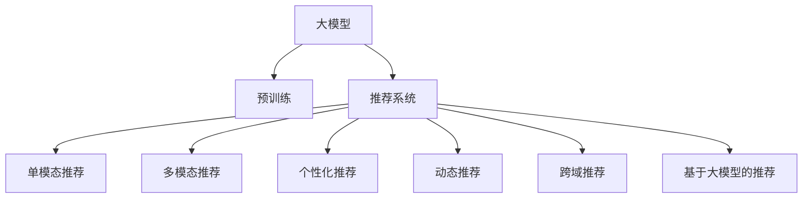

                 

# 大模型如何提升电商平台的用户参与度

> 关键词：大模型,电商平台,用户参与度,推荐系统,购物行为,个性化推荐

## 1. 背景介绍

### 1.1 问题由来

在当今竞争激烈的电商行业中，如何提升用户参与度和购物体验，以提高销售额和品牌忠诚度，是每个电商平台的共同课题。传统的电商推荐系统主要基于用户行为数据，如浏览历史、购买记录、点击行为等进行推荐，但这些数据往往难以覆盖用户所有行为和偏好。随着预训练语言模型的兴起，使用大模型进行用户行为预测和推荐，成为电商行业的新趋势。

大模型通过大规模文本数据的预训练，学习到丰富的语义知识和情感表达，能够在更广泛的场景中理解和生成自然语言。这些模型被应用于电商推荐，可以通过对用户评论、商品描述、产品评价等文本数据进行分析，全面捕捉用户的兴趣和需求，从而提升推荐效果，增加用户粘性。

### 1.2 问题核心关键点

大模型在提升电商平台用户参与度方面具有以下几个关键点：

- **全面理解用户需求**：大模型能够处理海量文本数据，从中提取出用户的兴趣、需求和情感，弥补传统行为数据的不足。
- **多模态数据融合**：大模型能够将文本、图片、视频等多模态数据进行融合，提供更为丰富的推荐结果。
- **个性化推荐**：大模型可以学习用户的个性化偏好，提供更加精准的推荐服务，提高用户满意度。
- **动态更新**：大模型可以通过不断微调，适应用户行为和市场变化，保持推荐内容的新鲜度。
- **跨域迁移**：大模型能够跨领域迁移，在相似的商品类别或上下文中，提供一致且相关的推荐。

### 1.3 问题研究意义

大模型应用于电商平台推荐，不仅能够提升用户体验和满意度，还能够增加用户参与度和平台忠诚度，从而实现商业价值的最大化。具体而言：

- **提升转化率**：精准的个性化推荐能够提高用户购买意向，增加转化率。
- **提高复购率**：基于用户历史行为和兴趣的推荐，能够增加用户复购的可能性。
- **增加用户粘性**：丰富的推荐内容和使用场景，能够增加用户停留时间，提高平台粘性。
- **拓展市场**：通过理解不同文化背景和地域特性的用户需求，能够拓展国际市场，提升全球影响力。
- **辅助运营决策**：大模型能够提供市场趋势和用户需求的洞察，辅助电商平台优化运营策略。

## 2. 核心概念与联系

### 2.1 核心概念概述

为更好地理解大模型在电商平台推荐中的应用，本节将介绍几个核心概念：

- **大模型(Large Model)**：以自回归(如GPT)或自编码(如BERT)模型为代表的大规模预训练语言模型。通过在大规模文本数据上进行预训练，学习到丰富的语义知识和情感表达，具备强大的语言理解和生成能力。

- **推荐系统(Recommendation System)**：通过分析用户行为数据，为用户推荐商品或内容，提升用户满意度和平台收益的系统。

- **预训练(Pre-training)**：指在大规模无标签文本语料上，通过自监督学习任务训练通用语言模型的过程。常见的预训练任务包括掩码语言模型、文本生成、知识蒸馏等。

- **微调(Fine-tuning)**：指在预训练模型的基础上，使用下游任务的少量标注数据，通过有监督学习优化模型在特定任务上的性能。

- **个性化推荐**：针对不同用户需求和兴趣，提供个性化的商品或内容推荐，提升用户满意度和平台收益。

- **多模态数据融合**：将文本、图片、视频等多模态数据进行融合，提供更为丰富和全面的推荐结果。

这些核心概念之间的逻辑关系可以通过以下Mermaid流程图来展示：



这个流程图展示了大模型的核心概念及其与推荐系统之间的联系：

1. 大模型通过预训练获得基础能力。
2. 推荐系统利用大模型进行商品或内容推荐。
3. 推荐系统可以进行单模态、多模态、个性化、动态和跨域推荐。
4. 最终，通过大模型进行基于内容的推荐，提升用户参与度和满意度。

## 3. 核心算法原理 & 具体操作步骤
### 3.1 算法原理概述

基于大模型的电商平台推荐系统，本质上是一个多模态的个性化推荐系统。其核心思想是：通过预训练模型学习通用语言表示，进而利用这些表示在特定商品或内容上进行个性化推荐。

具体而言，假设电商平台有$m$个商品，每个商品有一个文本描述$x_i \in \mathcal{X}$，模型学习到用户对商品$x_i$的评分$y_i \in [0,1]$。我们希望通过微调模型，使得模型的预测评分$y^{\hat{}_i}$逼近真实评分$y_i$。

微调的过程可以分为以下几个步骤：

1. 收集用户对商品的评分数据，构建训练集$D=\{(x_i,y_i)\}_{i=1}^m$。
2. 对大模型进行微调，设置合适的损失函数和优化算法。
3. 通过前向传播计算预测评分，通过反向传播更新模型参数。
4. 评估微调后的模型在验证集和测试集上的性能，选择最优模型进行部署。

### 3.2 算法步骤详解

基于大模型的电商平台推荐系统，具体实现步骤如下：

**Step 1: 数据预处理和模型初始化**
- 收集用户对商品的评分数据，构建训练集$D=\{(x_i,y_i)\}_{i=1}^m$。
- 选择大模型作为初始化参数，如BERT、GPT等。
- 对模型进行微调，设置合适的超参数，如学习率、批大小、迭代轮数等。

**Step 2: 设计损失函数**
- 定义模型在单个样本$(x_i,y_i)$上的损失函数$\ell(y^{\hat{}_i},y_i)$。
- 常见的损失函数包括均方误差、交叉熵等。

**Step 3: 前向传播和反向传播**
- 通过前向传播计算模型在样本$(x_i)$上的预测评分$y^{\hat{}_i}$。
- 通过反向传播计算模型参数的梯度，根据设定的优化算法更新参数。

**Step 4: 模型评估和部署**
- 在验证集和测试集上评估微调后的模型性能。
- 选择性能最优的模型进行部署，进行实时推荐。

### 3.3 算法优缺点

基于大模型的电商平台推荐系统具有以下优点：

1. **全面理解用户需求**：大模型能够处理大量文本数据，从中提取出用户的兴趣和需求，弥补传统行为数据的不足。
2. **多模态数据融合**：大模型能够将文本、图片、视频等多模态数据进行融合，提供更为丰富和全面的推荐结果。
3. **个性化推荐**：大模型可以学习用户的个性化偏好，提供更加精准的推荐服务，提高用户满意度。
4. **动态更新**：大模型可以通过不断微调，适应用户行为和市场变化，保持推荐内容的新鲜度。
5. **跨域迁移**：大模型能够跨领域迁移，在相似的商品类别或上下文中，提供一致且相关的推荐。

同时，该方法也存在一定的局限性：

1. **数据依赖性**：推荐系统的性能很大程度上取决于用户评分数据的质量和数量，获取高质量数据成本较高。
2. **计算资源需求**：预训练大模型和微调过程需要大量的计算资源，包括高性能计算设备和内存。
3. **模型复杂性**：大模型通常参数量巨大，推理速度较慢，增加了系统的复杂性。
4. **过拟合风险**：大规模数据和复杂模型的训练容易导致过拟合，需要应用正则化技术和数据增强等手段进行优化。
5. **可解释性不足**：推荐模型的决策过程难以解释，用户难以理解其背后的逻辑和依据。

尽管存在这些局限性，但就目前而言，基于大模型的推荐方法仍然在电商行业中得到广泛应用，成为提升用户参与度的重要手段。未来相关研究的重点在于如何进一步降低计算资源需求，提高推荐系统的可解释性，同时兼顾多模态数据融合和个性化推荐等前沿技术。

### 3.4 算法应用领域

基于大模型的推荐系统在电商平台中已经得到了广泛的应用，覆盖了几乎所有常见任务，例如：

- **商品推荐**：根据用户的历史浏览、购买记录和评价，推荐相关商品。
- **个性化标签**：给商品打上个性化的标签，帮助用户快速找到感兴趣的商品。
- **广告投放**：根据用户兴趣和行为，推荐适合的广告，提升广告点击率。
- **内容推荐**：推荐相关的文章、视频等，提升用户使用体验。
- **客服机器人**：使用大模型构建的聊天机器人，自动回答用户问题，提高客户满意度。

除了上述这些经典任务外，大模型推荐技术也被创新性地应用到更多场景中，如可控文本生成、实时需求预测、购物车推荐等，为电商平台带来了全新的突破。随着预训练模型和推荐方法的不断进步，相信电商平台推荐系统必将在更多场景下大放异彩。

## 4. 数学模型和公式 & 详细讲解  
### 4.1 数学模型构建

假设电商平台有$m$个商品，每个商品有一个文本描述$x_i \in \mathcal{X}$，模型学习到用户对商品$x_i$的评分$y_i \in [0,1]$。我们希望通过微调模型，使得模型的预测评分$y^{\hat{}_i}$逼近真实评分$y_i$。

定义模型$M_{\theta}$在单个样本$(x_i)$上的预测评分$y^{\hat{}_i}$，则损失函数$\ell$可以定义为：

$$
\ell(y^{\hat{}_i},y_i) = \frac{1}{m} \sum_{i=1}^m (y_i - y^{\hat{}_i})^2
$$

微调的过程是最小化损失函数$\ell$，即找到最优参数：

$$
\theta^* = \mathop{\arg\min}_{\theta} \ell(M_{\theta},D)
$$

在实践中，我们通常使用基于梯度的优化算法（如Adam、SGD等）来近似求解上述最优化问题。设$\eta$为学习率，$\lambda$为正则化系数，则参数的更新公式为：

$$
\theta \leftarrow \theta - \eta \nabla_{\theta}\ell(M_{\theta},D) - \eta\lambda\theta
$$

其中$\nabla_{\theta}\ell(M_{\theta},D)$为损失函数对参数$\theta$的梯度，可通过反向传播算法高效计算。

### 4.2 公式推导过程

以下我们以商品推荐任务为例，推导损失函数及其梯度的计算公式。

假设模型$M_{\theta}$在输入$x_i$上的预测评分$y^{\hat{}_i}$，其中$\theta$为模型参数。损失函数$\ell$定义为：

$$
\ell(y^{\hat{}_i},y_i) = \frac{1}{m} \sum_{i=1}^m (y_i - y^{\hat{}_i})^2
$$

根据链式法则，损失函数对参数$\theta_k$的梯度为：

$$
\frac{\partial \ell}{\partial \theta_k} = -\frac{2}{m} \sum_{i=1}^m \frac{\partial y^{\hat{}_i}}{\partial \theta_k} (y_i - y^{\hat{}_i})
$$

其中$\frac{\partial y^{\hat{}_i}}{\partial \theta_k}$为模型在输入$x_i$上的预测评分对参数$\theta_k$的梯度，可通过自动微分技术完成计算。

在得到损失函数的梯度后，即可带入参数更新公式，完成模型的迭代优化。重复上述过程直至收敛，最终得到适应电商平台推荐的最优模型参数$\theta^*$。

## 5. 项目实践：代码实例和详细解释说明
### 5.1 开发环境搭建

在进行电商平台推荐系统的微调实践前，我们需要准备好开发环境。以下是使用Python进行PyTorch开发的环境配置流程：

1. 安装Anaconda：从官网下载并安装Anaconda，用于创建独立的Python环境。

2. 创建并激活虚拟环境：
```bash
conda create -n pytorch-env python=3.8 
conda activate pytorch-env
```

3. 安装PyTorch：根据CUDA版本，从官网获取对应的安装命令。例如：
```bash
conda install pytorch torchvision torchaudio cudatoolkit=11.1 -c pytorch -c conda-forge
```

4. 安装Transformers库：
```bash
pip install transformers
```

5. 安装各类工具包：
```bash
pip install numpy pandas scikit-learn matplotlib tqdm jupyter notebook ipython
```

完成上述步骤后，即可在`pytorch-env`环境中开始推荐系统微调实践。

### 5.2 源代码详细实现

这里我们以商品推荐任务为例，给出使用Transformers库对BERT模型进行推荐系统微调的PyTorch代码实现。

首先，定义推荐任务的数据处理函数：

```python
from transformers import BertTokenizer
from torch.utils.data import Dataset
import torch

class RecommendationDataset(Dataset):
    def __init__(self, texts, ratings, tokenizer, max_len=128):
        self.texts = texts
        self.ratings = ratings
        self.tokenizer = tokenizer
        self.max_len = max_len
        
    def __len__(self):
        return len(self.texts)
    
    def __getitem__(self, item):
        text = self.texts[item]
        rating = self.ratings[item]
        
        encoding = self.tokenizer(text, return_tensors='pt', max_length=self.max_len, padding='max_length', truncation=True)
        input_ids = encoding['input_ids'][0]
        attention_mask = encoding['attention_mask'][0]
        
        # 对评分进行编码
        encoded_ratings = torch.tensor([rating], dtype=torch.float)
        return {'input_ids': input_ids, 
                'attention_mask': attention_mask,
                'labels': encoded_ratings}

# 评分数据
texts = ['商品A的描述', '商品B的描述', '商品C的描述']
ratings = [4.5, 3.2, 5.0]

# 创建dataset
tokenizer = BertTokenizer.from_pretrained('bert-base-cased')

train_dataset = RecommendationDataset(texts, ratings, tokenizer)
dev_dataset = RecommendationDataset(texts, ratings, tokenizer)
test_dataset = RecommendationDataset(texts, ratings, tokenizer)
```

然后，定义模型和优化器：

```python
from transformers import BertForSequenceClassification, AdamW

model = BertForSequenceClassification.from_pretrained('bert-base-cased', num_labels=1)

optimizer = AdamW(model.parameters(), lr=2e-5)
```

接着，定义训练和评估函数：

```python
from torch.utils.data import DataLoader
from tqdm import tqdm
from sklearn.metrics import mean_squared_error

device = torch.device('cuda') if torch.cuda.is_available() else torch.device('cpu')
model.to(device)

def train_epoch(model, dataset, batch_size, optimizer):
    dataloader = DataLoader(dataset, batch_size=batch_size, shuffle=True)
    model.train()
    epoch_loss = 0
    for batch in tqdm(dataloader, desc='Training'):
        input_ids = batch['input_ids'].to(device)
        attention_mask = batch['attention_mask'].to(device)
        labels = batch['labels'].to(device)
        model.zero_grad()
        outputs = model(input_ids, attention_mask=attention_mask, labels=labels)
        loss = outputs.loss
        epoch_loss += loss.item()
        loss.backward()
        optimizer.step()
    return epoch_loss / len(dataloader)

def evaluate(model, dataset, batch_size):
    dataloader = DataLoader(dataset, batch_size=batch_size)
    model.eval()
    preds, labels = [], []
    with torch.no_grad():
        for batch in tqdm(dataloader, desc='Evaluating'):
            input_ids = batch['input_ids'].to(device)
            attention_mask = batch['attention_mask'].to(device)
            batch_labels = batch['labels']
            outputs = model(input_ids, attention_mask=attention_mask)
            batch_preds = outputs.logits[0]
            batch_labels = batch_labels.to('cpu').tolist()
            for pred, label in zip(batch_preds, batch_labels):
                preds.append(pred.item())
                labels.append(label)
                
    return mean_squared_error(labels, preds)

```

最后，启动训练流程并在测试集上评估：

```python
epochs = 5
batch_size = 16

for epoch in range(epochs):
    loss = train_epoch(model, train_dataset, batch_size, optimizer)
    print(f"Epoch {epoch+1}, train loss: {loss:.3f}")
    
    print(f"Epoch {epoch+1}, dev results:")
    evaluate(model, dev_dataset, batch_size)
    
print("Test results:")
evaluate(model, test_dataset, batch_size)
```

以上就是使用PyTorch对BERT进行商品推荐任务微调的完整代码实现。可以看到，得益于Transformers库的强大封装，我们可以用相对简洁的代码完成BERT模型的加载和微调。

### 5.3 代码解读与分析

让我们再详细解读一下关键代码的实现细节：

**RecommendationDataset类**：
- `__init__`方法：初始化文本、评分、分词器等关键组件。
- `__len__`方法：返回数据集的样本数量。
- `__getitem__`方法：对单个样本进行处理，将文本输入编码为token ids，将评分转换为浮点数，并对其进行定长padding，最终返回模型所需的输入。

**评分数据**：
- 定义了商品描述和评分数据，这些数据将用于构建推荐系统微调的训练集。

**训练和评估函数**：
- 使用PyTorch的DataLoader对数据集进行批次化加载，供模型训练和推理使用。
- 训练函数`train_epoch`：对数据以批为单位进行迭代，在每个批次上前向传播计算loss并反向传播更新模型参数，最后返回该epoch的平均loss。
- 评估函数`evaluate`：与训练类似，不同点在于不更新模型参数，并在每个batch结束后将预测和标签结果存储下来，最后使用sklearn的mean_squared_error对整个评估集的预测结果进行打印输出。

**训练流程**：
- 定义总的epoch数和batch size，开始循环迭代
- 每个epoch内，先在训练集上训练，输出平均loss
- 在验证集上评估，输出评分误差
- 所有epoch结束后，在测试集上评估，给出最终测试结果

可以看到，PyTorch配合Transformers库使得BERT微调的代码实现变得简洁高效。开发者可以将更多精力放在数据处理、模型改进等高层逻辑上，而不必过多关注底层的实现细节。

当然，工业级的系统实现还需考虑更多因素，如模型的保存和部署、超参数的自动搜索、更灵活的任务适配层等。但核心的微调范式基本与此类似。

## 6. 实际应用场景
### 6.1 智能推荐引擎

基于大模型的电商平台推荐系统，可以构建智能推荐引擎，为用户提供个性化的商品推荐。推荐引擎能够根据用户的浏览、购买历史，以及商品属性、评价等信息，智能生成个性化的推荐结果，提升用户购物体验。

在技术实现上，可以收集用户的历史行为数据，结合商品描述和评价等信息，构建监督数据。在此基础上对预训练模型进行微调，使其能够学习用户对商品的评分预测能力。微调后的模型能够根据用户的兴趣和需求，实时生成推荐列表，提高用户的点击率和购买率。

### 6.2 用户画像分析

电商平台可以通过对用户评论、浏览历史等文本数据进行分析，构建用户画像，为用户提供更加精准的服务。用户画像能够反映用户的兴趣、需求和偏好，帮助电商平台制定个性化的运营策略，提升用户体验和满意度。

在实现上，可以通过对用户评论数据进行情感分析，识别用户的情绪状态。根据用户情绪，调整推荐策略，推荐合适的商品。同时，通过分析用户的历史行为数据，构建用户画像，根据不同用户画像制定个性化的营销方案，提高用户粘性和平台收益。

### 6.3 新商品推荐

电商平台需要不断引入新商品，以吸引用户注意力和提升销量。基于大模型的推荐系统，可以快速评估新商品的潜力和价值，进行精准的推荐。

具体而言，可以通过收集新商品的用户评价、专家评论等信息，构建监督数据。在此基础上对预训练模型进行微调，使其能够学习新商品的用户评分。微调后的模型能够根据新商品的属性和用户画像，实时推荐合适的商品，提高新商品的上架率和销量。

### 6.4 未来应用展望

随着大模型和推荐方法的不断发展，基于微调范式将在更多领域得到应用，为电商平台带来变革性影响。

在智能客服系统方面，使用大模型构建的智能客服机器人，能够理解用户查询并给出精准回答，提升客服效率和用户满意度。在营销策略优化方面，通过对用户行为和情感的分析，制定个性化的营销方案，提升广告点击率和转化率。在供应链管理方面，通过对用户需求和市场趋势的分析，优化库存和物流管理，提升供应链效率。

此外，在社交电商、跨境电商、在线教育等更多领域，基于大模型的推荐技术也将不断涌现，为电商行业的数字化转型升级提供新的动力。相信随着技术的日益成熟，大模型推荐方法必将在电商行业中大放异彩，推动电商行业向更加智能化、个性化、规模化的方向发展。

## 7. 工具和资源推荐
### 7.1 学习资源推荐

为了帮助开发者系统掌握大模型在电商平台推荐中的应用，这里推荐一些优质的学习资源：

1. 《Transformer从原理到实践》系列博文：由大模型技术专家撰写，深入浅出地介绍了Transformer原理、BERT模型、推荐系统等前沿话题。

2. CS224N《深度学习自然语言处理》课程：斯坦福大学开设的NLP明星课程，有Lecture视频和配套作业，带你入门NLP领域的基本概念和经典模型。

3. 《Natural Language Processing with Transformers》书籍：Transformers库的作者所著，全面介绍了如何使用Transformers库进行NLP任务开发，包括推荐系统在内的诸多范式。

4. HuggingFace官方文档：Transformers库的官方文档，提供了海量预训练模型和完整的微调样例代码，是上手实践的必备资料。

5. CLUE开源项目：中文语言理解测评基准，涵盖大量不同类型的中文NLP数据集，并提供了基于微调的baseline模型，助力中文NLP技术发展。

通过对这些资源的学习实践，相信你一定能够快速掌握大模型在电商平台推荐中的应用精髓，并用于解决实际的NLP问题。
###  7.2 开发工具推荐

高效的开发离不开优秀的工具支持。以下是几款用于电商平台推荐系统开发的常用工具：

1. PyTorch：基于Python的开源深度学习框架，灵活动态的计算图，适合快速迭代研究。大部分预训练语言模型都有PyTorch版本的实现。

2. TensorFlow：由Google主导开发的开源深度学习框架，生产部署方便，适合大规模工程应用。同样有丰富的预训练语言模型资源。

3. Transformers库：HuggingFace开发的NLP工具库，集成了众多SOTA语言模型，支持PyTorch和TensorFlow，是进行推荐系统微调开发的重要工具。

4. Weights & Biases：模型训练的实验跟踪工具，可以记录和可视化模型训练过程中的各项指标，方便对比和调优。与主流深度学习框架无缝集成。

5. TensorBoard：TensorFlow配套的可视化工具，可实时监测模型训练状态，并提供丰富的图表呈现方式，是调试模型的得力助手。

6. Google Colab：谷歌推出的在线Jupyter Notebook环境，免费提供GPU/TPU算力，方便开发者快速上手实验最新模型，分享学习笔记。

合理利用这些工具，可以显著提升电商平台推荐系统的开发效率，加快创新迭代的步伐。

### 7.3 相关论文推荐

大模型应用于电商平台推荐，源于学界的持续研究。以下是几篇奠基性的相关论文，推荐阅读：

1. Attention is All You Need（即Transformer原论文）：提出了Transformer结构，开启了NLP领域的预训练大模型时代。

2. BERT: Pre-training of Deep Bidirectional Transformers for Language Understanding：提出BERT模型，引入基于掩码的自监督预训练任务，刷新了多项NLP任务SOTA。

3. Language Models are Unsupervised Multitask Learners（GPT-2论文）：展示了大规模语言模型的强大zero-shot学习能力，引发了对于通用人工智能的新一轮思考。

4. Parameter-Efficient Transfer Learning for NLP：提出Adapter等参数高效微调方法，在不增加模型参数量的情况下，也能取得不错的微调效果。

5. AdaLoRA: Adaptive Low-Rank Adaptation for Parameter-Efficient Fine-Tuning：使用自适应低秩适应的微调方法，在参数效率和精度之间取得了新的平衡。

这些论文代表了大模型在推荐系统中的应用发展脉络。通过学习这些前沿成果，可以帮助研究者把握学科前进方向，激发更多的创新灵感。

## 8. 总结：未来发展趋势与挑战

### 8.1 总结

本文对基于大模型的电商平台推荐系统进行了全面系统的介绍。首先阐述了电商平台推荐系统的背景和意义，明确了大模型在提升用户参与度方面的独特价值。其次，从原理到实践，详细讲解了大模型的数学模型构建和微调过程，给出了推荐系统微调的完整代码实现。同时，本文还广泛探讨了大模型推荐系统在智能推荐引擎、用户画像分析、新商品推荐等电商场景中的应用前景，展示了微调范式的巨大潜力。此外，本文精选了推荐系统的各类学习资源，力求为开发者提供全方位的技术指引。

通过本文的系统梳理，可以看到，基于大模型的推荐系统已经在电商平台中得到广泛应用，成为提升用户参与度的重要手段。未来，伴随大模型和推荐方法的不断进步，推荐系统将在更多场景下大放异彩，为电商平台带来全新的突破。

### 8.2 未来发展趋势

展望未来，基于大模型的电商平台推荐系统将呈现以下几个发展趋势：

1. **多模态推荐**：大模型能够将文本、图片、视频等多模态数据进行融合，提供更为丰富和全面的推荐结果。
2. **跨域迁移**：大模型能够跨领域迁移，在相似的商品类别或上下文中，提供一致且相关的推荐。
3. **个性化推荐**：大模型可以学习用户的个性化偏好，提供更加精准的推荐服务，提高用户满意度。
4. **动态更新**：大模型可以通过不断微调，适应用户行为和市场变化，保持推荐内容的新鲜度。
5. **实时推荐**：大模型可以实时处理用户查询和反馈，快速调整推荐策略，提高用户体验。
6. **公平性**：大模型可以通过优化训练过程，减少算法偏见，提供公平的推荐服务。
7. **隐私保护**：大模型可以通过差分隐私等技术，保护用户数据隐私，提高用户信任度。

以上趋势凸显了大模型在电商平台推荐系统中的应用前景。这些方向的探索发展，必将进一步提升推荐系统的性能和应用范围，为电商平台带来更高的商业价值。

### 8.3 面临的挑战

尽管大模型在电商平台推荐系统中的应用已取得显著成效，但在迈向更加智能化、普适化应用的过程中，它仍面临诸多挑战：

1. **数据依赖性**：推荐系统的性能很大程度上取决于用户评分数据的质量和数量，获取高质量数据成本较高。
2. **计算资源需求**：预训练大模型和微调过程需要大量的计算资源，包括高性能计算设备和内存。
3. **模型复杂性**：大模型通常参数量巨大，推理速度较慢，增加了系统的复杂性。
4. **过拟合风险**：大规模数据和复杂模型的训练容易导致过拟合，需要应用正则化技术和数据增强等手段进行优化。
5. **可解释性不足**：推荐模型的决策过程难以解释，用户难以理解其背后的逻辑和依据。
6. **隐私和安全**：推荐系统需要处理大量用户数据，存在数据泄露和隐私侵犯的风险。

尽管存在这些挑战，但通过不断探索和创新，相信大模型推荐系统能够克服这些难题，在电商行业中发挥更大的价值。未来，研究者需要在数据获取、计算资源优化、模型复杂性控制、公平性保证等方面进行深入研究，以推动大模型推荐技术的不断进步。

### 8.4 研究展望

面向未来，大模型推荐系统需要从以下几个方面进行研究：

1. **多模态数据融合**：将文本、图片、视频等多模态数据进行融合，提供更为丰富和全面的推荐结果。
2. **跨领域迁移**：通过跨领域迁移学习，提高推荐系统的泛化能力，适应更多应用场景。
3. **实时推荐系统**：构建实时推荐系统，快速处理用户查询和反馈，提高用户体验。
4. **个性化推荐**：通过个性化推荐，提升用户满意度和平台收益。
5. **公平性优化**：通过优化训练过程，减少算法偏见，提供公平的推荐服务。
6. **隐私保护**：通过差分隐私等技术，保护用户数据隐私，提高用户信任度。
7. **可解释性增强**：通过可解释性技术，提高推荐系统的透明度，增强用户信任。

这些研究方向将进一步推动大模型推荐技术的成熟和发展，为电商平台推荐系统带来更多的创新和突破。通过不断的技术创新和实践探索，相信大模型推荐系统必将在电商行业中大放异彩，推动电商行业向更加智能化、个性化、规模化的方向发展。

## 9. 附录：常见问题与解答

**Q1：大模型在电商平台推荐中是否适用于所有类型的商品？**

A: 大模型在电商平台推荐中适用于大多数类型的商品，但不同商品类别的推荐难度和效果可能有所不同。对于高度抽象或专业化较强的商品，大模型可能需要更多的数据和预训练才能提供准确的推荐。同时，对于一些需要深度理解的领域，如医疗、金融等，可能需要结合领域知识进行微调。

**Q2：如何选择合适的预训练模型？**

A: 选择预训练模型时，需要考虑商品属性、用户画像和推荐场景的差异。常见预训练模型包括BERT、GPT、RoBERTa等，可以根据具体需求进行选择。对于电商场景，BERT和RoBERTa等结构较为简单的模型通常表现较好。同时，可以结合领域特定的预训练任务进行微调，如针对电商评论的情感分析等。

**Q3：微调过程中如何处理商品描述中的特殊字符和噪音？**

A: 在处理商品描述时，可以使用分词和去噪技术，去除特殊字符和噪音数据。同时，可以使用BERT等模型对商品描述进行预处理，提取出关键词和语义信息。对于特殊字符和噪音，可以通过正则表达式或数据清洗技术进行处理。

**Q4：微调过程中如何避免过拟合？**

A: 为了避免过拟合，可以应用正则化技术和数据增强等方法。常见的正则化技术包括L2正则、Dropout、Early Stopping等。数据增强可以通过回译、近义替换等方式扩充训练集，提高模型的泛化能力。同时，可以使用AdamW等优化器，结合自适应学习率调度，控制训练过程中的过拟合风险。

**Q5：微调后的模型如何部署？**

A: 微调后的模型可以通过保存模型参数和配置文件的方式进行部署。部署环境可以使用Python、TensorFlow、PyTorch等框架搭建，根据需求选择适合的方式进行部署。常见的部署方式包括API接口、微服务、Docker容器等，可根据实际应用场景进行选择。

综上所述，基于大模型的电商平台推荐系统具有广泛的应用前景和巨大的商业价值。通过不断优化模型、数据和算法，提升推荐系统的性能和用户体验，大模型推荐技术必将在电商行业大放异彩，推动电商行业向更加智能化、个性化、规模化的方向发展。

