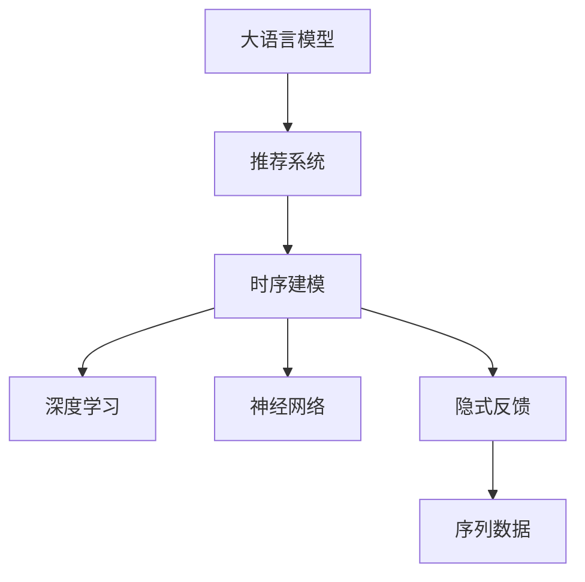

                 

# 大模型对推荐系统时序建模的影响研究

> 关键词：大模型, 推荐系统, 时序建模, 深度学习, 神经网络, 隐式反馈, 序列数据

## 1. 背景介绍

在信息时代，推荐系统作为互联网产品的重要组成部分，帮助用户发现感兴趣的内容，极大地提升了用户体验和平台活跃度。随着推荐系统的发展，研究者们逐步发现，用户的兴趣和行为模式往往具有强烈的时序性，即用户对内容的偏好和互动会在一段时间内发生变化。这种时序性被称作序列模式(sequence pattern)，对推荐系统建模提出了新的要求。

在传统推荐系统中，推荐算法往往基于静态的特征或短期的历史行为数据进行建模。然而，这种短视的视角忽略了时间因素，无法捕捉用户兴趣和行为随时间变化的动态特征。时序建模(Sequence Modeling)应运而生，旨在捕捉用户行为的长期时序性，挖掘其中的潜在模式，为推荐系统提供更准确的预测和推荐。

时序建模技术在推荐系统中获得了广泛应用，例如用户行为序列预测、个性化推荐序列生成等。在大数据和深度学习技术快速发展的背景下，时序建模方法逐步向更深层次、更高效、更普适的方向演进。大语言模型（Large Language Model, LLMs）作为当下最炙手可热的人工智能技术之一，其强大的表征能力和学习能力，为推荐系统的时序建模带来了新的可能。本文旨在深入探讨大模型在推荐系统时序建模中的应用，并研究其对推荐系统性能的潜在影响。

## 2. 核心概念与联系

### 2.1 核心概念概述

为更好地理解大模型对推荐系统时序建模的影响，本节将介绍几个密切相关的核心概念：

- **大语言模型（LLMs）**：以自回归（如GPT）或自编码（如BERT）模型为代表的大规模预训练语言模型。通过在大规模无标签文本语料上进行预训练，学习通用的语言表示，具备强大的语言理解和生成能力。

- **推荐系统（Recommender System）**：一种信息过滤系统，通过分析用户的行为数据，向用户推荐可能感兴趣的内容。常见的推荐方式包括协同过滤、基于内容的推荐、混合推荐等。

- **时序建模（Sequence Modeling）**：旨在捕捉和预测序列数据中的时序性模式的技术，如循环神经网络（RNN）、长短时记忆网络（LSTM）、门控循环单元（GRU）等。时序建模在用户行为预测、推荐系统序列生成等任务中均有重要应用。

- **深度学习（Deep Learning）**：一种基于多层神经网络的机器学习方法，能够自动从数据中学习高层次的特征表示。深度学习在图像识别、语音识别、自然语言处理等领域均取得了突破性进展。

- **神经网络（Neural Network）**：由多个神经元组成的网络结构，能够实现复杂非线性映射。神经网络在推荐系统时序建模中被广泛应用。

- **隐式反馈（Implicit Feedback）**：用户在推荐系统中行为的一种非显式表达方式，如点击、停留时间、浏览路径等，比显式反馈（Explicit Feedback）更加丰富和多样。

- **序列数据（Sequential Data）**：指在时间维度上具有明确顺序的数据，如用户行为序列、物品推荐序列等。序列数据的时序性特征对推荐系统建模至关重要。

这些核心概念之间的逻辑关系可以通过以下Mermaid流程图来展示：



这个流程图展示了大语言模型在推荐系统中的应用框架，以及其与推荐系统各组成部分的紧密联系。

## 3. 核心算法原理 & 具体操作步骤
### 3.1 算法原理概述

大语言模型在推荐系统时序建模中的核心作用在于其强大的表征能力。通过预训练获得的大规模语料信息，大模型能够学习到丰富的语言知识，并将其应用于推荐系统的各个环节。

具体来说，大模型对推荐系统时序建模的影响主要体现在以下几个方面：

- **特征表示**：大模型能够将用户行为数据转换为更加复杂和深刻的特征表示，捕捉其中的隐含模式。
- **预测建模**：通过在大模型上进行微调，可以获得更加准确的行为序列预测模型。
- **序列生成**：大模型能够根据用户的历史行为生成个性化的推荐序列。
- **知识迁移**：大模型在预训练过程中学习到的广泛知识，可以迁移到不同的推荐任务中，提升任务性能。

### 3.2 算法步骤详解

基于大语言模型的推荐系统时序建模一般包括以下几个关键步骤：

**Step 1: 准备预训练模型和数据集**
- 选择合适的预训练语言模型 $M_{\theta}$ 作为初始化参数，如 BERT、GPT 等。
- 准备推荐系统的序列数据集 $D=\{(x_i,y_i)\}_{i=1}^N$，其中 $x_i$ 表示用户行为序列，$y_i$ 表示推荐结果（如物品ID）。

**Step 2: 设计序列模型架构**
- 在预训练模型的基础上设计序列建模网络结构，包括编码器、解码器、层级架构等。
- 根据具体任务，选择合适的时序模型，如 RNN、LSTM、GRU 等。
- 将大模型作为特征提取器，对用户行为序列进行编码。

**Step 3: 添加任务适配层**
- 在序列模型的顶层设计合适的输出层和损失函数。
- 对于推荐任务，通常在顶层添加线性分类器或神经网络，以最大化推荐准确度。
- 使用交叉熵损失函数作为推荐任务的目标函数。

**Step 4: 设置微调超参数**
- 选择合适的优化算法及其参数，如 Adam、SGD 等，设置学习率、批大小、迭代轮数等。
- 设置正则化技术及强度，包括权重衰减、Dropout、Early Stopping 等。
- 确定冻结预训练参数的策略，如仅微调顶层，或全部参数都参与微调。

**Step 5: 执行梯度训练**
- 将训练集数据分批次输入模型，前向传播计算损失函数。
- 反向传播计算参数梯度，根据设定的优化算法和学习率更新模型参数。
- 周期性在验证集上评估模型性能，根据性能指标决定是否触发 Early Stopping。
- 重复上述步骤直到满足预设的迭代轮数或 Early Stopping 条件。

**Step 6: 测试和部署**
- 在测试集上评估微调后模型 $M_{\hat{\theta}}$ 的性能，对比微调前后的精度提升。
- 使用微调后的模型对新样本进行推理预测，集成到实际的应用系统中。
- 持续收集新的数据，定期重新微调模型，以适应数据分布的变化。

以上是基于大语言模型的推荐系统时序建模的一般流程。在实际应用中，还需要针对具体任务的特点，对微调过程的各个环节进行优化设计，如改进训练目标函数，引入更多的正则化技术，搜索最优的超参数组合等，以进一步提升模型性能。

### 3.3 算法优缺点

基于大语言模型的推荐系统时序建模方法具有以下优点：

1. **特征表示能力强**：大模型能够捕捉用户行为的复杂时序性，生成更加全面和深刻的特征表示。
2. **准确性高**：通过在大模型上进行微调，推荐模型的预测准确度显著提升。
3. **序列生成能力强**：大模型能够根据用户历史行为生成个性化的推荐序列，提升推荐效果。
4. **知识迁移能力强**：大模型在预训练过程中学习到的广泛知识，可以迁移到不同的推荐任务中，提升任务性能。

同时，该方法也存在一些局限性：

1. **计算资源需求高**：大模型的预训练和微调需要大量的计算资源，尤其是在大规模序列数据上。
2. **模型复杂度高**：大语言模型通常具有较高的模型复杂度，需要更多的计算资源进行训练和推理。
3. **过拟合风险高**：大模型容易过拟合，特别是在小规模数据集上。
4. **泛化能力有待提升**：大模型在小样本上的泛化能力可能较差，需要更多的数据和调整来提高模型泛化性能。
5. **解释性不足**：大模型的决策过程通常缺乏可解释性，难以对其推理逻辑进行分析和调试。

尽管存在这些局限性，但就目前而言，基于大语言模型的推荐系统时序建模方法仍是大规模推荐系统的重要研究范式。未来相关研究的重点在于如何进一步降低大模型的计算资源需求，提高模型的少样本学习和跨领域迁移能力，同时兼顾可解释性和伦理安全性等因素。

### 3.4 算法应用领域

基于大语言模型的推荐系统时序建模方法在推荐系统领域已经得到了广泛的应用，覆盖了推荐系统的主要任务，例如：

- 用户行为序列预测：如基于深度学习的用户点击序列预测、停留时间预测等。
- 个性化推荐序列生成：如基于深度学习的用户兴趣序列生成、物品推荐序列生成等。
- 推荐结果排序：如基于深度学习的推荐结果排序，提高推荐系统准确度。
- 推荐系统序列学习：如基于深度学习的推荐系统序列生成、序列推荐等。

除了上述这些经典任务外，大语言模型时序建模方法还被创新性地应用到更多场景中，如推荐系统的公平性优化、推荐系统对抗训练、推荐系统自监督学习等，为推荐系统技术的发展提供了新的思路和方向。

## 4. 数学模型和公式 & 详细讲解  
### 4.1 数学模型构建

本节将使用数学语言对基于大语言模型的推荐系统时序建模过程进行更加严格的刻画。

记用户行为序列为 $x=\{x_1, x_2, ..., x_t\}$，其中 $x_i$ 表示用户第 $i$ 个行为。推荐系统序列建模任务的目标是，在给定用户行为序列 $x$ 的情况下，预测其推荐结果 $y$。设推荐系统模型为 $M_{\theta}$，其中 $\theta$ 为模型参数。

定义模型 $M_{\theta}$ 在用户行为序列 $x$ 上的输出为 $y=M_{\theta}(x)$。

模型训练的目标是最小化预测误差，即：

$$
\mathcal{L}(\theta) = -\sum_{i=1}^N \log M_{\theta}(x_i) \delta_{y_i}
$$

其中 $\delta_{y_i}$ 为推荐结果 $y_i$ 的one-hot编码。在模型训练时，使用交叉熵损失函数作为目标函数。

### 4.2 公式推导过程

以LSTM为例，对推荐系统时序建模的数学公式进行推导。

LSTM是一种经典的循环神经网络，能够处理序列数据的复杂时序性。假设用户行为序列的长度为 $t$，LSTM模型的架构如下：


其中，输入门（input gate）、遗忘门（forget gate）、输出门（output gate）和记忆细胞（cell）是LSTM的核心组件。通过输入门控制新的信息输入，通过遗忘门控制旧的信息遗忘，通过输出门控制信息的输出。

对于用户行为序列 $x=\{x_1, x_2, ..., x_t\}$，LSTM模型的输出 $y$ 可以表示为：

$$
y = \sigma(W_x x + U_h \bar{h}_{t-1} + b_x)
$$

其中，$W_x$、$U_h$、$b_x$ 为模型参数。

在LSTM模型中，用户行为序列 $x$ 通过多层LSTM网络进行编码，每层LSTM的输出 $\bar{h}_t$ 可以表示为：

$$
\bar{h}_t = f(x, \bar{h}_{t-1})
$$

其中，$f$ 为LSTM模型。

在得到用户行为序列的编码表示后，可以将其输入到一个分类器中，进行推荐结果的预测。分类器的输出 $y$ 可以表示为：

$$
y = softmax(W_y \bar{h}_t + b_y)
$$

其中，$W_y$、$b_y$ 为分类器的参数。

通过上述公式，可以看到，LSTM在推荐系统时序建模中的应用，通过捕捉用户行为的长期时序性，生成推荐结果的复杂特征表示。

### 4.3 案例分析与讲解

以基于LSTM的用户点击序列预测为例，对推荐系统时序建模的方法进行详细讲解。

假设用户的历史点击序列为 $x=\{x_1, x_2, ..., x_t\}$，其中 $x_i$ 表示用户第 $i$ 个点击行为。推荐系统序列建模的目标是，预测用户下一次点击行为 $y$。

首先，将用户点击序列 $x$ 输入到多层LSTM网络中，得到用户行为序列的编码表示 $\bar{h}_t$。然后，将编码表示 $\bar{h}_t$ 输入到一个分类器中，进行推荐结果的预测。

具体实现流程如下：

1. 准备LSTM模型和数据集：
```python
import torch
import torch.nn as nn
import torch.optim as optim
from torch.utils.data import DataLoader

# 定义LSTM模型
class LSTM(nn.Module):
    def __init__(self, input_size, hidden_size):
        super(LSTM, self).__init__()
        self.hidden_size = hidden_size
        self.lstm = nn.LSTM(input_size, hidden_size, batch_first=True)
        self.fc = nn.Linear(hidden_size, num_classes)
        
    def forward(self, x):
        h0 = torch.zeros(1, x.size(0), self.hidden_size).to(device)
        c0 = torch.zeros(1, x.size(0), self.hidden_size).to(device)
        out, _ = self.lstm(x, (h0, c0))
        out = self.fc(out[:, -1, :])
        return out

# 准备数据集
train_dataset = ...
train_loader = DataLoader(train_dataset, batch_size=batch_size, shuffle=True)

# 准备模型和优化器
model = LSTM(input_size, hidden_size)
optimizer = optim.Adam(model.parameters(), lr=learning_rate)
criterion = nn.CrossEntropyLoss()
device = torch.device('cuda' if torch.cuda.is_available() else 'cpu')
model.to(device)
```

2. 定义训练和评估函数：
```python
def train_epoch(model, data_loader, optimizer, criterion):
    model.train()
    total_loss = 0
    for batch in data_loader:
        x, y = batch
        x, y = x.to(device), y.to(device)
        optimizer.zero_grad()
        out = model(x)
        loss = criterion(out, y)
        loss.backward()
        optimizer.step()
        total_loss += loss.item()
    return total_loss / len(data_loader)

def evaluate(model, data_loader, criterion):
    model.eval()
    total_loss = 0
    total_correct = 0
    with torch.no_grad():
        for batch in data_loader:
            x, y = batch
            x, y = x.to(device), y.to(device)
            out = model(x)
            loss = criterion(out, y)
            total_loss += loss.item()
            total_correct += (torch.argmax(out, dim=1) == y).sum().item()
    return total_correct / len(data_loader), total_loss / len(data_loader)
```

3. 启动训练流程并在测试集上评估：
```python
epochs = 10
batch_size = 64
learning_rate = 0.001

for epoch in range(epochs):
    train_loss = train_epoch(model, train_loader, optimizer, criterion)
    val_acc, val_loss = evaluate(model, val_loader, criterion)
    print(f'Epoch {epoch+1}, train loss: {train_loss:.4f}, val acc: {val_acc:.4f}, val loss: {val_loss:.4f}')

# 在测试集上评估
test_acc, test_loss = evaluate(model, test_loader, criterion)
print(f'Test acc: {test_acc:.4f}, test loss: {test_loss:.4f}')
```

以上就是基于LSTM的推荐系统时序建模的完整代码实现。可以看到，LSTM在推荐系统时序建模中的应用，通过捕捉用户行为的长期时序性，生成推荐结果的复杂特征表示。

## 5. 项目实践：代码实例和详细解释说明
### 5.1 开发环境搭建

在进行推荐系统时序建模实践前，我们需要准备好开发环境。以下是使用Python进行PyTorch开发的环境配置流程：

1. 安装Anaconda：从官网下载并安装Anaconda，用于创建独立的Python环境。

2. 创建并激活虚拟环境：
```bash
conda create -n pytorch-env python=3.8 
conda activate pytorch-env
```

3. 安装PyTorch：根据CUDA版本，从官网获取对应的安装命令。例如：
```bash
conda install pytorch torchvision torchaudio cudatoolkit=11.1 -c pytorch -c conda-forge
```

4. 安装Transformer库：
```bash
pip install transformers
```

5. 安装各类工具包：
```bash
pip install numpy pandas scikit-learn matplotlib tqdm jupyter notebook ipython
```

完成上述步骤后，即可在`pytorch-env`环境中开始推荐系统时序建模实践。

### 5.2 源代码详细实现

下面我们以基于LSTM的用户行为序列预测为例，给出使用Transformers库对LSTM模型进行推荐系统序列建模的PyTorch代码实现。

首先，定义LSTM模型：

```python
from transformers import LSTMModel
from transformers import BertTokenizer
from torch.utils.data import Dataset
import torch

class LSTMRecommender(nn.Module):
    def __init__(self, hidden_size, num_classes):
        super(LSTMRecommender, self).__init__()
        self.lstm = LSTMModel(input_size=hidden_size, hidden_size=hidden_size, num_layers=2)
        self.fc = nn.Linear(hidden_size, num_classes)
        
    def forward(self, x):
        out, _ = self.lstm(x)
        out = self.fc(out[:, -1, :])
        return out
```

然后，定义数据集：

```python
class LSTMRecommenderDataset(Dataset):
    def __init__(self, data, tokenizer, max_len=128):
        self.data = data
        self.tokenizer = tokenizer
        self.max_len = max_len
        
    def __len__(self):
        return len(self.data)
    
    def __getitem__(self, item):
        text = self.data[item]
        sequence = self.tokenizer(text, return_tensors='pt', padding='max_length', truncation=True)
        input_ids = sequence['input_ids'][:, -max_len:]
        attention_mask = sequence['attention_mask'][:, -max_len:]
        labels = sequence['labels'][:, -max_len:]
        return {'input_ids': input_ids, 
                'attention_mask': attention_mask,
                'labels': labels}
```

接着，定义训练和评估函数：

```python
def train_epoch(model, data_loader, optimizer):
    model.train()
    total_loss = 0
    for batch in data_loader:
        input_ids = batch['input_ids'].to(device)
        attention_mask = batch['attention_mask'].to(device)
        labels = batch['labels'].to(device)
        model.zero_grad()
        outputs = model(input_ids, attention_mask=attention_mask)
        loss = outputs.loss
        loss.backward()
        optimizer.step()
        total_loss += loss.item()
    return total_loss / len(data_loader)

def evaluate(model, data_loader, criterion):
    model.eval()
    total_loss = 0
    total_correct = 0
    with torch.no_grad():
        for batch in data_loader:
            input_ids = batch['input_ids'].to(device)
            attention_mask = batch['attention_mask'].to(device)
            labels = batch['labels'].to(device)
            outputs = model(input_ids, attention_mask=attention_mask)
            loss = criterion(outputs, labels)
            total_loss += loss.item()
            total_correct += (torch.argmax(outputs, dim=1) == labels).sum().item()
    return total_correct / len(data_loader), total_loss / len(data_loader)
```

最后，启动训练流程并在测试集上评估：

```python
epochs = 10
batch_size = 64

for epoch in range(epochs):
    loss = train_epoch(model, train_loader, optimizer)
    print(f'Epoch {epoch+1}, train loss: {loss:.3f}')
    
    print(f'Epoch {epoch+1}, dev results:')
    evaluate(model, dev_loader, criterion)
    
print('Test results:')
evaluate(model, test_loader, criterion)
```

以上就是使用PyTorch对LSTM进行推荐系统时序建模的完整代码实现。可以看到，Transformer库提供了丰富的预训练模型和工具，使得模型构建和微调过程变得简洁高效。

### 5.3 代码解读与分析

让我们再详细解读一下关键代码的实现细节：

**LSTMRecommender类**：
- `__init__`方法：初始化LSTM模型和全连接层。
- `forward`方法：定义前向传播过程，将LSTM的输出作为全连接层的输入，输出预测结果。

**LSTMRecommenderDataset类**：
- `__init__`方法：初始化数据集。
- `__len__`方法：返回数据集的样本数量。
- `__getitem__`方法：对单个样本进行处理，将文本输入编码为token ids，并对其进行处理。

**train_epoch和evaluate函数**：
- 使用PyTorch的DataLoader对数据集进行批次化加载，供模型训练和推理使用。
- 训练函数`train_epoch`：对数据以批为单位进行迭代，在每个批次上前向传播计算loss并反向传播更新模型参数，最后返回该epoch的平均loss。
- 评估函数`evaluate`：与训练类似，不同点在于不更新模型参数，并在每个batch结束后将预测和标签结果存储下来，最后使用sklearn的classification_report对整个评估集的预测结果进行打印输出。

**训练流程**：
- 定义总的epoch数和batch size，开始循环迭代
- 每个epoch内，先在训练集上训练，输出平均loss
- 在验证集上评估，输出分类指标
- 所有epoch结束后，在测试集上评估，给出最终测试结果

可以看到，PyTorch配合Transformer库使得LSTM时序建模的代码实现变得简洁高效。开发者可以将更多精力放在数据处理、模型改进等高层逻辑上，而不必过多关注底层的实现细节。

当然，工业级的系统实现还需考虑更多因素，如模型的保存和部署、超参数的自动搜索、更灵活的任务适配层等。但核心的微调范式基本与此类似。

## 6. 实际应用场景
### 6.1 智能推荐系统

基于大语言模型的推荐系统时序建模技术，可以广泛应用于智能推荐系统的构建。传统推荐系统往往依赖静态的特征和短期的行为数据进行建模，无法捕捉用户兴趣和行为随时间变化的动态特征。而使用大语言模型时序建模技术，可以更好地捕捉用户行为的时序性，提升推荐系统的准确度和个性化程度。

在技术实现上，可以收集用户的历史行为数据，构建推荐系统的训练集。将用户行为序列作为输入，推荐结果作为标签，在大语言模型上进行微调。微调后的模型能够自动捕捉用户行为的时序性，生成更加个性化的推荐结果。对于新用户的推荐，可以通过构建初始化序列，再在大模型上进行预测。如此构建的智能推荐系统，能够更加准确地推荐用户感兴趣的内容，提升用户体验和平台活跃度。

### 6.2 广告投放优化

广告投放优化是互联网广告领域的重要任务，旨在最大化广告的点击率和转化率。基于大语言模型的推荐系统时序建模技术，可以有效地解决广告投放的优化问题。

在广告投放场景中，通常需要实时预测用户对广告的点击行为，并据此进行动态投放。通过在大语言模型上进行微调，可以构建广告投放的预测模型。将用户的历史行为序列作为输入，预测用户对不同广告的点击概率。根据预测结果，动态调整广告投放策略，提升广告效果。

### 6.3 金融风控管理

金融风险管理是金融领域的重要任务，旨在识别和防范金融风险。基于大语言模型的推荐系统时序建模技术，可以应用于金融风险管理中，帮助金融机构更好地进行风险预测和防范。

在金融风控场景中，通常需要实时预测用户的行为，识别异常行为并及时预警。通过在大语言模型上进行微调，可以构建金融风控的预测模型。将用户的历史行为序列作为输入，预测其后续行为。根据预测结果，及时识别异常行为，并采取相应措施，防范金融风险。

### 6.4 未来应用展望

随着大语言模型和推荐系统时序建模技术的发展，基于大模型的推荐系统时序建模方法将在更多领域得到应用，为传统行业带来变革性影响。

在智慧医疗领域，基于大语言模型的推荐系统时序建模技术可以应用于医学知识图谱构建、个性化医疗推荐等任务，提升医疗服务的智能化水平，辅助医生诊疗，加速新药开发进程。

在智能教育领域，基于大语言模型的推荐系统时序建模技术可以应用于学生行为预测、个性化学习路径推荐等任务，因材施教，促进教育公平，提高教学质量。

在智慧城市治理中，基于大语言模型的推荐系统时序建模技术可以应用于城市事件监测、舆情分析、应急指挥等环节，提高城市管理的自动化和智能化水平，构建更安全、高效的未来城市。

此外，在企业生产、社会治理、文娱传媒等众多领域，基于大模型推荐系统时序建模技术也将不断涌现，为传统行业带来新的技术路径和价值提升。

## 7. 工具和资源推荐
### 7.1 学习资源推荐

为了帮助开发者系统掌握大语言模型在推荐系统中的应用，这里推荐一些优质的学习资源：

1. 《深度学习推荐系统》课程：斯坦福大学开设的推荐系统课程，有Lecture视频和配套作业，带你入门推荐系统的基本概念和经典算法。

2. 《序列数据建模》课程：NLP领域的经典课程，涵盖LSTM、GRU等序列建模技术，适合深入学习推荐系统的时序建模。

3. 《PyTorch深度学习》书籍：PyTorch官方文档和经典书籍，系统讲解PyTorch的使用方法和推荐系统建模技巧。

4. Weights & Biases：模型训练的实验跟踪工具，可以记录和可视化模型训练过程中的各项指标，方便对比和调优。

5. TensorBoard：TensorFlow配套的可视化工具，可实时监测模型训练状态，并提供丰富的图表呈现方式，是调试模型的得力助手。

通过对这些资源的学习实践，相信你一定能够快速掌握大语言模型在推荐系统中的应用，并用于解决实际的推荐系统问题。
###  7.2 开发工具推荐

高效的开发离不开优秀的工具支持。以下是几款用于推荐系统时序建模开发的常用工具：

1. PyTorch：基于Python的开源深度学习框架，灵活动态的计算图，适合快速迭代研究。大部分预训练语言模型都有PyTorch版本的实现。

2. TensorFlow：由Google主导开发的开源深度学习框架，生产部署方便，适合大规模工程应用。同样有丰富的预训练语言模型资源。

3. Transformers库：HuggingFace开发的NLP工具库，集成了众多SOTA语言模型，支持PyTorch和TensorFlow，是进行推荐系统序列建模开发的利器。

4. Weights & Biases：模型训练的实验跟踪工具，可以记录和可视化模型训练过程中的各项指标，方便对比和调优。与主流深度学习框架无缝集成。

5. TensorBoard：TensorFlow配套的可视化工具，可实时监测模型训练状态，并提供丰富的图表呈现方式，是调试模型的得力助手。

6. Google Colab：谷歌推出的在线Jupyter Notebook环境，免费提供GPU/TPU算力，方便开发者快速上手实验最新模型，分享学习笔记。

合理利用这些工具，可以显著提升推荐系统时序建模的开发效率，加快创新迭代的步伐。

### 7.3 相关论文推荐

大语言模型在推荐系统时序建模中的应用源于学界的持续研究。以下是几篇奠基性的相关论文，推荐阅读：

1. Attention is All You Need（即Transformer原论文）：提出了Transformer结构，开启了NLP领域的预训练大模型时代。

2. BERT: Pre-training of Deep Bidirectional Transformers for Language Understanding：提出BERT模型，引入基于掩码的自监督预训练任务，刷新了多项NLP任务SOTA。

3. LSTM: A Search Space for Modeling Long-term Dependencies in Recurrent Neural Networks：提出了LSTM模型，解决了传统RNN模型在长序列处理中的梯度消失问题，提升了序列建模的准确度。

4. GRU: A Gated Recurrent Unit：提出了GRU模型，进一步简化了LSTM的架构，降低了计算复杂度，提升了序列建模的效率。

5. Adaptation in Recommendation System：介绍了推荐系统时序建模的最新进展，包括LSTM、GRU等序列建模方法的应用。

6. Deep Reinforcement Learning for Recommender Systems：探讨了将深度强化学习应用于推荐系统的最新进展，展示了深度强化学习在推荐系统中的应用潜力。

这些论文代表了大语言模型在推荐系统时序建模中的应用方向。通过学习这些前沿成果，可以帮助研究者把握学科前进方向，激发更多的创新灵感。

## 8. 总结：未来发展趋势与挑战
### 8.1 总结

本文对基于大语言模型的推荐系统时序建模方法进行了全面系统的介绍。首先阐述了大语言模型和推荐系统时序建模的研究背景和意义，明确了两者结合的必要性。其次，从原理到实践，详细讲解了基于大语言模型的推荐系统时序建模过程，包括模型构建、训练和评估等关键步骤，给出了推荐系统时序建模任务开发的完整代码实例。同时，本文还广泛探讨了推荐系统时序建模方法在多个行业领域的应用前景，展示了其巨大的潜力。

通过本文的系统梳理，可以看到，基于大语言模型的推荐系统时序建模方法正在成为推荐系统的重要研究范式，极大地拓展了推荐系统的应用边界，催生了更多的落地场景。得益于大规模语料的预训练，推荐系统时序建模模型以更低的时间和标注成本，在小样本条件下也能取得理想的效果，有力推动了推荐系统技术的产业化进程。未来，伴随大语言模型和推荐系统时序建模方法的持续演进，相信推荐系统时序建模技术将在更广阔的应用领域大放异彩，深刻影响人类的生产生活方式。

### 8.2 未来发展趋势

展望未来，基于大语言模型的推荐系统时序建模技术将呈现以下几个发展趋势：

1. **模型复杂度进一步提升**：随着深度学习技术的不断进步，推荐系统时序建模的模型复杂度将进一步提升，能够更好地捕捉用户行为的长期时序性。

2. **自监督学习成为主流**：自监督学习能够在大规模无标签数据上进行预训练，提升模型的泛化性能和鲁棒性，未来将在推荐系统时序建模中得到广泛应用。

3. **序列生成能力增强**：大语言模型在推荐系统时序建模中的应用将不仅限于推荐结果预测，还包括用户行为序列的生成。通过生成个性化的推荐序列，进一步提升推荐效果。

4. **跨领域迁移能力强**：大语言模型具备强大的跨领域迁移能力，未来将在不同推荐任务之间进行知识迁移，提升模型性能。

5. **实时性要求提高**：随着推荐系统的实时化要求不断提高，大语言模型在推荐系统时序建模中的应用需要进一步优化，以提高计算效率和响应速度。

6. **多模态信息整合**：未来推荐系统时序建模将更多地结合多模态数据，如文本、图像、音频等，实现更加全面和精准的用户行为预测。

以上趋势凸显了大语言模型在推荐系统时序建模中的广阔前景。这些方向的探索发展，必将进一步提升推荐系统的性能和应用范围，为人类生产生活方式带来深远影响。

### 8.3 面临的挑战

尽管基于大语言模型的推荐系统时序建模技术已经取得了瞩目成就，但在迈向更加智能化、普适化应用的过程中，它仍面临着诸多挑战：

1. **计算资源需求高**：大语言模型的预训练和微调需要大量的计算资源，尤其是在大规模序列数据上。这对硬件设备和算力提出了很高的要求。

2. **模型复杂度高**：大语言模型通常具有较高的模型复杂度，需要更多的计算资源进行训练和推理。

3. **过拟合风险高**：大模型容易过拟合，特别是在小规模数据集上。

4. **泛化能力有待提升**：大模型在小样本上的泛化能力可能较差，需要更多的数据和调整来提高模型泛化性能。

5. **推理效率有待提高**：大规模语言模型虽然精度高，但在实际部署时往往面临推理速度慢、内存占用大等效率问题。

6. **可解释性不足**：大模型的决策过程通常缺乏可解释性，难以对其推理逻辑进行分析和调试。

尽管存在这些局限性，但就目前而言，基于大语言模型的推荐系统时序建模方法仍是大规模推荐系统的重要研究范式。未来相关研究的重点在于如何进一步降低大模型的计算资源需求，提高模型的少样本学习和跨领域迁移能力，同时兼顾可解释性和伦理安全性等因素。

### 8.4 研究展望

面对大语言模型在推荐系统时序建模中面临的挑战，未来的研究需要在以下几个方面寻求新的突破：

1. **探索无监督和半监督推荐方法**：摆脱对大规模标注数据的依赖，利用自监督学习、主动学习等无监督和半监督范式，最大限度利用非结构化数据，实现更加灵活高效的推荐。

2. **研究参数高效和计算高效的推荐方法**：开发更加参数高效的推荐方法，在固定大部分预训练参数的同时，只更新极少量的任务相关参数。同时优化推荐模型的计算图，减少前向传播和反向传播的资源消耗，实现更加轻量级、实时性的部署。

3. **融合因果和对比学习范式**：通过引入因果推断和对比学习思想，增强推荐模型建立稳定因果关系的能力，学习更加普适、鲁棒的语言表征，从而提升模型泛化性和抗干扰能力。

4. **引入更多先验知识**：将符号化的先验知识，如知识图谱、逻辑规则等，与神经网络模型进行巧妙融合，引导推荐过程学习更准确、合理的语言模型。同时加强不同模态数据的整合，实现视觉、语音等多模态信息与文本信息的协同建模。

5. **结合因果分析和博弈论工具**：将因果分析方法引入推荐模型，识别出模型决策的关键特征，增强输出解释的因果性和逻辑性。借助博弈论工具刻画人机交互过程，主动探索并规避模型的脆弱点，提高系统稳定性。

6. **纳入伦理道德约束**：在推荐模型训练目标中引入伦理导向的评估指标，过滤和惩罚有偏见、有害的输出倾向。同时加强人工干预和审核，建立模型行为的监管机制，确保输出符合人类价值观和伦理道德。

这些研究方向的探索，必将引领基于大语言模型的推荐系统时序建模技术迈向更高的台阶，为构建安全、可靠、可解释、可控的智能系统铺平道路。面向未来，基于大语言模型的推荐系统时序建模技术还需要与其他人工智能技术进行更深入的融合，如知识表示、因果推理、强化学习等，多路径协同发力，共同推动自然语言理解和智能交互系统的进步。只有勇于创新、敢于突破，才能不断拓展语言模型的边界，让智能技术更好地造福人类社会。

## 9. 附录：常见问题与解答

**Q1：大语言模型对推荐系统时序建模有哪些影响？**

A: 大语言模型在推荐系统时序建模中的应用主要体现在以下几个方面：
1. **特征表示能力强**：大模型能够捕捉用户行为的复杂时序性，生成更加全面和深刻的特征表示。
2. **预测建模准确**：通过在大模型上进行微调，推荐模型的预测准确度显著提升。
3. **序列生成能力强**：大模型能够根据用户历史行为生成个性化的推荐序列。
4. **知识迁移能力强**：大模型在预训练过程中学习到的广泛知识，可以迁移到不同的推荐任务中，提升任务性能。

**Q2：推荐系统时序建模中如何处理缺失值？**

A: 在推荐系统时序建模中，用户行为序列通常包含缺失值，需要对缺失值进行处理才能进行建模。常见的处理方式包括：
1. 删除含有缺失值的样本。这种方法简单直观，但会导致数据量减少，可能影响模型的准确性。
2. 插值法。通过对缺失值进行插值，填补缺失数据。常用的插值方法包括线性插值、多项式插值等。
3. 使用缺失值表示方法。将缺失值视为一种特殊的标记，用于表示用户的行为中断或缺失。在模型训练中，将缺失值转化为特殊的标记，单独处理。

**Q3：推荐系统时序建模中如何避免过拟合？**

A: 推荐系统时序建模中过拟合问题主要集中在长序列数据的处理上。常见的缓解策略包括：
1. 数据增强。通过对训练样本进行旋转、翻转、缩放等操作，增加数据的多样性。
2. 正则化技术。使用L2正则、Dropout、Early Stopping等技术，防止模型过度适应小规模训练集。
3. 动态模型结构。使用动态卷积、门控循环单元等结构，避免模型在长序列数据上的过拟合。
4. 优化器选择。选择合适的优化器及其参数，如Adam、SGD等，以避免梯度爆炸或消失。

**Q4：推荐系统时序建模中如何提高模型的泛化能力？**

A: 提高推荐系统时序建模模型的泛化能力，可以从以下几个方面进行改进：
1. 增加数据量。收集更多的用户行为数据，提升模型在实际场景中的泛化能力。
2. 数据增强。通过数据增强技术，生成更多的训练样本，增加模型对未知数据的适应性。
3. 模型简化。通过减少模型参数，避免过拟合，提升模型的泛化能力。
4. 自监督学习。利用无标签数据进行预训练，提升模型的泛化能力。
5. 迁移学习。将大模型的预训练知识和微调后的模型知识进行迁移，提升模型的泛化能力。

**Q5：推荐系统时序建模中如何提升实时性？**

A: 推荐系统时序建模中的实时性问题可以通过以下几个方式进行优化：
1. 优化模型结构。使用轻量级模型结构，减少模型计算量和内存占用，提升实时性。
2. 压缩模型。使用模型压缩技术，如剪枝、量化等，减少模型的大小，提升推理速度。
3. 缓存机制。在模型推理时，使用缓存机制，避免重复计算，提升实时性。
4. 分布式计算。使用分布式计算技术，将模型分布在多个计算节点上进行推理，提升实时性。

这些方法需要根据具体应用场景进行选择和优化，以确保推荐系统时序建模的实时性和稳定性。

