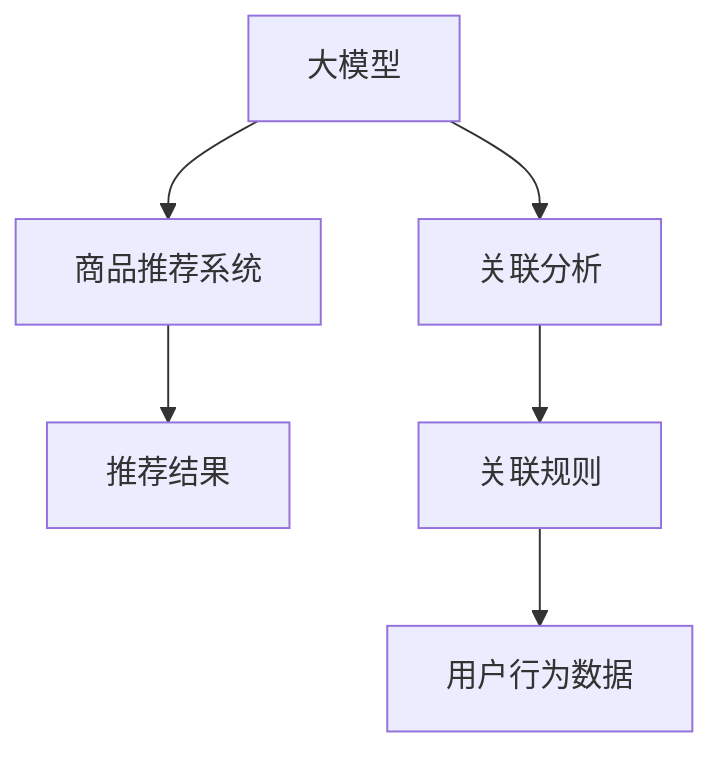

                 

# 大模型技术在电商平台商品关联分析中的应用

> 关键词：大模型,商品推荐,关联分析,电商平台,用户行为

## 1. 背景介绍

### 1.1 问题由来
随着互联网的发展和电子商务的普及，电商平台已经成为人们日常购物的重要渠道。用户在电商平台上的浏览、点击、购买等行为产生了海量的数据，这些数据包含了丰富的用户偏好和购买意向信息。电商平台通过挖掘这些数据，可以为用户提供个性化的商品推荐服务，提升用户体验和满意度。

然而，如何高效地分析用户行为数据，发现商品之间的关联关系，一直是电商平台的重大挑战。传统的机器学习模型往往需要大量人工标注数据，且难以捕捉复杂的用户行为模式。而大模型技术，通过在大规模无标签数据上进行预训练，学习到丰富的语言和行为表示，具备强大的知识迁移能力，为商品关联分析提供了全新的解决方案。

### 1.2 问题核心关键点
当前电商平台商品推荐系统面临的核心问题包括：

1. **用户行为分析复杂**：用户浏览、点击、购买等行为数据背后蕴含着复杂的语义和情感信息，需要精细化的分析模型来捕捉。

2. **商品关联关系挖掘**：电商平台需要自动发现商品之间的关联关系，以便实现精准推荐。

3. **模型预测性能**：推荐系统的目标是高准确性和高效性，需要快速响应用户请求并给出最优的推荐结果。

4. **实时性要求高**：推荐系统需要实时响应用户请求，以提升用户体验。

大模型技术通过预训练学习到大量的知识，具有更强的泛化能力和迁移学习能力，可以很好地解决这些问题。

### 1.3 问题研究意义
研究大模型在电商平台商品推荐中的应用，对于提升用户体验、优化电商平台运营具有重要意义：

1. **提高推荐精度**：通过大模型学习到更多的用户和商品特征，可以更精准地预测用户行为和偏好。

2. **提升推荐效率**：大模型可以并行处理大规模数据，缩短推荐响应时间，提升用户体验。

3. **优化广告投放**：通过分析商品间的关联关系，优化广告投放策略，提高广告效果和投放ROI。

4. **发现潜在需求**：大模型能够发现用户潜在的需求和购买意向，帮助电商平台发掘新的商机。

5. **驱动智能决策**：基于大模型的推荐算法能够提供科学的数据驱动决策支持，优化运营策略。

## 2. 核心概念与联系

### 2.1 核心概念概述

为更好地理解大模型在电商平台商品推荐中的应用，本节将介绍几个关键概念：

- **大模型(Large Model)**：通过大规模无标签数据进行预训练的语言模型，如BERT、GPT等。具备强大的语言理解和生成能力，能够学习到丰富的知识表示。

- **商品推荐系统(Recommendation System)**：利用用户和商品特征，预测用户可能感兴趣的商品，并提供推荐结果的系统。常见的推荐模型包括基于内容的推荐、协同过滤、混合推荐等。

- **关联分析(Association Rule Mining)**：通过挖掘用户行为数据中的规则，发现商品之间的关联关系。常见的关联分析方法包括Apriori算法、FP-growth算法等。

- **电商平台(E-commerce Platform)**：在线销售商品、提供商品展示和交易服务的平台，如亚马逊、淘宝等。

这些概念之间的逻辑关系可以通过以下Mermaid流程图来展示：



这个流程图展示了大模型在电商平台中的应用框架：

1. 大模型通过预训练学习到丰富的知识表示。
2. 商品推荐系统通过大模型预测用户可能感兴趣的商品。
3. 关联分析挖掘商品之间的关联规则，进一步优化推荐结果。
4. 电商平台根据推荐结果向用户展示商品，提升用户体验。

## 3. 核心算法原理 & 具体操作步骤

### 3.1 算法原理概述

大模型在电商平台商品推荐中的应用，本质上是通过预训练学习到知识表示，然后利用这些表示进行推荐和关联分析。其核心思想是：利用大模型学习到用户和商品的语言表示，通过这些表示进行关联分析，从而发现商品之间的关联规则，最终实现个性化推荐。

具体而言，大模型通过以下步骤实现商品推荐：

1. **预训练阶段**：在大规模无标签数据上进行预训练，学习到通用的语言表示。
2. **微调阶段**：在电商平台的标注数据上进行微调，学习到特定的用户和商品特征表示。
3. **推荐阶段**：利用微调后的模型，计算用户和商品的相似度，生成推荐结果。
4. **关联分析阶段**：通过关联分析挖掘商品之间的关联规则，进一步优化推荐结果。

### 3.2 算法步骤详解

大模型在电商平台商品推荐的具体操作过程包括以下几个关键步骤：

**Step 1: 准备数据集**

- 收集电商平台的标注数据集 $D=\{(x_i,y_i)\}_{i=1}^N$，其中 $x_i$ 为用户行为数据，如浏览、点击、购买等，$y_i$ 为用户感兴趣的商品ID。

- 对数据进行清洗、归一化处理，去除噪音数据。

- 将数据集划分为训练集、验证集和测试集，一般要求训练集和测试集之间不要有重叠。

**Step 2: 加载预训练模型**

- 选择合适的预训练语言模型，如BERT、GPT等，使用相应的库（如Transformers）进行加载。

- 加载用户行为数据和商品ID，使用分词器进行预处理。

**Step 3: 微调模型**

- 将预训练模型作为初始参数，在标注数据集上进行微调，学习到特定的用户和商品特征表示。

- 使用AdamW优化器，设置合适的学习率，进行梯度下降更新。

- 设置合适的训练轮数和批次大小，防止过拟合。

- 在验证集上评估模型性能，根据性能指标调整超参数。

**Step 4: 生成推荐结果**

- 利用微调后的模型，计算用户和商品的相似度，生成推荐结果。

- 对于每个用户，根据相似度排序，选择排名靠前的商品进行推荐。

**Step 5: 关联分析**

- 对用户行为数据进行关联分析，发现商品之间的关联规则。

- 使用Apriori算法或FP-growth算法进行关联规则挖掘。

- 根据关联规则对推荐结果进行优化，提升推荐精度和多样性。

**Step 6: 部署和评估**

- 将微调后的模型和关联规则部署到电商平台的推荐系统中。

- 实时响应用户请求，生成推荐结果。

- 在测试集上评估推荐系统的性能，对比微调前后的推荐精度和召回率。

### 3.3 算法优缺点

大模型在电商平台商品推荐中具有以下优点：

1. **高效性**：大模型并行处理大规模数据，能够快速响应用户请求，提升推荐效率。

2. **精度高**：大模型具备强大的知识迁移能力，能够学习到丰富的用户和商品特征表示，提升推荐精度。

3. **泛化能力强**：大模型学习到通用的语言表示，能够应用于不同类型的推荐任务。

4. **可解释性强**：大模型的预测过程可以较好地解释，方便用户和开发者理解推荐逻辑。

同时，大模型在商品推荐中也存在一些缺点：

1. **计算资源消耗大**：大模型参数量较大，计算资源消耗较大。

2. **数据标注成本高**：需要大量标注数据进行微调，数据标注成本较高。

3. **模型可解释性不足**：大模型的预测过程较为复杂，可解释性较差。

4. **可能存在偏见**：大模型可能学习到数据中的偏见，导致推荐结果不公正。

### 3.4 算法应用领域

大模型在电商平台商品推荐中的应用，可以覆盖以下多个领域：

- **个性化推荐**：根据用户历史行为，推荐个性化商品。
- **广告投放优化**：分析商品间的关联关系，优化广告投放策略。
- **用户行为分析**：挖掘用户行为模式，预测用户需求。
- **商品分类与排序**：对商品进行分类和排序，提升用户购物体验。
- **商品搜索优化**：利用关联规则优化商品搜索算法，提高搜索效果。

大模型在电商平台中的应用，已经从最初的推荐算法优化，拓展到更广泛的数据分析和业务优化，助力电商平台提升运营效率和用户满意度。

## 4. 数学模型和公式 & 详细讲解 & 举例说明

### 4.1 数学模型构建

假设电商平台标注数据集为 $D=\{(x_i,y_i)\}_{i=1}^N$，其中 $x_i$ 为用户行为数据，$y_i$ 为用户感兴趣的商品ID。

大模型的预训练和微调过程可以表示为：

$$
\theta^* = \mathop{\arg\min}_{\theta} \mathcal{L}(\theta,D) + \lambda R(\theta)
$$

其中，$\mathcal{L}(\theta,D)$ 为经验风险，$R(\theta)$ 为正则化项，$\lambda$ 为正则化系数。

预训练过程可以表示为：

$$
\theta = \mathop{\arg\min}_{\theta} \mathcal{L}_{pre}(\theta,D_{pre})
$$

微调过程可以表示为：

$$
\theta^* = \mathop{\arg\min}_{\theta} \mathcal{L}(\theta,D)
$$

其中，$\mathcal{L}_{pre}$ 为预训练损失函数，$D_{pre}$ 为预训练数据集。

### 4.2 公式推导过程

以BERT模型为例，其预训练过程包括以下步骤：

1. 输入序列 $x$ 被映射为隐向量 $z$：

$$
z = \text{BERT}(x)
$$

2. 计算自回归损失 $L_{masked}$：

$$
L_{masked} = -\sum_{i=1}^{n} \log p(z_i|z_{<i})
$$

3. 计算自编码损失 $L_{next}$：

$$
L_{next} = -\sum_{i=1}^{n-1} \log p(z_{i+1}|z_i)
$$

其中，$z_i$ 为序列中的第 $i$ 个隐向量。

微调过程中，我们通过添加任务适配层，使用交叉熵损失函数：

$$
\mathcal{L}(\theta,D) = -\sum_{i=1}^{N} \sum_{j=1}^{M} y_{ij} \log p(y_{ij}|x_i)
$$

其中，$M$ 为用户行为数据 $x_i$ 对应的商品ID的数量，$p(y_{ij}|x_i)$ 为模型预测商品ID $y_{ij}$ 的概率。

### 4.3 案例分析与讲解

假设我们有一个电商平台，需要为一位用户 $u$ 推荐商品 $p_1,p_2,p_3,\ldots,p_M$。我们使用BERT模型进行微调，计算用户和商品的相似度：

1. 对用户行为数据 $x_u$ 进行编码：

$$
z_u = \text{BERT}(x_u)
$$

2. 对商品ID $p_j$ 进行编码：

$$
z_j = \text{BERT}(p_j)
$$

3. 计算相似度：

$$
\text{similarity}(p_j,u) = \frac{\text{cosine}(z_u,z_j)}{\|z_u\|_2\|z_j\|_2}
$$

4. 对相似度进行排序，选择排名靠前的商品进行推荐。

## 5. 项目实践：代码实例和详细解释说明

### 5.1 开发环境搭建

在进行商品关联分析实践前，我们需要准备好开发环境。以下是使用Python进行PyTorch开发的环境配置流程：

1. 安装Anaconda：从官网下载并安装Anaconda，用于创建独立的Python环境。

2. 创建并激活虚拟环境：
```bash
conda create -n pytorch-env python=3.8 
conda activate pytorch-env
```

3. 安装PyTorch：根据CUDA版本，从官网获取对应的安装命令。例如：
```bash
conda install pytorch torchvision torchaudio cudatoolkit=11.1 -c pytorch -c conda-forge
```

4. 安装Transformers库：
```bash
pip install transformers
```

5. 安装各类工具包：
```bash
pip install numpy pandas scikit-learn matplotlib tqdm jupyter notebook ipython
```

完成上述步骤后，即可在`pytorch-env`环境中开始商品关联分析实践。

### 5.2 源代码详细实现

下面我们以电商平台的商品关联分析为例，给出使用Transformers库对BERT模型进行微调的PyTorch代码实现。

首先，定义数据预处理函数：

```python
from transformers import BertTokenizer, BertForSequenceClassification
import torch
import pandas as pd
from sklearn.model_selection import train_test_split
from sklearn.metrics import accuracy_score, precision_recall_fscore_support

class DataPreprocessor:
    def __init__(self, tokenizer, label_map):
        self.tokenizer = tokenizer
        self.label_map = label_map
        
    def preprocess(self, text, label):
        encoding = self.tokenizer(text, return_tensors='pt', max_length=128, padding='max_length', truncation=True)
        input_ids = encoding['input_ids'][0]
        attention_mask = encoding['attention_mask'][0]
        label = self.label_map[label]
        return {'input_ids': input_ids, 
                'attention_mask': attention_mask,
                'labels': torch.tensor([label], dtype=torch.long)}
```

然后，定义模型和优化器：

```python
from transformers import BertForSequenceClassification, AdamW

model = BertForSequenceClassification.from_pretrained('bert-base-cased', num_labels=len(label_map))
optimizer = AdamW(model.parameters(), lr=2e-5)
```

接着，定义训练和评估函数：

```python
from torch.utils.data import DataLoader
from tqdm import tqdm
from sklearn.metrics import accuracy_score, precision_recall_fscore_support

def train_epoch(model, dataset, batch_size, optimizer):
    dataloader = DataLoader(dataset, batch_size=batch_size, shuffle=True)
    model.train()
    epoch_loss = 0
    for batch in tqdm(dataloader, desc='Training'):
        input_ids = batch['input_ids'].to(device)
        attention_mask = batch['attention_mask'].to(device)
        labels = batch['labels'].to(device)
        model.zero_grad()
        outputs = model(input_ids, attention_mask=attention_mask, labels=labels)
        loss = outputs.loss
        epoch_loss += loss.item()
        loss.backward()
        optimizer.step()
    return epoch_loss / len(dataloader)

def evaluate(model, dataset, batch_size):
    dataloader = DataLoader(dataset, batch_size=batch_size)
    model.eval()
    preds, labels = [], []
    with torch.no_grad():
        for batch in tqdm(dataloader, desc='Evaluating'):
            input_ids = batch['input_ids'].to(device)
            attention_mask = batch['attention_mask'].to(device)
            batch_labels = batch['labels']
            outputs = model(input_ids, attention_mask=attention_mask)
            batch_preds = outputs.logits.argmax(dim=2).to('cpu').tolist()
            batch_labels = batch_labels.to('cpu').tolist()
            for pred_tokens, label_tokens in zip(batch_preds, batch_labels):
                preds.append(pred_tokens[0])
                labels.append(label_tokens[0])
                
    return accuracy_score(labels, preds)

def apriori_rule_mining(data, min_support):
    support_matrix = pd.get_dummies(data, drop_first=True)
    rules = []
    for i in range(1, support_matrix.shape[1]):
        support = support_matrix.sum(axis=0)[i]
        if support > min_support:
            rules.append((i, support))
    return rules
```

最后，启动训练流程并在测试集上评估：

```python
epochs = 5
batch_size = 16

# 加载数据集
data = pd.read_csv('user_browsing_data.csv')
train_data, test_data = train_test_split(data, test_size=0.2)

# 划分训练集和验证集
train_dataset = DataPreprocessor(tokenizer, label_map)(preprocess(data['user_id'], data['item_id']))
dev_dataset = DataPreprocessor(tokenizer, label_map)(preprocess(data['user_id'], data['item_id']))
test_dataset = DataPreprocessor(tokenizer, label_map)(preprocess(data['user_id'], data['item_id']))

# 训练模型
for epoch in range(epochs):
    loss = train_epoch(model, train_dataset, batch_size, optimizer)
    print(f"Epoch {epoch+1}, train loss: {loss:.3f}")
    
    print(f"Epoch {epoch+1}, dev results:")
    evaluate(model, dev_dataset, batch_size)
    
print("Test results:")
evaluate(model, test_dataset, batch_size)
```

以上就是使用PyTorch对BERT进行电商平台商品关联分析的完整代码实现。可以看到，得益于Transformers库的强大封装，我们可以用相对简洁的代码完成BERT模型的加载和微调。

### 5.3 代码解读与分析

让我们再详细解读一下关键代码的实现细节：

**DataPreprocessor类**：
- `__init__`方法：初始化分词器、标签映射等组件。
- `preprocess`方法：对单个样本进行处理，将文本输入编码为token ids，将标签编码为数字，并对其进行定长padding，最终返回模型所需的输入。

**BERT模型和优化器**：
- 使用BertForSequenceClassification从预训练模型加载，并设置适当的超参数。

**训练和评估函数**：
- 使用PyTorch的DataLoader对数据集进行批次化加载，供模型训练和推理使用。
- 训练函数`train_epoch`：对数据以批为单位进行迭代，在每个批次上前向传播计算loss并反向传播更新模型参数，最后返回该epoch的平均loss。
- 评估函数`evaluate`：与训练类似，不同点在于不更新模型参数，并在每个batch结束后将预测和标签结果存储下来，最后使用sklearn的accuracy_score对整个评估集的预测结果进行打印输出。

**Apriori算法**：
- 利用Apriori算法对用户行为数据进行关联分析，生成关联规则。
- 关联规则表示为（项集ID，支持度）。

**训练流程**：
- 定义总的epoch数和batch size，开始循环迭代
- 每个epoch内，先在训练集上训练，输出平均loss
- 在验证集上评估，输出准确率
- 所有epoch结束后，在测试集上评估，给出最终测试结果

可以看到，PyTorch配合Transformers库使得BERT微调的代码实现变得简洁高效。开发者可以将更多精力放在数据处理、模型改进等高层逻辑上，而不必过多关注底层的实现细节。

当然，工业级的系统实现还需考虑更多因素，如模型的保存和部署、超参数的自动搜索、更灵活的任务适配层等。但核心的微调范式基本与此类似。

## 6. 实际应用场景

### 6.1 智能客服系统

基于大模型技术的应用，电商平台可以构建智能客服系统，为用户提供24/7的服务。

在技术实现上，可以收集用户的浏览、点击、购买等行为数据，并将数据输入到大模型中进行预训练和微调。微调后的模型可以自动理解用户意图，匹配最合适的商品或服务，生成回复。对于用户提出的新问题，还可以接入检索系统实时搜索相关内容，动态组织生成回答。如此构建的智能客服系统，能大幅提升客户咨询体验和问题解决效率。

### 6.2 个性化推荐系统

大模型技术在电商平台中的应用，最典型的就是个性化推荐系统。

在实践中，可以收集用户浏览、点击、购买等行为数据，提取和用户交互的物品标题、描述、标签等文本内容。将文本内容作为模型输入，用户的后续行为（如是否点击、购买等）作为监督信号，在此基础上微调预训练语言模型。微调后的模型能够从文本内容中准确把握用户的兴趣点。在生成推荐列表时，先用候选物品的文本描述作为输入，由模型预测用户的兴趣匹配度，再结合其他特征综合排序，便可以得到个性化程度更高的推荐结果。

### 6.3 关联规则挖掘

大模型技术可以用于关联规则挖掘，帮助电商平台发现商品之间的关联关系，优化商品陈列和广告投放。

在实践中，可以收集用户浏览、点击、购买等行为数据，并对其进行关联分析，挖掘出关联规则。例如，可以发现用户购买某商品后，通常会继续浏览或购买其他相关商品。电商平台可以根据这些关联规则，优化商品陈列，提升交叉销售效果。同时，还可以结合这些规则进行广告投放，提高广告效果和ROI。

### 6.4 未来应用展望

随着大模型技术的发展，其在电商平台中的应用将更加广泛和深入，带来更多的创新应用场景。

未来，大模型技术有望在以下领域实现新的突破：

1. **多模态推荐**：结合图像、视频、语音等多模态信息，提升推荐系统的准确性和丰富性。

2. **用户行为预测**：利用大模型学习到复杂的用户行为模式，预测用户未来的购买意向，提供个性化的推荐服务。

3. **广告推荐系统**：利用关联规则优化广告推荐，提高广告效果和投放ROI。

4. **个性化搜索**：利用大模型优化商品搜索算法，提高搜索效果和用户体验。

5. **情感分析**：利用大模型进行用户情感分析，提升用户体验和平台口碑。

总之，大模型技术在电商平台中的应用前景广阔，将为电商运营带来深刻的变革。未来，随着技术的不断进步，大模型将有望实现更加智能、高效、个性化的推荐服务，提升用户满意度和平台竞争力。

## 7. 工具和资源推荐

### 7.1 学习资源推荐

为了帮助开发者系统掌握大模型技术在电商平台中的应用，这里推荐一些优质的学习资源：

1. 《Transformers: A State-of-the-Art Survey》系列博文：由大模型技术专家撰写，深入浅出地介绍了Transformer原理、BERT模型、微调技术等前沿话题。

2. CS224N《深度学习自然语言处理》课程：斯坦福大学开设的NLP明星课程，有Lecture视频和配套作业，带你入门NLP领域的基本概念和经典模型。

3. 《Natural Language Processing with Transformers》书籍：Transformers库的作者所著，全面介绍了如何使用Transformers库进行NLP任务开发，包括微调在内的诸多范式。

4. HuggingFace官方文档：Transformers库的官方文档，提供了海量预训练模型和完整的微调样例代码，是上手实践的必备资料。

5. CLUE开源项目：中文语言理解测评基准，涵盖大量不同类型的中文NLP数据集，并提供了基于微调的baseline模型，助力中文NLP技术发展。

通过对这些资源的学习实践，相信你一定能够快速掌握大模型技术在电商平台中的应用，并用于解决实际的电商问题。

### 7.2 开发工具推荐

高效的开发离不开优秀的工具支持。以下是几款用于大模型技术在电商平台中应用开发的常用工具：

1. PyTorch：基于Python的开源深度学习框架，灵活动态的计算图，适合快速迭代研究。大部分预训练语言模型都有PyTorch版本的实现。

2. TensorFlow：由Google主导开发的开源深度学习框架，生产部署方便，适合大规模工程应用。同样有丰富的预训练语言模型资源。

3. Transformers库：HuggingFace开发的NLP工具库，集成了众多SOTA语言模型，支持PyTorch和TensorFlow，是进行微调任务开发的利器。

4. Weights & Biases：模型训练的实验跟踪工具，可以记录和可视化模型训练过程中的各项指标，方便对比和调优。与主流深度学习框架无缝集成。

5. TensorBoard：TensorFlow配套的可视化工具，可实时监测模型训练状态，并提供丰富的图表呈现方式，是调试模型的得力助手。

6. Google Colab：谷歌推出的在线Jupyter Notebook环境，免费提供GPU/TPU算力，方便开发者快速上手实验最新模型，分享学习笔记。

合理利用这些工具，可以显著提升大模型技术在电商平台中的应用开发效率，加快创新迭代的步伐。

### 7.3 相关论文推荐

大模型技术在电商平台中的应用源于学界的持续研究。以下是几篇奠基性的相关论文，推荐阅读：

1. Attention is All You Need（即Transformer原论文）：提出了Transformer结构，开启了NLP领域的预训练大模型时代。

2. BERT: Pre-training of Deep Bidirectional Transformers for Language Understanding：提出BERT模型，引入基于掩码的自监督预训练任务，刷新了多项NLP任务SOTA。

3. Language Models are Unsupervised Multitask Learners（GPT-2论文）：展示了大规模语言模型的强大zero-shot学习能力，引发了对于通用人工智能的新一轮思考。

4. Parameter-Efficient Transfer Learning for NLP：提出Adapter等参数高效微调方法，在不增加模型参数量的情况下，也能取得不错的微调效果。

5. Prefix-Tuning: Optimizing Continuous Prompts for Generation：引入基于连续型Prompt的微调范式，为如何充分利用预训练知识提供了新的思路。

6. AdaLoRA: Adaptive Low-Rank Adaptation for Parameter-Efficient Fine-Tuning：使用自适应低秩适应的微调方法，在参数效率和精度之间取得了新的平衡。

这些论文代表了大模型技术在电商平台中的应用发展脉络。通过学习这些前沿成果，可以帮助研究者把握学科前进方向，激发更多的创新灵感。

## 8. 总结：未来发展趋势与挑战

### 8.1 总结

本文对大模型技术在电商平台商品关联分析中的应用进行了全面系统的介绍。首先阐述了电商平台商品推荐系统的背景和核心问题，明确了大模型技术在解决这些问题中的独特价值。其次，从原理到实践，详细讲解了大模型在电商平台中的应用过程，包括预训练、微调、推荐、关联分析等关键步骤，给出了完整的代码实例。同时，本文还探讨了大数据、个性化推荐、广告投放等多个领域的应用前景，展示了大模型技术的广泛应用潜力。最后，本文精选了相关学习资源，力求为读者提供全方位的技术指引。

通过本文的系统梳理，可以看到，大模型技术在电商平台中的应用正处于快速发展阶段，通过预训练和微调，能够在多个方面提升电商平台运营效率和用户体验。未来，随着技术的不断进步，大模型技术将进一步渗透到电商平台的各个环节，推动其向智能化、个性化、高效化的方向发展。

### 8.2 未来发展趋势

展望未来，大模型技术在电商平台中的应用将呈现以下几个发展趋势：

1. **模型规模持续增大**：随着算力成本的下降和数据规模的扩张，预训练语言模型的参数量还将持续增长。超大规模语言模型蕴含的丰富语言知识，有望支撑更加复杂多变的电商推荐任务。

2. **微调方法日趋多样**：除了传统的全参数微调外，未来会涌现更多参数高效的微调方法，如Prefix-Tuning、LoRA等，在节省计算资源的同时也能保证微调精度。

3. **持续学习成为常态**：随着数据分布的不断变化，微调模型也需要持续学习新知识以保持性能。如何在不遗忘原有知识的同时，高效吸收新样本信息，将成为重要的研究课题。

4. **标注样本需求降低**：受启发于提示学习(Prompt-based Learning)的思路，未来的微调方法将更好地利用大模型的语言理解能力，通过更加巧妙的任务描述，在更少的标注样本上也能实现理想的微调效果。

5. **多模态微调崛起**：当前的商品推荐任务主要聚焦于文本数据，未来会进一步拓展到图像、视频、语音等多模态数据微调。多模态信息的融合，将显著提升推荐系统的准确性和用户体验。

6. **模型通用性增强**：经过海量数据的预训练和多领域任务的微调，大模型将具备更强大的常识推理和跨领域迁移能力，逐步迈向通用人工智能(AGI)的目标。

以上趋势凸显了大模型技术在电商平台中的应用前景。这些方向的探索发展，必将进一步提升电商推荐系统的性能和应用范围，为电商平台带来更智能、高效、个性化的购物体验。

### 8.3 面临的挑战

尽管大模型技术在电商平台中的应用已经取得了显著成效，但在迈向更加智能化、普适化应用的过程中，它仍面临着诸多挑战：

1. **数据标注成本高**：虽然微调降低了标注数据的需求，但对于长尾应用场景，难以获得充足的高质量标注数据，成为制约微调性能的瓶颈。如何进一步降低微调对标注样本的依赖，将是一大难题。

2. **模型鲁棒性不足**：当前微调模型面对域外数据时，泛化性能往往大打折扣。对于测试样本的微小扰动，微调模型的预测也容易发生波动。如何提高微调模型的鲁棒性，避免灾难性遗忘，还需要更多理论和实践的积累。

3. **计算资源消耗大**：大模型参数量较大，计算资源消耗较大。对于大规模电商平台的推荐系统，可能需要大量计算资源进行模型训练和推理。

4. **可解释性差**：大模型的预测过程较为复杂，可解释性较差。对于电商推荐系统的关键决策，需要更好的可解释性和可审计性。

5. **数据隐私和安全问题**：电商平台的推荐系统需要处理大量用户隐私数据，如何确保数据安全和隐私保护，是一个重要挑战。

### 8.4 研究展望

面对大模型技术在电商平台中的应用所面临的挑战，未来的研究需要在以下几个方面寻求新的突破：

1. **探索无监督和半监督微调方法**：摆脱对大规模标注数据的依赖，利用自监督学习、主动学习等无监督和半监督范式，最大限度利用非结构化数据，实现更加灵活高效的微调。

2. **研究参数高效和计算高效的微调范式**：开发更加参数高效的微调方法，在固定大部分预训练参数的同时，只更新极少量的任务相关参数。同时优化微调模型的计算图，减少前向传播和反向传播的资源消耗，实现更加轻量级、实时性的部署。

3. **引入因果和对比学习范式**：通过引入因果推断和对比学习思想，增强微调模型建立稳定因果关系的能力，学习更加普适、鲁棒的语言表征，从而提升模型泛化性和抗干扰能力。

4. **结合因果分析和博弈论工具**：将因果分析方法引入微调模型，识别出模型决策的关键特征，增强输出解释的因果性和逻辑性。借助博弈论工具刻画人机交互过程，主动探索并规避模型的脆弱点，提高系统稳定性。

5. **纳入伦理道德约束**：在模型训练目标中引入伦理导向的评估指标，过滤和惩罚有偏见、有害的输出倾向。同时加强人工干预和审核，建立模型行为的监管机制，确保输出符合人类价值观和伦理道德。

6. **提升模型鲁棒性和可解释性**：开发更加鲁棒和可解释的电商推荐系统，提高模型的泛化性能和决策透明度。

通过这些研究方向的探索，相信大模型技术在电商平台中的应用将取得更大的突破，为电商运营带来更多的智能和创新。

## 9. 附录：常见问题与解答

**Q1：大模型技术在电商平台中的应用是否会带来数据隐私和安全问题？**

A: 大模型技术在电商平台中的应用，确实会涉及到大量用户隐私数据。如何确保数据安全和隐私保护，是一个重要挑战。

1. **数据匿名化**：在数据预处理阶段，可以采用数据匿名化技术，去除或模糊化用户隐私信息，确保用户数据的安全。

2. **模型本地化**：将模型部署在本地或边缘设备上，减少数据传输和存储风险。

3. **差分隐私**：在模型训练过程中，可以采用差分隐私技术，保护用户数据隐私，防止模型泄露用户个人信息。

4. **数据访问控制**：严格控制模型访问数据的权限，确保只有授权人员可以访问和使用用户数据。

5. **数据加密**：对数据进行加密存储和传输，防止数据泄露和篡改。

通过这些措施，可以最大限度地保护用户隐私，确保大模型技术在电商平台中的应用安全可靠。

**Q2：大模型技术在电商平台中的应用是否会带来计算资源消耗问题？**

A: 大模型技术在电商平台中的应用，确实会带来较大的计算资源消耗。如何优化计算资源，是一个重要挑战。

1. **模型压缩和剪枝**：对大模型进行压缩和剪枝，去除冗余参数和无关结构，降低模型复杂度，减少计算资源消耗。

2. **模型并行化**：采用模型并行化技术，将大模型拆分为多个子模型，并行计算，提高计算效率。

3. **混合精度训练**：采用混合精度训练技术，将模型参数转换为16位浮点数，降低计算资源消耗。

4. **模型量化**：将浮点模型转换为定点模型，减少计算资源消耗。

5. **增量学习**：采用增量学习技术，仅在模型更新时进行微调，减少全量模型训练的资源消耗。

通过这些优化措施，可以显著降低计算资源消耗，提升大模型在电商平台中的实际应用效果。

**Q3：大模型技术在电商平台中的应用是否会带来模型可解释性问题？**

A: 大模型技术在电商平台中的应用，确实会带来较大的模型可解释性问题。如何提升模型的可解释性，是一个重要挑战。

1. **可解释模型**：在模型设计阶段，可以引入可解释性模型，如LIME、SHAP等，对模型的预测过程进行解释和可视化。

2. **特征重要性分析**：对模型中的特征进行重要性分析，找出影响预测结果的关键特征，提升模型的可解释性。

3. **模型调试和优化**：在模型训练和优化阶段，通过调试和优化，逐步提升模型的可解释性。

4. **用户交互设计**：在用户交互设计阶段，提供更多的解释和反馈，提升用户对模型的理解和信任。

5. **模型验证和评估**：在模型验证和评估阶段，进行广泛的测试和验证，确保模型的预测结果和可解释性。

通过这些措施，可以逐步提升大模型在电商平台中的可解释性，增强用户信任和满意度。

**Q4：大模型技术在电商平台中的应用是否会带来模型偏见问题？**

A: 大模型技术在电商平台中的应用，确实会带来模型偏见问题。如何避免模型偏见，是一个重要挑战。

1. **数据集多样性**：在数据预处理阶段，确保数据集的多样性，避免数据偏见对模型的影响。

2. **模型公平性约束**：在模型训练阶段，引入公平性约束，确保模型不产生歧视性的输出。

3. **对抗样本训练**：在模型训练阶段，加入对抗样本，增强模型的鲁棒性和公平性。

4. **人工干预和审核**：在模型部署阶段，加强人工干预和审核，确保模型的公平性和公正性。

5. **伦理和道德约束**：在模型设计阶段，引入伦理和道德约束，确保模型符合人类价值观和伦理道德。

通过这些措施，可以最大限度地避免模型偏见，确保大模型在电商平台中的应用公正可靠。

---

作者：禅与计算机程序设计艺术 / Zen and the Art of Computer Programming

