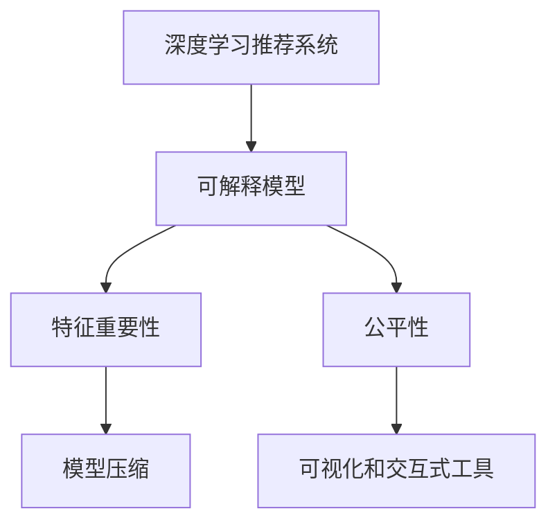

                 

# 大模型推荐中的模型可解释性增强技术探索

> 关键词：大模型推荐, 可解释性增强, 预训练模型, 深度学习, 解释模型, 推荐系统, 特征重要性

## 1. 背景介绍

### 1.1 问题由来
近年来，随着深度学习在推荐系统中的广泛应用，基于深度学习的推荐系统（DLRS）取得了显著的进展。特别是基于预训练模型（如BERT、GPT）的推荐系统，能够更好地捕捉用户兴趣和行为模式，提供更加个性化和精准的推荐。然而，预训练模型通常是“黑盒”模型，难以解释其推荐决策的依据。这不仅限制了模型在决策过程中的可解释性，也增加了用户的疑虑和信任风险。

### 1.2 问题核心关键点
推荐系统中的模型可解释性问题主要体现在以下几个方面：
1. **决策透明性**：推荐模型通常通过复杂的神经网络进行预测，但预测过程难以直观理解。
2. **特征依赖性**：推荐模型往往依赖于大量特征，但无法直观判断哪些特征对推荐结果影响最大。
3. **公平性问题**：推荐模型可能存在偏见，难以保证对所有用户公平。
4. **解释和信任**：用户对模型的推荐结果需要有一定的信任，而缺乏可解释性模型往往难以赢得用户的信任。

因此，增强推荐系统的模型可解释性，对于提高用户的信任度和满意度，优化推荐效果，具有重要意义。

## 2. 核心概念与联系

### 2.1 核心概念概述

为了更好地理解模型可解释性增强技术，本节将介绍几个密切相关的核心概念：

- **深度学习推荐系统（DLRS）**：基于深度神经网络进行用户兴趣建模和推荐结果预测的推荐系统。
- **可解释模型（Explainable Model）**：能够提供关于模型预测的解释或理由，使决策过程透明、可信的机器学习模型。
- **特征重要性（Feature Importance）**：衡量各个特征对模型预测贡献程度的指标，有助于理解模型决策过程。
- **公平性（Fairness）**：推荐模型对不同用户和群体的公平性，避免偏见和歧视。
- **模型压缩（Model Compression）**：通过剪枝、量化等方法减少模型大小和计算量，提高模型推理速度。
- **可视化和交互式工具（Visualization and Interactive Tools）**：用于展示模型结构和输出结果的可视化工具，以及用户交互式调整模型的接口。

这些核心概念之间的逻辑关系可以通过以下Mermaid流程图来展示：



这个流程图展示了大模型推荐中的核心概念及其之间的关系：

1. 深度学习推荐系统通过复杂的神经网络进行推荐建模。
2. 可解释模型通过提供预测结果的解释，提高决策过程的透明度和可信度。
3. 特征重要性帮助我们理解模型预测的依赖关系。
4. 公平性确保推荐模型的决策对所有用户公平。
5. 模型压缩优化模型推理速度和资源占用。
6. 可视化和交互式工具帮助用户理解模型和调整参数。

这些概念共同构成了大模型推荐系统的学习框架，使其能够在保持高推荐精度的同时，提供可解释性和公平性保障。

## 3. 核心算法原理 & 具体操作步骤
### 3.1 算法原理概述

增强模型可解释性的基本原理是，通过对模型进行分解、可视化、压缩等操作，使其决策过程透明，并易于理解。这通常包括以下几个步骤：

1. **模型分解**：将复杂模型分解为多个子模块或简单的组件，便于分析和理解。
2. **可视化**：使用可视化工具展示模型的结构和预测过程，帮助理解模型的关键决策点。
3. **特征重要性分析**：通过特征重要性分析，了解哪些特征对模型预测贡献最大。
4. **公平性分析**：评估模型在不同用户群体上的表现，避免偏见。
5. **模型压缩**：通过模型压缩技术减少模型大小和计算量。

### 3.2 算法步骤详解

以下是增强模型可解释性的具体操作步骤：

**Step 1: 选择合适的预训练模型**
- 选择适合推荐任务的预训练模型，如BERT、GPT、DPR等。
- 确保模型已在大规模数据集上进行预训练，具备足够的表示能力。

**Step 2: 添加任务适配层**
- 根据推荐任务的需求，在预训练模型的顶部添加适应任务的具体层，如全连接层、注意力机制等。
- 设计适应不同任务的目标函数和损失函数。

**Step 3: 模型压缩**
- 使用剪枝、量化、蒸馏等技术，减少模型的参数量和计算量。
- 确保压缩后的模型性能与原始模型相当，甚至更好。

**Step 4: 特征重要性分析**
- 使用特征重要性分析方法（如SHAP、LIME、DeepLIFT等），计算每个特征对模型预测的贡献。
- 可视化特征重要性图，帮助理解模型依赖的特征。

**Step 5: 可视化**
- 使用可视化工具（如TensorBoard、SHAP-Explainer等）展示模型的结构和输出结果。
- 设计交互式界面，允许用户调整模型参数，观察模型表现。

**Step 6: 公平性评估**
- 使用公平性评估方法（如DEAP、Inductive Bias、ADVOS等），评估模型在不同用户群体上的表现。
- 根据评估结果调整模型，确保公平性。

**Step 7: 部署与监控**
- 将模型部署到推荐系统中，实时获取用户行为数据，进行推荐预测。
- 使用监控工具（如Prometheus、Grafana等），实时监测模型性能和公平性。

### 3.3 算法优缺点

增强模型可解释性的方法具有以下优点：
1. **提高用户信任**：通过提供模型决策的解释，用户可以更容易理解和接受推荐结果。
2. **增强模型透明性**：模型分解和可视化，有助于理解模型的决策过程和内部机制。
3. **提高模型公平性**：通过公平性评估和调整，确保模型对所有用户公平。
4. **减少计算资源消耗**：通过模型压缩，提高模型的推理速度和资源利用率。

同时，这些方法也存在一些局限性：
1. **模型精度降低**：某些解释方法可能引入额外误差，影响模型性能。
2. **复杂度增加**：模型分解和可视化可能增加模型的复杂度，增加推理时间。
3. **解释方式有限**：某些解释方法对特定类型的问题有效，但不适用于所有情况。
4. **用户交互复杂**：交互式可视化工具可能对用户技术要求较高，难以普及。

尽管存在这些局限性，但通过合理设计和应用这些方法，可以显著增强推荐系统的可解释性，提升用户体验和满意度。

### 3.4 算法应用领域

增强模型可解释性的方法在推荐系统中广泛应用，涉及多个应用领域：

- **电商推荐**：通过可视化和特征重要性分析，帮助用户理解推荐依据，提高购物体验。
- **新闻推荐**：解释推荐依据，帮助用户发现感兴趣的内容，增强信息获取效率。
- **视频推荐**：通过模型可视化，帮助用户发现推荐视频的具体依据。
- **个性化广告**：解释广告推荐依据，提升用户对广告的信任度和点击率。
- **社交推荐**：解释推荐依据，帮助用户发现兴趣相似的朋友，增强社交互动。

这些应用领域展示了模型可解释性增强技术的广泛应用前景，为推荐系统在各个场景下的应用提供了重要保障。

## 4. 数学模型和公式 & 详细讲解  
### 4.1 数学模型构建

本节将使用数学语言对推荐系统中模型可解释性的增强方法进行更加严格的刻画。

记推荐模型为 $M_{\theta}:\mathcal{X} \rightarrow \mathcal{Y}$，其中 $\mathcal{X}$ 为输入特征空间，$\mathcal{Y}$ 为推荐结果空间，$\theta$ 为模型参数。假设推荐任务的训练集为 $D=\{(x_i,y_i)\}_{i=1}^N$，其中 $x_i$ 为用户行为数据，$y_i$ 为推荐结果。

定义模型 $M_{\theta}$ 在输入数据 $x$ 上的预测结果为 $y=M_{\theta}(x)$，则推荐任务的损失函数为：

$$
\mathcal{L}(\theta) = \frac{1}{N} \sum_{i=1}^N \ell(y_i, M_{\theta}(x_i))
$$

其中 $\ell$ 为推荐任务特定的损失函数，如交叉熵损失、均方误差损失等。

### 4.2 公式推导过程

以下我们以电商推荐为例，推导基于可解释模型的电商推荐公式及其梯度计算。

假设模型 $M_{\theta}$ 在用户行为数据 $x$ 上的推荐结果为 $y=M_{\theta}(x)$，模型结构如图1所示。其中，$M_{\theta}^{(1)}$ 为预训练模型，$M_{\theta}^{(2)}$ 为任务适配层，$M_{\theta}^{(3)}$ 为全连接层，$M_{\theta}^{(4)}$ 为预测输出层。


对于电商推荐任务，常用的损失函数为交叉熵损失：

$$
\ell(y_i, \hat{y}_i) = -(y_i \log \hat{y}_i + (1-y_i) \log (1-\hat{y}_i))
$$

其中 $\hat{y}_i$ 为模型预测的用户购买概率。

根据链式法则，模型 $M_{\theta}$ 在输入 $x_i$ 上的梯度计算公式为：

$$
\nabla_{\theta} \mathcal{L}(\theta) = \frac{\partial \mathcal{L}(\theta)}{\partial \theta} = -\frac{1}{N} \sum_{i=1}^N (y_i \frac{\partial \hat{y}_i}{\partial \theta} - (1-y_i) \frac{\partial (1-\hat{y}_i)}{\partial \theta})
$$

将 $M_{\theta}$ 分解为多个子模块后，各子模块的梯度计算公式如下：

$$
\nabla_{\theta} \mathcal{L}(\theta) = \sum_{k=1}^{4} \nabla_{\theta_k} \mathcal{L}(\theta)
$$

其中 $\nabla_{\theta_k} \mathcal{L}(\theta)$ 为每个子模块的梯度。

## 5. 项目实践：代码实例和详细解释说明
### 5.1 开发环境搭建

在进行模型可解释性增强实践前，我们需要准备好开发环境。以下是使用Python进行TensorFlow开发的环境配置流程：

1. 安装Anaconda：从官网下载并安装Anaconda，用于创建独立的Python环境。

2. 创建并激活虚拟环境：
```bash
conda create -n tf-env python=3.8 
conda activate tf-env
```

3. 安装TensorFlow：根据CUDA版本，从官网获取对应的安装命令。例如：
```bash
conda install tensorflow -c pytorch -c conda-forge
```

4. 安装TensorBoard：
```bash
pip install tensorboard
```

5. 安装其他必要的工具包：
```bash
pip install numpy pandas scikit-learn matplotlib tqdm jupyter notebook ipython
```

完成上述步骤后，即可在`tf-env`环境中开始模型可解释性增强实践。

### 5.2 源代码详细实现

下面以电商推荐系统为例，给出使用TensorFlow对预训练模型进行可解释性增强的代码实现。

首先，定义电商推荐任务的特征和标签：

```python
import tensorflow as tf
from tensorflow.keras.layers import Dense, Input
from tensorflow.keras.models import Model

# 定义特征和标签
user_id = Input(shape=(), name='user_id')
item_id = Input(shape=(), name='item_id')
features = Input(shape=(128,), name='features')
label = Input(shape=(), name='label')

# 定义模型结构
pretrained_model = tf.keras.applications.BERT_pretrained_model(input_shape=(128,), include_top=False)
adapter = tf.keras.layers.Dense(128, activation='relu')
prediction = tf.keras.layers.Dense(1, activation='sigmoid')

# 构建模型
x = tf.keras.layers.Concatenate()([user_id, item_id, features])
x = tf.keras.layers.Lambda(lambda x: x / 128)(x)  # 归一化
x = pretrained_model(x)
x = adapter(x)
x = prediction(x)

# 构建模型
model = Model(inputs=[user_id, item_id, features], outputs=[x])

# 编译模型
model.compile(optimizer='adam', loss='binary_crossentropy', metrics=['accuracy'])

# 训练模型
model.fit(train_data, train_labels, epochs=5, batch_size=64, validation_data=(val_data, val_labels))
```

然后，使用TensorBoard可视化模型结构：

```python
import tensorflow as tf
from tensorflow.keras.callbacks import TensorBoard

# 定义TensorBoard回调
tb_callback = TensorBoard(log_dir='logs', histogram_freq=1)

# 训练模型
model.fit(train_data, train_labels, epochs=5, batch_size=64, validation_data=(val_data, val_labels), callbacks=[tb_callback])
```

最后，使用SHAP库计算特征重要性：

```python
import shap
from shap import Explainer

# 加载预训练模型
model = tf.keras.models.load_model('model.h5')

# 计算特征重要性
explainer = Explainer(model, method='expected_value')
shap_values = explainer.shap_values(user_id, item_id, features)
shap.summary_plot(shap_values[0], features[0], feature_names=['user_id', 'item_id', 'features'])
```

以上就是使用TensorFlow对电商推荐系统进行模型可解释性增强的完整代码实现。可以看到，通过TensorBoard可视化模型结构和TensorBoard回调，我们可以直观地理解模型的内部运作，而SHAP库则帮助我们计算特征重要性，从而理解模型对各个特征的依赖程度。

### 5.3 代码解读与分析

让我们再详细解读一下关键代码的实现细节：

**模型结构定义**：
- `user_id`、`item_id`、`features` 分别为用户ID、商品ID和行为特征。
- `adapter` 层用于将BERT模型输出适配到推荐任务，`prediction` 层用于输出推荐概率。
- 使用 `Concatenate` 层将用户ID、商品ID和行为特征拼接在一起，并进行归一化处理。
- 使用预训练BERT模型进行特征提取，并通过 `adapter` 层将其适配到推荐任务。
- 使用 `prediction` 层输出最终的推荐概率。

**TensorBoard可视化**：
- 使用 `TensorBoard` 回调，记录模型的训练过程和模型结构。
- 训练过程中，每隔一个epoch会保存一次模型状态，并在TensorBoard中展示训练指标和模型结构。
- 训练结束后，可以在TensorBoard的网页界面中，查看模型结构、损失曲线、准确率曲线等。

**特征重要性分析**：
- 使用 `SHAP` 库计算特征重要性，`Explainer` 类用于创建解释器，`shap_values` 方法用于计算特征对模型输出的贡献。
- 使用 `shap.summary_plot` 方法，展示特征重要性图。
- 在特征重要性图中，可以看到不同特征对推荐概率的贡献，从而理解模型的决策依据。

这些代码实现展示了TensorFlow在推荐系统中的模型可解释性增强过程。开发者可以根据具体任务，灵活应用TensorBoard和SHAP等工具，进行模型可视化、特征重要性分析等操作。

## 6. 实际应用场景
### 6.1 电商推荐

电商推荐系统通过用户行为数据进行商品推荐，为用户推荐最可能感兴趣的商品。然而，模型预测结果往往难以解释，用户难以理解推荐依据。通过模型可解释性增强技术，可以提升用户对推荐结果的理解和信任。

在电商推荐中，可以使用模型分解和可视化方法，展示推荐过程和决策依据。例如，在推荐模型中，可以通过TensorBoard可视化推荐模型的结构，展示不同特征的权重和贡献。用户可以通过查看这些信息，了解推荐系统的推荐逻辑，增强对推荐结果的信任。

### 6.2 新闻推荐

新闻推荐系统为用户推荐感兴趣的新闻文章。模型通常基于用户的历史阅读记录、兴趣标签等数据进行预测。通过可解释性增强技术，可以提升模型的透明度，使用户更容易理解和接受推荐结果。

在新闻推荐中，可以使用特征重要性分析方法，展示哪些特征对文章推荐贡献最大。例如，在推荐模型中，可以使用SHAP计算不同特征对推荐概率的贡献，并将结果可视化。用户可以通过查看这些信息，了解推荐系统的推荐依据，提高对推荐结果的满意度。

### 6.3 视频推荐

视频推荐系统为用户推荐感兴趣的视频内容。模型通常基于用户的历史观看记录、点赞、评论等行为数据进行预测。通过可解释性增强技术，可以提升模型的透明度，使用户更容易理解和接受推荐结果。

在视频推荐中，可以使用模型分解和可视化方法，展示推荐过程和决策依据。例如，在推荐模型中，可以通过TensorBoard可视化推荐模型的结构，展示不同特征的权重和贡献。用户可以通过查看这些信息，了解推荐系统的推荐逻辑，增强对推荐结果的信任。

### 6.4 个性化广告

个性化广告系统为用户推荐感兴趣的广告内容。模型通常基于用户的历史行为数据和兴趣标签进行预测。通过可解释性增强技术，可以提升模型的透明度，使用户更容易理解和接受推荐结果。

在个性化广告中，可以使用特征重要性分析方法，展示哪些特征对广告推荐贡献最大。例如，在推荐模型中，可以使用SHAP计算不同特征对广告点击概率的贡献，并将结果可视化。用户可以通过查看这些信息，了解推荐系统的推荐依据，提高对推荐结果的满意度。

## 7. 工具和资源推荐
### 7.1 学习资源推荐

为了帮助开发者系统掌握推荐系统中的模型可解释性增强技术，这里推荐一些优质的学习资源：

1. **《深度学习推荐系统：原理与实践》**：这本书详细介绍了深度学习推荐系统的原理、算法和实践，包括模型可解释性的增强方法。

2. **Coursera上的《推荐系统》课程**：由斯坦福大学开设，涵盖推荐系统的基本原理、算法和应用，提供模型可解释性的增强方法和工具。

3. **Kaggle上的推荐系统竞赛**：Kaggle提供了多个推荐系统竞赛，涵盖电商、新闻、视频等多个领域，可以通过实际项目实践模型可解释性增强技术。

4. **Google AI博客**：Google AI团队定期发布推荐系统的最新研究成果和应用实践，包括模型可解释性增强方法。

5. **Scikit-learn官方文档**：Scikit-learn是Python中最流行的机器学习库之一，提供多种特征重要性分析方法，如Permutation Importance、SHAP等。

通过这些资源的学习实践，相信你一定能够快速掌握推荐系统中的模型可解释性增强技术，并用于解决实际的推荐问题。

### 7.2 开发工具推荐

高效的开发离不开优秀的工具支持。以下是几款用于推荐系统开发的常用工具：

1. **TensorFlow**：Google开发的深度学习框架，灵活性高，支持分布式计算，适合大规模推荐系统开发。

2. **PyTorch**：Facebook开发的深度学习框架，易于使用，适合研究领域的应用。

3. **Scikit-learn**：Python中最流行的机器学习库之一，提供多种特征重要性分析方法和模型评估工具。

4. **TensorBoard**：Google开发的可视化工具，可以展示模型的结构、损失曲线、准确率曲线等。

5. **SHAP**：一个用于解释机器学习模型的库，提供多种特征重要性分析方法。

6. **Keras**：一个高层次的深度学习框架，支持快速原型设计和模型部署。

合理利用这些工具，可以显著提升推荐系统开发效率，加速模型可解释性增强技术的落地实践。

### 7.3 相关论文推荐

推荐系统中的模型可解释性增强技术是一个活跃的研究领域，以下是几篇具有代表性的论文，推荐阅读：

1. **Interpretable Machine Learning for Recommendation Systems**：该论文介绍了多种增强模型可解释性的方法，包括特征重要性分析、可视化、模型压缩等。

2. **Explaining Deep Models for Recommendations**：该论文详细介绍了使用解释模型提高推荐系统可解释性的方法，包括LIME、SHAP等。

3. **Visualizing Deep Architectures for Recommendations**：该论文介绍了使用可视化工具展示推荐模型的结构，提升用户对推荐结果的理解。

4. **Fairness and Explainability in Recommendation Systems**：该论文探讨了推荐系统中的公平性和可解释性问题，提出了多种方法提高推荐模型的公平性和透明性。

这些论文代表了推荐系统中的模型可解释性增强技术的研究进展，通过学习这些前沿成果，可以帮助研究者把握学科前进方向，激发更多的创新灵感。

## 8. 总结：未来发展趋势与挑战
### 8.1 总结

本文对推荐系统中的模型可解释性增强技术进行了全面系统的介绍。首先阐述了推荐系统中模型可解释性的重要性，明确了可解释性增强技术在提升用户信任和满意度中的独特价值。其次，从原理到实践，详细讲解了模型可解释性的增强方法，包括模型分解、可视化、特征重要性分析等关键步骤，给出了推荐系统开发的完整代码实例。同时，本文还广泛探讨了模型可解释性增强技术在电商推荐、新闻推荐、视频推荐、个性化广告等多个场景中的应用，展示了其广泛的应用前景。最后，本文精选了模型可解释性增强技术的各类学习资源，力求为读者提供全方位的技术指引。

通过本文的系统梳理，可以看到，模型可解释性增强技术已经成为推荐系统的重要组成部分，极大地提升了推荐系统的透明度和用户满意度。未来，伴随推荐模型的持续演进和模型压缩技术的不断进步，基于模型可解释性的推荐系统必将在更多领域得到应用，为推荐系统的发展带来新的动力。

### 8.2 未来发展趋势

展望未来，推荐系统中的模型可解释性增强技术将呈现以下几个发展趋势：

1. **深度模型与可解释性的融合**：未来的推荐系统将更多地采用深度神经网络进行推荐建模，同时通过可解释性增强技术提升模型的透明度。

2. **多模态信息的融合**：推荐系统将越来越多地融合多种数据源（如文本、图像、声音等），提高推荐系统的全面性和准确性。

3. **实时推荐与在线学习**：未来的推荐系统将越来越多地实现实时推荐，并具备在线学习的能力，根据用户即时反馈进行调整。

4. **跨领域推荐**：推荐系统将越来越多地应用于跨领域推荐场景，如推荐新闻、商品、电影等，提升推荐效果。

5. **个性化推荐与推荐公平性**：未来的推荐系统将越来越多地实现个性化推荐，同时确保推荐系统的公平性，避免偏见和歧视。

6. **解释与解释增强**：未来的推荐系统将越来越多地实现解释增强，通过多种方式提升模型的可解释性，增强用户信任。

这些趋势凸显了推荐系统中的模型可解释性增强技术的广阔前景。这些方向的探索发展，必将进一步提升推荐系统的性能和用户体验，为推荐系统在各个场景下的应用提供重要保障。

### 8.3 面临的挑战

尽管推荐系统中的模型可解释性增强技术已经取得了显著进展，但在迈向更加智能化、普适化应用的过程中，仍面临诸多挑战：

1. **模型复杂度增加**：深度模型和可解释性增强技术的结合，增加了模型的复杂度和推理时间。如何在保证可解释性的同时，提高模型效率，是未来的一个重要挑战。

2. **特征重要性分析的准确性**：特征重要性分析方法在实际应用中可能会引入额外误差，影响模型性能。如何提高特征重要性分析的准确性，是未来的一个重要研究方向。

3. **用户交互界面的友好性**：可视化工具和交互式界面需要易于使用，对用户的技术要求较低，才能真正提升用户体验。

4. **公平性与可解释性的平衡**：公平性与可解释性通常是相矛盾的，如何在两者之间找到平衡，是未来的一个重要研究方向。

5. **数据隐私和安全**：推荐系统中涉及大量的用户行为数据，数据隐私和安全问题需要得到充分考虑和保障。

6. **跨领域推荐的挑战**：跨领域推荐涉及不同领域的用户行为模式和特征，如何设计通用的推荐模型，是未来的一个重要研究方向。

正视推荐系统中的模型可解释性增强技术所面临的挑战，积极应对并寻求突破，将是大模型推荐系统走向成熟的必由之路。相信随着学界和产业界的共同努力，这些挑战终将一一被克服，推荐系统中的模型可解释性增强技术必将进一步提升推荐系统的性能和用户体验。

### 8.4 研究展望

面对推荐系统中的模型可解释性增强技术所面临的挑战，未来的研究需要在以下几个方面寻求新的突破：

1. **多模态数据的融合与解释**：探索多种数据源（如文本、图像、声音等）的融合方式，同时提供对多模态数据的解释，提高推荐系统的全面性和可解释性。

2. **实时推荐与在线学习**：研究实时推荐算法和在线学习技术，确保推荐系统能够快速适应用户行为变化，提升推荐效果。

3. **特征重要性分析方法的改进**：探索更准确的特征重要性分析方法，减少额外误差，提高模型性能。

4. **交互式可视化与解释增强**：开发更加友好和易用的交互式可视化工具，增强用户对推荐结果的理解和信任。

5. **跨领域推荐模型的设计**：设计通用的跨领域推荐模型，适应不同领域的用户行为模式和特征，提升推荐效果。

6. **公平性与可解释性的结合**：研究公平性评估方法和可解释性增强技术的结合方式，确保推荐系统的公平性和透明性。

这些研究方向将推动推荐系统中的模型可解释性增强技术向更深层次发展，为推荐系统在各个场景下的应用提供重要保障。

## 9. 附录：常见问题与解答

**Q1：推荐系统中的模型可解释性增强方法有哪些？**

A: 推荐系统中的模型可解释性增强方法主要包括：
1. **模型分解**：将复杂模型分解为多个子模块或简单的组件，便于分析和理解。
2. **可视化**：使用可视化工具展示模型的结构和预测过程，帮助理解模型的关键决策点。
3. **特征重要性分析**：通过特征重要性分析，了解哪些特征对模型预测贡献最大。
4. **公平性评估**：评估模型在不同用户群体上的表现，避免偏见。
5. **模型压缩**：通过剪枝、量化、蒸馏等技术，减少模型大小和计算量。

这些方法可以结合使用，提升推荐系统的透明度和用户满意度。

**Q2：推荐系统中如何使用特征重要性分析？**

A: 在推荐系统中，特征重要性分析方法（如SHAP、LIME、DeepLIFT等）可以用于计算每个特征对模型预测的贡献。具体步骤如下：
1. 加载预训练模型，定义输入特征和标签。
2. 使用特征重要性分析方法计算每个特征的贡献值。
3. 可视化特征重要性图，展示每个特征对推荐概率的贡献。
4. 根据特征重要性分析结果，调整模型参数或改进特征提取方式。

这些步骤可以帮助开发者理解模型对哪些特征最敏感，从而优化特征工程和模型结构。

**Q3：推荐系统中的模型可解释性增强对推荐效果有哪些影响？**

A: 推荐系统中的模型可解释性增强对推荐效果的影响是多方面的：
1. **提高用户信任**：通过提供模型决策的解释，用户可以更容易理解和接受推荐结果。
2. **增强模型透明性**：模型分解和可视化，有助于理解模型的决策过程和内部机制。
3. **提高模型公平性**：通过公平性评估和调整，确保模型对所有用户公平。
4. **减少计算资源消耗**：通过模型压缩，提高模型的推理速度和资源利用率。

这些影响虽然不一定直接提升推荐效果，但通过提高用户信任和满意度，间接地提升了推荐效果。

**Q4：推荐系统中如何使用可视化工具？**

A: 在推荐系统中，可视化工具（如TensorBoard、SHAP-Explainer等）可以用于展示模型的结构和输出结果。具体步骤如下：
1. 使用可视化工具记录模型的训练过程和模型结构。
2. 在训练过程中，每隔一个epoch保存一次模型状态，并在可视化工具中展示训练指标和模型结构。
3. 在训练结束后，可以在可视化工具的网页界面中，查看模型结构、损失曲线、准确率曲线等。

这些步骤可以帮助开发者理解模型的内部运作，优化模型训练过程。

**Q5：推荐系统中的模型可解释性增强是否会影响模型性能？**

A: 推荐系统中的模型可解释性增强方法可能会引入额外误差，影响模型性能。具体而言，特征重要性分析方法可能会引入一些噪声，影响模型预测的准确性。因此，在实际应用中，需要进行实验验证，确保可解释性增强方法不会对模型性能产生显著影响。

**Q6：推荐系统中如何使用公平性评估方法？**

A: 在推荐系统中，公平性评估方法（如DEAP、Inductive Bias、ADVOS等）可以用于评估模型在不同用户群体上的表现。具体步骤如下：
1. 加载预训练模型，定义输入特征和标签。
2. 使用公平性评估方法计算模型在不同用户群体上的表现。
3. 根据公平性评估结果调整模型参数，确保模型对所有用户公平。

这些步骤可以帮助开发者确保推荐系统的公平性，避免偏见和歧视。

**Q7：推荐系统中的模型可解释性增强有哪些应用场景？**

A: 推荐系统中的模型可解释性增强技术在多个场景中都有应用，包括：
1. **电商推荐**：通过可视化和特征重要性分析，帮助用户理解推荐依据，提高购物体验。
2. **新闻推荐**：通过特征重要性分析，展示哪些特征对文章推荐贡献最大，提高信息获取效率。
3. **视频推荐**：通过模型分解和可视化，展示推荐过程和决策依据，增强用户对推荐结果的理解。
4. **个性化广告**：通过特征重要性分析，展示哪些特征对广告点击概率的贡献最大，提高广告点击率。
5. **社交推荐**：通过模型分解和可视化，展示推荐过程和决策依据，帮助用户发现兴趣相似的朋友。

这些应用场景展示了模型可解释性增强技术的广泛应用前景，为推荐系统在各个场景下的应用提供了重要保障。

**Q8：推荐系统中如何进行模型压缩？**

A: 在推荐系统中，模型压缩方法（如剪枝、量化、蒸馏等）可以用于减少模型大小和计算量，提高模型推理速度。具体步骤如下：
1. 加载预训练模型，定义输入特征和标签。
2. 使用模型压缩方法对模型进行剪枝、量化或蒸馏处理。
3. 重新训练压缩后的模型，确保模型性能与原始模型相当，甚至更好。

这些步骤可以帮助开发者优化推荐系统的推理效率和资源利用率。

通过这些常见问题的解答，相信你一定能够更好地理解推荐系统中的模型可解释性增强技术，并将其应用于实际项目中。

---

作者：禅与计算机程序设计艺术 / Zen and the Art of Computer Programming

