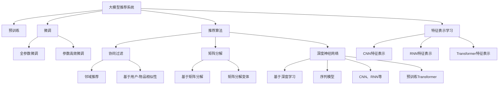

                 

# 大模型推荐系统的发展趋势

## 1. 背景介绍

### 1.1 问题由来
推荐系统在互联网时代扮演着越来越重要的角色，极大地影响了用户的购物、娱乐、学习等生活方方面面。传统的基于协同过滤和矩阵分解的推荐算法，在处理小规模用户-物品交互数据时表现优异，但对于数据量巨大、维度极高的用户行为数据，其推荐效果逐渐难以满足用户期待。

随着深度学习技术的发展，大模型推荐系统应运而生。大模型推荐系统通过预训练模型，从海量用户行为数据中学习出复杂、高维的特征表示，结合用户-物品交互数据进行微调，构建高质量的推荐模型。通过引入预训练大模型的知识，大模型推荐系统在推荐精度、泛化能力等方面取得了显著提升。

### 1.2 问题核心关键点
大模型推荐系统的主要研究目标是构建具有以下特性的推荐系统：
- 高效性：能够在实时或近实时处理大规模用户行为数据，快速生成推荐结果。
- 泛化性：不仅能在当前数据集上取得良好效果，还能应对数据分布变化。
- 可解释性：通过优化模型的可解释性，提升用户对推荐结果的理解和信任。
- 鲁棒性：在对抗样本、噪声数据等非理想数据情况下，仍能保证推荐效果稳定。
- 隐私保护：兼顾用户隐私保护和个性化推荐的需求，构建可信推荐系统。

## 2. 核心概念与联系

### 2.1 核心概念概述

为更好地理解大模型推荐系统的发展趋势，本节将介绍几个密切相关的核心概念：

- 大模型推荐系统：利用预训练大模型进行特征表示和推荐模型构建的推荐系统。通过在大规模数据上进行预训练，学习到通用的用户行为和物品特征表示。
- 预训练(Pre-training)：指在大规模无标签用户行为数据上，通过自监督学习任务训练通用大模型的过程。常见的预训练任务包括预测用户行为、用户意图推断等。
- 微调(Fine-tuning)：指在预训练模型的基础上，使用用户-物品交互数据进行有监督学习优化推荐模型。
- 推荐算法：用于预测用户对物品的评分、偏好等，并生成推荐结果的算法。常见的推荐算法包括协同过滤、矩阵分解、深度神经网络等。
- 特征表示学习(Feature Representation Learning)：通过预训练和微调学习用户行为和物品特征的向量表示。
- 冷启动问题(Cold-start Problem)：新用户或新物品加入系统时，缺乏足够行为数据，推荐模型难以取得理想效果的问题。
- 迁移学习(Transfer Learning)：将在大规模数据上学习到的知识，迁移到小规模数据上进行推荐，提高推荐效果。
- 多任务学习(Multi-task Learning)：同时学习多个推荐任务，提升模型泛化能力和推荐效果。
- 元学习(Meta Learning)：通过学习如何学习，在新的推荐任务上快速适应，提高模型迁移能力。

这些核心概念之间的逻辑关系可以通过以下Mermaid流程图来展示：



这个流程图展示了大模型推荐系统的核心概念及其之间的关系：

1. 大模型推荐系统通过预训练和微调获得特征表示。
2. 特征表示学习可采用多种方式，如CNN、RNN、Transformer等。
3. 推荐算法可以是多种类型的，包括协同过滤、矩阵分解、深度神经网络等。
4. 推荐算法通过特征表示和用户-物品交互数据，进行评分预测和推荐结果生成。

这些概念共同构成了大模型推荐系统的学习和应用框架，使其能够在各种推荐场景下发挥强大的推荐能力。通过理解这些核心概念，我们可以更好地把握大模型推荐系统的工作原理和优化方向。

## 3. 核心算法原理 & 具体操作步骤
### 3.1 算法原理概述

大模型推荐系统的核心思想是：利用预训练大模型学习用户行为和物品特征的表示，然后在用户-物品交互数据上进行微调，优化推荐模型，生成个性化推荐结果。

形式化地，假设预训练模型为 $M_{\theta}$，其中 $\theta$ 为预训练得到的模型参数。给定用户 $u$ 和物品 $i$，用户-物品交互数据为 $D=\{(u_i,i_i)\}_{i=1}^N, u_i \in U, i_i \in I$。推荐模型的目标是最大化用户对物品的评分，即最大化：

$$
\max_{\theta} \sum_{u,i \in D} f_{u,i}(\theta)
$$

其中 $f_{u,i}(\theta)$ 为推荐模型在用户 $u$ 对物品 $i$ 上的评分预测，通常使用交叉熵损失或均方误差损失函数进行优化。

通过梯度下降等优化算法，微调过程不断更新模型参数 $\theta$，最小化损失函数，使得模型评分逼近真实评分。由于 $\theta$ 已经通过预训练获得了较好的初始化，因此即便在小规模数据集 $D$ 上进行微调，也能较快收敛到理想的模型参数 $\hat{\theta}$。

### 3.2 算法步骤详解

大模型推荐系统的微调过程一般包括以下几个关键步骤：

**Step 1: 准备预训练模型和数据集**
- 选择合适的预训练模型 $M_{\theta}$ 作为初始化参数，如 BERT、GPT 等。
- 准备用户-物品交互数据集 $D$，划分为训练集、验证集和测试集。一般要求交互数据与预训练数据的分布不要差异过大。

**Step 2: 添加任务适配层**
- 根据推荐任务类型，在预训练模型顶层设计合适的输出层和损失函数。
- 对于评分预测任务，通常在顶层添加线性分类器和交叉熵损失函数。
- 对于排序任务，通常使用点积相似度作为输出，并以均方误差损失函数优化。

**Step 3: 设置微调超参数**
- 选择合适的优化算法及其参数，如 AdamW、SGD 等，设置学习率、批大小、迭代轮数等。
- 设置正则化技术及强度，包括权重衰减、Dropout、Early Stopping等。
- 确定冻结预训练参数的策略，如仅微调顶层，或全部参数都参与微调。

**Step 4: 执行梯度训练**
- 将训练集数据分批次输入模型，前向传播计算损失函数。
- 反向传播计算参数梯度，根据设定的优化算法和学习率更新模型参数。
- 周期性在验证集上评估模型性能，根据性能指标决定是否触发 Early Stopping。
- 重复上述步骤直到满足预设的迭代轮数或 Early Stopping 条件。

**Step 5: 测试和部署**
- 在测试集上评估微调后模型 $M_{\hat{\theta}}$ 的性能，对比微调前后的精度提升。
- 使用微调后的模型对新用户-物品对进行评分预测，集成到实际的应用系统中。
- 持续收集新的用户行为数据，定期重新微调模型，以适应数据分布的变化。

以上是基于监督学习微调大模型推荐系统的一般流程。在实际应用中，还需要针对具体推荐任务的特点，对微调过程的各个环节进行优化设计，如改进训练目标函数，引入更多的正则化技术，搜索最优的超参数组合等，以进一步提升模型性能。

### 3.3 算法优缺点

大模型推荐系统具有以下优点：
1. 高效性：通过预训练和微调，可以快速构建高质量的推荐模型，在大规模数据集上实现实时推荐。
2. 泛化性：预训练模型在大规模数据上学习得到的特征表示，能够应对数据分布变化，提高推荐模型泛化能力。
3. 可解释性：通过优化模型的可解释性，用户可以更直观地理解推荐结果背后的原因。
4. 鲁棒性：大模型推荐系统能够对异常数据和对抗样本进行较好处理，保证推荐效果稳定。
5. 隐私保护：通过优化模型的隐私保护机制，实现个性化推荐的同时，保障用户隐私安全。

同时，该方法也存在一定的局限性：
1. 数据需求高：大模型推荐系统对数据量和质量要求较高，需要大规模、多维的用户行为数据。
2. 计算资源消耗大：预训练大模型通常参数量巨大，微调过程中需要大量计算资源。
3. 复杂度高：大模型推荐系统的模型结构和训练过程复杂，难以理解和调试。
4. 冷启动问题：对于新用户和新物品，缺乏足够行为数据，推荐效果难以保证。
5. 过度拟合风险：微调过程容易过度拟合训练数据，泛化能力可能下降。

尽管存在这些局限性，但就目前而言，基于大模型推荐系统的推荐方法在推荐效果和应用场景覆盖方面，已经取得了显著的突破，成为推荐领域的重要范式。

### 3.4 算法应用领域

大模型推荐系统已经在推荐引擎、个性化广告、电商推荐、内容推荐等多个领域得到了广泛的应用，取得了显著的效果。

- 电商推荐：利用用户浏览、点击、购买等行为数据，为每个用户生成个性化商品推荐列表。通过微调后的推荐模型，电商企业能够更准确地匹配用户需求，提升销售额和用户满意度。
- 个性化广告：结合用户浏览历史、兴趣爱好等数据，为用户推荐个性化的广告内容。微调后的推荐模型，使得广告投放更加精准，转化率显著提升。
- 内容推荐：在新闻、视频、音乐等平台上，为用户推荐感兴趣的内容。通过微调后的推荐模型，平台能够提升内容分发效率，提高用户粘性和留存率。
- 金融推荐：通过分析用户的交易记录、历史评分等数据，为用户推荐合适的理财产品、投资策略等。微调后的推荐模型，使得金融服务更加个性化，提高用户体验。

除了上述这些经典应用外，大模型推荐系统还被创新性地应用于更广泛的领域中，如推荐算法优化、推荐系统融合、推荐对抗训练等，为推荐技术带来了新的突破。

## 4. 数学模型和公式 & 详细讲解
### 4.1 数学模型构建

本节将使用数学语言对基于监督学习的大模型推荐系统微调过程进行更加严格的刻画。

记预训练推荐模型为 $M_{\theta}$，其中 $\theta$ 为预训练得到的模型参数。假设微调任务的训练集为 $D=\{(u_i,i_i),f_{u,i}^{\text{label}}\}_{i=1}^N, u_i \in U, i_i \in I$，其中 $f_{u,i}^{\text{label}}$ 为物品 $i$ 在用户 $u$ 上的真实评分。

定义模型 $M_{\theta}$ 在用户 $u$ 对物品 $i$ 上的评分预测为 $f_{u,i}(\theta)$，损失函数为 $\ell(f_{u,i}(\theta),f_{u,i}^{\text{label}})$。微调的目标是最小化损失函数，即找到最优参数：

$$
\theta^* = \mathop{\arg\min}_{\theta} \frac{1}{N} \sum_{u,i} \ell(f_{u,i}(\theta),f_{u,i}^{\text{label}})
$$

在实践中，我们通常使用基于梯度的优化算法（如SGD、Adam等）来近似求解上述最优化问题。设 $\eta$ 为学习率，$\lambda$ 为正则化系数，则参数的更新公式为：

$$
\theta \leftarrow \theta - \eta \nabla_{\theta}\mathcal{L}(\theta) - \eta\lambda\theta
$$

其中 $\nabla_{\theta}\mathcal{L}(\theta)$ 为损失函数对参数 $\theta$ 的梯度，可通过反向传播算法高效计算。

### 4.2 公式推导过程

以下我们以评分预测任务为例，推导交叉熵损失函数及其梯度的计算公式。

假设模型 $M_{\theta}$ 在用户 $u$ 对物品 $i$ 上的评分预测为 $\hat{f}_{u,i}=M_{\theta}(u,i) \in [0,1]$，表示物品 $i$ 在用户 $u$ 上的评分。真实评分 $f_{u,i}^{\text{label}} \in [0,1]$。则交叉熵损失函数定义为：

$$
\ell(f_{u,i}(\theta),f_{u,i}^{\text{label}}) = -f_{u,i}^{\text{label}}\log \hat{f}_{u,i} + (1-f_{u,i}^{\text{label}})\log (1-\hat{f}_{u,i})
$$

将其代入经验风险公式，得：

$$
\mathcal{L}(\theta) = -\frac{1}{N}\sum_{u,i} [f_{u,i}^{\text{label}}\log M_{\theta}(u,i)+(1-f_{u,i}^{\text{label}})\log(1-M_{\theta}(u,i))]
$$

根据链式法则，损失函数对参数 $\theta_k$ 的梯度为：

$$
\frac{\partial \mathcal{L}(\theta)}{\partial \theta_k} = -\frac{1}{N}\sum_{u,i} (\frac{f_{u,i}^{\text{label}}}{M_{\theta}(u,i)}-\frac{1-f_{u,i}^{\text{label}}}{1-M_{\theta}(u,i)}) \frac{\partial M_{\theta}(u,i)}{\partial \theta_k}
$$

其中 $\frac{\partial M_{\theta}(u,i)}{\partial \theta_k}$ 可进一步递归展开，利用自动微分技术完成计算。

在得到损失函数的梯度后，即可带入参数更新公式，完成模型的迭代优化。重复上述过程直至收敛，最终得到适应用户行为预测的最优模型参数 $\theta^*$。

## 5. 项目实践：代码实例和详细解释说明
### 5.1 开发环境搭建

在进行推荐系统微调实践前，我们需要准备好开发环境。以下是使用Python进行TensorFlow开发的环境配置流程：

1. 安装Anaconda：从官网下载并安装Anaconda，用于创建独立的Python环境。

2. 创建并激活虚拟环境：
```bash
conda create -n tf-env python=3.8 
conda activate tf-env
```

3. 安装TensorFlow：根据CUDA版本，从官网获取对应的安装命令。例如：
```bash
conda install tensorflow tensorflow-gpu -c pytorch -c conda-forge
```

4. 安装各类工具包：
```bash
pip install numpy pandas scikit-learn matplotlib tqdm jupyter notebook ipython
```

完成上述步骤后，即可在`tf-env`环境中开始推荐系统微调实践。

### 5.2 源代码详细实现

下面我以协同过滤推荐系统为例，给出使用TensorFlow进行推荐系统微调的代码实现。

首先，定义推荐系统的数据处理函数：

```python
import tensorflow as tf
from tensorflow.keras.layers import Input, Embedding, Flatten, Concatenate, Dense, Model

class RecommendationSystem:
    def __init__(self, input_shape, embed_dim):
        self.user_input = Input(shape=input_shape)
        self.item_input = Input(shape=input_shape)
        self.user_embedding = Embedding(input_shape[0], embed_dim, mask_zero=True)(self.user_input)
        self.item_embedding = Embedding(input_shape[1], embed_dim, mask_zero=True)(self.item_input)
        self.interaction = Concatenate()([self.user_embedding, self.item_embedding])
        self.interaction = Dense(64, activation='relu')(self.interaction)
        self.interaction = Dense(1, activation='sigmoid')(self.interaction)
        self.model = Model([self.user_input, self.item_input], self.interaction)

    def compile(self, optimizer='adam', loss='binary_crossentropy'):
        self.model.compile(optimizer=optimizer, loss=loss)
        
    def train(self, train_data, batch_size, epochs=10):
        self.model.fit(train_data, epochs=epochs, batch_size=batch_size)
        
    def evaluate(self, test_data):
        loss = self.model.evaluate(test_data)
        return loss
        
    def predict(self, data):
        return self.model.predict(data)
```

然后，定义模型和优化器：

```python
from tensorflow.keras.optimizers import Adam

model = RecommendationSystem(input_shape=[1, 1000], embed_dim=100)
optimizer = Adam(learning_rate=0.001)
```

接着，定义训练和评估函数：

```python
from sklearn.model_selection import train_test_split
from tensorflow.keras.preprocessing.sequence import pad_sequences

def load_data():
    # 加载用户行为数据
    # ...
    # 生成训练集和测试集
    train_data, test_data = train_test_split(data, test_size=0.2)
    train_seq = pad_sequences(train_data, maxlen=100, padding='post')
    test_seq = pad_sequences(test_data, maxlen=100, padding='post')
    return train_seq, test_seq

def train_model(model, train_data, batch_size, epochs=10):
    model.compile(optimizer=optimizer, loss='binary_crossentropy')
    model.fit(train_data, epochs=epochs, batch_size=batch_size)

def evaluate_model(model, test_data):
    loss = model.evaluate(test_data)
    return loss

def predict_recommendation(model, user, item):
    user_seq = pad_sequences([user], maxlen=100, padding='post')
    item_seq = pad_sequences([item], maxlen=100, padding='post')
    prediction = model.predict([user_seq, item_seq])
    return prediction
```

最后，启动训练流程并在测试集上评估：

```python
train_seq, test_seq = load_data()

train_model(model, train_seq, batch_size=16)

loss = evaluate_model(model, test_seq)
print('Test loss:', loss)

prediction = predict_recommendation(model, 0, 0)
print('Prediction:', prediction)
```

以上就是使用TensorFlow进行协同过滤推荐系统微调的完整代码实现。可以看到，得益于TensorFlow的强大封装，我们可以用相对简洁的代码完成推荐系统的构建和微调。

### 5.3 代码解读与分析

让我们再详细解读一下关键代码的实现细节：

**RecommendationSystem类**：
- `__init__`方法：初始化用户和物品的嵌入层、全连接层和预测输出层。
- `compile`方法：对模型进行编译，指定优化器和损失函数。
- `train`方法：对模型进行训练，指定训练集、批次大小和迭代轮数。
- `evaluate`方法：对模型进行评估，指定测试集。
- `predict`方法：对新用户-物品对进行评分预测。

**load_data函数**：
- 加载用户行为数据，并进行预处理，生成训练集和测试集。
- 对用户和物品ID进行独热编码，并对序列进行padding，确保所有样本的长度一致。

**train_model函数**：
- 对模型进行编译，指定优化器和损失函数。
- 对训练集进行训练，指定批次大小和迭代轮数。

**evaluate_model函数**：
- 对模型进行评估，指定测试集。
- 计算模型在测试集上的损失。

**predict_recommendation函数**：
- 对新用户和物品ID进行独热编码，并对序列进行padding。
- 对输入进行评分预测，返回预测结果。

可以看到，TensorFlow在推荐系统微调中的应用非常灵活，开发者可以根据具体任务设计不同的模型结构，并利用TensorFlow提供的丰富功能进行优化和调试。

当然，工业级的系统实现还需考虑更多因素，如模型的保存和部署、超参数的自动搜索、推荐结果的评估与调整等。但核心的微调范式基本与此类似。

## 6. 实际应用场景
### 6.1 智能推荐引擎

大模型推荐系统已经在智能推荐引擎上得到广泛应用。智能推荐引擎能够实时处理用户行为数据，为每个用户推荐合适的商品、内容、视频等，提升用户体验和平台收益。

在技术实现上，可以收集用户历史行为数据，如浏览、点击、购买等，结合实时行为数据，构建多维度的用户行为特征向量。利用预训练和微调后的推荐模型，对用户行为特征进行建模，预测用户对物品的评分，并根据评分进行排序推荐。此外，还可以引入对抗训练和模型融合等技术，提升推荐系统的鲁棒性和泛化能力。

### 6.2 个性化广告投放

推荐系统不仅限于商品推荐，还可以应用于个性化广告投放。广告主利用推荐系统，能够精准定位目标用户，提升广告投放的转化率和ROI。

在实践中，广告主可以收集用户的浏览历史、搜索记录等行为数据，并结合实时广告数据，输入到微调后的推荐模型中。推荐模型能够预测用户对不同广告的兴趣程度，并生成排序后的广告列表，帮助广告主实现更精准的广告投放。此外，还可以引入点击率预估、CTR排序等优化算法，进一步提升广告投放效果。

### 6.3 内容推荐平台

推荐系统还被应用于各种内容推荐平台，如新闻、视频、音乐等。通过分析用户的历史行为和兴趣偏好，推荐系统能够为用户推荐感兴趣的内容，提升用户的粘性和留存率。

在内容推荐平台中，推荐模型通常需要处理大规模用户数据和多维度的内容特征，如标签、时长、热度等。通过预训练和微调后的推荐模型，能够构建高质量的内容推荐系统，提升平台的用户体验和内容分发效率。

### 6.4 未来应用展望

随着大模型推荐系统的发展，未来其在推荐领域的应用前景更加广阔。以下是大模型推荐系统的几个发展趋势：

1. 高效实时推荐：通过优化模型结构和计算图，提升推荐系统的实时处理能力，支持低延迟推荐。
2. 多模态推荐：引入视觉、音频等多模态信息，提升推荐系统对真实世界的理解和建模能力。
3. 跨领域推荐：结合不同领域的知识图谱，实现跨领域的推荐，提升推荐系统泛化能力。
4. 隐私保护推荐：引入差分隐私、联邦学习等技术，实现个性化推荐的同时，保障用户隐私安全。
5. 推荐对抗训练：通过引入对抗样本和鲁棒性优化，提升推荐系统对异常数据和攻击的抵抗能力。
6. 推荐系统公平性：引入公平性评估指标，确保推荐系统在性别、年龄等维度上的公平性。

这些趋势将进一步提升大模型推荐系统的性能和应用范围，为推荐领域带来新的突破。

## 7. 工具和资源推荐
### 7.1 学习资源推荐

为了帮助开发者系统掌握大模型推荐系统的理论基础和实践技巧，这里推荐一些优质的学习资源：

1. 《Recommender Systems》课程：由斯坦福大学开设的NLP明星课程，涵盖推荐系统的基本概念、算法和应用，适合初学者入门。

2. 《推荐系统实战》书籍：深入讲解推荐系统从理论到实践的各个环节，提供了大量实际案例和代码实现。

3. 《深度学习与推荐系统》书籍：讲解深度学习在大推荐系统中的应用，介绍了多种前沿推荐算法和优化策略。

4. Kaggle推荐系统竞赛：通过实际竞赛项目，实战演练推荐系统建模和优化，积累项目经验。

5. GitHub推荐系统开源项目：查看经典推荐系统算法和模型的代码实现，学习先进推荐技术。

通过对这些资源的学习实践，相信你一定能够快速掌握大模型推荐系统的精髓，并用于解决实际的推荐问题。
### 7.2 开发工具推荐

高效的开发离不开优秀的工具支持。以下是几款用于大模型推荐系统开发的工具：

1. TensorFlow：基于Python的开源深度学习框架，灵活的计算图和自动微分技术，支持各种推荐算法和模型优化。

2. PyTorch：基于Python的开源深度学习框架，高效的动态计算图，支持多种推荐算法和模型实现。

3. HuggingFace Transformers库：基于Transformer的NLP工具库，集成了多种预训练语言模型和推荐模型，支持微调和部署。

4. Amazon SageMaker：AWS提供的云端机器学习平台，支持多种推荐算法和模型训练，提供完善的监控和部署功能。

5. Google Cloud AI Platform：Google提供的云端机器学习平台，支持大规模推荐系统训练和部署，提供高可用性服务。

6. Apache Spark：大数据处理框架，支持推荐系统的离线训练和实时推荐，提供分布式计算能力。

7. ElasticSearch：开源搜索引擎，支持高维数据存储和查询，适合大规模推荐系统的实时查询。

合理利用这些工具，可以显著提升大模型推荐系统的开发效率，加快创新迭代的步伐。

### 7.3 相关论文推荐

大模型推荐系统的发展源于学界的持续研究。以下是几篇奠基性的相关论文，推荐阅读：

1. "Collaborative Filtering for Implicit Feedback Datasets"：推荐系统的经典协同过滤算法，奠定了协同过滤推荐的基础。

2. "Matrix Factorization Techniques for Recommender Systems"：矩阵分解算法在推荐系统中的应用，展示了矩阵分解的强大推荐能力。

3. "Deep Learning in Recommendation Systems"：深度学习在推荐系统中的应用，介绍了多种深度神经网络推荐模型。

4. "Neural Networks for Collaborative Filtering"：基于神经网络的推荐模型，展示了神经网络在推荐系统中的优异表现。

5. "Scalable and Generalized Recommender Systems"：推荐系统从数据到算法的全面优化，展示了推荐系统的未来发展方向。

这些论文代表了大模型推荐系统的发展脉络。通过学习这些前沿成果，可以帮助研究者把握学科前进方向，激发更多的创新灵感。

## 8. 总结：未来发展趋势与挑战

### 8.1 总结

本文对基于大模型推荐系统的推荐系统发展趋势进行了全面系统的介绍。首先阐述了大模型推荐系统在推荐领域的研究背景和意义，明确了推荐系统在大数据和深度学习背景下的新发展方向。其次，从原理到实践，详细讲解了推荐系统的数学原理和关键步骤，给出了推荐系统微调任务的完整代码实现。同时，本文还广泛探讨了推荐系统在智能推荐引擎、个性化广告、内容推荐等多个领域的实际应用，展示了推荐系统微调方法的巨大潜力。此外，本文精选了推荐系统的各类学习资源，力求为读者提供全方位的技术指引。

通过本文的系统梳理，可以看到，基于大模型推荐系统的推荐方法正在成为推荐领域的重要范式，极大地拓展了推荐系统的应用边界，提升了推荐效果。未来，伴随深度学习技术和大模型推荐系统的不断演进，推荐系统必将在更广泛的场景下发挥其智能化推荐能力，为用户带来更优质和个性化的服务体验。

### 8.2 未来发展趋势

展望未来，大模型推荐系统将呈现以下几个发展趋势：

1. 高效实时推荐：通过优化模型结构和计算图，提升推荐系统的实时处理能力，支持低延迟推荐。

2. 多模态推荐：引入视觉、音频等多模态信息，提升推荐系统对真实世界的理解和建模能力。

3. 跨领域推荐：结合不同领域的知识图谱，实现跨领域的推荐，提升推荐系统泛化能力。

4. 隐私保护推荐：引入差分隐私、联邦学习等技术，实现个性化推荐的同时，保障用户隐私安全。

5. 推荐对抗训练：通过引入对抗样本和鲁棒性优化，提升推荐系统对异常数据和攻击的抵抗能力。

6. 推荐系统公平性：引入公平性评估指标，确保推荐系统在性别、年龄等维度上的公平性。

这些趋势将进一步提升大模型推荐系统的性能和应用范围，为推荐领域带来新的突破。

### 8.3 面临的挑战

尽管大模型推荐系统已经取得了显著的成效，但在迈向更加智能化、普适化应用的过程中，它仍面临诸多挑战：

1. 数据需求高：大模型推荐系统对数据量和质量要求较高，需要大规模、多维的用户行为数据。

2. 计算资源消耗大：预训练大模型通常参数量巨大，微调过程中需要大量计算资源。

3. 复杂度高：大模型推荐系统的模型结构和训练过程复杂，难以理解和调试。

4. 冷启动问题：对于新用户和新物品，缺乏足够行为数据，推荐效果难以保证。

5. 过度拟合风险：微调过程容易过度拟合训练数据，泛化能力可能下降。

尽管存在这些局限性，但就目前而言，基于大模型推荐系统的推荐方法在推荐效果和应用场景覆盖方面，已经取得了显著的突破，成为推荐领域的重要范式。

### 8.4 研究展望

面对大模型推荐系统所面临的种种挑战，未来的研究需要在以下几个方面寻求新的突破：

1. 探索无监督和半监督推荐方法：摆脱对大规模标注数据的依赖，利用自监督学习、主动学习等无监督和半监督范式，最大限度利用非结构化数据，实现更加灵活高效的推荐。

2. 研究参数高效和计算高效的推荐范式：开发更加参数高效的推荐方法，在固定大部分预训练参数的同时，只更新极少量的任务相关参数。同时优化推荐模型的计算图，减少前向传播和反向传播的资源消耗，实现更加轻量级、实时性的部署。

3. 融合因果和对比学习范式：通过引入因果推断和对比学习思想，增强推荐模型建立稳定因果关系的能力，学习更加普适、鲁棒的用户行为和物品特征。

4. 引入更多先验知识：将符号化的先验知识，如知识图谱、逻辑规则等，与神经网络模型进行巧妙融合，引导推荐过程学习更准确、合理的用户行为和物品特征。

5. 结合因果分析和博弈论工具：将因果分析方法引入推荐模型，识别出模型决策的关键特征，增强推荐结果的因果性和逻辑性。借助博弈论工具刻画人机交互过程，主动探索并规避推荐模型的脆弱点，提高系统稳定性。

6. 纳入伦理道德约束：在推荐模型训练目标中引入伦理导向的评估指标，过滤和惩罚有偏见、有害的输出倾向。同时加强人工干预和审核，建立推荐模型的监管机制，确保输出符合人类价值观和伦理道德。

这些研究方向的探索，必将引领大模型推荐系统迈向更高的台阶，为推荐系统构建更加智能、公平、安全、可信的推荐引擎。面向未来，大模型推荐系统还需要与其他人工智能技术进行更深入的融合，如知识表示、因果推理、强化学习等，多路径协同发力，共同推动推荐技术的发展进步。

## 9. 附录：常见问题与解答

**Q1：大模型推荐系统是否适用于所有推荐场景？**

A: 大模型推荐系统在大多数推荐场景中都能取得不错的效果，特别是对于数据量较大的推荐任务。但对于一些特殊场景，如实时推荐、多模态推荐等，可能面临计算资源、算法复杂度等限制，需要结合具体场景进行优化和改进。

**Q2：如何评估大模型推荐系统的性能？**

A: 推荐系统的性能评估通常包括准确率、召回率、F1分数、平均绝对误差等指标。这些指标通过评估模型预测结果与真实结果之间的差异，衡量模型的推荐能力。此外，还可以引入用户满意度、点击率等业务指标，综合评估推荐系统的效果。

**Q3：推荐系统中如何处理冷启动问题？**

A: 冷启动问题可以通过以下方法处理：
1. 基于内容的推荐：利用物品特征，对新物品进行推荐。
2. 基于模式的推荐：利用新用户的行为模式，对相似用户进行推荐。
3. 基于标签的推荐：利用新物品的标签，对有相同标签的用户进行推荐。
4. 结合多种推荐方法，提升推荐效果。

**Q4：推荐系统如何平衡个性化和多样性？**

A: 推荐系统可以通过以下方法平衡个性化和多样性：
1. 多臂老虎机算法：在个性化推荐的基础上，引入多样性约束，提升推荐的多样性。
2. 推荐集成：结合多个推荐模型，综合多种推荐结果，提升推荐的多样性。
3. 探索性推荐：在个性化推荐的同时，引入探索性算法，推荐多样化物品。

**Q5：推荐系统中如何处理噪声数据？**

A: 推荐系统可以通过以下方法处理噪声数据：
1. 数据清洗：过滤掉低质量、无效的行为数据，提升数据质量。
2. 异常检测：使用异常检测算法，识别和过滤噪声数据。
3. 鲁棒性优化：引入鲁棒性优化算法，提升模型对噪声数据的抵抗能力。

这些方法可以结合使用，提升推荐系统的鲁棒性和推荐效果。

---

作者：禅与计算机程序设计艺术 / Zen and the Art of Computer Programming

