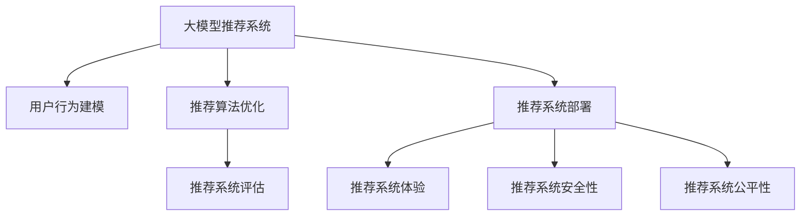

                 

# 大模型推荐系统的商业化落地挑战

> 关键词：大模型推荐系统, 商业化落地, 推荐系统挑战, 用户体验, 技术挑战, 算法优化, 数据质量, 性能评估, 模型部署

## 1. 背景介绍

### 1.1 问题由来
在当今的互联网时代，推荐系统已经成为提升用户体验、驱动内容消费的重要手段。传统的协同过滤、矩阵分解等推荐算法，在数据稀疏、冷启动等问题上存在局限性。而基于深度学习的大模型推荐系统，通过学习用户与物品间的深度交互模式，可以更精准地预测用户行为，从而实现个性化推荐。

近年来，大模型推荐系统在电商、新闻、视频、音乐等诸多领域得到广泛应用。例如，京东、淘宝等电商平台利用深度神经网络推荐系统，提升用户浏览转化率，增加销售额。字节跳动、Netflix等公司则通过大模型推荐系统，改善内容推荐质量，提升用户粘性。这些成功案例验证了大模型推荐系统的潜力，也引发了行业内对大模型推荐系统的高度关注。

然而，在商业化落地的过程中，大模型推荐系统仍面临诸多挑战。本文将围绕大模型推荐系统商业化落地过程中的关键问题，系统梳理其实现思路、挑战与优化策略，希望为相关从业者提供有益的参考。

### 1.2 问题核心关键点
大模型推荐系统商业化落地的核心关键点主要包括：

1. **用户行为建模**：如何准确捕捉用户行为模式，获取深度交互特征。
2. **推荐算法优化**：如何在大规模数据上高效训练推荐模型，提升模型性能。
3. **推荐系统评估**：如何制定合理的指标体系，评估推荐系统效果。
4. **推荐系统部署**：如何将推荐模型高效部署到生产环境，实现实时推荐。
5. **推荐系统体验**：如何设计合理的推荐展示页面，提升用户体验。
6. **推荐系统安全性**：如何确保推荐内容健康、合规，避免有害信息传播。
7. **推荐系统公平性**：如何避免推荐偏差，实现公平推荐。

这些关键点相互交织，共同构成了大模型推荐系统商业化落地的主要挑战。通过系统化地探讨这些问题，我们可以更深入地理解大模型推荐系统的应用路径，为其成功落地提供指导。

## 2. 核心概念与联系

### 2.1 核心概念概述

为更好地理解大模型推荐系统的商业化落地过程，本节将介绍几个关键概念：

- **大模型推荐系统(Recommender System based on Large Models)**：使用深度学习大模型，如BERT、GPT等，对用户和物品进行深度表示，学习用户与物品间的交互模式，实现个性化推荐。
- **推荐系统(Recommender System)**：通过分析用户行为和物品属性，为用户推荐可能感兴趣的物品，提升用户满意度。
- **推荐系统评估(Metrics for Recommender System)**：使用AUC、mAP、CVR等指标，评估推荐系统的效果。
- **推荐系统部署(Recommender System Deployment)**：将训练好的推荐模型部署到线上环境，实现实时推荐。
- **推荐系统体验(Recommender System Experience)**：通过合理的页面设计和展示逻辑，提升用户的使用体验。
- **推荐系统安全性(Recommender System Security)**：确保推荐内容的合规性和无害性，避免有害信息传播。
- **推荐系统公平性(Recommender System Fairness)**：避免推荐偏差，实现公平推荐，减少社会歧视和偏见。

这些核心概念之间的逻辑关系可以通过以下Mermaid流程图来展示：



这个流程图展示了大模型推荐系统的核心概念及其之间的关系：

1. 大模型推荐系统通过用户行为建模，获取深度交互特征。
2. 通过推荐算法优化，训练推荐模型。
3. 使用推荐系统评估指标，评估模型效果。
4. 将推荐模型部署到生产环境，实现实时推荐。
5. 设计推荐系统展示页面，提升用户体验。
6. 确保推荐内容合规无害，避免有害信息传播。
7. 实现推荐公平性，减少社会偏见。

这些概念共同构成了大模型推荐系统的完整框架，使其能够有效服务于用户，实现商业化落地。

## 3. 核心算法原理 & 具体操作步骤

### 3.1 算法原理概述

大模型推荐系统基于深度学习大模型进行用户行为建模，通过学习用户与物品间的深度交互模式，实现个性化推荐。其核心思想是：

1. **用户表示学习**：将用户输入（如行为记录、属性信息等）映射到高维向量空间，获取用户表示。
2. **物品表示学习**：将物品输入（如文本描述、图片信息等）映射到高维向量空间，获取物品表示。
3. **用户-物品交互表示学习**：学习用户与物品间的交互特征，通过注意力机制等方法，对用户表示和物品表示进行加权融合，得到用户对物品的评分。
4. **推荐排序**：将用户评分排序，推荐评分最高的物品给用户。

通过以上步骤，大模型推荐系统能够实现更精准、个性化的推荐。

### 3.2 算法步骤详解

大模型推荐系统的核心算法步骤如下：

**Step 1: 用户行为数据采集与预处理**
- 采集用户行为数据，如浏览记录、点击行为、购买记录等。
- 对原始数据进行清洗、去重、归一化等预处理。
- 将预处理后的数据转化为推荐系统所需的格式。

**Step 2: 用户表示学习**
- 使用深度神经网络对用户行为数据进行编码，生成用户向量表示。
- 将用户向量与物品向量进行拼接，得到用户对物品的评分。

**Step 3: 物品表示学习**
- 使用深度神经网络对物品信息进行编码，生成物品向量表示。
- 将物品向量与用户向量进行拼接，得到用户对物品的评分。

**Step 4: 用户-物品交互表示学习**
- 使用注意力机制对用户向量与物品向量进行加权融合。
- 通过多层感知机或深度神经网络学习用户与物品间的交互特征，得到用户对物品的评分。

**Step 5: 推荐排序**
- 对用户评分进行排序，选择评分最高的物品进行推荐。

### 3.3 算法优缺点

大模型推荐系统具有以下优点：

1. **高精度**：利用深度学习模型，可以高效捕捉用户行为与物品特征，实现更准确的推荐。
2. **可扩展性**：可以处理大规模数据，适应海量用户和物品。
3. **个性化**：通过深度学习模型，可以更好地理解和刻画用户个性化需求。

但同时也存在一些缺点：

1. **计算成本高**：深度学习模型计算量大，需要高性能计算资源。
2. **数据需求高**：需要大规模用户行为数据和物品信息。
3. **模型复杂**：深度学习模型结构复杂，难以解释和调试。
4. **偏差问题**：可能存在数据偏见，导致推荐偏差。

### 3.4 算法应用领域

大模型推荐系统在电子商务、内容推荐、社交网络、广告推荐等多个领域得到广泛应用。例如：

- **电子商务**：京东、淘宝等电商平台利用深度神经网络推荐系统，提升用户浏览转化率，增加销售额。
- **内容推荐**：字节跳动、Netflix等公司通过大模型推荐系统，改善内容推荐质量，提升用户粘性。
- **社交网络**：微博、微信等社交平台利用推荐系统，增强用户互动，提高用户留存率。
- **广告推荐**：谷歌、百度等公司通过推荐系统，精准推送广告，提升广告效果。

除了上述这些经典领域，大模型推荐系统还在金融、旅游、医疗等众多领域得到创新性应用，为不同行业的业务提升提供新的解决方案。

## 4. 数学模型和公式 & 详细讲解 & 举例说明

### 4.1 数学模型构建

大模型推荐系统的数学模型主要包括以下几部分：

1. **用户向量表示**：使用深度神经网络对用户行为数据进行编码，生成用户向量 $u$。
2. **物品向量表示**：使用深度神经网络对物品信息进行编码，生成物品向量 $i$。
3. **用户-物品交互表示**：通过注意力机制对用户向量与物品向量进行加权融合，生成用户对物品的评分 $p$。
4. **推荐排序**：对用户评分进行排序，选择评分最高的物品进行推荐。

数学模型构建的关键在于选择合适的深度神经网络结构，以及如何高效训练模型。本文将重点介绍如何构建推荐模型的数学模型。

### 4.2 公式推导过程

假设用户行为数据为 $x$，物品信息为 $y$，用户行为表示为 $u$，物品信息表示为 $i$，用户-物品交互表示为 $p$，推荐排序结果为 $r$。推荐模型的数学模型可以表示为：

$$
u = f(x)
$$

$$
i = g(y)
$$

$$
p = h(u, i)
$$

$$
r = \text{softmax}(p)
$$

其中，$f$、$g$、$h$ 和 softmax 函数分别为用户向量表示、物品向量表示、用户-物品交互表示和推荐排序函数。具体推导过程如下：

- **用户向量表示**：使用深度神经网络对用户行为数据 $x$ 进行编码，生成用户向量 $u$。
- **物品向量表示**：使用深度神经网络对物品信息 $y$ 进行编码，生成物品向量 $i$。
- **用户-物品交互表示**：通过注意力机制对用户向量 $u$ 和物品向量 $i$ 进行加权融合，生成用户对物品的评分 $p$。
- **推荐排序**：使用 softmax 函数对评分 $p$ 进行归一化，得到推荐排序结果 $r$。

通过上述数学模型，大模型推荐系统能够高效地捕捉用户与物品间的交互模式，实现个性化推荐。

### 4.3 案例分析与讲解

以电商平台推荐系统为例，介绍如何构建推荐模型。电商平台推荐系统需要解决的核心问题是如何根据用户历史行为数据，预测其未来购买行为，并推荐可能感兴趣的商品。

假设电商平台的数据集为 $\{(x_i, y_i)\}_{i=1}^N$，其中 $x_i$ 为用户历史行为数据，$y_i$ 为用户后续购买行为。

**Step 1: 用户行为数据采集与预处理**

- 采集用户历史行为数据，如浏览记录、点击行为、购买记录等。
- 对原始数据进行清洗、去重、归一化等预处理。
- 将预处理后的数据转化为推荐系统所需的格式。

**Step 2: 用户表示学习**

- 使用深度神经网络对用户行为数据 $x_i$ 进行编码，生成用户向量 $u_i$。
- 将用户向量 $u_i$ 与物品向量 $i_j$ 进行拼接，得到用户对物品 $j$ 的评分 $p_{ij}$。

**Step 3: 物品表示学习**

- 使用深度神经网络对物品信息 $y_j$ 进行编码，生成物品向量 $i_j$。
- 将物品向量 $i_j$ 与用户向量 $u_i$ 进行拼接，得到用户对物品 $j$ 的评分 $p_{ij}$。

**Step 4: 用户-物品交互表示学习**

- 使用注意力机制对用户向量 $u_i$ 和物品向量 $i_j$ 进行加权融合，生成用户对物品 $j$ 的评分 $p_{ij}$。
- 通过多层感知机或深度神经网络学习用户与物品间的交互特征，得到用户对物品 $j$ 的评分 $p_{ij}$。

**Step 5: 推荐排序**

- 对用户评分 $p_{ij}$ 进行排序，选择评分最高的物品 $j$ 进行推荐。

以上案例分析展示了如何利用深度学习大模型构建推荐系统，并实现了个性化的商品推荐。

## 5. 项目实践：代码实例和详细解释说明

### 5.1 开发环境搭建

在进行推荐系统开发前，我们需要准备好开发环境。以下是使用Python进行TensorFlow开发的环境配置流程：

1. 安装Anaconda：从官网下载并安装Anaconda，用于创建独立的Python环境。

2. 创建并激活虚拟环境：
```bash
conda create -n tf-env python=3.8 
conda activate tf-env
```

3. 安装TensorFlow：根据CUDA版本，从官网获取对应的安装命令。例如：
```bash
conda install tensorflow -c conda-forge -c pytorch
```

4. 安装TensorFlow Addons：用于增强TensorFlow的功能，如稀疏张量等。
```bash
conda install tensorflow-addons -c conda-forge
```

5. 安装各类工具包：
```bash
pip install numpy pandas scikit-learn matplotlib tqdm jupyter notebook ipython
```

完成上述步骤后，即可在`tf-env`环境中开始推荐系统开发。

### 5.2 源代码详细实现

这里我们以电商推荐系统为例，给出使用TensorFlow进行深度学习推荐模型的PyTorch代码实现。

首先，定义推荐模型的架构：

```python
import tensorflow as tf

class Recommender(tf.keras.Model):
    def __init__(self, input_dim, embedding_dim, num_items, num_factors):
        super(Recommender, self).__init__()
        self.embedding1 = tf.keras.layers.Embedding(input_dim, embedding_dim)
        self.dot_product = tf.keras.layers.Dot(axes=1, normalize=True)
        self.dense = tf.keras.layers.Dense(num_items)
        self.dropout = tf.keras.layers.Dropout(0.1)

    def call(self, user_input, item_input):
        user_embed = self.embedding1(user_input)
        item_embed = self.embedding1(item_input)
        dot_product = self.dot_product([user_embed, item_embed])
        user_item_embed = self.dense(dot_product)
        output = self.dropout(user_item_embed)
        return output
```

然后，定义推荐系统的损失函数和优化器：

```python
def binary_crossentropy_loss(labels, logits):
    return tf.keras.losses.BinaryCrossentropy()(labels, logits)

optimizer = tf.keras.optimizers.Adam(learning_rate=0.001)
```

接着，定义训练和评估函数：

```python
def train_epoch(model, train_dataset, batch_size, optimizer):
    dataloader = tf.data.Dataset.from_tensor_slices(train_dataset)
    dataloader = dataloader.shuffle(buffer_size=1000).batch(batch_size).prefetch(tf.data.experimental.AUTOTUNE)
    for batch in dataloader:
        with tf.GradientTape() as tape:
            logits = model(batch[0], batch[1])
            loss = binary_crossentropy_loss(batch[2], logits)
        gradients = tape.gradient(loss, model.trainable_variables)
        optimizer.apply_gradients(zip(gradients, model.trainable_variables))

def evaluate(model, test_dataset, batch_size):
    correct_predictions = 0
    total_predictions = 0
    for batch in test_dataset:
        logits = model(batch[0], batch[1])
        predictions = tf.sigmoid(logits)
        correct_predictions += tf.reduce_sum(predictions)
        total_predictions += predictions.shape[0]
    accuracy = correct_predictions / total_predictions
    return accuracy
```

最后，启动训练流程并在测试集上评估：

```python
epochs = 10
batch_size = 128

for epoch in range(epochs):
    train_epoch(model, train_dataset, batch_size, optimizer)
    print(f"Epoch {epoch+1}, train accuracy: {accuracy:.3f}")
    
    print(f"Epoch {epoch+1}, test results:")
    evaluate(model, test_dataset, batch_size)
    
print("Final test accuracy:", evaluate(model, test_dataset, batch_size))
```

以上就是使用TensorFlow构建推荐模型的完整代码实现。可以看到，借助TensorFlow的强大功能，我们可以方便地构建深度学习推荐模型，并实现高效的训练和评估。

### 5.3 代码解读与分析

让我们再详细解读一下关键代码的实现细节：

**Recommender类**：
- `__init__`方法：初始化模型参数，包括嵌入层、点积层、全连接层和Dropout层。
- `call`方法：前向传播计算模型的输出。

**损失函数和优化器**：
- `binary_crossentropy_loss`函数：定义二分类交叉熵损失函数。
- `Adam`优化器：选择Adam优化器，设置学习率。

**训练和评估函数**：
- `train_epoch`函数：迭代训练模型，计算损失函数和梯度，并更新模型参数。
- `evaluate`函数：评估模型的预测准确率，返回测试集上的准确率。

**训练流程**：
- 定义总的epoch数和batch size，开始循环迭代
- 每个epoch内，在训练集上训练，输出平均准确率
- 在测试集上评估，输出测试集上的准确率
- 所有epoch结束后，给出最终测试集上的准确率

可以看到，TensorFlow提供了丰富的工具和函数，使得推荐系统的实现变得简洁高效。开发者可以将更多精力放在模型优化和业务逻辑上，而不必过多关注底层的实现细节。

当然，工业级的系统实现还需考虑更多因素，如模型的保存和部署、超参数的自动搜索、更灵活的任务适配层等。但核心的推荐范式基本与此类似。

## 6. 实际应用场景

### 6.1 电商平台推荐

基于深度学习的大模型推荐系统在电商平台的推荐场景中得到广泛应用。例如，京东、淘宝等电商平台利用深度神经网络推荐系统，提升用户浏览转化率，增加销售额。

在技术实现上，电商平台可以收集用户的浏览、点击、购买等行为数据，将其转化为推荐系统所需的格式。利用深度学习模型，对用户和物品进行深度表示，学习用户与物品间的交互特征，实现个性化推荐。

### 6.2 内容推荐

字节跳动、Netflix等公司通过大模型推荐系统，改善内容推荐质量，提升用户粘性。

内容推荐系统需要处理大量的文本、图片和视频数据，通过深度学习模型学习用户与内容的交互特征，实现个性化推荐。例如，Netflix通过深度神经网络模型，对用户观影记录和评分进行编码，生成用户和电影的向量表示，通过注意力机制学习用户对电影的评分，实现推荐排序。

### 6.3 社交网络推荐

微博、微信等社交平台利用推荐系统，增强用户互动，提高用户留存率。

社交网络推荐系统需要处理大量用户间的关系数据，通过深度学习模型学习用户与内容的交互特征，实现个性化推荐。例如，微博利用深度神经网络模型，对用户互动数据进行编码，生成用户和微博的向量表示，通过注意力机制学习用户对微博的评分，实现推荐排序。

### 6.4 未来应用展望

随着深度学习技术的不断发展，基于大模型推荐系统将在更多领域得到应用，为各行各业带来变革性影响。

在智慧医疗领域，通过推荐系统推荐个性化的诊疗方案，辅助医生诊疗，加速新药开发进程。

在智能教育领域，通过推荐系统推荐个性化的学习内容，因材施教，促进教育公平，提高教学质量。

在智慧城市治理中，通过推荐系统推荐个性化的城市服务，提高城市管理的自动化和智能化水平，构建更安全、高效的未来城市。

此外，在企业生产、社会治理、文娱传媒等众多领域，基于大模型推荐系统的人工智能应用也将不断涌现，为经济社会发展注入新的动力。相信随着技术的日益成熟，大模型推荐系统必将在更广阔的应用领域大放异彩，深刻影响人类的生产生活方式。

## 7. 工具和资源推荐

### 7.1 学习资源推荐

为了帮助开发者系统掌握大模型推荐系统的理论基础和实践技巧，这里推荐一些优质的学习资源：

1. 《深度学习推荐系统》书籍：由世界顶级推荐系统专家撰写，全面介绍了深度学习推荐系统的原理、模型和算法。
2. 《TensorFlow实战深度学习》书籍：深入浅出地介绍了TensorFlow的使用方法，包括推荐系统相关的函数和工具。
3. Coursera《深度学习与推荐系统》课程：由斯坦福大学开设，涵盖深度学习推荐系统的基本概念和经典模型。
4 Udacity《深度学习与推荐系统》课程：通过实际项目，手把手教你构建深度学习推荐系统。
5 《Recommender Systems》书籍：全面介绍了推荐系统的理论、算法和应用。

通过对这些资源的学习实践，相信你一定能够快速掌握大模型推荐系统的精髓，并用于解决实际的推荐问题。

### 7.2 开发工具推荐

大模型推荐系统的开发离不开优秀的工具支持。以下是几款用于推荐系统开发的常用工具：

1. TensorFlow：由谷歌主导开发的开源深度学习框架，生产部署方便，适合大规模工程应用。
2. PyTorch：基于Python的开源深度学习框架，灵活动态，适合快速迭代研究。
3. Scikit-learn：简单易用的机器学习库，适合处理小规模数据集。
4. Jupyter Notebook：交互式编程环境，方便编写和测试推荐系统代码。
5. Weights & Biases：模型训练的实验跟踪工具，可以记录和可视化模型训练过程中的各项指标，方便对比和调优。

合理利用这些工具，可以显著提升大模型推荐系统的开发效率，加快创新迭代的步伐。

### 7.3 相关论文推荐

大模型推荐系统的发展源于学界的持续研究。以下是几篇奠基性的相关论文，推荐阅读：

1. "TensorFlow Recommenders"（Google）：介绍TensorFlow在推荐系统中的应用，涵盖推荐系统的理论、模型和算法。
2. "Neural Collaborative Filtering"（Xavier Bembom, et al.）：提出基于深度神经网络的协同过滤推荐模型，开创了深度学习在推荐系统中的应用。
3. "Attention-based Recommender Systems"（Zongze Li, et al.）：引入注意力机制，增强推荐系统的性能和效果。
4 "A Survey on Neural Networks for Recommender Systems"（Kun Zhang, et al.）：全面综述了深度学习在推荐系统中的应用，包括模型架构、算法和应用。
5 "DeepFM: A Neural Network Approach for Display Ad Ranking"（Jifeng Dai, et al.）：提出DeepFM模型，结合深度神经网络和FM模型，提升推荐系统的效果。

这些论文代表了大模型推荐系统的发展脉络。通过学习这些前沿成果，可以帮助研究者把握学科前进方向，激发更多的创新灵感。

## 8. 总结：未来发展趋势与挑战

### 8.1 总结

本文对基于深度学习的大模型推荐系统进行了全面系统的介绍。首先阐述了推荐系统的背景和意义，明确了大模型推荐系统的核心问题。其次，从原理到实践，详细讲解了大模型推荐系统的数学模型和关键步骤，给出了推荐系统开发的完整代码实例。同时，本文还广泛探讨了大模型推荐系统在电商、内容、社交等领域的实际应用场景，展示了其广泛的应用前景。此外，本文精选了推荐系统的各类学习资源，力求为读者提供全方位的技术指引。

通过本文的系统梳理，可以看到，大模型推荐系统通过深度学习模型，能够高效捕捉用户与物品间的交互模式，实现个性化推荐。未来，随着技术的不断进步，大模型推荐系统必将在更多领域得到应用，为各行各业带来变革性影响。

### 8.2 未来发展趋势

展望未来，大模型推荐系统将呈现以下几个发展趋势：

1. **推荐模型多样化**：随着深度学习模型的不断发展，推荐模型将更加多样化。除了传统的深度神经网络模型，还将涌现更多新的推荐模型，如Graph Neural Network、Transformer等。
2. **推荐系统高效化**：随着硬件计算能力的提升，推荐系统的训练和推理效率将不断提升。可以采用分布式训练、模型压缩等技术，实现更高效的系统部署。
3. **推荐系统泛化能力增强**：通过引入迁移学习、跨领域学习等技术，推荐系统将具备更强的泛化能力，适用于更多场景和任务。
4. **推荐系统公平性提升**：通过引入公平性约束，推荐系统将更加公平，避免推荐偏差和歧视。
5. **推荐系统智能化**：通过引入更多先验知识和外部信息，推荐系统将更加智能化，具备更强的解释性和可解释性。

这些趋势将推动大模型推荐系统向更高层次演进，实现更精准、智能、公平的推荐服务。

### 8.3 面临的挑战

尽管大模型推荐系统已经取得了瞩目成就，但在迈向更加智能化、普适化应用的过程中，仍面临诸多挑战：

1. **数据隐私与安全**：推荐系统需要处理大量用户数据，如何保护用户隐私和数据安全，是一个重要的挑战。
2. **算法透明性与可解释性**：深度学习模型的复杂性和黑盒特性，使得推荐系统的决策过程难以解释和理解，需要进一步提高算法的透明性和可解释性。
3. **模型鲁棒性与抗干扰能力**：推荐系统需要应对多种干扰和攻击，如对抗样本、数据噪声等，如何提升模型的鲁棒性和抗干扰能力，是一个重要的研究方向。
4. **推荐系统公平性**：推荐系统需要避免推荐偏差，实现公平推荐，减少社会歧视和偏见，需要更多的伦理和公平性约束。
5. **推荐系统实时性**：推荐系统需要高效实时响应，需要考虑如何优化模型的推理速度和系统架构，实现更快速的推荐响应。
6. **推荐系统个性化**：推荐系统需要高效捕捉用户个性化需求，需要考虑如何进一步提升个性化推荐的效果和覆盖面。

这些挑战需要进一步研究和技术突破，才能实现推荐系统的商业化落地。

### 8.4 研究展望

面对大模型推荐系统所面临的诸多挑战，未来的研究需要在以下几个方面寻求新的突破：

1. **数据隐私保护**：研究如何在保护用户隐私的前提下，实现推荐系统的高效数据处理。
2. **算法透明性与可解释性**：研究如何提高深度学习模型的透明性和可解释性，使其更容易被理解和调试。
3. **模型鲁棒性与抗干扰能力**：研究如何提高推荐系统的鲁棒性和抗干扰能力，使其具备更强的泛化能力和稳定性。
4. **推荐系统公平性**：研究如何避免推荐偏差，实现公平推荐，减少社会歧视和偏见。
5. **推荐系统实时性**：研究如何优化推荐系统的推理速度和系统架构，实现更快速的推荐响应。
6. **推荐系统个性化**：研究如何进一步提升个性化推荐的效果和覆盖面，满足用户的个性化需求。

这些研究方向的探索，将引领大模型推荐系统向更高的层次演进，为构建安全、可靠、可解释、可控的智能推荐系统铺平道路。面向未来，大模型推荐系统需要在数据、算法、工程、业务等多个维度协同发力，才能真正实现人工智能技术在推荐领域的规模化落地。总之，大模型推荐系统需要不断创新和突破，才能更好地服务于用户，实现商业化落地。

## 9. 附录：常见问题与解答

**Q1：大模型推荐系统是否适用于所有推荐场景？**

A: 大模型推荐系统在大多数推荐场景上都能取得不错的效果，特别是对于数据量较大的场景。但对于一些特定领域的推荐场景，如医疗、金融等，仅依靠通用语料预训练的模型可能难以很好地适应。此时需要在特定领域语料上进一步预训练，再进行微调，才能获得理想效果。此外，对于一些需要时效性、个性化很强的场景，如实时推荐、个性化推荐等，微调方法也需要针对性的改进优化。

**Q2：如何选择合适的大模型推荐系统架构？**

A: 选择合适的推荐系统架构需要考虑多个因素，包括数据规模、用户行为多样性、推荐系统类型等。一般来说，有以下几种常见的推荐系统架构：

1. **协同过滤**：适用于数据稀疏、冷启动问题较少的场景。
2. **基于内容的推荐**：适用于数据量较小、用户行为模式清晰的场景。
3. **混合推荐**：结合多种推荐算法，提升推荐系统的效果和覆盖面。
4. **深度学习推荐**：适用于数据量较大、用户行为模式复杂的场景。

在选择推荐系统架构时，需要根据具体场景的需求和数据特点，进行灵活选择和优化。

**Q3：如何提升推荐系统的推荐效果？**

A: 提升推荐系统的推荐效果可以从多个方面入手，包括数据处理、模型优化、算法改进等。

1. **数据处理**：对原始数据进行清洗、归一化、特征工程等预处理，提升数据质量。
2. **模型优化**：选择合适的深度神经网络架构，并进行超参数调优，提升模型性能。
3. **算法改进**：引入更多的先验知识和外部信息，提升推荐系统的泛化能力和公平性。
4. **推荐系统部署**：优化推荐系统的推理速度和系统架构，实现更快速的推荐响应。

这些方法需要根据具体场景和需求进行灵活组合，才能实现最佳推荐效果。

**Q4：如何确保推荐内容健康、合规？**

A: 确保推荐内容健康、合规，需要从数据、模型、算法等多个层面进行考虑。

1. **数据处理**：对原始数据进行过滤和清洗，去除有害内容，保证数据质量。
2. **模型优化**：引入伦理约束和公平性约束，避免推荐偏差和歧视。
3. **算法改进**：引入对抗样本检测和过滤技术，提升模型的鲁棒性和抗干扰能力。

这些方法需要综合应用，才能实现推荐内容的健康、合规。

**Q5：如何设计合理的推荐系统展示页面？**

A: 设计合理的推荐系统展示页面需要考虑多个因素，包括用户行为模式、推荐算法特点、用户心理等。

1. **用户行为模式**：根据用户的历史行为和偏好，推荐相关内容，提升用户满意度。
2. **推荐算法特点**：根据推荐算法的特点，选择合适的展示方式，提升推荐效果。
3. **用户心理**：设计符合用户心理的展示页面，提升用户的沉浸感和粘性。

这些方法需要根据具体场景和需求进行灵活选择和优化，才能实现最佳的推荐展示效果。

---

作者：禅与计算机程序设计艺术 / Zen and the Art of Computer Programming

