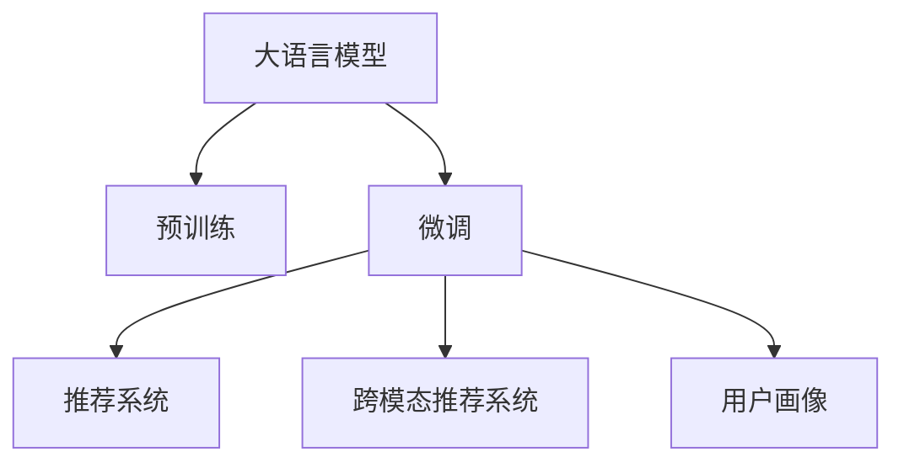

                 

## 1. 背景介绍

### 1.1 问题由来
推荐系统作为互联网时代的重要技术，日益成为用户个性化服务不可或缺的一部分。传统推荐算法基于用户行为数据进行模型训练，如协同过滤、矩阵分解等，具有强健、可解释性好等优点。但它们主要依赖用户历史行为，难以覆盖新用户的兴趣挖掘，对冷启动用户效果有限。

随着大规模预训练语言模型的兴起，尤其是基于Transformer的预训练模型（如BERT、GPT等），人们开始探索使用预训练模型进行推荐系统建模的新方法。通过将用户文本描述作为预训练模型的输入，学习用户兴趣和物品语义表示，从而实现了对用户历史行为的更全面挖掘和对新用户的有效推荐。

### 1.2 问题核心关键点
大语言模型给推荐系统带来的统一建模方法，主要基于如下关键点：
- 预训练模型可以学习到丰富的语言知识和表示能力，能够对用户文本描述和物品描述进行高精度的语义匹配。
- 用户行为数据与自然语言数据可以统一建模，使得推荐系统能够从不同维度对用户兴趣进行全面理解。
- 预训练模型在推荐任务上的微调，可以显著提高推荐效果和泛化能力。
- 基于大语言模型的推荐系统具有较强的可解释性和灵活性，能更好地适应各种推荐场景。

这些关键点使得大语言模型在推荐系统领域的应用前景广阔，为推荐技术的发展提供了新的路径和契机。

### 1.3 问题研究意义
探索大语言模型在推荐系统中的应用，对于提升推荐系统的精准度和个性化程度，加速推荐技术的普及和落地，具有重要意义：

1. 覆盖新用户：传统推荐算法对新用户的兴趣难以捕捉。通过大语言模型对用户文本描述的语义理解，可以覆盖更多新用户，提升推荐系统的冷启动能力。
2. 提升推荐效果：大语言模型具有强大的语义匹配能力，能够在用户行为数据有限的情况下，通过自然语言数据挖掘用户兴趣，提升推荐效果和用户体验。
3. 实现多模态融合：大语言模型不仅能够处理文本数据，还可以通过引入图片、视频等多模态信息，实现多模态融合，构建更加全面的用户画像。
4. 增强可解释性：大语言模型能够理解用户的自然语言需求，使得推荐系统的决策过程更加透明，增强用户对推荐结果的信任感。
5. 加速技术发展：大语言模型的引入可以加速推荐技术在更多垂直领域的落地应用，提升推荐系统的应用价值。

总之，大语言模型在推荐系统中的应用，有望引领推荐技术进入新的发展阶段，为构建更加智能、高效的推荐系统提供坚实基础。

## 2. 核心概念与联系

### 2.1 核心概念概述

为更好地理解大语言模型在推荐系统中的应用，本节将介绍几个密切相关的核心概念：

- 大语言模型(Large Language Model, LLM)：以自回归(如GPT)或自编码(如BERT)模型为代表的大规模预训练语言模型。通过在大规模无标签文本语料上进行预训练，学习通用的语言知识和表示能力。
- 预训练(Pre-training)：指在大规模无标签文本语料上，通过自监督学习任务训练通用语言模型的过程。常见的预训练任务包括言语建模、遮挡语言模型等。
- 微调(Fine-tuning)：指在预训练模型的基础上，使用下游任务的少量标注数据，通过有监督学习优化模型在下游任务上的性能。通常只需要调整顶层分类器或解码器，并以较小的学习率更新全部或部分的模型参数。
- 推荐系统(Recommendation System)：基于用户行为数据或内容数据，为每个用户推荐其感兴趣或可能感兴趣物品的系统。主要包含协同过滤、内容过滤、混合推荐等方法。
- 跨模态推荐系统(Cross-modal Recommendation System)：融合文本、图片、视频等多模态信息，对物品进行全面的表示和推荐，从而提升推荐效果。
- 用户画像(User Profile)：对用户的兴趣、行为、属性等多方面信息进行全面描述，用于构建推荐模型。

这些核心概念之间的逻辑关系可以通过以下Mermaid流程图来展示：



这个流程图展示了大语言模型的核心概念及其与推荐系统的联系：

1. 大语言模型通过预训练获得基础能力。
2. 微调是对预训练模型进行任务特定的优化，可以用于构建推荐模型。
3. 跨模态推荐系统融合了多模态数据，可以通过微调预训练模型进行更全面的建模。
4. 用户画像是基于用户数据构建的全面描述，可以通过微调模型进行细粒度刻画。

这些概念共同构成了大语言模型在推荐系统中的学习和应用框架，使其能够更好地挖掘用户兴趣，构建推荐模型。

## 3. 核心算法原理 & 具体操作步骤
### 3.1 算法原理概述

大语言模型在推荐系统中的应用，主要基于预训练模型对用户文本描述和物品描述的语义理解。其核心思想是：将预训练模型作为推荐系统的基础特征提取器，通过微调过程将用户兴趣和物品语义映射到同一个语义空间，从而实现统一的建模和推荐。

形式化地，假设预训练语言模型为 $M_{\theta}$，其中 $\theta$ 为预训练得到的模型参数。给定推荐系统中的用户 $U$ 和物品 $I$，通过用户文本描述 $x_u$ 和物品文本描述 $x_i$ 进行预训练模型输入，微调后的模型输出 $y_{ui}$ 表示用户 $u$ 对物品 $i$ 的兴趣评分。微调的目标是找到最优参数 $\hat{\theta}$，使得：

$$
\hat{\theta}=\mathop{\arg\min}_{\theta} \mathcal{L}(M_{\theta},U,I)
$$

其中 $\mathcal{L}$ 为推荐系统设计的损失函数，用于衡量模型预测评分与真实评分之间的差异。常见的损失函数包括均方误差损失、交叉熵损失等。

通过梯度下降等优化算法，微调过程不断更新模型参数 $\theta$，最小化损失函数 $\mathcal{L}$，使得模型输出逼近真实评分。由于 $\theta$ 已经通过预训练获得了较好的初始化，因此即便在小规模数据集上微调，也能较快收敛到理想的模型参数 $\hat{\theta}$。

### 3.2 算法步骤详解

大语言模型在推荐系统中的微调一般包括以下几个关键步骤：

**Step 1: 准备预训练模型和数据集**
- 选择合适的预训练语言模型 $M_{\theta}$ 作为初始化参数，如 BERT、GPT等。
- 准备推荐系统中的用户-物品评分数据集 $D=\{(x_u, x_i, y_{ui})\}_{i=1}^N, x_u \in \mathcal{X}_u, x_i \in \mathcal{X}_i, y_{ui} \in \mathcal{Y}$，其中 $\mathcal{X}_u$ 和 $\mathcal{X}_i$ 分别为用户和物品的文本描述空间，$\mathcal{Y}$ 为评分空间。

**Step 2: 添加任务适配层**
- 根据推荐任务类型，在预训练模型顶层设计合适的输出层和损失函数。
- 对于评分预测任务，通常在顶层添加线性分类器或回归器，并以均方误差损失或交叉熵损失为损失函数。
- 对于序列推荐任务，可以将预测评分作为序列生成的条件概率，使用序列生成模型的交叉熵损失。

**Step 3: 设置微调超参数**
- 选择合适的优化算法及其参数，如 AdamW、SGD 等，设置学习率、批大小、迭代轮数等。
- 设置正则化技术及强度，包括权重衰减、Dropout、Early Stopping 等。
- 确定冻结预训练参数的策略，如仅微调顶层，或全部参数都参与微调。

**Step 4: 执行梯度训练**
- 将训练集数据分批次输入模型，前向传播计算损失函数。
- 反向传播计算参数梯度，根据设定的优化算法和学习率更新模型参数。
- 周期性在验证集上评估模型性能，根据性能指标决定是否触发 Early Stopping。
- 重复上述步骤直到满足预设的迭代轮数或 Early Stopping 条件。

**Step 5: 测试和部署**
- 在测试集上评估微调后模型 $M_{\hat{\theta}}$ 的性能，对比微调前后的评分提升。
- 使用微调后的模型对新样本进行评分预测，集成到实际的应用系统中。
- 持续收集新的数据，定期重新微调模型，以适应数据分布的变化。

以上是基于预训练模型的大语言模型在推荐系统中的微调过程的一般流程。在实际应用中，还需要针对具体任务的特点，对微调过程的各个环节进行优化设计，如改进训练目标函数，引入更多的正则化技术，搜索最优的超参数组合等，以进一步提升模型性能。

### 3.3 算法优缺点

大语言模型在推荐系统中的应用，具有以下优点：
1. 能够处理非结构化数据：大语言模型可以处理用户的文本描述、物品的文本描述等非结构化数据，提供更丰富的特征信息。
2. 更强的语义匹配能力：预训练模型通过大规模语料学习，具有较强的语义匹配能力，能够在用户文本和物品文本中挖掘更多的潜在信息。
3. 提高推荐效果：通过微调，大语言模型可以学习到更准确的评分预测，提升推荐系统的精准度和个性化程度。
4. 跨模态推荐：大语言模型可以融合多模态数据，构建更全面的用户画像和物品表示，实现更高效的推荐。
5. 可解释性强：基于大语言模型的推荐系统，可以通过输入的文本解释推荐决策过程，增强用户信任感。

但大语言模型在推荐系统中也存在一些局限：
1. 数据依赖：尽管预训练模型能够提取大量非结构化数据，但在推荐任务上微调时，仍然需要依赖少量的标注数据，存在数据依赖的问题。
2. 计算资源消耗：大语言模型的参数量较大，微调过程需要较高的计算资源，特别是在大规模推荐系统的部署上，计算效率是一个挑战。
3. 数据隐私：用户在推荐系统中提供文本描述，存在一定的隐私泄露风险。
4. 可解释性有待提升：尽管大语言模型在一定程度上增强了推荐系统的可解释性，但推荐的复杂性和多维度特性仍使得其解释性不足。

尽管存在这些局限，但就目前而言，基于大语言模型的推荐系统仍是大规模预训练语言模型在实际应用中的一个重要方向，具有巨大的应用潜力。

### 3.4 算法应用领域

大语言模型在推荐系统中的应用主要集中在以下领域：

**电商推荐**：通过用户评论、商品描述等文本数据，预测用户对商品的评分和兴趣，实现个性化推荐。

**视频推荐**：利用视频标题、标签、评论等文本数据，结合用户历史行为数据，进行视频内容的推荐。

**音乐推荐**：将歌曲名称、歌词、评论等文本数据作为输入，预测用户对歌曲的兴趣评分，实现精准推荐。

**图书推荐**：利用图书名称、摘要、评论等文本数据，预测用户对书籍的评分和购买意图，提升推荐效果。

此外，大语言模型在新闻推荐、社交网络推荐等场景中也有广泛应用，为构建智能推荐系统提供了新的解决方案。

## 4. 数学模型和公式 & 详细讲解  
### 4.1 数学模型构建

本节将使用数学语言对基于预训练模型的大语言模型在推荐系统中的应用进行更加严格的刻画。

记预训练语言模型为 $M_{\theta}$，其中 $\theta$ 为预训练得到的模型参数。假设推荐系统中的用户文本描述为 $x_u$，物品文本描述为 $x_i$，用户对物品的评分或兴趣表示为 $y_{ui}$。微调的目标是找到最优参数 $\hat{\theta}$，使得模型能够准确预测用户对物品的评分，即：

$$
\hat{\theta}=\mathop{\arg\min}_{\theta} \mathcal{L}(M_{\theta},U,I)
$$

其中 $\mathcal{L}$ 为推荐系统设计的损失函数，用于衡量模型预测评分与真实评分之间的差异。

### 4.2 公式推导过程

以下我们以评分预测任务为例，推导基于大语言模型的推荐模型的损失函数。

假设模型 $M_{\theta}$ 在输入 $(x_u, x_i)$ 上的输出为 $y_{ui}=M_{\theta}(x_u, x_i) \in [0,1]$，表示用户 $u$ 对物品 $i$ 的评分预测值。真实评分 $y_{ui} \in \{0,1\}$。则评分预测任务的交叉熵损失函数定义为：

$$
\ell(M_{\theta}(x_u, x_i),y_{ui}) = -[y_{ui}\log M_{\theta}(x_u, x_i)+(1-y_{ui})\log(1-M_{\theta}(x_u, x_i))]
$$

将其代入经验风险公式，得：

$$
\mathcal{L}(\theta) = -\frac{1}{N}\sum_{i=1}^N \sum_{u=1}^N [y_{ui}\log M_{\theta}(x_u, x_i)+(1-y_{ui})\log(1-M_{\theta}(x_u, x_i))]
$$

根据链式法则，损失函数对参数 $\theta_k$ 的梯度为：

$$
\frac{\partial \mathcal{L}(\theta)}{\partial \theta_k} = -\frac{1}{N}\sum_{i=1}^N \sum_{u=1}^N (\frac{y_{ui}}{M_{\theta}(x_u, x_i)}-\frac{1-y_{ui}}{1-M_{\theta}(x_u, x_i)}) \frac{\partial M_{\theta}(x_u, x_i)}{\partial \theta_k}
$$

其中 $\frac{\partial M_{\theta}(x_u, x_i)}{\partial \theta_k}$ 可进一步递归展开，利用自动微分技术完成计算。

在得到损失函数的梯度后，即可带入参数更新公式，完成模型的迭代优化。重复上述过程直至收敛，最终得到适应推荐任务的最优模型参数 $\theta^*$。

## 5. 项目实践：代码实例和详细解释说明
### 5.1 开发环境搭建

在进行推荐系统建模前，我们需要准备好开发环境。以下是使用Python进行PyTorch开发的环境配置流程：

1. 安装Anaconda：从官网下载并安装Anaconda，用于创建独立的Python环境。

2. 创建并激活虚拟环境：
```bash
conda create -n recommendation-env python=3.8 
conda activate recommendation-env
```

3. 安装PyTorch：根据CUDA版本，从官网获取对应的安装命令。例如：
```bash
conda install pytorch torchvision torchaudio cudatoolkit=11.1 -c pytorch -c conda-forge
```

4. 安装相关库：
```bash
pip install numpy pandas scikit-learn torchtransformers transformers
```

完成上述步骤后，即可在`recommendation-env`环境中开始推荐系统建模。

### 5.2 源代码详细实现

这里我们以电商推荐系统为例，给出使用Transformers库对BERT模型进行推荐系统建模的PyTorch代码实现。

首先，定义推荐系统数据处理函数：

```python
from transformers import BertTokenizer
from torch.utils.data import Dataset
import torch

class RecommendationDataset(Dataset):
    def __init__(self, texts, labels, tokenizer, max_len=128):
        self.texts = texts
        self.labels = labels
        self.tokenizer = tokenizer
        self.max_len = max_len
        
    def __len__(self):
        return len(self.texts)
    
    def __getitem__(self, item):
        text = self.texts[item]
        label = self.labels[item]
        
        encoding = self.tokenizer(text, return_tensors='pt', max_length=self.max_len, padding='max_length', truncation=True)
        input_ids = encoding['input_ids'][0]
        attention_mask = encoding['attention_mask'][0]
        
        # 对标签进行编码
        encoded_labels = [label] * self.max_len
        labels = torch.tensor(encoded_labels, dtype=torch.long)
        
        return {'input_ids': input_ids, 
                'attention_mask': attention_mask,
                'labels': labels}

# 标签编码
labels = [1, 0, 1, 1, 0, 0, 1, 1, 0, 0]

# 创建dataset
tokenizer = BertTokenizer.from_pretrained('bert-base-cased')

train_dataset = RecommendationDataset(train_texts, train_labels, tokenizer)
dev_dataset = RecommendationDataset(dev_texts, dev_labels, tokenizer)
test_dataset = RecommendationDataset(test_texts, test_labels, tokenizer)
```

然后，定义模型和优化器：

```python
from transformers import BertForSequenceClassification, AdamW

model = BertForSequenceClassification.from_pretrained('bert-base-cased', num_labels=2)

optimizer = AdamW(model.parameters(), lr=2e-5)
```

接着，定义训练和评估函数：

```python
from torch.utils.data import DataLoader
from tqdm import tqdm
from sklearn.metrics import classification_report

device = torch.device('cuda') if torch.cuda.is_available() else torch.device('cpu')
model.to(device)

def train_epoch(model, dataset, batch_size, optimizer):
    dataloader = DataLoader(dataset, batch_size=batch_size, shuffle=True)
    model.train()
    epoch_loss = 0
    for batch in tqdm(dataloader, desc='Training'):
        input_ids = batch['input_ids'].to(device)
        attention_mask = batch['attention_mask'].to(device)
        labels = batch['labels'].to(device)
        model.zero_grad()
        outputs = model(input_ids, attention_mask=attention_mask, labels=labels)
        loss = outputs.loss
        epoch_loss += loss.item()
        loss.backward()
        optimizer.step()
    return epoch_loss / len(dataloader)

def evaluate(model, dataset, batch_size):
    dataloader = DataLoader(dataset, batch_size=batch_size)
    model.eval()
    preds, labels = [], []
    with torch.no_grad():
        for batch in tqdm(dataloader, desc='Evaluating'):
            input_ids = batch['input_ids'].to(device)
            attention_mask = batch['attention_mask'].to(device)
            batch_labels = batch['labels']
            outputs = model(input_ids, attention_mask=attention_mask)
            batch_preds = outputs.logits.argmax(dim=2).to('cpu').tolist()
            batch_labels = batch_labels.to('cpu').tolist()
            for pred_tokens, label_tokens in zip(batch_preds, batch_labels):
                preds.append(pred_tokens[:len(label_tokens)])
                labels.append(label_tokens)
                
    print(classification_report(labels, preds))
```

最后，启动训练流程并在测试集上评估：

```python
epochs = 5
batch_size = 16

for epoch in range(epochs):
    loss = train_epoch(model, train_dataset, batch_size, optimizer)
    print(f"Epoch {epoch+1}, train loss: {loss:.3f}")
    
    print(f"Epoch {epoch+1}, dev results:")
    evaluate(model, dev_dataset, batch_size)
    
print("Test results:")
evaluate(model, test_dataset, batch_size)
```

以上就是使用PyTorch对BERT进行推荐系统建模的完整代码实现。可以看到，得益于Transformers库的强大封装，我们可以用相对简洁的代码完成BERT模型的加载和推荐系统建模。

### 5.3 代码解读与分析

让我们再详细解读一下关键代码的实现细节：

**RecommendationDataset类**：
- `__init__`方法：初始化文本、标签、分词器等关键组件。
- `__len__`方法：返回数据集的样本数量。
- `__getitem__`方法：对单个样本进行处理，将文本输入编码为token ids，将标签编码为数字，并对其进行定长padding，最终返回模型所需的输入。

**标签编码**：
- 将标签列表编码成固定长度的向量，用于模型训练。

**训练和评估函数**：
- 使用PyTorch的DataLoader对数据集进行批次化加载，供模型训练和推理使用。
- 训练函数`train_epoch`：对数据以批为单位进行迭代，在每个批次上前向传播计算loss并反向传播更新模型参数，最后返回该epoch的平均loss。
- 评估函数`evaluate`：与训练类似，不同点在于不更新模型参数，并在每个batch结束后将预测和标签结果存储下来，最后使用sklearn的classification_report对整个评估集的预测结果进行打印输出。

**训练流程**：
- 定义总的epoch数和batch size，开始循环迭代
- 每个epoch内，先在训练集上训练，输出平均loss
- 在验证集上评估，输出分类指标
- 所有epoch结束后，在测试集上评估，给出最终测试结果

可以看到，PyTorch配合Transformers库使得BERT推荐系统建模的代码实现变得简洁高效。开发者可以将更多精力放在数据处理、模型改进等高层逻辑上，而不必过多关注底层的实现细节。

当然，工业级的系统实现还需考虑更多因素，如模型的保存和部署、超参数的自动搜索、更灵活的任务适配层等。但核心的微调范式基本与此类似。

## 6. 实际应用场景
### 6.1 电商推荐

电商推荐系统是推荐系统中最常见的应用之一。通过用户的浏览、点击、购买等行为数据，推荐系统可以为用户推荐其可能感兴趣的商品。传统的电商推荐系统主要基于协同过滤和矩阵分解算法，但这些方法对用户行为数据有较高依赖，难以覆盖新用户和挖掘冷启动用户的兴趣。

基于大语言模型的电商推荐系统，可以利用用户评论、商品描述等文本数据，通过预训练模型的语义匹配能力，挖掘出用户的潜在兴趣，实现更全面的推荐。例如，可以收集用户对商品的高频词汇、常用语序等特征，输入到预训练模型中，得到用户的兴趣向量。同样，可以将商品的描述文本输入模型，得到商品的特征向量。通过计算用户向量与商品向量的余弦相似度，可以推荐与用户兴趣匹配度高的商品。

### 6.2 视频推荐

视频推荐系统广泛应用于视频平台，推荐用户可能感兴趣的视频内容。传统的推荐系统主要基于用户历史行为数据，通过协同过滤等方法，实现个性化推荐。但这些方法难以处理视频本身的语义信息，无法从内容维度对用户进行推荐。

基于大语言模型的视频推荐系统，可以利用视频标题、标签、评论等文本数据，构建视频内容的语义表示。通过预训练模型的语义匹配能力，可以挖掘出与用户兴趣匹配的视频内容，实现更全面的推荐。例如，可以收集用户对视频的评论，输入到预训练模型中，得到用户的兴趣向量。同样，可以将视频的标题、标签等文本信息输入模型，得到视频内容的特征向量。通过计算用户向量与视频向量之间的余弦相似度，可以推荐与用户兴趣匹配度高的视频内容。

### 6.3 音乐推荐

音乐推荐系统广泛用于音乐平台，为用户推荐可能感兴趣的音乐。传统的推荐系统主要基于用户的听歌记录和评分数据，通过协同过滤等方法，实现个性化推荐。但这些方法难以处理音乐本身的语义信息，无法从内容维度对用户进行推荐。

基于大语言模型的音乐推荐系统，可以利用歌曲名称、歌词、评论等文本数据，构建音乐内容的语义表示。通过预训练模型的语义匹配能力，可以挖掘出与用户兴趣匹配的音乐内容，实现更全面的推荐。例如，可以收集用户对歌曲的评论，输入到预训练模型中，得到用户的兴趣向量。同样，可以将歌曲名称、歌词等文本信息输入模型，得到歌曲内容的特征向量。通过计算用户向量与歌曲向量之间的余弦相似度，可以推荐与用户兴趣匹配度高的音乐。

### 6.4 未来应用展望

随着大语言模型和微调方法的不断发展，基于大语言模型的推荐系统将在更多领域得到应用，为推荐技术的发展提供新的路径和契机。

在智慧医疗领域，基于大语言模型的推荐系统可以用于推荐医学论文、药品等。通过收集医生和患者的评论、评价等文本数据，输入到预训练模型中，挖掘出与用户兴趣匹配的医疗信息，实现精准推荐。

在智能教育领域，基于大语言模型的推荐系统可以用于推荐学习资料、学习课程等。通过收集学生的评论、评价等文本数据，输入到预训练模型中，挖掘出与学生兴趣匹配的学习内容，实现个性化学习推荐。

在智慧城市治理中，基于大语言模型的推荐系统可以用于推荐新闻资讯、公共服务等信息。通过收集市民的评论、评价等文本数据，输入到预训练模型中，挖掘出与市民兴趣匹配的信息，实现精准推荐。

此外，在企业生产、社交网络、文娱传媒等众多领域，基于大语言模型的推荐系统也将不断涌现，为推荐技术带来新的应用场景和创新方向。

## 7. 工具和资源推荐
### 7.1 学习资源推荐

为了帮助开发者系统掌握大语言模型在推荐系统中的应用，这里推荐一些优质的学习资源：

1. 《推荐系统实战》书籍：由大语言模型专家撰写，系统介绍推荐系统的工作原理、经典算法和实际应用案例，适合学习推荐系统基础知识。

2. 《深度学习理论与实战》课程：由知名深度学习专家讲授，全面讲解深度学习的基础理论和实践技巧，覆盖大语言模型和微调技术。

3. 《跨模态推荐系统》论文集：由NLP与推荐系统领域的顶尖专家出版，涵盖多模态推荐系统的最新研究成果和应用进展。

4. 《Transformer从原理到实践》博文系列：由大语言模型技术专家撰写，深入浅出地介绍Transformer原理、BERT模型、微调技术等前沿话题。

5. 《推荐系统优化与实战》书籍：全面讲解推荐系统的优化方法和实战经验，适合工程技术人员快速上手。

通过对这些资源的学习实践，相信你一定能够快速掌握大语言模型在推荐系统中的应用，并用于解决实际的推荐问题。
### 7.2 开发工具推荐

高效的开发离不开优秀的工具支持。以下是几款用于大语言模型推荐系统开发的常用工具：

1. PyTorch：基于Python的开源深度学习框架，灵活动态的计算图，适合快速迭代研究。大部分预训练语言模型都有PyTorch版本的实现。

2. TensorFlow：由Google主导开发的开源深度学习框架，生产部署方便，适合大规模工程应用。同样有丰富的预训练语言模型资源。

3. Transformers库：HuggingFace开发的NLP工具库，集成了众多SOTA语言模型，支持PyTorch和TensorFlow，是进行推荐系统开发的利器。

4. Weights & Biases：模型训练的实验跟踪工具，可以记录和可视化模型训练过程中的各项指标，方便对比和调优。与主流深度学习框架无缝集成。

5. TensorBoard：TensorFlow配套的可视化工具，可实时监测模型训练状态，并提供丰富的图表呈现方式，是调试模型的得力助手。

6. Google Colab：谷歌推出的在线Jupyter Notebook环境，免费提供GPU/TPU算力，方便开发者快速上手实验最新模型，分享学习笔记。

合理利用这些工具，可以显著提升大语言模型推荐系统的开发效率，加快创新迭代的步伐。

### 7.3 相关论文推荐

大语言模型和推荐系统的发展源于学界的持续研究。以下是几篇奠基性的相关论文，推荐阅读：

1. Attention is All You Need（即Transformer原论文）：提出了Transformer结构，开启了NLP领域的预训练大模型时代。

2. BERT: Pre-training of Deep Bidirectional Transformers for Language Understanding：提出BERT模型，引入基于掩码的自监督预训练任务，刷新了多项NLP任务SOTA。

3. Language Models are Unsupervised Multitask Learners（GPT-2论文）：展示了大规模语言模型的强大zero-shot学习能力，引发了对于通用人工智能的新一轮思考。

4. Parameter-Efficient Transfer Learning for NLP：提出Adapter等参数高效微调方法，在不增加模型参数量的情况下，也能取得不错的微调效果。

5. Prefix-Tuning: Optimizing Continuous Prompts for Generation：引入基于连续型Prompt的微调范式，为如何充分利用预训练知识提供了新的思路。

6. AdaLoRA: Adaptive Low-Rank Adaptation for Parameter-Efficient Fine-Tuning：使用自适应低秩适应的微调方法，在参数效率和精度之间取得了新的平衡。

这些论文代表了大语言模型在推荐系统中的应用发展脉络。通过学习这些前沿成果，可以帮助研究者把握学科前进方向，激发更多的创新灵感。

## 8. 总结：未来发展趋势与挑战

### 8.1 总结

本文对基于大语言模型在推荐系统中的应用进行了全面系统的介绍。首先阐述了大语言模型和推荐系统的发展背景和意义，明确了微调在拓展预训练模型应用、提升推荐系统精准度和个性化程度方面的独特价值。其次，从原理到实践，详细讲解了微调在推荐系统中的应用，给出了推荐系统建模的完整代码实例。同时，本文还广泛探讨了微调方法在电商、视频、音乐等推荐场景中的具体应用，展示了微调范式的广阔前景。此外，本文精选了微调技术的各类学习资源，力求为开发者提供全方位的技术指引。

通过本文的系统梳理，可以看到，基于大语言模型的推荐系统有望引领推荐技术进入新的发展阶段，为构建更加智能、高效的推荐系统提供坚实基础。未来，伴随大语言模型和微调方法的持续演进，相信推荐系统必将在更广泛的领域得到应用，为人类生活带来更深刻的影响。

### 8.2 未来发展趋势

展望未来，大语言模型在推荐系统中的应用将呈现以下几个发展趋势：

1. 推荐模型多模态融合：随着视频、音频等多模态数据的普及，基于大语言模型的推荐系统将更加注重多模态数据的融合，构建更全面的用户画像和物品表示，提升推荐效果。

2. 个性化推荐范围扩大：预训练模型将具备更强的语言理解和生成能力，能够对用户的长文本描述进行更深层次的语义理解，实现更全面、更个性化的推荐。

3. 推荐系统可解释性增强：基于大语言模型的推荐系统将引入更多的符号化知识，增强推荐过程的可解释性和可控性，提升用户信任感。

4. 推荐模型在线更新：随着用户行为数据的不断积累，推荐系统将实现更灵活、更高效的在线更新，适应用户兴趣的变化。

5. 推荐系统隐私保护：预训练模型将能够处理用户的匿名化文本描述，保护用户隐私，同时又能挖掘出用户的潜在兴趣，实现推荐效果。

6. 推荐系统跨领域应用：基于大语言模型的推荐系统将能够跨领域应用，覆盖更多垂直领域，如智慧医疗、智能教育、智慧城市等。

以上趋势凸显了大语言模型在推荐系统中的重要地位和发展潜力。这些方向的探索发展，必将进一步提升推荐系统的性能和应用范围，为构建更加智能、高效的推荐系统提供坚实基础。

### 8.3 面临的挑战

尽管大语言模型在推荐系统中的应用取得了诸多进展，但在迈向更加智能化、普适化应用的过程中，它仍面临诸多挑战：

1. 数据依赖问题：尽管大语言模型能够处理非结构化数据，但在推荐任务上微调时，仍需要依赖少量的标注数据，存在数据依赖的问题。

2. 计算资源消耗：大语言模型的参数量较大，微调过程需要较高的计算资源，特别是在大规模推荐系统的部署上，计算效率是一个挑战。

3. 隐私保护问题：用户在推荐系统中提供文本描述，存在一定的隐私泄露风险。如何在保护用户隐私的前提下，挖掘出用户兴趣，是一个亟待解决的问题。

4. 可解释性不足：尽管大语言模型在一定程度上增强了推荐系统的可解释性，但推荐的复杂性和多维度特性仍使得其解释性不足。

5. 知识整合能力不足：现有的推荐系统往往局限于文本数据，难以灵活吸收和运用更广泛的先验知识。如何让微调过程更好地与外部知识库、规则库等专家知识结合，形成更加全面、准确的信息整合能力，还有很大的想象空间。

尽管存在这些挑战，但就目前而言，基于大语言模型的推荐系统仍是大规模预训练语言模型在实际应用中的一个重要方向，具有巨大的应用潜力。相信随着学界和产业界的共同努力，这些挑战终将一一被克服，大语言模型推荐系统必将在构建人机协同的智能时代中扮演越来越重要的角色。

### 8.4 研究展望

面对大语言模型推荐系统所面临的种种挑战，未来的研究需要在以下几个方面寻求新的突破：

1. 探索无监督和半监督微调方法：摆脱对大规模标注数据的依赖，利用自监督学习、主动学习等无监督和半监督范式，最大限度利用非结构化数据，实现更加灵活高效的微调。

2. 研究参数高效和计算高效的微调范式：开发更加参数高效的微调方法，在固定大部分预训练参数的同时，只更新极少量的任务相关参数。同时优化微调模型的计算图，减少前向传播和反向传播的资源消耗，实现更加轻量级、实时性的部署。

3. 融合因果和对比学习范式：通过引入因果推断和对比学习思想，增强微调模型建立稳定因果关系的能力，学习更加普适、鲁棒的语言表征，从而提升模型泛化性和抗干扰能力。

4. 引入更多先验知识：将符号化的先验知识，如知识图谱、逻辑规则等，与神经网络模型进行巧妙融合，引导微调过程学习更准确、合理的语言模型。同时加强不同模态数据的整合，实现视觉、语音等多模态信息与文本信息的协同建模。

5. 结合因果分析和博弈论工具：将因果分析方法引入微调模型，识别出模型决策的关键特征，增强输出解释的因果性和逻辑性。借助博弈论工具刻画人机交互过程，主动探索并规避模型的脆弱点，提高系统稳定性。

6. 纳入伦理道德约束：在模型训练目标中引入伦理导向的评估指标，过滤和惩罚有偏见、有害的输出倾向。同时加强人工干预和审核，建立模型行为的监管机制，确保输出符合人类价值观和伦理道德。

这些研究方向的探索，必将引领大语言模型推荐系统技术迈向更高的台阶，为构建安全、可靠、可解释、可控的推荐系统提供坚实基础。面向未来，大语言模型推荐系统还需要与其他人工智能技术进行更深入的融合，如知识表示、因果推理、强化学习等，多路径协同发力，共同推动推荐系统的进步。

## 9. 附录：常见问题与解答

**Q1：大语言模型推荐系统是否适用于所有推荐场景？**

A: 大语言模型推荐系统在电商、视频、音乐、新闻等场景中表现优异，但在一些特殊领域，如医疗、法律等，由于预训练数据集的局限，推荐效果可能不如传统的协同过滤和矩阵分解算法。因此，在大规模推荐系统中，可以结合不同算法，发挥各自优势，构建更加全面的推荐策略。

**Q2：大语言模型推荐系统的数据依赖问题如何解决？**

A: 大语言模型推荐系统对标注数据有较高的依赖，特别是在微调过程中。为了降低数据依赖，可以采用以下策略：
1. 利用无监督和半监督学习：引入自监督学习、主动学习等方法，从非结构化数据中挖掘用户兴趣，减少标注数据的依赖。
2. 多源数据融合：结合用户行为数据、社交网络数据、外部知识库等多源数据，构建更全面的用户画像，减少单一数据源的偏差。
3. 数据增强：通过数据扩充、数据增强等方法，丰富训练集多样性，提高模型的泛化能力。

**Q3：大语言模型推荐系统的计算资源消耗问题如何解决？**

A: 大语言模型推荐系统的计算资源消耗较大，特别是在大规模推荐系统的部署上。为了降低计算资源消耗，可以采用以下策略：
1. 参数压缩：通过模型压缩、剪枝等方法，减少模型参数量，降低计算成本。
2. 分布式训练：采用分布式训练技术，将大模型分割成多个小模型并行训练，提高训练效率。
3. 模型量化：通过将浮点模型转为定点模型，压缩存储空间，提高计算效率。
4. 模型蒸馏：通过知识蒸馏技术，将大模型的知识迁移到小模型中，减少计算资源消耗。

**Q4：大语言模型推荐系统的隐私保护问题如何解决？**

A: 大语言模型推荐系统涉及用户隐私保护问题，需要在保护用户隐私的前提下，挖掘出用户兴趣。可以采用以下策略：
1. 匿名化处理：对用户文本数据进行匿名化处理，如去除姓名、身份证号等敏感信息。
2. 差分隐私：在推荐系统中引入差分隐私机制，保护用户隐私不被泄露。
3. 联邦学习：通过联邦学习技术，在本地设备上进行模型训练，不将用户数据上传至中心服务器，保护用户隐私。

**Q5：大语言模型推荐系统的可解释性问题如何解决？**

A: 大语言模型推荐系统的可解释性不足，难以让用户理解推荐决策的依据。可以采用以下策略：
1. 引入符号化知识：在推荐系统中引入符号化知识，如规则、知识图谱等，增强推荐过程的可解释性。
2. 数据可视化：利用数据可视化技术，展示用户兴趣、物品特征等信息，帮助用户理解推荐结果。
3. 反馈机制：引入用户反馈机制，收集用户的评价和建议，不断优化推荐模型。

这些策略可以帮助解决大语言模型推荐系统面临的数据依赖、计算资源消耗、隐私保护和可解释性问题，提升推荐系统的性能和用户信任感。

