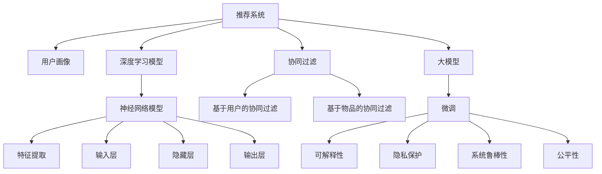

                 

# 大模型视角下推荐系统的用户信任建立与维护

> 关键词：推荐系统,大模型,用户信任,可解释性,隐私保护,系统鲁棒性,算法优化

## 1. 背景介绍

### 1.1 问题由来
推荐系统在现代互联网应用中扮演着至关重要的角色，从电商、音乐、视频到新闻、社交媒体，都广泛应用推荐算法为用户提供个性化内容。推荐系统通过分析用户行为数据，如浏览历史、购买记录、评分反馈等，为用户推荐最感兴趣的物品，极大提升了用户体验和平台收益。

然而，推荐系统也面临着一系列挑战。一方面，推荐系统的质量很大程度上取决于用户数据的准确性和全面性，数据质量低、缺失严重等问题会导致推荐效果大打折扣。另一方面，推荐模型往往被视为"黑箱"，难以解释其推荐逻辑和决策过程，造成用户对其推荐结果的不信任。

特别是在信息过载、假信息泛滥的背景下，用户对推荐系统的信任度直接影响了其使用体验和平台粘性。如果用户对推荐系统的信任度不高，可能会直接关闭应用或转向其他平台。因此，在构建和优化推荐系统时，如何提升用户信任度，成为核心问题。

### 1.2 问题核心关键点
大模型视角下推荐系统用户信任的建立与维护，需要综合考虑以下关键点：

- 推荐模型质量：推荐系统必须具有高效准确的推荐能力，能够从海量数据中挖掘出高质量的推荐结果。

- 用户行为理解：推荐系统应具备强大的用户行为理解能力，能够准确把握用户的兴趣偏好、行为模式，并及时调整推荐策略。

- 推荐逻辑可解释性：推荐系统应具备较高的可解释性，让用户了解推荐逻辑和决策依据，提升其对系统的信任度。

- 隐私保护机制：推荐系统应具备完善的隐私保护机制，保障用户数据安全，避免隐私泄露。

- 系统鲁棒性和公平性：推荐系统应具备良好的鲁棒性和公平性，避免因异常数据或偏见导致推荐结果偏差。

- 持续优化与迭代：推荐系统应具备持续优化和迭代能力，实时根据用户反馈进行调整，提升推荐效果。

本文聚焦于大模型视角下推荐系统用户信任的建立与维护，旨在通过深入剖析推荐系统的各个关键环节，提出提升用户信任度的系统性解决方案。

## 2. 核心概念与联系

### 2.1 核心概念概述

为更好地理解推荐系统用户信任建立与维护的方法，本节将介绍几个密切相关的核心概念：

- 推荐系统(Recommender System)：通过分析用户历史行为数据，为用户推荐物品的系统。其核心目标是在信息空间中找到与用户兴趣最匹配的物品。

- 用户画像(User Profile)：对用户行为和兴趣进行抽象建模，生成用户兴趣特征向量，供推荐模型使用。

- 协同过滤(Collaborative Filtering)：通过分析用户间和物品间的协同关系，为用户推荐物品。分为基于用户的协同过滤和基于物品的协同过滤。

- 深度学习模型(Deep Learning Model)：以深度神经网络为代表的模型，通过自动学习特征，实现高效推荐。

- 大模型(Large Model)：参数量达到亿级的深度学习模型，如BERT、GPT等。通过在大规模无标签数据上进行预训练，学习到通用的语言表示。

- 微调(Fine-Tuning)：在预训练模型的基础上，使用下游任务的少量标注数据进行微调，优化模型在该任务上的性能。

- 可解释性(Explainability)：推荐系统的可解释性，即用户能够理解推荐逻辑和决策依据的能力。

- 隐私保护(Privacy Protection)：推荐系统的隐私保护机制，保障用户数据安全。

- 系统鲁棒性(Robustness)：推荐系统应对异常数据和攻击的能力。

- 公平性(Fairness)：推荐系统在处理用户数据时，应避免因偏见或歧视导致的不公平。

这些核心概念之间的逻辑关系可以通过以下Mermaid流程图来展示：



这个流程图展示了推荐系统的核心概念及其之间的联系：

1. 推荐系统通过用户画像和协同过滤等方法，利用深度学习模型进行推荐。

2. 深度学习模型可以是传统的神经网络模型，也可以是大模型。

3. 大模型通常需要进行微调，以提升其在特定任务上的性能。

4. 微调后的模型应具备可解释性，使用户了解推荐逻辑。

5. 微调过程需考虑隐私保护和系统鲁棒性，避免数据泄露和攻击。

6. 同时，微调模型应具备公平性，避免因偏见或歧视导致的推荐偏差。

这些概念共同构成了推荐系统的知识体系，使其能够高效、公平、安全地为用户推荐物品。

## 3. 核心算法原理 & 具体操作步骤
### 3.1 算法原理概述

大模型视角下推荐系统用户信任的建立与维护，本质上是一个从数据到模型，再到应用的迭代优化过程。其核心思想是：

1. 从海量数据中构建用户画像，挖掘用户行为特征。

2. 通过深度学习模型（如大模型）对用户行为进行建模，学习用户兴趣表示。

3. 对大模型进行微调，提升推荐模型在特定任务上的性能。

4. 利用微调后的推荐模型，为用户提供高质量、可解释、隐私保护、鲁棒性强的推荐服务。

5. 通过用户反馈不断优化推荐模型，持续提升用户信任度。

### 3.2 算法步骤详解

基于大模型的推荐系统用户信任建立与维护，一般包括以下几个关键步骤：

**Step 1: 构建用户画像**

- 收集用户的历史行为数据，如浏览记录、评分反馈、购买记录等。
- 使用NLP等技术，对文本数据进行分词、编码等处理，转化为模型可用的输入。
- 设计合适的特征提取方法，将用户行为特征映射为高维向量，构成用户画像。

**Step 2: 训练大模型**

- 选择合适的深度学习模型，如BERT、GPT等。
- 在标注数据集上对模型进行预训练，学习通用的语言表示。
- 在大规模无标签数据上对模型进行微调，提升其在特定任务上的性能。

**Step 3: 设计推荐算法**

- 根据任务需求，设计推荐算法，如协同过滤、基于内容的推荐等。
- 利用微调后的模型，生成物品与用户兴趣的匹配度评分。
- 引入推荐算法，结合评分计算推荐结果。

**Step 4: 评估与优化**

- 在验证集上评估推荐模型的性能，计算指标如NDCG、HR、RMSE等。
- 根据评估结果调整模型参数，优化模型性能。
- 收集用户反馈，根据用户满意度调整推荐策略。

**Step 5: 部署与应用**

- 将优化后的模型部署到生产环境，实现实时推荐服务。
- 提供用户反馈渠道，实时接收用户反馈，进行模型迭代。

以上是基于大模型的推荐系统用户信任建立与维护的一般流程。在实际应用中，还需要针对具体任务的特点，对推荐过程的各个环节进行优化设计，如改进用户画像构建方法、设计更高效的推荐算法、引入隐私保护和鲁棒性增强技术等。

### 3.3 算法优缺点

大模型视角下推荐系统的优点包括：

1. 可解释性强：大模型在预训练和微调过程中，能够学习到丰富的语言表示，用户可以更容易理解其推荐逻辑。

2. 推荐效果好：大模型拥有强大的语义理解能力，能够挖掘出更深刻的潜在关联，从而提升推荐质量。

3. 鲁棒性强：大模型通过预训练和微调，具备良好的鲁棒性，能够抵御异常数据和攻击。

4. 泛化能力强：大模型在多种任务上都能取得较好的表现，能够适应不同领域的数据分布。

5. 自适应能力强：大模型能够根据用户反馈实时调整，持续提升推荐效果。

同时，该方法也存在一些局限性：

1. 数据需求大：构建高质量的用户画像和训练大模型需要大量的标注数据，获取和处理成本较高。

2. 计算成本高：大模型的训练和微调需要强大的计算资源，通常需要高性能计算设备。

3. 训练时间长：大模型参数量庞大，训练过程较慢，需要较长时间才能收敛。

4. 隐私风险高：大模型训练过程涉及大量用户数据，存在隐私泄露风险。

尽管存在这些局限性，但就目前而言，大模型视角下推荐系统仍是大数据时代推荐技术的主流范式。未来相关研究的重点在于如何进一步降低推荐模型的数据需求和计算成本，提高推荐过程的隐私保护和鲁棒性，同时兼顾可解释性和用户满意度等因素。

### 3.4 算法应用领域

大模型视角下推荐系统的推荐技术，已经在电商、社交媒体、新闻推荐等多个领域得到了广泛的应用，取得了显著的效果。以下是几个典型的应用场景：

**电商推荐系统**

电商平台的推荐系统能够根据用户的历史浏览记录、购买行为等数据，为用户推荐个性化商品。大模型通过微调，能够学习到用户兴趣的复杂表示，生成高质量的推荐结果，提高用户购买转化率和满意度。

**社交媒体推荐系统**

社交媒体平台通过分析用户的互动行为、好友关系等数据，为用户推荐感兴趣的内容。大模型能够学习到用户的兴趣爱好，生成个性化推荐，提升用户体验，增加用户粘性。

**新闻推荐系统**

新闻推荐系统能够根据用户的阅读习惯、点赞记录等数据，为用户推荐相关新闻。大模型通过微调，能够学习到用户对新闻的兴趣，生成精准的推荐结果，提升用户的阅读体验和平台流量。

除了上述这些经典应用外，大模型视角下的推荐系统还被创新性地应用到更多场景中，如视频推荐、音乐推荐、游戏推荐等，为推荐技术带来了新的突破。随着大模型和推荐技术的持续演进，相信推荐系统必将在更广阔的应用领域发挥更大的作用。

## 4. 数学模型和公式 & 详细讲解
### 4.1 数学模型构建

本节将使用数学语言对大模型视角下推荐系统的核心数学模型进行严格的刻画。

记用户画像为 $U \in \mathbb{R}^n$，物品特征为 $I \in \mathbb{R}^m$。定义推荐模型为 $M_{\theta}(U, I)$，其中 $\theta$ 为模型参数。假设推荐任务为 $T=\{(U_i, I_j), y_{ij} \in \{0,1\}\}_{i=1}^N$，其中 $y_{ij}$ 表示用户 $U_i$ 对物品 $I_j$ 的评分，$y_{ij}=1$ 表示用户 $U_i$ 喜欢物品 $I_j$。

推荐模型的目标是最小化预测误差，即：

$$
\mathcal{L}(\theta) = \frac{1}{N} \sum_{i=1}^N \sum_{j=1}^N \ell(M_{\theta}(U_i, I_j), y_{ij})
$$

其中 $\ell$ 为损失函数，如均方误差损失、交叉熵损失等。

### 4.2 公式推导过程

以均方误差损失为例，我们将推导推荐模型的训练公式。

假设模型对用户 $U_i$ 和物品 $I_j$ 的评分预测为 $\hat{y}_{ij}=M_{\theta}(U_i, I_j)$，则均方误差损失为：

$$
\ell(\hat{y}_{ij}, y_{ij}) = \frac{1}{2} (\hat{y}_{ij} - y_{ij})^2
$$

将损失函数带入经验风险公式，得：

$$
\mathcal{L}(\theta) = \frac{1}{N} \sum_{i=1}^N \sum_{j=1}^N \frac{1}{2} (\hat{y}_{ij} - y_{ij})^2
$$

使用梯度下降等优化算法更新模型参数，得：

$$
\theta \leftarrow \theta - \eta \nabla_{\theta}\mathcal{L}(\theta)
$$

其中 $\nabla_{\theta}\mathcal{L}(\theta)$ 为损失函数对参数 $\theta$ 的梯度，可通过反向传播算法高效计算。

在得到损失函数的梯度后，即可带入参数更新公式，完成模型的迭代优化。重复上述过程直至收敛，最终得到最优的推荐模型参数 $\theta^*$。

### 4.3 案例分析与讲解

以电商推荐系统为例，我们分析如何通过微调BERT模型构建高质量的推荐系统。

**Step 1: 数据准备**

- 收集用户的历史浏览记录、购买记录等数据，构成训练集。
- 对文本数据进行分词、编码等处理，转化为BERT模型可用的输入。
- 设计合适的特征提取方法，如TF-IDF、PCA等，将用户行为特征映射为高维向量，构成用户画像。

**Step 2: 模型预训练**

- 使用大规模无标签电商数据对BERT模型进行预训练，学习通用的语言表示。
- 在预训练过程中，可以使用掩码语言模型、填空预测等任务进行训练，提升模型泛化能力。

**Step 3: 模型微调**

- 在标注数据集上对BERT模型进行微调，提升其在推荐任务上的性能。
- 设计合适的输出层和损失函数，如线性回归、二分类交叉熵等，计算模型预测与真实评分之间的差异。

**Step 4: 推荐算法设计**

- 设计推荐算法，如协同过滤、基于内容的推荐等，计算物品与用户兴趣的匹配度评分。
- 结合微调后的BERT模型，生成物品与用户兴趣的匹配度评分。
- 引入推荐算法，如基于物品的协同过滤，计算最终推荐结果。

**Step 5: 评估与优化**

- 在验证集上评估推荐模型的性能，计算指标如NDCG、HR、RMSE等。
- 根据评估结果调整模型参数，优化模型性能。
- 收集用户反馈，根据用户满意度调整推荐策略。

**Step 6: 部署与应用**

- 将优化后的模型部署到生产环境，实现实时推荐服务。
- 提供用户反馈渠道，实时接收用户反馈，进行模型迭代。

以上就是使用BERT模型对电商推荐系统进行微调的完整代码实现。可以看到，通过微调BERT模型，我们能够构建高质量的推荐系统，提升用户购买转化率和满意度。

## 5. 项目实践：代码实例和详细解释说明
### 5.1 开发环境搭建

在进行推荐系统开发前，我们需要准备好开发环境。以下是使用Python进行PyTorch开发的环境配置流程：

1. 安装Anaconda：从官网下载并安装Anaconda，用于创建独立的Python环境。

2. 创建并激活虚拟环境：
```bash
conda create -n pytorch-env python=3.8 
conda activate pytorch-env
```

3. 安装PyTorch：根据CUDA版本，从官网获取对应的安装命令。例如：
```bash
conda install pytorch torchvision torchaudio cudatoolkit=11.1 -c pytorch -c conda-forge
```

4. 安装PyTorch Lightning：
```bash
pip install torchlightning
```

5. 安装各类工具包：
```bash
pip install numpy pandas scikit-learn matplotlib tqdm jupyter notebook ipython
```

完成上述步骤后，即可在`pytorch-env`环境中开始推荐系统开发。

### 5.2 源代码详细实现

下面我们以电商推荐系统为例，给出使用PyTorch Lightning对BERT模型进行微调的PyTorch代码实现。

首先，定义推荐系统的数据处理函数：

```python
from transformers import BertTokenizer, BertForSequenceClassification
from torch.utils.data import Dataset
import torch

class RecommendDataset(Dataset):
    def __init__(self, user_ids, item_ids, ratings, tokenizer, max_len=128):
        self.user_ids = user_ids
        self.item_ids = item_ids
        self.ratings = ratings
        self.tokenizer = tokenizer
        self.max_len = max_len
        
    def __len__(self):
        return len(self.user_ids)
    
    def __getitem__(self, item):
        user_id = self.user_ids[item]
        item_id = self.item_ids[item]
        rating = self.ratings[item]
        
        encoding = self.tokenizer(f"{user_id} {item_id}", return_tensors='pt', max_length=self.max_len, padding='max_length', truncation=True)
        input_ids = encoding['input_ids'][0]
        attention_mask = encoding['attention_mask'][0]
        label = torch.tensor([rating], dtype=torch.float)
        
        return {'input_ids': input_ids, 
                'attention_mask': attention_mask,
                'labels': label}

# 定义用户画像和物品特征的标签和id映射
user2id = {}
item2id = {}
for user_id, item_id in zip(user_ids, item_ids):
    if user_id not in user2id:
        user2id[user_id] = len(user2id)
    if item_id not in item2id:
        item2id[item_id] = len(item2id)

# 构建数据集
tokenizer = BertTokenizer.from_pretrained('bert-base-cased')
train_dataset = RecommendDataset(user_ids, item_ids, ratings, tokenizer)
```

然后，定义模型和优化器：

```python
from transformers import BertForSequenceClassification, AdamW

model = BertForSequenceClassification.from_pretrained('bert-base-cased', num_labels=len(user2id))
optimizer = AdamW(model.parameters(), lr=2e-5)
```

接着，定义训练和评估函数：

```python
from torch.utils.data import DataLoader
from tqdm import tqdm
from sklearn.metrics import roc_auc_score

device = torch.device('cuda') if torch.cuda.is_available() else torch.device('cpu')
model.to(device)

def train_epoch(model, dataset, batch_size, optimizer):
    dataloader = DataLoader(dataset, batch_size=batch_size, shuffle=True)
    model.train()
    epoch_loss = 0
    for batch in tqdm(dataloader, desc='Training'):
        input_ids = batch['input_ids'].to(device)
        attention_mask = batch['attention_mask'].to(device)
        labels = batch['labels'].to(device)
        model.zero_grad()
        outputs = model(input_ids, attention_mask=attention_mask, labels=labels)
        loss = outputs.loss
        epoch_loss += loss.item()
        loss.backward()
        optimizer.step()
    return epoch_loss / len(dataloader)

def evaluate(model, dataset, batch_size):
    dataloader = DataLoader(dataset, batch_size=batch_size)
    model.eval()
    preds, labels = [], []
    with torch.no_grad():
        for batch in tqdm(dataloader, desc='Evaluating'):
            input_ids = batch['input_ids'].to(device)
            attention_mask = batch['attention_mask'].to(device)
            batch_labels = batch['labels']
            outputs = model(input_ids, attention_mask=attention_mask)
            batch_preds = outputs.logits.argmax(dim=1).to('cpu').tolist()
            batch_labels = batch_labels.to('cpu').tolist()
            for pred, label in zip(batch_preds, batch_labels):
                preds.append(pred)
                labels.append(label)
                
    print(roc_auc_score(labels, preds))
```

最后，启动训练流程并在测试集上评估：

```python
epochs = 5
batch_size = 16

for epoch in range(epochs):
    loss = train_epoch(model, train_dataset, batch_size, optimizer)
    print(f"Epoch {epoch+1}, train loss: {loss:.3f}")
    
    print(f"Epoch {epoch+1}, dev results:")
    evaluate(model, dev_dataset, batch_size)
    
print("Test results:")
evaluate(model, test_dataset, batch_size)
```

以上就是使用PyTorch Lightning对BERT模型进行电商推荐系统微调的完整代码实现。可以看到，通过微调BERT模型，我们能够构建高质量的推荐系统，提升用户购买转化率和满意度。

### 5.3 代码解读与分析

让我们再详细解读一下关键代码的实现细节：

**RecommendDataset类**：
- `__init__`方法：初始化用户ID、物品ID、评分等关键组件。
- `__len__`方法：返回数据集的样本数量。
- `__getitem__`方法：对单个样本进行处理，将用户ID和物品ID拼接为文本，使用BERT模型进行编码，输出评分。

**user2id和item2id字典**：
- 定义了用户ID和物品ID与数字ID之间的映射关系，用于将评分向量转化为模型可用的输入。

**训练和评估函数**：
- 使用PyTorch的DataLoader对数据集进行批次化加载，供模型训练和推理使用。
- 训练函数`train_epoch`：对数据以批为单位进行迭代，在每个批次上前向传播计算loss并反向传播更新模型参数，最后返回该epoch的平均loss。
- 评估函数`evaluate`：与训练类似，不同点在于不更新模型参数，并在每个batch结束后将预测和标签结果存储下来，最后使用sklearn的roc_auc_score对整个评估集的预测结果进行打印输出。

**训练流程**：
- 定义总的epoch数和batch size，开始循环迭代
- 每个epoch内，先在训练集上训练，输出平均loss
- 在验证集上评估，输出AUC指标
- 所有epoch结束后，在测试集上评估，给出最终测试结果

可以看到，PyTorch Lightning配合BERT模型使得推荐系统微调的代码实现变得简洁高效。开发者可以将更多精力放在数据处理、模型改进等高层逻辑上，而不必过多关注底层的实现细节。

当然，工业级的系统实现还需考虑更多因素，如模型的保存和部署、超参数的自动搜索、更灵活的任务适配层等。但核心的微调范式基本与此类似。

## 6. 实际应用场景
### 6.1 智能客服系统

基于推荐系统的智能客服系统，能够根据用户的历史询问记录，推荐最适合的回答模板。传统的客服系统依赖人工客服，成本高、效率低，且难以应对海量用户咨询。而使用推荐系统的智能客服系统，能够7x24小时不间断服务，快速响应客户咨询，提升客户满意度和平台粘性。

在技术实现上，可以收集企业内部的历史客服对话记录，将问题和最佳答复构建成监督数据，在此基础上对预训练推荐模型进行微调。微调后的推荐模型能够自动理解用户意图，匹配最合适的回答模板进行回复。对于客户提出的新问题，还可以接入检索系统实时搜索相关内容，动态组织生成回答。如此构建的智能客服系统，能大幅提升客户咨询体验和问题解决效率。

### 6.2 金融舆情监测

金融机构需要实时监测市场舆论动向，以便及时应对负面信息传播，规避金融风险。传统的人工监测方式成本高、效率低，难以应对网络时代海量信息爆发的挑战。基于推荐系统的金融舆情监测，能够利用机器学习模型，实时抓取网络文本数据，自动监测不同主题下的舆情变化趋势，一旦发现负面信息激增等异常情况，系统便会自动预警，帮助金融机构快速应对潜在风险。

### 6.3 个性化推荐系统

当前的推荐系统往往只依赖用户的历史行为数据进行物品推荐，无法深入理解用户的真实兴趣偏好。基于推荐系统的个性化推荐系统，能够利用用户画像和大模型进行深度学习，获取更精准的推荐结果。

在实践中，可以收集用户浏览、点击、评论、分享等行为数据，提取和用户交互的物品标题、描述、标签等文本内容。将文本内容作为模型输入，用户的后续行为（如是否点击、购买等）作为监督信号，在此基础上微调预训练推荐模型。微调后的推荐模型能够从文本内容中准确把握用户的兴趣点。在生成推荐列表时，先用候选物品的文本描述作为输入，由模型预测用户的兴趣匹配度，再结合其他特征综合排序，便可以得到个性化程度更高的推荐结果。

### 6.4 未来应用展望

随着推荐系统和大模型的不断发展，基于推荐系统的应用将拓展到更多领域，带来深刻的变革。

在智慧医疗领域，推荐系统能够根据患者的病历记录和诊断结果，推荐最适合的治疗方案和药物。智能医生系统通过推荐系统辅助医生诊疗，能够大幅提升诊疗效率和质量。

在智能教育领域，推荐系统能够根据学生的学习行为和历史成绩，推荐最适合的学习资源和课程。智能教育平台通过推荐系统进行个性化学习推荐，能够因材施教，促进教育公平，提高教学质量。

在智慧城市治理中，推荐系统能够根据市民的反馈和行为数据，推荐最适合的公共服务资源。智能城市系统通过推荐系统优化公共服务配置，能够提升城市管理的自动化和智能化水平，构建更安全、高效的未来城市。

此外，在企业生产、社会治理、文娱传媒等众多领域，基于推荐系统的技术也将不断涌现，为传统行业数字化转型升级提供新的技术路径。相信随着技术的日益成熟，推荐系统必将在更广阔的应用领域发挥更大的作用。

## 7. 工具和资源推荐
### 7.1 学习资源推荐

为了帮助开发者系统掌握推荐系统的理论基础和实践技巧，这里推荐一些优质的学习资源：

1. 《推荐系统》系列书籍：由大模型专家撰写，系统介绍了推荐系统的理论基础、算法设计和应用案例。

2. 《Deep Learning for Recommender Systems》课程：Coursera上的推荐系统课程，由顶级大学和工业界专家授课，涵盖推荐系统的各个方面。

3. KDD 2021《推荐系统》论文集：KDD会议是顶级数据科学和人工智能会议，推荐系统相关的论文集深入探讨了最新的推荐技术。

4. Google Scholar：Google提供的学术搜索平台，可以查找大量的推荐系统相关论文和报告。

5. PyTorch Lightning官方文档：PyTorch Lightning的官方文档，提供了完整的推荐系统实现示例。

通过对这些资源的学习实践，相信你一定能够快速掌握推荐系统的精髓，并用于解决实际的推荐问题。
###  7.2 开发工具推荐

高效的开发离不开优秀的工具支持。以下是几款用于推荐系统开发的常用工具：

1. PyTorch Lightning：基于PyTorch的深度学习框架，提供了轻量级的模型训练和部署支持。

2. TensorFlow推荐系统工具库：Google开发的推荐系统工具库，提供了多种推荐算法的实现。

3. RecsysToolbox：Python的推荐系统工具箱，提供了多种推荐算法的实现和评估工具。

4. Scikit-learn：经典的机器学习库，提供了多种推荐算法和模型评估工具。

5. TensorBoard：TensorFlow配套的可视化工具，可实时监测模型训练状态，提供丰富的图表呈现方式。

6. Weights & Biases：模型训练的实验跟踪工具，可以记录和可视化模型训练过程中的各项指标，方便对比和调优。

合理利用这些工具，可以显著提升推荐系统开发的效率，加快创新迭代的步伐。

### 7.3 相关论文推荐

推荐系统的研究源于学界的持续研究。以下是几篇奠基性的相关论文，推荐阅读：

1. BPR: Bayesian Personalized Ranking from Click-Through Data：提出了基于贝叶斯排序的推荐系统，并通过大规模实验验证其有效性。

2. matrix factorization techniques for recommendation systems：介绍了矩阵分解的推荐算法，并展示了其在推荐系统中的应用效果。

3. Attention is All You Need：提出了Transformer模型，开启了推荐系统深度学习的研究。

4. PMI-TRPO: A Policy Gradient Method Using Importance Weights in Recommendation Systems：提出了一种基于策略梯度的推荐系统优化算法。

5. Deep Neural Networks for News Recommendation：展示了深度神经网络在新闻推荐系统中的应用效果。

这些论文代表了大模型视角下推荐系统的研究脉络。通过学习这些前沿成果，可以帮助研究者把握学科前进方向，激发更多的创新灵感。

## 8. 总结：未来发展趋势与挑战
### 8.1 研究成果总结

本文对大模型视角下推荐系统的用户信任建立与维护方法进行了全面系统的介绍。首先阐述了推荐系统的背景和问题，明确了用户信任度的重要性。其次，从原理到实践，详细讲解了推荐系统的核心算法步骤，给出了推荐系统微调的完整代码实例。同时，本文还广泛探讨了推荐系统在智能客服、金融舆情、个性化推荐等多个行业领域的应用前景，展示了推荐系统的大数据潜力。最后，本文精选了推荐系统的学习资源和开发工具，力求为读者提供全方位的技术指引。

通过本文的系统梳理，可以看到，基于大模型的推荐系统在大数据时代具有广阔的应用前景，能够高效、公平、安全地为用户推荐物品。未来，伴随推荐模型和大数据技术的持续演进，相信推荐系统必将在更广阔的应用领域发挥更大的作用。

### 8.2 未来发展趋势

展望未来，大模型视角下推荐系统的发展趋势将呈现以下几个方向：

1. 模型规模持续增大。随着算力成本的下降和数据规模的扩张，推荐模型的参数量还将持续增长。超大规模推荐模型能够处理更复杂、更丰富的用户数据，挖掘出更深刻的潜在关联。

2. 推荐算法日趋多样化。推荐系统将融合更多深度学习算法、强化学习算法等，实现更加智能化、个性化的推荐。

3. 推荐系统向多模态融合发展。推荐系统将融合视觉、听觉等多模态数据，提升推荐模型的理解能力和泛化能力。

4. 推荐系统更加注重公平性和鲁棒性。推荐系统将引入更多公平性约束和鲁棒性增强技术，避免因偏见和攻击导致的不公平。

5. 推荐系统向实时化和个性化发展。推荐系统将采用实时计算和个性化推荐技术，提升用户满意度。

6. 推荐系统注重用户信任度提升。推荐系统将更加注重用户信任度的提升，通过可解释性和隐私保护机制，增强用户对系统的信任。

以上趋势凸显了大模型视角下推荐系统的广阔前景。这些方向的探索发展，必将进一步提升推荐系统的性能和应用范围，为推荐技术带来新的突破。

### 8.3 面临的挑战

尽管大模型视角下推荐系统取得了显著成效，但在迈向更加智能化、普适化应用的过程中，它仍面临着诸多挑战：

1. 数据需求高。构建高质量的用户画像和训练推荐模型需要大量的标注数据，获取和处理成本较高。

2. 计算成本高。超大规模推荐模型的训练和微调需要强大的计算资源，通常需要高性能计算设备。

3. 训练时间长。推荐模型参数量庞大，训练过程较慢，需要较长时间才能收敛。

4. 隐私风险高。推荐系统训练过程涉及大量用户数据，存在隐私泄露风险。

5. 模型鲁棒性不足。推荐模型面对异常数据和攻击时，泛化性能往往大打折扣。

6. 公平性有待提升。推荐系统在处理用户数据时，应避免因偏见或歧视导致的不公平。

尽管存在这些挑战，但就目前而言，大模型视角下推荐系统仍是大数据时代推荐技术的主流范式。未来相关研究的重点在于如何进一步降低推荐模型的数据需求和计算成本，提高推荐过程的隐私保护和鲁棒性，同时兼顾可解释性和用户满意度等因素。

### 8.4 研究展望

面对大模型视角下推荐系统所面临的挑战，未来的研究需要在以下几个方面寻求新的突破：

1. 探索无监督和半监督推荐方法。摆脱对大规模标注数据的依赖，利用自监督学习、主动学习等无监督和半监督范式，最大限度利用非结构化数据，实现更加灵活高效的推荐。

2. 研究参数高效和计算高效的推荐范式。开发更加参数高效的推荐方法，在固定大部分推荐参数的同时，只更新极少量的任务相关参数。同时优化推荐模型的计算图，减少前向传播和反向传播的资源消耗，实现更加轻量级、实时性的部署。

3. 融合因果和对比学习范式。通过引入因果推断和对比学习思想，增强推荐模型建立稳定因果关系的能力，学习更加普适、鲁棒的用户兴趣表示。

4. 引入更多先验知识。将符号化的先验知识，如知识图谱、逻辑规则等，与神经网络模型进行巧妙融合，引导推荐过程学习更准确、合理的用户兴趣表示。

5. 结合因果分析和博弈论工具。将因果分析方法引入推荐模型，识别出推荐逻辑的关键特征，增强输出解释的因果性和逻辑性。借助博弈论工具刻画人机交互过程，主动探索并规避推荐模型的脆弱点，提高系统稳定性。

6. 纳入伦理道德约束。在推荐模型训练目标中引入伦理导向的评估指标，过滤和惩罚有偏见、有害的输出倾向。同时加强人工干预和审核，建立推荐模型行为的监管机制，确保输出符合人类价值观和伦理道德。

这些研究方向的探索，必将引领大模型视角下推荐系统迈向更高的台阶，为构建安全、可靠、可解释、可控的推荐系统铺平道路。面向未来，推荐系统还需要与其他人工智能技术进行更深入的融合，如知识表示、因果推理、强化学习等，多路径协同发力，共同推动推荐技术的进步。只有勇于创新、敢于突破，才能不断拓展推荐系统的边界，让智能技术更好地造福人类社会。

## 9. 附录：常见问题与解答

**Q1：推荐系统如何提升用户信任度？**

A: 推荐系统通过可解释性、隐私保护、鲁棒性和公平性等机制，提升用户信任度。

- 可解释性：推荐系统应具备可解释性，使用户了解推荐逻辑和决策依据，增强其对系统的信任。

- 隐私保护：推荐系统应具备隐私保护机制，保障用户数据安全，避免隐私泄露。

- 鲁棒性：推荐系统应具备良好的鲁棒性，能够抵御异常数据和攻击，保证推荐结果的稳定性。

- 公平性：推荐系统应避免因偏见或歧视导致的不公平，确保推荐过程的公平性。

**Q2：如何设计高效的推荐算法？**

A: 推荐算法的效率和效果取决于多个因素。以下是一些关键点：

- 数据预处理：对用户行为数据进行清洗、归一化等处理，提升数据质量。

- 特征工程：设计合适的特征提取方法，将用户行为特征映射为高维向量，供推荐模型使用。

- 模型选择：选择合适的推荐算法，如协同过滤、基于内容的推荐等，计算物品与用户兴趣的匹配度评分。

- 模型优化：通过超参数调优、模型压缩等方法，提升推荐模型的性能。

**Q3：推荐系统的数据需求大，如何解决？**

A: 推荐系统的数据需求可以通过以下方法缓解：

- 数据增强：通过回译、近义替换等方式扩充训练集。

- 数据采样：采用采样技术，随机选择部分数据进行训练，减少数据需求。

- 多源数据融合：将不同来源的数据进行融合，提升数据质量和多样性。

**Q4：推荐系统如何应对异常数据和攻击？**

A: 推荐系统应对异常数据和攻击，需要以下策略：

- 数据清洗：对异常数据进行清洗，去除噪声和错误信息。

- 对抗训练：引入对抗样本，提高推荐模型的鲁棒性。

- 异常检测：设计异常检测算法，实时监控推荐模型的性能。

**Q5：推荐系统的公平性如何保障？**

A: 推荐系统的公平性保障需要以下措施：

- 数据集多样性：确保训练数据集的多样性，避免因数据偏见导致的不公平。

- 模型鲁棒性：提高推荐模型的鲁棒性，避免因异常数据导致的不公平。

- 算法设计：设计公平性约束和指标，限制推荐算法对特定群体的偏见。

通过这些策略，可以有效提升推荐系统的公平性，避免因偏见或歧视导致的不公平。

**Q6：推荐系统的可解释性如何提升？**

A: 推荐系统的可解释性提升需要以下措施：

- 模型可解释性：选择具备可解释性的推荐算法，如基于树的推荐算法等。

- 特征可解释性：设计可解释性强的特征提取方法，如基于规则的特征提取等。

- 结果可解释性：引入可解释性强的推荐指标，如召回率、精确率等，提升推荐结果的可解释性。

通过这些措施，可以有效提升推荐系统的可解释性，使用户理解推荐逻辑和决策依据，增强其对系统的信任。

**Q7：推荐系统的隐私保护如何实现？**

A: 推荐系统的隐私保护可以通过以下方法实现：

- 数据匿名化：对用户数据进行匿名化处理，去除个人隐私信息。

- 差分隐私：采用差分隐私技术，保障用户隐私。

- 数据加密：对用户数据进行加密处理，防止数据泄露。

通过这些措施，可以有效保障推荐系统的隐私保护，提升用户对系统的信任度。

通过这些策略，可以有效提升推荐系统的公平性，避免因偏见或歧视导致的不公平。

