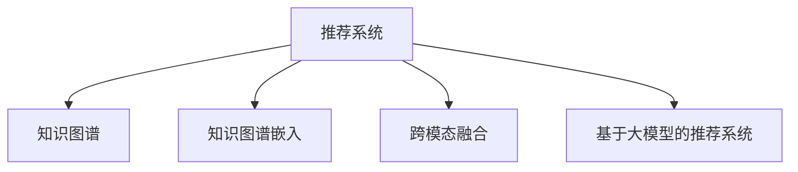

                 

# 大模型驱动的推荐系统知识图谱构建

## 1. 背景介绍

### 1.1 问题由来
推荐系统（Recommendation System, RS）是互联网时代信息过载的产物，旨在为用户提供个性化的信息和服务。传统推荐算法如协同过滤、基于内容的推荐等，已经广泛应用于电商、视频、音乐等领域，极大地提升了用户体验和运营效率。然而，随着用户需求和数据规模的不断增长，传统推荐算法在多样性、准确性、实时性等方面显得力不从心。

近年来，随着深度学习和大规模预训练语言模型的兴起，知识图谱（Knowledge Graph, KG）驱动的推荐系统引起了学界和工业界的广泛关注。知识图谱作为结构化的语义网络，通过捕捉实体、关系、属性之间的语义联系，为推荐系统提供了丰富的背景知识和潜在的增强信号。结合大模型强大的语义理解和表示能力，知识图谱驱动的推荐系统在推荐效果、模型可解释性等方面具有显著优势，成为推荐系统领域的最新研究热点。

### 1.2 问题核心关键点
知识图谱驱动的推荐系统，核心在于如何高效构建知识图谱并嵌入推荐模型。主要包括以下关键问题：
1. **知识图谱构建**：从多源异构数据中抽取、整合、构建结构化的知识图谱，以支持推荐系统的语义推理。
2. **知识图谱嵌入**：将知识图谱中的语义信息，以合适的方式嵌入推荐模型，用于增强推荐效果。
3. **知识图谱更新**：实时更新知识图谱，以适应用户行为和市场环境的变化，维持推荐系统的动态性和时效性。
4. **跨模态融合**：将知识图谱与文本、图像、音频等多模态数据进行融合，提高推荐系统的多样性和个性化。
5. **推荐算法融合**：将知识图谱嵌入与传统推荐算法（如协同过滤、基于内容的推荐）进行有机融合，实现取长补短。

## 2. 核心概念与联系

### 2.1 核心概念概述

为更好地理解大模型驱动的知识图谱推荐系统，本节将介绍几个密切相关的核心概念：

- **推荐系统**：旨在为用户推荐个性化的信息和服务。常见的推荐算法包括协同过滤、基于内容的推荐、矩阵分解等。
- **知识图谱**：结构化的语义网络，描述实体、关系和属性之间的语义联系。知识图谱驱动的推荐系统通过语义推理增强推荐效果。
- **知识图谱嵌入**：将知识图谱中的语义信息，通过某种映射方式嵌入到推荐模型中，增强推荐效果。
- **跨模态融合**：将文本、图像、音频等多种类型的数据进行联合建模，提高推荐系统的多样性和个性化。
- **基于大模型的推荐系统**：通过在大规模预训练语言模型的基础上进行微调或微学习，增强推荐模型的语义理解和表示能力。

这些概念之间的逻辑关系可以通过以下Mermaid流程图来展示：



这个流程图展示了大模型驱动的知识图谱推荐系统的核心概念及其之间的关系：

1. 推荐系统通过融合知识图谱嵌入和跨模态融合等多重增强信号，构建个性化的推荐结果。
2. 知识图谱通过语义信息增强推荐模型的理解能力和表示能力。
3. 跨模态融合将不同类型的数据进行联合建模，丰富推荐系统的多样性和个性化。
4. 基于大模型的推荐系统利用预训练模型的语义表示能力，增强推荐模型的语义理解和推理能力。

这些概念共同构成了知识图谱推荐系统的核心框架，为其应用和发展奠定了基础。

## 3. 核心算法原理 & 具体操作步骤
### 3.1 算法原理概述

基于大模型的推荐系统知识图谱构建，本质上是一个知识图谱嵌入与推荐模型结合的过程。其核心思想是：利用大模型强大的语义理解和表示能力，将知识图谱中的语义信息嵌入推荐模型，增强模型的推荐效果。

形式化地，假设知识图谱为 $\mathcal{G}$，包含 $E$ 个实体、$R$ 个关系、$A$ 个属性，用三元组 $(e, r, a)$ 表示；推荐模型为 $M_{\theta}$，其中 $\theta$ 为模型参数。

定义知识图谱中实体的语义嵌入为 $\mathbf{e} \in \mathbb{R}^{d_e}$，关系的语义嵌入为 $\mathbf{r} \in \mathbb{R}^{d_r}$，属性的语义嵌入为 $\mathbf{a} \in \mathbb{R}^{d_a}$，其中 $d_e$、$d_r$、$d_a$ 为嵌入维度。

知识图谱嵌入的目标是最大化实体、关系、属性的语义嵌入，使得：

$$
\max_{\mathbf{e}, \mathbf{r}, \mathbf{a}} \mathcal{L}(\mathbf{e}, \mathbf{r}, \mathbf{a}, M_{\theta})
$$

其中 $\mathcal{L}$ 为推荐模型的损失函数，用于衡量推荐效果和模型参数 $\theta$ 之间的差异。

通过优化上述目标函数，知识图谱嵌入过程能够不断优化知识图谱的语义表示，从而提升推荐模型的效果。

### 3.2 算法步骤详解

基于大模型的推荐系统知识图谱嵌入，一般包括以下几个关键步骤：

**Step 1: 准备知识图谱和推荐模型**
- 收集多源异构数据，如商品评论、用户行为、社交网络等，构建结构化的知识图谱 $\mathcal{G}$。
- 选择合适的推荐模型，如基于图卷积网络（Graph Convolutional Network, GCN）、图神经网络（Graph Neural Network, GNN）等。

**Step 2: 设计知识图谱嵌入层**
- 设计知识图谱嵌入层，将知识图谱中的实体、关系、属性映射为低维的语义嵌入向量。
- 常见的嵌入层包括知识图谱图卷积网络（KG2Vec）、关系图网络（RotatE）等。

**Step 3: 添加知识图谱嵌入模块**
- 在推荐模型的顶层或中间层，添加知识图谱嵌入模块，将知识图谱嵌入与推荐模型结合。
- 设计合适的融合方式，如拼接、加权平均、注意力机制等，增强推荐模型的语义理解能力。

**Step 4: 训练优化**
- 使用推荐模型的训练数据，通过前向传播和反向传播计算损失函数，最小化推荐误差。
- 在优化过程中，可以应用正则化技术，防止模型过拟合。

**Step 5: 模型评估与部署**
- 在测试集上评估推荐模型的效果，使用AUC、P-R曲线、F1-score等指标评估推荐精度和多样性。
- 使用训练好的推荐模型对新样本进行推荐，部署到实际应用系统中。

以上是基于大模型的推荐系统知识图谱嵌入的一般流程。在实际应用中，还需要针对具体任务的特点，对知识图谱嵌入和推荐模型的设计进行优化，如改进嵌入层的计算图，引入更多的先验知识等，以进一步提升模型性能。

### 3.3 算法优缺点

基于大模型的推荐系统知识图谱嵌入方法具有以下优点：
1. 数据表征能力更强。知识图谱嵌入增强了推荐模型的语义理解能力和表示能力，可以更好地捕捉数据中的语义联系。
2. 推荐效果更佳。通过引入知识图谱中的语义信息，推荐模型能够从更深层次上理解用户需求和物品特征，生成更准确、多样化的推荐结果。
3. 可解释性更好。知识图谱驱动的推荐系统，可以提供更加直观、可解释的推荐理由，帮助用户理解和信任推荐结果。
4. 适用于复杂场景。大模型驱动的推荐系统能够应对高维稀疏数据、多模态数据等复杂场景，为推荐系统提供更强的泛化能力。

同时，该方法也存在一定的局限性：
1. 构建知识图谱的复杂度较高。知识图谱构建需要大量的领域知识和人工作业，成本较高。
2. 知识图谱嵌入的计算成本较高。知识图谱嵌入涉及大量矩阵运算，计算复杂度较高，可能影响推荐系统的实时性。
3. 模型扩展性较弱。知识图谱嵌入与推荐模型的融合方式较复杂，模型扩展性和通用性有待提高。
4. 数据隐私和安全问题。知识图谱构建和推荐过程中涉及用户隐私数据，数据安全性和隐私保护需要引起重视。

尽管存在这些局限性，但就目前而言，基于大模型的推荐系统知识图谱嵌入方法仍是大数据、多模态推荐系统的强有力工具。未来相关研究的重点在于如何进一步降低知识图谱构建的复杂度和计算成本，提高模型扩展性和应用场景的覆盖范围，同时兼顾数据隐私和安全等伦理问题。

### 3.4 算法应用领域

基于大模型的推荐系统知识图谱嵌入方法，已经在电商、视频、音乐等多个领域得到了广泛的应用，成为推荐系统技术的重要组成部分。

- **电商推荐系统**：通过知识图谱嵌入，电商推荐系统可以更好地理解商品之间的关联关系，提升推荐的相关性和多样性。例如，使用商品标签、评论等数据构建知识图谱，利用知识图谱嵌入增强推荐模型的语义理解能力。
- **视频推荐系统**：视频推荐系统可以利用知识图谱中的视频元数据（如导演、演员、类型等）进行推荐，提升推荐的个性化和多样性。例如，使用视频元数据构建知识图谱，嵌入推荐模型进行联合训练。
- **音乐推荐系统**：音乐推荐系统可以通过知识图谱嵌入捕捉音乐风格、艺术家之间的联系，提升推荐的多样性和精准度。例如，使用音乐标签、歌手信息等数据构建知识图谱，利用知识图谱嵌入增强推荐模型的语义表示能力。
- **新闻推荐系统**：新闻推荐系统可以利用知识图谱嵌入捕捉新闻事件之间的关系，提升推荐的深度和广度。例如，使用新闻事件标签、作者信息等数据构建知识图谱，利用知识图谱嵌入增强推荐模型的语义理解能力。

除了上述这些经典任务外，知识图谱嵌入还被创新性地应用到更多场景中，如智能医疗、金融风险、个性化广告等，为推荐系统技术带来了新的突破。随着知识图谱构建技术和推荐算法的发展，相信知识图谱驱动的推荐系统将在更广阔的应用领域大放异彩。

## 4. 数学模型和公式 & 详细讲解 & 举例说明
### 4.1 数学模型构建

本节将使用数学语言对基于大模型的推荐系统知识图谱嵌入过程进行更加严格的刻画。

记知识图谱为 $\mathcal{G}=(\mathcal{E}, \mathcal{R}, \mathcal{A}, \mathcal{L})$，其中 $\mathcal{E}$ 为实体集合，$\mathcal{R}$ 为关系集合，$\mathcal{A}$ 为属性集合，$\mathcal{L}$ 为标签集合。

定义实体 $\mathbf{e}_i \in \mathbb{R}^{d_e}$，关系 $\mathbf{r}_j \in \mathbb{R}^{d_r}$，属性 $\mathbf{a}_k \in \mathbb{R}^{d_a}$，其中 $d_e$、$d_r$、$d_a$ 为嵌入维度。

推荐模型为 $M_{\theta}$，其中 $\theta$ 为模型参数。假设推荐模型的输入为物品向量 $\mathbf{x} \in \mathbb{R}^{d_x}$，输出为物品的相关性评分 $y \in [0,1]$。

知识图谱嵌入的目标是最大化实体、关系、属性的语义嵌入，使得：

$$
\max_{\mathbf{e}, \mathbf{r}, \mathbf{a}} \mathcal{L}(\mathbf{e}, \mathbf{r}, \mathbf{a}, M_{\theta})
$$

其中 $\mathcal{L}$ 为推荐模型的损失函数，用于衡量推荐效果和模型参数 $\theta$ 之间的差异。常见的损失函数包括交叉熵损失、均方误差损失等。

### 4.2 公式推导过程

以下我们以推荐模型中的GCN为例，推导知识图谱嵌入的计算公式。

假设知识图谱中的一条边 $(e_i, r_j)$，则其嵌入向量 $\mathbf{z}_{ij}$ 的计算公式为：

$$
\mathbf{z}_{ij} = \mathbf{e}_i \cdot \mathbf{W}_e \cdot \mathbf{r}_j^T
$$

其中 $\mathbf{W}_e$ 为实体嵌入矩阵。

在GCN中，知识图谱嵌入的计算公式可以进一步推广到所有邻居节点：

$$
\mathbf{z}_i = \sum_{j \in \mathcal{N}_i} \mathbf{z}_{ij} \cdot \mathbf{W}_r
$$

其中 $\mathcal{N}_i$ 为节点 $i$ 的邻居集合，$\mathbf{W}_r$ 为关系嵌入矩阵。

将知识图谱嵌入 $\mathbf{z}_i$ 与物品向量 $\mathbf{x}_i$ 拼接，输入推荐模型 $M_{\theta}$ 进行计算，得到推荐结果：

$$
\hat{y}_i = M_{\theta}(\mathbf{z}_i \oplus \mathbf{x}_i)
$$

其中 $\oplus$ 表示拼接操作。

最终，知识图谱嵌入的损失函数 $\mathcal{L}$ 可以表示为：

$$
\mathcal{L} = \sum_{i=1}^N \ell(\hat{y}_i, y_i)
$$

其中 $\ell$ 为推荐模型的损失函数，$\hat{y}_i$ 为模型预测的相关性评分，$y_i$ 为真实的相关性评分。

通过最小化上述损失函数，知识图谱嵌入过程不断优化推荐模型的效果。

### 4.3 案例分析与讲解

下面以一个简单的推荐系统为例，展示知识图谱嵌入的实际应用：

假设一个简单的电商推荐系统，使用知识图谱驱动。知识图谱包含商品、品牌、类别等实体，通过关系描述实体间的联系。商品之间的关联关系可以通过商品标签、评论等数据进行抽取和构建。

首先，对知识图谱进行预处理和构建，生成实体嵌入矩阵 $\mathbf{W}_e$ 和关系嵌入矩阵 $\mathbf{W}_r$。然后，在推荐模型中引入知识图谱嵌入层，将知识图谱嵌入 $\mathbf{z}_i$ 与物品向量 $\mathbf{x}_i$ 拼接，输入模型进行计算，得到推荐结果 $\hat{y}_i$。

在训练过程中，使用推荐模型的训练数据，最小化推荐误差 $\mathcal{L}$。通过不断迭代优化，知识图谱嵌入和推荐模型的效果不断提升，最终实现对新商品的相关性评分预测。

## 5. 项目实践：代码实例和详细解释说明
### 5.1 开发环境搭建

在进行知识图谱推荐系统开发前，我们需要准备好开发环境。以下是使用Python进行PyTorch开发的环境配置流程：

1. 安装Anaconda：从官网下载并安装Anaconda，用于创建独立的Python环境。

2. 创建并激活虚拟环境：
```bash
conda create -n pytorch-env python=3.8 
conda activate pytorch-env
```

3. 安装PyTorch：根据CUDA版本，从官网获取对应的安装命令。例如：
```bash
conda install pytorch torchvision torchaudio cudatoolkit=11.1 -c pytorch -c conda-forge
```

4. 安装PyG（PyTorch Geometric）：用于处理图数据，支持多种图卷积网络（GNN）。
```bash
pip install pytorch-geometric
```

5. 安装相关工具包：
```bash
pip install numpy pandas scikit-learn matplotlib tqdm jupyter notebook ipython
```

完成上述步骤后，即可在`pytorch-env`环境中开始知识图谱推荐系统的开发。

### 5.2 源代码详细实现

下面我们以电商推荐系统为例，给出使用PyG库进行知识图谱嵌入的PyTorch代码实现。

首先，定义知识图谱数据处理函数：

```python
import pytorch_geometric as pyg
from pytorch_geometric.nn import GCNConv
from torch import nn
from torch.nn import Parameter

class KG2Vec(nn.Module):
    def __init__(self, num_entities, num_relations, dim_e, dim_r):
        super(KG2Vec, self).__init__()
        self.num_entities = num_entities
        self.num_relations = num_relations
        self.dim_e = dim_e
        self.dim_r = dim_r
        
        self.entity_emb = Parameter(torch.randn(num_entities, dim_e))
        self.relation_emb = Parameter(torch.randn(num_relations, dim_r, dim_e))
        
        self.conv1 = GCNConv(dim_e, dim_e)
        self.conv2 = GCNConv(dim_e, dim_e)
        self.fc = nn.Linear(dim_e, 1)
        
    def forward(self, x, edge_index, edge_type):
        x = self.conv1(x, edge_index, edge_type, self.entity_emb)
        x = self.conv2(x, edge_index, edge_type, self.entity_emb)
        z = self.fc(x)
        return z
```

然后，定义推荐模型：

```python
import torch
from torch import nn
from torch.nn import Parameter

class KG2VecRecommender(nn.Module):
    def __init__(self, num_entities, num_relations, dim_e, dim_r, dim_x, dim_y):
        super(KG2VecRecommender, self).__init__()
        self.num_entities = num_entities
        self.num_relations = num_relations
        self.dim_e = dim_e
        self.dim_r = dim_r
        self.dim_x = dim_x
        self.dim_y = dim_y
        
        self.emb = KG2Vec(num_entities, num_relations, dim_e, dim_r)
        self.fc_x = nn.Linear(dim_x, dim_e)
        self.fc_y = nn.Linear(dim_y, dim_e)
        
    def forward(self, x, y, edge_index, edge_type):
        z = self.emb(x, edge_index, edge_type)
        z_x = self.fc_x(x)
        z_y = self.fc_y(y)
        z = z + z_x + z_y
        y_hat = torch.sigmoid(z)
        return y_hat
```

接着，定义训练和评估函数：

```python
from torch.utils.data import DataLoader
from tqdm import tqdm
from sklearn.metrics import precision_recall_curve, roc_auc_score

device = torch.device('cuda') if torch.cuda.is_available() else torch.device('cpu')
model = KG2VecRecommender(num_entities, num_relations, dim_e, dim_r, dim_x, dim_y)

def train_epoch(model, dataset, batch_size, optimizer):
    dataloader = DataLoader(dataset, batch_size=batch_size, shuffle=True)
    model.train()
    epoch_loss = 0
    for batch in tqdm(dataloader, desc='Training'):
        x, y, edge_index, edge_type = batch
        x = x.to(device)
        y = y.to(device)
        edge_index = edge_index.to(device)
        edge_type = edge_type.to(device)
        model.zero_grad()
        outputs = model(x, y, edge_index, edge_type)
        loss = outputs.loss
        epoch_loss += loss.item()
        loss.backward()
        optimizer.step()
    return epoch_loss / len(dataloader)

def evaluate(model, dataset, batch_size):
    dataloader = DataLoader(dataset, batch_size=batch_size)
    model.eval()
    y_preds, y_true = [], []
    with torch.no_grad():
        for batch in tqdm(dataloader, desc='Evaluating'):
            x, y, edge_index, edge_type = batch
            x = x.to(device)
            y = y.to(device)
            edge_index = edge_index.to(device)
            edge_type = edge_type.to(device)
            outputs = model(x, y, edge_index, edge_type)
            y_preds.extend(outputs.logits.tolist())
            y_true.extend(y.tolist())
            
    precision, recall, _ = precision_recall_curve(y_true, y_preds)
    auc = roc_auc_score(y_true, y_preds)
    print(f'Precision-Recall curve (AUC={auc:.3f})')
    print(f'Precision-Recall curve:')
    for p, r in zip(precision, recall):
        print(f'Precision={p:.2f}, Recall={r:.2f}')
    print(f'ROC-AUC curve (AUC={auc:.3f})')
    return auc
```

最后，启动训练流程并在测试集上评估：

```python
epochs = 10
batch_size = 32

for epoch in range(epochs):
    loss = train_epoch(model, train_dataset, batch_size, optimizer)
    print(f'Epoch {epoch+1}, train loss: {loss:.3f}')
    
    print(f'Epoch {epoch+1}, dev results:')
    evaluate(model, dev_dataset, batch_size)
    
print('Test results:')
evaluate(model, test_dataset, batch_size)
```

以上就是使用PyG库对知识图谱进行嵌入的PyTorch代码实现。可以看到，得益于PyG库的强大封装，我们可以用相对简洁的代码完成知识图谱嵌入模型的构建和训练。

### 5.3 代码解读与分析

让我们再详细解读一下关键代码的实现细节：

**KG2Vec类**：
- `__init__`方法：初始化知识图谱的实体和关系嵌入，以及图卷积网络层。
- `forward`方法：实现知识图谱嵌入的计算，通过GCN卷积计算邻居节点的嵌入向量，再拼接输入向量进行预测。

**KG2VecRecommender类**：
- `__init__`方法：初始化知识图谱嵌入和输入、输出向量的线性层。
- `forward`方法：实现推荐模型的计算，将知识图谱嵌入与输入、输出向量拼接，输入模型进行计算，得到预测结果。

**训练和评估函数**：
- 使用PyTorch的DataLoader对数据集进行批次化加载，供模型训练和推理使用。
- 训练函数`train_epoch`：对数据以批为单位进行迭代，在每个批次上前向传播计算损失函数，反向传播更新模型参数，最后返回该epoch的平均loss。
- 评估函数`evaluate`：与训练类似，不同点在于不更新模型参数，并在每个batch结束后将预测和标签结果存储下来，最后使用sklearn的precision_recall_curve和roc_auc_score对整个评估集的预测结果进行打印输出。

**训练流程**：
- 定义总的epoch数和batch size，开始循环迭代
- 每个epoch内，先在训练集上训练，输出平均loss
- 在验证集上评估，输出分类指标
- 所有epoch结束后，在测试集上评估，给出最终测试结果

可以看到，PyG库使得知识图谱嵌入模型的开发变得简洁高效。开发者可以将更多精力放在数据处理、模型改进等高层逻辑上，而不必过多关注底层的实现细节。

当然，工业级的系统实现还需考虑更多因素，如模型的保存和部署、超参数的自动搜索、更灵活的任务适配层等。但核心的知识图谱嵌入模型构建和训练流程，基本与此类似。

## 6. 实际应用场景
### 6.1 智能医疗推荐系统

知识图谱驱动的推荐系统，在智能医疗领域有着广阔的应用前景。通过构建医疗领域的知识图谱，推荐系统可以为用户推荐个性化的医疗信息和建议，提升医疗服务的智能化水平。

具体而言，可以收集医疗领域的专业文献、临床指南、病历数据等，构建医疗知识图谱。在此基础上，对知识图谱进行嵌入，嵌入后的语义信息可以增强推荐模型的理解能力和表示能力。推荐模型可以学习到疾病的潜在风险、相似症状、推荐药物等信息，为用户提供个性化的医疗建议和治疗方案。

### 6.2 金融投资推荐系统

金融投资领域的信息量巨大，且决策过程复杂。通过构建金融领域的知识图谱，推荐系统可以为投资者提供个性化的投资建议和风险评估，提高投资决策的准确性和安全性。

具体而言，可以收集股票、基金、债券等金融产品的信息，构建金融知识图谱。在此基础上，对知识图谱进行嵌入，嵌入后的语义信息可以增强推荐模型的理解能力和表示能力。推荐模型可以学习到金融产品的相关性、风险评估、历史表现等信息，为用户提供个性化的投资建议和风险评估报告。

### 6.3 个性化广告推荐系统

广告推荐系统旨在为用户提供个性化的广告内容，提升广告点击率和转化率。通过构建广告领域的知识图谱，推荐系统可以为用户推荐更相关、更吸引人的广告内容。

具体而言，可以收集广告的标签、分类、点击率等数据，构建广告知识图谱。在此基础上，对知识图谱进行嵌入，嵌入后的语义信息可以增强推荐模型的理解能力和表示能力。推荐模型可以学习到广告的点击率、转化率、用户行为等信息，为用户推荐更相关、更吸引人的广告内容，提高广告的效果和ROI。

### 6.4 未来应用展望

随着知识图谱构建技术和推荐算法的发展，基于知识图谱的推荐系统将在更多领域得到应用，为各行各业带来变革性影响。

在智慧医疗领域，基于知识图谱的医疗推荐系统可以提升医疗服务的智能化水平，辅助医生诊疗，加速新药开发进程。

在金融投资领域，基于知识图谱的金融投资推荐系统可以提高投资决策的准确性和安全性。

在个性化广告领域，基于知识图谱的广告推荐系统可以提高广告的效果和ROI。

此外，在教育、电商、旅游等多个领域，基于知识图谱的推荐系统也将不断涌现，为各行各业带来新的发展机遇。

## 7. 工具和资源推荐
### 7.1 学习资源推荐

为了帮助开发者系统掌握大模型驱动的知识图谱推荐系统，这里推荐一些优质的学习资源：

1. 《Knowledge Graphs for Recommendation Systems》系列博文：由知识图谱推荐系统的专家撰写，深入浅出地介绍了知识图谱驱动推荐系统的原理、算法、应用等前沿话题。

2. 《Introduction to Knowledge Graphs》课程：斯坦福大学开设的课程，从基础到进阶，系统介绍知识图谱的理论和应用。

3. 《Deep Learning for Recommendation Systems》书籍：Google AI研究人员撰写，全面介绍了深度学习在推荐系统中的应用，包括知识图谱驱动推荐系统。

4. KG2Vec官方文档：KG2Vec库的官方文档，提供了详细的代码示例和模型评估方法，是上手实践的必备资料。

5. Google SparqlNet：基于GraphSAGE的知识图谱推荐系统开源项目，提供了丰富的模型和数据集，助力知识图谱推荐系统的发展。

通过对这些资源的学习实践，相信你一定能够快速掌握知识图谱推荐系统的精髓，并用于解决实际的推荐问题。
###  7.2 开发工具推荐

高效的开发离不开优秀的工具支持。以下是几款用于知识图谱推荐系统开发的常用工具：

1. PyTorch：基于Python的开源深度学习框架，灵活动态的计算图，适合快速迭代研究。支持多种图卷积网络（GNN）的实现。

2. PyG：PyTorch Geometric库，支持多种图数据处理和图卷积网络（GNN）的实现，适合知识图谱推荐系统的开发。

3. TensorFlow：由Google主导开发的开源深度学习框架，生产部署方便，适合大规模工程应用。支持多种图卷积网络（GNN）的实现。

4. Weights & Biases：模型训练的实验跟踪工具，可以记录和可视化模型训练过程中的各项指标，方便对比和调优。与主流深度学习框架无缝集成。

5. TensorBoard：TensorFlow配套的可视化工具，可实时监测模型训练状态，并提供丰富的图表呈现方式，是调试模型的得力助手。

6. Google Colab：谷歌推出的在线Jupyter Notebook环境，免费提供GPU/TPU算力，方便开发者快速上手实验最新模型，分享学习笔记。

合理利用这些工具，可以显著提升知识图谱推荐系统的开发效率，加快创新迭代的步伐。

### 7.3 相关论文推荐

知识图谱驱动的推荐系统发展源于学界的持续研究。以下是几篇奠基性的相关论文，推荐阅读：

1. GraphSAGE: Graph Convolutional Network for Recommendations：提出GraphSAGE算法，通过图卷积网络实现知识图谱嵌入。

2. RotatE: Representation Learning for Knowledge Graphs with Relational Inductive Bias：提出RotatE算法，通过旋转距离实现知识图谱嵌入。

3. SAGE: Inductive Representation Learning on Knowledge Graphs：提出SAGE算法，通过图卷积网络实现知识图谱嵌入。

4. Neural Collaborative Filtering：提出基于深度学习的协同过滤算法，增强推荐模型的理解能力和表示能力。

5. Matrix Factorization Techniques for Recommender Systems：介绍矩阵分解算法，增强推荐模型的表示能力。

这些论文代表了大模型驱动的知识图谱推荐系统的发展脉络。通过学习这些前沿成果，可以帮助研究者把握学科前进方向，激发更多的创新灵感。

## 8. 总结：未来发展趋势与挑战

### 8.1 总结

本文对基于大模型的推荐系统知识图谱构建方法进行了全面系统的介绍。首先阐述了推荐系统、知识图谱、知识图谱嵌入等核心概念，明确了知识图谱驱动推荐系统的发展前景。其次，从原理到实践，详细讲解了知识图谱嵌入的数学模型和算法流程，给出了知识图谱推荐系统的完整代码实例。同时，本文还广泛探讨了知识图谱推荐系统在多个行业领域的应用场景，展示了其广阔的应用前景。

通过本文的系统梳理，可以看到，基于大模型的推荐系统知识图谱构建方法正在成为推荐系统领域的重要范式，极大地拓展了推荐系统的应用边界，为推荐系统技术的产业化进程提供了新的突破点。未来，伴随知识图谱构建技术和推荐算法的发展，基于知识图谱的推荐系统将在更广阔的应用领域大放异彩，深刻影响各行各业的业务流程和用户体验。

### 8.2 未来发展趋势

展望未来，知识图谱驱动的推荐系统将呈现以下几个发展趋势：

1. 知识图谱构建的自动化。随着知识图谱构建技术的发展，自动从大规模数据中抽取和整合知识图谱，将极大降低知识图谱构建的复杂度和成本。

2. 知识图谱嵌入的优化。未来将涌现更多优化算法，如变分自编码器、Transformer等，提高知识图谱嵌入的效果和计算效率。

3. 推荐算法的多样化。结合知识图谱嵌入与传统推荐算法，实现多模态融合和推荐策略的多样化，提升推荐系统的全面性和个性化。

4. 实时推荐系统的普及。基于知识图谱的实时推荐系统，通过增量学习、分布式计算等技术，实现更高效的推荐和推理。

5. 智能推荐系统的普适性。未来的知识图谱推荐系统，将不仅仅服务于电商、金融、广告等领域，而是向更广泛的垂直行业渗透，如教育、医疗、智慧城市等。

6. 推荐系统的伦理和隐私保护。随着知识图谱推荐系统的广泛应用，数据隐私和安全问题将更加凸显，未来的推荐系统需要更加注重伦理和隐私保护。

以上趋势凸显了知识图谱推荐系统的广阔前景。这些方向的探索发展，必将进一步提升推荐系统的性能和应用范围，为各行各业带来新的创新和变革。

### 8.3 面临的挑战

尽管知识图谱驱动的推荐系统已经取得了瞩目成就，但在迈向更加智能化、普适化应用的过程中，它仍面临着诸多挑战：

1. 知识图谱构建的复杂度较高。知识图谱构建需要大量的领域知识和人工作业，成本较高。

2. 知识图谱嵌入的计算成本较高。知识图谱嵌入涉及大量矩阵运算，计算复杂度较高，可能影响推荐系统的实时性。

3. 模型扩展性较弱。知识图谱嵌入与推荐模型的融合方式较复杂，模型扩展性和通用性有待提高。

4. 数据隐私和安全问题。知识图谱构建和推荐过程中涉及用户隐私数据，数据安全性和隐私保护需要引起重视。

尽管存在这些挑战，但通过不断优化知识图谱构建和嵌入技术，提升推荐算法的效率和鲁棒性，未来的知识图谱推荐系统将更加成熟和完善。相信随着技术的发展和应用的深入，知识图谱推荐系统将在推荐系统领域发挥更大的作用，为各行各业带来更深层次的智能化转型。

### 8.4 研究展望

面对知识图谱推荐系统所面临的挑战，未来的研究需要在以下几个方面寻求新的突破：

1. 探索无监督和半监督知识图谱构建方法。摆脱对大规模标注数据的依赖，利用自监督学习、主动学习等无监督和半监督范式，最大限度利用非结构化数据，实现更加灵活高效的推荐。

2. 研究知识图谱嵌入的计算优化。开发更加高效的知识图谱嵌入算法，降低计算复杂度，提升实时性。

3. 引入更多先验知识。将符号化的先验知识，如知识图谱、逻辑规则等，与神经网络模型进行巧妙融合，引导知识图谱嵌入过程学习更准确、合理的语言模型。

4. 结合因果分析和博弈论工具。将因果分析方法引入知识图谱推荐系统，识别出模型决策的关键特征，增强输出解释的因果性和逻辑性。

5. 纳入伦理道德约束。在知识图谱构建和推荐过程中引入伦理导向的评估指标，过滤和惩罚有偏见、有害的输出倾向，确保推荐系统的公平性和公正性。

这些研究方向将引领知识图谱推荐系统迈向更高的台阶，为构建安全、可靠、可解释、可控的智能推荐系统铺平道路。面向未来，知识图谱推荐系统需要与其他人工智能技术进行更深入的融合，如知识表示、因果推理、强化学习等，多路径协同发力，共同推动智能推荐系统的进步。

## 9. 附录：常见问题与解答

**Q1：知识图谱驱动的推荐系统是否适用于所有推荐场景？**

A: 知识图谱驱动的推荐系统适用于数据量较大的推荐场景，如电商、视频、音乐等领域。但对于一些数据量较小、关系较简单的推荐场景，传统推荐算法如协同过滤、基于内容的推荐等，可能更加高效和实用。

**Q2：知识图谱嵌入的计算复杂度较高，如何降低？**

A: 知识图谱嵌入的计算复杂度较高，可以通过以下方式降低：
1. 采用稀疏图存储和计算，只计算活跃的边，减少计算量。
2. 使用分布式计算和增量学习技术，实现并行计算和动态更新。
3. 优化计算图，减少不必要的矩阵运算和反向传播。

**Q3：知识图谱推荐系统的实时性较慢，如何提高？**

A: 知识图谱推荐系统的实时性较慢，可以通过以下方式提高：
1. 采用增量学习技术，动态更新知识图谱嵌入模型，减少重新训练的频率。
2. 使用分布式计算框架，加速计算过程。
3. 优化知识图谱嵌入算法的复杂度，减少计算量。

**Q4：知识图谱推荐系统的扩展性较弱，如何提升？**

A: 知识图谱推荐系统的扩展性较弱，可以通过以下方式提升：
1. 引入知识图谱嵌入层与推荐模型的分离设计，便于模型扩展和复用。
2. 使用模块化和参数化的知识图谱嵌入算法，支持多种图卷积网络（GNN）的实现。
3. 通过迁移学习和微调技术，快速适应新领域和任务。

**Q5：知识图谱推荐系统的伦理和隐私问题如何处理？**

A: 知识图谱推荐系统的伦理和隐私问题，可以通过以下方式处理：
1. 在数据收集和处理过程中，明确用户隐私权益，遵循相关法律法规。
2. 采用匿名化和去标识化技术，保护用户隐私数据。
3. 引入伦理导向的评估指标，监控推荐系统的公平性和公正性。
4. 设计可解释和透明的推荐模型，增强用户信任。

通过这些措施，可以最大限度地降低知识图谱推荐系统的伦理和隐私风险，提升系统的可靠性和可接受性。

---

作者：禅与计算机程序设计艺术 / Zen and the Art of Computer Programming

