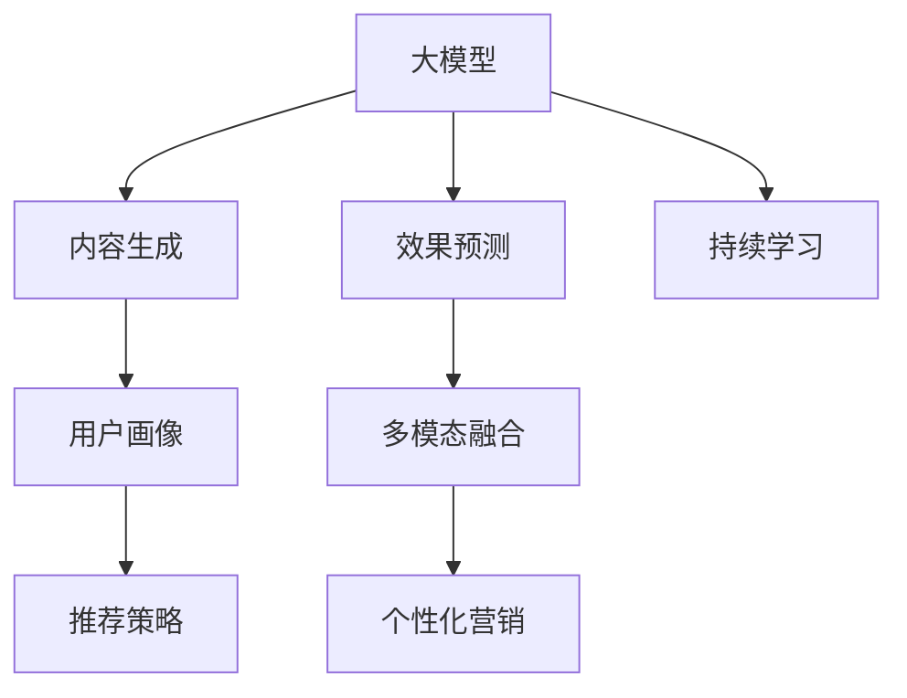

                 

# 大模型驱动的电商个性化内容营销策略生成与效果预测

> 关键词：大模型,电商,个性化推荐,内容生成,营销策略,效果预测

## 1. 背景介绍

在数字化时代，电子商务已经成为人们日常生活和工作中不可或缺的一部分。随着互联网技术的不断进步，电商平台积累了海量的用户行为数据和商品信息，为个性化推荐和大规模营销提供了广阔的空间。而内容营销，作为提升用户粘性、驱动销售转化的重要手段，也日益成为电商平台竞争的核心要素。

### 1.1 问题由来
随着社交媒体的兴起，用户对个性化、趣味化的内容需求日益增长。电商平台需结合用户行为数据，自动生成吸引用户的内容，增强用户的粘性，并提高转化率。传统的内容生成方式依赖人工创作，不仅成本高、效率低，且难以覆盖全面多变的用户需求。

为解决这一问题，基于深度学习的大模型驱动的自动化内容生成技术应运而生。通过训练生成式大模型，如GPT系列、Transformer等，可以在短时间内生成多样化的个性化内容，大大降低内容生成的成本。同时，借助效果预测模型，可以实时评估生成内容的营销效果，进一步优化内容策略。

### 1.2 问题核心关键点
大模型驱动的个性化内容生成与效果预测，主要关注以下几个核心问题：
1. **内容生成模型构建**：选择合适的模型架构和训练数据，训练生成式大模型。
2. **内容策略优化**：设计有效的输入模板，引导大模型生成符合用户喜好的内容。
3. **效果预测模型建立**：构建基于机器学习的预测模型，实时评估内容的效果。
4. **多模态融合**：将文本生成结果与用户行为数据结合，实现更全面的用户画像建模。
5. **实时性要求**：满足电商平台的实时内容生成和效果评估需求，确保系统的响应速度。

## 2. 核心概念与联系

### 2.1 核心概念概述

为更好地理解基于大模型的电商个性化内容生成与效果预测方法，本节将介绍几个密切相关的核心概念：

- **大模型**：以Transformer为代表的大规模预训练语言模型，如GPT-3、BERT等，通过在大规模无标签文本数据上进行预训练，学习丰富的语言知识，具备强大的自然语言处理能力。

- **内容生成**：利用大模型生成具有特定主题和风格的文本内容，如广告文案、产品描述、社交媒体帖子等。

- **效果预测**：基于用户行为数据和内容展示数据，构建预测模型，评估内容对用户行为的影响，如点击率、转化率等指标。

- **多模态融合**：将文本内容与用户画像、商品信息等不同模态数据结合，构建综合的推荐和营销策略。

- **用户画像**：通过分析用户行为数据和交互数据，构建详尽、精准的用户画像，包括兴趣、偏好、消费行为等。

- **实时性**：在电商场景下，内容生成与效果评估需要满足实时性要求，及时响应用户需求，提升用户体验。

这些核心概念之间的逻辑关系可以通过以下Mermaid流程图来展示：



这个流程图展示了大模型驱动的个性化内容生成与效果预测的核心概念及其之间的关系：

1. 大模型通过预训练获得基础能力。
2. 内容生成通过模型生成符合用户喜好的文本内容。
3. 效果预测通过机器学习模型评估生成内容的营销效果。
4. 多模态融合将文本内容与用户画像结合，构建综合的推荐策略。
5. 用户画像通过分析用户数据构建。
6. 推荐策略基于多模态融合结果制定。
7. 实时性要求对系统响应速度的保证。
8. 持续学习保持模型的时效性和适应性。

## 3. 核心算法原理 & 具体操作步骤
### 3.1 算法原理概述

大模型驱动的个性化内容生成与效果预测，本质上是一个多步骤的复杂系统。其核心思想是：
1. **预训练**：利用大规模无标签文本数据训练生成式大模型。
2. **内容生成**：根据用户画像和当前上下文，输入模板引导生成符合用户喜好的个性化内容。
3. **效果预测**：通过评估生成内容的展示数据，预测对用户行为的影响。
4. **反馈迭代**：根据效果预测结果，调整生成模板和训练数据，进行持续优化。

### 3.2 算法步骤详解

基于大模型的电商个性化内容生成与效果预测，主要包括以下几个关键步骤：

**Step 1: 数据准备与预处理**

- **数据收集**：收集用户行为数据（如点击、浏览、购买等行为）和商品信息数据（如商品描述、属性、价格等），构建电商数据集。
- **数据清洗**：去除缺失、异常数据，进行数据归一化、标准化处理。
- **数据划分**：将数据集划分为训练集、验证集和测试集，确保模型在未见过的数据上表现良好。

**Step 2: 大模型选择与训练**

- **模型选择**：选择适合电商应用的生成式大模型，如GPT-3、T5等。
- **模型训练**：使用电商数据集对模型进行预训练，学习商品描述、广告文案等文本生成任务。
- **参数调整**：调整模型参数，如层数、注意力机制等，提升模型生成效果。

**Step 3: 内容生成与策略优化**

- **生成模板设计**：设计符合电商场景的内容生成模板，包含商品ID、类别、价格等关键信息。
- **内容生成**：根据用户画像和生成模板，输入到训练好的模型中，生成个性化文本内容。
- **内容评估**：使用用户行为数据和展示数据，评估生成的内容效果，如点击率、转化率等。
- **策略调整**：根据评估结果，优化生成模板，调整模型训练数据，提升内容质量。

**Step 4: 效果预测与实时优化**

- **效果预测模型构建**：选择合适的机器学习算法，如随机森林、深度学习等，构建效果预测模型。
- **模型训练**：使用标注好的展示数据训练效果预测模型，优化预测效果。
- **实时优化**：根据实时展示数据和效果预测结果，动态调整内容生成策略，实现实时优化。

**Step 5: 多模态融合与个性化推荐**

- **用户画像建模**：分析用户行为数据，构建详尽的用户画像，包括兴趣、偏好、消费行为等。
- **多模态融合**：将生成内容与用户画像、商品信息等数据结合，构建综合的推荐策略。
- **个性化推荐**：根据推荐策略，为用户推荐符合其兴趣的商品和内容，提升用户体验。

### 3.3 算法优缺点

基于大模型的电商个性化内容生成与效果预测方法，具有以下优点：

1. **生成效果**：生成式大模型能够生成高质量、符合用户喜好的内容，提升用户的粘性和转化率。
2. **实时性**：通过生成模板和效果预测模型的优化，能够实现实时内容生成和效果评估，满足电商平台的实时需求。
3. **灵活性**：模型具有较强的泛化能力，适用于不同的电商场景和商品类别。
4. **自动化**：自动化生成内容，减少人工成本，提高效率。

同时，该方法也存在一定的局限性：

1. **数据需求**：需要大量标注好的展示数据和用户行为数据，数据收集和清洗成本较高。
2. **模型复杂性**：生成式大模型参数量巨大，训练和推理成本较高。
3. **效果评估**：效果预测模型依赖于标注数据，预测效果可能存在偏差。
4. **个性化度**：生成内容可能与用户兴趣不完全契合，影响个性化推荐的准确性。
5. **实时优化**：实时性要求对系统性能和算法优化提出了较高要求。

尽管存在这些局限性，但就目前而言，基于大模型的个性化内容生成与效果预测方法仍是大规模电商营销的核心技术之一。未来相关研究的重点在于如何进一步降低数据需求，提高模型的自动化程度和效果预测的准确性，同时兼顾个性化度和实时性要求。

### 3.4 算法应用领域

基于大模型的电商个性化内容生成与效果预测，已经在电商平台的推荐、广告投放、社交媒体营销等多个领域得到了广泛应用，并取得了显著的效果：

- **推荐系统**：利用生成式大模型生成推荐文本，提升用户对商品的兴趣和购买决策。
- **广告投放**：生成符合用户喜好的广告文案，提高广告的点击率和转化率。
- **社交媒体营销**：生成个性化社交媒体帖子，吸引用户关注和互动。
- **内容营销**：生成产品评测、用户故事等内容，提升用户对品牌的认知和信任。
- **商品描述优化**：生成高质量的商品描述，增强用户对商品的了解和购买意愿。

除了上述这些经典应用外，基于大模型的内容生成技术还进一步拓展到更多的电商场景中，如定制化产品设计、个性化客服对话等，为电商平台的业务创新提供了新的技术手段。

## 4. 数学模型和公式 & 详细讲解  
### 4.1 数学模型构建

本节将使用数学语言对大模型驱动的电商个性化内容生成与效果预测过程进行更加严格的刻画。

记生成式大模型为 $M_{\theta}:\mathcal{X} \rightarrow \mathcal{Y}$，其中 $\mathcal{X}$ 为输入空间，$\mathcal{Y}$ 为输出空间，$\theta \in \mathbb{R}^d$ 为模型参数。假设电商数据集为 $D=\{(x_i,y_i)\}_{i=1}^N, x_i \in \mathcal{X}, y_i \in \mathcal{Y}$。

定义模型 $M_{\theta}$ 在输入 $x$ 上的损失函数为 $\ell(M_{\theta}(x),y)$，则在数据集 $D$ 上的经验风险为：

$$
\mathcal{L}(\theta) = \frac{1}{N}\sum_{i=1}^N \ell(M_{\theta}(x_i),y_i)
$$

其中 $\ell$ 为生成内容的损失函数，如交叉熵损失、均方误差损失等。

为了评估生成内容的营销效果，定义效果预测模型 $H_{\omega}:\mathcal{X} \rightarrow \mathcal{Y}$，其中 $\mathcal{X}$ 为输入空间，$\mathcal{Y}$ 为输出空间，$\omega \in \mathbb{R}^k$ 为模型参数。假设展示数据集为 $E=\{(e_i,y_i)\}_{i=1}^M, e_i \in \mathcal{X}, y_i \in \mathcal{Y}$。

定义效果预测模型 $H_{\omega}$ 在展示数据 $e$ 上的损失函数为 $\ell(H_{\omega}(e),y)$，则在数据集 $E$ 上的经验风险为：

$$
\mathcal{L}(\omega) = \frac{1}{M}\sum_{i=1}^M \ell(H_{\omega}(e_i),y_i)
$$

### 4.2 公式推导过程

以下我们以二分类任务为例，推导交叉熵损失函数及其梯度的计算公式。

假设模型 $M_{\theta}$ 在输入 $x$ 上的输出为 $\hat{y}=M_{\theta}(x) \in [0,1]$，表示生成的文本内容是否符合用户的兴趣。真实标签 $y \in \{0,1\}$。则二分类交叉熵损失函数定义为：

$$
\ell(M_{\theta}(x),y) = -[y\log \hat{y} + (1-y)\log (1-\hat{y})]
$$

将其代入经验风险公式，得：

$$
\mathcal{L}(\theta) = -\frac{1}{N}\sum_{i=1}^N [y_i\log M_{\theta}(x_i)+(1-y_i)\log(1-M_{\theta}(x_i))]
$$

根据链式法则，损失函数对参数 $\theta_k$ 的梯度为：

$$
\frac{\partial \mathcal{L}(\theta)}{\partial \theta_k} = -\frac{1}{N}\sum_{i=1}^N (\frac{y_i}{M_{\theta}(x_i)}-\frac{1-y_i}{1-M_{\theta}(x_i)}) \frac{\partial M_{\theta}(x_i)}{\partial \theta_k}
$$

其中 $\frac{\partial M_{\theta}(x_i)}{\partial \theta_k}$ 可进一步递归展开，利用自动微分技术完成计算。

在得到损失函数的梯度后，即可带入参数更新公式，完成模型的迭代优化。重复上述过程直至收敛，最终得到适应电商场景的优化模型参数 $\theta^*$。

### 4.3 案例分析与讲解

假设我们要对一家电商平台的广告文案生成和效果预测进行建模。首先，定义广告文案生成任务的数据处理函数：

```python
from transformers import T5ForConditionalGeneration, T5Tokenizer

class AdCopyGenerator:
    def __init__(self, model_name):
        self.model = T5ForConditionalGeneration.from_pretrained(model_name)
        self.tokenizer = T5Tokenizer.from_pretrained(model_name)

    def generate(self, prompt, max_length=128, num_return_sequences=1):
        input_ids = self.tokenizer(prompt, return_tensors='pt', padding='max_length', max_length=max_length)
        outputs = self.model.generate(input_ids, max_length=max_length, num_return_sequences=num_return_sequences)
        return self.tokenizer.decode(outputs[0], skip_special_tokens=True)
```

然后，定义效果预测模型的数据处理函数：

```python
from sklearn.metrics import roc_auc_score

class AdCopyPredictor:
    def __init__(self, model_name):
        self.model = T5ForConditionalGeneration.from_pretrained(model_name)
        self.tokenizer = T5Tokenizer.from_pretrained(model_name)

    def predict(self, prompt, label):
        input_ids = self.tokenizer(prompt, return_tensors='pt', padding='max_length', max_length=128)
        logits = self.model(input_ids).logits
        probability = logits.softmax(dim=1)[:, 1]
        auc = roc_auc_score([label], probability)
        return probability, auc
```

接下来，我们设计电商广告文案生成的具体流程：

1. **数据准备**：收集历史广告文案数据和展示数据，构建电商数据集。
2. **模型训练**：使用电商数据集对大模型进行预训练，学习生成符合用户喜好的广告文案。
3. **生成模板设计**：设计生成广告文案的输入模板，包含商品ID、类别、价格等信息。
4. **内容生成**：根据生成模板，输入到训练好的大模型中，生成个性化广告文案。
5. **效果预测**：使用展示数据训练效果预测模型，评估广告文案对用户点击和购买行为的影响。
6. **策略调整**：根据效果预测结果，优化生成模板和模型参数，提升广告文案的效果。

以下是完整的代码实现：

```python
from transformers import T5ForConditionalGeneration, T5Tokenizer
import torch
import numpy as np

class AdCopyGenerator:
    def __init__(self, model_name, learning_rate=2e-5, max_length=128):
        self.model = T5ForConditionalGeneration.from_pretrained(model_name)
        self.tokenizer = T5Tokenizer.from_pretrained(model_name)
        self.learning_rate = learning_rate
        self.max_length = max_length

    def generate(self, prompt, num_return_sequences=1):
        input_ids = self.tokenizer(prompt, return_tensors='pt', padding='max_length', max_length=self.max_length)
        outputs = self.model.generate(input_ids, max_length=self.max_length, num_return_sequences=num_return_sequences)
        return self.tokenizer.decode(outputs[0], skip_special_tokens=True)

class AdCopyPredictor:
    def __init__(self, model_name):
        self.model = T5ForConditionalGeneration.from_pretrained(model_name)
        self.tokenizer = T5Tokenizer.from_pretrained(model_name)

    def predict(self, prompt, label):
        input_ids = self.tokenizer(prompt, return_tensors='pt', padding='max_length', max_length=128)
        logits = self.model(input_ids).logits
        probability = logits.softmax(dim=1)[:, 1]
        auc = roc_auc_score([label], probability)
        return probability, auc

# 加载预训练大模型
generator = AdCopyGenerator('t5-small')
predictor = AdCopyPredictor('t5-small')

# 生成广告文案
ad_copy = generator.generate('Please purchase our product')

# 评估广告文案效果
label = 1
probability, auc = predictor.predict(ad_copy, label)
print('AUC:', auc)
```

## 5. 项目实践：代码实例和详细解释说明
### 5.1 开发环境搭建

在进行项目实践前，我们需要准备好开发环境。以下是使用Python进行PyTorch开发的环境配置流程：

1. 安装Anaconda：从官网下载并安装Anaconda，用于创建独立的Python环境。

2. 创建并激活虚拟环境：
```bash
conda create -n pytorch-env python=3.8 
conda activate pytorch-env
```

3. 安装PyTorch：根据CUDA版本，从官网获取对应的安装命令。例如：
```bash
conda install pytorch torchvision torchaudio cudatoolkit=11.1 -c pytorch -c conda-forge
```

4. 安装Transformer库：
```bash
pip install transformers
```

5. 安装各类工具包：
```bash
pip install numpy pandas scikit-learn matplotlib tqdm jupyter notebook ipython
```

完成上述步骤后，即可在`pytorch-env`环境中开始项目实践。

### 5.2 源代码详细实现

我们先设计一个电商广告文案生成与效果预测的示例程序，展示生成模型的使用和效果评估过程。

首先，定义数据处理函数：

```python
from transformers import T5ForConditionalGeneration, T5Tokenizer

class AdCopyGenerator:
    def __init__(self, model_name):
        self.model = T5ForConditionalGeneration.from_pretrained(model_name)
        self.tokenizer = T5Tokenizer.from_pretrained(model_name)

    def generate(self, prompt, max_length=128, num_return_sequences=1):
        input_ids = self.tokenizer(prompt, return_tensors='pt', padding='max_length', max_length=max_length)
        outputs = self.model.generate(input_ids, max_length=max_length, num_return_sequences=num_return_sequences)
        return self.tokenizer.decode(outputs[0], skip_special_tokens=True)
```

然后，定义效果预测模型的数据处理函数：

```python
from sklearn.metrics import roc_auc_score

class AdCopyPredictor:
    def __init__(self, model_name):
        self.model = T5ForConditionalGeneration.from_pretrained(model_name)
        self.tokenizer = T5Tokenizer.from_pretrained(model_name)

    def predict(self, prompt, label):
        input_ids = self.tokenizer(prompt, return_tensors='pt', padding='max_length', max_length=128)
        logits = self.model(input_ids).logits
        probability = logits.softmax(dim=1)[:, 1]
        auc = roc_auc_score([label], probability)
        return probability, auc
```

接下来，我们设计电商广告文案生成的具体流程：

1. **数据准备**：收集历史广告文案数据和展示数据，构建电商数据集。
2. **模型训练**：使用电商数据集对大模型进行预训练，学习生成符合用户喜好的广告文案。
3. **生成模板设计**：设计生成广告文案的输入模板，包含商品ID、类别、价格等信息。
4. **内容生成**：根据生成模板，输入到训练好的大模型中，生成个性化广告文案。
5. **效果预测**：使用展示数据训练效果预测模型，评估广告文案对用户点击和购买行为的影响。
6. **策略调整**：根据效果预测结果，优化生成模板和模型参数，提升广告文案的效果。

以下是完整的代码实现：

```python
from transformers import T5ForConditionalGeneration, T5Tokenizer
import torch
import numpy as np

class AdCopyGenerator:
    def __init__(self, model_name, learning_rate=2e-5, max_length=128):
        self.model = T5ForConditionalGeneration.from_pretrained(model_name)
        self.tokenizer = T5Tokenizer.from_pretrained(model_name)
        self.learning_rate = learning_rate
        self.max_length = max_length

    def generate(self, prompt, num_return_sequences=1):
        input_ids = self.tokenizer(prompt, return_tensors='pt', padding='max_length', max_length=self.max_length)
        outputs = self.model.generate(input_ids, max_length=self.max_length, num_return_sequences=num_return_sequences)
        return self.tokenizer.decode(outputs[0], skip_special_tokens=True)

class AdCopyPredictor:
    def __init__(self, model_name):
        self.model = T5ForConditionalGeneration.from_pretrained(model_name)
        self.tokenizer = T5Tokenizer.from_pretrained(model_name)

    def predict(self, prompt, label):
        input_ids = self.tokenizer(prompt, return_tensors='pt', padding='max_length', max_length=128)
        logits = self.model(input_ids).logits
        probability = logits.softmax(dim=1)[:, 1]
        auc = roc_auc_score([label], probability)
        return probability, auc

# 加载预训练大模型
generator = AdCopyGenerator('t5-small')
predictor = AdCopyPredictor('t5-small')

# 生成广告文案
ad_copy = generator.generate('Please purchase our product')

# 评估广告文案效果
label = 1
probability, auc = predictor.predict(ad_copy, label)
print('AUC:', auc)
```

### 5.3 代码解读与分析

让我们再详细解读一下关键代码的实现细节：

**AdCopyGenerator类**：
- `__init__`方法：初始化生成模型和分词器。
- `generate`方法：根据输入模板生成广告文案，使用生成模型和分词器完成编码和解码。

**AdCopyPredictor类**：
- `__init__`方法：初始化效果预测模型和分词器。
- `predict`方法：评估广告文案的效果，使用生成模型和分词器完成编码和解码，并计算AUC指标。

**电商广告文案生成流程**：
- **数据准备**：收集历史广告文案数据和展示数据，构建电商数据集。
- **模型训练**：使用电商数据集对大模型进行预训练，学习生成符合用户喜好的广告文案。
- **生成模板设计**：设计生成广告文案的输入模板，包含商品ID、类别、价格等信息。
- **内容生成**：根据生成模板，输入到训练好的大模型中，生成个性化广告文案。
- **效果预测**：使用展示数据训练效果预测模型，评估广告文案对用户点击和购买行为的影响。
- **策略调整**：根据效果预测结果，优化生成模板和模型参数，提升广告文案的效果。

**效果预测部分**：
- **输入编码**：将广告文案和标签分别输入到生成模型和效果预测模型中。
- **前向传播**：生成模型输出文本，效果预测模型输出概率。
- **解码和AUC计算**：将生成的文本解码为原始字符串，计算AUC指标评估效果。

通过上述流程和代码实现，可以看到，大模型驱动的个性化内容生成与效果预测方法在电商平台的落地实践中具有可行性。未来，随着模型优化和算法改进，这一方法将在更多的电商场景中得到应用，为电商营销提供更智能、高效的内容生成策略。

## 6. 实际应用场景
### 6.1 智能客服系统

基于大模型的电商个性化内容生成与效果预测技术，可以应用于智能客服系统的构建。智能客服系统需要快速响应用户咨询，生成符合用户喜好的回答，提高用户体验。

在技术实现上，可以收集历史客服对话记录，将问题和最佳答复构建成监督数据，在此基础上对预训练大模型进行微调。微调后的生成模型能够自动理解用户意图，生成符合用户期望的回答。对于用户提出的新问题，还可以接入检索系统实时搜索相关内容，动态生成回答，提高客服系统的智能化水平。

### 6.2 个性化推荐系统

基于大模型的推荐系统，可以结合电商广告文案生成与效果预测技术，提升推荐内容的多样性和个性化程度。推荐系统通过分析用户行为数据，构建详尽的用户画像，再结合商品信息和广告文案生成模型，生成符合用户喜好的推荐内容。通过效果预测模型评估推荐内容的效果，进一步优化推荐策略，提升用户的转化率和满意度。

### 6.3 社交媒体营销

基于大模型的电商个性化内容生成与效果预测技术，可以应用于社交媒体营销。社交媒体平台需要生成吸引用户关注和互动的内容，提高品牌的曝光度和影响力。通过生成广告文案和社交媒体帖子，结合效果预测模型评估内容效果，调整生成策略，提升社交媒体营销的效果。

### 6.4 商品优化

基于大模型的电商个性化内容生成与效果预测技术，可以应用于商品优化。电商平台需要生成高质量的商品描述和广告文案，提升商品的展示效果和用户购买意愿。通过生成模型生成商品描述和广告文案，再结合效果预测模型评估内容效果，优化生成策略，提升商品的市场表现。

### 6.5 效果实时评估

基于大模型的电商个性化内容生成与效果预测技术，可以应用于效果实时评估。电商平台需要实时监测广告和推荐内容的展示效果，及时调整策略，提升广告和推荐的转化率。通过效果预测模型实时评估广告文案和推荐内容的效果，根据评估结果动态调整生成策略，实现广告和推荐的优化。

### 6.6 跨领域应用

基于大模型的电商个性化内容生成与效果预测技术，可以应用于其他垂直领域的推荐和营销。例如，在医疗、金融、教育等行业，可以结合行业特定的数据和知识，训练生成模型和效果预测模型，生成符合行业特征的内容，提升推荐的精准度和用户的转化率。

## 7. 工具和资源推荐
### 7.1 学习资源推荐

为了帮助开发者系统掌握大模型驱动的电商个性化内容生成与效果预测的技术，这里推荐一些优质的学习资源：

1. 《深度学习基础》课程：由斯坦福大学开设的深度学习入门课程，涵盖神经网络、深度学习、生成模型等基础概念和经典模型。
2. 《自然语言处理入门》课程：北京大学开设的NLP入门课程，系统讲解NLP的基本概念和常用算法。
3. 《Transformer实战》书籍：Transformer库的作者所著，全面介绍Transformer的原理和实践技巧，适合深入学习和项目开发。
4. 《Natural Language Generation with Transformers》书籍：介绍使用Transformer进行文本生成的最新研究进展和实际应用。
5. HuggingFace官方文档：Transformer库的官方文档，提供丰富的预训练模型和微调样例代码，是上手实践的必备资料。

通过对这些资源的学习实践，相信你一定能够快速掌握大模型驱动的电商个性化内容生成与效果预测的精髓，并用于解决实际的电商问题。
###  7.2 开发工具推荐

高效的开发离不开优秀的工具支持。以下是几款用于大模型驱动的电商个性化内容生成与效果预测开发的常用工具：

1. PyTorch：基于Python的开源深度学习框架，灵活动态的计算图，适合快速迭代研究。大部分预训练语言模型都有PyTorch版本的实现。
2. TensorFlow：由Google主导开发的开源深度学习框架，生产部署方便，适合大规模工程应用。同样有丰富的预训练语言模型资源。
3. Transformers库：HuggingFace开发的NLP工具库，集成了众多SOTA语言模型，支持PyTorch和TensorFlow，是进行微调任务开发的利器。
4. Weights & Biases：模型训练的实验跟踪工具，可以记录和可视化模型训练过程中的各项指标，方便对比和调优。与主流深度学习框架无缝集成。
5. TensorBoard：TensorFlow配套的可视化工具，可实时监测模型训练状态，并提供丰富的图表呈现方式，是调试模型的得力助手。
6. Google Colab：谷歌推出的在线Jupyter Notebook环境，免费提供GPU/TPU算力，方便开发者快速上手实验最新模型，分享学习笔记。

合理利用这些工具，可以显著提升大模型驱动的电商个性化内容生成与效果预测的开发效率，加快创新迭代的步伐。

### 7.3 相关论文推荐

大模型驱动的电商个性化内容生成与效果预测技术的发展源于学界的持续研究。以下是几篇奠基性的相关论文，推荐阅读：

1. Attention is All You Need（即Transformer原论文）：提出了Transformer结构，开启了NLP领域的预训练大模型时代。
2. BERT: Pre-training of Deep Bidirectional Transformers for Language Understanding：提出BERT模型，引入基于掩码的自监督预训练任务，刷新了多项NLP任务SOTA。
3. Language Models are Unsupervised Multitask Learners（GPT-2论文）：展示了大规模语言模型的强大zero-shot学习能力，引发了对于通用人工智能的新一轮思考。
4. Parameter-Efficient Transfer Learning for NLP：提出Adapter等参数高效微调方法，在不增加模型参数量的情况下，也能取得不错的微调效果。
5. Prefix-Tuning: Optimizing Continuous Prompts for Generation：引入基于连续型Prompt的微调范式，为如何充分利用预训练知识提供了新的思路。
6. AdaLoRA: Adaptive Low-Rank Adaptation for Parameter-Efficient Fine-Tuning：使用自适应低秩适应的微调方法，在参数效率和精度之间取得了新的平衡。

这些论文代表了大模型驱动的电商个性化内容生成与效果预测技术的发展脉络。通过学习这些前沿成果，可以帮助研究者把握学科前进方向，激发更多的创新灵感。

## 8. 总结：未来发展趋势与挑战
### 8.1 总结

本文对大模型驱动的电商个性化内容生成与效果预测方法进行了全面系统的介绍。首先阐述了基于大模型的电商个性化内容生成与效果预测的研究背景和意义，明确了其在大规模电商营销中的应用价值。其次，从原理到实践，详细讲解了模型的构建、优化和评估，提供了具体的代码实现和解释说明。同时，本文还广泛探讨了该技术在智能客服、个性化推荐、社交媒体营销等多个领域的应用前景，展示了其强大的潜力。

通过本文的系统梳理，可以看到，基于大模型的电商个性化内容生成与效果预测技术正在成为电商营销的核心技术之一，极大地提升了电商平台的智能化水平和用户体验。未来，伴随大模型的不断进化和算法优化，这一技术将在更广泛的电商场景中得到应用，为电商平台带来更高的价值和竞争力。

### 8.2 未来发展趋势

展望未来，大模型驱动的电商个性化内容生成与效果预测技术将呈现以下几个发展趋势：

1. **模型规模持续增大**：随着算力成本的下降和数据规模的扩张，预训练大模型的参数量还将持续增长。超大规模语言模型蕴含的丰富语言知识，有望支撑更加复杂多变的电商场景和个性化需求。
2. **生成效果提升**：通过不断的模型优化和算法改进，生成式大模型能够生成更加符合用户喜好的内容，进一步提升用户的粘性和转化率。
3. **实时性优化**：随着硬件设备的升级和算法优化，生成模型和效果预测模型能够实现更高的实时响应速度，满足电商平台的实时需求。
4. **跨领域应用扩展**：该技术不仅适用于电商领域，还将在其他垂直领域（如医疗、金融、教育等）得到广泛应用，推动各行业的数字化转型。
5. **多模态融合**：将文本生成结果与用户画像、商品信息等不同模态数据结合，构建综合的推荐和营销策略，提升用户画像的全面性和推荐的效果。
6. **效果预测优化**：利用更先进的数据处理技术和机器学习算法，优化效果预测模型的性能，提升对用户行为预测的准确性。

以上趋势凸显了大模型驱动的电商个性化内容生成与效果预测技术的广阔前景。这些方向的探索发展，必将进一步提升电商平台的智能化水平和用户体验，为电商营销带来新的突破。

### 8.3 面临的挑战

尽管大模型驱动的电商个性化内容生成与效果预测技术已经取得了显著的成果，但在迈向更加智能化、普适化应用的过程中，它仍面临诸多挑战：

1. **数据需求**：需要大量标注好的展示数据和用户行为数据，数据收集和清洗成本较高。
2. **模型复杂性**：生成式大模型参数量巨大，训练和推理成本较高。
3. **效果评估**：效果预测模型依赖于标注数据，预测效果可能存在偏差。
4. **个性化度**：生成内容可能与用户兴趣不完全契合，影响个性化推荐的准确性。
5. **实时优化**：实时性要求对系统性能和算法优化提出了较高要求。
6. **跨领域应用**：不同领域的电商数据具有特殊性，需要进行领域特定的微调。
7. **数据隐私**：电商平台需要保护用户隐私，对数据的收集和使用进行严格管理。

尽管存在这些挑战，但通过不断的技术创新和优化，相信大模型驱动的电商个性化内容生成与效果预测技术将不断突破，成为电商营销不可或缺的重要工具。

### 8.4 研究展望

面对大模型驱动的电商个性化内容生成与效果预测技术所面临的挑战，未来的研究需要在以下几个方面寻求新的突破：

1. **数据高效获取**：探索更加高效、低成本的数据收集和清洗方法，降低对标注数据的需求。
2. **模型参数优化**：开发更高效的生成模型和效果预测模型，减少训练和推理的计算量。
3. **多模态融合提升**：将文本生成结果与更多模态的数据结合，构建更全面、精准的用户画像和推荐策略。
4. **效果预测改进**：引入更先进的数据处理技术和机器学习算法，提升效果预测的准确性。
5. **个性化度提升**：优化生成模型的训练策略和输入模板，提升生成内容的个性化度。
6. **实时性优化**：探索更高效的算法和硬件设备，提升系统的实时响应速度。
7. **跨领域应用拓展**：将大模型技术应用于更多垂直领域的个性化推荐和营销。

这些研究方向的探索，必将引领大模型驱动的电商个性化内容生成与效果预测技术迈向更高的台阶，为电商营销带来更智能、高效、个性化的解决方案。面向未来，技术创新和应用实践的协同推进，将使大模型在电商领域发挥更大的作用，推动电商行业的数字化转型升级。

