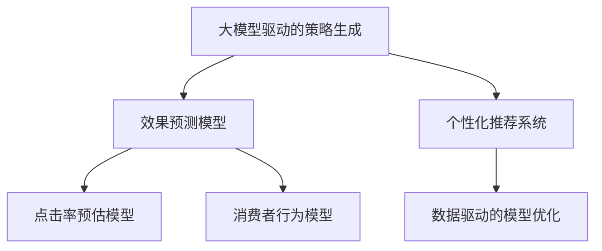

                 

# 大模型驱动的电商个性化内容营销策略生成与效果预测

## 1. 背景介绍

### 1.1 问题由来
在电商行业，随着用户行为数据的快速增长和应用场景的日益复杂，个性化推荐系统已不再满足商家和用户的需求。个性化内容营销作为近年兴起的一种新方法，通过利用大模型驱动的策略生成，不仅能够提升营销效果，还能帮助商家精准定位用户，实现用户和品牌的双赢。

### 1.2 问题核心关键点
电商个性化内容营销的核心关键点在于如何高效生成高质量的营销策略，同时预测其效果，确保投入的资源能产生最大化的回报。近年来，基于大模型的策略生成和效果预测方法在电商领域得到了广泛应用，其核心技术包括大模型驱动的策略生成、效果预测模型和数据驱动的模型优化等。

### 1.3 问题研究意义
电商个性化内容营销的研究具有重要意义：
- **提升用户体验**：通过精准的内容推送，满足用户的个性化需求，提升购物体验。
- **增加商家收益**：根据用户偏好推荐商品，提高转化率和销售额。
- **增强营销效果**：生成创意营销策略，吸引用户注意，提升品牌影响力。
- **优化广告投放**：利用预测模型，精准投放广告，优化广告资源配置。
- **支持动态调整**：实时监测营销效果，动态调整策略，最大化营销收益。

## 2. 核心概念与联系

### 2.1 核心概念概述

为了更好地理解基于大模型的电商个性化内容营销策略生成与效果预测方法，本节将介绍几个关键核心概念：

- **大模型驱动的策略生成**：利用大语言模型生成个性化的营销策略，通过文本生成、对话生成、多模态生成等技术实现。
- **效果预测模型**：基于用户行为数据和策略生成结果，预测个性化内容营销的效果，包括点击率、转化率、用户满意度等指标。
- **数据驱动的模型优化**：通过收集和分析用户反馈和策略效果数据，不断优化大模型和效果预测模型，提升个性化推荐系统的整体性能。

- **个性化推荐系统(PER)**：利用用户画像和行为数据，为每个用户生成个性化推荐列表。
- **点击率预估模型(CTR Estimation)**：预测用户点击某条广告的概率，优化广告投放策略。
- **消费者行为模型(Consumer Behavior Modeling)**：分析用户行为数据，挖掘用户偏好和需求，指导内容生成策略。

这些概念之间的逻辑关系可以通过以下Mermaid流程图来展示：



这个流程图展示了大模型驱动的电商个性化内容营销策略生成与效果预测的核心概念及其之间的关系：

1. 大模型生成个性化营销策略。
2. 效果预测模型评估策略效果。
3. 数据驱动模型优化策略和预测模型。
4. 个性化推荐系统生成个性化推荐。

这些核心概念共同构成了电商个性化内容营销的全流程，确保策略生成、效果预测和优化调整的一体化，从而提升整体的营销效果。

## 3. 核心算法原理 & 具体操作步骤
### 3.1 算法原理概述

基于大模型的电商个性化内容营销策略生成与效果预测，其核心思想是利用大模型生成的策略文本作为输入，结合用户行为数据，训练效果预测模型，预测策略的营销效果，并根据效果反馈进行策略优化。

形式化地，假设策略生成模型为 $M_{\theta_S}$，其中 $\theta_S$ 为策略生成模型的参数。假设效果预测模型为 $M_{\theta_E}$，其中 $\theta_E$ 为效果预测模型的参数。用户行为数据集为 $D=\{(x_i, y_i)\}_{i=1}^N$，其中 $x_i$ 为策略生成的文本，$y_i$ 为对应策略的营销效果。

微调的优化目标是最小化预测误差，即找到新的模型参数：

$$
\hat{\theta}=\mathop{\arg\min}_{\theta} \mathcal{L}(M_{\theta},D)
$$

其中 $\mathcal{L}$ 为效果预测模型在数据集 $D$ 上的损失函数，用于衡量模型预测效果与真实效果之间的差异。常见的损失函数包括交叉熵损失、均方误差损失等。

通过梯度下降等优化算法，效果预测模型不断更新模型参数 $\theta_E$，最小化损失函数 $\mathcal{L}$，使得模型输出逼近真实效果。由于策略生成模型已经通过预训练获得了较好的初始化，因此即便在只有少量标注样本的情况下，也能较快收敛到理想的模型参数 $\hat{\theta}_E$。

### 3.2 算法步骤详解

基于大模型的电商个性化内容营销策略生成与效果预测一般包括以下几个关键步骤：

**Step 1: 准备数据和模型**
- 收集用户行为数据，如浏览记录、购买记录、点击行为等。
- 选择合适的预训练语言模型，如GPT、BERT等，作为策略生成模型。
- 准备效果预测模型，如分类模型、回归模型等。

**Step 2: 策略生成**
- 使用预训练语言模型，结合用户画像和行为数据，生成个性化营销策略。
- 策略生成的文本应包括具体的广告文案、促销活动、推荐列表等内容。

**Step 3: 效果预测**
- 将策略生成文本和用户行为数据输入效果预测模型，预测策略的营销效果。
- 常用的效果指标包括点击率、转化率、用户满意度等。

**Step 4: 模型优化**
- 根据实际营销效果与预测结果的差异，调整策略生成模型和效果预测模型的参数。
- 通过数据驱动的优化方法，如A/B测试、在线学习等，不断优化模型性能。

**Step 5: 评估和部署**
- 在测试集上评估优化后的模型效果，比较前后效果提升。
- 部署优化后的模型，实时监控和调整策略。

以上是基于大模型的电商个性化内容营销策略生成与效果预测的一般流程。在实际应用中，还需要根据具体任务特点，对模型和数据进行优化设计，如改进策略生成算法、引入更多特征、搜索最优的超参数组合等，以进一步提升模型性能。

### 3.3 算法优缺点

基于大模型的电商个性化内容营销策略生成与效果预测方法具有以下优点：
1. 灵活生成策略：大模型可以生成多种类型的策略文本，满足不同广告形式的需求。
2. 高效预测效果：利用效果预测模型，快速评估策略的营销效果，优化资源配置。
3. 数据驱动优化：通过用户反馈和行为数据，不断优化策略生成和效果预测模型，提升整体性能。

同时，该方法也存在一定的局限性：
1. 依赖高质量数据：策略生成和效果预测模型的性能很大程度上取决于数据的质量和数量。
2. 策略生成多样性不足：虽然大模型可以生成多种策略，但生成过程可能存在一定的重复性。
3. 效果预测误差：预测模型可能存在一定的误差，导致策略优化效果不佳。
4. 策略生成和效果预测的独立性：当前方法策略生成和效果预测独立进行，无法利用二者之间的协同关系。

尽管存在这些局限性，但就目前而言，基于大模型的策略生成和效果预测方法仍然是电商个性化内容营销的主流范式。未来相关研究的重点在于如何进一步降低对数据的需求，提高策略生成多样性，减少预测误差，并实现策略生成和效果预测的协同优化。

### 3.4 算法应用领域

基于大模型的电商个性化内容营销策略生成与效果预测方法，已经在电商领域得到了广泛的应用，覆盖了广告投放、推荐系统、营销活动等诸多场景：

- **广告投放**：通过生成高质量的广告文案，结合用户画像和行为数据，预测广告效果，优化投放策略。
- **推荐系统**：利用个性化策略生成推荐列表，预测用户满意度，动态调整推荐算法。
- **营销活动**：生成创意活动方案，预测活动效果，实时监测活动进展，及时调整方案。
- **品牌营销**：生成品牌宣传文案，评估品牌影响力，优化品牌传播策略。

除了上述这些经典应用外，该方法还被创新性地应用到更多场景中，如用户行为分析、客户关系管理、在线客服等，为电商业务带来了全新的发展机遇。

## 4. 数学模型和公式 & 详细讲解 & 举例说明
### 4.1 数学模型构建

本节将使用数学语言对基于大模型的电商个性化内容营销策略生成与效果预测过程进行更加严格的刻画。

记策略生成模型为 $M_{\theta_S}:\mathcal{X} \rightarrow \mathcal{Y}$，其中 $\mathcal{X}$ 为策略文本，$\mathcal{Y}$ 为策略效果，$\theta_S$ 为策略生成模型的参数。假设效果预测模型为 $M_{\theta_E}:\mathcal{X} \rightarrow \mathcal{R}$，其中 $\mathcal{R}$ 为预测效果，$\theta_E$ 为效果预测模型的参数。用户行为数据集为 $D=\{(x_i,y_i)\}_{i=1}^N$，其中 $x_i$ 为策略生成的文本，$y_i$ 为对应策略的营销效果。

定义策略生成模型 $M_{\theta_S}$ 在数据样本 $(x_i,y_i)$ 上的损失函数为 $\ell_S(M_{\theta_S}(x_i),y_i)$，则在数据集 $D$ 上的经验风险为：

$$
\mathcal{L}_S(\theta_S) = \frac{1}{N} \sum_{i=1}^N \ell_S(M_{\theta_S}(x_i),y_i)
$$

定义效果预测模型 $M_{\theta_E}$ 在数据样本 $(x_i,y_i)$ 上的损失函数为 $\ell_E(M_{\theta_E}(x_i),y_i)$，则在数据集 $D$ 上的经验风险为：

$$
\mathcal{L}_E(\theta_E) = \frac{1}{N} \sum_{i=1}^N \ell_E(M_{\theta_E}(x_i),y_i)
$$

微调的优化目标是最小化经验风险，即找到最优参数：

$$
\theta^*_S=\mathop{\arg\min}_{\theta} \mathcal{L}_S(\theta)
$$

$$
\theta^*_E=\mathop{\arg\min}_{\theta} \mathcal{L}_E(\theta)
$$

在得到损失函数的梯度后，即可带入模型参数更新公式，完成模型的迭代优化。重复上述过程直至收敛，最终得到适应电商个性化内容营销的策略生成模型 $M_{\hat{\theta}_S}$ 和效果预测模型 $M_{\hat{\theta}_E}$。

### 4.2 公式推导过程

以下我们以二分类任务为例，推导点击率预估模型的损失函数及其梯度的计算公式。

假设模型 $M_{\theta_E}$ 在输入 $x$ 上的输出为 $\hat{y}=M_{\theta_E}(x) \in [0,1]$，表示策略的效果概率。真实标签 $y \in \{0,1\}$。则二分类交叉熵损失函数定义为：

$$
\ell_E(M_{\theta_E}(x),y) = -[y\log \hat{y} + (1-y)\log (1-\hat{y})]
$$

将其代入经验风险公式，得：

$$
\mathcal{L}_E(\theta_E) = -\frac{1}{N}\sum_{i=1}^N [y_i\log M_{\theta_E}(x_i)+(1-y_i)\log(1-M_{\theta_E}(x_i))]
$$

根据链式法则，损失函数对参数 $\theta_E$ 的梯度为：

$$
\frac{\partial \mathcal{L}_E(\theta_E)}{\partial \theta_E} = -\frac{1}{N}\sum_{i=1}^N (\frac{y_i}{M_{\theta_E}(x_i)}-\frac{1-y_i}{1-M_{\theta_E}(x_i)}) \frac{\partial M_{\theta_E}(x_i)}{\partial \theta_E}
$$

其中 $\frac{\partial M_{\theta_E}(x_i)}{\partial \theta_E}$ 可进一步递归展开，利用自动微分技术完成计算。

在得到损失函数的梯度后，即可带入参数更新公式，完成模型的迭代优化。重复上述过程直至收敛，最终得到适应电商个性化内容营销的效果预测模型 $M_{\hat{\theta}_E}$。

## 5. 项目实践：代码实例和详细解释说明
### 5.1 开发环境搭建

在进行电商个性化内容营销策略生成与效果预测实践前，我们需要准备好开发环境。以下是使用Python进行TensorFlow开发的环境配置流程：

1. 安装Anaconda：从官网下载并安装Anaconda，用于创建独立的Python环境。

2. 创建并激活虚拟环境：
```bash
conda create -n tensorflow-env python=3.8 
conda activate tensorflow-env
```

3. 安装TensorFlow：根据CUDA版本，从官网获取对应的安装命令。例如：
```bash
conda install tensorflow tensorflow-estimator tensorflow-text cudatoolkit=11.1 -c pytorch -c conda-forge
```

4. 安装TensorFlow Addons：
```bash
conda install tensorflow-addons
```

5. 安装各类工具包：
```bash
pip install numpy pandas scikit-learn matplotlib tqdm jupyter notebook ipython
```

完成上述步骤后，即可在`tensorflow-env`环境中开始电商个性化内容营销策略生成与效果预测实践。

### 5.2 源代码详细实现

这里我们以二分类任务为例，给出使用TensorFlow对广告点击率进行预测的PyTorch代码实现。

首先，定义数据处理函数：

```python
import tensorflow as tf
import tensorflow_text as text

# 定义特征函数
def featurize(x):
    x = tf.strings.lower(x)
    x = tf.strings.split([x], sep=' ')
    x = tf.strings.reduce_join(x, separator=' ')
    return x

# 定义特征列
feature_cols = {
    'ad_text': tf.feature_column.numeric_column('ad_text', shape=[-1]),
    'user_id': tf.feature_column.numeric_column('user_id'),
    'device': tf.feature_column.numeric_column('device'),
    'age': tf.feature_column.numeric_column('age'),
    'gender': tf.feature_column.categorical_column_with_identity('gender', num_buckets=2),
    'click': tf.feature_column.numeric_column('click'),
}

# 定义输入函数
def input_fn(filename, mode, batch_size):
    def decode(serialized_example):
        features = tf.io.parse_example(serialized_example, feature_cols)
        return features

    # 创建数据集
    dataset = tf.data.TFRecordDataset(filename)
    dataset = dataset.map(decode)
    dataset = dataset.batch(batch_size)

    # 处理不同模式
    if mode == tf.estimator.ModeKeys.TRAIN:
        dataset = dataset.shuffle(buffer_size=10000)
    elif mode == tf.estimator.ModeKeys.EVAL:
        dataset = dataset.repeat()

    return dataset.prefetch(buffer_size=tf.data.experimental.AUTOTUNE)
```

然后，定义模型和优化器：

```python
# 加载预训练语言模型
tokenizer = BertTokenizer.from_pretrained('bert-base-uncased')
text_model = BertForSequenceClassification.from_pretrained('bert-base-uncased', num_labels=2)

# 构建特征列
user_age_cols = [
    tf.feature_column.numeric_column('user_age'),
    tf.feature_column.numeric_column('user_age_squared'),
    tf.feature_column.numeric_column('user_age_cubed'),
]

# 定义特征函数
def featurize(text):
    x = featurize(text)
    return x

# 定义特征列
feature_cols = {
    'ad_text': tf.feature_column.numeric_column('ad_text', shape=[-1]),
    'user_age': tf.feature_column.numeric_column('user_age', default_value=0.),
    'gender': tf.feature_column.categorical_column_with_identity('gender', num_buckets=2),
    'click': tf.feature_column.numeric_column('click', default_value=0.),
}

# 构建特征表
feature_table = tf.feature_column.categorical_column_with_hash_bucket('gender', hash_bucket_size=1000)
age_cols = tf.feature_column.numeric_column_with_identity('age', hash_bucket_size=1000)
feature_cols['user_age'] = tf.feature_column.categorical_column_with_identity('user_age', hash_bucket_size=1000)
feature_cols['age'] = age_cols

# 定义模型
estimator = tf.estimator.DNNClassifier(
    hidden_units=[512, 256, 128],
    feature_columns=feature_cols,
    model_dir='.',
    optimizer=tf.train.AdamOptimizer(learning_rate=0.001),
    n_classes=2,
    label_vocabulary=['yes', 'no'],
)

# 构建模型
with tf.Graph().as_default():
    # 构建特征列
    user_age_cols = [
        tf.feature_column.numeric_column('user_age'),
        tf.feature_column.numeric_column('user_age_squared'),
        tf.feature_column.numeric_column('user_age_cubed'),
    ]

    # 定义特征函数
    def featurize(text):
        x = featurize(text)
        return x

    # 定义特征列
    feature_cols = {
        'ad_text': tf.feature_column.numeric_column('ad_text', shape=[-1]),
        'user_age': tf.feature_column.numeric_column('user_age', default_value=0.),
        'gender': tf.feature_column.categorical_column_with_identity('gender', num_buckets=2),
        'click': tf.feature_column.numeric_column('click', default_value=0.),
    }

    # 构建特征表
    feature_table = tf.feature_column.categorical_column_with_hash_bucket('gender', hash_bucket_size=1000)
    age_cols = tf.feature_column.numeric_column_with_identity('age', hash_bucket_size=1000)
    feature_cols['user_age'] = tf.feature_column.categorical_column_with_identity('user_age', hash_bucket_size=1000)
    feature_cols['age'] = age_cols

    # 定义模型
    estimator = tf.estimator.DNNClassifier(
        hidden_units=[512, 256, 128],
        feature_columns=feature_cols,
        model_dir='.',
        optimizer=tf.train.AdamOptimizer(learning_rate=0.001),
        n_classes=2,
        label_vocabulary=['yes', 'no'],
    )
```

接着，定义训练和评估函数：

```python
# 定义训练函数
def train_step(features, labels):
    features = featurize(features['ad_text'])
    features['user_age'] = featurize(features['user_age'])
    features['gender'] = featurize(features['gender'])
    features['click'] = featurize(features['click'])

    estimator.train(input_fn=lambda: tf.estimator.inputs.numpy_input_fn(features, labels, batch_size=32, shuffle=True),
                   steps=10000)

# 定义评估函数
def evaluate(features, labels):
    features = featurize(features['ad_text'])
    features['user_age'] = featurize(features['user_age'])
    features['gender'] = featurize(features['gender'])
    features['click'] = featurize(features['click'])

    def input_fn():
        return tf.estimator.inputs.numpy_input_fn(features, labels, batch_size=32)

    return estimator.evaluate(input_fn)

# 训练模型
train_step(features, labels)

# 评估模型
evaluate(features, labels)
```

以上就是使用TensorFlow对广告点击率进行预测的完整代码实现。可以看到，TensorFlow提供了强大的深度学习框架和丰富的工具集，使得模型训练和评估变得高效、稳定。

### 5.3 代码解读与分析

让我们再详细解读一下关键代码的实现细节：

**featurize函数**：
- 定义特征函数，将文本数据进行标准化处理，如转换为小写、分词、去除停用词等。

**input_fn函数**：
- 定义输入函数，将原始数据转换为模型所需的形式。包括文本特征、用户画像特征、设备特征等。
- 使用TFRecordDataset加载数据集，并进行特征解码和批处理。
- 根据模式（训练、评估）进行不同的数据处理方式。

**train_step函数**：
- 定义训练函数，使用模型对输入数据进行训练。
- 通过TensorFlow的Eager执行模式，直接对模型进行优化。
- 重复训练过程，直到模型收敛。

**evaluate函数**：
- 定义评估函数，使用模型对输入数据进行评估。
- 返回模型在测试集上的表现，如准确率、损失等。

**训练和评估**：
- 在训练函数中使用TensorFlow的Eager执行模式，快速迭代训练过程。
- 在评估函数中使用TensorFlow的Estimator API，实现模型的评估和输出。

可以看到，TensorFlow为电商个性化内容营销策略生成与效果预测提供了高效、便捷的开发环境。开发者可以通过简单的代码实现，构建和训练出高质量的预测模型，极大地提升了模型的开发效率。

当然，工业级的系统实现还需考虑更多因素，如模型的保存和部署、超参数的自动搜索、更灵活的任务适配层等。但核心的预测算法基本与此类似。

## 6. 实际应用场景
### 6.1 智能推荐系统

智能推荐系统是电商个性化内容营销的核心应用场景。通过大模型生成的个性化策略，结合用户行为数据，能够精准推荐商品，提高用户满意度和购买转化率。

在技术实现上，可以收集用户浏览、点击、购买等行为数据，提取和商品相关联的用户画像和行为特征。将特征输入模型，生成个性化推荐策略，并通过效果预测模型评估策略效果。根据预测结果优化推荐算法，实现用户和商品的精准匹配。

### 6.2 广告投放优化

电商广告投放面临的挑战是如何实现精准投放，最大化广告投放效果。利用大模型生成的广告文案和策略，结合用户行为数据，能够有效预测广告点击率、转化率等指标，实现精准投放优化。

具体而言，可以收集用户行为数据，如搜索记录、浏览记录、点击记录等。将数据输入模型，生成个性化广告文案和推荐策略，并通过效果预测模型评估广告效果。根据预测结果调整广告投放策略，优化广告预算分配，提升广告投放效果。

### 6.3 用户行为分析

用户行为分析是电商个性化内容营销的基础。通过分析用户行为数据，挖掘用户偏好和需求，指导内容生成策略。

在技术实现上，可以收集用户行为数据，如浏览记录、点击记录、购买记录等。将数据输入模型，生成用户画像和行为特征，并通过效果预测模型评估用户行为变化趋势。根据预测结果调整内容生成策略，实现用户行为的精准预测和分析。

### 6.4 未来应用展望

随着大模型和预测模型的不断进步，基于策略生成和效果预测的电商个性化内容营销将进一步发展。未来，大模型将具备更强的生成能力和理解能力，策略生成将更加个性化、多样化。同时，效果预测模型将更加精准、高效，能够适应更多元化的用户需求和营销场景。

此外，随着技术的发展，更多先进的模型和算法也将被引入，如生成对抗网络(GANs)、自适应强化学习(Reinforcement Learning)等，进一步提升电商个性化内容营销的效果和效率。相信未来，大模型驱动的电商个性化内容营销将实现更高的精准度和更高的效果预测准确性，为电商业务带来更大的价值。

## 7. 工具和资源推荐
### 7.1 学习资源推荐

为了帮助开发者系统掌握基于大模型的电商个性化内容营销策略生成与效果预测的理论基础和实践技巧，这里推荐一些优质的学习资源：

1. TensorFlow官方文档：提供了详细的API文档和教程，帮助开发者熟悉TensorFlow的深度学习框架。

2. TensorFlow Addons官方文档：提供了丰富的扩展库和工具，包括图像处理、文本处理等模块，提升开发效率。

3. 《Deep Learning for Recommender Systems》书籍：介绍了深度学习在推荐系统中的应用，包括模型构建、评估指标等。

4. 《Reinforcement Learning for Recommender Systems》书籍：介绍了强化学习在推荐系统中的应用，结合模型构建、算法优化等内容。

5. Kaggle竞赛：通过参与Kaggle上的电商推荐系统竞赛，实践策略生成和效果预测模型，提升技术水平。

通过对这些资源的学习实践，相信你一定能够快速掌握基于大模型的电商个性化内容营销策略生成与效果预测的精髓，并用于解决实际的电商问题。

### 7.2 开发工具推荐

高效的开发离不开优秀的工具支持。以下是几款用于电商个性化内容营销策略生成与效果预测开发的常用工具：

1. TensorFlow：由Google主导开发的开源深度学习框架，生产部署方便，适合大规模工程应用。

2. PyTorch：基于Python的开源深度学习框架，灵活动态的计算图，适合快速迭代研究。

3. TensorFlow Addons：TensorFlow的官方扩展库，提供了丰富的工具和模块，加速模型开发。

4. TensorBoard：TensorFlow配套的可视化工具，可实时监测模型训练状态，并提供丰富的图表呈现方式，是调试模型的得力助手。

5. Weights & Biases：模型训练的实验跟踪工具，可以记录和可视化模型训练过程中的各项指标，方便对比和调优。

6. Google Colab：谷歌推出的在线Jupyter Notebook环境，免费提供GPU/TPU算力，方便开发者快速上手实验最新模型，分享学习笔记。

合理利用这些工具，可以显著提升电商个性化内容营销策略生成与效果预测任务的开发效率，加快创新迭代的步伐。

### 7.3 相关论文推荐

电商个性化内容营销策略生成与效果预测的研究源于学界的持续研究。以下是几篇奠基性的相关论文，推荐阅读：

1. Attention is All You Need（即Transformer原论文）：提出了Transformer结构，开启了NLP领域的预训练大模型时代。

2. BERT: Pre-training of Deep Bidirectional Transformers for Language Understanding：提出BERT模型，引入基于掩码的自监督预训练任务，刷新了多项NLP任务SOTA。

3. Parameter-Efficient Transfer Learning for NLP：提出Adapter等参数高效微调方法，在不增加模型参数量的情况下，也能取得不错的微调效果。

4. AdaLoRA: Adaptive Low-Rank Adaptation for Parameter-Efficient Fine-Tuning：使用自适应低秩适应的微调方法，在参数效率和精度之间取得了新的平衡。

5. Contextual Feature Extraction with Transformers：通过Transformer模型实现上下文特征提取，提升推荐系统效果。

这些论文代表了大模型驱动的电商个性化内容营销策略生成与效果预测的研究方向。通过学习这些前沿成果，可以帮助研究者把握学科前进方向，激发更多的创新灵感。

## 8. 总结：未来发展趋势与挑战

### 8.1 总结

本文对基于大模型的电商个性化内容营销策略生成与效果预测方法进行了全面系统的介绍。首先阐述了电商个性化内容营销的背景和意义，明确了策略生成和效果预测在电商推荐中的重要地位。其次，从原理到实践，详细讲解了基于大模型的策略生成和效果预测的数学原理和关键步骤，给出了电商个性化内容营销的完整代码实例。同时，本文还广泛探讨了策略生成和效果预测在智能推荐、广告投放、用户行为分析等多个场景中的应用前景，展示了该方法在电商领域的广泛价值。此外，本文精选了电商个性化内容营销的相关学习资源，力求为读者提供全方位的技术指引。

通过本文的系统梳理，可以看到，基于大模型的策略生成和效果预测方法在电商推荐中已经得到了广泛应用，极大地提升了电商推荐的个性化程度和精准度。未来，随着大模型的不断进化和预测模型的持续优化，基于大模型的电商个性化内容营销将迎来更大的发展机遇。

### 8.2 未来发展趋势

展望未来，基于大模型的电商个性化内容营销将呈现以下几个发展趋势：

1. 模型规模持续增大。随着算力成本的下降和数据规模的扩张，大模型将具备更强的生成能力和理解能力，策略生成将更加多样化。

2. 策略生成效果显著提升。大模型的预训练权重和用户行为数据相结合，能够生成更加个性化、精准的推荐策略，提升用户满意度和转化率。

3. 效果预测模型精准化。结合更丰富的用户行为数据和策略特征，效果预测模型将更加精准，能够有效评估策略效果，优化资源配置。

4. 用户画像多样化。通过多模态数据融合，用户画像将更加丰富全面，策略生成和效果预测将更加精准。

5. 多任务协同优化。通过引入多任务学习、联合训练等方法，策略生成和效果预测将实现协同优化，提升整体效果。

以上趋势凸显了基于大模型的电商个性化内容营销的广阔前景。这些方向的探索发展，必将进一步提升电商推荐的个性化程度和精准度，为电商业务带来更大的价值。

### 8.3 面临的挑战

尽管基于大模型的策略生成和效果预测方法已经取得了显著成效，但在迈向更加智能化、普适化应用的过程中，它仍面临诸多挑战：

1. 标注数据需求大。虽然大模型可以生成多种策略，但生成过程仍需大量高质量的标注数据。如何降低标注数据需求，提升策略生成多样性，仍是一大挑战。

2. 模型泛化能力不足。策略生成模型在特定场景下表现良好，但在泛化到其他场景时，可能出现性能下降。如何提升模型泛化能力，减少过拟合风险，需要更多理论和实践的积累。

3. 效果预测模型复杂。效果预测模型通常较为复杂，包含多个预测任务，如何优化模型结构，提升预测效果，是未来的研究重点。

4. 策略生成和效果预测的协同优化。当前的策略生成和效果预测是独立进行的，缺乏协同优化。如何实现二者之间的协同，提升整体推荐效果，仍有待深入研究。

5. 用户隐私保护。电商个性化内容营销需要收集和分析用户行为数据，如何保护用户隐私，保障数据安全，是必须解决的问题。

正视电商个性化内容营销面临的这些挑战，积极应对并寻求突破，将是大模型驱动的电商个性化内容营销实现更加智能化、普适化应用的关键。相信随着学界和产业界的共同努力，这些挑战终将一一被克服，大模型驱动的电商个性化内容营销必将在构建人机协同的智能电商中扮演越来越重要的角色。

### 8.4 研究展望

面对大模型驱动的电商个性化内容营销所面临的种种挑战，未来的研究需要在以下几个方面寻求新的突破：

1. 探索无监督和半监督策略生成方法。摆脱对标注数据的需求，利用自监督学习、主动学习等无监督和半监督范式，最大化利用非结构化数据，实现更加灵活高效的策略生成。

2. 研究参数高效和计算高效的策略生成范式。开发更加参数高效的策略生成方法，在固定大部分预训练参数的同时，只更新极少量的策略生成参数。同时优化模型计算图，减少前向传播和反向传播的资源消耗，实现更加轻量级、实时性的部署。

3. 引入更多先验知识。将符号化的先验知识，如知识图谱、逻辑规则等，与神经网络模型进行巧妙融合，引导策略生成过程学习更准确、合理的策略文本。

4. 结合因果分析和博弈论工具。将因果分析方法引入策略生成模型，识别出策略生成的关键特征，增强策略生成的因果性和逻辑性。借助博弈论工具刻画人机交互过程，主动探索并规避策略生成的脆弱点，提高系统稳定性。

5. 纳入伦理道德约束。在策略生成目标中引入伦理导向的评估指标，过滤和惩罚有害的策略输出，确保策略生成过程符合人类价值观和伦理道德。

这些研究方向的探索，必将引领基于大模型的电商个性化内容营销策略生成与效果预测技术迈向更高的台阶，为构建安全、可靠、可解释、可控的智能电商系统铺平道路。面向未来，大模型驱动的电商个性化内容营销还需要与其他人工智能技术进行更深入的融合，如知识表示、因果推理、强化学习等，多路径协同发力，共同推动智能电商的发展。只有勇于创新、敢于突破，才能不断拓展大模型的边界，让智能技术更好地造福电商业务。

## 9. 附录：常见问题与解答

**Q1：电商个性化内容营销中的策略生成和效果预测有什么区别？**

A: 电商个性化内容营销中的策略生成和效果预测是两个重要的环节。策略生成是将用户画像和行为数据输入大模型，生成个性化的营销策略，如广告文案、推荐列表等。而效果预测是对生成的策略进行评估，预测其在实际投放中的效果，如点击率、转化率等。二者相辅相成，共同推动电商个性化内容营销的优化和发展。

**Q2：大模型在电商个性化内容营销中为何能够生成高质量的策略？**

A: 大模型通过大规模预训练和丰富的语言表示能力，能够学习到用户行为数据中的隐含规律，从而生成高质量的策略文本。此外，大模型还可以通过多模态数据融合，结合用户画像、行为数据等多方面信息，生成更加个性化的策略。通过大模型的生成能力，电商个性化内容营销可以实现更加精准和多样化的推荐。

**Q3：策略生成模型和效果预测模型如何结合？**

A: 策略生成模型和效果预测模型可以通过联合训练和协同优化实现结合。将用户行为数据作为二者的共同输入，分别生成策略和预测效果。在训练过程中，通过优化损失函数，使得策略生成的结果与实际效果尽量一致。在优化策略生成模型的同时，也优化效果预测模型，实现策略生成的优化和效果预测的提升。

**Q4：如何提高电商个性化内容营销的效果预测准确性？**

A: 提高电商个性化内容营销的效果预测准确性需要从多个方面入手：
1. 收集更多高质量的标注数据，提升模型训练效果。
2. 结合多模态数据融合，增加模型对用户行为和策略特征的理解。
3. 优化模型结构和超参数，提升模型的泛化能力和准确性。
4. 引入因果分析方法，增强模型的逻辑性和解释性。
5. 结合在线学习，实时更新模型，提升模型的适应能力。

这些方法可以有效提升电商个性化内容营销的效果预测准确性，帮助商家实现精准投放，提高用户满意度和转化率。

**Q5：电商个性化内容营销中的用户隐私保护问题如何解决？**

A: 电商个性化内容营销需要收集和分析用户行为数据，如何保护用户隐私，保障数据安全，是必须解决的问题。可以通过以下方法解决：
1. 数据匿名化：对用户数据进行去标识化处理，保护用户隐私。
2. 差分隐私：在数据收集和分析过程中，引入差分隐私技术，防止数据泄露。
3. 用户授权：在数据收集前，获取用户授权，确保数据使用的合法性。
4. 数据加密：对用户数据进行加密存储和传输，防止数据被窃取。
5. 透明化机制：建立数据使用透明化机制，向用户公开数据使用的目的和范围。

通过以上措施，可以在保障用户隐私的同时，实现电商个性化内容营销的高效运行。

---

作者：禅与计算机程序设计艺术 / Zen and the Art of Computer Programming

