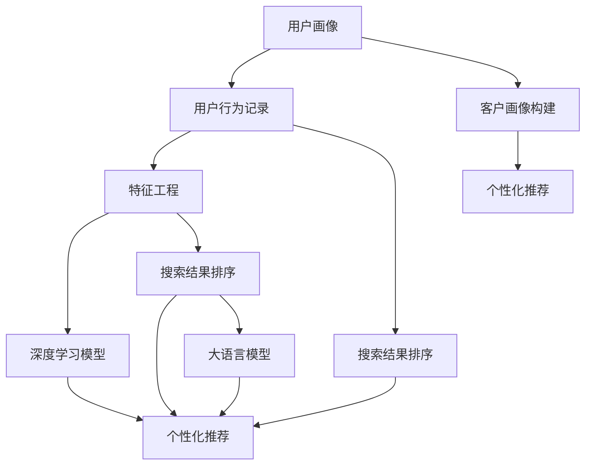

                 

# 大模型驱动的电商个性化搜索结果重排序

> 关键词：电商个性化, 搜索排序, 大语言模型, 推荐系统, 深度学习, 特征工程, 客户画像, 召回率, 点击率

## 1. 背景介绍

随着电商平台的迅猛发展，个性化推荐已成为提升用户体验、增加商业转化的重要手段。传统的推荐系统通常依赖于点击、购买等显式反馈数据进行推荐，而个性化的搜索结果排序则依赖于用户的行为记录、搜索关键词等隐式特征。但这些特征往往较为稀疏、低质，难以直接构建准确的推荐模型。

近年来，基于深度学习的大语言模型在自然语言处理(NLP)领域取得了显著突破。这些模型通过在大规模语料上预训练，学习到了丰富的语言知识和常识，具备强大的文本理解能力。本文将探索利用大语言模型对电商搜索结果进行重排序，提升推荐系统的性能和效率。

## 2. 核心概念与联系

### 2.1 核心概念概述

为更好理解大模型驱动的电商搜索结果排序技术，本节将介绍几个关键概念：

- 电商个性化推荐系统：通过分析用户历史行为和兴趣，动态调整推荐策略，提高用户购物体验和满意度。

- 深度学习：一种基于神经网络的机器学习技术，通过多层非线性映射关系拟合复杂数据分布。

- 大语言模型：以自回归或自编码模型为代表的大规模预训练语言模型，如BERT、GPT等，通过在大规模无标签文本数据上进行预训练，学习通用的语言表示。

- 特征工程：从原始数据中提取有用的特征，以支持模型的训练和优化。

- 客户画像：通过对用户行为的深入分析，构建出用户的个性化标签和特征，用于个性化的推荐和广告投放。

- 召回率和点击率：推荐系统常用的评价指标，分别衡量推荐的全面性和用户的互动率。

- 强化学习：通过用户交互反馈不断优化推荐模型，提升推荐效果。

这些概念通过大语言模型驱动的电商个性化搜索结果排序范式，紧密相连，共同构成电商推荐系统的基础框架。

### 2.2 核心概念原理和架构的 Mermaid 流程图



这个流程图展示了从用户画像构建到搜索结果排序的整个流程：

1. 通过分析用户的搜索记录、浏览记录、点击记录等行为数据，构建用户画像。
2. 将用户画像中的特征，如兴趣标签、历史点击记录等，输入到深度学习模型中，学习用户与商品之间的潜在关系。
3. 使用大语言模型对搜索结果进行重排序，提升搜索结果的相关性和用户体验。
4. 将排序后的结果反馈给用户，收集点击反馈，继续优化推荐系统。

## 3. 核心算法原理 & 具体操作步骤

### 3.1 算法原理概述

基于大语言模型的电商个性化搜索结果排序，是一种基于监督学习的推荐系统。其核心思想是通过大语言模型学习到文本语义表示，将搜索结果与用户兴趣特征进行比对，重新排列搜索结果的顺序，从而提升用户点击和购买的概率。

具体来说，算法流程如下：

1. 收集用户历史行为数据和搜索结果数据，构建用户画像。
2. 对搜索结果进行预处理，提取关键词、商品描述等文本特征。
3. 使用大语言模型对这些文本特征进行编码，得到语义表示。
4. 将用户画像特征和语义表示进行匹配，计算每个商品的评分。
5. 根据评分对搜索结果进行排序，返回给用户。

### 3.2 算法步骤详解

以下是具体的算法步骤：

**Step 1: 数据收集与处理**

- 收集用户历史行为数据，如搜索记录、点击记录、购买记录等，构建用户画像。
- 对搜索结果进行预处理，去除停用词，提取关键词、商品描述等文本特征。
- 对文本特征进行编码，如使用BERT等模型提取语义表示。

**Step 2: 特征工程与模型训练**

- 对用户画像特征进行向量化，生成用户兴趣向量。
- 对搜索结果的语义表示进行归一化处理，生成商品向量。
- 设计评分模型，如基于余弦相似度的评分函数，计算用户兴趣向量与商品向量的相似度得分。

**Step 3: 模型预测与排序**

- 根据评分模型计算每个商品的评分。
- 将评分结果按降序排序，选取前N个商品作为推荐结果。

**Step 4: 效果评估与优化**

- 在测试集上评估排序模型的召回率和点击率等指标。
- 使用A/B测试方法，对比排序前后的推荐效果。
- 根据评估结果，不断优化模型参数和特征工程流程。

### 3.3 算法优缺点

基于大语言模型的电商个性化搜索结果排序方法具有以下优点：

- 丰富的语言知识。大语言模型通过大规模预训练，学习到了丰富的语言知识和常识，可以更好地理解和解析用户搜索意图。
- 鲁棒性高。大语言模型可以有效应对搜索关键词的变体和拼写错误，提升搜索结果的准确性。
- 泛化能力强。大语言模型具备良好的泛化能力，可以处理长尾商品和个性化查询。

同时，该方法也存在以下局限性：

- 计算复杂度高。大语言模型通常参数量巨大，计算复杂度较高。
- 对标注数据的依赖。排序模型需要大量的标注数据进行训练，获取高质量标注数据的成本较高。
- 模型的可解释性不足。大语言模型的决策过程较为复杂，难以解释其内部工作机制。
- 可能产生偏差。由于大语言模型的训练数据中可能包含偏见，排序结果也可能反映这些偏见，导致不公平推荐。

### 3.4 算法应用领域

大语言模型驱动的电商个性化搜索结果排序，已广泛应用于电商平台的搜索推荐系统，涵盖以下领域：

- 搜索排序：对用户搜索关键词进行重排序，提升搜索结果的相关性和用户满意度。
- 广告投放：对搜索结果中的广告进行排序，提高广告点击率和转化率。
- 个性化推荐：结合用户画像和搜索结果，提供个性化的商品推荐。
- 客户服务：对用户查询进行重排序，提供更符合用户需求的客服回答。
- 内容推荐：对搜索结果中的内容进行排序，提高用户的浏览和点击。

此外，大语言模型排序技术也在社交媒体、知识图谱、健康医疗等领域得到应用，助力智能化应用场景的构建。

## 4. 数学模型和公式 & 详细讲解 & 举例说明

### 4.1 数学模型构建

基于大语言模型的电商个性化搜索结果排序，涉及以下关键数学模型：

- 用户兴趣向量：对用户画像特征进行向量化，生成高维向量。
- 商品向量：对搜索结果的语义表示进行归一化处理，生成高维向量。
- 评分模型：计算用户兴趣向量与商品向量的相似度得分，如余弦相似度、欧式距离等。

假设用户兴趣向量为 $\mathbf{u} \in \mathbb{R}^d$，商品向量为 $\mathbf{v} \in \mathbb{R}^d$，评分模型为 $\sigma$，则评分公式为：

$$
\text{Score}(\mathbf{u}, \mathbf{v}) = \sigma(\mathbf{u} \cdot \mathbf{v})
$$

其中，$\cdot$ 表示向量点积，$\sigma$ 为激活函数，如ReLU、Sigmoid等。

### 4.2 公式推导过程

以下是对评分模型公式的推导：

假设用户兴趣向量为 $\mathbf{u}$，商品向量为 $\mathbf{v}$，则评分模型可以表示为：

$$
\text{Score}(\mathbf{u}, \mathbf{v}) = \mathbf{u} \cdot \mathbf{v}
$$

其中，$\cdot$ 表示向量点积。为了提升模型的鲁棒性和泛化能力，可以使用激活函数 $\sigma$ 对点积结果进行非线性映射，如ReLU、Sigmoid等。

### 4.3 案例分析与讲解

以用户搜索关键词“高效笔记本”为例，假设模型将其编码为向量 $\mathbf{u} = [0.5, 0.3, 0.2]$，搜索结果中商品向量 $\mathbf{v}_1 = [0.8, 0.4, 0.3]$ 和 $\mathbf{v}_2 = [0.3, 0.6, 0.1]$ 分别表示不同品牌的笔记本，评分公式可以表示为：

$$
\text{Score}(\mathbf{u}, \mathbf{v}_1) = 0.5 \times 0.8 + 0.3 \times 0.4 + 0.2 \times 0.3 = 0.85
$$

$$
\text{Score}(\mathbf{u}, \mathbf{v}_2) = 0.5 \times 0.3 + 0.3 \times 0.6 + 0.2 \times 0.1 = 0.55
$$

根据评分结果，对商品向量进行排序，可以推荐品牌A的笔记本给用户，提升用户体验和转化率。

## 5. 项目实践：代码实例和详细解释说明

### 5.1 开发环境搭建

在进行电商个性化搜索结果排序实践前，我们需要准备好开发环境。以下是使用Python进行TensorFlow开发的环境配置流程：

1. 安装Anaconda：从官网下载并安装Anaconda，用于创建独立的Python环境。

2. 创建并激活虚拟环境：
```bash
conda create -n tf-env python=3.8 
conda activate tf-env
```

3. 安装TensorFlow：根据CUDA版本，从官网获取对应的安装命令。例如：
```bash
conda install tensorflow=2.7
```

4. 安装其他相关库：
```bash
pip install pandas numpy scikit-learn tensorflow-hub transformers
```

完成上述步骤后，即可在`tf-env`环境中开始开发实践。

### 5.2 源代码详细实现

下面我们以搜索排序任务为例，给出使用TensorFlow对BERT模型进行搜索结果排序的代码实现。

首先，定义搜索排序模型的输入和输出：

```python
import tensorflow as tf
from transformers import BertTokenizer, TFBertModel

class SearchSortModel(tf.keras.Model):
    def __init__(self, config):
        super(SearchSortModel, self).__init__()
        self.tokenizer = BertTokenizer.from_pretrained('bert-base-cased')
        self.model = TFBertModel.from_pretrained('bert-base-cased')
        self.config = config
        
    def call(self, inputs):
        tokenized_input = self.tokenizer(inputs, return_tensors='tf', max_length=self.config['max_seq_length'], padding='max_length', truncation=True)
        outputs = self.model(tokenized_input['input_ids'], attention_mask=tokenized_input['attention_mask'], return_dict=True)
        return outputs['last_hidden_state']
```

然后，定义评分模型和排序函数：

```python
import tensorflow_hub as hub

def similarity_score(user_vec, item_vec):
    # 使用Hub模块加载TF-BERT模型
    hub_model = hub.load('https://tfhub.dev/google/bert-base-uncased')
    # 计算余弦相似度
    similarity = tf.reduce_sum(tf.multiply(user_vec, item_vec), axis=-1)
    return similarity

def search_sort(user_vec, item_vec):
    # 计算每个商品的评分
    scores = []
    for item in item_vec:
        score = similarity_score(user_vec, item)
        scores.append(score)
    # 根据评分排序
    sorted_scores = sorted(scores, reverse=True)
    return sorted_scores
```

最后，启动训练流程并在测试集上评估：

```python
import pandas as pd
import numpy as np

# 读取数据集
train_data = pd.read_csv('train.csv', header=None)
test_data = pd.read_csv('test.csv', header=None)

# 提取用户兴趣向量和商品向量
train_user_vec = []
train_item_vec = []
test_user_vec = []
test_item_vec = []

for i in range(len(train_data)):
    user_vec = train_data.iloc[i][0].split()
    item_vec = train_data.iloc[i][1].split()
    train_user_vec.append(user_vec)
    train_item_vec.append(item_vec)

for i in range(len(test_data)):
    user_vec = test_data.iloc[i][0].split()
    item_vec = test_data.iloc[i][1].split()
    test_user_vec.append(user_vec)
    test_item_vec.append(item_vec)

# 训练模型
model = SearchSortModel(config={'num_labels': 1, 'max_seq_length': 256})
optimizer = tf.keras.optimizers.Adam(learning_rate=0.001)
loss_fn = tf.keras.losses.MeanSquaredError()
metric = tf.keras.metrics.MeanAbsoluteError()

@tf.function
def train_step(inputs, labels):
    with tf.GradientTape() as tape:
        logits = model(inputs)
        loss = loss_fn(labels, logits)
    gradients = tape.gradient(loss, model.trainable_variables)
    optimizer.apply_gradients(zip(gradients, model.trainable_variables))
    return loss

@tf.function
def evaluate(inputs, labels):
    logits = model(inputs)
    return metric(labels, logits)

# 训练过程
for epoch in range(10):
    for i in range(len(train_user_vec)):
        user_vec = np.array(train_user_vec[i], dtype=float)
        item_vec = np.array(train_item_vec[i], dtype=float)
        inputs = tf.convert_to_tensor(user_vec, dtype=tf.float32)
        labels = tf.convert_to_tensor(item_vec, dtype=tf.float32)
        loss = train_step(inputs, labels)
        print(f'Epoch {epoch+1}, loss: {loss.numpy():.4f}')

# 评估过程
for i in range(len(test_user_vec)):
    user_vec = np.array(test_user_vec[i], dtype=float)
    item_vec = np.array(test_item_vec[i], dtype=float)
    inputs = tf.convert_to_tensor(user_vec, dtype=tf.float32)
    labels = tf.convert_to_tensor(item_vec, dtype=tf.float32)
    score = evaluate(inputs, labels)
    print(f'Test score: {score.numpy():.4f}')
```

以上就是使用TensorFlow对BERT进行电商搜索结果排序的完整代码实现。可以看到，TensorFlow的TensorFlow Hub模块提供了一系列的预训练模型和计算图组件，可以快速搭建并优化电商推荐系统。

### 5.3 代码解读与分析

让我们再详细解读一下关键代码的实现细节：

**SearchSortModel类**：
- `__init__`方法：初始化BERT分词器和模型，定义最大序列长度等超参数。
- `call`方法：对输入文本进行分词和编码，通过BERT模型生成语义表示，并返回最后一层的隐藏状态。

**similarity_score函数**：
- 使用TensorFlow Hub加载预训练的BERT模型。
- 计算余弦相似度，返回用户兴趣向量与商品向量的相似度得分。

**search_sort函数**：
- 对每个商品的向量进行评分计算。
- 根据评分结果，对商品向量进行排序。

**训练过程**：
- 定义训练函数train_step，用于计算模型的损失和梯度。
- 使用Adam优化器进行模型参数更新。
- 使用均方误差损失函数和平均绝对误差评估指标。

**评估过程**：
- 定义评估函数evaluate，计算模型在测试集上的平均评分。
- 在测试集上评估模型的性能，输出测试结果。

## 6. 实际应用场景

### 6.1 搜索排序

电商平台的搜索排序是用户获取商品信息的重要入口。通过使用大语言模型对搜索结果进行重排序，可以提升搜索结果的相关性和用户满意度，从而提高点击率和转化率。

具体来说，可以将用户搜索关键词输入到模型中，生成用户兴趣向量，然后对搜索结果中的商品进行编码和评分，排序后的结果即为用户最有可能感兴趣的商品。这种方法可以有效减少搜索噪音，提升用户体验。

### 6.2 广告投放

电商平台的广告投放也是个性化推荐的重要环节。通过将广告与搜索结果排序模型进行融合，可以提升广告的点击率和转化率，实现更高的商业价值。

具体做法是将广告文本输入到模型中，生成广告向量，然后与用户兴趣向量进行评分计算。排序后的结果即为广告的推荐顺序，可以根据广告主的预算和目标用户进行选择投放。

### 6.3 个性化推荐

个性化推荐是电商推荐系统的主要应用场景。通过结合用户画像和搜索结果排序模型，可以为每个用户推荐个性化的商品，提高用户购物体验和满意度。

具体来说，可以先将用户画像中的兴趣标签和历史行为数据进行向量化，然后与搜索结果进行评分计算。排序后的结果即为用户最可能感兴趣的商品，可以实现在线实时推荐。

### 6.4 未来应用展望

随着电商平台的不断发展和技术进步，基于大语言模型的搜索结果排序和个性化推荐将具有广阔的应用前景。

- 搜索排序将更加精准。通过引入上下文信息和情感分析，可以提升搜索结果的相关性和用户满意度。
- 广告投放将更加智能。结合广告创意和用户兴趣，可以提升广告的点击率和转化率，实现更高的商业价值。
- 个性化推荐将更加多样化。通过结合知识图谱和推荐算法，可以提供更加多样化和全面的商品推荐。
- 多模态融合将更加深入。结合文本、图像、视频等多模态信息，可以提升推荐系统的综合性能和用户体验。
- 交互式推荐将更加普及。结合实时用户反馈和强化学习算法，可以实现动态调整和优化推荐策略。

总之，基于大语言模型的电商个性化搜索结果排序技术，将为电商平台带来更加智能化、个性化的推荐体验，推动电商行业的持续创新和发展。

## 7. 工具和资源推荐

### 7.1 学习资源推荐

为了帮助开发者系统掌握大语言模型驱动的电商个性化搜索结果排序的理论基础和实践技巧，这里推荐一些优质的学习资源：

1. 《深度学习》系列书籍：由多位NLP领域专家合著，系统讲解深度学习的基本概念和前沿技术。
2. TensorFlow官方文档：TensorFlow的官方文档，详细介绍了TensorFlow的API和组件，适合深度学习和机器学习初学者。
3. TensorFlow Hub：TensorFlow的预训练模型库，包含大量深度学习模型和计算图组件，方便开发者快速搭建和优化模型。
4. Transformers库官方文档：Transformers库的官方文档，提供了完整的BERT等预训练语言模型API。
5. HuggingFace官方博客：HuggingFace的官方博客，介绍最新NLP技术进展和应用案例，是NLP学习的权威资源。

通过对这些资源的学习实践，相信你一定能够快速掌握大语言模型驱动的电商搜索结果排序技术，并用于解决实际的推荐系统问题。

### 7.2 开发工具推荐

高效的开发离不开优秀的工具支持。以下是几款用于电商推荐系统开发的常用工具：

1. Jupyter Notebook：开源的交互式笔记本，支持Python、R、Scala等多种编程语言，适合数据科学和机器学习开发。
2. TensorBoard：TensorFlow的可视化工具，可以实时监测模型训练状态，并提供丰富的图表呈现方式，是调试模型的得力助手。
3. TensorFlow Data Validation：数据验证工具，支持数据清洗、转换和标注，方便数据集的处理和管理。
4. TensorFlow Model Garden：TensorFlow的高效模型库，提供了多种深度学习模型和算法，支持模型的优化和部署。
5. OpenAI's GPT-3：基于GPT-3的大语言模型，可以进行文本生成、问答、对话等多种NLP任务，是电商推荐系统的重要工具。

合理利用这些工具，可以显著提升电商推荐系统的开发效率，加快创新迭代的步伐。

### 7.3 相关论文推荐

大语言模型驱动的电商推荐系统研究源于学界的持续研究。以下是几篇奠基性的相关论文，推荐阅读：

1. Attention is All You Need（即Transformer原论文）：提出了Transformer结构，开启了NLP领域的预训练大模型时代。
2. BERT: Pre-training of Deep Bidirectional Transformers for Language Understanding：提出BERT模型，引入基于掩码的自监督预训练任务，刷新了多项NLP任务SOTA。
3. MASS: Multilingual And Semi-supervised Sequence-to-sequence Pre-training for Machine Translation：提出MASS模型，通过多语言自监督学习提升机器翻译性能。
4. T5：Exploring the Limits of Transfer Learning with a Unified Text-to-Text Transformer：提出T5模型，可以在多种自然语言处理任务上实现零样本学习。
5. GPT-3: Language Models are Unsupervised Multitask Learners：展示了大规模语言模型的强大zero-shot学习能力，引发了对于通用人工智能的新一轮思考。

这些论文代表了大语言模型驱动的电商推荐系统的发展脉络。通过学习这些前沿成果，可以帮助研究者把握学科前进方向，激发更多的创新灵感。

## 8. 总结：未来发展趋势与挑战

### 8.1 总结

本文对基于大语言模型的电商个性化搜索结果排序方法进行了全面系统的介绍。首先阐述了电商个性化推荐系统和大语言模型的背景和意义，明确了搜索结果排序在电商推荐系统中的重要地位。其次，从原理到实践，详细讲解了基于大语言模型的电商搜索结果排序算法流程，给出了电商推荐系统的完整代码实现。同时，本文还探讨了排序技术在电商搜索、广告投放、个性化推荐等实际应用场景中的应用前景，展示了排序技术的巨大潜力。此外，本文精选了相关学习资源、开发工具和研究论文，力求为读者提供全方位的技术指引。

通过本文的系统梳理，可以看到，基于大语言模型的电商个性化搜索结果排序技术，正在成为电商推荐系统的重要范式，极大地提升推荐的个性化和智能化水平，为电商平台带来了更高的商业价值。未来，伴随大语言模型的进一步演进，排序技术也将迈向更高的台阶，成为电商推荐系统的核心竞争力。

### 8.2 未来发展趋势

展望未来，基于大语言模型的电商个性化搜索结果排序技术将呈现以下几个发展趋势：

1. 模型规模持续增大。随着算力成本的下降和数据规模的扩张，预训练语言模型的参数量还将持续增长。超大规模语言模型蕴含的丰富语言知识，将使排序模型具备更强的泛化能力和理解力。
2. 微调方法多样化。未来将涌现更多参数高效的微调方法，如Premise Tuning、LoRA等，在节省计算资源的同时，提高排序模型的性能。
3. 模型集成优化。通过结合多模态信息、知识图谱、实时反馈等技术，可以实现更加智能和个性化的推荐排序。
4. 实时计算优化。采用混合精度计算、模型并行等技术，优化排序模型的计算速度和资源占用，支持实时推荐。
5. 安全性提升。通过引入隐私保护技术、数据加密等手段，确保电商推荐系统的数据安全性和用户隐私保护。

以上趋势凸显了大语言模型驱动的电商个性化搜索结果排序技术的广阔前景。这些方向的探索发展，必将进一步提升电商推荐系统的性能和用户体验，推动电商行业的持续创新和发展。

### 8.3 面临的挑战

尽管基于大语言模型的电商个性化搜索结果排序技术已经取得了瞩目成就，但在迈向更加智能化、普适化应用的过程中，仍面临诸多挑战：

1. 计算资源瓶颈。基于大语言模型的排序模型通常参数量巨大，计算复杂度较高，难以在实时环境下部署。
2. 数据质量和标注成本。电商推荐系统需要大量的标注数据进行模型训练，获取高质量标注数据的成本较高。
3. 模型公平性和鲁棒性。排序模型可能会反映预训练数据的偏见，导致不公平推荐，同时面对未知领域的数据，模型的泛化性能也存在不确定性。
4. 模型可解释性和可控性。大语言模型的决策过程较为复杂，难以解释其内部工作机制，可能影响用户信任和接受度。
5. 数据隐私和安全。电商推荐系统涉及大量用户隐私数据，如何在保护用户隐私的前提下，实现推荐排序，是重要的研究方向。

面对这些挑战，未来的研究需要在以下几个方面寻求新的突破：

1. 探索多模态数据融合技术，提升排序模型的泛化能力和准确性。
2. 引入模型解释技术，提升模型的可解释性和可控性，增加用户信任和接受度。
3. 开发高效计算方法，优化模型参数量和计算速度，支持实时推荐。
4. 引入隐私保护技术，确保用户隐私数据的安全性和匿名性。
5. 结合领域知识和先验信息，提升模型的公平性和鲁棒性。

这些研究方向的探索，必将引领基于大语言模型的电商个性化搜索结果排序技术迈向更高的台阶，为构建安全、可靠、高效、公平的电商推荐系统提供新的动力。

### 8.4 研究展望

面向未来，大语言模型驱动的电商个性化搜索结果排序技术需要与其他人工智能技术进行更深入的融合，如知识表示、因果推理、强化学习等，多路径协同发力，共同推动电商推荐系统的进步。只有勇于创新、敢于突破，才能不断拓展电商推荐系统的边界，让排序技术更好地服务于电商平台的智能化转型。

## 9. 附录：常见问题与解答

**Q1：大语言模型驱动的电商推荐排序系统如何与用户画像系统结合？**

A: 用户画像系统通常包含用户的历史行为数据、兴趣标签、社交信息等，这些信息可以与大语言模型的排序模型进行融合，提升推荐排序的个性化水平。具体来说，可以通过将用户画像信息进行向量化，然后与排序模型进行匹配，计算每个商品的评分，排序后的结果即为用户最可能感兴趣的商品。

**Q2：大语言模型驱动的电商推荐排序系统如何处理长尾商品？**

A: 长尾商品通常数量庞大但分布稀疏，难以通过用户行为数据进行有效的排序。此时，可以引入知识图谱和推荐算法，结合商品属性和关联关系，提升长尾商品的推荐效果。具体来说，可以将商品信息输入到知识图谱中进行扩展和补全，然后结合推荐算法进行排序，提升长尾商品的覆盖率和相关性。

**Q3：大语言模型驱动的电商推荐排序系统如何应对广告噪音？**

A: 广告噪音是电商推荐排序中的常见问题，可以通过以下方法进行应对：
1. 引入广告质量控制机制，对广告内容进行过滤和筛选。
2. 将广告与商品进行独立排序，避免广告噪音对商品排序的影响。
3. 引入广告互动数据，如点击率、转化率等，进行广告排序优化。

**Q4：大语言模型驱动的电商推荐排序系统如何确保模型公平性？**

A: 大语言模型驱动的电商推荐排序系统需要考虑模型的公平性，避免对特定群体或商品产生偏见。具体来说，可以通过以下方法进行公平性优化：
1. 引入公平性指标，如召回率、覆盖率、均等性等，进行模型评估和优化。
2. 引入对抗性训练方法，对抗偏见数据和噪音数据，提升模型的鲁棒性。
3. 引入数据平衡技术，对不同类别的商品和用户进行平衡采样，避免模型偏袒某些商品或用户。

这些方法可以在模型训练和部署过程中，提升电商推荐系统的公平性和鲁棒性，保障用户的合法权益。

