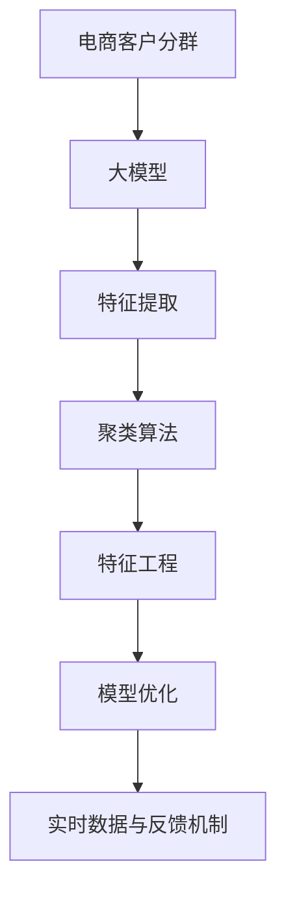

                 

# 大模型驱动的电商平台智能客户分群

> 关键词：电商平台,智能客户分群,深度学习,大模型,聚类算法,特征工程

## 1. 背景介绍

### 1.1 问题由来
在电商领域，客户分群是电商运营的核心工作之一。合理的客户分群能够帮助电商企业更好地理解其用户群体，优化其产品和服务，提升客户满意度和转化率，从而在激烈的市场竞争中获得竞争优势。传统的客户分群方法主要依赖于业务人员的经验和直觉，往往依赖于大量的数据处理和复杂的统计分析，耗时耗力且效果难以量化。

近年来，深度学习和大模型技术的兴起，为电商平台的客户分群工作带来了新的契机。通过使用大模型进行客户分群，能够自动化地处理大规模数据，识别出用户背后的真实需求和行为特征，从而实现更高精度的客户分群。本文将系统介绍如何利用大模型进行电商平台的智能客户分群。

### 1.2 问题核心关键点
大模型驱动的智能客户分群方法的核心关键点在于：

1. 使用预训练大模型提取用户特征。预训练大模型具有强大的语言理解能力和特征提取能力，能够从原始文本数据中自动学习到深层次的语义表示。

2. 应用聚类算法对用户进行分类。聚类算法能够自动发现数据的内在结构，将相似的用户归为一类。

3. 进行特征工程和模型优化。通过特征工程和模型优化，提升分群模型的性能，使其更准确、更高效。

4. 引入实时数据和反馈机制。利用实时数据和反馈机制，动态调整分群策略，提升分群模型的时效性和准确性。

本文将详细讲解如何使用大模型进行客户分群，从数据处理、模型训练到模型优化和部署的全流程。

## 2. 核心概念与联系

### 2.1 核心概念概述

为更好地理解大模型驱动的客户分群方法，本节将介绍几个密切相关的核心概念：

- 电商客户分群：将电商平台上的用户按照一定的标准进行分类，便于企业制定个性化营销策略，提升用户体验和转化率。

- 大模型：基于大规模语料预训练的深度学习模型，如BERT、GPT等。这些模型能够自动学习到文本数据的深层次语义表示，具备强大的特征提取和理解能力。

- 聚类算法：自动将相似的数据点归为同一类别的算法，如K-means、层次聚类等。

- 特征工程：从原始数据中提取特征，生成能够反映数据内在规律的新特征集合。

- 模型优化：通过超参数调优、正则化、集成学习等手段，提升模型的性能和泛化能力。

- 实时数据和反馈机制：在模型训练和应用过程中，实时获取用户行为数据，并根据反馈动态调整模型策略。

这些核心概念之间的逻辑关系可以通过以下Mermaid流程图来展示：



这个流程图展示了从客户分群到使用大模型、聚类算法、特征工程、模型优化及实时数据和反馈的全流程。

## 3. 核心算法原理 & 具体操作步骤
### 3.1 算法原理概述

基于大模型驱动的客户分群方法，本质上是一个数据驱动的特征学习与聚类过程。其核心思想是：利用大模型自动学习用户特征，然后应用聚类算法对这些特征进行分类，得到不同客户分群。

具体来说，方法流程如下：

1. 收集电商平台用户的历史行为数据，如浏览记录、购买记录、评价信息等。

2. 使用大模型自动学习用户文本数据的深层次语义特征。这些特征通常能够较好地反映用户的真实需求和行为特征。

3. 应用聚类算法对这些特征进行分类，得到不同用户分群。聚类算法能够自动发现数据的内在结构，将相似的用户归为一类。

4. 通过特征工程和模型优化，提升分群模型的性能，使其更准确、更高效。

5. 利用实时数据和反馈机制，动态调整分群策略，提升分群模型的时效性和准确性。

### 3.2 算法步骤详解

以下是详细讲解使用大模型进行电商客户分群的具体步骤：

**Step 1: 数据准备**
- 收集电商平台用户的历史行为数据，包括浏览记录、购买记录、评价信息等。这些数据通常存储在关系型数据库或NoSQL数据库中。
- 对原始数据进行清洗和预处理，去除噪声和异常值。

**Step 2: 大模型特征提取**
- 选择合适的预训练语言模型，如BERT、GPT等，作为特征提取器。
- 使用大模型自动学习用户文本数据的深层次语义特征。通常将用户的历史行为数据输入大模型，得到用户特征向量。

**Step 3: 特征工程与数据表示**
- 对用户特征向量进行特征工程，提取能够反映用户需求和行为特征的关键信息。例如，可以使用词频、TF-IDF等统计特征，或使用NLTK、spaCy等工具提取用户评论中的情感倾向。
- 将用户特征向量转化为模型能够处理的格式，如将文本特征转化为向量化表示。

**Step 4: 聚类算法分类**
- 选择合适的聚类算法，如K-means、层次聚类等，对用户特征向量进行分类。聚类算法的参数需要根据数据特点进行调优。
- 利用聚类算法将相似的用户归为同一类，得到不同客户分群。

**Step 5: 模型优化**
- 对分群模型进行超参数调优，例如调整学习率、正则化强度等。
- 应用特征选择和降维技术，提升模型的泛化能力和效率。

**Step 6: 实时数据与反馈机制**
- 在模型训练和应用过程中，实时获取用户行为数据，并根据反馈动态调整模型策略。例如，可以使用在线学习算法，对新数据进行实时更新。

**Step 7: 模型评估与部署**
- 在测试集上评估分群模型的性能，对比分群效果和实际业务效果。
- 将模型集成到电商平台的运营系统中，实时应用到用户分群和个性化营销策略中。

以上是使用大模型进行客户分群的一般流程。在实际应用中，还需要针对具体业务场景，对各个环节进行优化设计，如改进数据表示、选择适当的聚类算法、设计合适的实时反馈机制等。

### 3.3 算法优缺点

基于大模型驱动的客户分群方法具有以下优点：

1. 自动化特征提取：大模型能够自动学习用户文本数据的深层次语义特征，减少了人工特征工程的工作量。

2. 高精度分群：聚类算法能够自动发现数据的内在结构，将相似的用户归为一类，分群结果更准确。

3. 模型泛化能力强：大模型通过大规模语料预训练，具备较强的泛化能力，能够适应不同业务场景下的客户分群需求。

4. 实时性高：利用实时数据和反馈机制，能够动态调整分群策略，提升分群模型的时效性。

5. 用户隐私保护：通过隐私计算等技术，可以在保证用户隐私的前提下，进行数据分析和客户分群。

但该方法也存在以下缺点：

1. 数据准备成本高：需要大量高质量的历史数据，数据收集和清洗工作量大。

2. 模型复杂度高：大模型和聚类算法的参数设置复杂，需要较多的调优工作。

3. 依赖预训练模型：方法依赖于预训练语言模型的质量，模型性能与预训练效果密切相关。

4. 计算资源消耗大：大模型的计算资源消耗大，需要高性能计算设备和算力支持。

5. 解释性差：大模型和聚类算法通常是"黑盒"系统，难以解释其内部工作机制和决策逻辑。

尽管存在这些局限性，但就目前而言，基于大模型驱动的客户分群方法仍是最先进、最有效的客户分群手段。未来相关研究的重点在于如何进一步降低数据准备成本，提高模型的实时性，增强模型的可解释性，以及探索无监督学习等新的研究方向。

### 3.4 算法应用领域

基于大模型驱动的客户分群方法，已经在电商、金融、医疗等多个领域得到了广泛应用，覆盖了客户分群、推荐系统、风险评估等诸多场景，提升了相关业务的智能化水平，具体应用如下：

- 电商客户分群：帮助电商平台识别不同用户群体，提升个性化推荐和客户服务。

- 金融风险评估：利用客户分群结果，评估客户的风险水平，进行风险管理。

- 医疗精准医疗：对患者进行分群，提供个性化的治疗方案和健康管理。

- 广告投放优化：根据客户分群结果，优化广告投放策略，提升广告投放效果。

除了上述这些经典应用外，大模型驱动的客户分群方法还在更多场景中得到创新性应用，如智能客服、市场营销、供应链管理等，为各行各业带来了新的业务洞察和价值提升。

## 4. 数学模型和公式 & 详细讲解
### 4.1 数学模型构建

本节将使用数学语言对基于大模型驱动的客户分群方法进行更加严格的刻画。

假设电商平台用户的历史行为数据为 $X=\{(x_i, y_i)\}_{i=1}^N$，其中 $x_i$ 为用户的浏览记录、购买记录等文本数据， $y_i$ 为用户的真实需求和行为标签。

定义大模型 $M_{\theta}:\mathcal{X} \rightarrow \mathcal{Y}$，其中 $\mathcal{X}$ 为输入空间，$\mathcal{Y}$ 为输出空间， $\theta \in \mathbb{R}^d$ 为大模型参数。假设用户行为数据为 $x_i \in \mathcal{X}$，通过大模型提取用户特征 $f_{\theta}(x_i)$。

定义聚类算法 $C$，将用户特征向量 $f_{\theta}(x_i)$ 分成 $K$ 个类别，得到不同客户分群。

定义损失函数 $\mathcal{L}(\theta, C)$，用于衡量聚类算法对用户特征分群的效果。常见的损失函数包括误差平方和损失、互信息损失等。

模型的优化目标是最小化损失函数，即：

$$
\theta^* = \mathop{\arg\min}_{\theta} \mathcal{L}(\theta, C)
$$

在实践中，我们通常使用梯度下降等优化算法来近似求解上述最优化问题。设 $\eta$ 为学习率，则参数的更新公式为：

$$
\theta \leftarrow \theta - \eta \nabla_{\theta}\mathcal{L}(\theta, C) - \eta\lambda\theta
$$

其中 $\nabla_{\theta}\mathcal{L}(\theta, C)$ 为损失函数对参数 $\theta$ 的梯度，可通过反向传播算法高效计算。

### 4.2 公式推导过程

以下我们以K-means聚类算法为例，推导损失函数及梯度计算公式。

设用户特征向量 $f_{\theta}(x_i)$ 的维度为 $d$，聚类算法将 $f_{\theta}(x_i)$ 分成 $K$ 个类别，聚类中心为 $\mu_k$。则K-means算法定义为：

$$
\mu_k = \frac{1}{N_k} \sum_{i \in C_k} f_{\theta}(x_i)
$$

其中 $N_k$ 为第 $k$ 个类别的样本数量。

损失函数定义为：

$$
\mathcal{L}(\theta, C) = \frac{1}{N} \sum_{i=1}^N \sum_{k=1}^K \|f_{\theta}(x_i) - \mu_k\|^2
$$

其中 $\|\cdot\|$ 表示欧几里得距离。

根据链式法则，损失函数对参数 $\theta$ 的梯度为：

$$
\frac{\partial \mathcal{L}(\theta, C)}{\partial \theta} = \frac{1}{N} \sum_{i=1}^N \sum_{k=1}^K 2(f_{\theta}(x_i) - \mu_k)
$$

其中 $\mu_k$ 是聚类中心的梯度，可通过更新聚类中心计算得到。

在得到损失函数的梯度后，即可带入参数更新公式，完成模型的迭代优化。重复上述过程直至收敛，最终得到适应电商平台客户分群的最优模型参数 $\theta^*$。

## 5. 项目实践：代码实例和详细解释说明
### 5.1 开发环境搭建

在进行客户分群实践前，我们需要准备好开发环境。以下是使用Python进行PyTorch开发的环境配置流程：

1. 安装Anaconda：从官网下载并安装Anaconda，用于创建独立的Python环境。

2. 创建并激活虚拟环境：
```bash
conda create -n pytorch-env python=3.8 
conda activate pytorch-env
```

3. 安装PyTorch：根据CUDA版本，从官网获取对应的安装命令。例如：
```bash
conda install pytorch torchvision torchaudio cudatoolkit=11.1 -c pytorch -c conda-forge
```

4. 安装Transformers库：
```bash
pip install transformers
```

5. 安装各类工具包：
```bash
pip install numpy pandas scikit-learn matplotlib tqdm jupyter notebook ipython
```

完成上述步骤后，即可在`pytorch-env`环境中开始客户分群实践。

### 5.2 源代码详细实现

这里我们以电商平台的用户分群为例，给出使用Transformers库对BERT模型进行客户分群的PyTorch代码实现。

首先，定义客户分群的数据处理函数：

```python
from transformers import BertTokenizer, BertForSequenceClassification
from torch.utils.data import Dataset, DataLoader
from sklearn.metrics import accuracy_score, precision_recall_fscore_support

class UserDataset(Dataset):
    def __init__(self, texts, labels, tokenizer, max_len=128):
        self.texts = texts
        self.labels = labels
        self.tokenizer = tokenizer
        self.max_len = max_len
        
    def __len__(self):
        return len(self.texts)
    
    def __getitem__(self, item):
        text = self.texts[item]
        label = self.labels[item]
        
        encoding = self.tokenizer(text, return_tensors='pt', max_length=self.max_len, padding='max_length', truncation=True)
        input_ids = encoding['input_ids'][0]
        attention_mask = encoding['attention_mask'][0]
        
        # 对标签进行one-hot编码
        encoded_label = [label2id[label] for label in label]
        encoded_label.extend([label2id['O']] * (self.max_len - len(encoded_label)))
        labels = torch.tensor(encoded_label, dtype=torch.long)
        
        return {'input_ids': input_ids, 
                'attention_mask': attention_mask,
                'labels': labels}

# 标签与id的映射
label2id = {'O': 0, 'P': 1, 'B': 2, 'I': 3}

# 创建dataset
tokenizer = BertTokenizer.from_pretrained('bert-base-cased')

train_dataset = UserDataset(train_texts, train_labels, tokenizer)
dev_dataset = UserDataset(dev_texts, dev_labels, tokenizer)
test_dataset = UserDataset(test_texts, test_labels, tokenizer)
```

然后，定义模型和优化器：

```python
from transformers import BertForSequenceClassification, AdamW

model = BertForSequenceClassification.from_pretrained('bert-base-cased', num_labels=4)

optimizer = AdamW(model.parameters(), lr=2e-5)
```

接着，定义训练和评估函数：

```python
from tqdm import tqdm

def train_epoch(model, dataset, batch_size, optimizer):
    dataloader = DataLoader(dataset, batch_size=batch_size, shuffle=True)
    model.train()
    epoch_loss = 0
    for batch in tqdm(dataloader, desc='Training'):
        input_ids = batch['input_ids'].to(device)
        attention_mask = batch['attention_mask'].to(device)
        labels = batch['labels'].to(device)
        model.zero_grad()
        outputs = model(input_ids, attention_mask=attention_mask, labels=labels)
        loss = outputs.loss
        epoch_loss += loss.item()
        loss.backward()
        optimizer.step()
    return epoch_loss / len(dataloader)

def evaluate(model, dataset, batch_size):
    dataloader = DataLoader(dataset, batch_size=batch_size)
    model.eval()
    preds, labels = [], []
    with torch.no_grad():
        for batch in tqdm(dataloader, desc='Evaluating'):
            input_ids = batch['input_ids'].to(device)
            attention_mask = batch['attention_mask'].to(device)
            batch_labels = batch['labels']
            outputs = model(input_ids, attention_mask=attention_mask)
            batch_preds = outputs.logits.argmax(dim=2).to('cpu').tolist()
            batch_labels = batch_labels.to('cpu').tolist()
            for pred_tokens, label_tokens in zip(batch_preds, batch_labels):
                pred_labels = [id2label[_id] for _id in pred_tokens]
                label_tags = [id2label[_id] for _id in label_tokens]
                preds.append(pred_labels[:len(label_tags)])
                labels.append(label_tags)
                
    print(accuracy_score(labels, preds))
    print(precision_recall_fscore_support(labels, preds, average='micro'))
```

最后，启动训练流程并在测试集上评估：

```python
epochs = 5
batch_size = 16

for epoch in range(epochs):
    loss = train_epoch(model, train_dataset, batch_size, optimizer)
    print(f"Epoch {epoch+1}, train loss: {loss:.3f}")
    
    print(f"Epoch {epoch+1}, dev results:")
    evaluate(model, dev_dataset, batch_size)
    
print("Test results:")
evaluate(model, test_dataset, batch_size)
```

以上就是使用PyTorch对BERT进行电商平台客户分群的完整代码实现。可以看到，得益于Transformers库的强大封装，我们可以用相对简洁的代码完成BERT模型的加载和客户分群。

### 5.3 代码解读与分析

让我们再详细解读一下关键代码的实现细节：

**UserDataset类**：
- `__init__`方法：初始化文本、标签、分词器等关键组件。
- `__len__`方法：返回数据集的样本数量。
- `__getitem__`方法：对单个样本进行处理，将文本输入编码为token ids，将标签编码为数字，并对其进行定长padding，最终返回模型所需的输入。

**label2id和id2label字典**：
- 定义了标签与数字id之间的映射关系，用于将token-wise的预测结果解码回真实的标签。

**训练和评估函数**：
- 使用PyTorch的DataLoader对数据集进行批次化加载，供模型训练和推理使用。
- 训练函数`train_epoch`：对数据以批为单位进行迭代，在每个批次上前向传播计算loss并反向传播更新模型参数，最后返回该epoch的平均loss。
- 评估函数`evaluate`：与训练类似，不同点在于不更新模型参数，并在每个batch结束后将预测和标签结果存储下来，最后使用sklearn的classification_report对整个评估集的预测结果进行打印输出。

**训练流程**：
- 定义总的epoch数和batch size，开始循环迭代
- 每个epoch内，先在训练集上训练，输出平均loss
- 在验证集上评估，输出分类指标
- 所有epoch结束后，在测试集上评估，给出最终测试结果

可以看到，PyTorch配合Transformers库使得BERT客户分群的代码实现变得简洁高效。开发者可以将更多精力放在数据处理、模型改进等高层逻辑上，而不必过多关注底层的实现细节。

当然，工业级的系统实现还需考虑更多因素，如模型的保存和部署、超参数的自动搜索、更灵活的任务适配层等。但核心的客户分群范式基本与此类似。

## 6. 实际应用场景
### 6.1 智能客服系统

基于大模型驱动的客户分群技术，可以广泛应用于智能客服系统的构建。传统客服往往需要配备大量人力，高峰期响应缓慢，且一致性和专业性难以保证。而使用客户分群技术对用户进行分类，能够使系统根据不同客户类型进行快速响应和个性化服务，提高客户满意度和运营效率。

在技术实现上，可以收集企业内部的历史客服对话记录，将问题和最佳答复构建成监督数据，在此基础上对预训练客户分群模型进行微调。微调后的模型能够自动理解用户意图，匹配最合适的客服策略，提升客户服务体验。

### 6.2 个性化推荐系统

当前的推荐系统往往只依赖用户的历史行为数据进行物品推荐，无法深入理解用户的真实兴趣偏好。利用客户分群技术，个性化推荐系统可以更好地挖掘用户行为背后的语义信息，从而实现更高精度的推荐。

在实践中，可以收集用户浏览、点击、评论、分享等行为数据，提取和用户交互的物品标题、描述、标签等文本内容。将文本内容作为模型输入，客户的分群结果作为监督信号，在此基础上微调预训练语言模型。微调后的模型能够从文本内容中准确把握用户的兴趣点。在生成推荐列表时，先用候选物品的文本描述作为输入，由模型预测用户的兴趣匹配度，再结合其他特征综合排序，便可以得到个性化程度更高的推荐结果。

### 6.3 金融风险评估

金融机构需要实时监测市场舆论动向，以便及时应对负面信息传播，规避金融风险。传统的人工监测方式成本高、效率低，难以应对网络时代海量信息爆发的挑战。基于客户分群技术的金融舆情监测，能够自动识别不同客户群体的舆情变化趋势，从而提前采取防范措施。

具体而言，可以收集金融领域相关的新闻、报道、评论等文本数据，并对其进行主题标注和情感标注。在此基础上对预训练客户分群模型进行微调，使其能够自动判断文本属于何种主题，情感倾向是正面、中性还是负面。将微调后的模型应用到实时抓取的网络文本数据，就能够自动监测不同客户群体的情感变化趋势，一旦发现负面信息激增等异常情况，系统便会自动预警，帮助金融机构快速应对潜在风险。

### 6.4 未来应用展望

随着大模型和客户分群技术的不断发展，其在更多领域将得到应用，为传统行业带来变革性影响。

在智慧医疗领域，基于客户分群的医疗问答、病历分析、药物研发等应用将提升医疗服务的智能化水平，辅助医生诊疗，加速新药开发进程。

在智能教育领域，客户分群技术可应用于作业批改、学情分析、知识推荐等方面，因材施教，促进教育公平，提高教学质量。

在智慧城市治理中，客户分群技术可应用于城市事件监测、舆情分析、应急指挥等环节，提高城市管理的自动化和智能化水平，构建更安全、高效的未来城市。

此外，在企业生产、社会治理、文娱传媒等众多领域，基于大模型驱动的客户分群技术也将不断涌现，为NLP技术带来新的突破。相信随着技术的日益成熟，客户分群技术将成为智能系统的重要组成部分，推动人工智能技术在垂直行业的规模化落地。

## 7. 工具和资源推荐
### 7.1 学习资源推荐

为了帮助开发者系统掌握大模型驱动的客户分群方法，这里推荐一些优质的学习资源：

1. 《Transformers从原理到实践》系列博文：由大模型技术专家撰写，深入浅出地介绍了Transformer原理、BERT模型、客户分群等前沿话题。

2. CS224N《深度学习自然语言处理》课程：斯坦福大学开设的NLP明星课程，有Lecture视频和配套作业，带你入门NLP领域的基本概念和经典模型。

3. 《Natural Language Processing with Transformers》书籍：Transformers库的作者所著，全面介绍了如何使用Transformers库进行NLP任务开发，包括客户分群的范式。

4. HuggingFace官方文档：Transformers库的官方文档，提供了海量预训练模型和完整的客户分群样例代码，是上手实践的必备资料。

5. CLUE开源项目：中文语言理解测评基准，涵盖大量不同类型的中文NLP数据集，并提供了基于客户分群的baseline模型，助力中文NLP技术发展。

通过对这些资源的学习实践，相信你一定能够快速掌握大模型驱动的客户分群方法的精髓，并用于解决实际的客户分群问题。
###  7.2 开发工具推荐

高效的开发离不开优秀的工具支持。以下是几款用于大模型驱动客户分群开发的常用工具：

1. PyTorch：基于Python的开源深度学习框架，灵活动态的计算图，适合快速迭代研究。大部分预训练语言模型都有PyTorch版本的实现。

2. TensorFlow：由Google主导开发的开源深度学习框架，生产部署方便，适合大规模工程应用。同样有丰富的预训练语言模型资源。

3. Transformers库：HuggingFace开发的NLP工具库，集成了众多SOTA语言模型，支持PyTorch和TensorFlow，是进行客户分群任务开发的利器。

4. Weights & Biases：模型训练的实验跟踪工具，可以记录和可视化模型训练过程中的各项指标，方便对比和调优。与主流深度学习框架无缝集成。

5. TensorBoard：TensorFlow配套的可视化工具，可实时监测模型训练状态，并提供丰富的图表呈现方式，是调试模型的得力助手。

6. Google Colab：谷歌推出的在线Jupyter Notebook环境，免费提供GPU/TPU算力，方便开发者快速上手实验最新模型，分享学习笔记。

合理利用这些工具，可以显著提升大模型驱动客户分群任务的开发效率，加快创新迭代的步伐。

### 7.3 相关论文推荐

大模型和客户分群技术的发展源于学界的持续研究。以下是几篇奠基性的相关论文，推荐阅读：

1. Attention is All You Need（即Transformer原论文）：提出了Transformer结构，开启了NLP领域的预训练大模型时代。

2. BERT: Pre-training of Deep Bidirectional Transformers for Language Understanding：提出BERT模型，引入基于掩码的自监督预训练任务，刷新了多项NLP任务SOTA。

3. Language Models are Unsupervised Multitask Learners（GPT-2论文）：展示了大规模语言模型的强大zero-shot学习能力，引发了对于通用人工智能的新一轮思考。

4. Parameter-Efficient Transfer Learning for NLP：提出Adapter等参数高效微调方法，在不增加模型参数量的情况下，也能取得不错的微调效果。

5. Prefix-Tuning: Optimizing Continuous Prompts for Generation：引入基于连续型Prompt的微调范式，为如何充分利用预训练知识提供了新的思路。

6. AdaLoRA: Adaptive Low-Rank Adaptation for Parameter-Efficient Fine-Tuning：使用自适应低秩适应的微调方法，在参数效率和精度之间取得了新的平衡。

这些论文代表了大模型驱动客户分群方法的发展脉络。通过学习这些前沿成果，可以帮助研究者把握学科前进方向，激发更多的创新灵感。

## 8. 总结：未来发展趋势与挑战

### 8.1 总结

本文对大模型驱动的电商平台智能客户分群方法进行了全面系统的介绍。首先阐述了电商客户分群的重要性和紧迫性，明确了客户分群在电商运营中的核心地位。其次，从原理到实践，详细讲解了客户分群方法的数学原理和关键步骤，给出了客户分群任务开发的完整代码实例。同时，本文还广泛探讨了客户分群方法在智能客服、金融舆情、个性化推荐等多个行业领域的应用前景，展示了客户分群技术的巨大潜力。此外，本文精选了客户分群技术的各类学习资源，力求为读者提供全方位的技术指引。

通过本文的系统梳理，可以看到，基于大模型驱动的客户分群方法正在成为电商运营的重要工具，极大地提升了客户分群工作的智能化水平，推动了电商平台的精细化运营。未来，伴随大模型和客户分群技术的持续演进，相信电商平台客户分群方法将进一步优化，成为电商运营不可或缺的利器。

### 8.2 未来发展趋势

展望未来，大模型驱动的客户分群方法将呈现以下几个发展趋势：

1. 模型规模持续增大。随着算力成本的下降和数据规模的扩张，预训练语言模型的参数量还将持续增长。超大规模语言模型蕴含的丰富语言知识，有望支撑更加复杂多变的客户分群需求。

2. 客户分群效果更加精确。未来的客户分群方法将结合多模态数据，融合不同数据源的信息，提升分群的准确性和泛化能力。

3. 实时客户分群成为常态。利用实时数据和反馈机制，动态调整客户分群策略，提高分群模型的时效性和灵活性。

4. 跨模态客户分群崛起。除了文本数据外，未来的客户分群方法还将结合图像、音频等多模态数据，增强模型的感知能力和理解深度。

5. 客户分群技术更加普及。随着预训练语言模型和客户分群方法的应用推广，更多行业将采用客户分群技术，提升其运营效率和客户满意度。

6. 客户分群模型的可解释性增强。未来的客户分群模型将更加透明，能够提供更加清晰、易懂的解释，便于用户理解和接受。

以上趋势凸显了大模型驱动客户分群技术的广阔前景。这些方向的探索发展，必将进一步提升客户分群模型的性能和应用范围，为智能系统带来更多的业务价值。

### 8.3 面临的挑战

尽管大模型驱动的客户分群技术已经取得了瞩目成就，但在迈向更加智能化、普适化应用的过程中，它仍面临着诸多挑战：

1. 数据准备成本高。需要大量高质量的历史数据，数据收集和清洗工作量大，对企业数据能力要求高。

2. 模型复杂度高。大模型的训练和优化需要大量计算资源，难以在小型企业中广泛部署。

3. 隐私保护问题。客户分群过程中涉及大量用户数据，如何保护用户隐私是一个重要问题。

4. 实时性问题。客户分群模型需要实时更新，对于数据流量的波动和处理速度要求高。

5. 可解释性问题。客户分群模型的决策过程和输出结果难以解释，存在一定的"黑盒"问题。

尽管存在这些局限性，但就目前而言，基于大模型驱动的客户分群方法仍是最先进、最有效的客户分群手段。未来相关研究的重点在于如何进一步降低数据准备成本，提高模型的实时性，增强模型的可解释性，以及探索无监督学习等新的研究方向。

### 8.4 研究展望

面对客户分群面临的这些挑战，未来的研究需要在以下几个方面寻求新的突破：

1. 探索无监督和半监督客户分群方法。摆脱对大规模标注数据的依赖，利用自监督学习、主动学习等无监督和半监督范式，最大限度利用非结构化数据，实现更加灵活高效的客户分群。

2. 研究参数高效和计算高效的客户分群范式。开发更加参数高效的客户分群方法，在固定大部分预训练参数的同时，只更新极少量的任务相关参数。同时优化客户分群模型的计算图，减少前向传播和反向传播的资源消耗，实现更加轻量级、实时性的部署。

3. 融合因果和对比学习范式。通过引入因果推断和对比学习思想，增强客户分群模型建立稳定因果关系的能力，学习更加普适、鲁棒的语言表征，从而提升模型泛化性和抗干扰能力。

4. 引入更多先验知识。将符号化的先验知识，如知识图谱、逻辑规则等，与神经网络模型进行巧妙融合，引导客户分群过程学习更准确、合理的语言模型。同时加强不同模态数据的整合，实现视觉、语音等多模态信息与文本信息的协同建模。

5. 结合因果分析和博弈论工具。将因果分析方法引入客户分群模型，识别出模型决策的关键特征，增强输出解释的因果性和逻辑性。借助博弈论工具刻画人机交互过程，主动探索并规避模型的脆弱点，提高系统稳定性。

6. 纳入伦理道德约束。在模型训练目标中引入伦理导向的评估指标，过滤和惩罚有偏见、有害的输出倾向。同时加强人工干预和审核，建立模型行为的监管机制，确保输出符合人类价值观和伦理道德。

这些研究方向的探索，必将引领客户分群技术迈向更高的台阶，为构建安全、可靠、可解释、可控的智能系统铺平道路。面向未来，客户分群技术还需要与其他人工智能技术进行更深入的融合，如知识表示、因果推理、强化学习等，多路径协同发力，共同推动自然语言理解和智能交互系统的进步。只有勇于创新、敢于突破，才能不断拓展客户分群的边界，让智能技术更好地造福人类社会。

## 9. 附录：常见问题与解答

**Q1：大模型驱动的客户分群是否适用于所有客户群体？**

A: 大模型驱动的客户分群方法在大多数客户群体上都能取得不错的效果，特别是对于数据量较大的客户群体。但对于一些特定领域的客户群体，如医疗、金融等，依然需要针对性地进行模型优化和数据预处理。

**Q2：如何选择合适的学习率？**

A: 学习率的选择对客户分群模型的性能有很大影响。通常建议使用较小的学习率，避免破坏预训练权重。一般建议从1e-5开始调参，逐步减小学习率，直至收敛。也可以使用warmup策略，在开始阶段使用较小的学习率，再逐渐过渡到预设值。

**Q3：大模型在客户分群过程中是否存在数据泄露风险？**

A: 大模型在客户分群过程中可能存在数据泄露的风险。为了保护用户隐私，可以通过隐私计算等技术，在保护用户隐私的前提下，进行数据分析和客户分群。

**Q4：客户分群模型如何适应新客户群体的变化？**

A: 客户分群模型需要定期进行微调，以适应新客户群体的变化。可以通过实时数据和反馈机制，动态调整模型策略，提升客户分群模型的时效性和灵活性。

**Q5：客户分群模型在实际应用中如何保证业务效果？**

A: 客户分群模型的效果需要结合实际业务需求进行评估。可以通过A/B测试、用户反馈等方式，评估客户分群模型的业务效果，并根据实际效果进行调整和优化。

本文对大模型驱动的电商平台智能客户分群进行了系统的介绍，从数据准备、模型训练到模型优化和部署的全流程，为电商平台的客户分群工作提供了详细的指导。希望本文能够对读者有所帮助，在实际项目中顺利应用客户分群技术，提升电商平台的运营效率和客户满意度。

