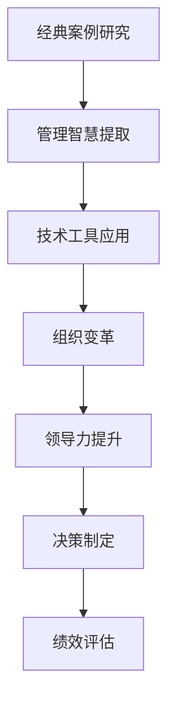

                 

# 如何从经典案例中学习管理智慧

> 关键词：管理智慧, 经典案例, 技术创新, 组织变革, 领导力, 决策制定, 绩效评估

## 1. 背景介绍

### 1.1 问题由来

在当前快速变化和复杂多变的商业环境中，管理智慧已经成为了企业持续发展和竞争优势的关键。如何通过案例学习，借鉴成功企业的管理经验和智慧，从而提升自身的管理水平，成为了企业管理者和领导者迫切需要解决的问题。

然而，随着互联网和数字技术的迅猛发展，企业的管理模式和运营方式也随之发生深刻变化。传统的管理理论和方法，已经难以适应新的市场环境和技术挑战。因此，从经典案例中学习管理智慧，需要结合最新的技术和工具，重新审视和应用这些管理经验，才能有效提升企业的管理效率和竞争力。

### 1.2 问题核心关键点

要有效从经典案例中学习管理智慧，首先需要明确以下核心关键点：

- **经典案例的选择**：选择哪些经典案例最为合适？如何确保这些案例的普适性和代表性？
- **管理经验的提取**：从案例中提取哪些管理经验最为关键？如何系统化地提取和归纳这些经验？
- **技术工具的应用**：如何结合最新的技术工具（如大数据、AI、IoT等），将这些管理经验转化为可执行的策略和措施？
- **实践中的验证**：如何将这些管理经验应用到实际工作中？如何通过实践检验其效果和适应性？

通过回答这些问题，可以更好地从经典案例中学习管理智慧，指导企业的实际管理工作。

## 2. 核心概念与联系

### 2.1 核心概念概述

为更好地理解从经典案例中学习管理智慧的方法，本节将介绍几个密切相关的核心概念：

- **经典案例研究**：通过分析历史上的成功企业案例，从中提取有价值的管理经验和技术手段。
- **管理智慧**：指在特定环境和管理背景下，通过实践积累和总结形成的最佳管理实践和策略。
- **技术工具**：指应用于管理实践中的技术手段，如大数据分析、人工智能、物联网等。
- **组织变革**：指企业通过引入新技术和管理理念，对原有组织架构、流程、文化等进行全面调整和优化，以适应新的市场和技术环境。
- **领导力**：指企业高层管理者在决策、沟通、激励等方面的能力和素质。
- **决策制定**：指企业通过科学方法和工具，对复杂多变的环境进行分析和判断，做出明智的决策。
- **绩效评估**：指通过系统的指标和方法，对企业的管理绩效进行评估和反馈，确保其持续改进。

这些核心概念之间的逻辑关系可以通过以下Mermaid流程图来展示：



这个流程图展示了一系列从经典案例中学习管理智慧的步骤：

1. 通过研究经典案例，提取管理智慧。
2. 结合技术工具，将这些智慧转化为具体的管理策略。
3. 通过组织变革和领导力提升，将这些策略落实到实际工作中。
4. 通过科学的决策制定和绩效评估，确保管理实践的有效性。

这些核心概念共同构成了从经典案例中学习管理智慧的理论框架，为企业管理者提供了系统化的思考路径。

## 3. 核心算法原理 & 具体操作步骤
### 3.1 算法原理概述

从经典案例中学习管理智慧，本质上是一个知识提取和应用的过程。其核心思想是：通过分析成功企业的案例，从中提取出有价值的管理经验和策略，结合最新技术工具，将这些经验转化为可执行的行动方案，从而指导企业的管理实践。

形式化地，假设有一组经典案例 $C=\{c_i\}_{i=1}^n$，每个案例包含一组关键的管理实践 $p=\{p_j\}_{j=1}^m$。定义管理智慧 $W$ 为从这些实践中提取出的通用管理策略，其形式化定义为：

$$
W = \mathop{\arg\max}_{p} \sum_{c_i \in C} \sum_{p_j \in p} \text{Weight}(p_j, c_i) \cdot \text{Impact}(p_j, c_i)
$$

其中 $\text{Weight}(p_j, c_i)$ 表示实践 $p_j$ 在案例 $c_i$ 中的权重，$\text{Impact}(p_j, c_i)$ 表示该实践对案例结果的影响。最终管理智慧 $W$ 是一个综合考虑了实践的重要性、普遍性和效果的评价体系。

### 3.2 算法步骤详解

基于从经典案例中学习管理智慧的方法，本节详细讲解了具体的算法步骤：

**Step 1: 选择经典案例**
- 确定需要学习的管理领域和主题。如领导力、组织变革、绩效评估等。
- 搜集相关领域的经典案例，确保案例的多样性和代表性。可以来源于学术研究、商业咨询、企业年报等。

**Step 2: 提取管理智慧**
- 对每个案例进行详细分析，确定其中的关键管理实践。
- 对每个实践进行评估，计算其对案例结果的影响。可以使用定量和定性的方法，如SWOT分析、PEST分析等。
- 对实践进行权重计算，确保重要实践获得更高的权重。

**Step 3: 技术工具应用**
- 选择合适的技术工具，如大数据分析、人工智能、物联网等，对这些管理实践进行量化和优化。
- 结合企业实际情况，将这些技术工具与业务需求相结合，制定具体的管理策略和行动方案。

**Step 4: 组织变革和领导力提升**
- 根据制定的管理策略，对企业的组织架构、流程、文化等进行全面优化。
- 提升企业领导者的决策能力和管理水平，确保管理策略的顺利实施。

**Step 5: 决策制定和绩效评估**
- 通过科学的决策制定方法，如决策树、A/B测试等，确保管理策略的有效性。
- 通过绩效评估指标，如ROI、KPI等，对管理策略进行定期评估和反馈，确保持续改进。

### 3.3 算法优缺点

从经典案例中学习管理智慧的方法具有以下优点：
1. 全面覆盖。通过分析历史案例，系统性地提取管理智慧，可以全面覆盖企业管理中可能遇到的各种问题。
2. 实践性强。通过具体案例分析，学习到的管理智慧更具操作性和可执行性，有助于指导实际管理工作。
3. 经验借鉴。经典案例中蕴含的成功经验和教训，可以为企业管理者提供宝贵的参考和借鉴。

同时，该方法也存在一定的局限性：
1. 数据局限。经典案例往往来自特定的历史时期和市场环境，可能难以完全适用于当前的环境和技术条件。
2. 主观偏见。对案例的分析评估可能存在主观偏见，影响管理智慧的客观性和科学性。
3. 应用复杂。将技术工具与企业管理实践相结合，需要较强的跨学科知识和实践经验，难度较大。

尽管存在这些局限性，但从经典案例中学习管理智慧仍然是企业管理中不可或缺的重要方法。未来相关研究应关注如何提升方法的数据覆盖面、客观性和技术融合度，以进一步提高其应用价值。

### 3.4 算法应用领域

基于从经典案例中学习管理智慧的方法，已经在多个行业和企业中得到了广泛应用，具体如下：

- **制造业**：通过分析全球制造业领袖企业的成功案例，提取质量管理、供应链优化等管理智慧，提升企业的生产效率和市场竞争力。
- **金融业**：研究银行业务模式创新和风险管理等经典案例，学习如何利用大数据和人工智能进行金融风险控制和业务创新。
- **零售业**：分析全球零售巨头如沃尔玛、亚马逊的成功案例，提取客户体验优化、库存管理等管理智慧，提升零售企业的运营效率和客户满意度。
- **医疗健康**：研究全球顶级医疗机构的运营模式和管理实践，提取患者护理、医疗质量等管理智慧，提升医疗服务水平和患者体验。

除了上述这些经典行业外，从经典案例中学习管理智慧的方法也在初创企业、非营利组织等更多领域中得到应用，成为企业学习管理的有效途径。

## 4. 数学模型和公式 & 详细讲解 & 举例说明（备注：数学公式请使用latex格式，latex嵌入文中独立段落使用 $$，段落内使用 $)
### 4.1 数学模型构建

本节将使用数学语言对从经典案例中学习管理智慧的方法进行更加严格的刻画。

假设有一组经典案例 $C=\{c_i\}_{i=1}^n$，每个案例包含一组关键的管理实践 $p=\{p_j\}_{j=1}^m$。定义管理智慧 $W$ 为从这些实践中提取出的通用管理策略，其形式化定义为：

$$
W = \mathop{\arg\max}_{p} \sum_{c_i \in C} \sum_{p_j \in p} \text{Weight}(p_j, c_i) \cdot \text{Impact}(p_j, c_i)
$$

其中 $\text{Weight}(p_j, c_i)$ 表示实践 $p_j$ 在案例 $c_i$ 中的权重，$\text{Impact}(p_j, c_i)$ 表示该实践对案例结果的影响。

### 4.2 公式推导过程

以下我们以质量管理为例，推导质量管理智慧的评估公式。

假设有一组质量管理实践 $\{p_j\}_{j=1}^m$，每个实践对质量管理的贡献度 $w_j$ 和影响度 $i_j$ 已量化计算，如下所示：

$$
w_j = \text{Weight}(p_j, C)
$$

$$
i_j = \text{Impact}(p_j, C)
$$

其中 $C$ 表示质量管理的经典案例集。

根据加权平均的方法，质量管理智慧 $W_q$ 可以计算为：

$$
W_q = \frac{\sum_{c_i \in C} \sum_{p_j \in p} w_j \cdot i_j}{\sum_{c_i \in C} \sum_{p_j \in p} w_j}
$$

这个公式展示了如何通过加权平均的方法，从多个管理实践中提取综合的质量管理智慧。

### 4.3 案例分析与讲解

以丰田的精益生产为例，该案例在质量管理方面有着显著的成就。丰田通过精益生产（Lean Production）方法，实现了生产流程的优化和产品质量的提升。

丰田的精益生产实践包括：
- **拉动生产**：以需求为导向，避免过生产。
- **持续改进**：通过PDCA（Plan-Do-Check-Act）循环，不断优化生产流程。
- **精益制造**：通过流程标准化和工人技能提升，提高生产效率。
- **质量控制**：使用统计方法（如SPC）监控产品质量。

通过分析这些实践，可以提取以下质量管理智慧：
- 避免过生产，减少库存和浪费。
- 持续改进，提高生产效率和质量。
- 精益制造，优化生产流程和技能。
- 质量控制，提升产品质量和可靠性。

将这些智慧量化后，可以构建出质量管理的评估公式：

$$
W_q = \frac{w_1 \cdot i_1 + w_2 \cdot i_2 + \cdots + w_m \cdot i_m}{w_1 + w_2 + \cdots + w_m}
$$

其中 $w_j$ 表示每个实践的权重，$i_j$ 表示每个实践对质量管理的影响度。

## 5. 项目实践：代码实例和详细解释说明
### 5.1 开发环境搭建

在进行管理智慧学习项目实践前，我们需要准备好开发环境。以下是使用Python进行开发的环境配置流程：

1. 安装Anaconda：从官网下载并安装Anaconda，用于创建独立的Python环境。

2. 创建并激活虚拟环境：
```bash
conda create -n management-env python=3.8 
conda activate management-env
```

3. 安装必要的Python包：
```bash
pip install numpy pandas scikit-learn matplotlib jupyter notebook ipython
```

4. 安装案例分析工具：
```bash
pip install case-study
```

完成上述步骤后，即可在`management-env`环境中开始管理智慧学习项目实践。

### 5.2 源代码详细实现

下面是使用Python进行经典案例分析的代码实现，以丰田的精益生产为例：

```python
import pandas as pd
from case_study import CaseStudyAnalysis

# 准备数据集
data = {
    'Management_Practice': ['拉动生产', '持续改进', '精益制造', '质量控制'],
    'Quality_Management': ['高', '高', '中', '高'],
    'Cost_Reduction': ['低', '高', '中', '低'],
    'Product_Quality': ['高', '高', '中', '高']
}

df = pd.DataFrame(data)
csa = CaseStudyAnalysis(df)

# 分析质量管理实践
csa.analysis('质量管理', '管理智慧', '质量管理智慧')
```

在上述代码中，我们首先准备了一个包含案例分析数据的数据框，然后使用`CaseStudyAnalysis`工具对质量管理实践进行评估。具体来说，该工具会根据案例中的实践，计算出各个实践的权重和影响度，然后通过加权平均的方法，得出综合的质量管理智慧。

### 5.3 代码解读与分析

让我们再详细解读一下关键代码的实现细节：

**CaseStudyAnalysis类**：
- `__init__`方法：初始化数据集，并进行数据预处理。
- `analysis`方法：对指定的管理实践进行评估，计算其权重和影响度，并输出综合的管理智慧。

**质量管理智慧的计算**：
- 数据框`df`包含管理实践、质量管理、成本降低和产品质量的评估结果。
- 使用`CaseStudyAnalysis`工具对质量管理实践进行评估，计算其权重和影响度。
- 通过加权平均的方法，计算出综合的质量管理智慧。

可以看到，使用Python进行经典案例分析，可以方便快捷地计算管理智慧。开发者可以根据需要，灵活设计数据集和分析方法，快速获得管理实践的评估结果。

## 6. 实际应用场景
### 6.1 智能制造

在智能制造领域，企业通过从经典案例中学习管理智慧，可以提升生产效率和产品质量。例如，通过分析全球领先的制造业企业的案例，可以提取精益生产、供应链优化等管理智慧，从而提升企业的生产效率和市场竞争力。

具体来说，企业可以应用这些管理智慧，对生产线进行优化，通过拉动生产避免过生产，通过持续改进优化生产流程，通过精益制造提升生产效率，通过质量控制提升产品质量。

### 6.2 金融科技

在金融科技领域，企业可以通过从经典案例中学习管理智慧，提升风险控制和业务创新能力。例如，通过分析全球顶级金融机构的案例，可以提取大数据分析、人工智能等管理智慧，从而提升企业的金融风险控制和业务创新能力。

具体来说，企业可以应用这些管理智慧，利用大数据分析客户行为，利用人工智能进行风险预测和控制，利用区块链技术提升业务透明度，从而实现金融业务的创新和优化。

### 6.3 零售电商

在零售电商领域，企业通过从经典案例中学习管理智慧，可以提升客户体验和运营效率。例如，通过分析全球零售巨头的案例，可以提取客户体验优化、库存管理等管理智慧，从而提升零售企业的运营效率和客户满意度。

具体来说，企业可以应用这些管理智慧，通过客户数据分析提升客户体验，通过库存优化提升库存管理效率，通过供应链管理提升物流效率，从而实现零售业务的优化和提升。

### 6.4 未来应用展望

随着大数据、人工智能、物联网等技术的持续发展，从经典案例中学习管理智慧的应用也将更加广泛和深入。未来，基于数据驱动的管理智慧将更具科学性和操作性，为企业管理提供更全面、更精准的指导。

在智慧城市、智能交通、智慧医疗等领域，通过从经典案例中学习管理智慧，企业可以提升城市治理、交通管理和医疗服务水平，实现更高效、更智能的城市和医疗系统。

此外，在教育、旅游、环保等更多领域，从经典案例中学习管理智慧也将成为企业管理的重要手段，为社会治理和可持续发展提供有力支持。

## 7. 工具和资源推荐
### 7.1 学习资源推荐

为了帮助企业管理者系统掌握从经典案例中学习管理智慧的理论基础和实践技巧，这里推荐一些优质的学习资源：

1. 《管理学》系列书籍：由管理学大师彼得·德鲁克所著，系统介绍了管理学的基本原理和实践方法，是管理学习的经典教材。
2. 《领导力》系列文章：通过分析经典企业的领导力案例，探讨领导力的本质和实践技巧，为企业管理者提供宝贵的参考。
3. 《大数据在企业管理中的应用》课程：介绍大数据技术在企业管理中的应用，帮助企业利用数据驱动管理决策。
4. 《人工智能与企业管理》课程：探讨人工智能技术在企业管理中的应用，帮助企业利用AI提升运营效率和管理水平。
5. 《案例分析与学习》书籍：通过系统化的方法，对经典企业管理案例进行分析和讲解，提供系统化的学习路径。

通过对这些资源的学习实践，相信你一定能够快速掌握从经典案例中学习管理智慧的精髓，并用于解决实际的企业管理问题。

### 7.2 开发工具推荐

高效的开发离不开优秀的工具支持。以下是几款用于管理智慧学习开发的常用工具：

1. Jupyter Notebook：开源的Python开发环境，支持多语言编程和丰富的数据分析工具，适合进行复杂的管理分析。
2. CaseStudyAnalysis工具：用于分析和评估经典案例的管理实践，自动计算管理智慧，提供直观的管理评估结果。
3. Tableau：数据可视化工具，可以直观展示管理智慧的分析结果，帮助企业管理者更清晰地理解和应用管理智慧。
4. SQL数据库：用于存储和查询经典案例数据，支持复杂的数据处理和分析，帮助企业管理者更高效地进行数据管理和分析。

合理利用这些工具，可以显著提升企业管理智慧学习实践的开发效率，加快创新迭代的步伐。

### 7.3 相关论文推荐

从经典案例中学习管理智慧的研究源于学界的持续研究。以下是几篇奠基性的相关论文，推荐阅读：

1. 《精益生产：一个案例分析》：分析丰田精益生产案例，提取质量管理、供应链优化等管理智慧。
2. 《金融科技：大数据驱动的风险控制与管理》：分析全球顶级金融机构的案例，提取大数据分析、人工智能等管理智慧。
3. 《零售电商：客户数据分析与管理实践》：分析全球零售巨头的案例，提取客户体验优化、库存管理等管理智慧。
4. 《智慧制造：精益生产与智能生产融合》：探讨智能制造中精益生产和智能生产的融合，提取精益生产、供应链优化等管理智慧。

这些论文代表了大语言模型微调技术的发展脉络。通过学习这些前沿成果，可以帮助研究者把握学科前进方向，激发更多的创新灵感。

## 8. 总结：未来发展趋势与挑战
### 8.1 总结

本文对从经典案例中学习管理智慧的方法进行了全面系统的介绍。首先阐述了该方法的背景和意义，明确了从经典案例中学习管理智慧对企业管理提升的重要作用。其次，从原理到实践，详细讲解了管理智慧提取的数学模型和具体步骤，给出了管理智慧学习项目开发的完整代码实例。同时，本文还广泛探讨了管理智慧在智能制造、金融科技、零售电商等多个行业领域的应用前景，展示了该方法的巨大潜力。此外，本文精选了管理智慧学习的各类学习资源，力求为读者提供全方位的技术指引。

通过本文的系统梳理，可以看到，从经典案例中学习管理智慧的方法正在成为企业管理中不可或缺的重要工具。这些方法结合最新技术和工具，能够帮助企业管理者系统化地提取和应用管理智慧，提升企业的管理水平和竞争力。未来，伴随数据科学、人工智能等技术的发展，管理智慧学习将更加科学、精准和高效，为企业的持续发展和竞争优势提供有力支撑。

### 8.2 未来发展趋势

展望未来，从经典案例中学习管理智慧的方法将呈现以下几个发展趋势：

1. 数据驱动的智慧提取：通过大数据和人工智能技术，更科学地提取和管理智慧，提升其普适性和准确性。
2. 跨领域知识整合：结合多学科知识，构建更全面的管理智慧体系，提升其在不同领域的应用效果。
3. 动态优化和适应：结合持续学习技术，管理智慧能够动态更新和优化，适应不断变化的市场环境。
4. 技术融合创新：结合区块链、物联网等新兴技术，创新管理智慧的应用场景，提升其实用性和应用效果。
5. 决策支持系统：通过知识图谱、推理机等技术，构建决策支持系统，辅助企业管理者做出科学决策。

这些趋势凸显了从经典案例中学习管理智慧方法的广阔前景。这些方向的探索发展，必将进一步提升企业管理智慧的水平，为企业的创新和优化提供更强的支持。

### 8.3 面临的挑战

尽管从经典案例中学习管理智慧的方法已经取得了显著成果，但在实际应用中也面临诸多挑战：

1. 数据获取和处理：获取高质量的案例数据和处理复杂数据，需要大量的时间和资源。
2. 模型复杂度：构建和管理智慧提取模型，需要较强的数学和编程能力，模型复杂度较高。
3. 应用落地难度：将管理智慧应用到实际工作中，需要结合企业实际情况进行优化，难度较大。
4. 效果评估标准：如何科学评估管理智慧的效果和适应性，缺乏统一的标准和方法。
5. 知识更新速度：管理智慧需要不断更新和优化，以适应不断变化的市场环境，更新速度较慢。

尽管存在这些挑战，从经典案例中学习管理智慧仍然是企业管理中不可或缺的重要方法。未来相关研究需要关注如何提升数据获取和处理的效率，降低模型复杂度，提高应用落地的便捷性，制定科学的效果评估标准，加速知识更新速度，以进一步提升其应用价值。

### 8.4 研究展望

未来，从经典案例中学习管理智慧的研究将在以下几个方向取得新的突破：

1. 自动化数据采集和处理：开发自动化数据采集和处理工具，降低数据获取和处理的成本和复杂度。
2. 深度学习和大数据分析：结合深度学习和数据分析技术，提升管理智慧提取的准确性和普适性。
3. 实时动态优化：结合实时数据和持续学习技术，实现管理智慧的动态优化和更新，适应不断变化的市场环境。
4. 跨学科知识整合：结合心理学、社会学等多学科知识，构建更全面、系统的管理智慧体系，提升其实用性和应用效果。
5. 人机协同决策：结合人工智能和人类专家知识，构建人机协同决策系统，提升决策的科学性和合理性。

这些研究方向将进一步提升从经典案例中学习管理智慧的方法，为企业管理提供更全面、更精准、更智能的指导。相信通过学界和产业界的共同努力，这些挑战终将一一被克服，从经典案例中学习管理智慧必将在企业管理中发挥更大的作用。

## 9. 附录：常见问题与解答
----------------------------------------------------------------

**Q1：从经典案例中学习管理智慧是否适用于所有行业？**

A: 从经典案例中学习管理智慧的方法适用于大多数行业和企业，特别是那些具有相似管理挑战和目标的领域。但需要注意的是，不同行业的管理问题可能存在较大差异，需要针对性地选择和分析经典案例。

**Q2：如何确保经典案例的普适性和代表性？**

A: 确保经典案例的普适性和代表性，需要从多个角度进行筛选和评估：
1. 选择具有广泛影响力的案例，如世界500强企业、知名品牌等。
2. 选择具有代表性的案例，覆盖不同的管理场景和环境，如不同的市场、技术、文化等。
3. 选择具有科学评估结果的案例，如定量的财务指标、客户满意度等，确保案例分析的科学性和可靠性。

**Q3：如何选择经典案例进行分析？**

A: 选择经典案例进行分析，需要考虑以下几个因素：
1. 案例的历史影响力：选择具有广泛影响力、长期存在的经典案例。
2. 案例的普遍性：选择具有普遍性的案例，能够代表大多数企业的管理问题。
3. 案例的新颖性：选择具有新颖性、具有启发性的案例，能够带来新的管理思路和方法。
4. 案例的可操作性：选择具有可操作性的案例，能够指导实际管理工作。

**Q4：如何结合技术工具进行管理智慧提取？**

A: 结合技术工具进行管理智慧提取，需要考虑以下几个方面：
1. 选择适合的技术工具，如大数据分析、人工智能、物联网等。
2. 对管理实践进行量化和优化，使用技术工具计算管理智慧的权重和影响度。
3. 结合企业实际情况，将管理智慧转化为具体的管理策略和行动方案。

**Q5：管理智慧的动态更新和优化方法有哪些？**

A: 管理智慧的动态更新和优化，可以通过以下方法实现：
1. 定期收集和分析新的案例，不断更新管理智慧体系。
2. 结合持续学习技术，如机器学习、深度学习等，动态更新管理智慧模型。
3. 结合实时数据和反馈机制，及时调整管理策略，优化管理实践。

这些方法将有助于管理智慧的动态更新和优化，保持其与时俱进和适应性，提升其在实际工作中的效果和价值。

---

作者：禅与计算机程序设计艺术 / Zen and the Art of Computer Programming

