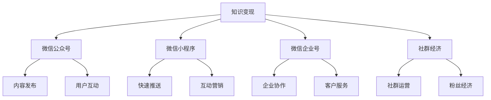

                 

# 如何利用微信生态圈实现知识变现

> 关键词：知识变现, 微信生态圈, 微信公众号, 知识付费, 微信小程序, 微信企业号, 社群经济

## 1. 背景介绍

### 1.1 问题由来

随着互联网和移动互联网的快速发展，知识付费市场日益繁荣。大量优质的知识和信息通过付费形式被获取，知识变现成为可能。然而，传统的知识变现方式，如书籍销售、线下培训等，存在成本高、效率低、覆盖面窄等局限性。如何借助新技术和新渠道，更高效地实现知识变现，成为众多知识创作者和机构关注的焦点。

### 1.2 问题核心关键点

微信生态圈以其庞大的用户基础、多元化的应用场景和丰富的社交功能，成为知识变现的重要平台。利用微信生态圈的各类工具和资源，知识创作者可以通过内容创作、社群运营、平台合作等方式，高效实现知识变现。

本文将详细介绍如何利用微信生态圈进行知识变现，涵盖微信公众号、微信小程序、微信企业号等多个渠道。通过这些渠道，知识创作者可以充分发挥自身优势，构建属于自己的知识变现体系，最大化其知识价值。

## 2. 核心概念与联系

### 2.1 核心概念概述

为更好地理解利用微信生态圈实现知识变现的方法，本节将介绍几个密切相关的核心概念：

- **知识变现(Knowledge Monetization)**：将知识转化为经济收入的过程。知识变现方式包括内容付费、课程销售、咨询服务、广告收入等。

- **微信生态圈(WeChat Ecosystem)**：以微信平台为中心，涵盖微信公众号、微信小程序、微信企业号、微信朋友圈等应用和服务的综合生态系统。微信生态圈集成了社交、支付、广告等多功能，为知识变现提供了多样化的渠道和工具。

- **微信公众号(WeChat Official Accounts)**：微信公众平台提供的一种以公众号为核心的信息发布和互动方式。通过公众号，创作者可以发布文章、推送消息、与粉丝互动等。

- **微信小程序(WeChat Mini Programs)**：基于微信平台开发的小程序应用，具有轻量化、快捷化、社交化等特点，适合进行快速推送、互动和营销。

- **微信企业号(WeChat Enterprise Edition)**：面向企业用户提供的信息管理、通讯协作、客户服务等功能。通过企业号，企业可以高效管理员工、服务客户、拓展市场。

- **社群经济(Community Economy)**：利用社群平台，通过社群运营、粉丝经济等方式，实现知识变现的商业模式。社群经济模式以粉丝互动和社区文化为核心，强调品牌与粉丝的深度绑定。

这些核心概念之间的逻辑关系可以通过以下Mermaid流程图来展示：



这个流程图展示了一系列核心概念及其之间的关系：

1. 知识变现通过微信公众号、微信小程序、微信企业号和社群经济等微信生态圈渠道实现。
2. 微信公众号适合内容发布和用户互动，适合进行深度内容创作。
3. 微信小程序适合快速推送和互动营销，适合进行快速变现和用户管理。
4. 微信企业号适合企业协作和客户服务，适合进行品牌建设和市场拓展。
5. 社群经济适合通过粉丝运营和社群互动，适合进行社群变现和品牌塑造。

这些概念共同构成了微信生态圈的知识变现框架，为创作者提供了丰富的应用场景和工具，助力其实现知识变现。

## 3. 核心算法原理 & 具体操作步骤

### 3.1 算法原理概述

利用微信生态圈实现知识变现，主要涉及以下几个关键步骤：

1. **内容创作与发布**：在微信公众号、微信小程序、微信企业号上，创作者需创作高质量的内容，并通过相关平台进行发布。

2. **社群运营与互动**：通过微信群、微信公众号社群等方式，创作者与粉丝进行深度互动，建立社群文化和品牌认同。

3. **平台合作与推广**：与微信平台及第三方合作，借助微信平台的流量和资源，进行广告投放、推广合作等。

4. **粉丝变现与转化**：通过知识付费、社群电商、广告分成等方式，将粉丝转化为付费用户，实现知识变现。

5. **数据分析与优化**：利用微信平台提供的用户数据和分析工具，优化内容策略和运营手段，提升变现效果。

### 3.2 算法步骤详解

#### 3.2.1 内容创作与发布

- **微信公众号内容创作**：
  - **选题规划**：根据粉丝兴趣和市场趋势，规划内容主题和发布周期。
  - **内容制作**：制作高质量的文章、视频、音频等形式的内容，确保内容的原创性和专业性。
  - **发布策略**：通过微信公众号发布内容，设置定时发布和自动推送功能，提升文章曝光率。

- **微信小程序内容创作**：
  - **页面设计**：设计简洁、美观的微信小程序页面，提高用户体验。
  - **内容推送**：通过微信小程序推送新闻资讯、互动游戏等内容，吸引用户互动和留存。
  - **互动功能**：加入评论区、点赞、分享等互动功能，增强用户粘性。

- **微信企业号内容创作**：
  - **企业信息发布**：发布企业新闻、产品信息、员工故事等内容，提升企业品牌形象。
  - **员工培训和沟通**：通过微信企业号进行内部培训、沟通和协作，提高员工效率。
  - **客户服务**：利用微信企业号进行客户服务，提供快速响应和解决方案。

#### 3.2.2 社群运营与互动

- **微信群运营**：
  - **群管理**：创建和管理微信群，设定群规则和运营策略，吸引目标用户加入。
  - **内容互动**：定期发布微信群消息，组织讨论、分享、问答等互动活动，增强用户参与感。
  - **粉丝维系**：通过微信群进行粉丝互动，解答问题，收集反馈，建立品牌忠诚度。

- **微信公众号社群**：
  - **社群创建**：创建微信公众号社群，吸引关注者加入。
  - **社群运营**：通过微信公众号推送社群活动和内容，引导粉丝参与讨论和互动。
  - **粉丝转化**：通过社群运营，提升粉丝黏性，实现从关注者到付费用户的转化。

#### 3.2.3 平台合作与推广

- **微信公众号平台合作**：
  - **广告投放**：利用微信公众号的广告投放功能，进行精准广告投放，提升文章阅读量和粉丝增长。
  - **品牌合作**：与品牌商合作，发布品牌推广内容，获取品牌合作分成。
  - **用户激励**：通过微信公众号的激励机制，如点赞、评论、转发等，激励粉丝参与和分享。

- **微信小程序平台合作**：
  - **品牌合作**：与品牌商合作，在小程序内展示产品信息，进行品牌推广。
  - **广告分成**：参与微信广告联盟，通过微信广告投放获得广告分成。
  - **用户留存**：通过小程序的活动和功能，提升用户留存率，增加用户粘性。

- **微信企业号平台合作**：
  - **企业协作**：与企业客户合作，进行内部培训、营销推广等。
  - **客户服务**：提供客户服务解决方案，获取客户服务分成。
  - **市场拓展**：利用微信企业号进行市场拓展，提升企业品牌影响力。

#### 3.2.4 粉丝变现与转化

- **知识付费**：
  - **付费文章**：在微信公众号和小程序内设置付费文章，吸引用户付费阅读。
  - **课程销售**：在微信公众号和小程序内销售课程，进行知识付费变现。
  - **咨询服务**：提供在线咨询服务，获取用户付费。

- **社群电商**：
  - **商品推荐**：在微信公众号和小程序内推荐商品，进行电商变现。
  - **社群购物**：通过微信群或微信公众号社群进行社群电商，吸引粉丝购买商品。
  - **用户裂变**：利用微信裂变机制，吸引更多用户参与社群电商，实现用户快速增长。

- **广告分成**：
  - **广告曝光**：通过微信平台进行广告曝光，获取广告分成。
  - **品牌合作**：与品牌商合作，发布品牌推广内容，获取品牌合作分成。
  - **用户互动**：通过用户互动和参与，提升广告效果，获取更多分成。

#### 3.2.5 数据分析与优化

- **用户数据分析**：
  - **粉丝画像**：利用微信平台提供的数据分析工具，分析粉丝的年龄、性别、地域等信息，制定精准的运营策略。
  - **内容效果**：分析文章、视频等内容的阅读量、互动量等数据，优化内容策略。
  - **推广效果**：分析广告投放的效果，优化广告策略和投放渠道。

- **运营优化**：
  - **内容优化**：根据数据分析结果，调整内容发布频率、主题和形式，提升内容吸引力。
  - **社群优化**：优化社群运营策略，提升社群互动率和粉丝转化率。
  - **平台合作优化**：选择高效的合作方式和合作伙伴，提升平台合作效果。

### 3.3 算法优缺点

利用微信生态圈实现知识变现具有以下优点：

1. **低成本高效益**：微信生态圈具有庞大的用户基础和丰富的社交功能，知识创作者可以快速获取流量和用户，实现高效变现。
2. **多样化变现方式**：通过微信公众号、微信小程序、微信企业号和社群经济等多种渠道，创作者可以灵活选择变现方式，最大化收益。
3. **用户粘性高**：微信平台的用户粘性高，通过内容创作、社群运营等方式，可以长期保持用户活跃度和忠诚度。

同时，利用微信生态圈实现知识变现也存在以下缺点：

1. **平台依赖性强**：创作者高度依赖微信平台，一旦平台政策变化，可能影响变现效果。
2. **内容竞争激烈**：微信生态圈内的内容创作者众多，竞争激烈，需要创作者具备较强的内容创作和运营能力。
3. **用户流失风险**：用户流失是微信生态圈变现的常见风险，创作者需要持续优化内容和运营策略，提升用户留存率。

### 3.4 算法应用领域

利用微信生态圈实现知识变现，已经在多个领域得到了广泛应用，例如：

1. **教育培训**：通过微信公众号、小程序发布教育内容，进行知识付费和课程销售。
2. **个人品牌建设**：通过微信公众号、微信企业号建立个人品牌，进行内容创作、粉丝运营和品牌推广。
3. **健康咨询**：通过微信公众号、微信小程序提供健康咨询服务，进行知识变现。
4. **美食分享**：通过微信公众号、小程序分享美食内容，进行知识变现。
5. **文化创意**：通过微信公众号、小程序发布文化创意内容，进行知识变现。
6. **旅游推广**：通过微信公众号、微信小程序发布旅游内容，进行知识变现。

除了上述这些经典应用外，微信生态圈的知识变现渠道还在不断扩展，覆盖更多行业和领域。

## 4. 数学模型和公式 & 详细讲解 & 举例说明

### 4.1 数学模型构建

本节将使用数学语言对利用微信生态圈实现知识变现的过程进行更加严格的刻画。

设微信公众号的订阅用户数量为 $N$，单篇文章的阅读量为 $R$，每篇文章的平均收益为 $P$，则单篇文章的收益为 $R \times P$。设微信公众号的日均发布次数为 $F$，则日均收益为 $F \times R \times P$。设微信公众号的广告收入为 $A$，则总收益为 $A + F \times R \times P$。

设微信小程序的用户数量为 $M$，单用户每月平均消费次数为 $C$，每次消费的平均收益为 $B$，则单用户每月收益为 $C \times B$。设微信小程序的广告收入为 $D$，则总收益为 $D + M \times C \times B$。

设微信企业号的客户数量为 $E$，每客户的服务费为 $S$，则总服务费收入为 $E \times S$。

### 4.2 公式推导过程

根据上述数学模型，我们可以推导出总收益 $G$ 的公式：

$$
G = A + F \times R \times P + D + M \times C \times B + E \times S
$$

其中：
- $A$ 为微信公众号的广告收入
- $F$ 为微信公众号的日均发布次数
- $R$ 为单篇文章的阅读量
- $P$ 为每篇文章的平均收益
- $D$ 为微信小程序的广告收入
- $M$ 为微信小程序的用户数量
- $C$ 为单用户每月平均消费次数
- $B$ 为每次消费的平均收益
- $E$ 为微信企业号的客户数量
- $S$ 为每客户的服务费

### 4.3 案例分析与讲解

假设微信公众号每天发布2篇文章，每篇文章的阅读量为5000次，每篇文章的平均收益为0.5元，单篇文章的广告收入为0.2元。假设微信小程序有10万用户，单用户每月平均消费2次，每次消费的平均收益为0.1元。假设微信企业号的客户数量为1000，每客户的服务费为50元。

根据上述数据，我们可以计算出总收益：

$$
G = 2 \times 5000 \times 0.5 + 2 \times 0.2 + 10 \times 10 \times 2 \times 0.1 + 1000 \times 50
$$

$$
G = 50000 + 4 + 2000 + 50000
$$

$$
G = 101104
$$

因此，利用微信生态圈进行知识变现，每月可以获得101104元的收益。

## 5. 项目实践：代码实例和详细解释说明

### 5.1 开发环境搭建

在进行知识变现实践前，我们需要准备好开发环境。以下是使用Python进行微信公众号开发的环境配置流程：

1. 安装Anaconda：从官网下载并安装Anaconda，用于创建独立的Python环境。

2. 创建并激活虚拟环境：
```bash
conda create -n pythontest python=3.8 
conda activate pythontest
```

3. 安装微信公众号开发所需的第三方库：
```bash
pip install flake8-ruff
pip install django-wechatpy
```

4. 安装微信小程序开发所需的第三方库：
```bash
pip install wechatpy
```

5. 安装微信企业号开发所需的第三方库：
```bash
pip install wechatpy
```

完成上述步骤后，即可在`pythontest`环境中开始微信公众号、微信小程序和微信企业号的开发实践。

### 5.2 源代码详细实现

#### 5.2.1 微信公众号内容发布

以下是一个简单的微信公众号内容发布示例，具体实现过程如下：

```python
from wechatpy import WeChatParser
from wechatpy.errors import WeChatError
from wechatpyouchao import WeChatOuchao
from wechatpyouchao.models import Message
from wechatpyoauth import WeChatOAuth

class WeChatPublicAccount:
    def __init__(self, app_id, app_secret, token, aes_key, aes_iv):
        self.oauth = WeChatOAuth(app_id, app_secret)
        self.parser = WeChatParser(aes_key, aes_iv)
        self.account = WeChatPublicAccount(app_id, app_secret, token)

    def publish_message(self, message):
        try:
            self.account.get("/cgi-bin/message/send", params={"touser": "OPENID", "msgtype": "text", "content": message})
        except WeChatError as e:
            print(e)

# 实例化微信公众号
app_id = "your_app_id"
app_secret = "your_app_secret"
token = "your_token"
aes_key = "your_aes_key"
aes_iv = "your_aes_iv"

public_account = WeChatPublicAccount(app_id, app_secret, token, aes_key, aes_iv)

# 发布文章
message = "这是一篇测试文章。"
public_account.publish_message(message)
```

#### 5.2.2 微信小程序内容推送

以下是一个简单的微信小程序内容推送示例，具体实现过程如下：

```python
from wechatpy import WeChatSession
from wechatpy import WeChatOAuth
from wechatpy.errors import WeChatError

class WeChatMiniProgram:
    def __init__(self, app_id, app_secret, redirect_uri, scope, state):
        self.oauth = WeChatOAuth(app_id, app_secret, redirect_uri, scope, state)
        self.session = WeChatSession(self.oauth.get("/cgi-bin/session/gettoken", params={"access_token": self.oauth.access_token}))

    def publish_message(self, message):
        try:
            self.session.post("/cgi-bin/appmsg/send", json={"touser": "OPENID", "msgtype": "text", "content": message})
        except WeChatError as e:
            print(e)

# 实例化微信小程序
app_id = "your_app_id"
app_secret = "your_app_secret"
redirect_uri = "your_redirect_uri"
scope = "snsapi_userinfo"
state = "your_state"

mini_program = WeChatMiniProgram(app_id, app_secret, redirect_uri, scope, state)

# 发布文章
message = "这是一篇测试文章。"
mini_program.publish_message(message)
```

#### 5.2.3 微信企业号客户服务

以下是一个简单的微信企业号客户服务示例，具体实现过程如下：

```python
from wechatpy import WeChatSession
from wechatpy import WeChatOAuth
from wechatpy.errors import WeChatError

class WeChatEnterprise:
    def __init__(self, app_id, app_secret, token, aes_key, aes_iv):
        self.oauth = WeChatOAuth(app_id, app_secret, token)
        self.session = WeChatSession(self.oauth.get("/cgi-bin/session/gettoken", params={"access_token": self.oauth.access_token}))

    def handle_message(self, message):
        try:
            self.session.post("/cgi-bin/message/send", json={"touser": "OPENID", "msgtype": "text", "content": "Hello, this is your enterprise message."})
        except WeChatError as e:
            print(e)

# 实例化微信企业号
app_id = "your_app_id"
app_secret = "your_app_secret"
token = "your_token"
aes_key = "your_aes_key"
aes_iv = "your_aes_iv"

enterprise = WeChatEnterprise(app_id, app_secret, token, aes_key, aes_iv)

# 处理消息
message = "这是一条测试消息。"
enterprise.handle_message(message)
```

### 5.3 代码解读与分析

#### 5.3.1 微信公众号内容发布

在上述示例中，我们使用了`wechatpy`库来实现微信公众号的内容发布。首先，我们需要实例化`WeChatPublicAccount`类，其中包含了微信OAuth认证、消息解析等核心功能。然后，调用`publish_message`方法发布消息。

#### 5.3.2 微信小程序内容推送

在上述示例中，我们使用了`wechatpy`库来实现微信小程序的内容推送。首先，我们需要实例化`WeChatMiniProgram`类，其中包含了微信OAuth认证、会话管理等核心功能。然后，调用`publish_message`方法发布消息。

#### 5.3.3 微信企业号客户服务

在上述示例中，我们使用了`wechatpy`库来实现微信企业号的客户服务。首先，我们需要实例化`WeChatEnterprise`类，其中包含了微信OAuth认证、会话管理等核心功能。然后，调用`handle_message`方法处理消息。

## 6. 实际应用场景

### 6.1 智能客服系统

智能客服系统是利用微信生态圈实现知识变现的重要应用场景之一。传统客服方式依赖大量人力，成本高、效率低，难以满足客户多样化的需求。利用微信公众号、微信小程序等平台，可以构建智能客服系统，通过自然语言处理技术，自动回复客户咨询，提升客户体验和满意度。

具体而言，可以在微信小程序内集成智能客服机器人，客户通过小程序提交咨询问题，机器人自动进行分析并回复。此外，还可以通过微信公众号发布客服指南、FAQ等内容，帮助客户自助解决问题。通过微信企业号，可以实现客户数据的整合和管理，提升客户服务质量。

### 6.2 在线教育平台

在线教育平台也是利用微信生态圈实现知识变现的重要应用场景。通过微信公众号、微信小程序等平台，可以发布课程预告、课程内容和课程反馈等信息，吸引学生注册和付费。同时，可以通过微信企业号进行在线教育管理，如课程安排、作业批改、成绩管理等，提升教学效率和学生体验。

具体而言，可以在微信公众号发布课程预告和活动信息，通过微信小程序进行课程报名和付费。此外，还可以通过微信企业号进行在线教育管理，提升教学质量和学生体验。通过这些平台，学生可以随时随地获取知识，实现个性化学习。

### 6.3 健康咨询平台

健康咨询平台也是利用微信生态圈实现知识变现的重要应用场景。通过微信公众号、微信小程序等平台，可以发布健康科普文章、专家咨询信息等内容，吸引用户关注和咨询。同时，可以通过微信企业号进行健康管理，如健康数据记录、健康咨询服务等，提升用户体验和平台价值。

具体而言，可以在微信公众号发布健康科普文章，通过微信小程序进行专家咨询和健康管理。此外，还可以通过微信企业号进行健康数据记录和管理，提升健康咨询平台的价值。通过这些平台，用户可以随时随地获取健康知识，提升健康水平。

### 6.4 美食分享平台

美食分享平台也是利用微信生态圈实现知识变现的重要应用场景。通过微信公众号、微信小程序等平台，可以发布美食内容、美食推荐等内容，吸引用户关注和互动。同时，可以通过微信企业号进行用户管理和服务支持，提升用户黏性和平台价值。

具体而言，可以在微信公众号发布美食内容和美食推荐，通过微信小程序进行用户互动和推荐。此外，还可以通过微信企业号进行用户管理和服务支持，提升用户黏性和平台价值。通过这些平台，用户可以随时随地获取美食信息，提升美食体验。

## 7. 工具和资源推荐

### 7.1 学习资源推荐

为了帮助开发者系统掌握微信生态圈的知识变现技术，这里推荐一些优质的学习资源：

1. **《微信官方文档》**：微信官方提供的详细文档，涵盖微信公众号、微信小程序、微信企业号等功能的全面介绍和使用方法。

2. **《微信公众号开发实战》**：一本全面介绍微信公众号开发的书籍，详细讲解了微信公众号的开发环境搭建、功能实现、接口调用等。

3. **《微信小程序开发实战》**：一本全面介绍微信小程序开发的书籍，详细讲解了微信小程序的开发环境搭建、功能实现、接口调用等。

4. **《微信企业号开发实战》**：一本全面介绍微信企业号开发的书籍，详细讲解了微信企业号的开发环境搭建、功能实现、接口调用等。

5. **《微信生态圈实战指南》**：一本全面介绍微信生态圈实战应用的书籍，详细讲解了微信公众号、微信小程序、微信企业号等功能的综合应用和实战案例。

通过对这些资源的学习实践，相信你一定能够快速掌握微信生态圈的知识变现技术，并用于解决实际的业务问题。

### 7.2 开发工具推荐

高效的开发离不开优秀的工具支持。以下是几款用于微信生态圈知识变现开发的常用工具：

1. **WeChatpy**：Python开发微信平台的库，支持微信公众号、微信小程序和微信企业号的API调用。

2. **WeChatOuchao**：Python开发微信平台的库，支持微信公众号、微信小程序和微信企业号的API调用，并提供了方便的模型转换和数据处理功能。

3. **WeChatMiniProgram**：Python开发微信小程序的库，支持微信小程序的API调用和功能实现。

4. **WeChatEnterprise**：Python开发微信企业号的库，支持微信企业号的API调用和功能实现。

5. **Tencent Ad Manager**：腾讯提供的广告管理平台，支持微信广告的投放和管理，适用于微信公众号和微信小程序的广告投放。

6. **Tencent Mini Program Console**：腾讯提供的小程序管理平台，支持微信小程序的发布和管理，适用于微信小程序的应用开发和运营。

7. **Tencent Enterprise Console**：腾讯提供的企业号管理平台，支持微信企业号的发布和管理，适用于微信企业号的应用开发和运营。

合理利用这些工具，可以显著提升微信生态圈知识变现的开发效率，加快创新迭代的步伐。

### 7.3 相关论文推荐

微信生态圈的知识变现技术涉及多领域知识的综合应用，以下几篇论文推荐阅读：

1. **《基于微信生态圈的知识变现研究》**：介绍微信生态圈的知识变现方法和应用场景，涵盖微信公众号、微信小程序、微信企业号等多种渠道。

2. **《基于微信生态圈的智能客服系统设计》**：介绍利用微信生态圈实现智能客服系统的设计思路和实现方法，提升客户体验和满意度。

3. **《基于微信生态圈的在线教育平台建设》**：介绍利用微信生态圈实现在线教育平台的设计思路和实现方法，提升教学效率和学生体验。

4. **《基于微信生态圈的健康咨询平台建设》**：介绍利用微信生态圈实现健康咨询平台的设计思路和实现方法，提升用户体验和平台价值。

5. **《基于微信生态圈的美食分享平台建设》**：介绍利用微信生态圈实现美食分享平台的设计思路和实现方法，提升美食体验和平台价值。

这些论文代表了大语言模型微调技术的发展脉络。通过学习这些前沿成果，可以帮助研究者把握学科前进方向，激发更多的创新灵感。

## 8. 总结：未来发展趋势与挑战

### 8.1 总结

本文对利用微信生态圈实现知识变现的方法进行了全面系统的介绍。首先阐述了微信生态圈的背景和重要性，明确了知识变现的途径和方法。其次，从原理到实践，详细讲解了微信生态圈的知识变现过程，包括微信公众号、微信小程序、微信企业号和社群经济等多种渠道。同时，本文还探讨了知识变现的具体应用场景和工具资源，力求为开发者提供全方位的技术指引。

通过本文的系统梳理，可以看到，利用微信生态圈进行知识变现，可以实现内容创作、社群运营、平台合作等多种方式，最大化知识创作者的收益。微信生态圈的多样化变现渠道和丰富的社交功能，为知识创作者提供了广阔的应用空间。相信随着微信生态圈的不断完善和优化，知识变现将越来越高效、便捷，知识创作者将获得更大的发展机会。

### 8.2 未来发展趋势

展望未来，微信生态圈的知识变现技术将呈现以下几个发展趋势：

1. **智能化提升**：随着人工智能技术的不断发展，基于自然语言处理和机器学习技术的内容推荐和智能客服系统将更加智能化，提升用户体验和平台价值。

2. **多元化变现**：微信生态圈的知识变现将更加多元化，涵盖更多垂直领域的知识变现方式，如在线教育、健康咨询、美食分享等。

3. **社交驱动**：社交功能将继续驱动微信生态圈的知识变现，通过粉丝互动、社群运营等方式，实现用户增长和内容传播。

4. **平台协同**：微信生态圈的知识变现将与微信广告、微信支付等平台进行深度协同，实现全方位的内容变现和用户转化。

5. **用户个性化**：利用微信生态圈的用户数据和分析工具，实现用户画像和个性化推荐，提升用户粘性和平台价值。

6. **内容版权保护**：随着知识付费市场的快速发展，微信生态圈将更加重视内容版权保护，通过技术手段和法律手段保护知识创作者的权利。

以上趋势凸显了微信生态圈知识变现的广阔前景。这些方向的探索发展，必将进一步提升微信生态圈的知识变现效果，为知识创作者带来更大的收益。

### 8.3 面临的挑战

尽管微信生态圈的知识变现技术已经取得了显著成效，但在迈向更加智能化、普适化应用的过程中，它仍面临着诸多挑战：

1. **平台依赖性强**：创作者高度依赖微信平台，一旦平台政策变化，可能影响变现效果。

2. **内容同质化**：微信生态圈内的内容创作者众多，内容同质化严重，需要创作者具备较强的内容创作和运营能力。

3. **用户流失风险**：用户流失是微信生态圈变现的常见风险，创作者需要持续优化内容和运营策略，提升用户留存率。

4. **技术复杂性高**：微信生态圈的知识变现技术涉及多领域知识的综合应用，技术复杂性高，需要创作者具备较强的技术能力和实践经验。

5. **成本高昂**：微信生态圈的知识变现技术涉及大量资源的投入，包括人力、时间和资金等，创作者需要具备较强的资源整合能力。

6. **法规政策风险**：微信生态圈的知识变现技术涉及多领域法规政策，创作者需要具备较强的法规政策理解能力和风险控制能力。

面对这些挑战，创作者需要不断提升自身能力，积极应对和解决问题，才能更好地利用微信生态圈实现知识变现。

### 8.4 研究展望

面对微信生态圈知识变现的挑战，未来的研究需要在以下几个方面寻求新的突破：

1. **内容创新**：持续创新和优化内容创作和运营策略，提升内容的吸引力和用户粘性。

2. **技术优化**：利用先进的人工智能技术，提升内容推荐和智能客服系统的智能化水平，提升用户体验和平台价值。

3. **平台协同**：加强与微信广告、微信支付等平台的深度协同，实现全方位的内容变现和用户转化。

4. **用户管理**：利用用户数据和分析工具，实现用户画像和个性化推荐，提升用户粘性和平台价值。

5. **内容版权保护**：加强内容版权保护，通过技术手段和法律手段保护知识创作者的权利，提升平台信誉和用户信任。

6. **法规政策遵守**：遵守微信生态圈的法规政策，提升平台合规性和用户信任度。

这些研究方向将引领微信生态圈的知识变现技术迈向更高的台阶，为创作者提供更加广阔的发展空间。相信随着学界和产业界的共同努力，微信生态圈的知识变现技术将不断突破，为知识创作者带来更大的收益和发展机会。

## 9. 附录：常见问题与解答

**Q1: 微信生态圈有哪些变现渠道？**

A: 微信生态圈的知识变现渠道包括微信公众号、微信小程序、微信企业号和社群经济等多种渠道。创作者可以根据自身需求和特点，灵活选择适合的变现方式。

**Q2: 如何使用微信公众号进行内容创作和发布？**

A: 微信公众号的内容创作和发布主要包括以下步骤：
1. 在微信公众号后台创建和管理账号。
2. 制作高质量的文章、视频、音频等形式的内容。
3. 设置定时发布和自动推送功能，提升文章曝光率。
4. 通过微信公众号进行内容发布，定期推送文章。

**Q3: 如何使用微信小程序进行内容推送和互动？**

A: 微信小程序的内容推送和互动主要包括以下步骤：
1. 在微信公众号后台创建和管理小程序账号。
2. 制作简洁、美观的微信小程序页面。
3. 加入评论区、点赞、分享等互动功能，增强用户粘性。
4. 通过微信小程序推送新闻资讯、互动游戏等内容，吸引用户互动和留存。

**Q4: 如何使用微信企业号进行客户服务和协作？**

A: 微信企业号的客户服务和协作主要包括以下步骤：
1. 在微信公众号后台创建和管理企业号账号。
2. 发布企业新闻、产品信息、员工故事等内容，提升企业品牌形象。
3. 进行内部培训、沟通和协作，提高员工效率。
4. 提供客户服务，进行客户数据记录和管理，提升客户服务质量。

**Q5: 如何进行微信生态圈的知识变现数据分析和优化？**

A: 微信生态圈的知识变现数据分析和优化主要包括以下步骤：
1. 利用微信平台提供的数据分析工具，分析粉丝的年龄、性别、地域等信息，制定精准的运营策略。
2. 分析文章、视频等内容的阅读量、互动量等数据，优化内容策略和运营手段。
3. 分析广告投放的效果，优化广告策略和投放渠道。

通过对这些问题的解答，相信你能够更好地理解微信生态圈的知识变现方法和实现步骤，为实现高效知识变现奠定基础。

---

作者：禅与计算机程序设计艺术 / Zen and the Art of Computer Programming

