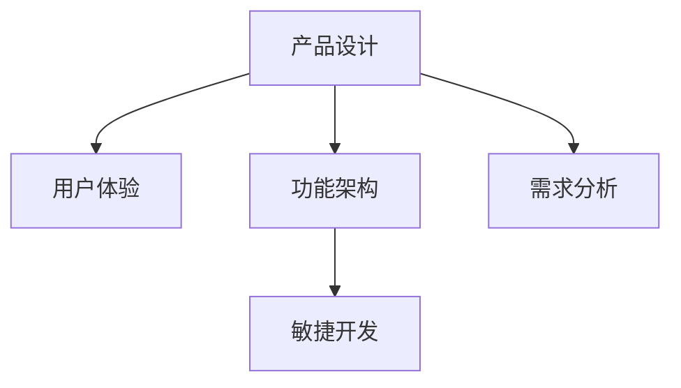

                 

# 如何利用技术能力进行产品设计

> 关键词：产品设计,技术能力,用户体验,功能架构,需求分析

## 1. 背景介绍

### 1.1 问题由来

在当今信息爆炸和技术快速发展的时代，企业之间的竞争不仅仅是产品功能和技术实力的较量，更是对用户体验和设计质量的深度比拼。技术的核心在于创新和应用，而产品设计则是技术的直观体现，直接影响用户体验和市场竞争力。因此，如何高效利用技术能力进行产品设计，成为了企业竞争的关键环节。

### 1.2 问题核心关键点

产品设计涉及技术、商业、用户体验等多个方面，如何整合各方资源，发挥技术优势，实现高效设计，是每个产品设计师和CTO必须面对的核心问题。

- **技术驱动：**利用最新的技术手段，实现产品功能的创新和优化。
- **用户体验：**在设计过程中重视用户需求，确保产品的易用性和满意度。
- **功能架构：**合理规划功能模块和数据架构，确保系统稳定和扩展性。
- **需求分析：**明确产品目标和用户需求，制定详细的产品路线图。

## 2. 核心概念与联系

### 2.1 核心概念概述

为更好地理解如何利用技术能力进行产品设计，本节将介绍几个密切相关的核心概念：

- **产品设计(Design)：**包括功能设计、交互设计、视觉设计等多个方面，是技术手段与用户需求结合的产物。
- **用户体验(User Experience, UX)：**指用户在使用产品过程中，体验到的所有正面和负面感受的总和，是产品设计的核心目标。
- **功能架构(Architecture)：**指产品功能模块的组织结构和数据流向，是技术实现的基础框架。
- **需求分析(Requirements Analysis)：**指从用户需求和业务目标出发，明确产品的功能规格和技术需求，是产品设计的起点。
- **敏捷开发(Agile Development)：**指通过迭代和快速交付，实现产品持续优化和适应市场变化。

这些核心概念之间的逻辑关系可以通过以下Mermaid流程图来展示：



这个流程图展示了几大核心概念之间的联系：

1. 用户体验是产品设计的最终目标。
2. 功能架构是技术实现的基础。
3. 需求分析是产品设计的起点。
4. 敏捷开发是实现持续优化的方法。

## 3. 核心算法原理 & 具体操作步骤
### 3.1 算法原理概述

产品设计的核心算法原理是基于用户需求和功能需求的匹配，通过技术和设计手段的协同优化，最终实现满足用户体验和业务目标的产品。

具体来说，产品设计可以分为以下几个关键步骤：

- **需求获取与分析：**通过市场调研、用户访谈等方式获取用户需求，并结合业务目标进行需求分析，明确产品功能模块和技术需求。
- **功能设计：**根据需求分析结果，设计功能架构和数据模型，确保系统稳定和扩展性。
- **交互设计：**设计用户界面和交互流程，确保用户操作的易用性和直观性。
- **视觉设计：**设计产品的视觉元素和样式，提升产品的美观度和品牌感。
- **原型测试：**通过用户测试和反馈，不断优化和改进产品设计。

### 3.2 算法步骤详解

以下将详细介绍产品设计各阶段的具体操作步骤：

**Step 1: 需求获取与分析**

- **市场调研：**收集和分析市场数据，了解行业趋势和用户需求。
- **用户访谈：**与目标用户进行深度访谈，了解其真实需求和痛点。
- **需求梳理：**将收集到的需求进行分类和整理，形成明确的功能规格。
- **优先级排序：**根据业务目标和用户价值，对需求进行优先级排序，确定产品开发的优先级。

**Step 2: 功能设计**

- **功能规划：**基于需求分析结果，设计产品的主要功能模块，确保功能完整性和独立性。
- **数据架构：**设计数据模型和存储架构，确保数据一致性和安全性。
- **技术选型：**选择合适的技术栈和开发工具，确保系统开发的高效性和可扩展性。

**Step 3: 交互设计**

- **界面原型：**设计产品的界面原型，包括按钮、菜单、对话框等交互元素。
- **交互流程：**设计用户的操作流程，确保操作顺畅和易于理解。
- **用户测试：**通过用户测试和反馈，优化交互设计和操作流程。

**Step 4: 视觉设计**

- **色彩搭配：**选择符合品牌定位和用户喜好的色彩方案。
- **字体选择：**选择易于阅读和品牌一致的字体。
- **元素布局：**设计产品的元素布局，确保视觉美观和用户体验一致。

**Step 5: 原型测试**

- **用户测试：**通过用户测试和反馈，评估产品的易用性和功能性。
- **优化改进：**根据用户反馈，优化和改进产品设计。
- **版本迭代：**通过迭代开发，持续优化产品性能和用户体验。

### 3.3 算法优缺点

产品设计算法具有以下优点：

- **用户导向：**通过市场调研和用户访谈，确保产品设计紧密结合用户需求。
- **技术协同：**功能设计、交互设计、视觉设计等多方面的协同优化，提升产品性能和用户体验。
- **灵活性高：**敏捷开发和迭代测试，使产品能够快速适应市场变化和用户需求。

同时，该算法也存在一定的局限性：

- **成本较高：**需求分析和功能设计需要大量时间和资源投入。
- **设计复杂：**功能模块和交互流程的设计复杂，需要高度的专业技能。
- **迭代周期长：**用户测试和版本迭代需要较长的周期，影响产品上市时间。

尽管存在这些局限性，但产品设计算法仍然是最主流的产品开发范式，其科学性和系统性在短期内难以被其他方法取代。

### 3.4 算法应用领域

基于产品设计算法的产品设计，广泛应用于软件、硬件、互联网等多个领域，例如：

- **软件开发：**如Web应用、移动应用、桌面应用等。通过需求分析、功能设计、交互设计、视觉设计等步骤，实现满足用户需求的软件产品。
- **硬件设计：**如智能家居、物联网设备等。通过需求分析、功能设计、交互设计、视觉设计等步骤，实现符合用户需求和市场趋势的硬件产品。
- **互联网应用：**如电子商务、社交网络、在线教育等。通过需求分析、功能设计、交互设计、视觉设计等步骤，实现具备强大用户体验和用户粘性的互联网产品。

除了上述这些经典应用领域外，产品设计算法也被创新性地应用到更多场景中，如可穿戴设备、智能办公、智能家居等，为各行各业带来了新的创新方向。

## 4. 数学模型和公式 & 详细讲解 & 举例说明
### 4.1 数学模型构建

产品设计的数学模型主要包括以下几个方面：

- **需求模型：**描述用户需求和功能规格的数学表达式。
- **功能模型：**描述产品功能和数据架构的数学表达式。
- **交互模型：**描述用户操作和界面元素的数学表达式。
- **视觉模型：**描述产品视觉元素和样式的数学表达式。

以下以Web应用设计为例，构建数学模型：

**需求模型：**

假设用户需求为"让用户方便地查找和阅读技术文章"，数学模型可以表示为：

$$
\text{需求} = \text{易用性} + \text{功能全面性}
$$

其中，易用性表示用户操作的直观性和顺畅性，功能全面性表示功能模块的完整性和独立性。

**功能模型：**

假设功能模块包括"文章浏览"、"文章搜索"、"用户注册/登录"等，数学模型可以表示为：

$$
\text{功能} = \text{文章浏览} + \text{文章搜索} + \text{用户注册/登录}
$$

其中，各功能模块互不干扰，独立实现。

**交互模型：**

假设交互流程包括"用户登录"、"文章浏览"、"文章搜索"、"用户注册/登录"等，数学模型可以表示为：

$$
\text{交互} = \text{用户登录} \rightarrow \text{文章浏览} \rightarrow \text{文章搜索} \rightarrow \text{用户注册/登录}
$$

其中，箭头表示操作顺序，确保交互顺畅。

**视觉模型：**

假设视觉元素包括页面布局、颜色搭配、字体选择等，数学模型可以表示为：

$$
\text{视觉} = \text{页面布局} \times \text{颜色搭配} \times \text{字体选择}
$$

其中，乘号表示各元素相乘，确保视觉美观和一致性。

### 4.2 公式推导过程

以下是各数学模型的推导过程：

**需求模型：**

假设用户需求为"让用户方便地查找和阅读技术文章"，可以将其分解为易用性和功能全面性两部分：

$$
\text{需求} = \text{易用性} + \text{功能全面性}
$$

其中，易用性表示用户操作的直观性和顺畅性，功能全面性表示功能模块的完整性和独立性。

**功能模型：**

假设功能模块包括"文章浏览"、"文章搜索"、"用户注册/登录"等，可以将其分解为各个独立功能模块：

$$
\text{功能} = \text{文章浏览} + \text{文章搜索} + \text{用户注册/登录}
$$

其中，各功能模块互不干扰，独立实现。

**交互模型：**

假设交互流程包括"用户登录"、"文章浏览"、"文章搜索"、"用户注册/登录"等，可以表示为一系列的操作顺序：

$$
\text{交互} = \text{用户登录} \rightarrow \text{文章浏览} \rightarrow \text{文章搜索} \rightarrow \text{用户注册/登录}
$$

其中，箭头表示操作顺序，确保交互顺畅。

**视觉模型：**

假设视觉元素包括页面布局、颜色搭配、字体选择等，可以表示为各元素的组合：

$$
\text{视觉} = \text{页面布局} \times \text{颜色搭配} \times \text{字体选择}
$$

其中，乘号表示各元素相乘，确保视觉美观和一致性。

### 4.3 案例分析与讲解

以下以Web应用设计为例，进行案例分析：

**需求分析：**

假设用户需求为"让用户方便地查找和阅读技术文章"，通过市场调研和用户访谈，获取以下需求：

- 用户需要方便地搜索技术文章。
- 用户需要阅读和保存技术文章。
- 用户需要创建和发布技术文章。

**功能设计：**

基于需求分析结果，设计以下功能模块：

- 文章浏览：用户可以浏览和管理技术文章。
- 文章搜索：用户可以通过关键词搜索技术文章。
- 用户注册/登录：用户可以创建和管理账户信息。

**交互设计：**

设计以下交互流程：

- 用户首先进行注册或登录。
- 用户在首页浏览技术文章列表。
- 用户点击文章标题进入文章详情页。
- 用户可以通过搜索框搜索技术文章。

**视觉设计：**

设计以下视觉元素：

- 页面布局：采用清晰的单栏布局，确保用户操作直观。
- 颜色搭配：使用品牌色和柔和的配色方案，提升视觉美观。
- 字体选择：选择易读和一致的字体，确保用户体验。

## 5. 项目实践：代码实例和详细解释说明
### 5.1 开发环境搭建

在进行产品设计实践前，我们需要准备好开发环境。以下是使用Python进行Flask框架开发的环境配置流程：

1. 安装Anaconda：从官网下载并安装Anaconda，用于创建独立的Python环境。

2. 创建并激活虚拟环境：
```bash
conda create -n flask-env python=3.8 
conda activate flask-env
```

3. 安装Flask：
```bash
conda install flask
```

4. 安装SQLite：
```bash
conda install sqlite
```

5. 安装Flask-SQLAlchemy：
```bash
pip install Flask-SQLAlchemy
```

6. 安装Flask-WTF：
```bash
pip install Flask-WTF
```

7. 安装Flask-Login：
```bash
pip install Flask-Login
```

8. 安装Flask-Mail：
```bash
pip install Flask-Mail
```

完成上述步骤后，即可在`flask-env`环境中开始项目开发。

### 5.2 源代码详细实现

这里我们以Web应用为例，使用Flask框架进行产品设计。

首先，定义应用的基本配置和路由：

```python
from flask import Flask, render_template, request, redirect, url_for
from flask_sqlalchemy import SQLAlchemy
from flask_login import LoginManager, UserMixin, login_user, logout_user, login_required
from flask_mail import Mail

app = Flask(__name__)
app.config['SECRET_KEY'] = 'mysecretkey'
app.config['SQLALCHEMY_DATABASE_URI'] = 'sqlite:///app.db'
app.config['MAIL_SERVER'] = 'smtp.gmail.com'
app.config['MAIL_PORT'] = 465
app.config['MAIL_USERNAME'] = 'yourusername'
app.config['MAIL_PASSWORD'] = 'yourpassword'
app.config['MAIL_USE_TLS'] = False
app.config['MAIL_USE_SSL'] = True
app.config['SQLALCHEMY_TRACK_MODIFICATIONS'] = False

db = SQLAlchemy(app)
login_manager = LoginManager(app)
mail = Mail(app)

@login_manager.user_loader
def load_user(user_id):
    return User.query.get(int(user_id))

class User(UserMixin, db.Model):
    id = db.Column(db.Integer, primary_key=True)
    username = db.Column(db.String(15), unique=True, nullable=False)
    email = db.Column(db.String(120), unique=True, nullable=False)
    password = db.Column(db.String(60), nullable=False)
    posts = db.relationship('Post', backref='author', lazy=True)

class Post(db.Model):
    id = db.Column(db.Integer, primary_key=True)
    title = db.Column(db.String(120), nullable=False)
    content = db.Column(db.Text, nullable=False)
    date_posted = db.Column(db.DateTime, nullable=False, default=datetime.utcnow)
    user_id = db.Column(db.Integer, db.ForeignKey('user.id'), nullable=False)

@app.route('/')
def home():
    posts = Post.query.all()
    return render_template('home.html', posts=posts)

@app.route('/login', methods=['GET', 'POST'])
def login():
    if request.method == 'POST':
        username = request.form.get('username')
        password = request.form.get('password')
        user = User.query.filter_by(username=username).first()
        if user and check_password_hash(user.password, password):
            login_user(user)
            return redirect(url_for('home'))
        else:
            flash('Invalid username or password', 'danger')
    return render_template('login.html')

@app.route('/logout')
@login_required
def logout():
    logout_user()
    return redirect(url_for('home'))

@app.route('/register', methods=['GET', 'POST'])
def register():
    if request.method == 'POST':
        username = request.form.get('username')
        email = request.form.get('email')
        password = request.form.get('password')
        user = User(username=username, email=email, password=hash_password(password))
        db.session.add(user)
        db.session.commit()
        flash('Your account has been created! You are now able to log in', 'success')
        return redirect(url_for('login'))
    return render_template('register.html')

@app.route('/post', methods=['POST'])
@login_required
def create_post():
    title = request.form.get('title')
    content = request.form.get('content')
    post = Post(title=title, content=content, author=current_user)
    db.session.add(post)
    db.session.commit()
    flash('Your post has been created!', 'success')
    return redirect(url_for('home'))
```

然后，定义数据库模型和视图：

```python
from datetime import datetime
from flask_login import current_user
from flask_mail import Message

class Post(db.Model):
    id = db.Column(db.Integer, primary_key=True)
    title = db.Column(db.String(120), nullable=False)
    content = db.Column(db.Text, nullable=False)
    date_posted = db.Column(db.DateTime, nullable=False, default=datetime.utcnow)
    user_id = db.Column(db.Integer, db.ForeignKey('user.id'), nullable=False)

@app.route('/post/<int:post_id>')
@login_required
def post(post_id):
    post = Post.query.get_or_404(post_id)
    return render_template('post.html', title=post.title, content=post.content)

@app.route('/post/new', methods=['GET', 'POST'])
@login_required
def new_post():
    form = PostForm()
    if form.validate_on_submit():
        post = Post(title=form.title.data, content=form.content.data, author=current_user)
        db.session.add(post)
        db.session.commit()
        flash('Your post has been created!', 'success')
        return redirect(url_for('home'))
    return render_template('create_post.html', title='Create New Post', form=form)
```

接着，定义登录表单和邮件发送：

```python
from flask_wtf import FlaskForm
from wtforms import StringField, PasswordField, SubmitField, TextAreaField
from wtforms.validators import DataRequired, Length, Email, EqualTo

class PostForm(FlaskForm):
    title = StringField('Title', validators=[DataRequired(), Length(max=120)])
    content = TextAreaField('Content', validators=[DataRequired()])
    submit = SubmitField('Submit')

class LoginForm(FlaskForm):
    username = StringField('Username', validators=[DataRequired(), Length(min=2, max=15)])
    password = PasswordField('Password', validators=[DataRequired()])
    submit = SubmitField('Sign In')

class RegistrationForm(FlaskForm):
    username = StringField('Username', validators=[DataRequired(), Length(min=2, max=15)])
    email = StringField('Email', validators=[DataRequired(), Email()])
    password = PasswordField('Password', validators=[DataRequired()])
    confirm_password = PasswordField('Confirm Password', validators=[DataRequired(), EqualTo('password')])
    submit = SubmitField('Sign Up')
```

最后，启动应用：

```python
if __name__ == '__main__':
    app.run(debug=True)
```

以上就是使用Flask框架进行Web应用设计的基本代码实现。可以看到，Flask的路由、模板、表单等功能非常强大，可以轻松实现复杂的交互逻辑和页面展示。

### 5.3 代码解读与分析

让我们再详细解读一下关键代码的实现细节：

**应用配置和路由：**

- `app.config`：配置Flask应用的各种参数，如SECRET_KEY、SQLALCHEMY_DATABASE_URI、MAIL_SERVER等。
- `db`：初始化SQLAlchemy数据库。
- `login_manager`：配置Flask-Login插件，实现用户登录和退出逻辑。
- `login_required`：定义需要登录才能访问的路由。

**数据库模型：**

- `User`类：用户信息表，包括用户名、邮箱、密码等字段。
- `Post`类：文章信息表，包括标题、内容、发布时间、作者ID等字段。

**视图函数：**

- `home`：首页视图，查询所有文章。
- `login`：登录视图，获取用户名和密码，登录用户。
- `logout`：退出视图，注销用户。
- `register`：注册视图，获取用户名、邮箱和密码，注册新用户。
- `create_post`：创建文章视图，获取标题和内容，创建新文章。

**表单处理：**

- `PostForm`：创建文章表单，包括标题和内容。
- `LoginForm`：登录表单，包括用户名和密码。
- `RegistrationForm`：注册表单，包括用户名、邮箱和密码。

**邮件发送：**

- `Message`：定义邮件内容，包括收件人、发件人、主题、正文等。
- `Mail.send()`：发送邮件。

**启动应用：**

- `if __name__ == '__main__'`：判断当前文件是否为直接运行，运行应用。

通过这段代码实现，可以看到Flask框架在Web应用设计中的强大功能和便捷性，可以显著提高开发效率和系统性能。

当然，在实际应用中，还需要根据具体需求进行进一步的扩展和优化，如引入缓存机制、使用API接口、优化表单验证等，以满足复杂的业务场景和用户体验要求。

## 6. 实际应用场景

### 6.1 智能推荐系统

基于产品设计算法的智能推荐系统，可以广泛应用于电商平台、内容平台等多个领域，为用户提供个性化推荐服务。

具体而言，可以收集用户的历史行为数据，包括浏览记录、购买记录、评分记录等，通过产品设计算法，设计推荐算法和数据架构，实现个性化的商品推荐和内容推荐。

在技术实现上，可以采用协同过滤、内容推荐、深度学习等算法，对用户行为和商品属性进行建模，并结合用户画像和场景信息，优化推荐结果。同时，可以使用用户测试和反馈，不断迭代和优化推荐算法，提升用户体验和满意度。

### 6.2 移动应用设计

移动应用设计的核心是实现用户操作流畅和界面美观，为用户提供便捷和愉悦的使用体验。

在产品设计中，需要结合用户界面设计、交互流程设计、视觉设计等步骤，实现移动应用的完整功能和良好用户体验。具体实现中，可以使用原生开发（如Swift、Kotlin等）或跨平台框架（如React Native、Flutter等）进行开发。

以Flutter为例，可以设计美观的UI组件和动画效果，优化交互流程和性能，确保移动应用在各种设备上的稳定性和流畅性。同时，可以通过用户测试和反馈，不断优化和改进移动应用的设计，提升用户体验和应用留存率。

### 6.3 大数据分析平台

大数据分析平台的设计需要综合考虑数据的采集、存储、处理和展示等多个方面，确保数据的准确性和及时性，提升数据分析的效率和质量。

在产品设计中，需要设计数据采集模块、数据存储模块、数据处理模块和数据展示模块，实现数据的全面分析和可视化展示。具体实现中，可以使用Hadoop、Spark、Hive等大数据技术，对海量数据进行高效处理和分析。

通过产品设计算法，可以设计数据抽取、数据清洗、数据聚合、数据统计等多个模块，确保数据的完整性和一致性。同时，可以设计友好的UI界面和交互流程，提升数据科学家和业务人员的使用体验，加速数据驱动决策的落地。

### 6.4 未来应用展望

随着技术的发展和市场的变化，产品设计算法将不断创新和突破，带来更多应用场景和应用价值。

在智慧城市领域，基于产品设计算法的智慧应用系统，可以实现交通管理、环保监测、公共安全等多方面的智能管理。通过设计合理的交互流程和用户界面，提高城市管理的智能化水平，提升城市居民的生活质量。

在教育领域，基于产品设计算法的在线教育平台，可以实现个性化的学习方案和互动式教学，提升教育效果和学习体验。通过设计合理的课程内容、教学资源和交互方式，实现因材施教，促进教育公平。

在医疗领域，基于产品设计算法的医疗应用系统，可以实现智能诊断、健康监测、远程医疗等功能，提升医疗服务的质量和效率。通过设计合理的用户界面和交互流程，提升医生的工作效率和患者的满意度。

此外，在金融、社交、娱乐等多个领域，基于产品设计算法的产品设计也将不断涌现，为各行各业带来新的创新方向和应用价值。相信随着技术的日益成熟，产品设计算法必将在更多的领域发挥作用，推动各行业的数字化转型和智能化升级。

## 7. 工具和资源推荐
### 7.1 学习资源推荐

为了帮助开发者系统掌握产品设计理论基础和实践技巧，这里推荐一些优质的学习资源：

1. 《设计心理学》系列书籍：系统介绍了用户体验设计的原理和实践，是设计人员的必备读物。

2. 《人机交互设计》课程：斯坦福大学开设的经典课程，介绍了交互设计的核心概念和设计方法。

3. 《Web应用设计模式》书籍：介绍了Web应用设计的各种模式和最佳实践，是开发人员的重要参考资料。

4. 《UX Design Patterns》书籍：收集了各种优秀的用户体验设计模式，帮助设计人员实现优秀的产品设计。

5. 《Flask Web开发实战》书籍：详细介绍了使用Flask框架进行Web应用开发的方法和技巧。

6. 《Python Web开发》课程：通过真实的项目案例，系统介绍了使用Python进行Web开发的方法和技巧。

通过对这些资源的学习实践，相信你一定能够快速掌握产品设计的精髓，并用于解决实际的设计问题。

### 7.2 开发工具推荐

高效的开发离不开优秀的工具支持。以下是几款用于产品设计开发的常用工具：

1. Adobe XD：流行的原型设计工具，支持用户界面和交互设计的多种功能。
2. Sketch：专业的UI/UX设计工具，提供丰富的设计元素和模板。
3. Figma：基于云端的设计工具，支持多人协作和实时预览。
4. InVision Studio：全面的设计工具，提供原型设计、交互设计、动画设计等多种功能。
5. InVision：流行的原型测试工具，支持用户测试和反馈收集。

合理利用这些工具，可以显著提升产品设计的效率和质量，缩短设计周期，提升用户满意度。

### 7.3 相关论文推荐

产品设计算法的不断演进离不开学界的研究和支持。以下是几篇奠基性的相关论文，推荐阅读：

1. "Design by Interaction"：介绍了交互设计的基本原则和方法，对用户界面设计有重要指导意义。

2. "A Pattern Language for User Interface Design"：收集了多种用户界面设计模式，对设计人员有极大的参考价值。

3. "Human-Centered Design"：介绍了人机交互设计的核心思想和设计方法，对产品设计的理论基础有重要贡献。

4. "Designing Interfaces"：介绍了界面设计的各种方法和技巧，对界面设计人员有重要的参考价值。

5. "Web Design: A Web Developer's Guide to Designing with Your Users in Mind"：介绍了Web设计的基本原则和设计方法，对Web设计师有重要的指导意义。

这些论文代表了大数据算法的研究脉络。通过学习这些前沿成果，可以帮助研究者把握学科前进方向，激发更多的创新灵感。

## 8. 总结：未来发展趋势与挑战

### 8.1 总结

本文对利用技术能力进行产品设计进行了全面系统的介绍。首先阐述了产品设计的技术背景和重要性，明确了产品设计在技术实现中的核心地位。其次，从原理到实践，详细讲解了产品设计的数学模型和关键步骤，给出了产品设计任务开发的完整代码实例。同时，本文还广泛探讨了产品设计在智能推荐、移动应用、大数据分析等多个领域的应用前景，展示了产品设计算法的广阔前景。最后，本文精选了产品设计技术的各类学习资源，力求为读者提供全方位的技术指引。

通过本文的系统梳理，可以看到，产品设计算法是实现技术成果的重要手段，其科学性和系统性在短期内难以被其他方法取代。未来，伴随技术的发展和市场的变化，产品设计算法还将不断创新和突破，带来更多的应用场景和应用价值。

### 8.2 未来发展趋势

展望未来，产品设计算法将呈现以下几个发展趋势：

1. 数据驱动设计：利用大数据和机器学习技术，从用户行为数据中挖掘设计灵感，实现数据驱动的设计。
2. 用户共创设计：引入用户反馈和共创设计方法，增强用户参与感和设计创新性。
3. 跨领域融合：结合多学科知识，实现产品设计的跨领域融合，提升设计质量和应用范围。
4. 敏捷设计和迭代：采用敏捷开发和迭代测试，实现持续优化和快速交付。
5. 智能设计辅助：利用AI和大数据技术，辅助设计师进行创意设计、场景模拟、用户测试等。

以上趋势凸显了产品设计算法的广阔前景。这些方向的探索发展，必将进一步提升产品设计的科学性和系统性，推动设计技术的创新和突破。

### 8.3 面临的挑战

尽管产品设计算法已经取得了显著进展，但在迈向更加智能化、普适化应用的过程中，它仍面临诸多挑战：

1. 设计复杂度高：产品设计涉及多学科知识和技能，设计复杂度较高。
2. 设计周期长：设计、开发、测试、迭代等多个环节需要大量时间成本。
3. 设计一致性难：不同设计人员的设计风格和理念不同，一致性难以保证。
4. 设计验证难：用户测试和反馈需要大量资源和时间，设计验证困难。
5. 设计可扩展性差：设计方案可能难以应对复杂的业务场景和用户需求。

尽管存在这些挑战，但产品设计算法仍然是最主流的产品设计范式，其科学性和系统性在短期内难以被其他方法取代。

### 8.4 研究展望

面对产品设计算法所面临的挑战，未来的研究需要在以下几个方面寻求新的突破：

1. 自动化设计：开发自动化设计工具和算法，减少设计复杂度和时间成本。
2. 共创设计平台：建立用户共创设计平台，增强用户参与感和设计创新性。
3. 跨领域融合：实现产品设计的跨领域融合，提升设计质量和应用范围。
4. 智能设计辅助：利用AI和大数据技术，辅助设计师进行创意设计、场景模拟、用户测试等。
5. 设计知识库：建立设计知识库和专家系统，提升设计人员的创造力和设计质量。

这些研究方向的探索，必将引领产品设计算法迈向更高的台阶，为实现技术成果和用户需求的双赢奠定基础。相信随着研究的深入和技术的进步，产品设计算法必将在更多的领域发挥作用，推动各行业的数字化转型和智能化升级。

## 9. 附录：常见问题与解答

**Q1：产品设计过程中如何有效利用技术能力？**

A: 产品设计过程中，技术能力主要体现在以下几个方面：

- **功能设计：**通过技术手段，实现功能的创新和优化。例如，采用微服务架构，实现系统的模块化和可扩展性。
- **交互设计：**利用技术工具，实现用户界面和交互流程的优化。例如，使用原型设计工具，快速创建和测试用户界面。
- **视觉设计：**通过技术手段，实现视觉元素和样式的优化。例如，使用CSS框架，实现界面样式的统一和美观。

**Q2：如何平衡设计和开发的时间成本？**

A: 产品设计过程中，平衡设计和开发的时间成本是关键。以下是一些方法：

- **敏捷设计：**采用迭代开发和敏捷设计方法，分阶段进行设计和开发，逐步优化产品。
- **设计自动化：**利用设计自动化工具和算法，减少手动设计的工作量，提高设计效率。
- **设计共创：**引入用户共创设计方法，让用户参与设计过程，增强设计的一致性和可行性。
- **需求驱动设计：**基于用户需求进行设计，优先设计关键功能和用户体验，减少无效设计的工作量。

**Q3：如何确保产品设计的用户一致性？**

A: 确保产品设计的用户一致性是设计人员的重要任务。以下是一些方法：

- **设计规范：**制定设计规范和设计风格指南，确保设计风格和元素的一致性。
- **设计评审：**定期进行设计评审，确保设计风格和元素的一致性。
- **设计工具：**使用统一的设计工具和模板，减少设计风格的差异。
- **设计复用：**复用已有设计元素和界面，减少重复设计的工作量。

**Q4：如何提升产品设计的智能水平？**

A: 提升产品设计的智能水平，可以采用以下方法：

- **数据分析：**利用大数据和机器学习技术，从用户行为数据中挖掘设计灵感。
- **设计辅助：**利用AI和大数据技术，辅助设计师进行创意设计、场景模拟、用户测试等。
- **设计共创：**引入用户共创设计方法，增强用户参与感和设计创新性。
- **设计自动化：**开发自动化设计工具和算法，减少设计复杂度和时间成本。

这些方法将大大提升产品设计的智能水平，使设计过程更加高效和创新。

通过以上全面系统的介绍，相信你对产品设计有了更深入的理解。利用技术能力进行产品设计，不仅可以提升用户体验和产品性能，还可以缩短开发周期，提高开发效率。同时，通过不断的创新和突破，产品设计算法必将在更多的领域发挥作用，推动各行业的数字化转型和智能化升级。

