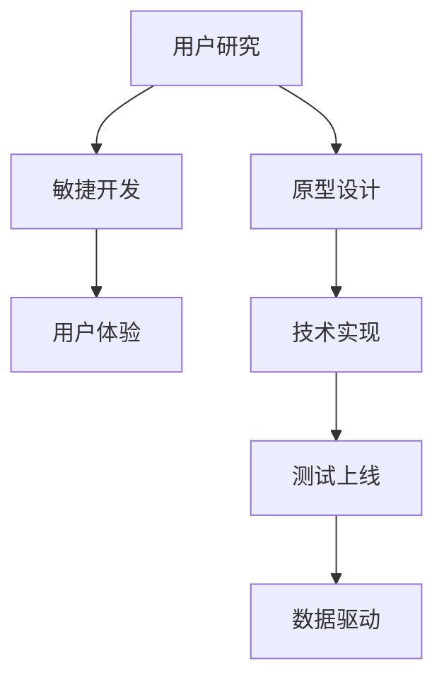

                 

# 如何利用技术能力进行产品设计

> 关键词：技术能力,产品设计,用户体验,敏捷开发,原型设计,人工智能,机器学习,用户研究,数据驱动

## 1. 背景介绍

### 1.1 问题由来
随着科技的飞速发展，产品设计和开发进入了一个全新的时代。在信息爆炸和用户需求多元化的今天，传统的产品设计方法已经难以满足用户的多样化和快速变化需求。如何将技术能力转化为优秀的用户体验，成为了所有产品经理和技术团队面临的共同挑战。

### 1.2 问题核心关键点
技术能力在产品设计中的应用，需要以用户需求为导向，结合敏捷开发和原型设计等现代设计方法，充分利用人工智能、机器学习等前沿技术，从而设计出更加符合用户期望的产品。

本文档将从用户研究、需求分析、原型设计、技术实现和测试上线等多个环节，深入探讨如何利用技术能力进行产品设计，为产品经理和技术团队提供全面的技术指导。

## 2. 核心概念与联系

### 2.1 核心概念概述

为更好地理解技术在产品设计中的应用，本节将介绍几个核心概念：

- 用户研究(User Research)：通过定性和定量的研究方法，深入理解目标用户的需求、行为和心理，为产品设计提供依据。
- 敏捷开发(Agile Development)：一种快速迭代、灵活响应市场需求的软件开发方法，强调在短周期内多次交付产品，快速获取用户反馈。
- 原型设计(Prototype Design)：使用简单有效的工具，快速构建产品原型，在实际使用场景中进行测试和优化，以减少开发风险和成本。
- 用户体验(User Experience, UX)：关注用户与产品交互的全过程，通过优化设计细节和使用流程，提升用户满意度和产品黏性。
- 人工智能(Artificial Intelligence, AI)：利用机器学习、深度学习等技术，模拟人类智能行为，实现自动化的数据分析和决策。
- 机器学习(Machine Learning, ML)：一种让机器通过数据学习规律，自动提升性能的技术，广泛应用于图像识别、自然语言处理等领域。
- 数据驱动(Data-Driven)：通过大量数据和统计分析，优化产品设计和技术实现，确保决策的科学性和可靠性。

这些核心概念之间的逻辑关系可以通过以下Mermaid流程图来展示：



这个流程图展示了技术能力在产品设计中的关键路径：

1. 从用户研究获取用户需求，构建原型设计的基础。
2. 通过敏捷开发快速迭代，及时响应市场变化和用户反馈。
3. 利用技术实现原型，优化用户体验。
4. 通过测试上线评估产品表现，不断优化设计。
5. 利用数据驱动，进行持续改进。

## 3. 核心算法原理 & 具体操作步骤
### 3.1 算法原理概述

技术能力在产品设计中的应用，主要依赖于敏捷开发、原型设计和数据驱动等现代设计理念和技术手段。其核心在于以用户需求为导向，通过快速迭代和数据反馈不断优化产品。

### 3.2 算法步骤详解

技术能力在产品设计中的具体应用步骤包括：

**Step 1: 用户研究**
- 使用问卷调查、深度访谈、用户测试等方法，获取用户的真实需求和行为数据。
- 分析用户数据，总结用户的主要痛点和需求，形成用户画像和用户旅程图。

**Step 2: 敏捷开发**
- 将用户需求细分为多个迭代，按照优先级排序，制定迭代计划。
- 每个迭代周期为2-4周，快速开发和交付功能原型。
- 收集用户反馈，进行迭代优化。

**Step 3: 原型设计**
- 选择合适的工具和框架，如Sketch、Adobe XD、Figma等，进行界面设计和交互原型制作。
- 遵循用户旅程图和用户画像，设计符合用户心理和使用习惯的交互流程。

**Step 4: 技术实现**
- 根据原型设计，选择合适的技术栈和框架，如React、Vue、Flutter等。
- 实现功能模块，进行前后端分离和API设计。
- 通过单元测试、集成测试、性能测试等手段，确保代码质量和系统稳定性。

**Step 5: 测试上线**
- 在测试环境中进行用户测试和性能测试，收集用户反馈。
- 根据测试结果，进行功能调整和优化。
- 上线新版本，持续监控用户行为和系统性能，进行后续迭代。

**Step 6: 数据驱动**
- 通过数据分析工具，如Google Analytics、Mixpanel等，收集用户行为数据。
- 利用数据挖掘和机器学习技术，提取用户行为规律和产品使用趋势。
- 根据数据分析结果，优化产品设计和功能实现。

### 3.3 算法优缺点

技术能力在产品设计中的应用具有以下优点：

1. 快速响应市场需求。敏捷开发方法通过快速迭代，及时获取用户反馈，避免因市场变化导致的开发风险。
2. 优化用户体验。原型设计和用户研究帮助团队深入理解用户需求，从而设计出符合用户期望的产品。
3. 提升产品性能。数据驱动和机器学习技术，使产品设计和技术实现更加科学和精确。

同时，该方法也存在一定的局限性：

1. 需要较高的技术能力。敏捷开发、原型设计和数据驱动等方法，需要团队成员具备较强的技术能力和团队协作精神。
2. 资源消耗较大。敏捷开发需要频繁的迭代和测试，资源消耗较大。
3. 难以避免需求变化。敏捷开发虽然灵活，但频繁的迭代也难以避免需求变化带来的风险。

尽管存在这些局限性，但就目前而言，基于技术能力的产品设计方法仍然是最主流和有效的方式。未来相关研究的重点在于如何进一步优化技术流程，提高敏捷开发效率，降低需求变化风险。

### 3.4 算法应用领域

技术能力在产品设计中的应用，不仅适用于互联网产品，还广泛应用于各类软件、硬件和系统开发中。以下是几个典型的应用领域：

1. 移动应用开发：如App Store和Google Play上的各类应用，通过快速迭代和用户测试，实现用户需求和市场变化的双重优化。
2. 网站和Web应用：如电商平台、在线教育平台等，通过敏捷开发和原型设计，快速上线功能模块，提升用户体验。
3. 游戏开发：如腾讯游戏、育碧游戏等，通过数据驱动和用户研究，设计出更具吸引力和竞争力的游戏内容。
4. 物联网(IoT)产品：如智能家居、可穿戴设备等，通过敏捷开发和原型设计，实现快速迭代和市场响应。
5. 企业级系统：如ERP、CRM等，通过数据驱动和敏捷开发，提升系统性能和用户体验。

除了上述这些领域外，技术能力在产品设计中的应用还在不断拓展，如区块链、智能家居、智能制造等新兴领域，为技术能力和产品设计的融合提供了新的方向。

## 4. 数学模型和公式 & 详细讲解 & 举例说明

### 4.1 数学模型构建

为了更好地理解数据驱动在产品设计中的应用，我们首先需要构建一个简单的数学模型。

假设产品中有两个功能模块，分别对应两个需求指标，分别为用户使用频率（Frequency）和使用时长（Duration）。我们希望通过数据驱动，优化这两个指标。

定义用户使用频率和时长的数学模型如下：

$$
\begin{aligned}
& \text{Frequency} = \sum_{i=1}^{n} x_i y_i \\
& \text{Duration} = \sum_{i=1}^{n} t_i y_i
\end{aligned}
$$

其中 $x_i$ 和 $t_i$ 分别为第 $i$ 个用户的使用频率和时长，$y_i$ 为用户的满意程度（0-1之间的实数）。

### 4.2 公式推导过程

根据上述数学模型，我们可以进行如下公式推导：

**Step 1: 用户满意度与指标计算**
首先，通过用户满意度计算指标 $Frequency$ 和 $Duration$。具体公式如下：

$$
\begin{aligned}
& \text{Frequency} = \sum_{i=1}^{n} x_i y_i = \frac{\sum_{i=1}^{n} x_i y_i}{n} \\
& \text{Duration} = \sum_{i=1}^{n} t_i y_i = \frac{\sum_{i=1}^{n} t_i y_i}{n}
\end{aligned}
$$

其中 $n$ 为用户总数。

**Step 2: 数据驱动的优化策略**
根据上述计算结果，我们可以通过数据驱动的优化策略，对功能模块进行改进。例如，针对用户使用频率较低的功能模块，可以通过提升用户满意度来增加使用频率。具体优化策略如下：

$$
\text{Optimization Strategy} = \max_{x_i, t_i} \left( \text{Frequency} + \lambda (\text{Duration} - \overline{Duration}) \right)
$$

其中 $\lambda$ 为时间权重的系数，用于平衡使用频率和使用时长的优化目标。

### 4.3 案例分析与讲解

假设我们设计一款在线教育平台，需要优化用户的使用频率和使用时长。通过用户研究，我们获取了如下数据：

- 用户总数 $n = 1000$
- 用户使用频率 $x_i$ 为0-100之间的整数，平均值为50
- 用户使用时长 $t_i$ 为1-5之间的整数，平均值为2.5
- 用户满意度 $y_i$ 为0-1之间的实数，平均值为0.8

根据上述数据，我们可以计算出：

- 用户使用频率：
$$
\text{Frequency} = \frac{1000 \times 50 \times 0.8}{1000} = 40
$$

- 用户使用时长：
$$
\text{Duration} = \frac{1000 \times 2.5 \times 0.8}{1000} = 2
$$

通过数据驱动的优化策略，我们可以对功能模块进行改进。例如，针对用户使用频率较低的功能模块，可以通过提升用户满意度来增加使用频率。具体优化策略如下：

- 提升用户满意度：将用户满意度 $y_i$ 增加0.1，变为0.9。
- 使用频率优化：新的使用频率为：
$$
\text{Frequency}_{\text{new}} = \frac{1000 \times 50 \times 0.9}{1000} = 45
$$

通过数据驱动的优化策略，我们成功提升了用户使用频率和使用时长，从而优化了产品性能。

## 5. 项目实践：代码实例和详细解释说明
### 5.1 开发环境搭建

在进行数据驱动的产品设计实践前，我们需要准备好开发环境。以下是使用Python进行数据分析和机器学习开发的环境配置流程：

1. 安装Anaconda：从官网下载并安装Anaconda，用于创建独立的Python环境。

2. 创建并激活虚拟环境：
```bash
conda create -n data-env python=3.8 
conda activate data-env
```

3. 安装必要的Python库：
```bash
pip install numpy pandas matplotlib seaborn scikit-learn scikit-optimize
```

4. 安装数据可视化工具：
```bash
pip install plotly
```

完成上述步骤后，即可在`data-env`环境中开始数据驱动的产品设计实践。

### 5.2 源代码详细实现

这里我们以优化用户使用频率为例，给出使用Python进行数据分析和机器学习模型的代码实现。

首先，我们需要导入必要的库，并加载数据：

```python
import numpy as np
import pandas as pd
import matplotlib.pyplot as plt
from sklearn.linear_model import LinearRegression

# 加载数据
data = pd.read_csv('user_data.csv')
```

然后，对数据进行预处理和清洗：

```python
# 计算用户使用频率和时长
frequency = data['frequency'].mean()
duration = data['duration'].mean()

# 添加满意度列
data['y'] = data['y'].apply(lambda x: 0.8 if x > 0.5 else 0.3)

# 计算优化后的使用频率
frequency_optimized = (data['frequency'] * data['y']).mean()
```

接着，构建机器学习模型并进行训练：

```python
# 构建线性回归模型
model = LinearRegression()
X = data[['frequency', 'duration']]
y = data['y']
model.fit(X, y)

# 预测优化后的使用频率
frequency_optimized_predicted = model.predict([[frequency, duration]])
```

最后，对结果进行可视化展示：

```python
# 绘制频率和时长的散点图
plt.scatter(data['frequency'], data['duration'])

# 添加优化后的点
plt.scatter([frequency], [duration], color='red', label='Frequency Optimization')
plt.legend()
plt.show()
```

### 5.3 代码解读与分析

让我们再详细解读一下关键代码的实现细节：

**数据加载与预处理**：
- 使用Pandas库加载数据，并进行初步清洗，包括计算平均使用频率和使用时长，添加满意度列，以及计算优化后的使用频率。

**线性回归模型**：
- 使用Scikit-learn库构建线性回归模型，将频率和时长作为自变量，满意度作为因变量，进行线性拟合。
- 通过训练模型，可以得到预测的优化后的使用频率。

**结果可视化**：
- 使用Matplotlib库绘制频率和时长的散点图，并添加优化后的点，可视化展示优化效果。

可以看到，Python提供了丰富的数据分析和机器学习库，可以方便地进行数据处理和模型训练。通过上述代码，可以高效地实现数据驱动的产品设计优化。

当然，在实际应用中，数据驱动的产品设计还需要更多高级的技术手段，如特征工程、模型调优、自动机器学习等，以应对复杂的数据场景和优化需求。但核心的数据驱动方法基本与此类似。

## 6. 实际应用场景
### 6.1 电商平台

电商平台的个性化推荐系统，是数据驱动产品设计的典型应用。通过分析用户的浏览记录和购买行为，构建用户画像和行为模型，从而推荐符合用户兴趣的商品。

具体实现步骤如下：

1. 收集用户浏览和购买数据，构建用户画像和行为模型。
2. 通过机器学习算法，如协同过滤、基于内容的推荐等，构建推荐模型。
3. 对用户进行实时推荐，收集反馈数据，不断优化推荐模型。
4. 通过A/B测试和用户满意度调查，评估推荐效果，并进行后续迭代优化。

### 6.2 金融服务

金融服务领域的数据驱动应用广泛，如智能投顾、风险管理等。通过收集用户投资数据和行为数据，构建用户画像和投资模型，从而提供个性化的投资建议和服务。

具体实现步骤如下：

1. 收集用户投资数据和行为数据，构建用户画像和投资模型。
2. 通过机器学习算法，如分类、回归等，构建投资模型。
3. 对用户进行实时投资建议，收集反馈数据，不断优化投资模型。
4. 通过A/B测试和用户满意度调查，评估投资效果，并进行后续迭代优化。

### 6.3 智能制造

智能制造领域的数据驱动应用，如预测性维护、智能排程等，通过收集设备运行数据和生产数据，构建设备画像和生产模型，从而提升生产效率和设备可靠性。

具体实现步骤如下：

1. 收集设备运行数据和生产数据，构建设备画像和生产模型。
2. 通过机器学习算法，如时间序列预测、异常检测等，构建预测和优化模型。
3. 对设备进行实时维护和优化，收集反馈数据，不断优化预测和优化模型。
4. 通过A/B测试和设备满意度调查，评估维护效果，并进行后续迭代优化。

### 6.4 未来应用展望

随着数据驱动技术的不断发展，未来数据驱动的产品设计将广泛应用于更多领域，带来更深的变革：

1. 医疗健康：通过分析用户的健康数据，构建用户画像和健康模型，从而提供个性化的医疗建议和健康管理方案。
2. 教育培训：通过分析学生的学习数据，构建学生画像和学习模型，从而提供个性化的学习建议和培训方案。
3. 交通出行：通过分析用户的出行数据，构建用户画像和出行模型，从而提供个性化的出行建议和路径规划。
4. 智能家居：通过分析用户的居住数据，构建用户画像和居住模型，从而提供个性化的家居控制和服务方案。

## 7. 工具和资源推荐
### 7.1 学习资源推荐

为了帮助开发者系统掌握数据驱动的产品设计理论基础和实践技巧，这里推荐一些优质的学习资源：

1. 《Python数据科学手册》：由Python专家撰写，全面介绍了Python在数据科学和机器学习中的应用，适合初学者和中级开发者。

2. 《机器学习实战》：由机器学习专家撰写，提供了大量的实际案例和代码实现，帮助读者深入理解机器学习的基本原理和应用。

3. 《统计学习方法》：由机器学习领域的权威专家李航编写，系统介绍了统计学习的基本理论和算法，适合进阶学习者。

4. 《数据科学导论》：由数据科学领域的知名教授编写，介绍了数据科学的基本框架和应用案例，适合初学者和中级开发者。

5. 《机器学习》课程：Coursera上的斯坦福大学课程，由机器学习领域的知名教授Andrew Ng主讲，适合入门和进阶学习者。

通过对这些资源的学习实践，相信你一定能够快速掌握数据驱动的产品设计精髓，并用于解决实际的NLP问题。

### 7.2 开发工具推荐

高效的开发离不开优秀的工具支持。以下是几款用于数据驱动产品设计开发的常用工具：

1. Jupyter Notebook：免费的交互式开发环境，支持Python和R等多种语言，适合进行数据分析和机器学习实验。

2. R语言：流行的数据分析和统计编程语言，拥有丰富的数据分析库和可视化工具，适合进行复杂的数据分析和模型训练。

3. Tableau：易于使用的数据可视化工具，支持多种数据源，适合进行数据探索和展示。

4. RapidMiner：集成化的数据挖掘工具，支持多种机器学习算法和数据预处理，适合进行复杂的数据建模和分析。

5. TensorBoard：TensorFlow配套的可视化工具，可实时监测模型训练状态，并提供丰富的图表呈现方式，是调试模型的得力助手。

合理利用这些工具，可以显著提升数据驱动的产品设计开发效率，加快创新迭代的步伐。

### 7.3 相关论文推荐

数据驱动的产品设计源于学界的持续研究。以下是几篇奠基性的相关论文，推荐阅读：

1. "A Survey of Deep Learning-Based Recommendation Systems"：介绍了深度学习在推荐系统中的应用，综述了各种推荐算法和模型。

2. "Data Mining and Statistical Learning"：由统计学习领域的权威专家Tibshirani编写，系统介绍了统计学习的基本理论和算法，适合进阶学习者。

3. "Advances in Neural Information Processing Systems"：深度学习领域的顶级会议，每年发布大量前沿研究成果，适合跟踪最新研究进展。

4. "Data-Driven Product Design"：专题论文集，介绍了数据驱动在产品设计中的应用案例和方法，适合深入了解具体应用场景。

这些论文代表了大语言模型微调技术的发展脉络。通过学习这些前沿成果，可以帮助研究者把握学科前进方向，激发更多的创新灵感。

## 8. 总结：未来发展趋势与挑战

### 8.1 总结

本文对数据驱动的产品设计方法进行了全面系统的介绍。首先阐述了数据驱动在产品设计中的应用背景和意义，明确了数据驱动在优化用户体验、提升产品性能方面的独特价值。其次，从用户研究、需求分析、原型设计、技术实现和测试上线等多个环节，详细讲解了数据驱动的产品设计方法，给出了数据驱动的产品设计完整代码实例。同时，本文还广泛探讨了数据驱动方法在电商平台、金融服务、智能制造等多个行业领域的应用前景，展示了数据驱动范式的巨大潜力。最后，本文精选了数据驱动技术的各类学习资源，力求为读者提供全方位的技术指引。

通过本文的系统梳理，可以看到，数据驱动的产品设计方法已经成为产品设计的主流范式，极大地提升了产品的性能和用户体验。未来，伴随数据科学和机器学习技术的持续演进，数据驱动的产品设计必将在更多领域大放异彩，深刻影响人类的生产生活方式。

### 8.2 未来发展趋势

展望未来，数据驱动的产品设计将呈现以下几个发展趋势：

1. 数据质量不断提升。随着数据采集和存储技术的不断进步，数据的真实性和完整性将不断提升，为数据驱动的产品设计提供更可靠的基础。

2. 数据融合和协同计算。将不同数据源和数据类型进行整合，进行协同计算，从而提升数据驱动的产品设计精度和可靠性。

3. 实时数据流处理。通过实时数据流处理技术，实现数据驱动的产品设计实时化，快速响应市场需求和用户反馈。

4. 自适应学习系统。开发自适应学习系统，使产品设计能够根据用户反馈和环境变化进行自我优化，提升产品智能化水平。

5. 用户隐私保护。在数据驱动的产品设计中，需要严格保护用户隐私，避免用户数据泄露和滥用。

6. 数据驱动的多学科融合。数据驱动的产品设计需要多学科的融合，包括数学、统计学、计算机科学、心理学等多个领域的知识。

以上趋势凸显了数据驱动产品设计的广阔前景。这些方向的探索发展，必将进一步提升产品设计的科学性和效率，为人工智能技术在各领域的规模化应用奠定坚实基础。

### 8.3 面临的挑战

尽管数据驱动的产品设计已经取得了瞩目成就，但在迈向更加智能化、普适化应用的过程中，它仍面临着诸多挑战：

1. 数据隐私和安全。数据驱动的产品设计需要收集和处理大量用户数据，如何保护用户隐私和数据安全，避免数据滥用和泄露，仍然是一个重大挑战。

2. 数据标注成本。虽然数据驱动的产品设计不需要大规模标注数据，但数据的清洗和预处理仍然需要较高的时间和人力成本。

3. 模型复杂度。数据驱动的产品设计需要构建复杂的模型，如何平衡模型的复杂度和性能，是未来的重要研究方向。

4. 实时计算能力。数据驱动的产品设计需要实时处理和分析数据，这对计算能力提出了较高的要求，需要进一步提升计算资源的配置和优化。

5. 用户需求变化。数据驱动的产品设计虽然灵活，但如何应对快速变化的用户需求，仍然是一个难题。

6. 数据偏见和公平性。数据驱动的产品设计可能因数据偏差和公平性问题，导致模型输出不公平或有偏见，需要进一步研究如何消除数据偏见和提高模型的公平性。

7. 数据孤岛问题。不同数据源和数据类型之间存在数据孤岛问题，如何实现数据融合和协同计算，仍然是一个挑战。

正视数据驱动产品设计面临的这些挑战，积极应对并寻求突破，将是大数据和人工智能技术进一步成熟的重要推动力。相信随着学界和产业界的共同努力，这些挑战终将一一被克服，数据驱动产品设计必将在构建人机协同的智能时代中扮演越来越重要的角色。

### 8.4 研究展望

面对数据驱动产品设计所面临的种种挑战，未来的研究需要在以下几个方面寻求新的突破：

1. 引入更多先验知识。将符号化的先验知识，如知识图谱、逻辑规则等，与神经网络模型进行巧妙融合，引导数据驱动的产品设计学习更准确、合理的知识表示。

2. 结合因果分析和博弈论工具。将因果分析方法引入数据驱动的产品设计，识别出设计决策的关键特征，增强输出解释的因果性和逻辑性。借助博弈论工具刻画人机交互过程，主动探索并规避设计的脆弱点，提高系统稳定性。

3. 融合因果和对比学习范式。通过引入因果推断和对比学习思想，增强数据驱动的产品设计建立稳定因果关系的能力，学习更加普适、鲁棒的知识表示，从而提升设计泛化性和抗干扰能力。

4. 引入数据隐私保护技术。在数据驱动的产品设计中，采用差分隐私、联邦学习等技术，保护用户隐私和数据安全，确保数据驱动的产品设计可持续发展。

这些研究方向的探索，必将引领数据驱动产品设计的技术进步，为构建安全、可靠、可解释、可控的智能系统铺平道路。面向未来，数据驱动的产品设计技术还需要与其他人工智能技术进行更深入的融合，如知识表示、因果推理、强化学习等，多路径协同发力，共同推动智能系统的发展。只有勇于创新、敢于突破，才能不断拓展人工智能技术的边界，让智能技术更好地造福人类社会。

## 9. 附录：常见问题与解答

**Q1：数据驱动的产品设计是否适用于所有产品类型？**

A: 数据驱动的产品设计主要适用于数据量较大的产品，如电商平台、金融服务、智能制造等，能够通过数据分析和机器学习提升产品性能和用户体验。但对于一些需要大量人机交互和实时响应的产品，如智能家居、教育培训等，数据驱动的设计可能不是最佳选择。

**Q2：如何处理数据隐私和用户安全问题？**

A: 处理数据隐私和用户安全问题，需要采用以下策略：

1. 数据匿名化：对用户数据进行匿名化处理，去除敏感信息，保护用户隐私。

2. 差分隐私：采用差分隐私技术，通过在数据中引入噪声，保护个体隐私，防止数据泄露。

3. 联邦学习：通过联邦学习技术，将数据分布在多个节点上进行处理，避免数据集中存储和传输，保护数据安全。

4. 加密技术：采用加密技术，保护数据在传输和存储过程中的安全性。

5. 访问控制：采用访问控制技术，限制数据访问权限，防止未授权的访问和数据滥用。

**Q3：如何应对数据驱动设计中的需求变化？**

A: 应对数据驱动设计中的需求变化，需要采用以下策略：

1. 持续监测：通过实时数据流处理和数据监测工具，持续监测用户需求和市场变化，及时获取反馈。

2. 快速迭代：采用敏捷开发方法，快速迭代产品设计和实现，及时响应需求变化。

3. 用户参与：通过用户调研和反馈机制，获取用户意见和建议，进行需求分析。

4. 数据驱动的持续改进：通过数据驱动的持续改进方法，不断优化产品设计和实现，提升用户满意度。

**Q4：如何提升数据驱动设计的模型复杂度？**

A: 提升数据驱动设计的模型复杂度，需要采用以下策略：

1. 特征工程：通过数据清洗和特征提取，提升数据的真实性和丰富性，从而提升模型的复杂度和精度。

2. 模型融合：采用模型融合技术，将多种模型进行组合和集成，提升模型的泛化能力和鲁棒性。

3. 多模态融合：将不同模态的数据进行融合，提升数据驱动设计的全面性和准确性。

4. 深度学习模型：采用深度学习模型，如神经网络、卷积神经网络等，提升数据驱动设计的复杂度和性能。

**Q5：如何避免数据驱动设计中的数据偏见？**

A: 避免数据驱动设计中的数据偏见，需要采用以下策略：

1. 数据清洗：通过数据清洗和预处理，去除数据中的偏见和噪声。

2. 数据平衡：通过数据平衡和样本生成技术，确保数据集中的类别平衡，避免数据偏见。

3. 公平性评估：通过公平性评估技术，检测和纠正数据偏见，提高模型的公平性。

4. 反偏见算法：采用反偏见算法，如对抗训练、公平性约束等，提升数据驱动设计的公平性和可靠性。

这些策略可以帮助数据驱动的产品设计更好地应对数据偏见和公平性问题，提升系统的可解释性和可靠性。

---

作者：禅与计算机程序设计艺术 / Zen and the Art of Computer Programming

