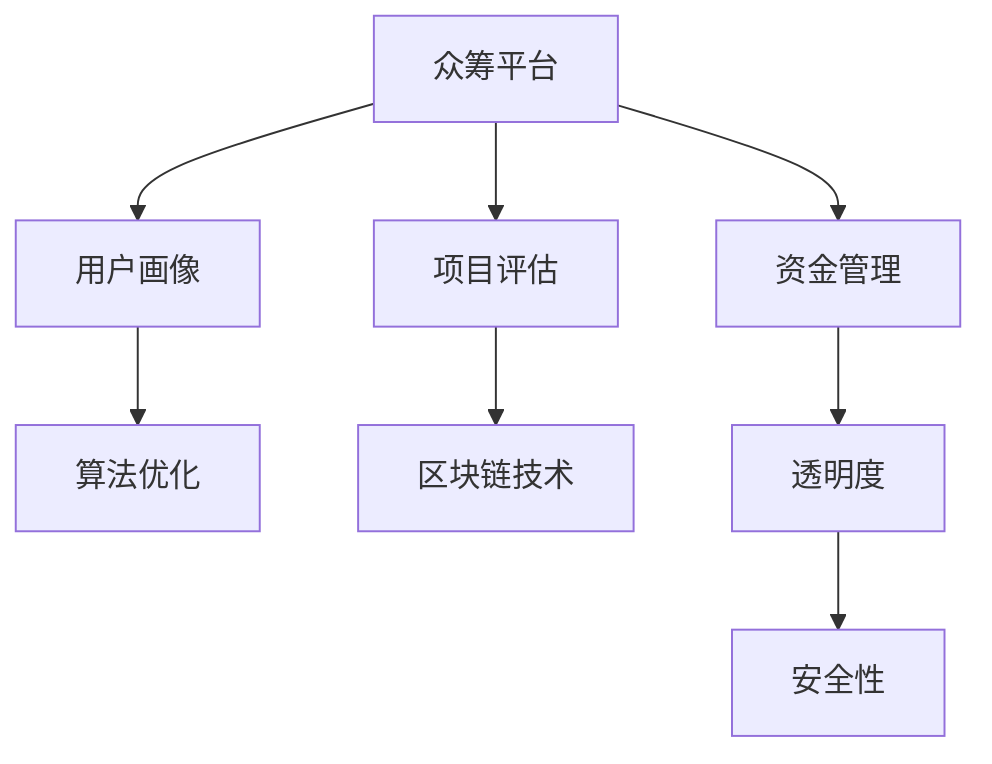

                 

# 如何利用技术能力进行众筹

> 关键词：技术众筹,项目评估,数据分析,算法优化,区块链技术,众筹平台

## 1. 背景介绍

### 1.1 问题由来

随着数字经济的蓬勃发展，传统众筹模式受到了前所未有的挑战。传统众筹多依赖于线下人脉关系和社交媒体推广，耗时长、成本高且覆盖面有限。技术的发展为众筹模式带来了新的契机，通过引入大数据、人工智能、区块链等先进技术，可以在更短的时间内获取更广泛的目标用户，提升项目成功率，降低众筹成本。

### 1.2 问题核心关键点

本文将重点探讨如何利用技术能力进行众筹，通过大数据分析、算法优化、区块链技术等多维手段，提升众筹平台的吸引力和成功率，实现更高的资金募集效率和安全性。

### 1.3 问题研究意义

技术众筹不仅能降低传统众筹模式的成本，还能通过算法优化和数据驱动，提升项目的精准度和成功率，为更多创新创业项目打开融资渠道。本文的研究有助于企业、创业者及投资者了解如何通过技术手段优化众筹平台，推动创新技术与金融模式的深度融合，促进社会创新和经济发展。

## 2. 核心概念与联系

### 2.1 核心概念概述

为更好地理解技术众筹，我们首先需要明确几个核心概念：

- **众筹平台(Crowdfunding Platform)**：提供项目展示、资金募集、投资者互动等功能的在线平台。
- **项目评估(Project Evaluation)**：通过数据分析、机器学习等手段，对项目进行客观的评分和评估，提高项目的筛选效率和准确性。
- **用户画像(User Persona)**：通过大数据分析，构建目标用户的特征模型，以便精准定位和吸引潜在投资者。
- **算法优化(Algorithm Optimization)**：通过模型训练和参数调优，提高众筹平台的核心算法，提升项目的推荐效果和成功率。
- **区块链技术(Blockchain Technology)**：用于构建透明、可信的资金管理和投融资平台，保障众筹活动的安全性和可追溯性。

这些概念之间的逻辑关系可以通过以下Mermaid流程图来展示：



这个流程图展示出技术众筹的核心要素及其相互关系：

1. 众筹平台是众筹活动的核心平台，通过引入项目评估、用户画像、算法优化、区块链技术等手段，提升平台的吸引力和成功率。
2. 项目评估通过客观的评分和筛选，提升项目的筛选效率和准确性。
3. 用户画像构建目标用户特征模型，精准定位潜在投资者。
4. 算法优化提升众筹平台的核心算法，增强推荐效果。
5. 区块链技术保障众筹资金管理和投融资的安全性和可追溯性。

## 3. 核心算法原理 & 具体操作步骤

### 3.1 算法原理概述

技术众筹的核心在于利用大数据和人工智能技术，对众筹项目和目标用户进行高效分析和精准匹配。其核心算法通常包括以下几个环节：

1. **项目评估**：通过对项目的关键指标（如资金需求、项目进度、团队背景等）进行量化分析，构建项目评分模型，对项目进行评估。
2. **用户画像**：利用数据分析技术，构建目标用户的特征模型，包括年龄、职业、投资偏好等，以便精准定位和吸引投资者。
3. **算法优化**：通过机器学习算法，提升项目推荐和投资者匹配的准确性，提高众筹成功率。
4. **区块链技术**：利用区块链技术，构建透明、可信的资金管理和投融资平台，保障众筹活动的安全性和可追溯性。

### 3.2 算法步骤详解

以项目评估为例，其具体步骤包括：

1. **数据收集**：从众筹平台、第三方数据源等收集项目的关键数据，包括项目介绍、资金需求、项目进度、团队背景等。
2. **数据清洗**：对收集到的数据进行清洗和预处理，去除噪声和缺失值。
3. **特征提取**：对清洗后的数据进行特征提取，包括文本处理、数值化转换等，生成项目的特征向量。
4. **模型训练**：使用机器学习算法，如决策树、随机森林、梯度提升树等，对项目特征和评分结果进行训练，构建评分模型。
5. **模型验证**：使用验证集对训练好的模型进行验证，评估模型的预测准确性和鲁棒性。
6. **模型应用**：将训练好的模型应用于新的众筹项目，实时计算项目的评分结果。

### 3.3 算法优缺点

技术众筹算法具有以下优点：

- **高效性**：通过数据驱动和算法优化，提升项目评估和匹配的效率。
- **准确性**：通过量化分析和模型训练，提升项目评分的客观性和准确性。
- **可扩展性**：算法模型具有可扩展性，能够适应不同规模和类型的众筹项目。

同时，该算法也存在一些局限性：

- **数据依赖**：算法效果的提升高度依赖于数据的质量和完整性。
- **模型偏见**：模型可能因训练数据的不平衡而产生偏见，影响评估结果。
- **算法复杂性**：构建和维护复杂的算法模型需要较高的技术门槛。

### 3.4 算法应用领域

技术众筹算法不仅在传统的创业项目众筹中得到了广泛应用，还拓展到了诸多新兴领域：

- **科技初创项目**：如AI、IoT、生物科技等。通过算法优化和数据驱动，提升项目的融资效率和成功率。
- **文化艺术项目**：如电影、音乐、文学作品等。通过用户画像和情感分析，精准定位目标投资者。
- **社会公益项目**：如环保、教育、医疗等。通过项目评估和社会影响力分析，吸引更多社会资本。

## 4. 数学模型和公式 & 详细讲解

### 4.1 数学模型构建

本节将使用数学语言对技术众筹的核心算法进行严格刻画。

假设项目数据集为 $D=\{(x_i,y_i)\}_{i=1}^N$，其中 $x_i$ 表示项目的特征向量， $y_i$ 表示项目评分，通常为 0-5 分。

定义评分函数 $f(x)$，用于计算项目特征向量 $x$ 的评分。常用的评分函数包括：

- **线性回归模型**：$f(x)=\beta_0 + \beta_1 x_1 + \beta_2 x_2 + ... + \beta_n x_n$，其中 $\beta_0,\beta_1,...,\beta_n$ 为模型参数。
- **决策树模型**：$f(x)=\begin{cases} 0 & \text{if} \, x_1 \leq t_1 \land x_2 \leq t_2 \land ... \land x_n \leq t_n \\ 1 & \text{if} \, x_1 > t_1 \land x_2 > t_2 \land ... \land x_n > t_n \end{cases}$，其中 $t_1,t_2,...,t_n$ 为决策树中的阈值。
- **随机森林模型**：$f(x)$ 通过随机采样和集成学习，综合多个决策树的结果。

### 4.2 公式推导过程

以线性回归模型为例，其训练过程如下：

1. **数据准备**：将项目数据集 $D$ 分为训练集 $D_{train}$ 和验证集 $D_{val}$。
2. **模型初始化**：选择模型参数 $\beta=(\beta_0,\beta_1,...,\beta_n)$ 的初始值。
3. **模型训练**：使用梯度下降算法，最小化损失函数：
   $$
   J(\beta) = \frac{1}{2N} \sum_{i=1}^N (y_i - f(x_i; \beta))^2
   $$
   其中，$y_i$ 为项目实际评分，$f(x_i; \beta)$ 为模型预测评分。
4. **模型验证**：使用验证集 $D_{val}$ 对训练好的模型进行验证，计算验证集上的损失函数 $J_{val}$。
5. **参数更新**：根据验证集上的损失函数，使用梯度下降更新模型参数，直到损失函数收敛或达到预设迭代次数。

### 4.3 案例分析与讲解

假设有一个科技初创项目，涉及AI技术研发。项目的关键特征包括团队背景、技术成熟度、市场潜力等。构建线性回归模型对项目进行评估，具体步骤如下：

1. **数据收集**：从众筹平台和第三方数据源收集项目的关键数据，包括团队规模、研发资金、技术专利等。
2. **数据清洗**：对收集到的数据进行清洗和预处理，去除噪声和缺失值。
3. **特征提取**：对清洗后的数据进行特征提取，包括文本处理、数值化转换等，生成项目的特征向量。
4. **模型训练**：使用线性回归模型对项目特征和评分结果进行训练，构建评分模型。
5. **模型验证**：使用验证集对训练好的模型进行验证，评估模型的预测准确性和鲁棒性。
6. **模型应用**：将训练好的模型应用于新的众筹项目，实时计算项目的评分结果。

## 5. 项目实践：代码实例和详细解释说明

### 5.1 开发环境搭建

在进行技术众筹实践前，我们需要准备好开发环境。以下是使用Python进行Scikit-learn开发的环境配置流程：

1. 安装Anaconda：从官网下载并安装Anaconda，用于创建独立的Python环境。

2. 创建并激活虚拟环境：
```bash
conda create -n tf-env python=3.8 
conda activate tf-env
```

3. 安装TensorFlow：根据CUDA版本，从官网获取对应的安装命令。例如：
```bash
conda install tensorflow -c pytorch -c conda-forge
```

4. 安装Scikit-learn：
```bash
pip install scikit-learn
```

5. 安装各类工具包：
```bash
pip install numpy pandas scikit-learn matplotlib tqdm jupyter notebook ipython
```

完成上述步骤后，即可在`tf-env`环境中开始技术众筹实践。

### 5.2 源代码详细实现

下面我们以科技初创项目众筹为例，给出使用Scikit-learn库对项目进行评估的Python代码实现。

```python
import pandas as pd
from sklearn.model_selection import train_test_split
from sklearn.linear_model import LinearRegression
from sklearn.metrics import mean_squared_error, r2_score

# 读取数据
data = pd.read_csv('project_data.csv')

# 特征选择
features = ['team_size', 'tech_maturity', 'market_potential', 'fund_need']
target = 'score'

# 划分数据集
X_train, X_test, y_train, y_test = train_test_split(data[features], data[target], test_size=0.2, random_state=42)

# 模型训练
model = LinearRegression()
model.fit(X_train, y_train)

# 模型评估
y_pred = model.predict(X_test)
mse = mean_squared_error(y_test, y_pred)
r2 = r2_score(y_test, y_pred)
print(f'Mean Squared Error: {mse:.3f}')
print(f'R-squared: {r2:.3f}')

# 模型应用
new_project = {'team_size': 50, 'tech_maturity': 4, 'market_potential': 3, 'fund_need': 100000}
new_score = model.predict([new_project])
print(f'Project Score: {new_score:.3f}')
```

### 5.3 代码解读与分析

让我们再详细解读一下关键代码的实现细节：

**项目数据处理**：
- 使用Pandas库读取项目数据，并进行特征选择，保留对评分预测有显著影响的关键特征。
- 划分训练集和测试集，使用80%的数据进行训练，20%的数据进行验证。

**模型训练**：
- 使用Scikit-learn库中的LinearRegression模型对项目特征和评分结果进行训练，构建评分模型。

**模型评估**：
- 使用测试集对训练好的模型进行评估，计算均方误差和R-squared，评估模型的预测准确性和鲁棒性。
- 对新项目进行评分预测，输出预测结果。

可以看到，Scikit-learn库使得模型训练和评估的代码实现变得简洁高效。开发者可以将更多精力放在数据处理、模型改进等高层逻辑上，而不必过多关注底层的实现细节。

当然，工业级的系统实现还需考虑更多因素，如模型的保存和部署、超参数的自动搜索、更灵活的任务适配层等。但核心的模型训练和评估过程基本与此类似。

## 6. 实际应用场景

### 6.1 科技初创项目众筹

科技初创项目具有高风险、高收益的特点，需要快速募集大量资金以支撑研发和市场推广。传统众筹模式往往难以满足其资金需求，技术众筹平台可以通过项目评估和算法优化，精准匹配目标投资者，提升项目成功率。

具体而言，科技初创项目可以通过技术众筹平台展示其创新技术和商业模型，并接受用户的评估和投票。平台通过构建评分模型，对项目的关键指标进行量化分析，筛选出最有潜力的项目。同时，平台使用用户画像技术，分析目标投资者的特征，精准定位并推荐给他们，吸引更多的资金支持。

### 6.2 文化艺术项目众筹

文化艺术项目具有较强的情感性和个性化特点，需要通过用户画像和情感分析，精准定位和吸引投资者。技术众筹平台可以利用大数据和机器学习算法，对文化艺术项目的特征进行建模和分析，评估其艺术价值和社会影响力。同时，平台使用情感分析技术，识别用户对项目的情感倾向，预测其投资意愿，从而提高项目的成功率。

例如，一个新书项目可以通过技术众筹平台展示其内容摘录和作者介绍，平台使用文本分析和情感分析技术，评估其市场潜力和用户兴趣。平台还可以使用用户画像技术，分析目标读者的特征，精准推荐给他们，提升项目的资金募集效率。

### 6.3 社会公益项目众筹

社会公益项目往往需要大量资金来支持慈善和公益活动，传统众筹模式难以覆盖如此大规模的资金需求。技术众筹平台可以通过项目评估和社会影响力分析，筛选出最有影响力的公益项目。同时，平台使用用户画像技术，精准定位并吸引更多社会资本，提升公益项目的融资效率。

例如，一个环保项目可以通过技术众筹平台展示其环保成果和公益目标，平台使用项目评估模型，评估其社会影响力和公益价值。平台还可以使用用户画像技术，分析目标捐赠者的特征，精准推荐给他们，吸引更多的社会支持。

### 6.4 未来应用展望

随着技术众筹模式的不断成熟，未来在更多领域将得到广泛应用：

1. **医疗健康**：通过项目评估和数据分析，精准定位和吸引更多的医疗健康项目投资者，推动医疗创新和健康事业发展。
2. **教育培训**：通过用户画像和情感分析，精准定位和吸引更多的教育培训项目投资者，提升教育质量和培训效果。
3. **农业科技**：通过项目评估和数据分析，精准定位和吸引更多的农业科技项目投资者，推动农业科技进步和农民增收。
4. **文化创意**：通过用户画像和情感分析，精准定位和吸引更多的文化创意项目投资者，推动文化创意产业的发展。
5. **环保公益**：通过项目评估和社会影响力分析，精准定位和吸引更多的环保公益项目投资者，推动环保事业的发展。

## 7. 工具和资源推荐

### 7.1 学习资源推荐

为了帮助开发者系统掌握技术众筹的理论基础和实践技巧，这里推荐一些优质的学习资源：

1. **《Python数据科学手册》**：全面介绍Python在数据分析和机器学习中的应用，适合初学者入门。
2. **《机器学习实战》**：通过实际案例，介绍机器学习算法的应用，适合实战学习。
3. **Coursera《机器学习》课程**：由斯坦福大学Andrew Ng教授主讲的机器学习课程，系统介绍机器学习的基本概念和算法。
4. **Kaggle竞赛平台**：提供大量数据分析和机器学习竞赛，有助于提升实战经验。
5. **Scikit-learn官方文档**：详细介绍了Scikit-learn库的使用方法，适合深入学习。

通过对这些资源的学习实践，相信你一定能够快速掌握技术众筹的精髓，并用于解决实际的众筹问题。

### 7.2 开发工具推荐

高效的开发离不开优秀的工具支持。以下是几款用于技术众筹开发的常用工具：

1. **Jupyter Notebook**：开源的交互式数据科学和机器学习平台，支持Python、R等多种语言，适合编写和执行数据处理和模型训练代码。
2. **TensorFlow**：由Google主导开发的深度学习框架，生产部署方便，适合大规模工程应用。
3. **Scikit-learn**：Python数据分析和机器学习库，提供丰富的算法和模型，适合快速原型设计和模型训练。
4. **Matplotlib**：Python绘图库，支持多种数据可视化方式，适合绘制复杂的数据图表。
5. **Pandas**：Python数据处理库，支持数据清洗、预处理和分析，适合大数据处理。

合理利用这些工具，可以显著提升技术众筹任务的开发效率，加快创新迭代的步伐。

### 7.3 相关论文推荐

技术众筹的研究源于学界的持续探索。以下是几篇奠基性的相关论文，推荐阅读：

1. **《众筹平台中的机器学习应用》**：探讨机器学习在众筹平台中的应用，提升项目筛选和匹配的准确性。
2. **《基于情感分析的众筹项目评估》**：利用情感分析技术，评估项目的社会影响力和用户情感倾向。
3. **《基于区块链的众筹资金管理》**：探讨区块链技术在众筹资金管理和投融资中的应用，提升资金的安全性和可追溯性。
4. **《深度学习在科技初创项目众筹中的应用》**：通过深度学习模型，评估项目的技术成熟度和市场潜力。

这些论文代表了大语言模型微调技术的发展脉络。通过学习这些前沿成果，可以帮助研究者把握学科前进方向，激发更多的创新灵感。

## 8. 总结：未来发展趋势与挑战

### 8.1 总结

本文对技术众筹方法进行了全面系统的介绍。首先阐述了技术众筹的背景和意义，明确了众筹平台、项目评估、用户画像、算法优化、区块链技术等核心要素，展示了技术众筹的广泛应用前景。其次，从原理到实践，详细讲解了技术众筹的核心算法，给出了技术众筹任务开发的完整代码实例。最后，本文还广泛探讨了技术众筹在科技初创项目、文化艺术项目、社会公益项目等多个领域的应用场景，展示了技术众筹范式的巨大潜力。

通过本文的系统梳理，可以看到，技术众筹不仅能降低传统众筹模式的成本，还能通过算法优化和数据驱动，提升项目的精准度和成功率，为更多创新创业项目打开融资渠道。未来，伴随技术众筹模式的不断成熟，必将在更多领域得到应用，推动社会创新和经济发展。

### 8.2 未来发展趋势

展望未来，技术众筹的发展趋势如下：

1. **多模态数据分析**：随着物联网、传感器等技术的发展，未来将产生更多维度的数据，技术众筹平台可以通过多模态数据分析，提升项目评估的全面性和准确性。
2. **深度学习算法**：深度学习算法在众筹项目评估中的应用将更加广泛，通过神经网络模型，提升项目评分的客观性和鲁棒性。
3. **区块链技术应用**：未来区块链技术将在众筹资金管理和投融资中得到更广泛的应用，保障资金的安全性和透明性。
4. **大数据技术应用**：随着大数据技术的发展，未来技术众筹平台可以处理和分析更大规模的数据，提升项目的筛选效率和匹配准确性。
5. **实时分析与反馈**：未来技术众筹平台可以实现实时数据分析和反馈，快速调整项目和投资者的匹配策略，提高众筹活动的效果和成功率。

以上趋势凸显了技术众筹的广阔前景。这些方向的探索发展，必将进一步提升技术众筹的性能和应用范围，为创新创业项目提供更高效、安全的融资渠道。

### 8.3 面临的挑战

尽管技术众筹已经取得了瞩目成就，但在迈向更加智能化、普适化应用的过程中，它仍面临诸多挑战：

1. **数据质量和隐私保护**：数据的质量和隐私保护是技术众筹平台的重要挑战，如何获取高质量的数据，同时保护用户隐私，需要进一步研究和优化。
2. **算法复杂性和可解释性**：技术众筹算法的复杂性需要进一步优化，同时提升算法的可解释性，增强投资者对评估结果的信任和接受度。
3. **市场接受度和用户认知**：技术众筹模式需要更多用户的认知和接受，如何提升市场接受度，推广技术众筹理念，也是一大挑战。
4. **平台运营和维护**：技术众筹平台的运营和维护需要大量资源和技术支持，如何提升平台的稳定性和可靠性，确保平台的长期运营，需要更多的投入和优化。
5. **法律法规和合规性**：技术众筹需要符合相关法律法规和合规要求，如何规范平台运营，避免法律风险，也是平台运营的重要挑战。

### 8.4 研究展望

未来技术众筹的研究可以从以下几个方向寻求新的突破：

1. **跨领域数据融合**：将不同领域的数据进行融合，提升项目评估的全面性和准确性。
2. **用户行为分析**：通过行为数据挖掘，分析用户的投资偏好和行为模式，提升投资匹配的精准度。
3. **实时反馈与优化**：利用实时数据分析和反馈，快速调整项目和投资者的匹配策略，提高众筹活动的效果和成功率。
4. **多模态数据融合**：将文本、图像、语音等多模态数据进行融合，提升项目的综合评估能力。
5. **深度学习优化**：通过深度学习算法的优化，提升项目评分的客观性和鲁棒性。
6. **区块链技术应用**：利用区块链技术，构建透明、可信的资金管理和投融资平台，保障众筹活动的安全性和可追溯性。

这些研究方向的探索，必将引领技术众筹模式迈向更高的台阶，为创新技术与金融模式的深度融合，推动社会创新和经济发展，提供更加高效、安全的融资渠道。

## 9. 附录：常见问题与解答

**Q1：技术众筹平台如何筛选高质量的项目？**

A: 技术众筹平台可以通过以下方式筛选高质量的项目：
1. 项目评估：利用大数据和机器学习技术，对项目的关键指标进行量化分析，构建评分模型，筛选出最有潜力的项目。
2. 用户画像：构建目标用户的特征模型，精准定位并推荐给投资者，吸引更多的资金支持。
3. 社区推荐：利用社区的力量，通过用户投票和评论，筛选出具有较高关注度的项目。

**Q2：技术众筹平台如何保护用户隐私？**

A: 技术众筹平台可以通过以下方式保护用户隐私：
1. 数据匿名化：对用户的个人信息进行匿名化处理，保护用户隐私。
2. 加密技术：使用加密技术，保护数据在传输和存储过程中的安全。
3. 访问控制：设置严格的访问控制机制，防止未经授权的访问和数据泄露。

**Q3：技术众筹平台如何提高用户参与度？**

A: 技术众筹平台可以通过以下方式提高用户参与度：
1. 社区互动：构建社区平台，促进用户之间的互动和交流，增加用户的参与感和认同感。
2. 奖励机制：设置合理的奖励机制，激励用户参与众筹活动，提升用户的参与度和投资意愿。
3. 定期活动：组织定期活动，如众筹马拉松、颁奖典礼等，增加用户的参与感和成就感。

**Q4：技术众筹平台如何应对市场波动？**

A: 技术众筹平台可以通过以下方式应对市场波动：
1. 风险控制：设置合理的风险控制机制，防止过度投资和风险集中。
2. 动态调整：根据市场情况，动态调整项目的募资目标和投资策略，减少市场波动带来的影响。
3. 多样化投资：鼓励用户多样化投资，降低单一项目的风险，提升整体投资组合的稳健性。

**Q5：技术众筹平台如何优化用户体验？**

A: 技术众筹平台可以通过以下方式优化用户体验：
1. 界面设计：设计简洁、友好的界面，提升用户的操作体验。
2. 快速响应：提升平台的技术架构和数据处理能力，确保用户的操作和查询快速响应。
3. 个性化推荐：利用大数据和机器学习技术，提升项目的推荐效果和精准度，增加用户的满意度和忠诚度。

这些问题的回答展示了技术众筹平台在实际应用中面临的挑战和解决方案，希望通过本文的介绍，开发者能够更好地理解技术众筹的核心要素，优化平台的设计和运营，提升项目的成功率和用户满意度。

---

作者：禅与计算机程序设计艺术 / Zen and the Art of Computer Programming

