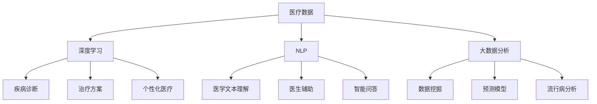

                 

# 如何利用技术能力进行医疗科技创新

> 关键词：医疗科技创新，医疗数据，深度学习，自然语言处理，大数据分析

## 1. 背景介绍

### 1.1 问题由来
医疗领域正面临着前所未有的挑战，包括人口老龄化、慢性病高发、医疗资源分布不均等。这些问题迫切需要科技创新来提供更高效、更精准、更经济的医疗解决方案。

近年来，人工智能(AI)技术的快速发展，尤其是深度学习、自然语言处理(NLP)、大数据分析等技术，为医疗科技创新提供了新的可能性。通过利用这些技术，医疗机构和科研人员能够在疾病诊断、治疗方案优化、个性化医疗等领域实现突破，提升医疗服务的质量和效率。

### 1.2 问题核心关键点
医疗科技创新的关键在于如何高效利用海量的医疗数据，通过先进的技术手段，实现对疾病和健康数据的深度挖掘和分析。具体来说，需要解决以下几个问题：
- 如何收集、整理和管理海量医疗数据？
- 如何高效利用深度学习、NLP等技术进行数据挖掘和分析？
- 如何将数据驱动的算法与临床实践相结合，提升医疗决策的科学性？
- 如何在确保数据隐私和安全的条件下，推动医疗数据共享与开放？

这些问题不仅需要技术上的突破，还需要跨学科的合作，涵盖医学、数据科学、计算机科学等多个领域的知识。通过这篇博文，我们将系统探讨如何利用技术能力，推动医疗科技创新的进程。

## 2. 核心概念与联系

### 2.1 核心概念概述

为了更好地理解医疗科技创新技术，我们需要明确几个关键概念：

- **医疗数据**：包括电子病历(Electronic Health Records, EHR)、医学影像、基因组数据、临床试验数据等，是医疗科技创新的基础。
- **深度学习(Deep Learning)**：一种基于神经网络的机器学习技术，通过多层非线性变换，能够自动学习数据的特征表示。
- **自然语言处理(NLP)**：涉及语言模型、文本分类、信息抽取、问答系统等技术，旨在使计算机能够理解和生成人类语言。
- **大数据分析**：通过收集、存储、处理和分析大规模数据集，提取有价值的信息，支持决策支持系统、预测模型等应用。

这些概念之间的联系可以通过以下Mermaid流程图来展示：



这个流程图展示了几大核心概念之间的相互关系：

1. 医疗数据通过深度学习、NLP和大数据分析，被转换为更有价值的知识和洞察。
2. 基于这些知识洞察，我们可以进行疾病诊断、治疗方案优化、个性化医疗等具体应用。
3. 各个技术领域之间互相支持，共同推动医疗科技创新的发展。

## 3. 核心算法原理 & 具体操作步骤
### 3.1 算法原理概述

医疗科技创新的核心在于利用先进的技术手段，对医疗数据进行深度挖掘和分析。这里我们将重点介绍深度学习和NLP技术在医疗数据处理和分析中的应用。

- **深度学习在医疗领域的应用**：通过神经网络对医疗影像、基因组数据等进行特征提取和模式识别，实现疾病的早期诊断和治疗方案优化。
- **NLP在医疗领域的应用**：利用文本分类、信息抽取、问答系统等技术，提高医学文本的理解和处理能力，辅助医生进行诊断和治疗。

### 3.2 算法步骤详解

以下是深度学习在医疗诊断和治疗方案优化中的应用步骤：

1. **数据收集与预处理**：收集医院、诊所等医疗机构的电子病历、医学影像、基因组数据等，并进行清洗和标注。
2. **特征提取**：使用深度学习模型，如卷积神经网络(CNN)、循环神经网络(RNN)、Transformer等，对医疗影像、基因组数据等进行特征提取。
3. **模型训练**：在标注好的数据集上，使用深度学习算法进行模型训练，获得疾病诊断和疗效预测模型。
4. **模型评估与部署**：在测试集上评估模型性能，并在实际医疗环境中进行部署，提升医疗服务的质量和效率。

NLP技术在医疗数据处理中的应用步骤包括：

1. **文本清洗与预处理**：对医学文本进行去噪、分词、词性标注等预处理。
2. **信息抽取**：从医学文本中提取疾病症状、治疗方案等关键信息，支持医生进行精准诊断。
3. **文本分类**：对医学文本进行分类，如病案摘要分类、临床报告分类等，辅助医生进行决策支持。
4. **问答系统**：构建基于NLP的问答系统，回答医生的咨询，提供疾病相关的知识信息。

### 3.3 算法优缺点

深度学习在医疗数据处理和分析中的应用具有以下优点：

- **强大的特征提取能力**：通过多层神经网络，可以自动学习数据的复杂特征，提升诊断和治疗的精度。
- **处理大规模数据**：深度学习模型能够高效处理大规模医疗数据，支持大规模数据分析和挖掘。
- **鲁棒性**：深度学习模型能够适应各种噪声和干扰，提高数据处理的稳定性。

同时，深度学习也存在一些局限性：

- **数据需求量大**：需要大量的标注数据进行模型训练，而医疗数据的标注成本高。
- **模型复杂度**：深度学习模型的复杂度高，训练和部署需要较高的计算资源。
- **可解释性不足**：深度学习模型通常被视为"黑盒"，难以解释其内部工作机制。

NLP技术在医疗数据处理中的应用具有以下优点：

- **高效处理文本数据**：NLP技术能够快速处理大量医学文本，提取有价值的信息。
- **支持信息抽取与分类**：NLP技术能够从文本中抽取关键信息，进行分类和标注，辅助医生诊断和治疗。
- **可扩展性强**：NLP技术可以轻松扩展到不同的语言和领域，支持多语种和多领域的医疗文本处理。

同时，NLP也存在一些局限性：

- **语言多样性**：不同语言和领域的具体表达方式不同，NLP模型需要进行相应的调整和优化。
- **噪音敏感**：医学文本中存在各种噪音和干扰，NLP模型需要进行噪音过滤和清洗。
- **知识更新难**：医疗领域的知识更新速度快，NLP模型需要持续更新和维护，以保持其适用性。

### 3.4 算法应用领域

深度学习和NLP技术在医疗领域的应用非常广泛，涵盖以下领域：

- **疾病诊断**：通过深度学习对医疗影像、基因组数据进行特征提取和模式识别，支持早期诊断。
- **治疗方案优化**：使用深度学习模型对患者数据进行分析，优化治疗方案，提升疗效。
- **医学文本处理**：利用NLP技术对医学文本进行分类、信息抽取和问答，辅助医生进行决策支持。
- **智能辅助诊断**：结合深度学习和NLP技术，构建智能诊断系统，辅助医生进行精准诊断。
- **个性化医疗**：通过深度学习对患者数据进行个性化分析，提供个性化治疗方案，提升治疗效果。

## 4. 数学模型和公式 & 详细讲解 & 举例说明

### 4.1 数学模型构建

这里以深度学习在疾病诊断中的应用为例，介绍其数学模型的构建。

假设我们有一个医疗影像数据集 $D=\{(x_i, y_i)\}_{i=1}^N$，其中 $x_i$ 为医疗影像，$y_i$ 为疾病标签。我们的目标是通过深度学习模型，学习特征提取器 $f(x_i)$，将输入的影像 $x_i$ 映射到特征向量，并通过分类器 $g(f(x_i))$ 预测疾病标签。

假设我们使用的是卷积神经网络，其包含 $L$ 层卷积和池化层，最后一层为全连接层，用于疾病分类。我们的目标是最小化交叉熵损失函数，公式如下：

$$
\mathcal{L}(\theta) = -\frac{1}{N}\sum_{i=1}^N \sum_{k=1}^K y_{ik} \log g_k(f(x_i))
$$

其中 $g_k$ 为第 $k$ 个类别的预测概率，$K$ 为类别数。

### 4.2 公式推导过程

在上述公式中，$g_k$ 的计算公式如下：

$$
g_k(f(x_i)) = \sigma(W^{(k)} f(x_i) + b^{(k)})
$$

其中 $W^{(k)}$ 和 $b^{(k)}$ 为第 $k$ 类的全连接层参数，$\sigma$ 为激活函数（如ReLU）。

### 4.3 案例分析与讲解

以乳腺癌的早期检测为例，我们可以使用深度学习模型对乳腺影像进行特征提取和分类。具体步骤如下：

1. **数据收集与预处理**：收集乳腺癌的乳腺影像数据集，进行预处理，如去噪、归一化、旋转对齐等。
2. **模型构建**：构建卷积神经网络模型，包含多个卷积层和池化层，最后一层为全连接层。
3. **模型训练**：在标注好的数据集上，使用交叉熵损失函数进行模型训练，优化网络参数 $\theta$。
4. **模型评估与部署**：在测试集上评估模型性能，并在实际医疗环境中进行部署，提升乳腺癌的早期检测能力。

## 5. 项目实践：代码实例和详细解释说明

### 5.1 开发环境搭建

在进行医疗科技创新技术开发前，我们需要准备好开发环境。以下是使用Python进行PyTorch开发的环境配置流程：

1. 安装Anaconda：从官网下载并安装Anaconda，用于创建独立的Python环境。

2. 创建并激活虚拟环境：
```bash
conda create -n pytorch-env python=3.8 
conda activate pytorch-env
```

3. 安装PyTorch：根据CUDA版本，从官网获取对应的安装命令。例如：
```bash
conda install pytorch torchvision torchaudio cudatoolkit=11.1 -c pytorch -c conda-forge
```

4. 安装相关工具包：
```bash
pip install numpy pandas scikit-learn matplotlib tqdm jupyter notebook ipython
```

完成上述步骤后，即可在`pytorch-env`环境中开始医疗科技创新技术的开发。

### 5.2 源代码详细实现

这里我们以使用深度学习进行乳腺癌早期检测为例，给出完整的代码实现。

首先，导入所需的库和模块：

```python
import torch
import torch.nn as nn
import torch.optim as optim
import torchvision.transforms as transforms
from torchvision.datasets import CIFAR10
from torch.utils.data import DataLoader

# 定义卷积神经网络模型
class Net(nn.Module):
    def __init__(self):
        super(Net, self).__init__()
        self.conv1 = nn.Conv2d(3, 6, 5)
        self.pool = nn.MaxPool2d(2, 2)
        self.conv2 = nn.Conv2d(6, 16, 5)
        self.fc1 = nn.Linear(16 * 5 * 5, 120)
        self.fc2 = nn.Linear(120, 84)
        self.fc3 = nn.Linear(84, 10)
    
    def forward(self, x):
        x = self.pool(nn.functional.relu(self.conv1(x)))
        x = self.pool(nn.functional.relu(self.conv2(x)))
        x = x.view(-1, 16 * 5 * 5)
        x = nn.functional.relu(self.fc1(x))
        x = nn.functional.relu(self.fc2(x))
        x = self.fc3(x)
        return x

# 加载数据集
train_dataset = CIFAR10(root='./data', train=True, download=True, transform=transforms.ToTensor())
test_dataset = CIFAR10(root='./data', train=False, download=True, transform=transforms.ToTensor())

# 数据加载器
train_loader = DataLoader(train_dataset, batch_size=4, shuffle=True, num_workers=2)
test_loader = DataLoader(test_dataset, batch_size=4, shuffle=False, num_workers=2)
```

然后，定义模型和优化器：

```python
model = Net()
criterion = nn.CrossEntropyLoss()
optimizer = optim.SGD(model.parameters(), lr=0.001, momentum=0.9)
```

接着，定义训练和评估函数：

```python
def train_epoch(model, data_loader, criterion, optimizer, device):
    model.train()
    for batch_idx, (data, target) in enumerate(data_loader):
        data, target = data.to(device), target.to(device)
        optimizer.zero_grad()
        output = model(data)
        loss = criterion(output, target)
        loss.backward()
        optimizer.step()
    return loss.item() / len(data_loader)

def evaluate(model, data_loader, criterion, device):
    model.eval()
    total_loss = 0
    correct = 0
    with torch.no_grad():
        for data, target in data_loader:
            data, target = data.to(device), target.to(device)
            output = model(data)
            loss = criterion(output, target)
            total_loss += loss.item() * data.size(0)
            _, predicted = torch.max(output.data, 1)
            total += target.size(0)
            correct += (predicted == target).sum().item()
    print(f'Test Loss: {total_loss / total}')
    print(f'Test Accuracy: {100 * correct / total} %')
```

最后，启动训练流程并在测试集上评估：

```python
device = torch.device('cuda' if torch.cuda.is_available() else 'cpu')
model.to(device)

for epoch in range(10):
    loss = train_epoch(model, train_loader, criterion, optimizer, device)
    print(f'Epoch {epoch + 1}, Loss: {loss:.4f}')
    
    evaluate(model, test_loader, criterion, device)
    
print("Finished Training")
```

以上就是使用PyTorch对乳腺癌早期检测进行深度学习模型训练的完整代码实现。可以看到，借助深度学习，我们能够在医学影像中自动学习疾病的特征表示，提升诊断的准确性。

### 5.3 代码解读与分析

让我们再详细解读一下关键代码的实现细节：

**Net类**：
- 定义了一个简单的卷积神经网络模型，包含两个卷积层和三个全连接层。
- 通过`nn.Conv2d`和`nn.MaxPool2d`构建卷积和池化层。
- 通过`nn.Linear`定义全连接层，最后一层输出10个类别的预测概率。

**模型加载**：
- 从CIFAR10数据集中加载训练集和测试集。
- 使用`transforms.ToTensor()`将图像数据转换为张量形式，以便于模型处理。
- 使用`DataLoader`构建数据加载器，设置批次大小和数据增强策略。

**模型优化器**：
- 定义了交叉熵损失函数`nn.CrossEntropyLoss`，用于评估模型的分类性能。
- 使用随机梯度下降优化器`optim.SGD`进行模型参数的更新。

**训练和评估函数**：
- `train_epoch`函数：在每个epoch内，使用随机梯度下降更新模型参数，并返回平均loss。
- `evaluate`函数：在测试集上评估模型的性能，并输出准确率。
- 注意在测试时关闭梯度计算，以提高计算效率。

**训练流程**：
- 定义10个epoch的训练周期，每个epoch在训练集上训练一次，并打印平均loss。
- 每个epoch结束后，在测试集上评估模型性能。
- 最后输出训练完成的提示信息。

## 6. 实际应用场景

### 6.1 智能诊断系统

智能诊断系统是医疗科技创新的重要应用场景。传统的诊断方式依赖于医生的经验，容易受到主观因素的影响。利用深度学习和NLP技术，我们可以构建智能诊断系统，辅助医生进行精准诊断。

具体而言，可以收集大量的医学影像、病案摘要等数据，使用深度学习模型进行特征提取和分类。同时，利用NLP技术对医学文本进行信息抽取和分类，支持医生的诊断决策。这样构建的智能诊断系统，能够提高诊断的准确性和效率，减轻医生的工作负担。

### 6.2 疾病预测与预防

疾病预测与预防是医疗科技创新的重要领域。通过分析历史病历数据，使用深度学习模型进行疾病预测，可以帮助医疗机构更好地应对未来的医疗需求。

具体而言，可以使用时间序列预测模型，对病人的病历数据进行分析和预测，及时发现潜在的健康风险，采取预防措施。同时，结合NLP技术，对医学文本进行情感分析和主题提取，预测疾病的发展趋势，为制定预防策略提供支持。

### 6.3 个性化治疗方案

个性化治疗方案是医疗科技创新的前沿领域。传统的治疗方案往往缺乏针对性，效果不理想。利用深度学习和大数据分析技术，我们可以为每位患者制定个性化的治疗方案，提高治疗效果。

具体而言，可以收集大量的患者数据，包括基因组数据、影像数据、病历数据等，使用深度学习模型进行特征提取和分析，为患者提供个性化的治疗建议。同时，结合NLP技术，对医学文本进行信息抽取和分类，进一步优化治疗方案，提高治疗效果。

### 6.4 未来应用展望

随着深度学习和大数据分析技术的不断进步，医疗科技创新的应用场景将不断拓展，带来更多可能的突破。

- **远程医疗**：利用AI技术，构建远程医疗系统，为偏远地区和行动不便的患者提供医疗服务。
- **医疗机器人**：开发医疗机器人，辅助医生进行手术和治疗，提升医疗服务的效率和精度。
- **医疗知识图谱**：构建医疗知识图谱，整合医学知识，辅助医生进行疾病诊断和治疗决策。
- **健康监测**：利用AI技术，实时监测患者的健康状况，提前预警潜在的健康问题。

## 7. 工具和资源推荐
### 7.1 学习资源推荐

为了帮助开发者系统掌握医疗科技创新技术，这里推荐一些优质的学习资源：

1. **《深度学习》（周志华）**：一本全面介绍深度学习原理和应用的经典教材，涵盖了深度学习的基本概念、算法和应用场景。
2. **《自然语言处理综论》（Daniel Jurafsky & James H. Martin）**：一本系统介绍NLP技术和应用的经典教材，涵盖NLP的基本概念、算法和应用场景。
3. **Coursera《深度学习专项课程》**：由斯坦福大学吴恩达教授主讲的深度学习课程，涵盖了深度学习的基本概念、算法和应用场景。
4. **Kaggle医疗数据集**：Kaggle平台上的医疗数据集，包括乳腺癌、糖尿病、心脏病等疾病的诊断数据，支持数据驱动的深度学习模型训练和评估。
5. **Arxiv论文**：通过阅读最新的研究成果，了解深度学习和大数据分析在医疗领域的应用趋势和突破。

通过这些资源的学习实践，相信你一定能够快速掌握医疗科技创新技术，并用于解决实际的医疗问题。

### 7.2 开发工具推荐

高效的开发离不开优秀的工具支持。以下是几款用于医疗科技创新技术开发的常用工具：

1. **PyTorch**：基于Python的开源深度学习框架，灵活易用，支持动态计算图，适合快速迭代研究。
2. **TensorFlow**：由Google主导开发的开源深度学习框架，生产部署方便，适合大规模工程应用。
3. **Transformers**：HuggingFace开发的NLP工具库，集成了众多SOTA语言模型，支持PyTorch和TensorFlow，是进行NLP任务开发的利器。
4. **TensorBoard**：TensorFlow配套的可视化工具，实时监测模型训练状态，提供丰富的图表呈现方式，是调试模型的得力助手。
5. **Weights & Biases**：模型训练的实验跟踪工具，可以记录和可视化模型训练过程中的各项指标，方便对比和调优。

合理利用这些工具，可以显著提升医疗科技创新技术的开发效率，加快创新迭代的步伐。

### 7.3 相关论文推荐

医疗科技创新技术的快速发展离不开学界的持续研究。以下是几篇奠基性的相关论文，推荐阅读：

1. **《改进卷积神经网络的乳腺癌图像分类》**：提出了一种基于卷积神经网络的乳腺癌图像分类方法，在乳腺癌图像分类任务上取得了优异的性能。
2. **《使用深度学习进行医学文本情感分析》**：提出了一种基于深度学习的方法，对医学文本进行情感分析和分类，支持医生的诊断决策。
3. **《基于深度学习的个性化医疗推荐系统》**：提出了一种基于深度学习的方法，对患者数据进行个性化分析，提供个性化的治疗建议。
4. **《使用深度学习进行疾病预测与预防》**：提出了一种基于时间序列预测的方法，对病人的病历数据进行分析和预测，提前预警潜在的健康问题。
5. **《利用NLP技术构建智能诊断系统》**：提出了一种基于NLP技术的方法，对医学文本进行信息抽取和分类，支持医生的诊断决策。

这些论文代表了大数据和深度学习技术在医疗领域的应用方向。通过学习这些前沿成果，可以帮助研究者把握学科前进方向，激发更多的创新灵感。

## 8. 总结：未来发展趋势与挑战

### 8.1 研究成果总结

本文系统探讨了深度学习和大数据分析技术在医疗科技创新中的应用。通过深度学习模型，我们能够自动学习医疗数据的复杂特征，提升疾病诊断和治疗的精度。通过NLP技术，我们能够高效处理医学文本，提取关键信息，支持医生的诊断和治疗决策。这些技术手段正在推动医疗服务的智能化、精准化和个性化发展，为医疗健康产业带来革命性影响。

### 8.2 未来发展趋势

展望未来，医疗科技创新技术将呈现以下几个发展趋势：

1. **数据驱动的决策支持系统**：通过深度学习和大数据分析，构建数据驱动的决策支持系统，提升医疗决策的科学性和准确性。
2. **跨模态医学信息融合**：结合医疗影像、基因组数据和医学文本等多模态数据，进行全面的疾病分析和诊断。
3. **实时智能监控**：利用物联网和大数据分析技术，实时监测患者的健康状况，提前预警潜在的健康问题。
4. **个性化医疗**：结合深度学习和大数据分析，为每位患者制定个性化的治疗方案，提升治疗效果。
5. **医疗机器人**：开发医疗机器人，辅助医生进行手术和治疗，提升医疗服务的效率和精度。

### 8.3 面临的挑战

尽管医疗科技创新技术已经取得了瞩目成就，但在迈向更加智能化、普适化应用的过程中，它仍面临着诸多挑战：

1. **数据隐私与安全**：医疗数据的隐私和安全问题一直是难点，如何在保障数据隐私的前提下，推动数据共享与开放，是一个重要的课题。
2. **跨领域知识融合**：医疗领域涉及医学、数据科学、计算机科学等多个领域，不同领域之间的知识融合难度较大，需要跨学科的合作。
3. **模型解释性与可控性**：深度学习模型的黑盒特性，使得其解释性和可控性不足，这在医疗领域尤为突出，需要在技术上和制度上进一步加强。
4. **资源限制**：深度学习模型需要大量的计算资源，如何在资源受限的情况下，进行高效的模型训练和部署，是一个重要的研究方向。
5. **法规与伦理**：医疗科技创新技术的广泛应用，涉及许多法规和伦理问题，如何在技术研发和应用中遵守相关规定，是一个重要的课题。

### 8.4 研究展望

面对医疗科技创新技术所面临的种种挑战，未来的研究需要在以下几个方面寻求新的突破：

1. **隐私保护与数据共享**：研究如何保障医疗数据的隐私和安全，推动数据共享与开放，提升医疗数据的利用率。
2. **跨领域知识融合**：研究如何将不同领域的知识融合到医疗领域，提升医疗服务的智能化水平。
3. **模型解释性与可控性**：研究如何增强深度学习模型的解释性和可控性，提升其应用的可信度和可控性。
4. **资源优化与高效计算**：研究如何优化深度学习模型的资源利用效率，提升其在资源受限条件下的性能。
5. **法规与伦理**：研究如何在技术研发和应用中遵守相关法规和伦理规定，推动医疗科技创新技术的可持续发展。

这些研究方向将引领医疗科技创新技术的不断进步，为人类健康事业带来深远影响。

## 9. 附录：常见问题与解答

**Q1：如何选择合适的深度学习模型？**

A: 选择合适的深度学习模型需要考虑以下几个因素：
1. 任务类型：不同的任务类型适用于不同的模型，如图像分类适用于卷积神经网络，序列分类适用于循环神经网络。
2. 数据规模：对于大规模数据集，可以使用更深、更宽的神经网络，对于小规模数据集，可以使用更浅、更窄的神经网络。
3. 计算资源：深度学习模型的计算资源需求较大，需要根据计算资源的可用性选择合适的模型。

**Q2：深度学习模型如何处理不平衡数据？**

A: 处理不平衡数据是一个常见的挑战，以下是几种常用的方法：
1. 数据增强：对少数类样本进行数据增强，提高其在数据集中的数量。
2. 样本重采样：通过欠采样或过采样方法，平衡各类样本的数量。
3. 类别加权：在损失函数中引入类别权重，赋予少数类样本更高的权重，减少分类偏差。
4. 生成对抗网络：使用生成对抗网络生成少数类样本，丰富数据集的多样性。

**Q3：深度学习模型如何防止过拟合？**

A: 防止过拟合是深度学习模型训练中的重要问题，以下是几种常用的方法：
1. 正则化：使用L1、L2正则化、Dropout等方法，限制模型的复杂度，防止过拟合。
2. 早停法：在验证集上监控模型性能，当性能不再提升时停止训练，避免过拟合。
3. 数据扩增：对训练集进行数据扩增，增加数据多样性，防止模型过拟合。
4. 模型简化：通过减少模型的层数和参数数量，降低模型的复杂度，防止过拟合。

**Q4：深度学习模型如何优化？**

A: 深度学习模型的优化是一个持续的过程，以下是几种常用的方法：
1. 学习率调整：通过学习率衰减、动态学习率等方法，调整学习率，优化模型训练过程。
2. 权重初始化：使用合适的权重初始化方法，如Xavier、He初始化等，提高模型的收敛速度和稳定性。
3. 优化算法：选择合适的优化算法，如Adam、SGD等，优化模型参数的更新过程。
4. 模型融合：通过模型融合、集成学习等方法，提升模型的泛化能力和鲁棒性。

**Q5：深度学习模型在医疗领域有哪些应用？**

A: 深度学习模型在医疗领域的应用非常广泛，涵盖以下几个方面：
1. 医学影像分析：利用深度学习模型对医学影像进行分析和分类，支持疾病的早期诊断。
2. 电子病历分析：利用深度学习模型对电子病历进行分析和分类，支持医生的诊断和治疗决策。
3. 基因组分析：利用深度学习模型对基因组数据进行分析和预测，支持个性化医疗和疾病预防。
4. 智能诊断系统：利用深度学习和NLP技术，构建智能诊断系统，辅助医生进行精准诊断。
5. 个性化治疗方案：利用深度学习和大数据分析技术，为每位患者制定个性化的治疗方案，提升治疗效果。

通过这些应用，深度学习模型在医疗领域展现了强大的潜力，推动了医疗服务的智能化、精准化和个性化发展。

---

作者：禅与计算机程序设计艺术 / Zen and the Art of Computer Programming

