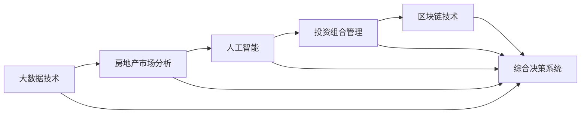

                 

# 如何利用技术能力进行房地产投资

## 1. 背景介绍

在现代社会，投资是实现财富增值的重要手段之一，其中房地产投资因其稳定性、长期回报率以及资产保值性，被广大投资者视为重要的投资方向。然而，房地产市场的不透明性、信息不对称以及地域性差异，使得普通投资者难以获取真实可靠的投资信息和判断市场趋势。技术在房地产投资中的应用，特别是人工智能和大数据技术，正在改变这一现状，为投资者提供更高效、精准的投资决策支持。

## 2. 核心概念与联系

### 2.1 核心概念概述

在利用技术能力进行房地产投资的过程中，涉及到几个关键概念：

- **人工智能 (AI)**: 一种通过模拟人类智能行为的技术，包括机器学习、深度学习等子领域，能够从大量数据中学习规律，提供精准的预测和决策支持。
- **大数据技术**: 处理、分析和利用大规模数据的技术，通过数据挖掘、统计分析等手段，揭示市场趋势和隐藏模式。
- **房地产市场分析**: 通过各种指标和模型，分析房地产市场的供需状况、价格趋势、政策影响等，为投资决策提供依据。
- **投资组合管理**: 通过多种投资手段（如股票、债券、基金等）的组合，分散风险，优化收益。
- **区块链技术**: 一种分布式账本技术，提供安全的交易记录和去中心化的市场信息共享。

这些概念之间存在着紧密的联系，共同构成了利用技术进行房地产投资的基础框架。

### 2.2 核心概念原理和架构的 Mermaid 流程图



这个流程图展示了从数据收集、市场分析、投资策略制定到综合决策系统的全过程。大数据技术用于市场分析，获取全面的市场数据；人工智能技术用于分析数据，揭示市场趋势和投资机会；投资组合管理用于制定投资策略，分散风险；区块链技术用于记录和共享市场信息，提高市场透明度。最终，这些技术共同构成了综合决策系统，为投资者提供精准的投资决策支持。

## 3. 核心算法原理 & 具体操作步骤

### 3.1 算法原理概述

利用技术进行房地产投资的核心在于，通过各种算法和技术手段，对市场数据进行深入分析，预测市场趋势，评估投资风险，制定投资策略。主要包括以下几个步骤：

1. **数据收集与清洗**：通过API、爬虫等技术手段，从政府公开数据、房地产平台、社交媒体等渠道获取大量数据。
2. **市场分析与预测**：利用机器学习和深度学习模型，对数据进行建模和分析，预测市场价格走势、供需变化等。
3. **投资策略制定**：根据预测结果，结合市场信息和投资目标，制定投资组合和交易策略。
4. **投资执行与监控**：通过程序化交易系统，执行投资策略，同时实时监控市场动态，及时调整策略。

### 3.2 算法步骤详解

#### 3.2.1 数据收集与清洗

数据收集是投资决策的基础。需要从不同渠道获取房地产市场相关的数据，包括但不限于：

- **政府公开数据**：如土地供应、房屋开工、销售等。
- **房地产平台数据**：如房价、租金、物业信息等。
- **社交媒体数据**：如论坛讨论、新闻报道等。

数据收集后，需要进行清洗和预处理，去除噪音和异常值，确保数据的准确性和一致性。例如，可以使用ETL工具对数据进行清洗和转换，使用正则表达式、数据挖掘技术等手段去除重复数据和错误信息。

#### 3.2.2 市场分析与预测

市场分析与预测是投资决策的核心步骤。主要包括以下两个方面：

- **时间序列分析**：使用ARIMA、LSTM等模型，对历史数据进行时间序列分析，预测未来市场趋势。
- **空间分析**：使用地理信息系统(GIS)和空间统计分析方法，对不同地域的市场进行比较分析，揭示地域性差异。

#### 3.2.3 投资策略制定

投资策略制定是投资决策的实施步骤。主要包括以下两个方面：

- **风险评估**：使用CAPM模型、VaR模型等，评估投资组合的风险水平。
- **收益优化**：使用组合优化算法，如遗传算法、模拟退火等，优化投资组合的收益。

#### 3.2.4 投资执行与监控

投资执行与监控是投资决策的反馈和调整步骤。主要包括以下两个方面：

- **程序化交易**：使用程序化交易系统，自动执行投资策略，减少人为干预，提高交易效率。
- **实时监控**：使用数据流技术，实时监控市场动态，及时调整投资策略。

### 3.3 算法优缺点

利用技术进行房地产投资，具有以下优点：

- **精准预测**：通过大数据和机器学习技术，可以精准预测市场趋势，减少投资风险。
- **高效执行**：利用程序化交易系统，可以快速执行投资策略，提高交易效率。
- **全面分析**：大数据技术可以收集和分析全面的市场信息，提供更加全面的市场分析。

同时，也存在以下缺点：

- **技术门槛高**：需要掌握多种技术手段和算法，对投资者技术水平要求较高。
- **数据隐私问题**：大数据收集和分析过程中，涉及大量个人信息，需要确保数据隐私和安全。
- **市场复杂性**：房地产市场受多种因素影响，如政策、经济、社会等，难以完全预测。

### 3.4 算法应用领域

利用技术进行房地产投资，可以应用于以下领域：

- **房地产价格预测**：通过时间序列分析和空间分析，预测不同地区、不同类型房地产的价格走势。
- **市场供需分析**：通过大数据分析，评估房地产市场的供需状况，指导投资决策。
- **投资组合管理**：通过风险评估和收益优化，制定多种投资组合，分散风险，优化收益。
- **智能交易**：利用程序化交易系统，实现自动执行投资策略，提高交易效率。
- **市场信息共享**：通过区块链技术，实现市场信息的去中心化共享，提高市场透明度。

## 4. 数学模型和公式 & 详细讲解 & 举例说明

### 4.1 数学模型构建

利用技术进行房地产投资，主要涉及到以下几个数学模型：

- **时间序列分析模型**：如ARIMA、LSTM等，用于预测市场价格走势。
- **空间分析模型**：如地理信息系统(GIS)、空间统计分析等，用于比较不同地域的市场。
- **风险评估模型**：如CAPM模型、VaR模型等，用于评估投资组合的风险水平。
- **收益优化模型**：如遗传算法、模拟退火等，用于优化投资组合的收益。

### 4.2 公式推导过程

以时间序列分析模型为例，推导ARIMA模型的公式：

设时间序列数据为 $\{y_t\}$，其中 $t$ 为时间索引。ARIMA模型的公式为：

$$ y_t = \mu + \sum_{i=1}^p \phi_i(y_{t-i}) + \sum_{j=1}^q \theta_j(\epsilon_{t-j}) + \epsilon_t $$

其中 $\mu$ 为常数项，$\phi_i$ 为自回归参数，$\theta_j$ 为移动平均参数，$\epsilon_t$ 为误差项。

通过拟合历史数据，求解参数 $\phi_i$ 和 $\theta_j$，即可预测未来数据。

### 4.3 案例分析与讲解

以房价预测为例，使用ARIMA模型进行预测：

1. **数据收集**：收集某城市的历年房价数据。
2. **数据预处理**：对数据进行清洗和标准化处理。
3. **模型训练**：使用ARIMA模型对数据进行拟合，求解参数 $\phi_i$ 和 $\theta_j$。
4. **模型预测**：使用训练好的模型，预测未来一年的房价走势。

## 5. 项目实践：代码实例和详细解释说明

### 5.1 开发环境搭建

在进行房地产投资项目实践前，需要准备好开发环境。以下是使用Python进行项目开发的详细步骤：

1. **安装Python**：从官网下载并安装Python，建议选择3.8及以上版本。
2. **安装依赖包**：使用pip安装必要的依赖包，如pandas、numpy、matplotlib、scikit-learn等。
3. **设置虚拟环境**：使用虚拟环境管理工具（如virtualenv）创建独立的环境，避免与其他项目冲突。

### 5.2 源代码详细实现

以下是一个使用Python进行房价预测的代码实例：

```python
import pandas as pd
from statsmodels.tsa.arima_model import ARIMA
from sklearn.metrics import mean_squared_error

# 读取数据
data = pd.read_csv('house_prices.csv')

# 数据预处理
data['year'] = pd.to_datetime(data['date']).dt.year
X = data.drop(columns=['price', 'date'])
y = data['price']

# 划分训练集和测试集
train_size = int(len(data) * 0.8)
X_train, X_test = X[:train_size], X[train_size:]
y_train, y_test = y[:train_size], y[train_size:]

# 构建ARIMA模型
model = ARIMA(y_train, order=(1, 1, 1))
model_fit = model.fit()

# 模型预测
y_pred = model_fit.forecast(steps=1)[0]

# 评估模型
mse = mean_squared_error(y_test, y_pred)
print(f'Mean Squared Error: {mse}')
```

### 5.3 代码解读与分析

1. **数据收集与预处理**：使用pandas库读取CSV文件，进行数据清洗和标准化处理。
2. **模型构建与训练**：使用statsmodels库中的ARIMA模型，拟合训练集数据，求解参数。
3. **模型预测与评估**：使用训练好的模型，对测试集数据进行预测，并使用均方误差(MSE)评估模型效果。

## 6. 实际应用场景

### 6.1 智能投资顾问

智能投资顾问是一种基于技术的投资管理服务，通过大数据和人工智能技术，为用户提供个性化的投资建议。例如，可以使用机器学习模型分析用户的投资偏好、风险承受能力等，结合市场分析结果，生成投资组合和交易策略。智能投资顾问可以减少人为干预，提高投资决策的科学性和精确性。

### 6.2 市场价格监测

市场价格监测是利用技术手段，实时监测房地产市场价格变化，及时发现价格波动和异常情况。例如，可以使用爬虫技术获取实时行情数据，结合大数据分析技术，生成价格预警系统，及时通知投资者。市场价格监测可以提高投资者的反应速度，减少投资风险。

### 6.3 投资组合优化

投资组合优化是利用技术手段，对多种投资工具进行组合，分散风险，优化收益。例如，可以使用遗传算法等优化算法，对股票、债券、基金等投资组合进行优化，提高整体收益。投资组合优化可以提高投资决策的科学性和可靠性，减少投资风险。

### 6.4 未来应用展望

随着技术的不断进步，利用技术进行房地产投资将会有更广阔的应用前景：

1. **实时数据处理**：利用流处理技术，实时处理市场数据，提供及时的市场动态。
2. **智能决策支持**：利用深度学习和自然语言处理技术，提供智能化的决策支持，帮助投资者快速做出决策。
3. **去中心化交易**：利用区块链技术，实现去中心化的交易系统，提高交易的透明性和安全性。
4. **个性化服务**：利用大数据和人工智能技术，提供个性化的投资服务，满足不同投资者的需求。

## 7. 工具和资源推荐

### 7.1 学习资源推荐

为了帮助投资者系统掌握技术能力进行房地产投资，以下是一些优质的学习资源：

1. **《Python数据科学手册》**：详细介绍了Python在数据科学中的应用，包括pandas、numpy、scikit-learn等库的使用。
2. **Coursera《机器学习》课程**：由斯坦福大学开设，涵盖了机器学习的基本概念和常用算法。
3. **Kaggle平台**：全球最大的数据科学竞赛平台，提供丰富的数据集和竞赛题目，锻炼实战能力。
4. **《房地产投资：从入门到精通》书籍**：详细介绍了房地产投资的基本概念、市场分析方法、投资策略等。

通过学习这些资源，投资者可以快速掌握技术能力进行房地产投资。

### 7.2 开发工具推荐

高效的开发离不开优秀的工具支持。以下是几款用于房地产投资开发的常用工具：

1. **Jupyter Notebook**：免费的开源Jupyter Notebook环境，支持Python、R等语言的开发，方便实时编写和测试代码。
2. **PyTorch**：由Facebook开发的深度学习框架，支持动态计算图，适合快速迭代研究。
3. **TensorFlow**：由Google主导开发的深度学习框架，支持分布式计算，适合大规模工程应用。
4. **Scikit-learn**：Python的机器学习库，提供了丰富的机器学习算法和数据预处理工具。
5. **ELK Stack**：由Elasticsearch、Logstash和Kibana组成的数据分析平台，支持实时数据处理和可视化分析。

合理利用这些工具，可以显著提升房地产投资项目的开发效率，加快创新迭代的步伐。

### 7.3 相关论文推荐

房地产投资技术的研究源于学界的持续研究。以下是几篇奠基性的相关论文，推荐阅读：

1. **《利用机器学习预测房价：实证研究》**：详细介绍了利用机器学习模型预测房价的实验结果和模型评估方法。
2. **《基于深度学习的大数据驱动投资策略》**：提出了基于深度学习的投资策略，并利用大数据技术进行模型训练和评估。
3. **《智能投资顾问：一种新型的投资管理服务》**：介绍了智能投资顾问的基本原理和应用案例。
4. **《利用区块链技术优化房地产市场交易》**：提出了利用区块链技术提高房地产市场交易透明性和安全性的方法。

这些论文代表了大数据和人工智能在房地产投资领域的发展脉络。通过学习这些前沿成果，可以帮助投资者把握学科前进方向，激发更多的创新灵感。

## 8. 总结：未来发展趋势与挑战

### 8.1 研究成果总结

本文对利用技术能力进行房地产投资的方法进行了全面系统的介绍。首先阐述了技术在房地产投资中的应用背景和意义，明确了技术能力对提高投资决策的科学性和精确性的重要作用。其次，从原理到实践，详细讲解了基于大数据和人工智能的房地产投资技术框架和核心步骤，给出了房地产投资项目的代码实例。同时，本文还广泛探讨了技术在智能投资顾问、市场价格监测、投资组合优化等多个应用场景中的应用前景，展示了技术能力在房地产投资中的巨大潜力。

通过本文的系统梳理，可以看到，利用技术能力进行房地产投资正在成为一种新的趋势，极大地提升了投资决策的科学性和可靠性。未来，伴随大数据和人工智能技术的持续演进，房地产投资技术将进一步发展，为投资者提供更加精准、高效的决策支持。

### 8.2 未来发展趋势

展望未来，利用技术进行房地产投资将呈现以下几个发展趋势：

1. **数据驱动决策**：利用大数据和机器学习技术，进行精准的市场分析，提供数据驱动的投资决策支持。
2. **智能决策支持**：利用深度学习和自然语言处理技术，提供智能化的决策支持，提高投资决策的科学性和精确性。
3. **去中心化交易**：利用区块链技术，实现去中心化的交易系统，提高交易的透明性和安全性。
4. **个性化服务**：利用大数据和人工智能技术，提供个性化的投资服务，满足不同投资者的需求。
5. **实时处理能力**：利用流处理技术，实时处理市场数据，提供及时的市场动态。

以上趋势凸显了利用技术进行房地产投资技术的广阔前景。这些方向的探索发展，必将进一步提升房地产投资决策的科学性和可靠性，为投资者带来更优质的投资体验。

### 8.3 面临的挑战

尽管利用技术进行房地产投资已经取得了显著进展，但在迈向更加智能化、普适化应用的过程中，仍面临诸多挑战：

1. **数据获取难度大**：房地产市场数据具有地域性和非结构化特点，获取难度较大。
2. **模型复杂度高**：房地产市场受多种因素影响，需要构建复杂模型进行综合分析。
3. **技术门槛高**：需要掌握多种技术手段和算法，对投资者技术水平要求较高。
4. **数据隐私问题**：大数据收集和分析过程中，涉及大量个人信息，需要确保数据隐私和安全。
5. **市场复杂性**：房地产市场受多种因素影响，难以完全预测。

这些挑战需要投资者和研究人员共同努力，积极应对并寻求突破，才能真正实现技术能力在房地产投资中的广泛应用。

### 8.4 研究展望

面对利用技术进行房地产投资所面临的挑战，未来的研究需要在以下几个方面寻求新的突破：

1. **数据收集和处理**：研究更高效、更可靠的数据收集和处理技术，解决数据获取难题。
2. **模型优化和简化**：研究更简单、更高效的模型构建方法，降低技术门槛。
3. **隐私保护技术**：研究更安全、更可靠的数据隐私保护技术，确保数据安全。
4. **市场预测技术**：研究更准确、更鲁棒的模型预测方法，提高市场预测精度。
5. **智能决策系统**：研究更智能、更可靠的决策支持系统，提高投资决策的科学性和精确性。

这些研究方向的探索，必将引领利用技术进行房地产投资技术迈向更高的台阶，为投资者提供更加精准、高效的决策支持。面向未来，需要从数据、算法、工程、业务等多个维度协同发力，才能真正实现技术能力在房地产投资中的广泛应用。

## 9. 附录：常见问题与解答

**Q1：技术能力在房地产投资中有什么优势？**

A: 技术能力在房地产投资中的优势主要体现在以下几个方面：

- **精准预测**：利用大数据和机器学习技术，可以精准预测市场趋势，减少投资风险。
- **高效执行**：利用程序化交易系统，可以快速执行投资策略，提高交易效率。
- **全面分析**：大数据技术可以收集和分析全面的市场信息，提供更加全面的市场分析。

**Q2：如何选择合适的机器学习模型？**

A: 选择合适的机器学习模型需要考虑多个因素，包括数据特征、问题类型、模型复杂度等。以下是一些常见的选择建议：

- **时间序列分析**：对于预测价格走势等问题，可以使用ARIMA、LSTM等时间序列分析模型。
- **空间分析**：对于比较不同地域的市场等问题，可以使用地理信息系统(GIS)和空间统计分析模型。
- **风险评估**：对于评估投资组合的风险等问题，可以使用CAPM模型、VaR模型等风险评估模型。

**Q3：数据隐私问题如何解决？**

A: 数据隐私问题是技术在房地产投资中面临的重要挑战。以下是一些解决数据隐私问题的方法：

- **匿名化处理**：对数据进行匿名化处理，去除敏感信息，保护用户隐私。
- **数据加密**：使用数据加密技术，确保数据在传输和存储过程中的安全性。
- **隐私保护算法**：使用隐私保护算法，如差分隐私、联邦学习等，确保数据隐私不受侵犯。

**Q4：房地产市场复杂性如何应对？**

A: 房地产市场复杂性是技术在房地产投资中面临的另一个挑战。以下是一些应对方法：

- **多因素分析**：将多种因素（如政策、经济、社会等）纳入模型，进行综合分析。
- **专家知识结合**：引入专家知识和经验，指导模型的构建和优化。
- **模型集成**：使用集成学习等方法，综合多个模型的预测结果，提高预测准确性。

**Q5：技术能力在房地产投资中的应用前景如何？**

A: 技术能力在房地产投资中的应用前景广阔，随着大数据和人工智能技术的不断进步，未来会有更广泛的应用。以下是一些应用前景：

- **智能投资顾问**：利用技术手段，提供个性化的投资建议，减少人为干预。
- **市场价格监测**：利用技术手段，实时监测市场价格变化，及时发现价格波动和异常情况。
- **投资组合优化**：利用技术手段，对多种投资工具进行组合，分散风险，优化收益。
- **去中心化交易**：利用技术手段，实现去中心化的交易系统，提高交易的透明性和安全性。
- **个性化服务**：利用技术手段，提供个性化的投资服务，满足不同投资者的需求。

通过技术手段的不断探索和应用，房地产投资将变得更加精准、高效和智能化，为投资者带来更好的投资体验。

---

作者：禅与计算机程序设计艺术 / Zen and the Art of Computer Programming

