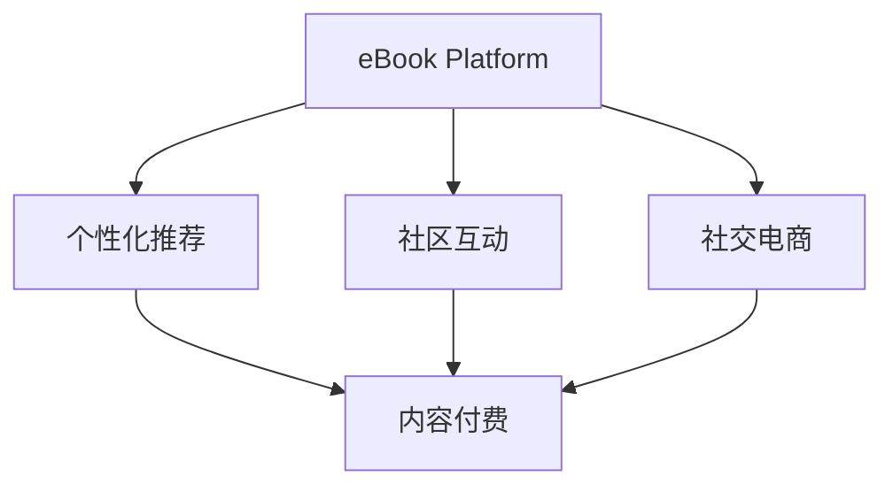

                 

# 如何利用电子书平台实现知识变现

> 关键词：电子书平台, 知识变现, 数字化转型, 在线教育, 内容付费

## 1. 背景介绍

### 1.1 问题由来
随着数字化时代的到来，传统的纸质书籍面临着数字化的转型压力。电子书平台作为一种新兴的阅读形式，正在逐步改变人们的阅读习惯和获取知识的方式。同时，互联网技术和人工智能的快速发展，为电子书平台提供了广阔的业务创新空间。如何利用电子书平台实现知识变现，成为了当前图书出版行业和互联网企业共同关注的焦点。

### 1.2 问题核心关键点
知识变现的核心在于内容的优质化和服务的创新化。电子书平台需要整合优质内容资源，通过个性化推荐、社区互动、社交电商等多种形式，吸引用户并实现盈利。在技术层面，需要借助大数据、推荐算法、自然语言处理、人工智能等先进技术，提升用户体验和运营效率。

### 1.3 问题研究意义
利用电子书平台实现知识变现，不仅有助于提升出版行业和互联网企业的商业价值，还能推动知识的广泛传播，加速全社会的数字化转型。此外，电子书平台还可以为职业教育和终身学习提供新的解决方案，助力知识社会的建设。

## 2. 核心概念与联系

### 2.1 核心概念概述

为了更好地理解电子书平台的知识变现过程，本节将介绍几个密切相关的核心概念：

- 电子书平台(Ebook Platform)：以数字内容为核心的在线阅读平台，支持用户随时随地阅读电子书。常见的电子书平台包括Amazon Kindle、Apple Books、百度文库等。
- 知识变现(Knowledge Monetization)：通过内容资源的高效转化，实现知识的商业价值，包括订阅费、购买费、广告费、会员费等多种盈利模式。
- 个性化推荐(Personalized Recommendation)：利用大数据和推荐算法，为每个用户推荐感兴趣的电子书和相关内容，提升用户粘性和满意度。
- 社区互动(Community Interaction)：通过评论、点赞、分享等形式，构建用户之间的互动社区，增强用户参与度和平台粘性。
- 社交电商(Social E-commerce)：结合社交网络和电商功能，通过用户社交行为推荐商品，提升平台转化率和用户消费体验。
- 内容付费(Content Paywall)：提供部分内容免费浏览，对付费内容进行收费，提升平台盈利能力。

这些核心概念之间的逻辑关系可以通过以下Mermaid流程图来展示：



这个流程图展示了一些关键概念及其相互关系：

1. 电子书平台作为核心平台，支持个性化推荐、社区互动和社交电商。
2. 个性化推荐和社区互动为内容付费提供数据支持，提升平台盈利能力。
3. 社交电商结合内容付费，形成完整的商业闭环。

## 3. 核心算法原理 & 具体操作步骤
### 3.1 算法原理概述

电子书平台的知识变现过程，本质上是一个基于内容的高效转化过程。其核心在于如何通过用户行为数据和内容特征，为用户提供高相关性、高价值的推荐内容，从而实现内容的付费销售。

形式化地，假设电子书平台的数据集为 $D=\{(x_i,y_i)\}_{i=1}^N$，其中 $x_i$ 为用户行为数据，$y_i$ 为对应内容的付费情况。知识变现的目标是找到最优的推荐模型 $M$，使得推荐内容 $x_i$ 的付费率最大化，即：

$$
\max_{M} \frac{1}{N} \sum_{i=1}^N y_i
$$

其中 $N$ 为样本数量，$y_i$ 为内容 $x_i$ 的付费情况。

在实际操作中，通常采用分类任务的目标函数，对内容进行二分类：付费和非付费。即定义内容付费模型 $M_{\theta}$，其参数 $\theta$ 为模型权重。通过梯度下降等优化算法，最小化损失函数 $\mathcal{L}(M_{\theta},D)$，即可得到最优模型权重 $\hat{\theta}$。

### 3.2 算法步骤详解

电子书平台的知识变现过程一般包括以下几个关键步骤：

**Step 1: 数据准备与特征工程**
- 收集平台用户行为数据，如阅读时长、点击率、收藏标记、评论情感等。
- 从平台内容库中提取书籍的元数据，如作者、出版社、出版时间、主题等。
- 将用户行为数据和内容元数据进行特征工程，提取有意义的特征向量。

**Step 2: 模型选择与训练**
- 选择合适的推荐算法，如协同过滤、基于内容的推荐、深度学习等。
- 将数据集划分为训练集、验证集和测试集。
- 使用随机梯度下降等优化算法，训练推荐模型，最小化损失函数。
- 在验证集上评估模型性能，调整超参数。

**Step 3: 推荐系统部署与优化**
- 将训练好的推荐模型部署到生产环境。
- 实时获取用户行为数据，进行推荐预测。
- 利用A/B测试等方法，不断优化推荐算法和模型参数。
- 结合用户反馈，进行推荐策略调整。

**Step 4: 商业化变现与用户激励**
- 在推荐系统中集成内容付费机制，对付费内容进行收费。
- 提供多种支付方式，如信用卡、支付宝、微信支付等。
- 通过积分、优惠券、会员制度等方式，激励用户进行付费。
- 定期更新推荐内容，吸引新用户和老用户持续消费。

### 3.3 算法优缺点

电子书平台的个性化推荐算法，具有以下优点：
1. 提升用户体验：通过个性化推荐，用户能够快速找到感兴趣的书籍，提升阅读体验。
2. 增加用户粘性：推荐系统能够持续推送高相关性内容，增加用户留存率。
3. 增加平台收入：内容付费机制能够提升平台盈利能力，实现知识变现。
4. 数据驱动决策：基于数据的推荐模型能够更好地理解和预测用户行为。

同时，该算法也存在以下局限性：
1. 数据依赖性高：推荐系统的效果很大程度上依赖于用户行为数据的质量和数量，数据获取成本较高。
2. 推荐鲁棒性不足：在用户行为变化较大或新用户首次使用时，推荐效果可能不佳。
3. 系统复杂度高：推荐算法通常需要大量的特征工程和超参数调优，开发和维护成本较高。
4. 冷启动问题：新用户或新内容的冷启动问题，可能导致推荐效果初期不理想。

尽管存在这些局限性，但就目前而言，基于用户行为数据的个性化推荐算法仍是电子书平台知识变现的主要技术范式。未来相关研究的重点在于如何进一步降低数据获取成本，提高推荐鲁棒性，优化推荐算法，同时兼顾推荐系统的稳定性和用户隐私保护。

### 3.4 算法应用领域

电子书平台的个性化推荐算法，广泛应用于各类数字内容平台，包括图书、杂志、报纸、漫画、音视频等。具体应用场景包括：

- 图书推荐：基于用户阅读历史和书籍元数据，推荐用户感兴趣的书籍。
- 文章推荐：根据用户浏览行为，推荐相关文章。
- 视频推荐：根据用户观看历史和视频标签，推荐相关视频内容。
- 音乐推荐：根据用户听歌历史和歌曲标签，推荐相关音乐。
- 新闻推荐：基于用户阅读偏好和新闻标签，推荐相关新闻内容。

除了以上常见的应用场景，推荐算法还被创新性地应用于商品推荐、电商促销、广告投放等领域，为平台带来更多的商业价值。

## 4. 数学模型和公式 & 详细讲解  
### 4.1 数学模型构建

本节将使用数学语言对电子书平台的个性化推荐系统进行更加严格的刻画。

记推荐系统模型为 $M_{\theta}(x)$，其中 $x$ 为输入特征，$\theta$ 为模型参数。假设推荐系统的数据集为 $D=\{(x_i,y_i)\}_{i=1}^N$，其中 $x_i$ 为用户行为数据，$y_i$ 为内容付费情况。

定义推荐系统模型 $M_{\theta}$ 在输入特征 $x$ 上的损失函数为 $\ell(M_{\theta}(x),y)$，则在数据集 $D$ 上的经验风险为：

$$
\mathcal{L}(\theta) = \frac{1}{N} \sum_{i=1}^N \ell(M_{\theta}(x_i),y_i)
$$

其中 $\ell$ 为二分类交叉熵损失函数，用于衡量模型预测结果与真实标签之间的差异。

推荐系统的优化目标是最小化经验风险，即找到最优参数：

$$
\theta^* = \mathop{\arg\min}_{\theta} \mathcal{L}(\theta)
$$

在实践中，我们通常使用基于梯度的优化算法（如SGD、Adam等）来近似求解上述最优化问题。设 $\eta$ 为学习率，则参数的更新公式为：

$$
\theta \leftarrow \theta - \eta \nabla_{\theta}\mathcal{L}(\theta)
$$

其中 $\nabla_{\theta}\mathcal{L}(\theta)$ 为损失函数对参数 $\theta$ 的梯度，可通过反向传播算法高效计算。

### 4.2 公式推导过程

以下我们以协同过滤算法为例，推导损失函数的梯度计算公式。

协同过滤算法通过计算用户对物品的评分，预测用户对未评分物品的评分，从而进行推荐。设用户 $i$ 对物品 $j$ 的评分向量为 $r_i \in \mathbb{R}^N$，物品 $j$ 的评分向量为 $r_j \in \mathbb{R}^M$。协同过滤算法的目标是预测用户对未评分物品的评分，从而进行推荐。假设模型 $M_{\theta}$ 在输入特征 $x$ 上的预测评分向量为 $\hat{r} \in \mathbb{R}^M$，则在数据集 $D$ 上的经验风险为：

$$
\mathcal{L}(\theta) = \frac{1}{N} \sum_{i=1}^N \frac{1}{2}\sum_{j=1}^M (\hat{r}_j - r_i^T r_j)^2
$$

根据链式法则，损失函数对参数 $\theta_k$ 的梯度为：

$$
\frac{\partial \mathcal{L}(\theta)}{\partial \theta_k} = \frac{1}{N} \sum_{i=1}^N \sum_{j=1}^M (\hat{r}_j - r_i^T r_j)(-r_i)_k
$$

其中 $(-r_i)_k$ 为第 $k$ 维用户评分的偏导数，可根据具体评分模型进行计算。

在得到损失函数的梯度后，即可带入参数更新公式，完成模型的迭代优化。重复上述过程直至收敛，最终得到适应推荐系统任务的最优模型参数 $\theta^*$。

## 5. 项目实践：代码实例和详细解释说明
### 5.1 开发环境搭建

在进行电子书平台推荐系统开发前，我们需要准备好开发环境。以下是使用Python进行Scikit-learn开发的环境配置流程：

1. 安装Anaconda：从官网下载并安装Anaconda，用于创建独立的Python环境。

2. 创建并激活虚拟环境：
```bash
conda create -n sklearn-env python=3.8 
conda activate sklearn-env
```

3. 安装Scikit-learn：
```bash
pip install scikit-learn
```

4. 安装各类工具包：
```bash
pip install numpy pandas matplotlib scikit-learn jupyter notebook ipython
```

完成上述步骤后，即可在`sklearn-env`环境中开始推荐系统开发。

### 5.2 源代码详细实现

这里我们以基于协同过滤算法的电子书推荐系统为例，给出使用Scikit-learn库对用户和书籍评分矩阵进行建模的代码实现。

首先，定义协同过滤算法的数据处理函数：

```python
from sklearn.metrics.pairwise import cosine_similarity

def predict_ratings(user, ratings, similarity_threshold=0.3):
    user_scores = {}
    for item, score in ratings.items():
        user_scores[item] = score[1]
        
    similarities = {}
    for item, score in user_scores.items():
        for other_item in ratings.keys():
            if other_item != item:
                similarity = cosine_similarity([user_scores[item]], [ratings[other_item]][1])[0][0]
                similarities[other_item] = similarity
    
    recommended_items = []
    for item, similarity in similarities.items():
        if similarity >= similarity_threshold:
            recommended_items.append(item)
    
    return recommended_items[:5] # 只返回前5个推荐项
```

然后，定义用户和书籍评分矩阵的生成函数：

```python
import random

def generate_ratings(num_users, num_items, num_reviews_per_user, num_reviews_per_item, rating_range=(1, 5)):
    ratings = {}
    for user in range(num_users):
        for item in range(num_items):
            for _ in range(num_reviews_per_user):
                rating = random.uniform(*rating_range)
                ratings[(user, item)] = (rating, random.uniform(*rating_range))
            for _ in range(num_reviews_per_item):
                rating = random.uniform(*rating_range)
                ratings[(item, user)] = (rating, random.uniform(*rating_range))
    
    return ratings
```

接着，定义推荐系统的主函数：

```python
from sklearn.metrics.pairwise import cosine_similarity
from sklearn.decomposition import TruncatedSVD

def recommendation_system(ratings, num_topics=5, similarity_threshold=0.3):
    similarities = {}
    for user, user_ratings in ratings.items():
        for item, score in user_ratings.items():
            for other_item in ratings.keys():
                if other_item != item:
                    similarity = cosine_similarity([user_ratings[item]], [ratings[other_item]][1])[0][0]
                    similarities[other_item] = similarity
    
    svd = TruncatedSVD(n_components=num_topics, random_state=42).fit_transform(similarities.values())
    svd = svd / np.linalg.norm(svd, axis=1, keepdims=True)
    cosine_similarity = 1 - (1 - svd) ** 2
    
    recommended_items = []
    for user, user_ratings in ratings.items():
        user_scores = {}
        for item, score in user_ratings.items():
            user_scores[item] = score[1]
        
        recommended_items.append(predict_ratings(user, user_scores, similarity_threshold))
    
    return recommended_items
```

最后，启动推荐系统并进行推荐预测：

```python
num_users = 1000
num_items = 10000
num_reviews_per_user = 5
num_reviews_per_item = 5

ratings = generate_ratings(num_users, num_items, num_reviews_per_user, num_reviews_per_item)

print("All ratings generated.")
print(f"Total ratings: {len(ratings)}")

recommendations = recommendation_system(ratings)
for user, recommendations in enumerate(recommendations):
    print(f"User {user+1} recommendations: {recommendations}")
```

以上就是使用Scikit-learn对协同过滤算法进行电子书推荐系统开发的完整代码实现。可以看到，通过Scikit-learn的封装，协同过滤算法的实现变得简洁高效。

### 5.3 代码解读与分析

让我们再详细解读一下关键代码的实现细节：

**generate_ratings函数**：
- 生成随机用户对物品的评分矩阵，用于模拟用户行为数据。评分矩阵 $R$ 的行表示用户，列表示物品，值表示评分。

**recommendation_system函数**：
- 利用cosine_similarity计算物品之间的相似度。
- 使用TruncatedSVD算法进行降维，得到特征向量。
- 将特征向量转化为余弦相似度矩阵，用于推荐计算。
- 调用predict_ratings函数，基于用户评分和物品相似度进行推荐。

**predict_ratings函数**：
- 计算用户对未评分物品的评分预测。
- 根据物品相似度，进行推荐排序。
- 只返回前5个推荐项。

可以看到，Scikit-learn提供的协同过滤算法封装已经非常完善，开发者只需进行简单的函数调用和参数配置，即可快速构建推荐系统模型。这种高效易用的特性，使得Scikit-learn成为推荐系统开发的首选工具。

当然，工业级的系统实现还需考虑更多因素，如模型的实时性、可扩展性、用户隐私保护等。但核心的协同过滤算法基本与此类似。

## 6. 实际应用场景
### 6.1 智能阅读助手

基于电子书平台的个性化推荐系统，可以应用于智能阅读助手的开发。智能阅读助手能够根据用户的历史阅读记录和兴趣偏好，实时推送相关书籍和文章，提升用户的阅读体验。

在技术实现上，智能阅读助手需要整合用户的阅读记录、浏览行为、点赞标记等数据，利用推荐算法实时预测用户可能感兴趣的内容，并进行智能推送。此外，智能阅读助手还可以结合自然语言处理技术，进行文本理解和知识图谱构建，进一步提升推荐精准度。

### 6.2 在线教育平台

电子书平台还为在线教育提供了新的可能性。传统的在线教育平台往往依赖于教师和课程的固定化，难以满足个性化学习需求。利用电子书平台的推荐系统，可以为每个用户定制个性化的学习路径和推荐课程，提升学习效果。

在实践中，在线教育平台可以整合用户的学习历史、答题记录、学习偏好等数据，利用推荐算法为用户推荐最适合的学习资源。同时，平台还可以集成互动和社区功能，构建学习社群，促进知识共享和交流。

### 6.3 数字内容销售

电子书平台的个性化推荐系统，还可以应用于数字内容的销售。通过精准推荐，可以提升内容的点击率、转化率和复购率，增加平台的收入。

在实践中，数字内容销售平台可以整合用户的购买记录、浏览行为、评分反馈等数据，利用推荐算法为用户推荐感兴趣的内容，并进行定向广告投放。同时，平台还可以引入订阅模式，通过会员费、阅读时长等方式进行收费。

### 6.4 未来应用展望

随着电子书平台推荐技术的不断发展，基于个性化推荐的知识变现形式将更加丰富和多样。

在智慧媒体领域，推荐系统能够帮助用户快速找到感兴趣的新闻和视频内容，提升用户粘性和平台收入。同时，平台还可以通过个性化广告，实现精准投放和用户互动。

在智慧零售领域，推荐系统能够结合用户行为数据和商品标签，为电商用户提供个性化购物建议，提升转化率和消费体验。同时，平台还可以利用推荐系统进行库存管理和商品调优。

在智慧金融领域，推荐系统能够根据用户的历史交易记录和行为数据，为用户提供个性化的金融产品推荐，提升用户满意度和平台盈利能力。

除此之外，推荐系统还可以应用于智慧旅游、智慧健康、智慧交通等多个领域，为不同行业带来新的商业模式和价值。

## 7. 工具和资源推荐
### 7.1 学习资源推荐

为了帮助开发者系统掌握电子书平台推荐技术，这里推荐一些优质的学习资源：

1. 《推荐系统实践》书籍：该书详细介绍了推荐系统的发展历史、常用算法和实现细节，是推荐系统领域的经典之作。

2. CS229《机器学习》课程：斯坦福大学开设的机器学习课程，系统讲解了推荐系统和其他机器学习模型的理论基础和实现方法。

3. Kaggle推荐系统竞赛：通过参加Kaggle比赛，实践推荐算法，提升系统性能，积累项目经验。

4. HuggingFace官方文档：包含丰富的推荐算法和模型库，适合初学者入门和专家深入学习。

5. Coursera推荐系统课程：由Coursera与Edison School联合推出，结合理论和实践，系统学习推荐系统设计。

通过对这些资源的学习实践，相信你一定能够快速掌握电子书平台推荐技术的精髓，并用于解决实际的推荐问题。

### 7.2 开发工具推荐

高效的开发离不开优秀的工具支持。以下是几款用于电子书平台推荐系统开发的常用工具：

1. Scikit-learn：Python的机器学习库，支持多种推荐算法和模型，适合快速迭代研究。

2. TensorFlow：由Google主导开发的深度学习框架，支持大规模分布式训练和模型部署，适合工业级应用。

3. PyTorch：由Facebook主导开发的深度学习框架，灵活易用，适合研究和原型开发。

4. Dask：Python的并行计算库，支持大数据量的高效处理和模型训练，适合大数据应用。

5. Spark MLlib：Apache Spark的机器学习库，支持分布式计算和模型训练，适合大数据量场景。

6. Elasticsearch：实时搜索和数据分析引擎，支持分布式存储和查询优化，适合推荐系统数据存储和检索。

合理利用这些工具，可以显著提升电子书平台推荐系统的开发效率，加快创新迭代的步伐。

### 7.3 相关论文推荐

电子书平台推荐技术的发展源于学界的持续研究。以下是几篇奠基性的相关论文，推荐阅读：

1. Matrix Factorization Techniques for Recommender Systems：提出矩阵分解方法，通过分解用户行为矩阵，发现隐式用户兴趣和物品特征，提升推荐效果。

2. Factorization Machines for Ad-click Prediction：提出因子机模型，通过多层非线性组合和正则化，提升广告点击率和转化率。

3. Deep Neural Networks for Large-scale Recommender Systems：提出深度神经网络模型，通过多层非线性映射，提升推荐精度和多样性。

4. Attention is All you Need：提出Transformer模型，通过自注意力机制，提升推荐系统的表示能力。

5. BERT: Pre-training of Deep Bidirectional Transformers for Language Understanding：提出BERT模型，引入基于掩码的自监督预训练任务，提升推荐模型的泛化能力。

这些论文代表了大语言模型推荐技术的发展脉络。通过学习这些前沿成果，可以帮助研究者把握学科前进方向，激发更多的创新灵感。

## 8. 总结：未来发展趋势与挑战

### 8.1 总结

本文对基于用户行为数据的电子书平台推荐系统进行了全面系统的介绍。首先阐述了推荐系统的发展背景和核心概念，明确了个性化推荐在知识变现中的关键作用。其次，从原理到实践，详细讲解了推荐系统的数学模型和算法实现，给出了推荐系统开发的完整代码实例。同时，本文还广泛探讨了推荐系统在智能阅读助手、在线教育平台、数字内容销售等多个行业领域的应用前景，展示了推荐技术的广阔前景。

通过本文的系统梳理，可以看到，基于用户行为数据的推荐系统已经成为电子书平台知识变现的核心技术。其高效、精准的推荐能力，极大地提升了平台的商业价值和用户体验。未来，伴随推荐技术的持续演进，相信电子书平台的知识变现形式将更加多样化，为用户带来更优质的阅读和学习体验。

### 8.2 未来发展趋势

电子书平台的推荐技术将呈现以下几个发展趋势：

1. 算法多样性增加。除了协同过滤，未来会涌现更多高效的推荐算法，如深度学习、强化学习等，提升推荐精度和系统稳定性。

2. 数据驱动决策。基于用户行为数据的推荐系统，能够更好地理解用户需求，提供个性化的内容推荐。

3. 实时化推荐。通过实时数据流处理和在线学习，实现动态推荐，提升用户体验。

4. 跨模态融合。将文本、图像、视频等多种模态数据融合到推荐系统中，提升推荐效果和用户粘性。

5. 个性化推荐增强。通过深度学习和知识图谱技术，提升推荐系统的个性化能力和泛化能力。

6. 数据隐私保护。在推荐系统中加入数据隐私保护机制，确保用户数据的保密性和安全性。

以上趋势凸显了电子书平台推荐技术的广阔前景。这些方向的探索发展，必将进一步提升推荐系统的性能和应用范围，为数字内容产业带来新的价值。

### 8.3 面临的挑战

尽管电子书平台的推荐技术已经取得了瞩目成就，但在迈向更加智能化、普适化应用的过程中，它仍面临着诸多挑战：

1. 数据质量瓶颈。推荐系统的效果很大程度上依赖于用户行为数据的质量和数量，获取高质量数据的成本较高。如何进一步降低数据获取成本，提高数据质量，将是关键难题。

2. 冷启动问题。新用户或新内容的冷启动问题，可能导致推荐效果初期不理想。如何提升推荐系统的冷启动性能，是一个重要研究方向。

3. 推荐鲁棒性不足。在用户行为变化较大或新用户首次使用时，推荐效果可能不佳。如何提高推荐系统的鲁棒性，减少推荐偏差，是一个亟待解决的问题。

4. 系统复杂度高。推荐算法通常需要大量的特征工程和超参数调优，开发和维护成本较高。如何简化推荐系统的实现，提升系统性能，是一个技术挑战。

5. 用户隐私保护。推荐系统中包含了大量用户数据，如何保护用户隐私，确保数据的安全和合规，是一个重要课题。

6. 商业化应用难度大。推荐系统需要与其他业务环节深度整合，实现商业变现。如何提升推荐系统的商业应用能力，是一个实际挑战。

正视推荐系统面临的这些挑战，积极应对并寻求突破，将是大数据时代电子书平台推荐技术迈向成熟的必由之路。相信随着学界和产业界的共同努力，这些挑战终将一一被克服，推荐系统必将在构建人机协同的智能时代中扮演越来越重要的角色。

### 8.4 研究展望

面向未来，推荐系统的研究需要在以下几个方面寻求新的突破：

1. 探索无监督和半监督推荐方法。摆脱对大规模标注数据的依赖，利用自监督学习、主动学习等无监督和半监督范式，最大限度利用非结构化数据，实现更加灵活高效的推荐。

2. 研究参数高效和计算高效的推荐范式。开发更加参数高效的推荐方法，在固定大部分用户行为数据的情况下，只更新极少量的推荐模型参数。同时优化推荐系统的计算图，减少前向传播和反向传播的资源消耗，实现更加轻量级、实时性的部署。

3. 融合因果和对比学习范式。通过引入因果推断和对比学习思想，增强推荐系统建立稳定因果关系的能力，学习更加普适、鲁棒的用户行为表示，从而提升推荐系统泛化性和抗干扰能力。

4. 引入更多先验知识。将符号化的先验知识，如知识图谱、逻辑规则等，与推荐系统进行巧妙融合，引导推荐过程学习更准确、合理的用户行为表示。同时加强不同模态数据的整合，实现视觉、语音等多模态信息与文本信息的协同建模。

5. 结合因果分析和博弈论工具。将因果分析方法引入推荐系统，识别出推荐决策的关键特征，增强推荐系统输出解释的因果性和逻辑性。借助博弈论工具刻画人机交互过程，主动探索并规避推荐系统的脆弱点，提高系统稳定性。

6. 纳入伦理道德约束。在推荐系统训练目标中引入伦理导向的评估指标，过滤和惩罚有偏见、有害的推荐内容。同时加强人工干预和审核，建立推荐系统行为的监管机制，确保推荐内容的公正性和安全性。

这些研究方向的探索，必将引领推荐系统技术迈向更高的台阶，为数字内容产业带来新的价值。面向未来，推荐系统还需要与其他人工智能技术进行更深入的融合，如知识表示、因果推理、强化学习等，多路径协同发力，共同推动数字内容产业的发展。只有勇于创新、敢于突破，才能不断拓展推荐系统的边界，让智能技术更好地造福数字内容产业。

## 9. 附录：常见问题与解答

**Q1：推荐系统如何处理用户冷启动问题？**

A: 冷启动问题是指新用户或新物品的推荐效果初期不理想。为了解决冷启动问题，推荐系统通常采用以下几种方法：

1. 内容推荐：利用物品的元数据信息进行推荐，如热门书籍、热门文章等。

2. 相似度推荐：利用相似用户的行为数据进行推荐，如相似用户的阅读记录、购买记录等。

3. 标签推荐：利用物品的标签信息进行推荐，如书籍的分类标签、热门标签等。

4. 协同过滤：利用用户对物品的评分进行推荐，虽然需要较长的数据积累期，但在积累足够数据后，能够实现较好的推荐效果。

5. 混合推荐：结合多种推荐算法，提升推荐系统的综合表现。

综上所述，推荐系统需要根据具体场景选择合适的方法，综合多种数据源和推荐算法，才能有效应对冷启动问题。

**Q2：推荐系统如何处理新物品的推荐问题？**

A: 推荐系统通常利用物品的元数据信息和用户行为数据进行推荐。当新物品刚上线时，通常没有用户行为数据，推荐系统可以采用以下几种方法：

1. 标签推荐：利用物品的标签信息进行推荐，如书籍的分类标签、热门标签等。

2. 相似度推荐：利用相似物品的评分数据进行推荐，如热门书籍、热门文章等。

3. 协同过滤：利用用户对相似物品的评分数据进行推荐，虽然需要较长的数据积累期，但在积累足够数据后，能够实现较好的推荐效果。

4. 内容推荐：利用物品的元数据信息进行推荐，如书籍的作者、出版社、出版时间等。

5. 混合推荐：结合多种推荐算法，提升推荐系统的综合表现。

综上所述，推荐系统需要根据具体场景选择合适的方法，综合多种数据源和推荐算法，才能有效应对新物品的推荐问题。

**Q3：推荐系统如何处理推荐偏差问题？**

A: 推荐偏差是指推荐系统倾向于推荐与用户过去行为相似的内容，导致用户可能陷入“信息茧房”。为了解决推荐偏差问题，推荐系统可以采用以下几种方法：

1. 多样性推荐：在推荐结果中加入随机性，增加推荐内容的多样性。

2. 负采样推荐：在推荐结果中加入负样本，抑制与用户过去行为相似的内容。

3. 主题推荐：利用主题模型，推荐与用户当前主题相似但不同内容的内容。

4. 随机推荐：在推荐结果中加入随机推荐，增加推荐内容的覆盖面。

5. 混合推荐：结合多种推荐算法，提升推荐系统的多样性和鲁棒性。

综上所述，推荐系统需要根据具体场景选择合适的方法，综合多种数据源和推荐算法，才能有效应对推荐偏差问题。

**Q4：推荐系统如何处理数据隐私保护问题？**

A: 推荐系统中包含了大量用户数据，如何保护用户隐私，确保数据的安全和合规，是一个重要课题。为了解决数据隐私保护问题，推荐系统可以采用以下几种方法：

1. 数据匿名化：对用户数据进行匿名化处理，保护用户隐私。

2. 数据脱敏：对敏感数据进行脱敏处理，避免数据泄露。

3. 差分隐私：在推荐系统中加入差分隐私机制，确保用户数据的安全性。

4. 数据加密：对用户数据进行加密处理，保护数据的安全性。

5. 访问控制：对用户数据进行访问控制，确保数据的保密性。

综上所述，推荐系统需要采取多种数据保护措施，综合运用数据匿名化、数据脱敏、差分隐私等技术，才能有效应对数据隐私保护问题。

**Q5：推荐系统如何处理推荐鲁棒性不足的问题？**

A: 推荐系统面对域外数据时，泛化性能往往大打折扣。为了解决推荐鲁棒性不足的问题，推荐系统可以采用以下几种方法：

1. 数据增强：通过数据增强技术，扩充训练集，提升模型的泛化能力。

2. 模型迁移：利用预训练模型，进行迁移学习，提升模型的鲁棒性。

3. 对抗训练：利用对抗样本，训练鲁棒性更强的推荐模型。

4. 正则化：使用L2正则、Dropout等技术，防止模型过拟合。

5. 多模型集成：训练多个推荐模型，取平均输出，抑制过拟合。

综上所述，推荐系统需要采取多种鲁棒性提升措施，综合运用数据增强、模型迁移、对抗训练等技术，才能有效应对推荐鲁棒性不足的问题。

**Q6：推荐系统如何处理推荐结果的不准确性问题？**

A: 推荐系统中，推荐结果的不准确性是一个常见问题。为了解决推荐结果的不准确性问题，推荐系统可以采用以下几种方法：

1. 反馈调整：根据用户反馈，调整推荐算法和模型参数，提升推荐结果的准确性。

2. 模型优化：利用深度学习等技术，提升推荐模型的表示能力，减少推荐偏差。

3. 多模态融合：利用多种模态数据，提升推荐结果的准确性。

4. 混合推荐：结合多种推荐算法，提升推荐系统的综合表现。

5. 知识图谱：利用知识图谱技术，提升推荐结果的准确性。

综上所述，推荐系统需要采取多种措施，综合运用反馈调整、模型优化、多模态融合等技术，才能有效应对推荐结果的不准确性问题。

综上所述，推荐系统需要根据具体场景选择合适的方法，综合多种数据源和推荐算法，才能有效应对推荐系统面临的各种问题。通过不断优化和改进，推荐系统必将在未来更加高效、精准、可靠。

---

作者：禅与计算机程序设计艺术 / Zen and the Art of Computer Programming

