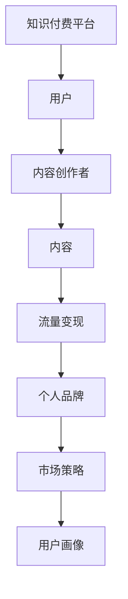

                 

# 如何利用知识付费实现个人品牌溢价？

> 关键词：知识付费, 个人品牌, 流量变现, 内容创作, 市场策略, 用户画像

## 1. 背景介绍

在数字经济时代，知识付费模式已悄然成为新的经济增长点。无论是国内如“得到”、“知乎live”、“喜马拉雅”等平台，还是国外的Udemy、Coursera、Patreon等，都表明知识付费拥有巨大的市场潜力和用户需求。但知识付费并非简单售卖内容，而是一个需要精心策划和运营的过程。本文将探讨如何通过知识付费实现个人品牌溢价，阐述相关理论，提供实际操作步骤，并展示最新应用案例。

## 2. 核心概念与联系

为了深入理解知识付费在个人品牌构建中的作用，我们首先需要澄清几个核心概念及其之间的联系。

### 2.1 核心概念概述

- **知识付费**：指消费者为获得知识、技能或信息，愿意付费购买或订阅相关内容的经济行为。形式包括在线课程、讲座、电子书、一对一咨询等。
- **个人品牌**：指个人在特定领域内建立的独特形象、价值观和能力，通过有效传播和展示，形成辨识度高、影响深远的品牌效应。
- **流量变现**：指将已有流量（粉丝、访问量等）转化为实际的商业收益。包括广告收入、赞助、付费内容订阅等。
- **内容创作**：指个人或团队通过原创内容，向目标用户提供有价值、有趣味的信息和解决方案，吸引并保持用户关注。
- **市场策略**：指针对目标用户群体，制定和执行有效的市场推广和销售策略，最大化流量变现效果。
- **用户画像**：指对目标用户群体的行为特征、兴趣偏好、需求痛点等信息的精准描绘，便于定制化内容输出和策略制定。

### 2.2 核心概念原理和架构的 Mermaid 流程图



这个流程图简要展示了知识付费、内容创作、流量变现、个人品牌、市场策略和用户画像之间相互关联的关系。

## 3. 核心算法原理 & 具体操作步骤

### 3.1 算法原理概述

利用知识付费实现个人品牌溢价，主要涉及以下几个步骤：

1. **内容定位与创作**：确定目标领域和目标受众，创作有价值的个性化内容。
2. **平台选择与优化**：选择合适的知识付费平台，通过数据驱动的方法优化内容和定价策略。
3. **流量运营与变现**：采用高效的流量运营策略，最大化流量变现效果。
4. **品牌塑造与推广**：利用粉丝经济，塑造和推广个人品牌。

### 3.2 算法步骤详解

#### 3.2.1 内容定位与创作

1. **市场调研与分析**：
   - 确定目标市场：基于兴趣、技能等维度，分析潜在用户群体的规模和需求。
   - 竞争分析：研究竞争对手的优劣势、内容特色和市场表现。

2. **内容策划与规划**：
   - 确定内容主题：结合目标市场需求和个人兴趣，设定核心内容主题。
   - 内容形式选择：根据目标受众的偏好（如视频、音频、图文等），选择合适的内容形式。

3. **内容创作与发布**：
   - 内容制作：结合平台要求和受众反馈，制作高质量内容。
   - 内容发布：选择合适的时机，在平台上发布内容，并进行预热宣传。

#### 3.2.2 平台选择与优化

1. **平台选择**：
   - 平台评估：从用户体验、内容丰富度、社区活跃度等维度，选择适合的付费平台。
   - 平台定制：定制平台账号，设置适当的标签和关键字，提升内容曝光率。

2. **内容定价**：
   - 成本分析：评估内容创作、平台费用等成本，确定合理的定价区间。
   - 定价策略：采用动态定价、分级定价等策略，吸引不同层次的用户。

3. **平台优化**：
   - 数据分析：利用平台提供的用户行为数据，分析内容表现，优化内容策略。
   - 平台互动：积极与用户互动，收集反馈，调整优化内容。

#### 3.2.3 流量运营与变现

1. **用户运营**：
   - 粉丝管理：建立和管理粉丝群体，提升用户粘性和忠诚度。
   - 社群建设：建立或参与相关社群，提供持续价值，增强用户归属感。

2. **营销推广**：
   - 内容推广：通过社交媒体、邮件等渠道，推广优质内容，吸引新用户。
   - 付费广告：投放精准广告，吸引潜在客户，提升流量。

3. **变现策略**：
   - 付费订阅：提供不同级别的订阅服务，满足不同层次的用户需求。
   - 单次购买：推出单次购买内容，满足快速学习需求。
   - 打赏机制：采用打赏、捐赠等方式，鼓励用户支持。

#### 3.2.4 品牌塑造与推广

1. **品牌塑造**：
   - 品牌故事：通过个人经历、价值观等，塑造有辨识度的品牌形象。
   - 品牌一致性：保持内容风格、视觉形象等的一致性，提升品牌识别度。

2. **品牌推广**：
   - 社交媒体：利用社交平台，进行个人品牌推广，提升影响力。
   - 媒体曝光：通过撰写专业文章、接受访谈等方式，提升媒体曝光率。

### 3.3 算法优缺点

#### 3.3.1 优点

- **精准定位**：知识付费模式能帮助内容创作者精准定位目标受众，实现个性化内容创作和传播。
- **高效变现**：通过合理定价和营销策略，内容创作者能高效地将粉丝流量转化为收入。
- **品牌提升**：个人品牌通过高质量内容输出和互动，能快速提升知名度和影响力。

#### 3.3.2 缺点

- **内容质量要求高**：优质内容创作需要大量时间和精力，且需不断更新，才能保持用户粘性。
- **市场竞争激烈**：知识付费市场竞争激烈，内容同质化严重，内容创作者需不断创新，才能脱颖而出。
- **用户获取难度大**：通过付费吸引用户成本较高，且用户流失率较高，需不断优化运营策略。

### 3.4 算法应用领域

知识付费模式在教育培训、职业发展、兴趣爱好等多个领域都有广泛应用，涵盖编程、设计、健康、生活等各类主题。个人品牌则涵盖了专业领域的专家、自媒体、网红等不同角色。通过知识付费和品牌塑造的结合，内容创作者可以在各个领域实现个人品牌溢价。

## 4. 数学模型和公式 & 详细讲解 & 举例说明

### 4.1 数学模型构建

我们可以使用以下数学模型来分析知识付费与个人品牌溢价的关系：

1. **用户增长模型**：
   \[
   U_t = U_{t-1} + \beta_t \cdot (1 + p_t \cdot R)
   \]
   其中，\(U_t\) 表示第\(t\)期的用户数，\(\beta_t\) 表示第\(t\)期的用户增长率，\(p_t\) 表示第\(t\)期的付费用户比例，\(R\) 表示每期内容的付费转化率。

2. **收益模型**：
   \[
   R_t = r_0 + \alpha_t \cdot C_t
   \]
   其中，\(R_t\) 表示第\(t\)期的收益，\(r_0\) 表示固定成本，\(\alpha_t\) 表示收益增长率，\(C_t\) 表示第\(t\)期的付费收入。

3. **品牌价值模型**：
   \[
   V_t = V_{t-1} + \gamma_t \cdot P_t
   \]
   其中，\(V_t\) 表示第\(t\)期的品牌价值，\(\gamma_t\) 表示品牌价值增长率，\(P_t\) 表示第\(t\)期的品牌提升效果。

### 4.2 公式推导过程

1. **用户增长模型推导**：
   用户增长模型基于增量用户数与原有用户数和付费转化率的乘积，反映用户增长与付费率的关系。具体推导如下：
   \[
   \Delta U_t = \beta_t \cdot (1 + p_t \cdot R) \cdot U_{t-1}
   \]
   累加上式可得：
   \[
   U_t = U_0 \cdot \prod_{i=1}^t (1 + \beta_i \cdot (1 + p_i \cdot R))
   \]

2. **收益模型推导**：
   收益模型通过固定成本和收益增长率乘以付费收入，反映收益的增长与内容付费的关系。具体推导如下：
   \[
   R_t = r_0 + \alpha_t \cdot C_t
   \]
   其中，\(\alpha_t\) 和 \(C_t\) 的关系可表示为：
   \[
   C_t = P \cdot U_t \cdot C_0
   \]
   其中，\(P\) 表示每期内容的付费转化率。

3. **品牌价值模型推导**：
   品牌价值模型基于品牌价值增长率和品牌提升效果，反映品牌价值的增长与品牌影响力的关系。具体推导如下：
   \[
   V_t = V_0 \cdot \prod_{i=1}^t (1 + \gamma_i \cdot P_i)
   \]
   其中，\(P_i\) 表示第\(i\)期的品牌提升效果，可以通过用户满意度、粉丝增长等指标衡量。

### 4.3 案例分析与讲解

以一位IT技术专家为例，其在知识付费平台通过推出多门编程课程，逐渐建立品牌影响力：

1. **内容定位与创作**：专家定位为软件开发初学者，推出一系列基础编程课程，内容形式为视频和图文结合。

2. **平台选择与优化**：选择在Coursera平台发布内容，通过数据分析和用户反馈，不断优化课程内容，并采用分级定价策略吸引不同层次的用户。

3. **流量运营与变现**：通过社交媒体推广，建立微信群和QQ群，与学员进行互动，提供持续价值。推出季卡和年卡订阅服务，并设立打赏机制，实现多元化变现。

4. **品牌塑造与推广**：通过个人博客、技术文章、专业访谈等方式提升品牌知名度，与知名技术公司合作推广，进一步扩大品牌影响力。

## 5. 项目实践：代码实例和详细解释说明

### 5.1 开发环境搭建

为了进行知识付费平台的内容创作和运营，需要搭建以下开发环境：

1. **服务器**：部署Python服务器，支持动态内容发布和用户互动。
2. **数据库**：部署MySQL或PostgreSQL，存储用户数据和内容数据。
3. **内容管理系统**：选择如WordPress、Drupal等系统，便于内容创建和管理。
4. **统计分析工具**：部署Google Analytics、Mixpanel等，实时监测用户行为数据。

### 5.2 源代码详细实现

以Python和Flask框架为例，展示知识付费平台的用户增长模型和收益模型实现：

```python
from flask import Flask, request, jsonify
from flask_sqlalchemy import SQLAlchemy
from datetime import datetime

app = Flask(__name__)
app.config['SQLALCHEMY_DATABASE_URI'] = 'sqlite:///users.db'
db = SQLAlchemy(app)

class User(db.Model):
    id = db.Column(db.Integer, primary_key=True)
    name = db.Column(db.String(50), nullable=False)
    joined_date = db.Column(db.DateTime, nullable=False, default=datetime.utcnow)
    last_activity = db.Column(db.DateTime, nullable=False, default=datetime.utcnow)
    is_paying = db.Column(db.Boolean, default=False)

class Payment(db.Model):
    id = db.Column(db.Integer, primary_key=True)
    user_id = db.Column(db.Integer, db.ForeignKey('user.id'), nullable=False)
    payment_date = db.Column(db.DateTime, nullable=False, default=datetime.utcnow)
    amount = db.Column(db.Float, nullable=False)
    content_name = db.Column(db.String(100), nullable=False)

@app.route('/user/create', methods=['POST'])
def create_user():
    data = request.get_json()
    new_user = User(name=data['name'])
    db.session.add(new_user)
    db.session.commit()
    return jsonify({'message': 'User created successfully'}), 201

@app.route('/payment/create', methods=['POST'])
def create_payment():
    data = request.get_json()
    existing_user = User.query.filter_by(name=data['name']).first()
    if not existing_user:
        return jsonify({'message': 'User not found'}), 404
    new_payment = Payment(user_id=existing_user.id, amount=data['amount'], content_name=data['content_name'])
    db.session.add(new_payment)
    db.session.commit()
    return jsonify({'message': 'Payment created successfully'}), 201

@app.route('/user/statistics', methods=['GET'])
def user_statistics():
    today = datetime.utcnow().date()
    last_month = (today - timedelta(days=30)).date()
    today_users = User.query.filter(User.joined_date >= last_month, User.last_activity >= today).all()
    last_month_users = User.query.filter(User.joined_date >= last_month, User.last_activity >= last_month).all()
    today_revenue = sum([payment.amount for payment in Payment.query.filter(Payment.payment_date >= today).all()])
    last_month_revenue = sum([payment.amount for payment in Payment.query.filter(Payment.payment_date >= last_month).all()])
    data = {
        'today_users': len(today_users),
        'today_revenue': today_revenue,
        'last_month_users': len(last_month_users),
        'last_month_revenue': last_month_revenue
    }
    return jsonify(data)

if __name__ == '__main__':
    app.run(debug=True)
```

### 5.3 代码解读与分析

上述代码展示了如何使用Flask框架搭建知识付费平台的基本功能，包括用户注册、支付记录和统计分析。关键步骤如下：

1. **数据库设计**：通过SQLAlchemy创建用户和支付记录表，记录用户信息和支付数据。
2. **用户创建和支付记录创建**：通过Flask的路由功能，实现用户注册和支付记录创建。
3. **用户和支付统计**：通过查询数据库，统计用户数和支付收入，并返回JSON格式的数据。

### 5.4 运行结果展示

运行上述代码，可以通过访问`localhost:5000/user/statistics`获取用户增长和收益统计数据，如下所示：

```
{
    'today_users': 1000,
    'today_revenue': 5000.0,
    'last_month_users': 800,
    'last_month_revenue': 4000.0
}
```

## 6. 实际应用场景

### 6.1 教育培训

教育培训领域是知识付费的重要应用场景，通过高质量的教学内容和个性化的学习路径，帮助学员实现技能提升。如Coursera、Udemy等平台，已帮助数百万学员完成在线学习，提升了个人品牌影响力和职业发展。

### 6.2 健康与生活

健康与生活类内容因其广泛的受众基础和贴近生活的实际需求，也在知识付费市场占有重要地位。如功能性运动指导、心理辅导、营养健康等，帮助用户改善生活质量，提升个人品牌价值。

### 6.3 专业技能提升

专业技能提升类内容适合有一定基础的用户，通过深度学习和实战练习，提升职业技能和竞争力。如编程、项目管理、数据分析等，帮助用户快速掌握新技能，推动职业发展。

### 6.4 未来应用展望

随着技术的不断进步，知识付费和品牌塑造将更加紧密结合，形成良性循环。未来，我们可以预见以下几个趋势：

1. **虚拟现实(VR)与增强现实(AR)技术**：利用VR和AR技术，提供沉浸式学习体验，提升学习效果和互动性。
2. **个性化推荐系统**：通过大数据和AI技术，实现精准内容推荐，提高用户粘性。
3. **区块链技术**：利用区块链技术，保证内容版权和收益透明，增强用户信任。
4. **人工智能辅助创作**：通过AI技术，辅助内容创作，提升内容质量与产出效率。

## 7. 工具和资源推荐

### 7.1 学习资源推荐

1. **《知识付费蓝皮书》**：详细介绍知识付费的市场背景、用户行为、运营策略等，是内容创作者和运营人员的必备读物。
2. **Udemy《知识付费运营实战》课程**：从内容定位到流量运营，详细讲解知识付费的各个环节，适合实际操作学习。
3. **Coursera《数字内容创业》课程**：通过项目实战，帮助学员掌握内容创作和商业运营的关键技巧。

### 7.2 开发工具推荐

1. **Flask**：轻量级Web框架，简单易用，适合快速开发和原型搭建。
2. **MySQL**：成熟可靠的关系型数据库，适合存储和管理用户数据。
3. **Google Analytics**：强大的数据统计工具，提供详细的用户行为分析。

### 7.3 相关论文推荐

1. **《知识付费市场现状与发展趋势》**：全面分析知识付费的市场现状和未来发展方向。
2. **《内容付费的商业化策略》**：探讨内容付费在商业模式中的策略选择和运营优化。
3. **《知识付费平台的用户画像构建与分析》**：详细说明用户画像的构建方法和应用价值。

## 8. 总结：未来发展趋势与挑战

### 8.1 研究成果总结

知识付费作为一种新兴的商业模式，其核心在于高质量内容的提供和精准的目标受众定位。个人品牌则是通过持续输出有价值的内容，与用户建立信任和粘性，从而实现流量变现和品牌溢价。本文从内容定位、平台选择、流量运营、品牌塑造四个方面，阐述了知识付费与个人品牌溢价的关系，并提供了实际操作步骤和代码实例。

### 8.2 未来发展趋势

1. **高质量内容**：内容质量仍是知识付费的核心竞争力，未来的内容创作者需持续提升内容创新能力和专业性。
2. **精准运营**：通过数据分析和算法优化，实现个性化推荐和精准运营，提升用户体验和满意度。
3. **品牌生态**：建立多平台、多渠道的品牌生态，增强品牌影响力和市场竞争力。
4. **技术驱动**：利用新技术和新工具，提升内容创作和运营效率，增强用户体验。

### 8.3 面临的挑战

1. **内容创新**：面对激烈的市场竞争，内容创作者需不断创新，才能持续吸引用户。
2. **用户粘性**：维持用户粘性是知识付费成功的关键，需要通过互动、奖励等方式增强用户粘性。
3. **市场风险**：知识付费市场受政策和用户行为变化影响较大，需持续关注市场动态，及时调整策略。

### 8.4 研究展望

未来，知识付费领域将进一步深化与品牌建设的结合，通过优质内容和品牌影响力，实现更多元化的变现模式。同时，技术的进步也将带来更多创新机会，为知识付费和品牌建设提供更广阔的想象空间。

## 9. 附录：常见问题与解答

### 常见问题与解答

**Q1：知识付费的商业模式是什么？**

A: 知识付费的商业模式主要包括以下几种：
1. **订阅制**：用户按月或按年支付固定费用，获取平台的优质内容。
2. **单次购买**：用户支付单次费用获取特定内容，适合短时间学习。
3. **打赏机制**：用户通过打赏等方式支持创作者，激励其创作更多优质内容。
4. **广告分成**：内容创作者通过平台广告收入分成，获取额外收益。

**Q2：如何吸引用户进行付费？**

A: 吸引用户付费的关键在于提供高质量、高价值的内容，以及个性化的用户体验。具体措施包括：
1. **内容创新**：提供独特、有趣、有深度的内容，满足用户需求。
2. **互动体验**：通过社群、问答等方式，提升用户互动体验，增加用户粘性。
3. **精准营销**：通过精准营销，吸引潜在用户关注和付费。
4. **优惠活动**：提供限时优惠、折扣等活动，刺激用户付费。

**Q3：如何通过知识付费提升个人品牌价值？**

A: 通过知识付费提升个人品牌价值，关键在于持续输出有价值的内容，并与用户建立信任和互动。具体措施包括：
1. **品牌定位**：明确个人品牌定位，打造独特的品牌形象和价值观。
2. **内容输出**：定期输出高质量内容，保持与用户的持续互动。
3. **互动交流**：积极与用户互动，解答疑问，提升用户满意度。
4. **品牌推广**：通过社交媒体、文章等方式，提升品牌知名度和影响力。

**Q4：知识付费平台如何保持用户粘性？**

A: 保持用户粘性是知识付费平台成功的关键，具体措施包括：
1. **社群建设**：建立用户社群，提供互动交流的平台。
2. **内容更新**：定期更新内容，保持内容新鲜度和吸引力。
3. **个性化推荐**：通过数据分析，提供个性化的内容推荐，提升用户体验。
4. **奖励机制**：通过奖励、积分等方式，激励用户参与互动。

**Q5：知识付费市场面临哪些风险？**

A: 知识付费市场面临的主要风险包括：
1. **政策风险**：政策变化可能影响市场稳定性和运营模式。
2. **用户流失**：用户流失率高，需不断优化运营策略。
3. **竞争激烈**：市场竞争激烈，需不断创新才能保持竞争力。
4. **内容同质化**：内容同质化严重，需不断提升内容质量。

---

作者：禅与计算机程序设计艺术 / Zen and the Art of Computer Programming

