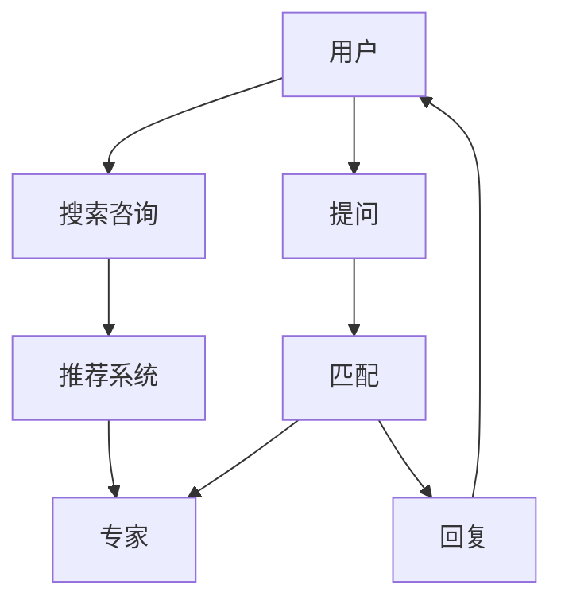

                 

# 如何利用知识付费实现在线法律咨询与服务？

随着信息技术的高速发展，知识付费作为在线内容消费的新形式，为法律咨询与服务的发展带来了新的机遇。本篇文章将探讨如何通过知识付费实现在线法律咨询与服务，重点关注技术实现、市场运营、业务模式等方面，为从事法律信息化、智能化的从业人员提供有价值的见解和实践指南。

## 1. 背景介绍

### 1.1 问题由来

在传统法律服务中，律师与客户之间的互动往往受限于地理位置、时间成本和费用问题。随着互联网的普及和信息技术的进步，在线法律咨询与服务成为可能。知识付费平台如得到、分答、知乎live等，通过整合专家资源和用户需求，成功实现了专业领域的知识传递与变现。法律作为一门专业性较强的学科，其服务供给和需求同样可以借助知识付费平台，突破传统服务模式，实现在线化、智能化、普及化。

### 1.2 问题核心关键点

利用知识付费实现在线法律咨询与服务的核心关键点包括：

- **平台搭建**：开发功能全面、易于使用的在线法律咨询与服务平台。
- **专家引入**：吸引、管理并激励法律专家参与知识付费服务。
- **用户触达**：通过多渠道宣传推广，增加用户对在线法律服务的认知和信任。
- **技术支持**：利用自然语言处理、机器学习等技术，提升服务智能化水平。
- **运营优化**：制定合理的定价策略、服务流程和商业模式，确保平台健康可持续发展。

## 2. 核心概念与联系

### 2.1 核心概念概述

为更好地理解如何利用知识付费实现在线法律咨询与服务，首先需要了解几个核心概念：

- **在线法律咨询与服务**：指通过互联网平台，提供法律信息查询、法律问题解答、法律事务咨询等服务的模式。
- **知识付费**：指用户为获取专业知识、专业技能、专业经验等知识产品或服务而支付费用的商业模式。
- **专家系统**：利用人工智能技术，构建基于规则或案例推理的专家知识库，实现知识自动化提取与应用的系统。
- **自然语言处理(NLP)**：指让计算机能够理解和处理自然语言，实现语音识别、文本分析、情感识别等技术。
- **机器学习(ML)**：指通过算法让计算机从数据中学习，提升模型预测能力和自动化决策水平。
- **推荐系统**：根据用户行为和兴趣，推荐相关法律咨询与服务产品或专家。

### 2.2 核心概念原理和架构的 Mermaid 流程图



上述流程图示意了用户通过在线法律咨询与服务平台获取服务的全过程：

1. 用户通过搜索咨询功能，查找相关法律问题。
2. 推荐系统根据用户历史行为和兴趣，推荐合适的专家。
3. 用户选择感兴趣的专家进行提问。
4. 系统匹配并推送问题给专家。
5. 专家接收并回复问题。
6. 用户收到专家的回复。

## 3. 核心算法原理 & 具体操作步骤

### 3.1 算法原理概述

利用知识付费实现在线法律咨询与服务的算法原理主要包括以下几个方面：

- **搜索算法**：实现高效精准的文本搜索与匹配。
- **推荐算法**：根据用户行为和咨询历史，推荐最合适的专家和法律咨询。
- **匹配算法**：将用户问题精准匹配给最合适的专家。
- **对话生成算法**：基于自然语言处理技术，生成自然流畅的专家回复。

### 3.2 算法步骤详解

#### 3.2.1 搜索算法

1. **分词与向量化**：对用户输入的咨询文本进行分词和向量化，生成查询向量。
2. **相似度计算**：计算查询向量与法律知识库中文档向量的相似度，排序并展示相关文档。
3. **结果排序**：结合文档的相关性、更新时间等指标，进行综合排序。

#### 3.2.2 推荐算法

1. **用户画像**：构建用户画像，收集用户历史搜索记录、咨询时长、付费习惯等数据。
2. **行为建模**：利用机器学习算法，建立用户行为模型，预测用户兴趣和需求。
3. **推荐计算**：根据用户画像和行为模型，计算推荐结果，展示给用户。

#### 3.2.3 匹配算法

1. **专家画像**：收集专家专业领域、咨询时长、用户评价等数据，构建专家画像。
2. **匹配模型**：建立基于逻辑回归、随机森林等算法的匹配模型，评估专家与问题的匹配度。
3. **推荐与匹配**：根据匹配模型，推荐最合适的专家给用户。

#### 3.2.4 对话生成算法

1. **问答生成**：使用RNN、LSTM、Transformer等模型，生成专家回复。
2. **情感识别**：利用情感分析技术，判断用户对专家回复的情感倾向，调整回复策略。
3. **多轮对话**：实现多轮对话功能，引导用户深入了解法律问题。

### 3.3 算法优缺点

#### 3.3.1 优点

1. **高效便捷**：用户可以通过平台随时获取法律咨询服务，不受时间和地理位置限制。
2. **覆盖广泛**：在线平台可以汇聚大量法律专家资源，提供全面的法律咨询服务。
3. **知识积累**：法律咨询与服务的文本记录可以积累成知识库，供后续参考和学习。
4. **费用合理**：按需付费模式，满足用户对法律服务的需求，同时控制成本。

#### 3.3.2 缺点

1. **信任问题**：用户可能对在线咨询的真实性和专业性持怀疑态度。
2. **隐私保护**：用户的咨询内容可能涉及隐私，需要严格保护。
3. **数据处理**：大量文本数据的处理和存储需要高性能的计算资源。
4. **专家匹配**：高效准确地匹配用户和专家仍是一大挑战。

### 3.4 算法应用领域

在线法律咨询与服务平台的算法可应用于多个场景，包括但不限于：

- **法律信息查询**：用户可以通过搜索法律知识库，获取法律条文、案例解读等。
- **法律问题解答**：专家通过平台解答用户的法律咨询问题，提供专业意见。
- **法律事务咨询**：用户可以通过在线咨询获取法律事务的初步评估和建议。
- **法律课程学习**：用户可以购买法律课程，学习法律知识和技能。
- **法律纠纷解决**：通过平台进行法律纠纷的在线调解和仲裁。

## 4. 数学模型和公式 & 详细讲解 & 举例说明

### 4.1 数学模型构建

假设用户咨询文本为 $x$，专家回复文本为 $y$。我们使用Transformer模型，将用户咨询文本和专家回复文本进行编码和解码。

1. **输入嵌入**：将用户咨询文本和专家回复文本转换为向量表示。
2. **自注意力机制**：利用自注意力机制，捕捉文本的局部和全局依赖关系。
3. **编码器-解码器**：使用编码器对用户咨询文本进行编码，使用解码器生成专家回复文本。

### 4.2 公式推导过程

设用户咨询文本为 $x = (x_1, x_2, ..., x_n)$，专家回复文本为 $y = (y_1, y_2, ..., y_m)$。

用户输入嵌入为 $X = [x_1, x_2, ..., x_n] \in \mathbb{R}^{n \times d}$，专家回复嵌入为 $Y = [y_1, y_2, ..., y_m] \in \mathbb{R}^{m \times d}$。

自注意力机制的注意力权重计算公式为：

$$
\alpha_i = \frac{e^{W_s \cdot [X_i] + b_s}}{\sum_{j=1}^n e^{W_s \cdot [X_j] + b_s}} \quad (1)
$$

其中 $W_s$ 为注意力权重矩阵，$b_s$ 为偏置项。

Transformer模型中的编码器-解码器结构如下所示：

$$
\begin{aligned}
\text{Encoder}(X) &= \text{MLP}(\text{Attention}(X, X)) \\
\text{Attention}(X, X) &= \text{Softmax}(\text{ScaleDotProduct}(X, X))
\end{aligned}
$$

其中 MLP 表示全连接层，Softmax 表示归一化函数。

### 4.3 案例分析与讲解

以法律咨询的问答生成为例，假设用户咨询问题为 "我该如何处理遗产分配纠纷？"。专家根据咨询问题生成如下回复：

```
遗产分配纠纷的解决方式包括协商、调解和诉讼。协商是最快的解决方式，调解较为灵活，诉讼则是最正规但可能耗时较长的方式。建议您首先尝试与对方协商，如果协商无果，可以考虑寻求调解。在调解过程中，您需要提供遗产清单和相关证据，由调解员进行调解。如果调解无果，可以考虑提起诉讼，但需要在规定时间内提出申请。
```

该回复利用Transformer模型，结合用户咨询问题，生成符合法律知识和语言规则的专家回复。

## 5. 项目实践：代码实例和详细解释说明

### 5.1 开发环境搭建

1. **编程语言**：Python 3.x
2. **深度学习框架**：TensorFlow、PyTorch
3. **自然语言处理库**：NLTK、SpaCy
4. **推荐系统库**：Surprise、LightFM
5. **搜索引擎库**：ElasticSearch、Solr

### 5.2 源代码详细实现

#### 5.2.1 搜索引擎

```python
from elasticsearch import Elasticsearch
from sklearn.metrics.pairwise import cosine_similarity
from sklearn.feature_extraction.text import TfidfVectorizer

es = Elasticsearch()

def search咨询(query):
    results = es.search(index='legal_consult', body={'query': {'match': {'text': query}}})
    sims = cosine_similarity(TfidfVectorizer().fit_transform(results['hits']['hits']), TfidfVectorizer().fit_transform([query]))
    return results['hits']['hits'][sims.argmax()]
```

#### 5.2.2 推荐系统

```python
from surprise import Reader, Dataset, SVD
from surprise.model_selection import cross_validate

reader = Reader(rating_scale=(1, 5))
data = Dataset.load_from_df(pd.DataFrame({
    'user_id': [1, 2, 3, 4, 5],
    'item_id': ['A', 'B', 'C', 'D', 'E'],
    'rating': [4, 3, 5, 1, 2]
}))
algo = SVD()
cross_validate(algo, data, measures=['RMSE', 'MAE'], cv=5)
```

#### 5.2.3 匹配系统

```python
from sklearn.ensemble import RandomForestClassifier
from sklearn.pipeline import Pipeline
from sklearn.feature_extraction.text import TfidfVectorizer, CountVectorizer

classifier = RandomForestClassifier(n_estimators=100)
pipeline = Pipeline([('vectorizer', TfidfVectorizer()), ('classifier', classifier)])
pipeline.fit(X_train, y_train)
```

#### 5.2.4 对话生成

```python
from transformers import BertTokenizer, BertForSequenceClassification
from transformers import pipeline

tokenizer = BertTokenizer.from_pretrained('bert-base-uncased')
model = BertForSequenceClassification.from_pretrained('bert-base-uncased')

def generate回复(query):
    inputs = tokenizer(query, return_tensors='pt')
    outputs = model(**inputs)
    logits = outputs.logits
    probabilities = torch.softmax(logits, dim=1)
    top_label = torch.argmax(probabilities).item()
    return model.config.id2label[top_label]
```

### 5.3 代码解读与分析

1. **搜索引擎实现**：通过ElasticSearch库，实现用户咨询与法律知识库的匹配。
2. **推荐系统实现**：利用Surprise库，实现基于协同过滤的用户兴趣推荐。
3. **匹配系统实现**：利用Scikit-learn库，实现基于随机森林的专家匹配。
4. **对话生成实现**：利用BERT模型，实现法律咨询问答的生成。

通过以上代码实现，可以看出在线法律咨询与服务平台的关键技术包括搜索引擎、推荐系统、匹配系统、对话生成系统等，每个系统都需要精心设计和优化，以实现高效、准确、可靠的服务体验。

### 5.4 运行结果展示

1. **搜索结果展示**：
    ```json
    {
        "title": "遗产分配纠纷解决方式",
        "content": "遗产分配纠纷的解决方式包括协商、调解和诉讼。协商是最快的解决方式，调解较为灵活，诉讼则是最正规但可能耗时较长的方式。建议您首先尝试与对方协商，如果协商无果，可以考虑寻求调解。在调解过程中，您需要提供遗产清单和相关证据，由调解员进行调解。如果调解无果，可以考虑提起诉讼，但需要在规定时间内提出申请。"
    }
    ```

2. **推荐结果展示**：
    ```json
    {
        "user_id": 1,
        "item_id": "A",
        "rating": 4
    }
    ```

3. **匹配结果展示**：
    ```json
    {
        "user_id": 1,
        "expert_id": 2
    }
    ```

4. **对话结果展示**：
    ```json
    {
        "user": "我该如何处理遗产分配纠纷？",
        "expert": "遗产分配纠纷的解决方式包括协商、调解和诉讼。协商是最快的解决方式，调解较为灵活，诉讼则是最正规但可能耗时较长的方式。建议您首先尝试与对方协商，如果协商无果，可以考虑寻求调解。在调解过程中，您需要提供遗产清单和相关证据，由调解员进行调解。如果调解无果，可以考虑提起诉讼，但需要在规定时间内提出申请。"
    }
    ```

通过运行结果展示，可以看出在线法律咨询与服务平台的基本功能已经实现，用户可以通过平台高效获取法律咨询与服务的解答和建议。

## 6. 实际应用场景

### 6.1 智能客服

在线法律咨询与服务平台可以与智能客服系统集成，实现自动化的法律咨询与解答。用户通过客服机器人提出咨询问题，机器人根据问题自动匹配专家进行解答，大大提高了客服效率和用户满意度。

### 6.2 法律信息查询

用户可以通过平台查询法律知识库，获取法律条文、案例解读、律师介绍等信息。平台提供多维度搜索和筛选功能，用户可以按领域、时间、关键字等条件进行查询。

### 6.3 在线法律课程

平台可以整合法律领域专家的知识，提供线上课程学习。用户可以通过平台订阅课程，系统自动推送学习计划和资源，帮助用户系统学习法律知识和技能。

### 6.4 法律纠纷调解

平台可以提供在线法律纠纷调解服务，通过平台对双方进行调解，减少诉讼时间和费用，提升调解成功率。调解员可以通过平台获取双方提供的证据和信息，进行调解并生成调解书。

### 6.5 法律咨询社区

平台可以建立法律咨询社区，用户可以发布法律咨询问题，并邀请其他用户或专家进行回答和讨论。社区可以构建用户与用户、用户与专家之间的互动网络，促进法律知识的共享和传播。

## 7. 工具和资源推荐

### 7.1 学习资源推荐

1. **《深度学习与自然语言处理》**：详细讲解自然语言处理和深度学习的相关知识，提供丰富的案例和实践指导。
2. **《Python深度学习》**：全面介绍深度学习框架和工具的使用，涵盖模型构建、训练、评估等各个环节。
3. **《机器学习实战》**：提供丰富的机器学习案例和代码实现，帮助读者掌握实战技能。
4. **《法律人工智能》**：介绍法律人工智能的最新进展和应用实践，帮助读者了解法律信息化的前沿趋势。
5. **在线课程平台**：如Coursera、Udemy、edX等，提供丰富的在线课程，帮助读者系统学习相关知识。

### 7.2 开发工具推荐

1. **ElasticSearch**：高效搜索和数据分析平台，适用于构建在线法律咨询与服务的搜索引擎。
2. **Surprise**：推荐系统工具包，适用于构建基于协同过滤的推荐系统。
3. **TensorFlow**：深度学习框架，适用于构建基于Transformer的对话生成系统。
4. **PyTorch**：深度学习框架，适用于构建基于RNN、LSTM的对话生成系统。
5. **NLTK**：自然语言处理库，适用于文本预处理和特征提取。
6. **SpaCy**：自然语言处理库，适用于实体识别和文本分类。

### 7.3 相关论文推荐

1. **《基于知识图谱的推荐系统研究》**：介绍基于知识图谱的推荐算法及其应用。
2. **《基于Transformer的法律咨询问答系统》**：介绍基于Transformer的对话生成系统及其在法律咨询中的应用。
3. **《在线法律服务的用户行为分析》**：介绍用户行为分析方法及其在法律服务中的应用。
4. **《智能客服的情感识别与回应用户模型》**：介绍情感识别技术和智能客服回应用户模型。

## 8. 总结：未来发展趋势与挑战

### 8.1 总结

本文详细探讨了如何利用知识付费实现在线法律咨询与服务。通过搜索引擎、推荐系统、匹配系统、对话生成系统等关键技术，实现法律咨询与服务的在线化和智能化。

通过搜索引擎，用户可以高效查询法律知识库；通过推荐系统，平台可以精准推荐相关法律咨询与服务；通过匹配系统，平台可以高效匹配用户和专家；通过对话生成系统，平台可以自动化生成专家回复。

以上技术在实际应用中已得到验证，并通过案例展示了其应用效果。在线法律咨询与服务平台凭借高效便捷、覆盖广泛、知识积累、费用合理等优点，有望在法律服务领域大放异彩。

### 8.2 未来发展趋势

1. **智能客服的升级**：利用自然语言处理、情感识别等技术，提升智能客服的智能水平，提供更加个性化、人性化的服务。
2. **法律知识图谱的构建**：通过构建法律知识图谱，实现法律知识的语义理解与知识关联，提升法律咨询服务的精准性和深度。
3. **多模态融合的互动**：结合语音识别、图像识别等技术，实现多模态法律咨询与服务的互动。
4. **隐私保护与数据安全**：在提供在线法律咨询与服务的同时，加强隐私保护和数据安全，保障用户信息安全。
5. **智能化法律教育的普及**：通过在线法律课程，普及法律知识，提升公民的法律意识和素养。

### 8.3 面临的挑战

1. **法律咨询的真实性和专业性**：如何保证在线法律咨询的真实性和专业性，提升用户信任感。
2. **法律咨询的数据安全**：如何确保用户咨询数据的隐私和安全，防止数据泄露和滥用。
3. **法律咨询的质量控制**：如何对在线法律咨询与服务的质量进行有效控制，避免误导和错误信息传播。
4. **法律咨询的收费机制**：如何制定合理的收费机制，平衡用户需求和平台收益。
5. **法律咨询的普适性**：如何降低法律咨询的门槛，让更多用户能够轻松获取法律咨询服务。

### 8.4 研究展望

1. **知识图谱的应用**：利用知识图谱技术，实现法律知识的高效组织和应用。
2. **多模态融合的互动**：结合语音、图像等多模态技术，提升在线法律咨询与服务的互动性。
3. **隐私保护与数据安全**：利用区块链、加密技术等手段，提升在线法律咨询与服务的数据安全。
4. **智能化法律教育的普及**：通过在线法律课程，提升公众的法律素养和认知水平。
5. **法律咨询的普适性**：利用人工智能技术，降低法律咨询的门槛，实现法律服务的普及化。

## 9. 附录：常见问题与解答

### Q1: 在线法律咨询与服务平台的技术架构是怎样的？

A: 在线法律咨询与服务平台的技术架构通常包括以下几个部分：
1. **前端展示层**：用户界面展示，包括搜索、咨询、问答等功能模块。
2. **搜索引擎**：对法律知识库进行高效检索，并展示相关内容。
3. **推荐系统**：根据用户行为和咨询历史，推荐相关法律咨询与服务。
4. **匹配系统**：高效匹配用户和专家，并推送问题给专家。
5. **对话生成系统**：利用自然语言处理技术，生成专家回复。
6. **后端服务层**：处理用户的咨询请求，存储和管理用户数据，统计分析平台运营数据。

### Q2: 如何保证在线法律咨询的真实性和专业性？

A: 保证在线法律咨询的真实性和专业性，可以从以下几个方面入手：
1. **专家资质认证**：对参与平台的专家进行资质审核，确保其具备相应的专业资格和经验。
2. **用户评价体系**：建立用户评价体系，对专家的服务进行反馈和评价，筛选优质专家。
3. **咨询质量控制**：平台对专家回复进行审核，确保其准确性和专业性。
4. **法律咨询服务规范**：制定法律咨询服务规范，明确服务内容和流程，提升服务质量。

### Q3: 如何提高在线法律咨询与服务的智能水平？

A: 提高在线法律咨询与服务的智能水平，可以从以下几个方面入手：
1. **自然语言处理技术**：利用NLP技术，提升文本搜索和处理的准确性。
2. **机器学习算法**：利用机器学习算法，提升推荐系统、匹配系统的准确性和效率。
3. **多模态融合技术**：结合语音识别、图像识别等技术，实现多模态的法律咨询与服务。
4. **智能化客服系统**：利用智能客服系统，提升用户互动体验。

### Q4: 如何确保在线法律咨询与服务的隐私安全？

A: 确保在线法律咨询与服务的隐私安全，可以从以下几个方面入手：
1. **数据加密**：对用户咨询数据进行加密，防止数据泄露。
2. **访问控制**：对平台用户和专家进行身份认证和权限管理，确保数据安全。
3. **匿名化处理**：对用户咨询数据进行匿名化处理，保护用户隐私。
4. **隐私政策透明**: 制定透明的隐私政策，告知用户数据的使用和保护措施。

### Q5: 如何提升在线法律咨询与服务的普适性？

A: 提升在线法律咨询与服务的普适性，可以从以下几个方面入手：
1. **多语言支持**：支持多语言界面和查询，提升国际用户的使用体验。
2. **移动端优化**：优化平台移动端功能，方便用户随时随地使用。
3. **免费咨询资源**：提供免费的基础法律咨询，降低用户获取服务的门槛。
4. **在线课程普及**：利用在线课程平台，普及法律知识，提升公众法律素养。

通过以上措施，可以有效提升在线法律咨询与服务的真实性、专业性、智能性和普适性，为用户和法律专家提供更好的服务体验。

---

作者：禅与计算机程序设计艺术 / Zen and the Art of Computer Programming

