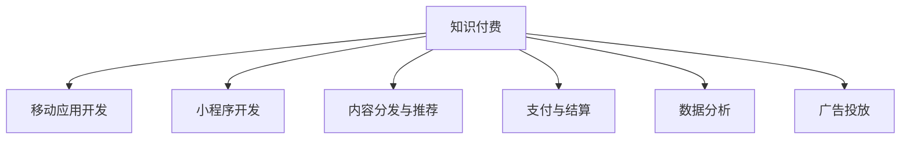

                 

# 如何利用知识付费实现移动应用与小程序开发？

> 关键词：知识付费, 移动应用, 小程序, 开发, 策略, 转化率, 用户体验, 多渠道, 数据分析, 广告投放

## 1. 背景介绍

### 1.1 问题由来
随着互联网和移动互联网的迅速发展，知识付费产业也在快速崛起。越来越多的平台和用户开始意识到知识的重要性，愿意为获取高质量内容支付费用。这一趋势下，知识付费平台的竞争也日益激烈。如何提高用户转化率、提升用户粘性、实现商业变现，成为了知识付费平台关注的重点。

### 1.2 问题核心关键点
在当前的知识付费市场中，移动应用与小程序成为了两大主流平台形态。如何利用这些平台特性，实现知识付费的优化开发，提升平台的整体体验和用户满意度，成为平台运营者需要考虑的核心问题。本文将从用户行为分析、开发策略、技术实现等方面深入探讨如何利用知识付费实现移动应用与小程序的开发。

### 1.3 问题研究意义
对知识付费平台而言，合理的开发策略和优化实践，能够显著提高用户转化率、提升用户体验，最终实现商业变现。通过本文的学习，读者可以掌握如何将知识付费与移动应用、小程序的开发紧密结合，构建具有竞争力的知识付费平台。

## 2. 核心概念与联系

### 2.1 核心概念概述

为更好地理解知识付费在移动应用与小程序开发中的应用，本节将介绍几个密切相关的核心概念：

- **知识付费**：用户为获取特定知识内容而支付的费用。形式多样，包括在线课程、电子书、音频、视频等。
- **移动应用**：基于操作系统平台（如iOS、Android），使用户能够随时随地获取和使用知识内容的客户端应用。
- **小程序**：集成在微信等平台内，用户无需下载，即可直接使用的轻量级应用。
- **内容分发与推荐**：利用算法技术，对用户进行画像分析，推荐最符合其兴趣的内容。
- **支付与结算**：通过集成第三方支付平台（如微信支付、支付宝），实现用户支付和平台结算。
- **数据分析**：通过数据分析工具（如Google Analytics），对用户行为进行统计分析，指导开发优化。
- **广告投放**：通过投放平台（如Google Ads、百度推广），获取流量，并转化成付费用户。

这些核心概念之间的逻辑关系可以通过以下Mermaid流程图来展示：



这个流程图展示了大语言模型的核心概念及其之间的关系：

1. 知识付费平台通过移动应用、小程序等平台形态提供知识内容。
2. 平台利用内容分发与推荐技术，向用户推送个性化内容。
3. 用户通过支付与结算功能进行付费，平台获得收入。
4. 数据分析帮助平台了解用户行为，指导内容优化。
5. 广告投放进一步扩大平台曝光，吸引更多用户。

这些概念共同构成了知识付费平台的整体架构，使得平台能够提供高质量的、个性化的知识服务，并实现商业变现。

## 3. 核心算法原理 & 具体操作步骤
### 3.1 算法原理概述

知识付费平台的核心算法原理主要集中在以下几个方面：

1. **用户画像与内容推荐**：通过机器学习技术对用户行为进行分析，构建用户画像，从而推荐最符合用户兴趣的内容。
2. **支付算法与结算**：利用支付网关（如支付宝、微信支付）进行用户支付，并实时结算，确保平台资金安全。
3. **广告投放策略**：通过精准投放广告，扩大平台流量，增加用户转化率。

### 3.2 算法步骤详解

以下详细解释知识付费平台的核心算法步骤：

**Step 1: 用户画像构建**
- 收集用户基本信息（如年龄、性别、职业等）和行为数据（如浏览记录、点击行为等）。
- 利用机器学习算法（如协同过滤、内容推荐等），分析用户兴趣和行为模式，构建用户画像。

**Step 2: 内容推荐**
- 根据用户画像，推荐最符合用户兴趣的内容，提升用户满意度。
- 利用A/B测试等方法，不断优化推荐算法，提高点击率。

**Step 3: 支付与结算**
- 集成第三方支付平台，实现用户支付和平台结算。
- 使用API进行支付信息验证，确保支付安全。

**Step 4: 数据分析与优化**
- 利用数据分析工具（如Google Analytics）对用户行为进行统计分析。
- 根据分析结果，优化内容推荐、广告投放等策略。

**Step 5: 广告投放**
- 选择合适的广告投放平台（如Google Ads、百度推广）。
- 利用精准广告投放策略（如定位、定向、预算控制等），扩大平台曝光。

### 3.3 算法优缺点

知识付费平台的算法优化具有以下优点：
1. 个性化推荐：通过机器学习算法，实现个性化内容推荐，提升用户体验。
2. 实时结算：利用支付平台，实现实时结算，保障平台资金安全。
3. 精准广告：通过精准投放广告，扩大流量，增加用户转化率。

同时，该算法也存在一定的局限性：
1. 数据隐私：在用户画像构建和分析过程中，可能涉及用户隐私保护问题。
2. 用户流失：过度个性化推荐可能使用户产生信息过载，导致用户流失。
3. 广告噪音：广告投放过程中，噪音广告会影响用户体验。
4. 技术复杂：涉及多个技术栈和算法模型，开发和维护成本高。

尽管存在这些局限性，但就目前而言，基于个性化推荐和精准投放的算法优化方法，仍是大规模知识付费平台应用的主流范式。未来相关研究的重点在于如何进一步降低数据隐私风险，提升广告投放精准度，同时兼顾用户体验和技术维护成本。

### 3.4 算法应用领域

基于知识付费平台的算法优化，已经在在线教育、职业技能培训、心理咨询等多个领域得到了广泛应用，成为提升平台内容价值和服务质量的重要手段。

- **在线教育**：利用个性化推荐，推荐最适合用户的学习课程，提升学习效果。
- **职业技能培训**：根据用户职业背景和兴趣，推荐最相关的培训课程，增加用户粘性。
- **心理咨询**：利用个性化推荐，推荐最符合用户心理需求的专业咨询师，提供高质量服务。

除了上述这些经典领域外，知识付费平台的算法优化也被创新性地应用到更多场景中，如智能客服、知识图谱、智能投顾等，为知识付费产业带来了新的创新和发展方向。

## 4. 数学模型和公式 & 详细讲解  
### 4.1 数学模型构建

本节将使用数学语言对知识付费平台的算法优化过程进行更加严格的刻画。

记知识付费平台为 $P$，用户集为 $U$，内容集为 $C$，推荐算法为 $R$。假设用户 $u \in U$ 对内容 $c \in C$ 的评分（打分）为 $r_{uc}$，平台的目标是最大化总体评分：

$$
\max_{R} \sum_{u \in U} \sum_{c \in C} r_{uc} \cdot R(u,c)
$$

其中 $R$ 为推荐函数，表示用户 $u$ 对内容 $c$ 的推荐概率。

### 4.2 公式推导过程

以下推导知识付费平台的用户推荐算法。

假设平台已知用户 $u$ 对内容 $c$ 的评分向量 $\mathbf{r}_u$，内容 $c$ 的评分向量 $\mathbf{r}_c$，利用协同过滤算法计算用户 $u$ 对内容 $c$ 的推荐概率 $p_{uc}$：

$$
p_{uc} = \frac{\mathbf{r}_u \cdot \mathbf{r}_c}{\|\mathbf{r}_u\| \cdot \|\mathbf{r}_c\|}
$$

其中 $\cdot$ 表示向量点乘，$\|\cdot\|$ 表示向量范数。

通过训练数据集 $D$，利用梯度下降等优化算法训练推荐模型 $R$，最小化损失函数：

$$
\min_{R} \sum_{(u,c) \in D} (R(u,c) - p_{uc})^2
$$

通过上述推导，可以构建出知识付费平台的用户推荐算法。

### 4.3 案例分析与讲解

以在线教育平台为例，说明如何利用个性化推荐提高用户学习效果。

1. **用户画像构建**：收集用户基本信息和行为数据，使用协同过滤算法构建用户画像。
2. **内容推荐**：根据用户画像，推荐最适合用户的学习课程，提高课程完成率。
3. **效果评估**：使用A/B测试等方法评估推荐效果，优化推荐算法。

通过上述方法，平台可以大幅提升用户学习效果，增加用户粘性，提升用户转化率。

## 5. 项目实践：代码实例和详细解释说明
### 5.1 开发环境搭建

在进行知识付费平台的开发实践前，我们需要准备好开发环境。以下是使用Python进行Flask开发的环境配置流程：

1. 安装Anaconda：从官网下载并安装Anaconda，用于创建独立的Python环境。

2. 创建并激活虚拟环境：
```bash
conda create -n flask-env python=3.8 
conda activate flask-env
```

3. 安装Flask：
```bash
pip install flask
```

4. 安装Flask-SocketIO：用于实现前端与后端的实时通信。
```bash
pip install flask-socketio
```

5. 安装Flask-WTF：用于处理表单数据。
```bash
pip install flask-wtf
```

完成上述步骤后，即可在`flask-env`环境中开始知识付费平台的开发。

### 5.2 源代码详细实现

下面我们以在线教育平台为例，给出使用Flask框架开发知识付费平台的核心代码实现。

```python
from flask import Flask, render_template, request
from flask_socketio import SocketIO
from flask_wtf import FlaskForm
from wtforms import StringField, SubmitField
from wtforms.validators import DataRequired

app = Flask(__name__)
app.config['SECRET_KEY'] = 'super-secret'
socketio = SocketIO(app)

class EnrollmentForm(FlaskForm):
    email = StringField('Email', validators=[DataRequired()])
    submit = SubmitField('Submit')

@app.route('/')
def index():
    return render_template('index.html')

@app.route('/enroll', methods=['GET', 'POST'])
def enroll():
    form = EnrollmentForm()
    if form.validate_on_submit():
        # 用户提交表单，进行课程报名
        socketio.emit('enrolled', {'email': form.email.data})
    return render_template('enroll.html', form=form)

if __name__ == '__main__':
    socketio.run(app)
```

在这个示例中，我们使用Flask框架搭建了一个简单的在线教育平台，用户可以通过前端页面进行课程报名，后端实时推送报名信息。其中，Flask-SocketIO用于实现前端与后端的实时通信，Flask-WTF用于处理表单数据。

### 5.3 代码解读与分析

让我们再详细解读一下关键代码的实现细节：

**Flask框架**：
- 使用`Flask`库搭建Web应用，通过`@app.route`装饰器定义路由，处理用户请求。
- 通过`render_template`函数动态渲染HTML页面，提供用户交互界面。
- 使用`Flask-SocketIO`实现前端与后端的实时通信，通过`socketio.emit`函数将报名信息实时推送到前端页面。

**Flask-WTF**：
- 使用`Flask-WTF`库处理表单数据，通过`FlaskForm`类定义表单，设置字段和验证器。
- 在表单提交时，通过`form.validate_on_submit()`方法验证表单数据，确保数据的正确性。
- 在表单提交成功时，通过`socketio.emit`函数将报名信息实时推送到前端页面。

**SocketIO**：
- 使用`Flask-SocketIO`实现前端与后端的实时通信，通过`socketio.emit`函数将报名信息实时推送到前端页面。
- 在用户提交表单时，通过`socketio.emit`函数实时更新页面信息，提供即时反馈。

通过以上代码示例，可以看到Flask框架在知识付费平台的开发中具有灵活性和可扩展性，能够快速实现前端页面与后端逻辑的交互。

当然，工业级的系统实现还需考虑更多因素，如用户认证、支付集成、课程管理、用户行为分析等。但核心的开发框架和实时通信逻辑基本与此类似。

## 6. 实际应用场景
### 6.1 智慧教育

知识付费平台的个性化推荐技术，可以广泛应用于智慧教育领域。传统的教育方式往往以教师为中心，缺乏个性化教学和互动性。利用知识付费平台的个性化推荐功能，可以为每个学生推荐最适合其学习进度和兴趣的内容，提升学习效果。

在技术实现上，可以收集学生的学习行为数据，如学习时间、课程完成度等，构建学生画像，在此基础上进行内容推荐。推荐内容可以是视频课程、电子教材、习题等，满足学生个性化需求，提高学习效率。

### 6.2 职业技能培训

知识付费平台在职业技能培训中的应用同样广阔。职业技能的培训需要大量的实践和反复练习，而传统培训方式往往难以满足这一需求。利用知识付费平台的推荐算法，可以为学员推荐最适合其技能水平和职业目标的培训课程，提供个性化学习路径，提升培训效果。

在具体实现中，可以收集学员的职业背景、学习进度、考核成绩等数据，构建学员画像，推荐最适合其职业发展的课程内容。推荐内容可以是视频教程、技能评测、职业证书等，满足学员个性化学习需求，提高职业能力。

### 6.3 心理咨询

知识付费平台在心理咨询中的应用也具有重大意义。心理咨询需要根据用户的心理状态和需求，提供个性化的心理辅导和支持。利用知识付费平台的推荐算法，可以为用户推荐最适合其心理需求的咨询师，提供高质量的心理服务。

在具体实现中，可以收集用户的心理状态、咨询历史、兴趣爱好等数据，构建用户画像，推荐最适合其心理需求的咨询师。推荐内容可以是心理测评、心理咨询、心理课程等，满足用户个性化心理需求，提升心理健康水平。

### 6.4 未来应用展望

随着知识付费平台的不断发展和优化，未来的应用场景将更加多样，涉及的领域也将更加广泛。

- **医疗健康**：利用个性化推荐，推荐最适合用户健康需求的医疗咨询、健康知识等。
- **生活服务**：通过推荐算法，推荐用户最感兴趣的生活服务，如美食、旅游、购物等。
- **企业培训**：为员工推荐最适合其职业发展的培训课程，提升员工技能和职业素养。
- **政府服务**：为市民推荐最符合其需求的政策信息、公共服务、文化活动等。

总之，知识付费平台的个性化推荐技术将在各个领域发挥越来越重要的作用，为用户的日常生活和职业发展带来更多便利和支持。

## 7. 工具和资源推荐
### 7.1 学习资源推荐

为了帮助开发者系统掌握知识付费平台的技术开发，这里推荐一些优质的学习资源：

1. **《知识付费平台开发手册》**：详细介绍了知识付费平台的核心开发技术栈，包括Flask、SocketIO、WTForms等，适合初、中级开发者。
2. **《Python网络编程》**：讲解了网络编程的基本概念和实现方法，适合开发者提升网络编程能力。
3. **《机器学习实战》**：介绍了机器学习的基本算法和实现方法，适合开发人员了解机器学习基础知识。
4. **《推荐系统实战》**：讲解了推荐系统的基本算法和实现方法，适合开发者深入学习推荐技术。

通过这些资源的学习实践，相信你一定能够快速掌握知识付费平台的开发技术，构建具有竞争力的知识付费平台。

### 7.2 开发工具推荐

高效的开发离不开优秀的工具支持。以下是几款用于知识付费平台开发的常用工具：

1. **Flask**：基于Python的开源Web框架，灵活且易于扩展，适合快速迭代研究。
2. **SocketIO**：实现前端与后端的实时通信，提供丰富的API接口，适合实现实时互动应用。
3. **WTForms**：处理表单数据，提供丰富的表单验证器，适合实现用户注册、登录等需求。
4. **Google Analytics**：提供数据分析服务，帮助平台了解用户行为，优化推荐算法。
5. **Adobe Photoshop**：用于设计和优化UI界面，提升用户体验。
6. **Figma**：在线设计工具，方便团队协作，快速迭代设计方案。

合理利用这些工具，可以显著提升知识付费平台的开发效率，加快创新迭代的步伐。

### 7.3 相关论文推荐

知识付费平台的推荐算法和技术优化涉及多个领域的交叉应用，以下是几篇奠基性的相关论文，推荐阅读：

1. **《协同过滤推荐算法》**：介绍了协同过滤推荐算法的基本原理和实现方法，适合理解推荐系统的核心思想。
2. **《深度学习在推荐系统中的应用》**：讲解了深度学习在推荐系统中的应用，适合了解前沿推荐技术。
3. **《推荐系统的多模态融合》**：介绍了多模态数据融合技术，适合理解多模态推荐算法。
4. **《精准广告投放策略》**：讲解了精准广告投放的基本方法和实现技巧，适合理解广告投放策略。

这些论文代表了大语言模型微调技术的发展脉络。通过学习这些前沿成果，可以帮助研究者把握学科前进方向，激发更多的创新灵感。

## 8. 总结：未来发展趋势与挑战
### 8.1 总结

本文对基于知识付费的移动应用与小程序开发进行了全面系统的介绍。首先阐述了知识付费平台在移动应用与小程序中的开发需求和应用价值，明确了开发策略和优化实践对平台成功的重要性。其次，从用户画像构建、内容推荐、支付与结算、数据分析等多个角度，详细讲解了知识付费平台的算法优化过程。最后，探讨了知识付费平台在各个领域的应用前景，展示了其巨大的应用潜力。

通过本文的系统梳理，可以看到，知识付费平台的开发和优化，需要综合考虑技术、用户、商业等多个维度，通过合理的算法策略和工具选择，实现平台的可持续发展。

### 8.2 未来发展趋势

展望未来，知识付费平台的开发和优化将呈现以下几个发展趋势：

1. **技术融合**：未来的平台将更多地融合机器学习、深度学习等先进技术，提升推荐精度和个性化程度。
2. **多渠道整合**：平台将更多地集成多种渠道，如社交媒体、搜索引擎等，获取更多流量。
3. **数据隐私保护**：平台将更加注重用户隐私保护，采用匿名化、加密等技术手段，保障用户数据安全。
4. **用户体验优化**：平台将更加注重用户体验，采用人性化设计，提升用户粘性和满意度。
5. **商业变现多样化**：平台将更多地探索付费模式的创新，如按需付费、订阅服务、会员制度等，增加用户转化率。

以上趋势凸显了知识付费平台的广阔前景。这些方向的探索发展，必将进一步提升平台的竞争力和市场影响力。

### 8.3 面临的挑战

尽管知识付费平台的开发和优化技术已经取得了一定的进展，但在迈向更加智能化、普适化应用的过程中，它仍面临着诸多挑战：

1. **数据获取难度**：构建用户画像和内容推荐，需要大量的用户行为数据和内容数据，获取成本较高。
2. **算法复杂度**：推荐算法涉及多维数据融合和复杂模型训练，开发和维护成本高。
3. **用户信任**：平台需要建立用户信任，确保用户支付和内容质量的安全可靠。
4. **广告噪音**：广告投放过程中，噪音广告会影响用户体验，导致用户流失。
5. **技术瓶颈**：推荐算法和技术优化需要跨领域的知识整合，开发人员需要具备较高的技术水平。

尽管存在这些挑战，但只要积极应对并寻求突破，知识付费平台的未来发展仍然充满希望。相信随着学界和产业界的共同努力，这些挑战终将一一被克服，知识付费平台必将在构建智能化服务方面发挥更大的作用。

### 8.4 研究展望

面向未来，知识付费平台的开发和优化需要更多跨领域的创新和突破：

1. **多模态推荐**：融合视觉、听觉等多模态数据，提升推荐精度和用户体验。
2. **跨领域融合**：将知识付费与教育、医疗、生活服务等领域进行融合，提升平台价值。
3. **实时数据处理**：利用实时数据处理技术，提高平台的响应速度和动态调整能力。
4. **AI与内容创新**：结合AI技术，创新知识内容形式，如AR/VR、交互式视频等。
5. **社区化运营**：构建知识付费社区，提升用户互动和参与度，增强平台粘性。

这些方向的研究将进一步推动知识付费平台的发展，带来更多的创新应用和商业价值。

## 9. 附录：常见问题与解答

**Q1：如何选择合适的开发框架？**

A: 选择合适的开发框架需要考虑多个因素，如技术栈、开发效率、扩展性等。一般来说，Python的Flask框架和Java的Spring框架是比较常见的选择。

**Q2：如何提升用户转化率？**

A: 提升用户转化率可以从多个方面入手，如优化页面设计、提高内容质量、提升用户体验等。利用个性化推荐算法，推荐最适合用户的内容，也是提升转化率的重要手段。

**Q3：如何保护用户隐私？**

A: 保护用户隐私是知识付费平台的重要责任。可以通过数据匿名化、加密传输等技术手段，保护用户数据安全。

**Q4：如何优化用户体验？**

A: 优化用户体验需要综合考虑界面设计、功能实现、互动体验等多个方面。通过用户调研和A/B测试，不断优化用户体验，提升用户满意度。

**Q5：如何降低开发成本？**

A: 降低开发成本可以从多个方面入手，如使用开源框架、合理分工协作、自动化测试等。合理选择开发框架和工具，提升开发效率，降低开发成本。

通过本文的学习，相信你一定能够掌握如何利用知识付费实现移动应用与小程序的开发，并构建具有竞争力的知识付费平台。

