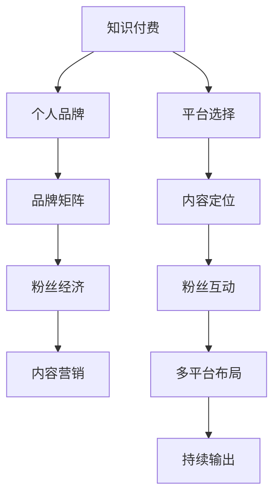

                 

# 如何利用知识付费构建个人品牌矩阵

## 1. 背景介绍

### 1.1 问题由来

在互联网快速发展的今天，个人品牌的构建已经成为了许多人追求的目标。一个强大的个人品牌不仅能提升个人知名度，还能为个人带来更多的商业机会和职业发展空间。特别是对于技术领域的专家而言，建立一个具有影响力和权威性的个人品牌，更是他们职业生涯的重要里程碑。

然而，个人品牌的构建并非易事。传统的个人品牌建设往往依赖于线下活动、媒体曝光等方式，成本高昂且周期漫长。而在线上，如何通过有效的方式快速构建和维护个人品牌，成为亟待解决的问题。

### 1.2 问题核心关键点

知识付费的兴起，为个人品牌的构建提供了一条新的路径。知识付费是一种通过提供有价值的知识和信息，获取相应回报的商业模式。通过这种方式，专家和内容创作者能够快速积累粉丝，提升知名度，同时获取可观的经济回报。

核心关键点在于：
- **平台选择**：选择一个合适的知识付费平台，是建立个人品牌矩阵的第一步。
- **内容定位**：确定自己的专业领域和内容特色，形成差异化竞争优势。
- **粉丝互动**：积极与粉丝互动，提升用户粘性，建立社区。
- **多平台布局**：在多个知识付费平台进行布局，扩大影响力。
- **持续输出**：保持内容的持续输出，确保用户有稳定的内容获取。

## 2. 核心概念与联系

### 2.1 核心概念概述

为更好地理解利用知识付费构建个人品牌矩阵的方法，本节将介绍几个密切相关的核心概念：

- **知识付费**：指通过提供有价值的信息、知识和经验，收取费用的商业模式。常见的知识付费平台包括得到、喜马拉雅、知乎等。
- **个人品牌**：指个人在特定领域内建立的知名度、认可度和影响力。个人品牌不仅影响个人职业发展，还对商业活动有重要影响。
- **品牌矩阵**：指在多个平台构建个人品牌的影响力布局，形成多方位、多层次的矩阵效应。
- **粉丝经济**：指通过吸引和维护粉丝，实现商业价值变现的商业模式。粉丝经济不仅限于售卖产品，还包含提供付费内容、知识服务等。
- **内容营销**：指通过生产有价值的内容，吸引和转化用户，实现品牌和销售目标的营销方式。

这些概念之间的关系可以通过以下Mermaid流程图来展示：



这个流程图展示了知识付费、个人品牌、品牌矩阵、粉丝经济、内容营销等概念之间的联系，以及如何通过它们构建起一个完整的个人品牌矩阵。

## 3. 核心算法原理 & 具体操作步骤

### 3.1 算法原理概述

利用知识付费构建个人品牌矩阵，本质上是一种基于内容营销和粉丝经济的商业模式。其核心思想是通过提供有价值的内容，吸引和维护用户，建立长期稳定的关系，从而实现商业价值的变现。

### 3.2 算法步骤详解

#### 第一步：平台选择

1. **选择主流平台**：
    - 得到：以高质量内容为主，适合深度学习、人工智能等领域。
    - 喜马拉雅：以音频内容为主，适合口播、音频解说等领域。
    - 知乎：以知识分享为主，适合教育、技术等领域。
    - 视频平台：如B站、抖音等，适合视频讲解、现场直播等领域。

2. **分析平台特点**：
    - 内容类型：视频、音频、图文等，需根据个人特色选择。
    - 用户群体：分析平台用户特征，确定目标受众。
    - 收益模式：包括订阅、付费课程、打赏等，需选择合适的收益模式。

#### 第二步：内容定位

1. **确定专业领域**：
    - 分析自身优势和兴趣，确定专业领域。如机器学习、数据科学、编程技巧等。
    - 研究市场需求，选择高需求领域。如区块链、人工智能、数据隐私等。

2. **制定内容规划**：
    - 内容主题：确定核心主题，如“机器学习基础”、“数据科学实战”等。
    - 内容结构：构建内容框架，如“入门到精通”、“理论到实践”等。
    - 内容形式：选择合适的形式，如视频讲解、图文教程、音频解说等。

#### 第三步：粉丝互动

1. **建立社区**：
    - 创建微信群、QQ群、论坛等社群，与粉丝互动交流。
    - 举办线上线下活动，增强社区凝聚力。如技术沙龙、直播答疑等。

2. **积极互动**：
    - 及时回复用户留言，解答技术问题。
    - 发布互动内容，如问卷调查、用户反馈等，收集用户意见。

#### 第四步：多平台布局

1. **多平台分发**：
    - 将内容同时在多个平台发布，扩大覆盖面。如在得到发布付费课程，在B站发布视频讲解。
    - 选择适合的内容形式，适配不同平台的用户需求。

2. **优化平台特性**：
    - 根据平台特点，优化内容形式和发布策略。如在得到上发布深度文章，在喜马拉雅上发布音频讲解。

#### 第五步：持续输出

1. **内容更新**：
    - 定期更新内容，保持用户关注。如每月发布一篇深度文章，每周发布一节付费课程。
    - 持续关注最新技术动态，更新内容以保持竞争力。

2. **品牌维护**：
    - 定期发布品牌相关内容，如个人成就、项目经验等，增强品牌知名度。
    - 参与行业活动，提升个人品牌影响力。如参加技术会议、发布白皮书等。

### 3.3 算法优缺点

利用知识付费构建个人品牌矩阵的方法，具有以下优点：

- **高效快速**：通过提供有价值的内容，快速积累粉丝和品牌知名度。
- **精准定位**：平台选择和内容定位可确保吸引目标受众，提升转化率。
- **持续变现**：多平台布局和持续输出，确保长期的收益和影响力。

但该方法也存在以下缺点：

- **内容质量要求高**：需持续提供高质量内容，才能吸引和保持粉丝。
- **市场竞争激烈**：知识付费市场竞争激烈，需不断创新才能保持竞争力。
- **平台依赖性强**：依赖于平台流量和用户粘性，平台变化可能影响品牌矩阵。

### 3.4 算法应用领域

利用知识付费构建个人品牌矩阵的方法，适用于各种技术领域的专家和内容创作者，特别是在以下领域：

- **教育培训**：如编程、数据科学、人工智能等。
- **技术咨询**：如软件开发、系统架构、网络安全等。
- **内容创作**：如科技新闻、技术博客、代码库等。
- **产品营销**：如创业项目、技术产品、行业报告等。

这些领域的专家和创作者，可以通过提供有价值的内容，吸引和维护粉丝，建立品牌矩阵，实现商业价值变现。

## 4. 数学模型和公式 & 详细讲解 & 举例说明

### 4.1 数学模型构建

假设个人品牌矩阵的收益由两部分组成：内容收入 $R_{content}$ 和广告收入 $R_{ad}$。内容收入由订阅用户数 $N_{sub}$、课程售价 $P$ 和课程平均购买率 $r$ 决定，广告收入由广告点击率 $c$ 和广告每点击费用 $a$ 决定。设内容更新的频率为 $f$，内容总时长为 $T$，则收益模型可表示为：

$$
R = R_{content} + R_{ad} = (N_{sub} \times P \times r) + (c \times T \times a)
$$

### 4.2 公式推导过程

根据收益模型，我们可以推导出影响收益的关键因素：

- **内容收入**：订阅用户数 $N_{sub}$ 和课程售价 $P$ 直接决定内容收入。课程平均购买率 $r$ 表示用户对课程的认可度，影响内容收入的稳定性。
- **广告收入**：广告点击率 $c$ 和广告每点击费用 $a$ 直接决定广告收入。广告点击率 $c$ 表示用户对广告的兴趣，影响广告收入的高低。广告每点击费用 $a$ 表示广告成本，影响广告收入的效益。

### 4.3 案例分析与讲解

以一个在得到平台上提供“机器学习基础”课程的专家为例，分析其收益模型：

- **内容收入**：假设每月课程售价为 99元，平均购买率为 20%，每月新增订阅用户为 100人。则每月内容收入为 $100 \times 0.2 \times 99 = 1980$ 元。
- **广告收入**：假设广告点击率为 5%，每点击费用为 1元，课程总时长为 100 小时，则每月广告收入为 $100 \times 0.5 \times 1 = 50$ 元。
- **总收益**：每月总收益为 $1980 + 50 = 2030$ 元。

通过分析收益模型，可以看出订阅用户数、课程售价、平均购买率、广告点击率和广告每点击费用是影响个人品牌矩阵收益的主要因素。专家需通过内容更新、价格策略、广告投放等手段，最大化这些关键因素的影响，实现收益的最大化。

## 5. 项目实践：代码实例和详细解释说明

### 5.1 开发环境搭建

在进行知识付费实践前，我们需要准备好开发环境。以下是使用Python进行知识付费开发的常见环境配置流程：

1. **安装Python**：
    - 从官网下载并安装Python，如 Anaconda、Miniconda等。
    - 安装虚拟环境管理工具，如 virtualenv 或 conda。

2. **安装知识付费平台SDK**：
    - 以得到平台为例，安装得到API的Python SDK。
    - 通过pip安装SDK，如 `pip install obtained-api-sdk`。

3. **安装相关工具包**：
    - 安装必要的工具包，如 requests、Flask、Django 等，用于构建后端服务。

4. **部署开发环境**：
    - 配置服务器环境，如 Nginx、Apache 等，部署开发项目。
    - 设置日志记录和错误捕获，确保项目稳定运行。

### 5.2 源代码详细实现

这里以在得到平台上发布付费课程为例，给出知识付费平台的源代码实现。

**1. 用户管理模块**

```python
from flask import Flask, jsonify, request
from obtained_api import ObtainedApi

app = Flask(__name__)

api = ObtainedApi('YOUR_ACCESS_TOKEN')

@app.route('/users', methods=['GET', 'POST'])
def manage_users():
    if request.method == 'GET':
        users = api.get_users()
        return jsonify(users)
    elif request.method == 'POST':
        user = request.json
        result = api.add_user(user)
        return jsonify(result), 201
```

**2. 课程管理模块**

```python
@app.route('/courses', methods=['GET', 'POST'])
def manage_courses():
    if request.method == 'GET':
        courses = api.get_courses()
        return jsonify(courses)
    elif request.method == 'POST':
        course = request.json
        result = api.add_course(course)
        return jsonify(result), 201
```

**3. 支付模块**

```python
@app.route('/payment', methods=['POST'])
def handle_payment():
    payment_data = request.json
    result = api.process_payment(payment_data)
    return jsonify(result), 200
```

**4. 数据统计模块**

```python
@app.route('/statistics', methods=['GET'])
def get_statistics():
    statistics = api.get_statistics()
    return jsonify(statistics), 200
```

### 5.3 代码解读与分析

以下是关键代码的解读和分析：

**Flask框架**：
- Flask 是一个轻量级的Web框架，易于快速搭建API服务。
- 使用Flask可以方便地处理HTTP请求，构建RESTful API。

**得到APISDK**：
- 得到平台的API SDK提供了与得到平台交互的基本接口，如获取用户、添加用户、获取课程、添加课程等。
- 通过SDK可以实现对得到平台的快速调用，简化开发过程。

**数据处理和统计**：
- 获取用户数据、课程数据和支付数据，用于统计和分析。
- 通过数据统计模块，可以实时监控订阅用户数、课程收入和广告收入等关键指标。

**异常处理和错误捕捉**：
- 设置错误捕捉和日志记录，确保系统稳定运行。如使用 Flask 的异常处理机制，捕获错误并进行日志记录。

**部署和维护**：
- 使用 Nginx、Apache 等Web服务器，部署Flask应用。
- 定期备份数据，确保数据安全和系统稳定性。

## 6. 实际应用场景

### 6.1 教育培训

知识付费在教育培训领域的应用非常广泛。通过提供高质量的在线课程，教育培训机构可以高效地吸引和维护学生，实现商业变现。例如，知名的在线教育平台如Coursera、Udemy等，通过知识付费模式，积累了大量学生用户，实现了巨大的商业价值。

### 6.2 技术咨询

技术咨询公司利用知识付费模式，提供定制化技术咨询服务，帮助企业解决技术难题。例如，InfoQ、Stack Overflow等平台，通过提供高质量的技术文章和问答服务，吸引了大量技术从业人员，成为技术交流的重要平台。

### 6.3 内容创作

内容创作者利用知识付费模式，提供有价值的内容，吸引和维护粉丝。例如，科技博客作者通过提供深度技术文章，获取粉丝订阅和打赏，实现了商业变现。

### 6.4 产品营销

产品营销公司利用知识付费模式，推广新产品和技术解决方案。例如，软件开发公司通过发布技术白皮书、案例分析等付费内容，吸引潜在客户，推动产品销售。

### 6.5 未来应用展望

知识付费模式在未来的应用将更加广泛和深入。预计以下几个方向将有较大发展：

- **教育领域**：教育机构将利用知识付费模式，提供个性化学习方案，提升教学效果。
- **技术咨询**：技术咨询公司将利用知识付费模式，提供定制化技术支持，降低企业技术成本。
- **内容创作**：内容创作者将利用知识付费模式，提供深度内容，建立品牌矩阵。
- **产品营销**：产品营销公司将利用知识付费模式，推广新技术和产品，提升市场占有率。
- **新兴领域**：知识付费模式也将拓展到更多新兴领域，如医疗健康、文化娱乐等，提供专业知识和信息服务。

## 7. 工具和资源推荐

### 7.1 学习资源推荐

为了帮助开发者系统掌握知识付费的理论基础和实践技巧，这里推荐一些优质的学习资源：

1. **《知识付费商业模式详解》系列博文**：详细讲解知识付费的原理、应用和案例。
2. **《知识付费平台运营指南》书籍**：介绍如何运营知识付费平台，包括内容生产、用户管理、广告投放等。
3. **得到官方文档**：得到平台提供的API文档，包含详细的API使用说明和示例代码。
4. **《知识付费策略与执行》课程**：提供系统的知识付费课程，涵盖内容生产、用户运营、广告投放等。
5. **《知识付费实战案例》系列文章**：分享知名知识付费平台的操作经验和案例分析，提供实用的参考和借鉴。

### 7.2 开发工具推荐

为了提高知识付费开发的效率和效果，以下是几款常用的开发工具：

1. **Python**：Python 语言是知识付费开发的首选，具有丰富的第三方库和框架支持。
2. **Flask/Django**：Python Web框架，用于构建后端API服务。
3. **PostgreSQL/MongoDB**：常用的数据库管理系统，用于存储和管理用户数据、课程数据和支付数据。
4. **Redis/ES**：高性能的缓存和搜索服务，用于提升系统性能和用户体验。
5. **AWS/Azure/GCP**：云服务提供商，提供服务器、存储、数据库等服务。

### 7.3 相关论文推荐

知识付费模式的兴起，引发了学界和产业界的研究兴趣。以下是几篇有代表性的相关论文，推荐阅读：

1. **《知识付费平台的市场需求分析与模式选择》**：分析知识付费平台的市场需求和盈利模式，探讨平台选择和内容定位策略。
2. **《基于知识付费的用户行为分析与推荐系统》**：通过用户行为数据分析，构建推荐系统，提升用户满意度和平台转化率。
3. **《知识付费平台的内容运营策略》**：介绍知识付费平台的内容运营策略，包括内容生产、推广和用户互动等。
4. **《知识付费平台的广告投放策略》**：探讨知识付费平台的广告投放策略，提升广告效果和用户转化率。
5. **《知识付费平台的数据驱动决策分析》**：利用数据分析技术，优化知识付费平台的用户运营和商业决策。

## 8. 总结：未来发展趋势与挑战

### 8.1 总结

本文对利用知识付费构建个人品牌矩阵的方法进行了全面系统的介绍。首先阐述了知识付费和品牌矩阵的概念，明确了知识付费在个人品牌构建中的重要作用。其次，从原理到实践，详细讲解了知识付费的算法原理和具体操作步骤，给出了知识付费开发的完整代码实例。同时，本文还探讨了知识付费在教育培训、技术咨询、内容创作、产品营销等多个领域的应用前景，展示了知识付费范式的广阔潜力。此外，本文精选了知识付费技术的各类学习资源，力求为读者提供全方位的技术指引。

通过本文的系统梳理，可以看到，利用知识付费构建个人品牌矩阵的方法不仅高效快速，而且能够通过精准的内容定位和有效的用户互动，实现长期的商业价值变现。知识付费模式在未来的发展中将更加深入和广泛，为技术专家和内容创作者提供更多商业机会和职业发展空间。

### 8.2 未来发展趋势

展望未来，知识付费模式将呈现以下几个发展趋势：

- **内容精细化**：知识付费平台将提供更加精细化的内容服务，满足用户多样化的需求。
- **用户个性化**：平台将利用大数据和AI技术，提供个性化的内容和推荐服务。
- **跨平台协同**：不同平台之间的内容和服务将实现跨平台协同，提升用户粘性和品牌影响力。
- **社区化运营**：知识付费平台将更多地引入社区化运营，增强用户互动和社区凝聚力。
- **技术创新**：知识付费平台将引入更多的技术创新，如区块链、人工智能等，提升平台安全性和用户体验。

### 8.3 面临的挑战

尽管知识付费模式在个人品牌构建中具有巨大的潜力，但在实现过程中仍面临诸多挑战：

- **内容质量控制**：需持续提供高质量内容，避免内容同质化和低劣内容泛滥。
- **平台竞争激烈**：知识付费平台众多，需不断创新才能保持竞争力。
- **用户转化难度**：需提高内容吸引力，提升用户转化率和留存率。
- **用户隐私保护**：需加强用户隐私保护，避免用户数据泄露和滥用。
- **技术瓶颈**：需解决技术瓶颈，提升平台性能和用户体验。

### 8.4 研究展望

面对知识付费模式面临的挑战，未来的研究需要在以下几个方面寻求新的突破：

- **内容创新**：开发更多有创意、有深度的内容，满足用户多元化需求。
- **平台优化**：优化平台架构，提高平台性能和稳定性，提升用户体验。
- **用户研究**：深入研究用户行为和需求，提供更精准的内容和服务。
- **技术融合**：融合多种技术，提升平台的技术水平和创新能力。
- **市场拓展**：拓展市场领域，将知识付费模式应用到更多新兴领域。

这些研究方向的探索，必将引领知识付费模式走向更高的台阶，为技术专家和内容创作者提供更多商业机会和职业发展空间。面向未来，知识付费模式需要不断创新、优化和扩展，才能在个人品牌构建中发挥更大的作用。

## 9. 附录：常见问题与解答

**Q1：知识付费模式是否适用于所有内容创作者？**

A: 知识付费模式适用于具有专业知识和信息资源的内容创作者。需根据自身优势和兴趣，确定适合的领域和内容形式。

**Q2：如何选择合适的知识付费平台？**

A: 需综合考虑平台的用户群体、内容类型、收益模式等因素。选择与自己内容定位和用户需求匹配的平台，如得到、喜马拉雅、知乎等。

**Q3：如何提升知识付费内容的质量？**

A: 需持续提供高质量内容，关注用户反馈，不断优化内容结构和形式。内容创作应注重深度、实用性和创新性，提升用户满意度。

**Q4：如何提高知识付费平台的转化率？**

A: 需提高内容吸引力，增强用户粘性，如通过互动问答、社区交流等方式，提升用户互动和参与度。还需通过精准的广告投放，扩大品牌知名度和影响力。

**Q5：如何维护知识付费平台的长期收益？**

A: 需保持内容的持续更新和优化，关注市场变化和用户需求，提供多样化的内容和增值服务。还需加强用户维护，建立社区关系，提升用户粘性和忠诚度。

通过这些问题的解答，可以看出知识付费模式在个人品牌构建中的重要性和可行性，同时也指出了需注意的要点和改进方向。知识付费模式正成为内容创作者和专家建立个人品牌的重要手段，未来的发展前景广阔。

