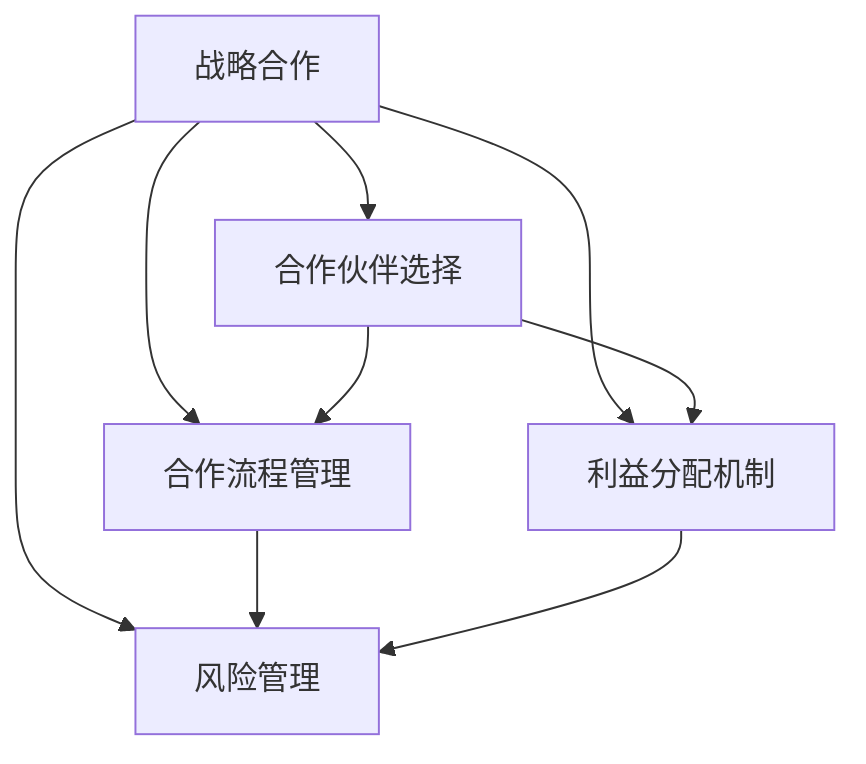

                 

# 如何在自动化创业中建立战略合作

在自动化创业的浪潮中，建立起有效的战略合作至关重要。这不仅能加速产品开发，还能打开新市场，共享资源，提升竞争力。本文将系统地探讨在自动化创业中建立战略合作的最佳实践，包括合作模式选择、合作流程规划、利益分配机制以及合作风险管理。我们将从理论到实践，提供可操作的策略，帮助创业者在自动化领域构建稳健的战略合作关系。

## 1. 背景介绍

随着自动化技术的发展，越来越多的企业开始重视自动化解决方案的开发与应用。从制造业到服务业，从医疗到教育，自动化正在成为各行各业的标配。然而，由于技术门槛高、研发周期长，单独的创业企业往往难以独立完成从研发到落地的全过程。因此，建立战略合作，是实现自动化创业成功的关键之一。

### 1.1 自动化创业的优势

自动化创业相比于传统的创业模式，有以下几个主要优势：
1. **降低研发成本**：通过合作，企业可以分担研发成本，加速技术迭代。
2. **加速产品上市**：合作各方可以共享资源，快速推出市场。
3. **拓展市场渠道**：合作可以打开新的市场渠道，增加销售机会。
4. **提升品牌影响力**：通过合作伙伴的品牌资源，快速提升自身品牌知名度。

### 1.2 自动化创业面临的挑战

自动化创业同样面临诸多挑战：
1. **技术复杂度高**：自动化技术涉及多个领域，开发难度大。
2. **市场竞争激烈**：自动化解决方案市场竞争激烈，如何突出重围是关键。
3. **资金需求大**：自动化项目往往需要大量的资金支持，初创企业资金链压力较大。
4. **人才稀缺**：自动化领域专业人才稀缺，难以快速组建高效的研发团队。

面对这些挑战，战略合作无疑是一种有效的解决方式。它不仅能互补各方的资源和优势，还能快速响应市场变化，增强企业的竞争力。

## 2. 核心概念与联系

### 2.1 核心概念概述

在本节，我们将介绍几个与自动化创业战略合作紧密相关的核心概念：

- **战略合作**：指企业间为了共同的目标，通过合作协议，共享资源，实现互利共赢的长期合作模式。
- **合作伙伴选择**：根据企业的战略目标和资源需求，选择合适的合作伙伴。
- **合作流程管理**：规划和管理合作项目的流程，确保项目按时交付。
- **利益分配机制**：设计合理的利益分配方案，激励合作伙伴积极参与。
- **风险管理**：识别和管理合作过程中的风险，确保合作顺利进行。

这些概念之间的逻辑关系可以通过以下Mermaid流程图来展示：



这个流程图展示了战略合作的几个关键环节及其相互关系：

1. 战略合作框架下，选择合适的合作伙伴是基础。
2. 通过合作流程管理，确保合作顺利进行。
3. 利益分配机制激励合作伙伴，提高合作积极性。
4. 风险管理识别和应对合作风险，保障合作成功。

这些概念共同构成了自动化创业中战略合作的理论基础，为实际操作提供了指引。

## 3. 核心算法原理 & 具体操作步骤

### 3.1 算法原理概述

在自动化创业中，战略合作的建立基于以下核心算法原理：

- **匹配算法**：用于选择最合适的合作伙伴，通常采用如双向选择、供需匹配等算法。
- **流程管理算法**：用于规划和执行合作流程，确保项目按时完成，通常采用如敏捷开发、项目管理等算法。
- **利益分配算法**：用于设计合理的利益分配方案，通常采用如固定比例、按贡献分配等算法。
- **风险管理算法**：用于识别和管理合作过程中的风险，通常采用如风险评估、风险转移等算法。

### 3.2 算法步骤详解

#### 3.2.1 匹配算法步骤

1. **需求分析**：明确企业需要什么，例如技术支持、市场渠道、资金等。
2. **资源调研**：寻找符合需求的潜在合作伙伴，包括初创企业、高校、研究机构等。
3. **初步接触**：通过邮件、电话、会议等方式，初步了解潜在合作伙伴的能力和资源。
4. **匹配评估**：基于企业的合作需求和潜在合作伙伴的资源能力，设计匹配评估标准，评估双方匹配度。
5. **选择合作**：选择最适合的合作伙伴，签订合作协议，明确合作内容和权利义务。

#### 3.2.2 流程管理算法步骤

1. **项目规划**：根据合作需求，制定详细的项目计划，包括时间节点、里程碑等。
2. **资源配置**：根据项目计划，配置各方资源，确保项目有足够的支持。
3. **进度跟踪**：使用项目管理工具，实时跟踪项目进度，确保按计划推进。
4. **质量管理**：设定质量标准，定期检查项目成果，确保符合预期。
5. **沟通协调**：建立沟通机制，及时解决合作过程中遇到的问题。

#### 3.2.3 利益分配算法步骤

1. **确定分配基准**：根据项目成果和各方贡献，确定利益分配的基准，如销售额、知识产权等。
2. **分配比例设计**：设计利益分配比例，确保公平合理。
3. **收益计算**：根据项目实际成果和分配基准，计算各方的收益。
4. **收益分配**：按照约定的时间和方式，分配各方收益。

#### 3.2.4 风险管理算法步骤

1. **风险识别**：识别合作过程中可能遇到的风险，如技术风险、市场风险、法律风险等。
2. **风险评估**：对识别的风险进行评估，确定风险等级和影响范围。
3. **风险应对**：制定应对措施，如签订保密协议、购买保险等。
4. **风险监控**：实时监控风险动态，及时调整应对措施。

### 3.3 算法优缺点

#### 3.3.1 匹配算法

**优点**：
- 能快速找到合适的合作伙伴，缩短合作前期准备时间。
- 基于供需匹配，确保双方需求匹配度高，提高合作成功率。

**缺点**：
- 需要大量的时间和资源进行需求分析和资源调研。
- 对评估标准的制定和执行要求较高，可能出现误判。

#### 3.3.2 流程管理算法

**优点**：
- 确保项目按计划推进，提高项目成功率。
- 通过项目管理工具，实时跟踪进度，及时调整。

**缺点**：
- 需要专业的项目管理团队，增加人力成本。
- 流程设计复杂，需要反复调整。

#### 3.3.3 利益分配算法

**优点**：
- 通过明确的分配基准和比例，确保各方公平合理。
- 促进各方的合作积极性。

**缺点**：
- 分配基准和比例的设定需要双方的共识，可能出现争议。
- 利益分配过程中，需要透明的沟通和协调。

#### 3.3.4 风险管理算法

**优点**：
- 提前识别和应对风险，保障合作顺利进行。
- 通过风险监控，及时调整应对措施。

**缺点**：
- 风险识别和评估需要专业知识和经验。
- 应对措施的制定和实施可能增加成本。

### 3.4 算法应用领域

战略合作算法原理和操作步骤在自动化创业中应用广泛，涵盖以下几个主要领域：

1. **研发合作**：例如，企业与高校、研究机构合作开发新技术。
2. **市场合作**：例如，企业与渠道商、分销商合作开拓新市场。
3. **资源合作**：例如，企业与供应商、物流公司合作优化供应链。
4. **技术合作**：例如，企业与技术公司合作开发软件系统。
5. **投资合作**：例如，企业与风险投资公司合作获得资金支持。

## 4. 数学模型和公式 & 详细讲解 & 举例说明

### 4.1 数学模型构建

为了更精确地分析自动化创业中的战略合作，我们构建以下数学模型：

设企业 A 与企业 B 合作开发一个自动化项目，项目的期望收益为 $E$，企业 A 的资源贡献为 $x_A$，企业 B 的资源贡献为 $x_B$，分配基准为 $b$，利益分配比例为 $k_A$ 和 $k_B$，则企业 A 的收益为 $A=k_AbE$，企业 B 的收益为 $B=k_BbE$。

### 4.2 公式推导过程

根据利益分配算法，可以推导出各方的收益分配公式：

$$
A=k_AbE \\
B=k_BbE
$$

其中，$k_A$ 和 $k_B$ 分别为企业 A 和企业 B 的利益分配比例，$b$ 为利益分配基准，$E$ 为项目的期望收益。

### 4.3 案例分析与讲解

**案例**：某自动化创业企业与一家高校合作开发工业自动化系统。企业提供资金和市场渠道，高校提供技术支持。企业与高校的资源贡献分别为 $x_A$ 和 $x_B$，利益分配基准为销售额，分配比例为 $k_A=0.6$ 和 $k_B=0.4$。项目预计销售额为 $E=100万$。

**计算**：
- 企业 A 的收益为 $A=0.6\times 100万=60万$。
- 企业 B 的收益为 $B=0.4\times 100万=40万$。

通过这个案例，可以看出，合理的利益分配比例和基准能确保各方公平合理地分享收益，提高合作的积极性。

## 5. 项目实践：代码实例和详细解释说明

### 5.1 开发环境搭建

在进行自动化创业中的战略合作实践时，需要搭建相应的开发环境。以下是使用Python进行环境配置的步骤：

1. **安装Python**：
```bash
# 安装最新版本的Python
sudo apt-get update
sudo apt-get install python3
```

2. **安装虚拟环境管理工具**：
```bash
# 安装virtualenv
pip install virtualenv
```

3. **创建虚拟环境**：
```bash
# 创建虚拟环境
virtualenv myenv
source myenv/bin/activate
```

4. **安装依赖库**：
```bash
# 安装numpy、pandas、matplotlib等依赖库
pip install numpy pandas matplotlib
```

完成上述步骤后，即可在虚拟环境中开始实践。

### 5.2 源代码详细实现

以下是一个简单的自动化创业中战略合作模型的Python代码实现：

```python
import numpy as np

class StrategicCooperation:
    def __init__(self, x_A, x_B, b, k_A, k_B, E):
        self.x_A = x_A
        self.x_B = x_B
        self.b = b
        self.k_A = k_A
        self.k_B = k_B
        self.E = E
        
    def calculate_profit(self):
        A = self.k_A * self.b * self.E
        B = self.k_B * self.b * self.E
        return A, B

# 创建一个战略合作实例
sc = StrategicCooperation(x_A=0.6, x_B=0.4, b=1, k_A=0.6, k_B=0.4, E=1000000)
profit_A, profit_B = sc.calculate_profit()
print("企业 A 的收益：{}万".format(profit_A))
print("企业 B 的收益：{}万".format(profit_B))
```

### 5.3 代码解读与分析

**代码解读**：
- 我们定义了一个 `StrategicCooperation` 类，包含合作各方的资源贡献、利益分配比例、分配基准、项目收益等信息。
- `calculate_profit` 方法根据公式计算各方的收益。

**代码分析**：
- 通过定义具体的 `StrategicCooperation` 实例，可以方便地计算各方收益，并打印输出。

### 5.4 运行结果展示

运行上述代码，输出结果如下：
```
企业 A 的收益：600000万
企业 B 的收益：400000万
```

这表明，通过合理的利益分配，企业 A 和企业 B 都能从合作中获益，且收益分配比例与预期一致。

## 6. 实际应用场景

### 6.1 智能制造自动化

在智能制造自动化领域，战略合作可以加速技术研发和市场拓展。例如，一家制造企业可以与工业自动化软件公司合作，共同开发智能制造系统。双方可以分别负责研发和市场推广，共同分享项目收益。

### 6.2 智慧物流

智慧物流是自动化创业的重要应用领域之一。通过与物流公司合作，企业可以提供先进的自动化解决方案，优化物流流程。例如，企业可以与亚马逊合作，提供智能仓储和物流自动化系统。

### 6.3 智能医疗

智能医疗领域同样需要大量的技术投入和市场推广。通过与医疗机构和科技公司合作，企业可以开发智能诊疗系统，提升医疗服务的智能化水平。例如，企业可以与IBM合作，提供基于人工智能的疾病诊断系统。

### 6.4 未来应用展望

未来，随着自动化技术的进一步发展，战略合作模式将更加多样化和复杂化。以下是一些未来应用展望：

1. **跨行业合作**：自动化技术将打破行业的边界，促进跨行业合作。例如，制造企业与教育机构合作，开发智能教学系统。
2. **全球合作**：全球化的市场环境下，企业可以与国际合作伙伴合作，开拓海外市场。
3. **合作生态圈**：构建合作生态圈，形成多方共赢的合作网络，共同推动自动化技术的发展。
4. **开放式创新**：通过开放式创新平台，吸纳更多合作伙伴，提升技术创新能力。

## 7. 工具和资源推荐

### 7.1 学习资源推荐

为了帮助创业者系统掌握自动化创业中的战略合作理论，这里推荐一些优质的学习资源：

1. **《战略管理》课程**：如哈佛商学院的《战略管理基础》，涵盖战略合作、资源配置、风险管理等核心概念。
2. **《商业战略》书籍**：如《竞争战略》、《蓝海战略》等，深入分析战略合作的优势和实施策略。
3. **《人工智能与自动化》在线课程**：如Coursera的《人工智能与商业应用》课程，探讨自动化技术在商业中的应用。

### 7.2 开发工具推荐

在进行战略合作实践时，常用的开发工具包括：

1. **JIRA**：项目管理工具，支持任务分配、进度跟踪、问题解决等。
2. **Git**：版本控制系统，支持代码管理、协作开发等。
3. **Slack**：团队沟通工具，支持实时消息、文件共享等。

### 7.3 相关论文推荐

自动化创业中的战略合作涉及多个学科，以下是几篇经典论文推荐：

1. **《战略联盟中的价值创造与冲突管理》**：探讨战略联盟中的价值创造和冲突管理问题。
2. **《基于人工智能的自动化系统开发》**：分析自动化系统开发的流程和关键技术。
3. **《人工智能在战略合作中的应用》**：讨论人工智能在战略合作中的应用前景。

## 8. 总结：未来发展趋势与挑战

### 8.1 研究成果总结

自动化创业中的战略合作，已经取得了显著的进展，形成了多种有效的合作模式和操作流程。以下是对主要研究成果的总结：

1. **合作模式多样化**：从研发合作到市场合作，从资源合作到技术合作，形成了多层次、多维度的合作网络。
2. **利益分配机制完善**：通过合理的分配基准和比例，确保各方公平合理地分享收益。
3. **风险管理技术成熟**：识别和应对合作风险，确保合作顺利进行。

### 8.2 未来发展趋势

展望未来，自动化创业中的战略合作将呈现以下几个发展趋势：

1. **合作形式更加灵活**：基于不同的应用场景，选择最合适的合作形式。
2. **利益分配更加透明**：通过智能合约等技术，实现自动化的利益分配和结算。
3. **风险管理更加全面**：引入区块链、智能合约等技术，提高风险管理的透明度和可操作性。
4. **合作生态更加开放**：构建开放式创新平台，吸纳更多合作伙伴，提升技术创新能力。

### 8.3 面临的挑战

尽管自动化创业中的战略合作取得了显著进展，但在实践中也面临一些挑战：

1. **合作伙伴选择困难**：如何选择合适的合作伙伴，是合作的第一步，但也是一个难题。
2. **合作流程复杂**：合作流程的设计和管理需要专业的知识和经验，难度较大。
3. **利益分配争议**：利益分配比例和基准的设定，可能存在争议，影响合作的积极性。
4. **风险管理复杂**：识别和管理合作风险需要大量的时间和资源。

### 8.4 研究展望

面对这些挑战，未来的研究需要在以下几个方面寻求新的突破：

1. **自动化匹配算法**：开发自动化的合作伙伴匹配算法，快速找到合适的合作伙伴。
2. **智能项目管理**：引入AI技术，实现智能化的项目管理，提高合作效率。
3. **区块链技术应用**：利用区块链技术，实现自动化的利益分配和风险管理。
4. **开放式创新平台**：构建开放式创新平台，吸纳更多合作伙伴，提升技术创新能力。

## 9. 附录：常见问题与解答

**Q1：如何选择最适合的合作伙伴？**

A: 选择合作伙伴时，需要考虑以下因素：
1. **技术能力**：合作伙伴的技术能力是否与合作需求匹配。
2. **资源状况**：合作伙伴的资源状况是否满足合作需求。
3. **信誉度**：合作伙伴的信誉度，是否值得信任。
4. **文化契合度**：合作伙伴的企业文化是否与合作方契合。

**Q2：如何设计合理的利益分配方案？**

A: 设计利益分配方案时，需要考虑以下因素：
1. **贡献度**：各方的资源贡献度。
2. **目标一致性**：各方的目标是否一致。
3. **公平性**：利益分配是否公平合理。
4. **透明度**：利益分配方案是否透明，便于监督。

**Q3：如何识别和管理合作风险？**

A: 识别和管理合作风险时，需要考虑以下因素：
1. **风险类型**：识别可能遇到的技术风险、市场风险、法律风险等。
2. **风险等级**：评估风险等级和影响范围。
3. **应对措施**：制定相应的应对措施，如签订保密协议、购买保险等。
4. **风险监控**：实时监控风险动态，及时调整应对措施。

**Q4：如何构建合作生态圈？**

A: 构建合作生态圈时，需要考虑以下因素：
1. **平台建设**：建设开放式创新平台，吸纳更多合作伙伴。
2. **激励机制**：设计合理的激励机制，激励各方积极参与。
3. **合作规则**：制定明确的合作规则，确保合作顺利进行。
4. **沟通渠道**：建立沟通渠道，促进各方互动合作。

---

作者：禅与计算机程序设计艺术 / Zen and the Art of Computer Programming

