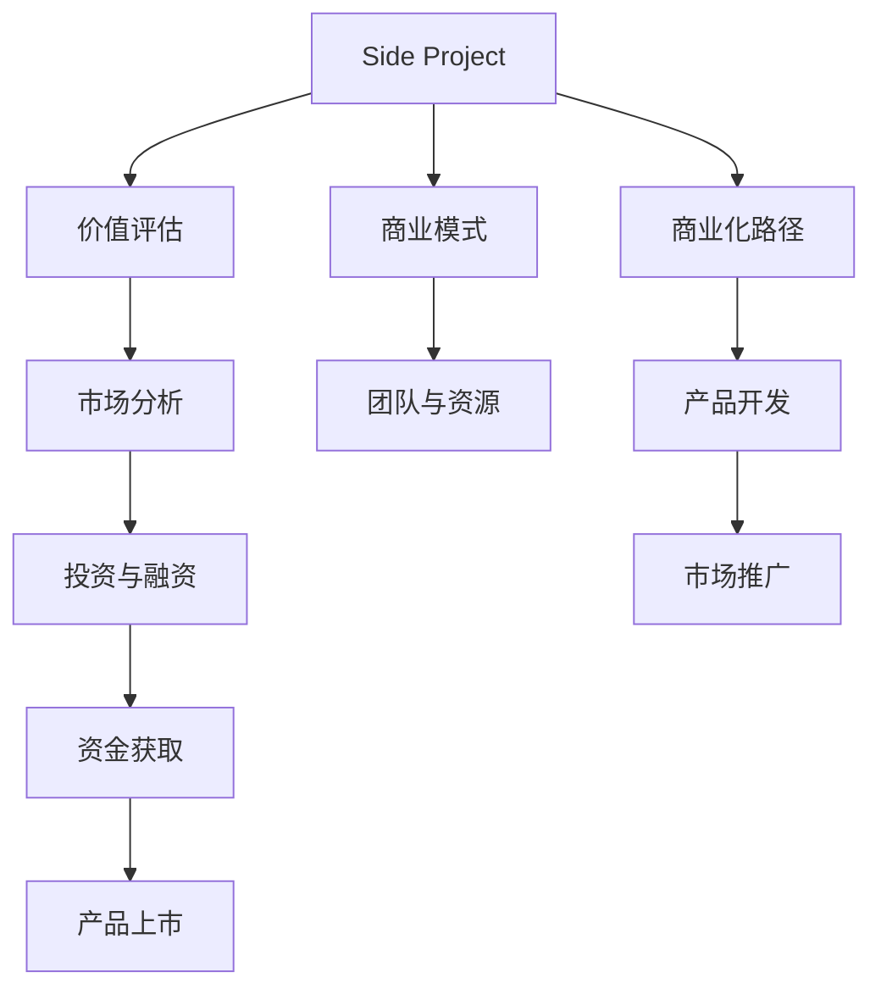

                 

# 如何将Side Project转化为估值上亿的创业公司

> 关键词：Side Project, 创业公司, 估值上亿, 技术开发, 商业模式, 市场分析, 投资决策

## 1. 背景介绍

### 1.1 问题由来
随着科技的飞速发展和互联网的普及，越来越多的人开始探索自己的Side Project，即非正式的个人项目。Side Project不仅能激发创新思维，还可以提升个人技能，甚至有时也能转化为商业机会。然而，很多Side Project最终因资源不足、市场需求不明、商业模式不清晰等原因未能成功。因此，如何更好地将Side Project转化为估值上亿的创业公司，成为科技创业者、技术专家和投资人共同关心的话题。

### 1.2 问题核心关键点
本文章将围绕以下核心关键点展开：
1. **Side Project的价值评估**：如何识别有潜力的Side Project，并将其转化为商业机会。
2. **商业模式的构建**：如何设计有效的商业模式，确保Side Project的持续发展和盈利能力。
3. **市场分析与定位**：如何精准定位目标市场，制定切实可行的市场进入策略。
4. **团队与资源的整合**：如何招募和培养高效团队，合理配置资源，推动Side Project的商业化。
5. **投资与融资策略**：如何制定合理的投资和融资计划，吸引投资者，加速Side Project的成长。

### 1.3 问题研究意义
将Side Project转化为估值上亿的创业公司，不仅可以实现个人梦想，还能创造社会价值。这对于推动科技创新、促进经济增长具有重要意义。具体而言，成功转化的Side Project能为社会提供新的产品和服务，解决实际问题，提升生活质量，同时带动就业和经济发展。

## 2. 核心概念与联系

### 2.1 核心概念概述

为了更好地理解如何将Side Project转化为创业公司，本节将介绍几个关键概念及其之间的联系：

- **Side Project**：非正式的个人项目，通常由个人兴趣爱好驱动，具有创新性和实验性。
- **创业公司**：以商业化为目标，通过提供产品或服务实现盈利的组织。
- **估值**：公司资产的市场价值，通常由潜在市场、盈利能力和投资者预期等因素决定。
- **商业模式**：描述公司如何创造、传递和获取价值的框架，包括产品、客户、渠道、收入等要素。
- **市场分析**：评估目标市场的规模、趋势、竞争和机会，帮助公司制定合理的发展战略。
- **投资与融资**：获取资金支持公司发展的过程，包括天使投资、风险投资、上市等。

这些核心概念之间存在紧密联系，共同构成了Side Project转化为创业公司的全流程。

### 2.2 核心概念原理和架构的 Mermaid 流程图

这个流程图展示了Side Project转化为创业公司的关键流程和步骤。

## 3. 核心算法原理 & 具体操作步骤

### 3.1 算法原理概述

将Side Project转化为创业公司的过程，本质上是一个从创新到商业化的过程。这一过程涉及多个阶段，包括价值评估、商业模式设计、市场分析、团队建设、投资与融资等。本文将介绍这些阶段的核心算法原理和具体操作步骤。

### 3.2 算法步骤详解

#### 3.2.1 价值评估

1. **识别潜在价值**：评估Side Project的技术创新性、市场需求、潜在盈利能力等，识别其转化为创业公司的价值。
2. **市场调研**：通过问卷调查、用户访谈、竞争分析等方式，了解市场需求和潜在客户。
3. **SWOT分析**：分析Side Project的优势、劣势、机会和威胁，明确其发展潜力和挑战。
4. **MVP测试**：构建最小可行产品(MVP)，验证市场接受度和需求。

#### 3.2.2 商业模式构建

1. **客户定位**：明确目标客户群体，分析其需求、行为和消费习惯。
2. **价值主张**：定义公司提供的产品或服务的独特价值，区分于竞争对手。
3. **收入模型**：选择适当的收入模式，如订阅、广告、直销等，确保可持续盈利。
4. **成本结构**：分析运营成本、生产成本、市场推广成本等，制定合理的定价策略。

#### 3.2.3 市场分析

1. **市场规模评估**：通过市场调研和数据分析，评估目标市场的规模和增长潜力。
2. **竞争分析**：分析竞争对手的优势和劣势，明确市场定位和差异化策略。
3. **用户行为分析**：研究用户行为模式，了解用户需求和痛点。
4. **市场趋势预测**：利用数据挖掘和机器学习技术，预测市场趋势和未来发展方向。

#### 3.2.4 团队与资源整合

1. **人才招募**：根据商业模式和市场分析结果，招募具有相关经验和技能的团队成员。
2. **资源配置**：合理分配资金、技术、市场等资源，确保公司运营的高效性。
3. **文化建设**：塑造积极向上的企业文化，增强团队凝聚力和创新能力。
4. **激励机制**：建立合理的激励机制，激发员工的工作热情和创造力。

#### 3.2.5 投资与融资

1. **初步评估**：进行详细的商业计划书撰写，明确公司发展目标、市场策略、财务预测等。
2. **投资者对接**：通过多种渠道接触潜在的投资者，如天使投资、风险投资、银行贷款等。
3. **融资方案制定**：根据投资者的需求和反馈，调整和优化融资方案，确保融资成功率。
4. **后续资金管理**：合理使用资金，定期汇报项目进展，确保资金使用的透明性和有效性。

### 3.3 算法优缺点

将Side Project转化为创业公司的方法具有以下优点：
1. **创新驱动**：Side Project通常源于个人兴趣和创新，有助于开发出具有差异化优势的产品。
2. **成本较低**：相比于传统创业，Side Project初期投入较少，可以快速迭代和验证市场。
3. **灵活性强**：Side Project不受传统组织架构限制，可以快速调整和优化策略。

然而，该方法也存在一些缺点：
1. **资源有限**：Side Project通常缺乏资金和专业经验，可能导致发展速度较慢。
2. **市场风险高**：缺乏市场调研和分析，可能导致产品不符合市场需求，难以推广。
3. **团队不稳定**：缺乏正式管理结构，可能导致团队成员流失和合作不顺畅。

### 3.4 算法应用领域

将Side Project转化为创业公司的策略，广泛应用于科技创业、创新型企业、中小企业等。在实际应用中，不同领域的创业公司可以根据自己的特点和需求，灵活运用这些策略，加速自身的商业化进程。

## 4. 数学模型和公式 & 详细讲解

### 4.1 数学模型构建

在将Side Project转化为创业公司过程中，涉及多个数学模型和公式。以下是几个关键模型的构建：

- **市场需求模型**：通过数据分析和预测，评估目标市场的潜在需求和规模。
- **财务模型**：利用财务公式和预测方法，计算公司的收入、成本和利润等关键指标。
- **客户细分模型**：通过聚类算法和分类模型，将客户分成不同的细分市场，进行精准营销。

### 4.2 公式推导过程

#### 4.2.1 市场需求模型

假设市场需求为 $D$，可通过以下公式推导：
$$
D = S \times P \times C \times T
$$
其中：
- $S$ 为潜在客户数量，
- $P$ 为产品或服务的渗透率，
- $C$ 为每位客户的生命周期价值，
- $T$ 为时间周期。

#### 4.2.2 财务模型

假设公司年营业收入为 $R$，年净利润为 $P$，可通过以下公式推导：
$$
P = R - C - E - T
$$
其中：
- $C$ 为固定成本，
- $E$ 为可变成本，
- $T$ 为税费等支出。

### 4.3 案例分析与讲解

以一个成功的Side Project转型案例为例：

**案例背景**：一个基于AI技术的健康管理平台，起初作为个人项目开发，通过识别用户的健康数据，提供个性化的健康建议和方案。

**价值评估**：通过市场调研和问卷调查，发现目标市场规模庞大，用户对健康管理需求强烈。

**商业模式**：选择订阅模式，每月收取一定费用，提供定制化健康管理服务。

**市场分析**：通过竞争分析和用户行为分析，发现市场上缺乏个性化健康管理平台，定位准确，有望获得突破。

**团队与资源整合**：招募具有AI和健康管理背景的人才，配置必要的资金和技术资源，建立积极向上的企业文化。

**投资与融资**：获得天使投资和风险投资的支持，加速平台的发展和推广。

## 5. 项目实践：代码实例和详细解释说明

### 5.1 开发环境搭建

在搭建开发环境时，需要考虑以下要素：

1. **硬件配置**：选择高性能的计算机或服务器，确保充足的计算资源和内存。
2. **软件环境**：安装所需的编程语言和工具，如Python、Java、Jupyter Notebook等。
3. **数据准备**：收集和整理所需数据集，包括市场调研数据、用户行为数据、财务数据等。

### 5.2 源代码详细实现

以一个简单的Side Project为例，展示如何将其转化为创业公司的代码实现：

**代码实现步骤**：
1. **需求分析**：通过问卷调查，了解市场需求和用户需求。
2. **产品设计**：设计和实现最小可行产品(MVP)，进行初步的市场测试。
3. **数据收集**：通过API接口或用户行为数据，收集用户反馈和市场数据。
4. **市场分析**：利用数据分析工具，评估市场需求和用户行为。
5. **团队组建**：招募和培训团队成员，明确职责分工。
6. **融资规划**：制定详细的融资计划，对接潜在的投资者。

### 5.3 代码解读与分析

代码实现过程中，需要注意以下几点：
1. **需求分析**：使用问卷调查工具，获取用户反馈和市场需求。
2. **产品设计**：使用MVP设计工具，快速实现最小可行产品。
3. **数据收集**：使用API接口和数据分析工具，收集和处理数据。
4. **市场分析**：使用数据分析和机器学习工具，进行市场预测和用户细分。
5. **团队组建**：使用招聘平台和培训工具，招募和培训团队成员。
6. **融资规划**：使用商业计划书工具，制定详细的融资计划。

### 5.4 运行结果展示

运行结果展示部分，可以通过以下方式呈现：
1. **市场需求模型**：展示市场需求分析和预测结果。
2. **财务模型**：展示公司收入、成本和利润的预测结果。
3. **用户细分模型**：展示用户行为分析和市场细分结果。
4. **融资效果**：展示融资计划和投资者对接结果。

## 6. 实际应用场景

### 6.1 健康管理平台

健康管理平台是一个典型的Side Project转型案例。通过将健康数据分析和个性化健康建议集成到一个平台上，可以为用户提供科学合理的健康管理方案，满足其健康需求。

在实践中，平台可以通过以下方式实现商业化：
1. **市场需求评估**：通过问卷调查和市场调研，了解用户的健康管理需求和潜在市场规模。
2. **商业模式设计**：选择订阅模式，提供个性化健康管理服务，收取月费。
3. **市场分析与定位**：分析竞争对手和用户行为，确定市场定位和差异化策略。
4. **团队与资源整合**：招募具有AI和健康管理背景的人才，配置必要的资金和技术资源。
5. **投资与融资**：获得天使投资和风险投资的支持，加速平台的发展和推广。

### 6.2 智能家居系统

智能家居系统也是一个Side Project转型的好案例。通过集成传感器、AI算法和物联网技术，可以为用户提供智能化的家居解决方案，提升生活品质。

在实践中，系统可以通过以下方式实现商业化：
1. **市场需求评估**：通过问卷调查和市场调研，了解用户的智能家居需求和潜在市场规模。
2. **商业模式设计**：选择智能设备销售和订阅服务结合的模式，收取设备费用和月费。
3. **市场分析与定位**：分析竞争对手和用户行为，确定市场定位和差异化策略。
4. **团队与资源整合**：招募具有AI和物联网背景的人才，配置必要的资金和技术资源。
5. **投资与融资**：获得天使投资和风险投资的支持，加速系统的研发和推广。

## 7. 工具和资源推荐

### 7.1 学习资源推荐

为了帮助开发者系统掌握Side Project转化为创业公司的理论基础和实践技巧，以下是一些推荐的学习资源：

1. **《创业维艰》**：通过真实的创业案例，探讨创业公司的成长历程和成功要素。
2. **《精益创业》**：介绍精益创业方法论，强调最小可行产品和快速迭代的重要性。
3. **《商业模式画布》**：通过画布工具，帮助公司设计和优化商业模式。
4. **《数据科学导论》**：介绍数据科学的基本原理和工具，提升数据分析能力。
5. **Coursera《创业与创新》课程**：通过在线课程，系统学习创业知识和方法。

### 7.2 开发工具推荐

为了提高Side Project转型的开发效率，以下是一些推荐的开发工具：

1. **Jupyter Notebook**：提供交互式的编程环境，便于代码测试和数据分析。
2. **GitHub**：提供代码版本控制和协作开发功能，方便团队管理和版本控制。
3. **Visual Studio Code**：提供丰富的插件和扩展，支持多种编程语言和工具。
4. **Google Colab**：提供免费的GPU/TPU算力，支持在线开发和实验。
5. **AWS**：提供云服务平台，支持快速部署和扩展。

### 7.3 相关论文推荐

为了深入了解Side Project转化为创业公司的理论和实践，以下是一些推荐的相关论文：

1. **《创业公司成长路径研究》**：探讨创业公司的成长路径和关键节点，提出具体的成长策略。
2. **《技术创业与商业模式创新》**：研究技术驱动的创业模式和创新策略，提出具体的商业模式设计方法。
3. **《数据驱动的商业模式创新》**：探讨数据在商业模式设计中的作用，提出具体的数据驱动方法。
4. **《精益创业与敏捷管理》**：研究精益创业的方法和工具，提出具体的敏捷管理策略。
5. **《科技创业中的用户中心设计》**：探讨用户中心设计在科技创业中的应用，提出具体的设计方法和工具。

## 8. 总结：未来发展趋势与挑战

### 8.1 总结

本文对Side Project转化为创业公司的全过程进行了系统介绍，从价值评估到商业模式设计，从市场分析到融资规划，提供了详细的理论和技术支持。通过本文的系统梳理，可以看到，Side Project转化为创业公司需要多方面的综合考虑，不仅需要技术实力，还需要商业智慧和资源整合能力。

### 8.2 未来发展趋势

未来，Side Project转化为创业公司的趋势将呈现以下几个方面：
1. **技术创新驱动**：随着技术的不断进步，Side Project将更易于实现商业化。
2. **数据驱动决策**：数据将成为公司决策的重要依据，提升决策的科学性和准确性。
3. **跨领域融合**：Side Project将更多地融合多种技术和学科，形成跨领域的技术创新。
4. **生态系统建设**：通过构建生态系统，加速公司的发展和扩展。
5. **可持续发展**：重视环境保护和可持续发展，提升公司的社会责任。

### 8.3 面临的挑战

尽管Side Project转化为创业公司具有广阔前景，但仍面临诸多挑战：
1. **市场需求变化**：市场变化迅速，需要持续关注和调整策略。
2. **资源配置问题**：有限的资源需要合理配置，避免浪费和不足。
3. **团队管理挑战**：团队管理复杂，需要有效的沟通和协作。
4. **法律法规风险**：需关注相关法律法规，避免法律风险。
5. **技术迭代挑战**：技术快速变化，需要持续学习和更新。

### 8.4 研究展望

未来，Side Project转化为创业公司的研究将从以下几个方面进行：
1. **快速迭代与市场验证**：研究如何快速迭代和验证市场，提升产品竞争力。
2. **跨领域技术融合**：研究跨领域技术融合的方法和策略，提升技术创新能力。
3. **数据驱动决策模型**：研究数据驱动的决策模型和工具，提升决策科学性。
4. **可持续发展与环境责任**：研究可持续发展与环境责任的结合，提升社会责任。
5. **技术风险管理**：研究技术风险管理的策略和方法，确保公司安全发展。

## 9. 附录：常见问题与解答

**Q1：如何将Side Project转化为创业公司？**

A: 将Side Project转化为创业公司需要以下步骤：
1. **价值评估**：识别Side Project的潜在价值和市场需求。
2. **商业模式设计**：选择合适的商业模式，如订阅、广告、直销等。
3. **市场分析**：进行市场调研和竞争分析，明确目标市场和用户需求。
4. **团队与资源整合**：招募和培训团队成员，合理配置资源。
5. **投资与融资**：制定融资计划，对接潜在的投资者。

**Q2：Side Project转化为创业公司需要哪些关键要素？**

A: Side Project转化为创业公司需要以下关键要素：
1. **技术创新**：具有技术优势和创新性。
2. **市场需求**：有明确的市场需求和潜在用户。
3. **商业模式**：设计合理的商业模式，确保可持续盈利。
4. **市场分析**：深入了解市场趋势和用户行为。
5. **团队管理**：招募和管理高效团队，提高团队凝聚力。
6. **融资能力**：具备良好的融资能力和策略。

**Q3：如何评估Side Project的市场价值？**

A: 评估Side Project的市场价值需要以下步骤：
1. **市场需求分析**：通过问卷调查和市场调研，了解市场需求和规模。
2. **竞争分析**：分析竞争对手的优势和劣势，明确市场定位。
3. **用户行为分析**：研究用户行为模式，了解用户需求和痛点。
4. **财务预测**：利用财务模型，预测公司的收入、成本和利润。
5. **SWOT分析**：评估Side Project的优势、劣势、机会和威胁。

**Q4：Side Project转化为创业公司需要注意哪些风险？**

A: Side Project转化为创业公司需要注意以下风险：
1. **市场风险**：市场需求变化快，需要持续关注和调整策略。
2. **资源风险**：有限的资源需要合理配置，避免浪费和不足。
3. **技术风险**：技术快速变化，需要持续学习和更新。
4. **法律风险**：需关注相关法律法规，避免法律风险。
5. **团队风险**：团队管理复杂，需要有效的沟通和协作。

**Q5：Side Project转化为创业公司有哪些成功案例？**

A: 以下是一些成功的Side Project转化为创业公司的案例：
1. **Airbnb**：创始人通过简单的租房信息分享平台，最终成为全球知名的短租平台。
2. **Dropbox**：创始人通过简单的文件共享工具，最终成为知名的云存储服务提供商。
3. **Spotify**：创始人通过简单的音乐推荐平台，最终成为全球知名的音乐流媒体服务。

---

作者：禅与计算机程序设计艺术 / Zen and the Art of Computer Programming

