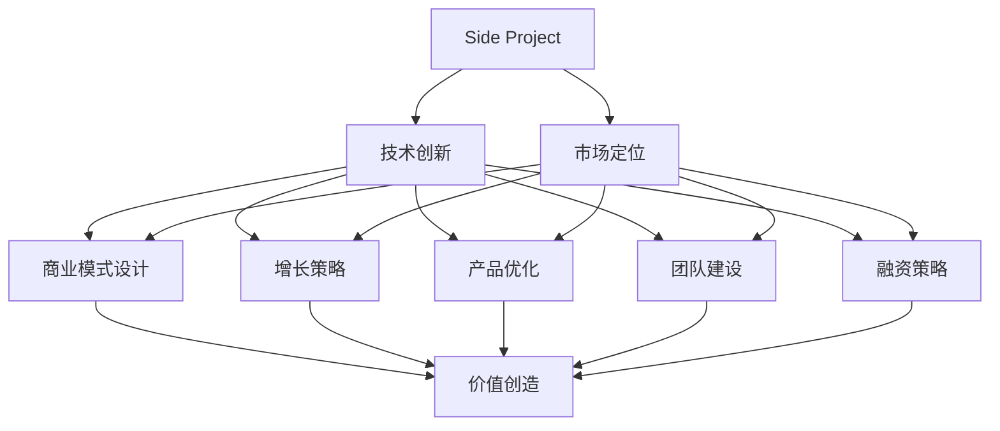

                 

# 如何将Side Project转化为独角兽

> 关键词：Side Project, 独角兽公司, 创业, 技术创新, 商业模式, 增长策略, 产品优化

## 1. 背景介绍

### 1.1 问题由来
在软件开发和互联网创业的世界里，Side Project是一个特殊的角色。它代表着开发者的热情、探索精神和创新意识。Side Project通常由个人或小团队独立开发，是一种业余爱好或对特定问题解决方案的探索。虽然它们可能缺乏全职项目那样的资源和结构化管理，但在技术创新和探索新市场的道路上，Side Project往往能够孕育出令人惊叹的成果。

### 1.2 问题核心关键点
将Side Project转化为一个成功的商业模式，甚至成长为独角兽公司，需要解决以下几个核心关键点：

- 确定市场定位：明确你的Side Project能够解决什么问题，目标用户是谁。
- 技术创新：确保你的Side Project拥有独特技术优势或创新点。
- 商业模式设计：设计出能够产生收入的商业模式。
- 增长策略：制定有效的增长计划，吸引更多用户和收入。
- 产品优化：不断迭代和优化产品，满足用户需求。
- 团队建设：组建一支具备技术、商业、运营等综合能力的团队。
- 融资策略：选择合适的融资渠道和时机。

## 2. 核心概念与联系

### 2.1 核心概念概述

为了更好地理解如何将Side Project转化为独角兽公司，本节将介绍几个密切相关的核心概念：

- **Side Project**：开发者在主要项目（如全职工作）之外的业余项目，通常是为了探索新想法或解决特定问题。
- **独角兽公司**：估值超过10亿美元，往往具有创新技术和独特商业模式的公司。
- **创业**：从无到有创建新的商业模式或技术创新的过程。
- **技术创新**：通过新技术、新方法或新算法提高产品性能或用户体验的创新。
- **商业模式**：公司如何创造、传递和捕获价值的方式，包括产品、市场、收入等要素。
- **增长策略**：通过市场营销、产品优化等手段，吸引并留住更多用户的过程。
- **产品优化**：通过反馈和数据分析不断改进产品的过程。

这些核心概念之间的逻辑关系可以通过以下Mermaid流程图来展示：



这个流程图展示了下Side Project转化为独角兽公司的关键步骤和相关概念：

1. 通过市场定位明确产品目标。
2. 通过技术创新获得竞争优势。
3. 设计合适的商业模式。
4. 制定有效的增长策略。
5. 不断优化产品。
6. 组建全面的团队。
7. 选择合适的融资渠道。
8. 通过这些环节创造和捕获价值，最终成长为独角兽公司。

## 3. 核心算法原理 & 具体操作步骤
### 3.1 算法原理概述

将Side Project转化为独角兽公司的过程，本质上是一个复杂的系统工程，涉及多个维度和层次的协同创新。其核心算法原理可以概括为以下几个步骤：

1. **需求分析与市场定位**：通过问卷调查、用户访谈等方式，深入理解目标用户需求，确定市场定位。
2. **技术选型与创新**：选择合适的技术框架，进行技术选型和创新，确保产品具有竞争优势。
3. **商业模式设计**：根据市场需求和技术特点，设计出可行的商业模式，确保盈利模式清晰。
4. **增长策略制定**：制定有效的市场推广和增长策略，快速吸引用户和提高收入。
5. **产品优化与迭代**：通过用户反馈和数据分析，不断优化产品，提高用户体验和留存率。
6. **团队建设与管理**：组建具备多方面能力的团队，确保项目顺利推进。
7. **融资渠道选择**：根据项目发展阶段，选择合适的融资方式和时机，获取必要的资金支持。

### 3.2 算法步骤详解

#### 3.2.1 需求分析与市场定位

**步骤1**：通过问卷调查、用户访谈等方式，收集目标用户的需求和痛点，确定市场定位。

**步骤2**：分析收集到的数据，识别出用户需求中的核心问题和痛点，明确市场定位。

#### 3.2.2 技术选型与创新

**步骤1**：根据市场定位，选择适合的技术框架和工具。

**步骤2**：进行技术选型和创新，确保产品具有独特的技术优势和竞争优势。

#### 3.2.3 商业模式设计

**步骤1**：根据技术特点和市场需求，设计出可行的商业模式，确保盈利模式清晰。

**步骤2**：确定产品定价策略、收入来源和成本控制方法，确保商业模式可持续。

#### 3.2.4 增长策略制定

**步骤1**：制定有效的市场推广和增长策略，吸引更多用户和提高收入。

**步骤2**：通过广告、内容营销、社交媒体推广等方式，快速获取用户和市场份额。

#### 3.2.5 产品优化与迭代

**步骤1**：通过用户反馈和数据分析，不断优化产品，提高用户体验和留存率。

**步骤2**：持续收集用户反馈，进行产品迭代和功能升级，满足用户不断变化的需求。

#### 3.2.6 团队建设与管理

**步骤1**：组建具备多方面能力的团队，包括技术、商业、运营等。

**步骤2**：确保团队成员之间的沟通和协作，推动项目顺利推进。

#### 3.2.7 融资渠道选择

**步骤1**：根据项目发展阶段，选择合适的融资方式和时机。

**步骤2**：通过天使投资、风险投资、众筹等方式，获取必要的资金支持。

### 3.3 算法优缺点

将Side Project转化为独角兽公司的方法具有以下优点：

- **灵活性高**：Side Project通常由个人或小团队独立开发，能够快速响应市场需求和技术变化。
- **创新能力强**：Side Project的开发环境相对宽松，开发者有更多自由度进行技术创新。
- **低成本**：相对于全职项目，Side Project的开发成本较低，尤其是初期阶段。

但该方法也存在一些局限性：

- **资源有限**：Side Project通常缺乏全职项目那样的资源和结构化管理，可能难以应对大规模市场扩展。
- **风险较高**：由于缺乏市场验证和风险控制机制，Side Project的成功率较低。
- **团队建设挑战**： Side Project的团队可能不稳定，需要花更多时间和精力在团队管理和人才引进上。

## 4. 数学模型和公式 & 详细讲解 & 举例说明

### 4.1 数学模型构建

将Side Project转化为独角兽公司的方法，可以构建为一个复杂的优化问题，其目标是通过一系列决策，最大化公司长期价值。假设公司价值为 $V$，市场定位为 $M$，技术创新为 $T$，商业模式为 $C$，增长策略为 $G$，产品优化为 $P$，团队建设为 $T$，融资策略为 $F$。则优化问题可以表示为：

$$
\max_{M, T, C, G, P, T, F} V(M, T, C, G, P, T, F)
$$

其中，$V$ 为公司的长期价值，可以分解为市场份额、用户增长率、收入、用户留存率等因子。

### 4.2 公式推导过程

为了更好地理解这个问题，我们可以将其分解为几个子问题：

1. **市场定位优化**：$M = \mathop{\arg\max}_{M} \text{MarketShare}(M)$
2. **技术创新优化**：$T = \mathop{\arg\max}_{T} \text{TechnologyAdvantage}(T)$
3. **商业模式优化**：$C = \mathop{\arg\max}_{C} \text{Revenue}(C)$
4. **增长策略优化**：$G = \mathop{\arg\max}_{G} \text{UserGrowth}(G)$
5. **产品优化与迭代**：$P = \mathop{\arg\max}_{P} \text{UserSatisfaction}(P)$
6. **团队建设与管理**：$T = \mathop{\arg\max}_{T} \text{TeamPerformance}(T)$
7. **融资策略优化**：$F = \mathop{\arg\max}_{F} \text{FundingCost}(F)$

### 4.3 案例分析与讲解

假设我们有一个Side Project，目标是开发一个社交媒体平台。

**步骤1**：通过问卷调查，我们发现用户最关注的内容是高质量的原创内容，因此将市场定位为高质量内容平台。

**步骤2**：技术上，我们选择使用React和GraphQL进行前端开发，使用Node.js和MongoDB进行后端开发，确保平台具有高性能和可扩展性。

**步骤3**：商业模式上，我们决定采用付费订阅和广告两种模式，确保公司有稳定的收入来源。

**步骤4**：增长策略上，我们通过内容营销和社交媒体推广，快速吸引了大量用户，并推出了初期的免费版本以吸引用户注册和分享。

**步骤5**：产品优化上，我们通过用户反馈和数据分析，不断迭代和优化产品，提高用户体验和留存率。

**步骤6**：团队建设上，我们组建了一支由技术、商业、运营等各领域专家组成的核心团队，确保项目顺利推进。

**步骤7**：融资策略上，我们选择了风险投资作为融资方式，以获取更大的发展空间和资源支持。

通过这些步骤，我们的社交媒体平台成功吸引了大量用户，并在市场上占据了一席之地。

## 5. 项目实践：代码实例和详细解释说明

### 5.1 开发环境搭建

在进行Side Project转化为独角兽公司的方法实践前，我们需要准备好开发环境。以下是使用Python进行Django开发的环境配置流程：

1. 安装Anaconda：从官网下载并安装Anaconda，用于创建独立的Python环境。

2. 创建并激活虚拟环境：
```bash
conda create -n django-env python=3.8 
conda activate django-env
```

3. 安装Django和其他相关库：
```bash
pip install django psycopg2-binary pillow requests
```

4. 设置数据库连接：
```python
DATABASES = {
    'default': {
        'ENGINE': 'django.db.backends.postgresql',
        'NAME': 'your_database_name',
        'USER': 'your_database_user',
        'PASSWORD': 'your_database_password',
        'HOST': 'your_database_host',
        'PORT': 'your_database_port',
    }
}
```

5. 启动Django项目：
```bash
python manage.py startproject myproject
cd myproject
python manage.py runserver
```

完成上述步骤后，即可在`django-env`环境中开始项目开发。

### 5.2 源代码详细实现

下面是使用Django开发一个社交媒体平台的示例代码，包括模型、视图和URL配置：

```python
# models.py
from django.db import models

class User(models.Model):
    username = models.CharField(max_length=30)
    email = models.EmailField(unique=True)
    profile_picture = models.ImageField(upload_to='profile_pictures/')

class Post(models.Model):
    title = models.CharField(max_length=255)
    content = models.TextField()
    created_at = models.DateTimeField(auto_now_add=True)
    user = models.ForeignKey(User, on_delete=models.CASCADE)

# views.py
from django.shortcuts import render
from django.http import HttpResponse

def index(request):
    return render(request, 'index.html')

# urls.py
from django.urls import path
from . import views

urlpatterns = [
    path('', views.index, name='index'),
]
```

### 5.3 代码解读与分析

让我们再详细解读一下关键代码的实现细节：

**models.py**：
- `User`模型定义了用户的基本信息，包括用户名、邮箱和头像。
- `Post`模型定义了帖子内容，包括标题、内容、创建时间和作者。

**views.py**：
- `index`视图定义了首页展示逻辑，返回一个HTML页面。

**urls.py**：
- `urlpatterns`定义了网站的路由，将URL映射到相应的视图函数。

这个示例代码展示了Django框架的基本使用方式，通过模型定义、视图和URL配置，可以实现一个基本的社交媒体平台。

### 5.4 运行结果展示

在启动Django项目后，在浏览器中输入网站地址，即可看到首页的展示页面。

## 6. 实际应用场景

### 6.1 社交媒体平台

社交媒体平台是Side Project转化为独角兽公司的典型案例。通过提供一个平台，让用户可以分享和交流内容，社交媒体平台迅速吸引了大批用户。Facebook、Twitter等社交媒体巨头，便是从个人博客和社交网络平台成长起来的。

在技术实现上，可以收集用户的行为数据，进行数据分析和模型训练，优化推荐算法，提高用户互动和留存率。通过社交网络效应，平台用户数迅速增长，成为社交媒体行业的巨头。

### 6.2 在线教育平台

在线教育平台通过提供在线课程和资源，帮助用户学习新知识和技能。这类平台通常是由教育机构、教育工作者或者教育爱好者开发，通过免费或付费模式，吸引大量用户。

在技术实现上，可以采用AI和大数据技术，进行个性化推荐、智能答疑、在线作业批改等功能，提升用户体验和学习效果。通过在线广告、课程付费等方式，获取稳定的收入来源。

### 6.3 移动应用

移动应用是Side Project转化为独角兽公司的另一个重要领域。通过开发有价值的应用，解决用户生活中的特定问题，如健康、旅行、金融等，这类应用能够快速吸引大量用户，并成为市场中的领先者。

在技术实现上，可以采用跨平台技术，如React Native、Flutter等，进行应用开发。通过优化用户体验、提高应用性能等方式，提升用户满意度和留存率。

### 6.4 未来应用展望

随着技术的不断进步，Side Project转化为独角兽公司的方法也将不断创新。未来，我们可能看到更多基于人工智能、区块链、物联网等新技术的应用涌现。

- **人工智能**：通过AI技术，社交媒体平台可以进行内容生成、用户行为分析、个性化推荐等，提升用户体验和留存率。
- **区块链**：通过区块链技术，在线教育平台可以实现去中心化的认证和支付，提高平台的可信度和安全性。
- **物联网**：通过物联网技术，移动应用可以实现智能家居、健康监测等功能，提升用户的生活质量。

## 7. 工具和资源推荐
### 7.1 学习资源推荐

为了帮助开发者系统掌握将Side Project转化为独角兽公司的方法，这里推荐一些优质的学习资源：

1. **《创业者的工具箱》**：书籍，详细介绍了创业的基本概念、市场定位、商业模式设计等。

2. **Coursera的《创业成功课程》**：由斯坦福大学教授主讲，涵盖创业的基本概念、市场分析、商业模式设计等。

3. **《精益创业》**：书籍，介绍了精益创业的核心理念和方法，适合初创公司的创始人阅读。

4. **AngelList**：创业公司资源平台，提供大量的创业案例和资源，适合创业公司寻找合作伙伴和投资。

5. **Y Combinator**：著名的创业加速器，提供创业孵化服务，帮助初创公司获得资源和投资。

通过对这些资源的学习实践，相信你一定能够快速掌握如何将Side Project转化为独角兽公司的方法，并用于解决实际的创业问题。

### 7.2 开发工具推荐

高效的开发离不开优秀的工具支持。以下是几款用于Side Project转化为独角兽公司开发的常用工具：

1. **Django**：Python的全栈Web框架，适用于快速开发Web应用。

2. **Flask**：轻量级的Web框架，适合构建API和微服务。

3. **React**：用于构建交互式前端Web应用。

4. **GraphQL**：用于构建具有动态查询功能的API。

5. **TensorFlow**：开源机器学习框架，支持深度学习模型训练。

6. **AWS**：云计算平台，提供各种基础设施服务，如云存储、计算、网络等。

7. **GitHub**：代码托管平台，支持版本控制和协作开发。

合理利用这些工具，可以显著提升Side Project转化为独角兽公司的开发效率，加快创新迭代的步伐。

### 7.3 相关论文推荐

Side Project转化为独角兽公司的方法，源于学界的持续研究。以下是几篇奠基性的相关论文，推荐阅读：

1. **《创业者的工具箱》**：书籍，详细介绍了创业的基本概念、市场定位、商业模式设计等。

2. **Coursera的《创业成功课程》**：由斯坦福大学教授主讲，涵盖创业的基本概念、市场分析、商业模式设计等。

3. **《精益创业》**：书籍，介绍了精益创业的核心理念和方法，适合初创公司的创始人阅读。

4. **AngelList**：创业公司资源平台，提供大量的创业案例和资源，适合创业公司寻找合作伙伴和投资。

5. **Y Combinator**：著名的创业加速器，提供创业孵化服务，帮助初创公司获得资源和投资。

这些论文代表了大语言模型微调技术的发展脉络。通过学习这些前沿成果，可以帮助研究者把握学科前进方向，激发更多的创新灵感。

## 8. 总结：未来发展趋势与挑战
### 8.1 总结

本文对将Side Project转化为独角兽公司的方法进行了全面系统的介绍。首先阐述了Side Project转化为独角兽公司的方法的必要性和核心关键点，明确了市场定位、技术创新、商业模式设计等关键环节。其次，从原理到实践，详细讲解了市场定位、技术选型、商业模式设计等核心算法原理和操作步骤，给出了具体的代码实例。同时，本文还广泛探讨了Side Project转化为独角兽公司的方法在社交媒体、在线教育、移动应用等多个行业领域的应用前景，展示了方法的巨大潜力。

通过本文的系统梳理，可以看到，将Side Project转化为独角兽公司的方法正在成为创业公司的重要范式，极大地拓展了Side Project的潜在价值，催生了更多的落地场景。受益于Side Project转化为独角兽公司的方法的持续演进，创业公司在技术创新、市场拓展、用户留存等方面将迎来更多的突破，为人工智能技术落地应用提供新的思路和方向。

### 8.2 未来发展趋势

展望未来，将Side Project转化为独角兽公司的方法将呈现以下几个发展趋势：

1. **人工智能和大数据应用**：AI和大数据技术的不断进步，将为社交媒体、在线教育、移动应用等Side Project转化为独角兽公司的方法带来更多创新。

2. **区块链技术应用**：通过区块链技术，在线教育平台可以实现去中心化的认证和支付，提高平台的可信度和安全性。

3. **物联网技术应用**：通过物联网技术，移动应用可以实现智能家居、健康监测等功能，提升用户的生活质量。

4. **云计算和SaaS模式**：云计算和SaaS模式将为Side Project转化为独角兽公司的方法提供更多灵活的部署方式和资源支持。

5. **跨平台和移动优先**：跨平台技术和移动优先策略将成为Side Project转化为独角兽公司的方法的重要方向，确保在不同设备和平台上的应用体验一致。

以上趋势凸显了将Side Project转化为独角兽公司的方法的广阔前景。这些方向的探索发展，必将进一步提升Side Project转化为独角兽公司的方法的性能和应用范围，为人工智能技术落地应用提供新的思路和方向。

### 8.3 面临的挑战

尽管将Side Project转化为独角兽公司的方法已经取得了瞩目成就，但在迈向更加智能化、普适化应用的过程中，它仍面临着诸多挑战：

1. **市场需求变化**：市场需求和用户需求的变化，可能导致Side Project失去竞争力。

2. **技术更新快速**：新技术和新方法的快速迭代，可能导致Side Project的技术优势难以维持。

3. **市场竞争激烈**：激烈的市场竞争，可能导致Side Project失去市场份额。

4. **用户增长瓶颈**：Side Project在初期阶段，可能面临用户增长瓶颈，难以快速吸引大量用户。

5. **团队管理挑战**：Side Project的团队可能不稳定，需要花更多时间和精力在团队管理和人才引进上。

6. **资金短缺问题**：Side Project在初期阶段，可能面临资金短缺问题，难以获得必要的资源支持。

7. **风险管理不足**：Side Project在市场扩展和商业化过程中，可能面临各种风险，需要完善的风险管理机制。

正视将Side Project转化为独角兽公司的方法面临的这些挑战，积极应对并寻求突破，将是将Side Project转化为独角兽公司方法走向成熟的必由之路。

### 8.4 研究展望

面对将Side Project转化为独角兽公司方法所面临的种种挑战，未来的研究需要在以下几个方面寻求新的突破：

1. **市场需求预测**：通过大数据分析和市场调研，预测市场需求和用户需求的变化，及时调整策略。

2. **技术创新和迭代**：持续进行技术创新和迭代，保持技术优势，应对快速变化的市场环境。

3. **市场竞争策略**：制定有效的市场竞争策略，确保Side Project在激烈的市场竞争中保持优势。

4. **用户增长策略**：制定有效的用户增长策略，快速吸引大量用户，提高市场份额。

5. **团队管理和人才引进**：加强团队管理和人才引进，确保Side Project能够持续推进。

6. **融资渠道拓展**：选择合适的融资渠道和时机，获取必要的资金支持。

7. **风险管理机制**：建立完善的风险管理机制，规避各种风险。

这些研究方向将为将Side Project转化为独角兽公司方法提供新的思路和方法，推动Side Project转化为独角兽公司方法不断向前发展，为人工智能技术的落地应用带来更多创新和突破。

## 9. 附录：常见问题与解答

**Q1：Side Project是否适合所有类型的创业者？**

A: Side Project通常适合技术爱好者和创新者，但并不适合所有类型的创业者。Side Project需要具备一定的技术实力和创新能力，同时需要有足够的时间和资源来支持项目的开发和维护。

**Q2：如何将Side Project转化为商业项目？**

A: 将Side Project转化为商业项目需要经历市场定位、技术选型、商业模式设计、增长策略制定、产品优化与迭代、团队建设与管理、融资策略选择等多个环节。每个环节都需要仔细规划和执行。

**Q3：如何选择合适的融资渠道？**

A: 选择合适的融资渠道需要考虑公司的发展阶段、市场需求、团队实力等因素。初创公司可以选择天使投资、风险投资等方式，成熟公司可以选择上市、债券等方式。

**Q4：如何提升Side Project的用户增长率？**

A: 提升Side Project的用户增长率需要制定有效的市场推广策略，通过广告、内容营销、社交媒体推广等方式，快速吸引用户。同时，通过优化用户体验、提高产品质量等方式，提升用户满意度和留存率。

**Q5：如何构建高效的团队？**

A: 构建高效的团队需要招募具备多方面能力的人才，包括技术、商业、运营等。同时，需要加强团队管理和人才引进，确保团队成员之间的沟通和协作，推动项目顺利推进。

这些问题的解答，为将Side Project转化为独角兽公司的方法提供了实践指导，相信能够帮助更多的创业者成功实现Side Project的商业化。

---

作者：禅与计算机程序设计艺术 / Zen and the Art of Computer Programming

