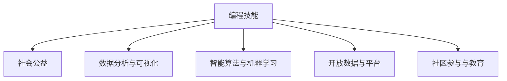

                 

# 如何将编程技能应用于社会公益

## 1. 背景介绍

编程技能在现代社会中具有广泛的应用价值，不仅限于软件开发和技术实现。近年来，越来越多的编程爱好者和专家开始将编程技能应用于社会公益领域，推动社会进步和民生改善。本文旨在探讨如何将编程技能应用于社会公益，分析其优势和实现路径。

### 1.1 问题由来

在信息化时代，社会公益领域的许多问题都需要通过技术手段来解决。例如，疫情信息公开、灾难预警、环境保护、社区服务、教育公平等，都离不开数据处理和信息传播。然而，传统的数据收集和处理手段往往效率低下、成本高昂，难以满足日益增长的社会需求。因此，利用编程技能开发高效、智能的应用系统，成为推动社会公益事业发展的重要手段。

### 1.2 问题核心关键点

将编程技能应用于社会公益，核心在于利用技术手段解决社会问题，提高公益项目的效率和效益。具体关键点包括：
- **数据处理与分析**：通过编程技术对公益项目产生的海量数据进行高效处理和分析，提取有价值的信息，提供决策支持。
- **智能系统开发**：开发智能应用程序，自动处理任务，提升公益项目的服务质量和用户体验。
- **开放数据平台**：搭建开放数据平台，促进公益项目的透明化、数据共享和协作。
- **社区参与与教育**：通过编程活动，普及技术知识，培养社区成员的编程技能，提升社区参与度。

## 2. 核心概念与联系

### 2.1 核心概念概述

为了更好地理解编程技能在社会公益中的应用，本文将介绍几个密切相关的核心概念：

- **编程技能**：包括编程语言、算法设计、软件工程等方面的知识和技能，能够开发和维护高效、可靠的软件系统。
- **社会公益**：指的是以社会福祉为根本目标，致力于改善社会环境、促进社会公平、增进人类福祉的各种活动和项目。
- **数据分析与可视化**：通过对数据进行收集、清洗、分析和可视化，帮助决策者和公众理解社会现象和问题。
- **智能算法与机器学习**：利用算法和机器学习技术，从数据中挖掘规律和模式，提供预测和决策支持。
- **开放数据与平台**：通过开放数据共享平台，促进数据公开、透明，促进数据的多样性和创新性。
- **社区参与与教育**：通过编程活动，培养社区成员的技术素养，促进社区的共同参与和协作。

这些概念之间的逻辑关系可以通过以下Mermaid流程图来展示：



这个流程图展示了编程技能如何通过数据分析、智能算法、开放数据和社区参与等环节，应用于社会公益的各个方面，提升公益项目的效果和影响力。

## 3. 核心算法原理 & 具体操作步骤

### 3.1 算法原理概述

编程技能在社会公益中的应用，主要基于以下算法原理：

- **数据处理算法**：包括数据清洗、特征提取、降维、聚类等，用于从海量数据中提取出有用的信息。
- **机器学习算法**：包括监督学习、非监督学习、强化学习等，用于分析数据、预测未来趋势、优化决策过程。
- **自然语言处理算法**：包括文本分类、实体识别、情感分析等，用于分析社会舆情、处理文本数据。
- **图像处理算法**：包括图像识别、目标检测、图像分割等，用于处理和分析视频、图像数据。

### 3.2 算法步骤详解

基于编程技能的社会公益项目开发，一般包括以下关键步骤：

**Step 1: 需求分析**
- 与公益项目负责人沟通，了解项目需求、目标、数据来源等关键信息。
- 分析数据类型、格式、规模，确定数据处理和分析的方法。

**Step 2: 数据采集与预处理**
- 使用爬虫、API等技术，从公开渠道获取相关数据。
- 进行数据清洗、去重、规范化等预处理操作。
- 使用数据可视化工具，直观展示数据分布和特征。

**Step 3: 数据分析与建模**
- 选择合适的方法进行特征工程、模型选择和训练。
- 使用机器学习算法进行预测和分类。
- 进行模型评估和调优，提高预测精度和泛化能力。

**Step 4: 系统开发与部署**
- 设计并实现数据处理、分析、可视化等功能模块。
- 选择合适的技术栈和框架，如Python、Flask、React等。
- 部署系统到云平台或本地服务器，确保系统稳定运行。

**Step 5: 用户培训与社区推广**
- 通过线下讲座、线上教程、互动平台等方式，普及编程技能和技术知识。
- 与社区成员互动，收集反馈，优化系统功能。
- 推动社区成员参与公益项目，提高项目影响力。

### 3.3 算法优缺点

将编程技能应用于社会公益具有以下优点：
1. **高效性**：利用编程技能可以高效处理和分析数据，提取有用信息，提升决策效率。
2. **可扩展性**：基于编程的社会公益项目易于扩展和维护，适应不断变化的需求。
3. **透明度**：编程技术使得公益项目的流程和决策过程透明可追溯，增强信任。
4. **社区参与**：编程活动可以培养社区成员的技术素养，提升社区的共同参与度和责任感。

同时，这种应用也存在一些局限性：
1. **技术门槛**：需要一定的编程技能和数据分析知识，对部分社区成员来说可能存在技术障碍。
2. **资源投入**：初期需要较大的资源投入，包括人力、物力、财力等。
3. **数据隐私**：处理敏感数据时需要特别注意隐私保护，防止信息泄露。
4. **效果评估**：公益项目的成效评估需要科学方法和标准，确保项目效果的客观性和可信度。

## 4. 数学模型和公式 & 详细讲解

### 4.1 数学模型构建

在社会公益项目中，常常需要建立数学模型来进行数据分析和预测。以下是几个常见的数学模型：

- **线性回归模型**：用于建立输入变量和输出变量之间的线性关系，如用编程技能进行社区健康调查数据的分析。
- **决策树模型**：用于分类和预测，如用编程技能进行灾害预警系统的开发。
- **支持向量机模型**：用于分类和回归，如用编程技能进行水质监测数据的分类。
- **深度学习模型**：用于处理复杂数据和识别模式，如用编程技能进行医疗影像分析。

### 4.2 公式推导过程

以线性回归模型为例，其基本形式为：

$$
y = \beta_0 + \beta_1x_1 + \beta_2x_2 + \ldots + \beta_nx_n + \epsilon
$$

其中，$y$ 为输出变量，$x_i$ 为输入变量，$\beta_i$ 为回归系数，$\epsilon$ 为误差项。线性回归的优化目标是使误差项 $\epsilon$ 最小化，通常使用均方误差（MSE）作为评价指标。

推导过程如下：

1. 定义损失函数：

$$
L(y, \beta) = \frac{1}{2N} \sum_{i=1}^{N} (y_i - (\beta_0 + \beta_1x_{i1} + \ldots + \beta_nx_{in}))^2
$$

2. 对 $\beta_i$ 求导，得到梯度：

$$
\frac{\partial L(y, \beta)}{\partial \beta_i} = -\frac{1}{N} \sum_{i=1}^{N} (y_i - (\beta_0 + \beta_1x_{i1} + \ldots + \beta_nx_{in}))
$$

3. 使用梯度下降算法更新参数：

$$
\beta_i \leftarrow \beta_i - \eta \frac{\partial L(y, \beta)}{\partial \beta_i}
$$

其中 $\eta$ 为学习率。通过迭代更新，逐步优化模型参数，最终得到线性回归模型。

### 4.3 案例分析与讲解

**案例：疫情信息公开系统**

开发一个疫情信息公开系统，使用编程技能进行数据采集、清洗、分析和可视化。具体步骤如下：

1. 数据采集：从政府公开渠道、新闻网站、社交媒体等采集疫情数据。
2. 数据清洗：去除重复、错误、缺失数据，规范化数据格式。
3. 数据分析：使用统计学方法分析疫情趋势、疫情热点、疫情原因等。
4. 数据可视化：使用图表、地图等工具展示分析结果，直观展示疫情动态。

## 5. 项目实践：代码实例和详细解释说明

### 5.1 开发环境搭建

在进行公益项目开发前，我们需要准备好开发环境。以下是使用Python进行PyTorch开发的环境配置流程：

1. 安装Anaconda：从官网下载并安装Anaconda，用于创建独立的Python环境。

2. 创建并激活虚拟环境：
```bash
conda create -n pytorch-env python=3.8 
conda activate pytorch-env
```

3. 安装PyTorch：根据CUDA版本，从官网获取对应的安装命令。例如：
```bash
conda install pytorch torchvision torchaudio cudatoolkit=11.1 -c pytorch -c conda-forge
```

4. 安装TensorFlow：由Google主导开发的开源深度学习框架，生产部署方便，适合大规模工程应用。同样有丰富的预训练语言模型资源。

5. 安装Transformer库：
```bash
pip install transformers
```

6. 安装各类工具包：
```bash
pip install numpy pandas scikit-learn matplotlib tqdm jupyter notebook ipython
```

完成上述步骤后，即可在`pytorch-env`环境中开始公益项目开发。

### 5.2 源代码详细实现

这里以一个基于编程技能开发的社区健康调查数据分析系统为例，详细展示代码实现。

**需求分析**

与社区负责人沟通，了解社区健康调查数据的需求和目标。假设社区健康调查数据包含以下字段：年龄、性别、婚姻状况、职业、居住地、健康状况、疾病史、生活习惯等。

**数据采集与预处理**

使用Python爬虫技术，从社区调查问卷中采集数据。将采集到的数据进行清洗、去重、规范化等预处理操作。

```python
import pandas as pd
from tqdm import tqdm

# 数据采集
url = 'http://example.com/survey_data.csv'
data = pd.read_csv(url)

# 数据清洗
data = data.drop_duplicates()
data = data.dropna()
```

**数据分析与建模**

选择线性回归模型进行分析。首先进行特征工程，提取重要的特征，然后进行模型训练和预测。

```python
import numpy as np
from sklearn.linear_model import LinearRegression
from sklearn.metrics import mean_squared_error

# 特征工程
X = data[['age', 'marriage', 'habit']]
y = data['health']

# 模型训练
model = LinearRegression()
model.fit(X, y)

# 预测
y_pred = model.predict(X)
```

**系统开发与部署**

设计并实现数据处理、分析、可视化等功能模块。使用Flask框架进行系统开发，部署到云平台。

```python
from flask import Flask, render_template, request

app = Flask(__name__)

@app.route('/')
def index():
    return render_template('index.html')

@app.route('/analyze', methods=['POST'])
def analyze():
    data = request.form
    # 数据处理和分析
    # ...
    # 返回分析结果
    return render_template('result.html', result=result)

if __name__ == '__main__':
    app.run(host='0.0.0.0', port=5000)
```

**用户培训与社区推广**

通过线下讲座、线上教程、互动平台等方式，普及编程技能和技术知识。与社区成员互动，收集反馈，优化系统功能。

```python
import requests
from bs4 import BeautifulSoup

# 社区讲座
url = 'http://example.com/seminar'
response = requests.get(url)
soup = BeautifulSoup(response.content, 'html.parser')
lectures = soup.find_all('div', class_='lecture')

# 社区反馈
feedback = pd.read_csv('feedback.csv')
# 数据分析和优化
# ...
```

### 5.3 代码解读与分析

让我们再详细解读一下关键代码的实现细节：

**需求分析**

与社区负责人沟通，了解社区健康调查数据的需求和目标。

**数据采集与预处理**

使用Python爬虫技术，从社区调查问卷中采集数据。将采集到的数据进行清洗、去重、规范化等预处理操作。

**数据分析与建模**

选择线性回归模型进行分析。首先进行特征工程，提取重要的特征，然后进行模型训练和预测。

**系统开发与部署**

设计并实现数据处理、分析、可视化等功能模块。使用Flask框架进行系统开发，部署到云平台。

**用户培训与社区推广**

通过线下讲座、线上教程、互动平台等方式，普及编程技能和技术知识。与社区成员互动，收集反馈，优化系统功能。

## 6. 实际应用场景

### 6.1 智能环保监测

利用编程技能开发智能环保监测系统，通过对环境数据进行实时监测和分析，预测环境变化趋势，帮助环保部门制定科学决策。

**系统功能**
- 数据采集：从传感器、卫星、气象站等采集环境数据。
- 数据处理：清洗、去重、规范化数据。
- 数据分析：使用机器学习模型预测环境变化趋势。
- 可视化：通过图表、地图等展示环境数据和分析结果。

### 6.2 疫情数据分析

利用编程技能开发疫情数据分析系统，通过数据分析和可视化，及时发现疫情动态，为政府和公众提供决策支持。

**系统功能**
- 数据采集：从政府公开渠道、新闻网站、社交媒体等采集疫情数据。
- 数据清洗：去除重复、错误、缺失数据，规范化数据格式。
- 数据分析：使用统计学方法分析疫情趋势、疫情热点、疫情原因等。
- 数据可视化：使用图表、地图等工具展示分析结果，直观展示疫情动态。

### 6.3 精准扶贫

利用编程技能开发精准扶贫系统，通过对贫困地区的人口、经济、教育、医疗等数据进行综合分析，制定精准扶贫方案，提高扶贫效果。

**系统功能**
- 数据采集：从政府公开渠道、村集体数据、社区问卷等采集贫困数据。
- 数据处理：清洗、去重、规范化数据。
- 数据分析：使用机器学习模型分析贫困原因、预测扶贫效果。
- 可视化：通过图表、地图等展示分析结果，直观展示贫困地区的情况和扶贫成果。

### 6.4 未来应用展望

未来，随着编程技能和社会公益的不断融合，基于编程的社会公益项目将会有更广阔的发展空间。例如：

- **智能农业**：利用编程技能开发智能农业系统，通过对土壤、气候、作物等数据进行实时监测和分析，提高农业生产效率和农民收入。
- **灾害预警**：利用编程技能开发灾害预警系统，通过对自然灾害数据进行分析和预测，提前预警灾害，减少灾害损失。
- **社区健康**：利用编程技能开发社区健康管理系统，通过数据分析和可视化，提供健康建议和疾病预防措施。
- **教育公平**：利用编程技能开发教育公平系统，通过数据分析和可视化，发现教育不公现象，推动教育资源的合理分配。

## 7. 工具和资源推荐

### 7.1 学习资源推荐

为了帮助开发者系统掌握编程技能在社会公益中的应用，这里推荐一些优质的学习资源：

1. **《Python编程基础》系列博文**：由Python专家撰写，系统介绍了Python编程基础、数据处理、数据分析等方面的知识，适合初学者入门。
2. **《机器学习实战》书籍**：详细讲解了机器学习的基本原理和实现方法，提供了大量实战案例和项目实践，适合深入学习。
3. **Coursera《数据科学》课程**：斯坦福大学开设的数据科学课程，涵盖数据处理、数据可视化、机器学习等方面的内容，适合系统学习。
4. **Kaggle数据竞赛**：通过参加数据竞赛，积累实战经验，提升数据分析和模型构建能力。
5. **PyTorch官方文档**：PyTorch深度学习框架的官方文档，提供了详细的API和示例代码，适合学习和实践。

通过对这些资源的学习实践，相信你一定能够快速掌握编程技能在社会公益中的应用方法，并用于解决实际的公益问题。

### 7.2 开发工具推荐

高效的开发离不开优秀的工具支持。以下是几款用于编程技能开发的工具：

1. **PyTorch**：基于Python的开源深度学习框架，灵活动态的计算图，适合快速迭代研究。
2. **TensorFlow**：由Google主导开发的开源深度学习框架，生产部署方便，适合大规模工程应用。
3. **Jupyter Notebook**：交互式编程环境，支持Python、R等多种语言，适合快速开发和调试。
4. **Flask**：轻量级Web框架，适合开发RESTful API和Web应用。
5. **Git**：版本控制工具，方便团队协作和代码管理。
6. **Docker**：容器化技术，方便应用部署和扩展。

合理利用这些工具，可以显著提升编程技能在社会公益项目的开发效率，加快创新迭代的步伐。

### 7.3 相关论文推荐

编程技能在社会公益中的应用研究还在不断拓展和深化，以下是几篇奠基性的相关论文，推荐阅读：

1. **"Computational Fairness: Algorithms for a Just Digital World"**：探讨了算法公平性和透明性的研究，对编程技能在社会公益中的应用提供了理论基础。
2. **"Social Good Technology"**：介绍了社会公益领域的科技应用，包括数据处理、数据分析、智能系统等方面的技术和方法。
3. **"Data-Driven Social Innovation"**：讨论了数据驱动的社会创新方法，利用编程技能进行数据处理和分析，推动社会进步。
4. **"Open Data for Social Good"**：探讨了开放数据在社会公益中的应用，如何利用编程技能开发开放数据平台，促进数据共享和协作。
5. **"Community Computing for Social Good"**：介绍了社区计算在社会公益中的应用，利用编程技能提升社区参与度和责任感。

这些论文代表了大语言模型微调技术的发展脉络。通过学习这些前沿成果，可以帮助研究者把握学科前进方向，激发更多的创新灵感。

## 8. 总结：未来发展趋势与挑战

### 8.1 研究成果总结

本文对编程技能在社会公益中的应用进行了全面系统的介绍。首先阐述了编程技能在社会公益中的重要作用，明确了其在数据处理、智能系统开发、开放数据平台建设等方面的应用价值。其次，从原理到实践，详细讲解了编程技能在社会公益项目开发中的关键步骤，给出了实际应用案例。同时，本文还探讨了编程技能在实际应用中可能面临的挑战，提出了优化建议。

通过本文的系统梳理，可以看到，编程技能在社会公益中的应用正处于快速发展的阶段，通过技术手段解决社会问题的潜力巨大。未来，编程技能与社会公益的融合将带来更多创新和突破，为社会进步和民生改善提供有力支持。

### 8.2 未来发展趋势

展望未来，编程技能在社会公益中的应用将呈现以下几个发展趋势：

1. **数据驱动**：随着大数据技术的发展，编程技能将更加依赖数据驱动，通过数据分析和挖掘，发现问题，提出解决方案。
2. **智能算法**：智能算法在公益项目中的应用将越来越广泛，通过机器学习、深度学习等技术，提升公益项目的效果和效率。
3. **社区参与**：编程技能在社区中的应用将更加注重社区参与和协同，通过编程活动培养社区成员的技术素养，提升社区的共同参与度和责任感。
4. **跨领域融合**：编程技能将与其他领域的科技手段进行更深入的融合，如物联网、人工智能、区块链等，推动社会公益的多元化发展。
5. **伦理与安全**：随着编程技能在社会公益中的广泛应用，伦理和安全性问题将受到更多关注，如何确保技术应用的透明、公正和安全，将是未来研究的重要方向。

这些趋势凸显了编程技能在社会公益中的广阔前景，为社会公益事业的发展提供了新的思路和方法。

### 8.3 面临的挑战

尽管编程技能在社会公益中的应用具有广阔的前景，但在实践过程中仍面临诸多挑战：

1. **技术门槛**：编程技能的应用需要一定的技术门槛，部分社区成员可能存在技术障碍。
2. **数据隐私**：处理敏感数据时需要特别注意隐私保护，防止信息泄露。
3. **资源投入**：初期需要较大的资源投入，包括人力、物力、财力等。
4. **效果评估**：公益项目的成效评估需要科学方法和标准，确保项目效果的客观性和可信度。

这些挑战需要开发者和公益组织共同面对，积极探索和解决，以确保编程技能在社会公益中的健康应用。

### 8.4 研究展望

面向未来，编程技能在社会公益中的应用需要在以下几个方面寻求新的突破：

1. **低成本数据采集**：开发低成本、高效能的数据采集方法，降低公益项目的开发成本。
2. **隐私保护技术**：研究隐私保护技术，确保数据处理的透明性和安全性。
3. **智能算法优化**：优化智能算法，提高公益项目的预测和决策精度。
4. **社区参与平台**：建立社区参与平台，提升社区成员的参与度和责任感。
5. **多领域融合**：推动编程技能与其他领域的科技手段进行更深入的融合，提升公益项目的效果和效率。
6. **伦理与安全框架**：建立编程技能在社会公益中的伦理与安全框架，确保技术应用的公正、透明和安全。

这些研究方向的探索，必将引领编程技能在社会公益中的应用迈向更高的台阶，为构建安全、可靠、可解释、可控的智能系统铺平道路。面向未来，编程技能与社会公益的融合将带来更多创新和突破，为社会进步和民生改善提供有力支持。

## 9. 附录：常见问题与解答

**Q1：编程技能在社会公益中的应用有哪些具体案例？**

A: 编程技能在社会公益中的应用涵盖多个领域，以下是几个具体案例：

1. **疫情数据分析**：通过编程技能开发疫情数据分析系统，实时监测和分析疫情数据，为政府和公众提供决策支持。
2. **精准扶贫**：利用编程技能开发精准扶贫系统，通过对贫困地区的人口、经济、教育、医疗等数据进行综合分析，制定精准扶贫方案。
3. **智能环保监测**：开发智能环保监测系统，通过对环境数据进行实时监测和分析，预测环境变化趋势，帮助环保部门制定科学决策。
4. **社区健康**：开发社区健康管理系统，通过数据分析和可视化，提供健康建议和疾病预防措施。
5. **教育公平**：开发教育公平系统，通过数据分析和可视化，发现教育不公现象，推动教育资源的合理分配。

这些案例展示了编程技能在社会公益中的广泛应用和巨大潜力。

**Q2：如何提升编程技能在社会公益中的普及度？**

A: 提升编程技能在社会公益中的普及度，需要从以下几个方面着手：

1. **教育培训**：在社区中开展编程技能培训，普及编程知识和技能，提升社区成员的技术素养。
2. **互动平台**：建立编程互动平台，如编程竞赛、编程社区、编程课程等，鼓励社区成员参与编程活动。
3. **合作项目**：与公益组织合作，开发实际项目，通过实际应用展示编程技能的价值和效果。
4. **政策支持**：政府和公益组织应制定政策，鼓励和支持编程技能在公益项目中的应用。
5. **技术推广**：通过技术推广活动，如技术讲座、技术展会等，展示编程技能在社会公益中的成功案例，激发社区成员的兴趣和热情。

这些措施将有助于提升编程技能在社会公益中的普及度，促进技术与社会公益的深度融合。

**Q3：如何保障编程技能在社会公益中的数据隐私和安全？**

A: 保障编程技能在社会公益中的数据隐私和安全，需要从以下几个方面着手：

1. **数据匿名化**：在数据处理过程中，对敏感数据进行匿名化处理，保护个人隐私。
2. **加密传输**：在数据传输过程中，使用加密技术，防止数据泄露和篡改。
3. **访问控制**：建立访问控制机制，限制数据访问权限，防止未经授权的访问。
4. **数据审计**：定期对数据处理过程进行审计，发现和修复潜在的安全漏洞。
5. **法律合规**：确保数据处理和使用的合规性，遵守相关法律法规，如GDPR、CCPA等。

这些措施将有助于保障编程技能在社会公益中的数据隐私和安全，确保技术的透明性和可信度。

---

作者：禅与计算机程序设计艺术 / Zen and the Art of Computer Programming

