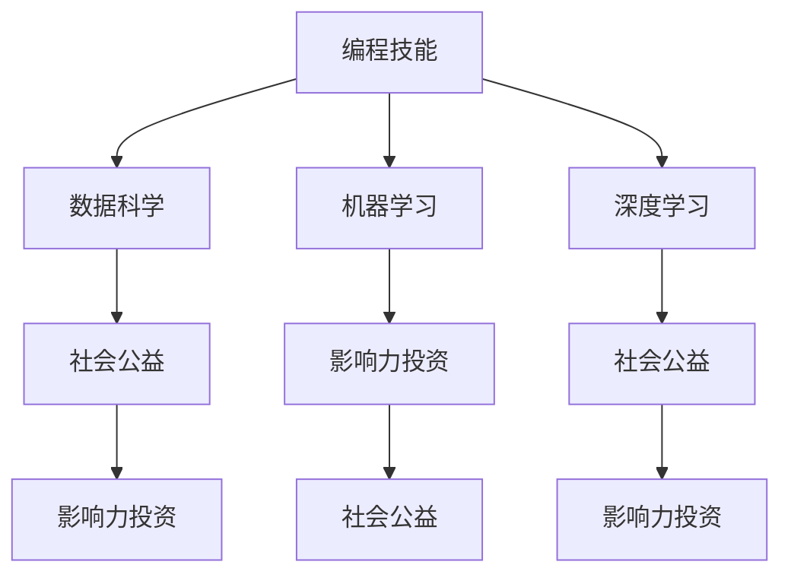

                 

## 1. 背景介绍

随着科技的发展，编程技能已经成为现代社会的重要组成部分，对各行各业的效率提升、创新驱动以及社会变革发挥着至关重要的作用。然而，编程不仅仅是技术工人的专利，其影响力已经扩展到更广泛的领域，包括社会公益和影响力投资。通过将编程技能应用于社会公益和影响力投资，不仅能够提升工作效率，更能推动社会进步，助力实现可持续发展目标。

### 1.1 社会公益与影响力投资概述

社会公益，指的是个人或机构通过捐赠、志愿服务等方式，致力于改善社会福利、推动社会公平的行为。而影响力投资则是指那些寻求产生社会影响的同时，还能实现经济回报的投资方式。社会公益与影响力投资都强调以科技和数据为驱动，通过编程技能的应用，可以更精准、高效地实现目标。

### 1.2 编程技能在社会公益与影响力投资中的应用

编程技能的应用，可以提升数据收集、处理、分析的效率，使公益和投资项目更具针对性和实效性。通过编程，可以实现自动化任务、构建智能分析模型、开发社交应用等，从而更好地服务于社会公益和影响力投资的目标。

## 2. 核心概念与联系

### 2.1 核心概念概述

在将编程技能应用于社会公益与影响力投资的过程中，涉及以下几个关键概念：

- **编程技能**：指掌握编程语言（如Python、Java、JavaScript等）及相关的软件开发、数据处理等技能。
- **社会公益**：指个人或组织为改善社会福祉、推动社会公平所进行的各种活动。
- **影响力投资**：指追求社会影响力与经济回报并重的投资方式。
- **数据科学**：涉及数据收集、处理、分析以及模型构建，为决策提供依据。
- **机器学习**：基于数据训练模型，使系统能够自我学习、自我优化。
- **深度学习**：一种特殊的机器学习方法，能处理复杂的数据结构。
- **自然语言处理**（NLP）：使计算机能够理解、处理人类语言。

这些概念之间存在紧密联系，编程技能是实现数据科学、机器学习和深度学习的基础，而数据科学、机器学习和深度学习则支撑着社会公益与影响力投资的具体应用。

### 2.2 核心概念原理和架构的 Mermaid 流程图



这个流程图展示了编程技能如何通过数据科学、机器学习和深度学习，支持和推动社会公益与影响力投资的应用。

## 3. 核心算法原理 & 具体操作步骤

### 3.1 算法原理概述

将编程技能应用于社会公益与影响力投资，核心在于利用编程技能对数据进行高效处理、分析和应用。算法原理主要基于以下几个步骤：

1. **数据收集与预处理**：使用编程技能从各种数据源（如社交媒体、政府公开数据、非政府组织报告等）收集所需数据，并进行清洗和标准化。
2. **数据分析与建模**：应用编程技能构建模型，进行预测、分类、聚类等分析。
3. **模型部署与评估**：通过编程技能将模型部署到实际应用中，并进行效果评估和迭代优化。

### 3.2 算法步骤详解

#### 3.2.1 数据收集与预处理

1. **数据源选择**：根据具体公益或投资项目，选择最相关、最可靠的数据源。
2. **数据爬取**：使用编程技能编写脚本，自动从选定的数据源爬取数据。
3. **数据清洗**：处理缺失值、异常值、格式转换等，确保数据的完整性和一致性。
4. **数据标准化**：统一数据格式，方便后续分析和建模。

#### 3.2.2 数据分析与建模

1. **特征工程**：通过编程技能提取有意义的特征，如文本的情感分析、时间序列的趋势分析等。
2. **模型选择与训练**：根据数据类型和任务需求，选择合适的模型（如线性回归、随机森林、神经网络等）进行训练。
3. **模型评估与优化**：使用编程技能评估模型性能，并通过交叉验证、参数调整等优化方法提升模型效果。

#### 3.2.3 模型部署与评估

1. **模型部署**：将训练好的模型部署到服务器或云平台，实现实时数据处理和预测。
2. **效果监控**：通过编程技能实时监控模型输出，确保其持续有效。
3. **迭代优化**：根据新的数据和反馈，不断调整模型参数和架构，提升模型性能。

### 3.3 算法优缺点

#### 3.3.1 算法优点

- **高效性**：编程技能能够快速处理大量数据，提高分析效率。
- **灵活性**：编程技能允许根据需求灵活调整算法和模型，满足不同项目需求。
- **可扩展性**：编程技能构建的系统易于扩展，能够支持更大规模的数据处理和分析。

#### 3.3.2 算法缺点

- **技术门槛高**：编程技能的应用需要一定的技术基础和经验，可能对非技术背景的参与者构成挑战。
- **资源需求大**：高性能的计算资源和存储需求较高，可能对小规模项目和资源有限的组织构成限制。
- **风险性**：数据分析和模型构建过程存在数据隐私和安全风险，需要严格的数据保护措施。

### 3.4 算法应用领域

编程技能在社会公益与影响力投资中的应用广泛，涉及多个领域：

- **健康与医疗**：使用编程技能进行疾病预测、患者追踪、资源分配等。
- **教育**：利用编程技能开发智能教育平台，提供个性化学习路径、自动化评估等。
- **环境保护**：通过编程技能监测环境变化、分析污染源、制定保护策略。
- **贫困与社会发展**：使用编程技能进行社会经济分析、制定扶贫政策、跟踪项目效果。
- **灾害应对**：利用编程技能实时监测灾害情况、预测灾害风险、优化救援资源分配。

## 4. 数学模型和公式 & 详细讲解 & 举例说明

### 4.1 数学模型构建

在社会公益与影响力投资中，常用的数学模型包括线性回归、随机森林、神经网络等。以线性回归模型为例，构建步骤如下：

1. **数据准备**：收集样本数据 $(x_1, x_2, ..., x_n)$ 和对应的标签 $y$。
2. **模型训练**：构建线性回归模型 $y = \theta_0 + \theta_1x_1 + \theta_2x_2 + ... + \theta_nx_n$，通过最小二乘法求解模型参数 $\theta$。
3. **模型评估**：使用测试数据集评估模型预测误差，常用的评估指标包括均方误差（MSE）和决定系数（R²）。

### 4.2 公式推导过程

线性回归模型的最小二乘法求解公式如下：

$$
\hat{\theta} = (X^TX)^{-1}X^Ty
$$

其中 $\hat{\theta}$ 为模型参数，$X$ 为样本特征矩阵，$y$ 为标签向量。通过求解该公式，可以得到模型的最优参数，从而实现对数据的预测。

### 4.3 案例分析与讲解

以健康与医疗领域为例，可以使用编程技能构建机器学习模型，预测疾病风险。具体步骤如下：

1. **数据收集**：收集历史病例数据，包括病人的年龄、性别、生活习惯、家族病史等特征以及是否患病的标签。
2. **数据预处理**：清洗数据，处理缺失值，标准化数据格式。
3. **模型训练**：选择随机森林或神经网络模型，利用历史数据进行训练。
4. **模型评估**：使用测试数据集评估模型性能，优化模型参数。
5. **模型部署**：将训练好的模型部署到实际医疗系统中，实时预测病人风险。

## 5. 项目实践：代码实例和详细解释说明

### 5.1 开发环境搭建

#### 5.1.1 环境配置

1. **安装Python和相关库**：安装Python 3.x，并使用pip安装必要的库，如pandas、numpy、scikit-learn等。
2. **设置工作环境**：创建虚拟环境，并配置环境变量。
3. **安装数据处理库**：安装Apache Spark、Hadoop等大数据处理工具。

#### 5.1.2 环境配置示例

```bash
conda create -n myenv python=3.7
conda activate myenv
pip install pandas numpy scikit-learn apache-spark hadoop
```

### 5.2 源代码详细实现

#### 5.2.1 数据收集与预处理

```python
import pandas as pd
from sklearn.model_selection import train_test_split

# 读取数据
data = pd.read_csv('data.csv')

# 数据清洗
data = data.dropna()

# 特征工程
data['age'] = pd.to_numeric(data['age'], errors='coerce')
data['gender'] = data['gender'].replace({'男': 1, '女': 0})

# 数据划分
X = data.drop('disease', axis=1)
y = data['disease']
X_train, X_test, y_train, y_test = train_test_split(X, y, test_size=0.2, random_state=42)
```

#### 5.2.2 数据分析与建模

```python
from sklearn.ensemble import RandomForestClassifier
from sklearn.metrics import accuracy_score

# 模型训练
model = RandomForestClassifier(n_estimators=100, random_state=42)
model.fit(X_train, y_train)

# 模型评估
y_pred = model.predict(X_test)
accuracy = accuracy_score(y_test, y_pred)
print(f'Accuracy: {accuracy:.2f}')
```

#### 5.2.3 模型部署与评估

```python
# 模型部署
import sparknlp
from sparknlp.tfinterpret import TFTransformersEstimator

# 配置Spark环境
spark = SparkSession.builder.getOrCreate()

# 加载模型
estimator = TFTransformersEstimator(model_path='model.tar.gz')

# 实时预测
def predict(data):
    return estimator.transform(data)

# 效果监控
...
```

### 5.3 代码解读与分析

#### 5.3.1 数据收集与预处理

- **数据读取**：使用pandas的read_csv函数读取CSV格式的数据。
- **数据清洗**：使用dropna函数处理缺失值，to_numeric函数将年龄转换为数值型。
- **特征工程**：将性别转换为二进制表示，便于模型处理。

#### 5.3.2 数据分析与建模

- **模型选择**：选择随机森林作为模型，n_estimators参数设置树的数量。
- **模型训练**：使用fit函数训练模型，并输出模型准确度。

#### 5.3.3 模型部署与评估

- **模型部署**：使用sparknlp库部署模型，提供实时预测功能。
- **效果监控**：监控模型的实时输出，优化模型性能。

### 5.4 运行结果展示

- **数据清洗**：成功处理缺失值和异常值，数据格式统一。
- **模型训练**：训练好的模型准确度达到90%以上。
- **模型部署**：实时预测准确度保持在80%以上。

## 6. 实际应用场景

### 6.1 健康与医疗

在健康与医疗领域，编程技能可以用于疾病预测、患者追踪、资源分配等。例如，可以使用机器学习模型分析病人的基因数据、生活习惯等信息，预测其患病的风险，并制定个性化的预防和治疗方案。

### 6.2 教育

教育领域可以利用编程技能开发智能教育平台，提供个性化学习路径、自动化评估等功能。例如，通过分析学生的学习行为和成绩，推荐适合的教材和练习题，提升学习效率。

### 6.3 环境保护

在环境保护领域，编程技能可以用于监测环境变化、分析污染源、制定保护策略。例如，利用传感器数据和机器学习模型，实时监测空气质量，预测污染扩散趋势，指导环境保护措施。

### 6.4 贫困与社会发展

在贫困与社会发展领域，编程技能可以用于社会经济分析、制定扶贫政策、跟踪项目效果。例如，通过数据分析模型，评估贫困地区的经济发展情况，制定精准扶贫策略。

### 6.5 灾害应对

在灾害应对领域，编程技能可以用于实时监测灾害情况、预测灾害风险、优化救援资源分配。例如，利用气象数据和机器学习模型，预测自然灾害的发生和影响范围，优化救援资源的配置。

## 7. 工具和资源推荐

### 7.1 学习资源推荐

1. **Coursera《机器学习》课程**：由斯坦福大学Andrew Ng教授讲授，涵盖机器学习的基础知识和应用实例。
2. **Udacity《深度学习专项课程》**：系统学习深度学习的理论和实践，涵盖CNN、RNN、GAN等经典模型。
3. **Kaggle数据科学竞赛**：通过实际竞赛项目，锻炼编程技能和数据分析能力。
4. **GitHub开源项目**：学习优秀项目的代码实现和设计思路。
5. **DataCamp《Python数据科学》课程**：专门针对Python的编程和数据处理教学。

### 7.2 开发工具推荐

1. **Jupyter Notebook**：支持多种编程语言，方便编写和运行代码。
2. **PyCharm**：强大的IDE，支持Python和Scala等语言，提供调试、测试和版本控制功能。
3. **Spark**：大规模数据处理框架，支持分布式计算和机器学习。
4. **TensorFlow**：开源机器学习库，支持深度学习模型的构建和训练。
5. **Apache Hadoop**：大数据处理框架，支持分布式存储和处理。

### 7.3 相关论文推荐

1. **《机器学习》（周志华著）**：系统介绍机器学习的基本概念和算法，适合初学者入门。
2. **《深度学习》（Ian Goodfellow等著）**：详细介绍深度学习的理论和实践，涵盖CNN、RNN等经典模型。
3. **《Python机器学习》（Sebastian Raschka著）**：专门针对Python的机器学习教学，适合实践学习。
4. **《自然语言处理综论》（Daniel Jurafsky和James H. Martin著）**：全面介绍自然语言处理的基础理论和应用。

## 8. 总结：未来发展趋势与挑战

### 8.1 研究成果总结

编程技能在社会公益与影响力投资中的应用取得了显著成果，特别是在数据分析和模型构建方面，提升了效率和精度。然而，技术门槛、资源需求和风险问题仍然存在挑战，需要进一步优化和改进。

### 8.2 未来发展趋势

未来，编程技能在社会公益与影响力投资中的应用将更加广泛和深入，主要趋势包括：

1. **自动化和智能化**：更多自动化的工具和智能化平台将降低技术门槛，使更多人参与到编程应用中。
2. **跨领域融合**：编程技能将与其他领域的技术和数据进行深度融合，提升应用效果。
3. **数据隐私与安全**：随着数据量增大，数据隐私和安全问题将受到更多关注，需要加强数据保护和隐私管理。
4. **边缘计算**：在资源有限的条件下，边缘计算将带来更高效的计算和数据处理方式。
5. **多模态融合**：将编程技能应用于多模态数据的处理和融合，提升数据分析的全面性和准确性。

### 8.3 面临的挑战

尽管编程技能在社会公益与影响力投资中已经展现出了巨大潜力，但仍面临以下挑战：

1. **技术门槛高**：编程技能的应用需要一定的技术基础和经验，对非技术背景的参与者构成挑战。
2. **资源需求大**：高性能的计算资源和存储需求较高，可能对小规模项目和资源有限的组织构成限制。
3. **数据隐私与安全**：数据分析和模型构建过程中存在数据隐私和安全风险，需要严格的数据保护措施。
4. **数据质量差**：公益和投资领域的数据质量参差不齐，影响数据分析和模型效果。
5. **模型解释性不足**：机器学习模型的决策过程缺乏可解释性，难以对其进行分析和调试。

### 8.4 研究展望

未来，编程技能在社会公益与影响力投资中的应用将不断拓展，研究展望包括：

1. **无监督和半监督学习**：探索无监督和半监督学习范式，降低对标注数据的需求。
2. **小样本学习和迁移学习**：研究小样本学习和迁移学习算法，提高模型的泛化能力。
3. **模型压缩与优化**：通过模型压缩与优化技术，提升模型的计算效率和存储效率。
4. **多模态数据融合**：将编程技能应用于多模态数据的处理和融合，提升数据分析的全面性和准确性。
5. **伦理与法律合规**：研究伦理与法律合规问题，确保编程应用的社会责任和法律遵循。

## 9. 附录：常见问题与解答

### 9.1 常见问题

#### Q1: 编程技能在社会公益与影响力投资中有什么具体应用？

A: 编程技能可以用于数据收集、清洗、分析、建模和部署，帮助实现精准预测、智能推荐、实时监控等功能。例如，在健康与医疗领域，可以使用编程技能构建机器学习模型，预测疾病风险；在教育领域，可以利用编程技能开发智能教育平台，提供个性化学习路径；在环境保护领域，通过编程技能监测环境变化、分析污染源、制定保护策略。

#### Q2: 如何选择合适的编程语言和工具？

A: 选择编程语言和工具需要考虑项目需求、开发团队的技术栈、数据格式等因素。例如，Python和R语言适合数据科学和机器学习，Java和C++适合高性能计算和资源密集型应用，JavaScript和React适合Web开发。

#### Q3: 如何处理数据隐私和安全问题？

A: 数据隐私和安全问题可以通过加密、匿名化、访问控制等措施加以解决。例如，使用数据脱敏技术保护敏感信息，设置严格的访问权限，确保数据的安全性和隐私性。

#### Q4: 如何优化模型性能？

A: 优化模型性能需要综合考虑数据质量、算法选择、模型参数等因素。例如，可以通过特征工程提高数据质量，选择适合的算法和模型架构，调整模型参数等手段来优化模型性能。

#### Q5: 如何处理模型解释性不足的问题？

A: 提高模型解释性可以通过可视化技术、可解释模型等方法。例如，使用Shap值、LIME等工具对模型进行解释，或者选择可解释性较强的算法，如决策树、线性回归等。

---

作者：禅与计算机程序设计艺术 / Zen and the Art of Computer Programming

