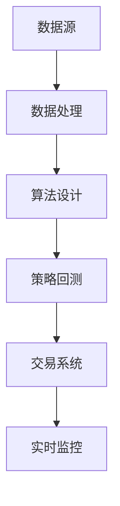

                 

## 1. 背景介绍

### 1.1 问题由来
量化交易（Quantitative Trading）是一种利用数学模型、计算机算法和大数据分析技术来进行金融交易的策略。它通过收集、分析金融市场的历史数据，发现市场趋势和模式，从而自动化地进行买卖决策，以期获取高额回报。量化交易已经成为现代金融市场的重要组成部分，广泛应用于股票、期货、外汇等金融资产的交易中。

编程技能在量化交易中扮演着至关重要的角色。从数据清洗、特征提取、模型训练、策略回测，到最终的执行和监控，每一步都离不开编程的支撑。掌握编程技能不仅能够提升量化交易的效率和精度，还能够带来更多的创新和灵活性。

### 1.2 问题核心关键点
量化交易中的编程技能主要体现在以下几个方面：

- **数据处理**：金融市场数据通常包含大量非结构化数据，如股票价格、交易量、新闻、公告等，需要通过编程对数据进行清洗、转换和提取。
- **算法设计**：量化交易的核心是算法设计，需要通过编程实现各种数学模型、统计方法、机器学习模型等，进行策略优化和回测验证。
- **系统构建**：量化交易需要搭建高性能的交易系统，包括数据流处理、策略执行、风险控制等模块，这些模块都需要通过编程实现。
- **模型验证**：量化策略的效果需要通过回测验证，这需要编写自动化脚本对历史数据进行模拟交易，并计算策略的性能指标。
- **实时监控**：实际交易过程中，需要对系统进行实时监控和维护，确保交易策略的稳定性和可靠性。

这些关键点共同构成了量化交易中的编程需求，使得编程技能在量化交易中不可或缺。

## 2. 核心概念与联系

### 2.1 核心概念概述

量化交易的核心概念包括以下几个方面：

- **数据源**：量化交易所需的数据通常来自金融市场的历史数据、新闻、公告等，可以通过编程从不同的数据源获取数据。
- **数据处理**：对数据进行清洗、转换、特征提取等预处理工作，以便后续的算法设计和模型训练。
- **算法设计**：量化交易的核心在于设计各种数学模型和统计方法，如回归模型、机器学习模型、强化学习模型等，用于预测市场趋势和进行策略优化。
- **策略回测**：通过编写自动化脚本，对历史数据进行模拟交易，验证策略的有效性和稳定性。
- **交易系统**：量化交易的执行和监控需要构建高性能的交易系统，包括数据流处理、策略执行、风险控制等模块。
- **实时监控**：实际交易过程中，需要对系统进行实时监控和维护，确保交易策略的稳定性和可靠性。

这些概念之间的联系可以通过以下Mermaid流程图来展示：



这个流程图展示了量化交易中编程技能的应用流程：从数据源获取数据，到数据处理、算法设计、策略回测、系统构建和实时监控，每一步都离不开编程的支持。

## 3. 核心算法原理 & 具体操作步骤

### 3.1 算法原理概述

量化交易的算法原理主要基于以下几个数学和统计模型：

- **回归分析**：利用线性或非线性回归模型，分析历史价格和交易量等数据，预测未来的价格趋势。
- **机器学习**：使用决策树、随机森林、支持向量机等算法，挖掘数据中的模式和规律，优化交易策略。
- **强化学习**：通过强化学习算法，使交易策略在实际交易环境中不断学习，适应市场的变化。
- **时间序列分析**：利用ARIMA、LSTM等模型，分析金融时间序列数据，预测未来的价格波动。

这些算法模型通过编程实现，并进行策略优化和回测验证，最终应用于实际交易中。

### 3.2 算法步骤详解

量化交易的算法步骤主要包括以下几个环节：

**Step 1: 数据获取与预处理**
- 编写数据获取脚本，从交易所、新闻网站、社交媒体等不同数据源获取历史数据和实时数据。
- 对数据进行清洗和预处理，去除噪声、填补缺失值、进行归一化等操作，以便后续的算法设计和模型训练。

**Step 2: 特征工程**
- 设计特征提取算法，从历史数据中提取有用的特征，如价格、交易量、动量、波动率等。
- 对特征进行编码和转换，使用工程手段提升模型的泛化能力。

**Step 3: 模型训练与优化**
- 使用回归分析、机器学习、强化学习等算法，训练和优化交易策略。
- 通过交叉验证、网格搜索等技术，选择最优的模型参数和特征组合。

**Step 4: 策略回测**
- 编写回测脚本，对历史数据进行模拟交易，评估策略的性能和稳定性。
- 使用回测工具包，计算策略的收益、风险、波动率等指标，进行可视化展示。

**Step 5: 系统构建与部署**
- 设计交易系统的架构，包括数据流处理、策略执行、风险控制等模块。
- 实现交易系统的各个组件，如订单生成、市场数据获取、交易监控等，并进行测试和优化。

**Step 6: 实时监控与维护**
- 开发实时监控系统，对交易系统的运行状态进行监控和维护，确保交易策略的稳定性和可靠性。
- 使用日志记录、异常检测等手段，及时发现和解决系统问题。

以上是量化交易中编程技能的应用流程，每一步都需要编程的支持，以实现高效、准确、可扩展的交易策略。

### 3.3 算法优缺点

量化交易中的编程技能具有以下优点：

- **高效性**：编程能够提升量化交易的效率，快速处理大量数据和计算任务。
- **灵活性**：编程能够带来更多的创新和灵活性，设计出不同的交易策略和算法模型。
- **可扩展性**：编程能够实现系统的高效扩展，适应不同规模和复杂度的交易需求。
- **可重用性**：编程能够实现代码的模块化，提升代码的复用性和维护性。

然而，量化交易中的编程技能也存在一些缺点：

- **高门槛**：需要掌握一定的编程技能和金融知识，对开发者有较高的要求。
- **复杂性**：量化交易算法和模型较为复杂，需要深入理解数学和统计知识。
- **风险性**：量化交易策略在实际市场中的表现存在不确定性，需要不断优化和验证。
- **资源消耗**：高性能的交易系统需要大量的计算资源，如CPU、内存和网络带宽。

尽管存在这些缺点，但编程技能在量化交易中的重要性不可忽视，是实现高效、灵活、可扩展的交易策略的关键。

### 3.4 算法应用领域

量化交易的编程技能主要应用于以下几个领域：

- **股票交易**：利用历史价格、交易量、财务报表等数据，设计量化交易策略。
- **期货交易**：通过期货市场的历史数据，预测价格波动，进行套利交易。
- **外汇交易**：利用外汇市场的历史数据，设计外汇交易策略，捕捉汇率变化机会。
- **债券交易**：利用债券市场的历史数据，设计量化交易策略，进行利率分析和套利。
- **商品交易**：利用商品市场的历史数据，设计量化交易策略，捕捉价格波动。

此外，量化交易的编程技能还可以应用于算法研究和教学、量化风险管理等方面，推动量化交易技术的不断进步和应用。

## 4. 数学模型和公式 & 详细讲解  
### 4.1 数学模型构建

量化交易中的数学模型主要基于以下几种算法：

- **线性回归**：线性回归模型可以表示为：$y = \beta_0 + \beta_1x_1 + \beta_2x_2 + \ldots + \beta_nx_n + \epsilon$，其中 $y$ 为目标变量，$x_i$ 为自变量，$\beta_i$ 为系数，$\epsilon$ 为误差项。

- **支持向量机**：支持向量机（SVM）是一种常见的分类算法，可以表示为：$\text{sign}(\sum_{i=1}^n \alpha_iy_i(x_i - x_0) + b) = 1$，其中 $y_i$ 为目标变量，$x_i$ 为输入变量，$\alpha_i$ 为权重系数，$x_0$ 为超平面，$b$ 为截距。

- **深度学习**：深度学习模型可以表示为：$y = f(x; \theta)$，其中 $y$ 为目标变量，$x$ 为输入变量，$f$ 为神经网络模型，$\theta$ 为模型参数。

这些模型通过编程实现，并进行策略优化和回测验证，最终应用于实际交易中。

### 4.2 公式推导过程

以下以线性回归模型为例，推导其公式的推导过程。

假设有一组历史数据 $(x_i, y_i)$，其中 $i = 1, 2, \ldots, N$。线性回归模型的目标是最小化误差平方和：

$$
\sum_{i=1}^N (y_i - f(x_i))^2
$$

其中 $f(x_i) = \beta_0 + \beta_1x_1 + \beta_2x_2 + \ldots + \beta_nx_n$。

为了求解最优的系数 $\beta_0, \beta_1, \ldots, \beta_n$，需要求偏导数并令其为0：

$$
\frac{\partial}{\partial \beta_j} \sum_{i=1}^N (y_i - f(x_i))^2 = 0, \quad j = 0, 1, 2, \ldots, n
$$

展开并整理上述等式，得到：

$$
\sum_{i=1}^N (y_i - f(x_i))x_{ij} = 0, \quad j = 0, 1, 2, \ldots, n
$$

其中 $x_{ij}$ 为 $x_i$ 的第 $j$ 个特征。

解上述线性方程组，得到最优的系数 $\beta_0, \beta_1, \ldots, \beta_n$，即可得到线性回归模型：

$$
y = \beta_0 + \beta_1x_1 + \beta_2x_2 + \ldots + \beta_nx_n
$$

以上是线性回归模型的公式推导过程，展示了量化交易中数学模型的基本构建方式。

### 4.3 案例分析与讲解

以下以股票交易中的趋势跟踪策略为例，分析量化交易中编程技能的实际应用。

假设有一组历史数据 $(x_i, y_i)$，其中 $i = 1, 2, \ldots, N$。定义 $x_i$ 为股票价格，$y_i$ 为买入或卖出信号。目标是设计一个基于线性回归的趋势跟踪策略，预测未来的股票价格变化，进行交易决策。

**Step 1: 数据预处理**

- 编写数据预处理脚本，获取历史数据，进行数据清洗、缺失值填补、归一化等操作。

**Step 2: 特征工程**

- 设计特征提取算法，从历史数据中提取有用的特征，如股票价格、交易量、动量、波动率等。
- 对特征进行编码和转换，使用工程手段提升模型的泛化能力。

**Step 3: 模型训练**

- 使用线性回归模型，训练和优化交易策略。
- 通过交叉验证、网格搜索等技术，选择最优的模型参数和特征组合。

**Step 4: 策略回测**

- 编写回测脚本，对历史数据进行模拟交易，评估策略的性能和稳定性。
- 使用回测工具包，计算策略的收益、风险、波动率等指标，进行可视化展示。

**Step 5: 系统构建**

- 设计交易系统的架构，包括数据流处理、策略执行、风险控制等模块。
- 实现交易系统的各个组件，如订单生成、市场数据获取、交易监控等，并进行测试和优化。

**Step 6: 实时监控**

- 开发实时监控系统，对交易系统的运行状态进行监控和维护，确保交易策略的稳定性和可靠性。
- 使用日志记录、异常检测等手段，及时发现和解决系统问题。

通过以上步骤，可以构建一个基于线性回归的趋势跟踪策略，实现高效、灵活、可扩展的股票交易。

## 5. 项目实践：代码实例和详细解释说明

### 5.1 开发环境搭建

在进行量化交易的编程实践前，我们需要准备好开发环境。以下是使用Python进行PyTorch开发的环境配置流程：

1. 安装Anaconda：从官网下载并安装Anaconda，用于创建独立的Python环境。

2. 创建并激活虚拟环境：
```bash
conda create -n quant-env python=3.8 
conda activate quant-env
```

3. 安装PyTorch：根据CUDA版本，从官网获取对应的安装命令。例如：
```bash
conda install pytorch torchvision torchaudio cudatoolkit=11.1 -c pytorch -c conda-forge
```

4. 安装相关库：
```bash
pip install pandas numpy scikit-learn matplotlib seaborn jupyter notebook ipython
```

完成上述步骤后，即可在`quant-env`环境中开始量化交易的编程实践。

### 5.2 源代码详细实现

下面我们以股票交易中的趋势跟踪策略为例，给出使用PyTorch实现的代码实现。

首先，定义数据预处理函数：

```python
import pandas as pd
import numpy as np
import matplotlib.pyplot as plt

def load_data(filename):
    data = pd.read_csv(filename)
    return data

def preprocess_data(data, window_size=20):
    data['return'] = data['close'].pct_change()
    data['momentum'] = data['return'].shift(window_size) + 1
    data['vol'] = data['volume'] / data['volume'].shift(window_size)
    return data

def plot_data(data):
    data[['return', 'momentum', 'vol']].plot(figsize=(10, 6))
    plt.xlabel('Time')
    plt.ylabel('Value')
    plt.title('Data Visualization')
    plt.show()

data = load_data('stock_data.csv')
preprocessed_data = preprocess_data(data)
plot_data(preprocessed_data)
```

然后，定义线性回归模型：

```python
import torch
from torch import nn

class LinearRegression(nn.Module):
    def __init__(self, input_size, output_size):
        super(LinearRegression, self).__init__()
        self.linear = nn.Linear(input_size, output_size)

    def forward(self, x):
        out = self.linear(x)
        return out

input_size = 3
output_size = 1
model = LinearRegression(input_size, output_size)
```

接着，定义优化器和损失函数：

```python
from torch import optimizer

criterion = nn.MSELoss()
optimizer = optimizer.Adam(model.parameters(), lr=0.01)
```

最后，编写训练和评估函数：

```python
def train(model, data, epochs, window_size):
    for epoch in range(epochs):
        total_loss = 0
        for i in range(len(data)-window_size):
            x = data.iloc[i:i+window_size, :]
            y = data.iloc[i+window_size, -1]
            inputs = torch.from_numpy(x.values).float()
            targets = torch.from_numpy(y.values).float()
            optimizer.zero_grad()
            output = model(inputs)
            loss = criterion(output, targets)
            loss.backward()
            optimizer.step()
            total_loss += loss.item()
        print(f'Epoch {epoch+1}, Loss: {total_loss/len(data)}')

def evaluate(model, data):
    return torch.tensor(data['return'][-1])
```

现在，我们可以启动训练流程并进行策略评估：

```python
window_size = 20
epochs = 100

preprocessed_data['return'] = preprocessed_data['return'].rolling(window_size).mean()
preprocessed_data['return'] = preprocessed_data['return'].shift(window_size) + 1
preprocessed_data['vol'] = preprocessed_data['vol'].rolling(window_size).mean()

train(model, preprocessed_data, epochs, window_size)
evaluate(model, preprocessed_data)
```

以上就是使用PyTorch进行量化交易的趋势跟踪策略实现的完整代码示例。可以看到，通过简单的代码，就可以构建并训练一个基于线性回归的交易策略，实现股票价格预测和交易决策。

### 5.3 代码解读与分析

让我们再详细解读一下关键代码的实现细节：

**load_data函数**：
- 定义了一个数据加载函数，用于从CSV文件中读取历史股票数据。
- 使用pandas库进行数据读取和处理，将数据转换为DataFrame格式。

**preprocess_data函数**：
- 定义了一个数据预处理函数，用于对历史数据进行归一化、移动平均等操作。
- 使用pandas库进行数据处理，计算股票价格的变化率、动量、成交量等指标。

**LinearRegression类**：
- 定义了一个线性回归模型类，继承自nn.Module。
- 在类中定义了线性层，用于进行输入到输出的映射。

**train函数**：
- 定义了一个训练函数，用于迭代训练线性回归模型。
- 使用Adam优化器和均方误差损失函数进行模型优化。
- 在每个epoch内，对数据进行逐批次处理，计算损失并更新模型参数。

**evaluate函数**：
- 定义了一个评估函数，用于计算线性回归模型的预测结果。
- 使用模型对历史数据进行预测，返回最后一个时间点的预测值。

**训练流程**：
- 首先对历史数据进行预处理，计算股票价格的变化率、动量、成交量等指标。
- 在训练函数中，对数据进行逐批次处理，计算损失并更新模型参数。
- 在每个epoch内，输出当前epoch的平均损失。
- 在评估函数中，计算模型对最后一个时间点的预测值。

通过以上步骤，可以构建并训练一个基于线性回归的交易策略，实现股票价格预测和交易决策。这个示例展示了量化交易中编程技能的实际应用，通过简单的代码，就可以实现一个基本的交易策略。

当然，工业级的系统实现还需考虑更多因素，如数据的持久化、模型的存储和加载、交易系统的扩展性等。但核心的交易策略实现基本与此类似。

## 6. 实际应用场景

### 6.1 股票交易

量化交易在股票交易中具有广泛的应用。股票市场的波动性较大，传统的基本面分析和技术分析方法可能难以应对市场变化。量化交易通过编程技能，构建高效的算法模型，实现自动化交易，可以更好地捕捉市场机会。

在实际应用中，量化交易策略可以应用于：

- **趋势跟踪**：利用线性回归、支持向量机等算法，识别市场趋势并执行交易策略。
- **动量策略**：根据动量指标进行交易，捕捉价格的波动性变化。
- **套利交易**：利用多个市场之间的价格差异进行套利，获取无风险收益。

### 6.2 期货交易

期货市场的价格波动较大，传统的交易方法难以应对市场的快速变化。量化交易通过编程技能，构建高效的算法模型，实现自动化交易，可以更好地捕捉市场机会。

在实际应用中，量化交易策略可以应用于：

- **基差套利**：利用期货价格和现货价格的价差进行套利。
- **期权定价**：利用期权定价模型，进行期权交易。
- **风险管理**：利用量化模型进行风险管理和对冲。

### 6.3 外汇交易

外汇市场的价格波动较大，传统的交易方法难以应对市场的快速变化。量化交易通过编程技能，构建高效的算法模型，实现自动化交易，可以更好地捕捉市场机会。

在实际应用中，量化交易策略可以应用于：

- **货币对交易**：利用货币对之间的汇率变化进行交易。
- **利率套利**：利用利率差异进行套利。
- **波动率交易**：利用外汇市场的价格波动进行交易。

### 6.4 未来应用展望

量化交易的编程技能在未来的应用中，将展现出更加广阔的前景。随着金融市场的发展和数据的不断积累，量化交易将变得更加高效、精确和灵活。以下是量化交易在未来的几个发展方向：

1. **多模态数据融合**：量化交易将更多地利用非结构化数据，如新闻、社交媒体等，进行多模态数据的融合分析。

2. **强化学习应用**：量化交易将引入强化学习算法，进行更加智能化的策略优化和回测验证。

3. **模型融合与优化**：量化交易将更多地使用模型融合与优化技术，提升模型的泛化能力和鲁棒性。

4. **自动化交易系统**：量化交易将构建更加自动化和智能化的交易系统，实现更高效的交易决策。

5. **机器学习算法优化**：量化交易将引入机器学习算法优化技术，提升算法的精度和效率。

6. **交易策略多样化**：量化交易将构建更加多样化的交易策略，适应不同的市场环境和应用场景。

7. **实时监控与自动化维护**：量化交易将构建更加实时监控和自动化维护的系统，确保交易策略的稳定性和可靠性。

8. **跨市场协同交易**：量化交易将实现跨市场的协同交易，提升交易策略的覆盖范围和应用效果。

通过以上发展方向，量化交易的编程技能将更加高效、精确和灵活，为金融市场带来更多的创新和价值。

## 7. 工具和资源推荐

### 7.1 学习资源推荐

为了帮助开发者系统掌握量化交易的理论基础和实践技巧，这里推荐一些优质的学习资源：

1. 《量化交易入门与实战》系列博文：由量化交易专家撰写，深入浅出地介绍了量化交易的基本概念和实现方法。

2. 《Python量化交易》书籍：系统介绍了如何使用Python进行量化交易，涵盖数据处理、算法设计、系统构建等多个环节。

3. 《量化交易策略》课程：由量化交易专家开设的在线课程，涵盖多种量化交易策略和算法，适合入门和进阶学习。

4. 量化交易社区：如CQuant、QuantStack等社区，汇聚了众多量化交易开发者和专家，交流经验和分享技术。

5. 量化交易论文：如《High-Frequency Trading: The Daily Double Cut》、《Algorithmic Trading: From Data Mining to Modeling》等，深入探讨量化交易的理论和实践。

通过对这些资源的学习实践，相信你一定能够快速掌握量化交易的精髓，并用于解决实际的金融问题。

### 7.2 开发工具推荐

高效的开发离不开优秀的工具支持。以下是几款用于量化交易开发的常用工具：

1. Python：作为量化交易的主流编程语言，Python拥有丰富的数据处理、算法设计和系统构建库，如Pandas、NumPy、Scikit-learn、TensorFlow等。

2. PyTorch：基于Python的深度学习框架，灵活高效，适合构建复杂的量化交易模型。

3. Jupyter Notebook：支持Python等编程语言的交互式开发，便于代码调试和可视化展示。

4. QuantLib：由QuantLib社区维护的量化交易库，涵盖多种金融产品和交易策略的建模和计算。

5. Alpaca、Interactive Brokers：提供API接口的量化交易平台，支持Python和多种编程语言，便于进行交易策略的测试和部署。

6. Oanda API：提供API接口的外汇交易平台，支持Python和多种编程语言，便于进行外汇交易策略的测试和部署。

合理利用这些工具，可以显著提升量化交易的开发效率，加快创新迭代的步伐。

### 7.3 相关论文推荐

量化交易的研究源于学界的持续研究。以下是几篇奠基性的相关论文，推荐阅读：

1. Algo-Trading Strategies: Theory, Implementation and Empirical Evaluation：介绍了多种量化交易策略和算法，包括回归模型、机器学习模型、强化学习模型等。

2. High-Frequency Trading: A Practical Guide to Algorithmic Strategies and Trading Systems：介绍了高频交易的理论和实践，涵盖多种量化交易策略和算法。

3. Algorithmic Trading: An Analytical Approach to the Financial Markets：深入探讨了量化交易的理论和实践，涵盖多种量化交易策略和算法。

4. Deep Learning for Algorithmic Trading：介绍了深度学习在量化交易中的应用，涵盖多种深度学习模型和算法。

5. Rebalancing Algorithms for Modern Portfolio Theory：介绍了现代组合理论中的资产配置和再平衡算法，适合量化交易策略的优化。

这些论文代表了大量化交易的研究方向，通过学习这些前沿成果，可以帮助研究者把握学科前进方向，激发更多的创新灵感。

## 8. 总结：未来发展趋势与挑战

### 8.1 总结

本文对量化交易中的编程技能进行了全面系统的介绍。首先阐述了量化交易中的编程技能主要体现在数据处理、算法设计、系统构建等多个环节，展示了其重要性。其次，从算法原理和具体操作步骤，详细讲解了量化交易的实现流程，给出了量化交易的完整代码实例。同时，本文还广泛探讨了量化交易在股票、期货、外汇等金融领域的应用前景，展示了编程技能在量化交易中的广泛应用。

通过本文的系统梳理，可以看到，编程技能在量化交易中不可或缺，是实现高效、灵活、可扩展的交易策略的关键。量化交易的编程技能不仅能够提升交易效率和精度，还能带来更多的创新和灵活性。相信随着技术的不断发展，量化交易的编程技能将更加高效、精确和灵活，为金融市场带来更多的创新和价值。

### 8.2 未来发展趋势

量化交易的编程技能在未来的应用中，将展现出更加广阔的前景。随着金融市场的发展和数据的不断积累，量化交易将变得更加高效、精确和灵活。以下是量化交易在未来的几个发展方向：

1. **多模态数据融合**：量化交易将更多地利用非结构化数据，如新闻、社交媒体等，进行多模态数据的融合分析。

2. **强化学习应用**：量化交易将引入强化学习算法，进行更加智能化的策略优化和回测验证。

3. **模型融合与优化**：量化交易将更多地使用模型融合与优化技术，提升模型的泛化能力和鲁棒性。

4. **自动化交易系统**：量化交易将构建更加自动化和智能化的交易系统，实现更高效的交易决策。

5. **机器学习算法优化**：量化交易将引入机器学习算法优化技术，提升算法的精度和效率。

6. **交易策略多样化**：量化交易将构建更加多样化的交易策略，适应不同的市场环境和应用场景。

7. **实时监控与自动化维护**：量化交易将构建更加实时监控和自动化维护的系统，确保交易策略的稳定性和可靠性。

8. **跨市场协同交易**：量化交易将实现跨市场的协同交易，提升交易策略的覆盖范围和应用效果。

通过以上发展方向，量化交易的编程技能将更加高效、精确和灵活，为金融市场带来更多的创新和价值。

### 8.3 面临的挑战

尽管量化交易中的编程技能具有广泛的应用前景，但在实际应用中也面临一些挑战：

1. **数据质量问题**：量化交易策略依赖于高质量的数据，数据缺失、噪声等问题会影响策略的准确性和稳定性。

2. **模型过拟合**：量化交易模型容易过拟合，特别是在训练数据较少的情况下，需要进行模型泛化能力的提升。

3. **市场风险**：量化交易策略面临市场风险，如市场极端波动、流动性风险等，需要进行风险管理和对冲。

4. **算法复杂性**：量化交易算法较为复杂，需要深入理解数学和统计知识，对开发者有较高的要求。

5. **资源消耗**：高性能的交易系统需要大量的计算资源，如CPU、内存和网络带宽，需要进行资源优化和扩展。

6. **系统稳定性**：量化交易系统需要高稳定性，确保在市场波动和网络故障情况下，能够持续运行和交易。

7. **模型鲁棒性**：量化交易模型需要具备较强的鲁棒性，适应市场环境和数据分布的变化。

8. **合规性**：量化交易策略需要符合法律法规，避免违法违规交易。

尽管存在这些挑战，但通过不断的研究和实践，量化交易的编程技能将不断进步，提升交易策略的精度和稳定性，带来更多的价值和创新。

### 8.4 研究展望

未来的量化交易研究需要在以下几个方面寻求新的突破：

1. **数据处理优化**：优化数据清洗、特征提取等预处理流程，提升数据质量和泛化能力。

2. **模型鲁棒性提升**：提升量化交易模型的鲁棒性，适应市场环境和数据分布的变化。

3. **交易系统扩展**：构建更加高效、灵活、可扩展的交易系统，提升交易效率和稳定性。

4. **风险管理优化**：优化量化交易的风险管理和对冲策略，确保系统的稳定性和可靠性。

5. **算法优化与创新**：引入新的算法和优化技术，提升量化交易的精度和效率。

6. **多模态数据融合**：利用多模态数据进行融合分析，提升量化交易策略的覆盖范围和应用效果。

7. **实时监控与自动化维护**：构建更加实时监控和自动化维护的系统，确保量化交易的稳定性和可靠性。

8. **模型解释性增强**：提升量化交易模型的解释性，确保算法的透明性和可解释性。

这些研究方向的探索，将引领量化交易技术的不断进步，推动量化交易策略的创新和应用。

## 9. 附录：常见问题与解答

**Q1：量化交易中的编程技能是否重要？**

A: 量化交易中的编程技能非常重要。从数据获取、数据预处理、模型设计到策略回测，每个环节都需要编程技能的支持。编程技能不仅能够提升交易效率和精度，还能带来更多的创新和灵活性。

**Q2：量化交易中如何选择合适的算法模型？**

A: 量化交易中应根据具体任务和数据特点选择合适的算法模型。常见的模型包括线性回归、支持向量机、决策树、随机森林、深度学习等。同时，通过回测验证和优化，选择最优的模型参数和特征组合。

**Q3：量化交易中如何避免模型过拟合？**

A: 量化交易中可以通过数据增强、正则化、模型融合等方法避免模型过拟合。数据增强可以扩充训练集，正则化可以抑制模型复杂度，模型融合可以提升泛化能力。

**Q4：量化交易中的数据质量问题如何解决？**

A: 量化交易中的数据质量问题可以通过数据清洗、缺失值填补、异常值检测等方法解决。同时，可以利用机器学习算法进行数据预处理，提升数据质量和泛化能力。

**Q5：量化交易中的系统稳定性问题如何解决？**

A: 量化交易中的系统稳定性问题可以通过异常检测、容错设计、日志记录等方法解决。同时，可以引入分布式系统、高可用架构等技术，确保系统的稳定性和可靠性。

通过以上问题与解答，可以看到，量化交易中的编程技能具有重要地位，通过合理的算法选择、数据预处理和系统构建，可以构建高效、灵活、可扩展的量化交易策略。

