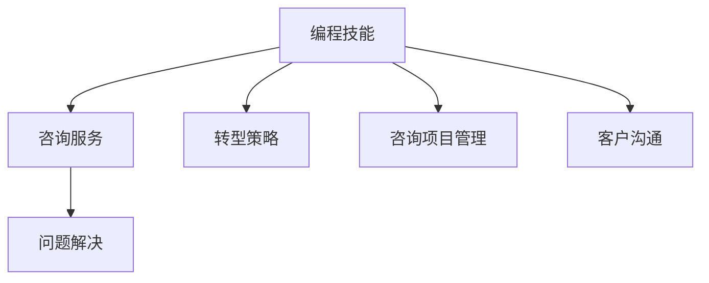

                 

# 如何将编程技能转化为咨询服务

在数字化转型的浪潮中，编程技能正成为一种关键的生产力。随着编程能力在各行各业中的应用日益广泛，将编程技能转化为咨询服务，已经成为许多技术专家转型的一个重要方向。本文将系统性地介绍如何将编程技能转化为咨询服务，涵盖核心概念、算法原理、具体操作步骤、数学模型、项目实践、应用场景、工具资源推荐、未来展望以及常见问题解答，以期为有意转型的技术专家提供全面的指导。

## 1. 背景介绍

### 1.1 问题由来
随着互联网和信息技术的发展，编程技能不再局限于软件开发领域，而是在越来越多的行业和场景中得到应用。例如，数据分析、网络安全、人工智能、物联网等新兴领域都对编程能力提出了高度需求。然而，尽管编程技能广泛适用，但许多技术专家仍感到在转型过程中缺乏方向和路径，不知道如何将技能转化为更具商业价值的咨询服务。

### 1.2 问题核心关键点
如何将编程技能转化为咨询服务，是当前技术专家转型的核心问题。关键在于理解咨询服务的本质，掌握转型的策略和路径，以及如何在实际工作中应用编程技能解决问题。核心关键点包括：

1. **理解咨询服务本质**：咨询服务的核心是解决问题，而不是仅仅开发软件。编程技能应被视为一种工具，帮助实现咨询目标。
2. **转型的策略和路径**：明确转型目标，选择合适的咨询方向和领域，制定详细的转型计划。
3. **应用编程技能解决问题**：在咨询项目中，将编程技能应用于数据处理、系统分析、算法设计、自动化流程等多个环节，以提高咨询效率和质量。

## 2. 核心概念与联系

### 2.1 核心概念概述

为更好地理解如何将编程技能转化为咨询服务，本节将介绍几个密切相关的核心概念：

- **编程技能**：包括编程语言、算法设计、系统架构、软件开发等技能。编程技能是技术专家转型的基础。
- **咨询服务**：指为解决客户问题而提供的专业建议和解决方案。咨询服务的本质是问题解决。
- **转型策略**：明确转型目标，选择合适的咨询方向和领域，制定详细的转型计划。
- **咨询项目管理**：涉及项目策划、需求分析、资源配置、风险管理等多个环节，是保证咨询项目成功的关键。
- **客户沟通**：与客户建立良好的沟通渠道，理解客户需求，是提供高质量咨询服务的保障。

这些核心概念之间的逻辑关系可以通过以下Mermaid流程图来展示：



这个流程图展示了这个过程中各概念之间的联系：

1. 编程技能是咨询服务的基础。
2. 转型策略指导选择合适的咨询方向。
3. 咨询项目管理确保项目顺利进行。
4. 客户沟通确保咨询服务符合客户需求。

## 3. 核心算法原理 & 具体操作步骤

### 3.1 算法原理概述

将编程技能转化为咨询服务，本质上是一个问题解决过程。其核心思想是：利用编程技能，通过系统分析、数据处理、算法设计等手段，提供针对客户具体问题的解决方案。

形式化地，假设客户的问题为 $P$，已掌握的编程技能为 $S$，咨询目标为 $T$，则转型的优化目标是找到最优的咨询方案 $C$，满足：

$$
C = \mathop{\arg\min}_{C} \mathcal{L}(P, S, T, C)
$$

其中 $\mathcal{L}$ 为咨询服务的损失函数，衡量咨询方案 $C$ 与客户问题 $P$ 的匹配度，以及与咨询目标 $T$ 的契合度。

### 3.2 算法步骤详解

将编程技能转化为咨询服务，一般包括以下几个关键步骤：

**Step 1: 理解客户需求**
- 与客户沟通，详细了解其业务背景、问题描述、期望目标等。
- 进行需求分析，明确客户的具体需求和核心问题。

**Step 2: 选择咨询方向**
- 根据客户需求，选择合适的咨询方向，如数据分析、系统架构、网络安全等。
- 确定咨询目标，明确解决问题的具体步骤和预期成果。

**Step 3: 制定转型计划**
- 制定详细的转型计划，包括任务分配、时间节点、资源配置等。
- 设定项目里程碑，确保项目按时完成。

**Step 4: 实施咨询方案**
- 根据转型计划，利用编程技能解决客户问题。
- 应用数据处理、算法设计、系统分析等技能，提供切实可行的解决方案。

**Step 5: 评估和反馈**
- 在咨询方案实施过程中，持续评估项目进展和成果。
- 与客户进行沟通，收集反馈意见，及时调整咨询方案。

### 3.3 算法优缺点

将编程技能转化为咨询服务的方法具有以下优点：

1. **高效解决问题**：利用编程技能可以快速处理复杂的数据和计算问题，提供高质量的咨询方案。
2. **广泛适用性**：编程技能在多个领域均有应用，能够提供综合性的解决方案。
3. **快速响应市场变化**：编程技能更新迅速，能够快速适应新兴技术和市场需求。

同时，该方法也存在一定的局限性：

1. **依赖编程技能**：技术专家在转型初期可能面临编程技能不足的问题，需要系统学习和培训。
2. **沟通难度**：客户可能难以理解编程语言和概念，需要进行解释和沟通。
3. **项目周期长**：复杂咨询项目需要较长的时间，项目周期可能较长。
4. **需求变化风险**：客户需求可能发生变化，需要及时调整咨询方案。

尽管存在这些局限性，但就目前而言，将编程技能转化为咨询服务的方法仍是技术专家转型的主流范式。未来相关研究的重点在于如何进一步提升转型的成功率和效率，减少沟通障碍，提高客户满意度。

### 3.4 算法应用领域

将编程技能转化为咨询服务的方法在多个领域均有应用，包括但不限于：

- **数据分析咨询**：利用编程技能进行数据清洗、分析、可视化等，提供数据驱动的决策支持。
- **系统架构咨询**：设计高效、可扩展、可维护的系统架构，优化现有系统。
- **网络安全咨询**：利用编程技能进行漏洞扫描、风险评估、防护策略设计等，保障系统安全。
- **人工智能咨询**：应用机器学习、深度学习等技术，提供智能解决方案，提升业务效率和竞争力。
- **物联网咨询**：设计智能物联网系统，实现设备互联和数据融合。

这些领域体现了编程技能在咨询服务中的广泛应用，展示了技术专家转型的多样化和灵活性。

## 4. 数学模型和公式 & 详细讲解 & 举例说明

### 4.1 数学模型构建

在咨询项目中，数学模型通常用于建模和预测，帮助客户理解和解决问题。以下是一个简单的数学模型构建示例：

假设客户面临的问题是需求预测，即需要根据历史数据预测未来的需求量。可以利用时间序列分析方法建立数学模型。记 $x_t$ 为第 $t$ 期的历史需求量，$\hat{x}_{t+1}$ 为第 $t+1$ 期的预测需求量。则可以使用ARIMA模型进行建模，其公式为：

$$
\hat{x}_{t+1} = \sum_{i=0}^{p} \alpha_i x_{t-i} + \sum_{j=1}^{d} \beta_j \Delta^j x_{t} + \gamma \Delta^d x_t + \epsilon_{t+1}
$$

其中 $\Delta$ 为差分算子，$p$ 为自回归项数，$d$ 为差分阶数，$\alpha_i$、$\beta_j$ 为模型系数，$\epsilon_{t+1}$ 为误差项。

### 4.2 公式推导过程

以下推导ARIMA模型的预测公式。

1. **数据预处理**：对原始数据进行差分，消除趋势和季节性，得到平稳时间序列 $y_t = \Delta^d x_t$。

2. **模型建立**：建立ARIMA模型：

   $$
   y_t = \sum_{i=0}^{p} \alpha_i y_{t-i} + \sum_{j=1}^{d} \beta_j \Delta^j y_{t} + \gamma \Delta^d y_t + \epsilon_{t}
   $$

3. **参数估计**：通过最小二乘法等方法估计模型参数 $\alpha_i$、$\beta_j$、$\gamma$。

4. **预测计算**：将待预测期的历史数据代入模型，计算预测结果。

### 4.3 案例分析与讲解

**案例：客户需求预测**

某电商平台希望通过编程技能提供需求预测咨询服务。具体步骤如下：

1. **理解需求**：与客户沟通，了解其业务背景和需求预测的具体要求。
2. **数据收集**：收集平台历史销售数据，包括时间、产品种类、销售量等。
3. **数据预处理**：对销售数据进行差分处理，消除趋势和季节性。
4. **模型建立**：建立ARIMA模型，使用历史数据训练模型参数。
5. **模型验证**：使用历史数据验证模型预测效果。
6. **预测计算**：根据模型和历史数据，预测未来的销售需求。
7. **结果展示**：将预测结果提供给客户，帮助其制定库存管理策略。

## 5. 项目实践：代码实例和详细解释说明

### 5.1 开发环境搭建

在进行咨询服务项目开发前，我们需要准备好开发环境。以下是使用Python进行数据分析项目开发的環境配置流程：

1. 安装Anaconda：从官网下载并安装Anaconda，用于创建独立的Python环境。

2. 创建并激活虚拟环境：
```bash
conda create -n pydata-env python=3.8 
conda activate pydata-env
```

3. 安装必要的工具包：
```bash
conda install pandas numpy matplotlib scikit-learn jupyter notebook
```

4. 安装Python环境管理工具：
```bash
conda install pip -c conda-forge
```

完成上述步骤后，即可在`pydata-env`环境中开始数据分析项目开发。

### 5.2 源代码详细实现

这里我们以需求预测项目为例，给出使用Python进行数据分析的代码实现。

```python
import pandas as pd
from statsmodels.tsa.arima_model import ARIMA
from sklearn.metrics import mean_squared_error

# 加载数据
data = pd.read_csv('sales_data.csv')

# 数据预处理
data['date'] = pd.to_datetime(data['date'])
data = data.set_index('date')

# 差分处理
diff_data = data.diff()

# 模型训练
model = ARIMA(diff_data, order=(5, 1, 0))
model_fit = model.fit()

# 预测
forecast = model_fit.forecast(steps=30)

# 评估
mae = mean_squared_error(diff_data[30:], forecast)
print(f'MAE: {mae:.2f}')
```

### 5.3 代码解读与分析

让我们再详细解读一下关键代码的实现细节：

**数据预处理**

- `to_datetime`方法：将日期字符串转换为Pandas的时间戳。
- `set_index`方法：将时间戳设置为DataFrame的索引。

**模型训练**

- `ARIMA`类：构建ARIMA模型。
- `fit`方法：训练模型。

**预测和评估**

- `forecast`方法：根据模型进行预测。
- `mean_squared_error`函数：计算预测误差的均方误差。

## 6. 实际应用场景

### 6.1 数据驱动的业务决策

在大数据时代，数据驱动的业务决策变得至关重要。利用编程技能进行数据分析，能够帮助企业从海量数据中提取有价值的信息，支持决策制定。

具体应用场景包括：

- **市场分析**：分析市场趋势，预测需求变化，制定市场策略。
- **客户行为分析**：通过数据分析，了解客户行为模式，优化客户体验。
- **产品优化**：分析产品性能和用户反馈，优化产品设计。

**案例：电商市场分析**

某电商公司希望利用编程技能进行市场分析，以指导其产品开发和营销策略。具体步骤如下：

1. **数据收集**：收集电商平台的销售数据、用户行为数据、市场竞争数据等。
2. **数据清洗**：清洗数据，去除异常值和噪声。
3. **数据分析**：利用编程技能进行数据分析，识别市场趋势和用户需求。
4. **可视化展示**：将分析结果通过图表形式展示，支持管理层决策。
5. **业务建议**：根据分析结果，提出市场拓展、产品优化、定价策略等建议。

### 6.2 系统优化和维护

企业信息系统在运行过程中，难免会遇到性能瓶颈、漏洞等问题。利用编程技能进行系统优化和维护，能够提高系统的稳定性和可靠性。

具体应用场景包括：

- **性能优化**：分析系统瓶颈，优化性能，提升用户体验。
- **安全加固**：识别和修复系统漏洞，提升系统安全性。
- **升级迁移**：在系统升级或迁移过程中，提供技术支持。

**案例：电商平台性能优化**

某电商平台在业务扩展过程中，系统性能逐渐下降，用户反馈投诉增多。公司希望利用编程技能进行系统优化。具体步骤如下：

1. **性能分析**：通过编程技能，分析系统性能瓶颈，定位问题源头。
2. **优化建议**：提出优化建议，如增加服务器资源、优化数据库查询、优化代码性能等。
3. **实施优化**：根据优化建议，实施系统优化措施。
4. **效果评估**：评估优化效果，确保系统性能提升。

### 6.3 数据驱动的产品设计

在产品设计过程中，数据分析能够提供用户需求、市场趋势等信息，帮助产品团队更好地理解用户需求，提升产品竞争力。

具体应用场景包括：

- **用户体验分析**：通过数据分析，了解用户行为和需求，优化用户体验。
- **产品迭代**：根据数据分析结果，指导产品迭代和改进。
- **市场趋势预测**：预测市场趋势，指导产品开发方向。

**案例：社交媒体产品设计**

某社交媒体公司希望利用编程技能进行产品设计。具体步骤如下：

1. **数据收集**：收集用户行为数据、社交互动数据、市场趋势数据等。
2. **数据分析**：利用编程技能进行数据分析，识别用户需求和市场趋势。
3. **设计改进**：根据数据分析结果，提出产品设计改进建议。
4. **迭代测试**：通过用户测试，验证设计改进效果，进一步优化产品。

## 7. 工具和资源推荐

### 7.1 学习资源推荐

为了帮助开发者系统掌握编程技能在咨询项目中的应用，这里推荐一些优质的学习资源：

1. **Python数据分析**：《Python数据分析与科学计算》一书，全面介绍了Python在数据分析、科学计算中的应用，适合初学者和进阶者。
2. **R语言**：《R语言实战》一书，介绍了R语言在数据分析、统计建模中的应用，适合数据分析领域的专业人士。
3. **SQL**：《SQL必知必会》一书，介绍了SQL语言的基本语法和应用场景，适合数据库管理领域的技术人员。
4. **业务分析工具**：Tableau、Power BI等工具，能够帮助数据分析师快速进行数据可视化，支持业务决策。
5. **在线课程**：Coursera、edX等平台提供的在线课程，涵盖了数据分析、数据科学、机器学习等多个领域的知识和技能。

通过对这些资源的学习实践，相信你一定能够快速掌握编程技能在咨询项目中的应用，提升咨询工作的效率和质量。

### 7.2 开发工具推荐

高效的开发离不开优秀的工具支持。以下是几款用于数据分析项目开发的常用工具：

1. **Jupyter Notebook**：免费的交互式编程环境，支持Python、R等多种语言，适合数据分析项目的实验和演示。
2. **PyCharm**：强大的IDE工具，支持Python、Java等多种语言，提供了丰富的开发工具和插件。
3. **RStudio**：基于R语言的IDE工具，支持代码编写、数据分析、可视化等多种功能。
4. **Git**：版本控制系统，支持多人协作开发，适合团队项目的管理。
5. **Docker**：容器化技术，支持将数据分析项目打包为容器，方便部署和迁移。

合理利用这些工具，可以显著提升数据分析项目的开发效率，加快创新迭代的步伐。

### 7.3 相关论文推荐

编程技能在咨询项目中的应用，涉及数据科学、系统优化、业务分析等多个领域。以下是几篇奠基性的相关论文，推荐阅读：

1. **数据科学方法论**：Tomas Petrich, Vlado Lutovac的《数据科学与数据分析》一书，全面介绍了数据科学方法论、数据分析工具和应用案例。
2. **系统优化技术**：Rakesh Krishnan等人的《系统架构设计》一书，介绍了系统架构设计、性能优化、安全加固等技术。
3. **业务分析工具**：John W. Foreman等人的《Tableau for Data Science and Business Analysis》一书，介绍了Tableau在数据分析和业务分析中的应用。

这些论文代表了大数据时代咨询项目的主要研究方向，通过学习这些前沿成果，可以帮助咨询师掌握最新的数据分析和业务分析技术，提升咨询工作的质量和效率。

## 8. 总结：未来发展趋势与挑战

### 8.1 总结

本文对将编程技能转化为咨询服务的方法进行了全面系统的介绍。首先阐述了咨询服务的本质、转型的策略和路径，以及如何将编程技能应用于咨询项目中。其次，从原理到实践，详细讲解了编程技能在咨询项目中的数学模型和操作步骤，给出了具体的代码实现。同时，本文还广泛探讨了编程技能在多个行业领域的应用前景，展示了转型的多样化和灵活性。最后，精选了学习资源和开发工具，力求为读者提供全方位的技术指引。

通过本文的系统梳理，可以看到，将编程技能转化为咨询服务的方法在多个领域均有应用，展示了技术专家转型的广泛前景。未来，伴随大数据、人工智能等技术的不断演进，编程技能在咨询项目中的应用将更加广泛和深入，为业务决策提供更强大的数据支持。

### 8.2 未来发展趋势

展望未来，编程技能在咨询项目中的应用将呈现以下几个发展趋势：

1. **数据驱动的咨询**：随着数据量的增加，数据分析在咨询项目中的重要性将进一步提升，数据驱动的咨询将成为主流。
2. **自动化咨询**：利用机器学习和自动化技术，提升咨询项目的工作效率和准确性。
3. **实时咨询**：通过大数据技术和云计算平台，提供实时数据分析和咨询服务，满足客户即时需求。
4. **跨领域咨询**：跨学科、跨领域的咨询项目将更加普遍，编程技能需要具备多领域知识融合能力。
5. **个性化咨询**：利用编程技能进行客户画像分析，提供个性化的咨询服务。

这些趋势展示了编程技能在咨询项目中的广泛应用，凸显了数据驱动、自动化、实时化、跨领域和个性化的发展方向。

### 8.3 面临的挑战

尽管编程技能在咨询项目中的应用已经取得显著成效，但在迈向更加智能化、普适化应用的过程中，它仍面临诸多挑战：

1. **数据质量和可靠性**：大数据时代，数据质量参差不齐，存在噪声和异常值，需要复杂的数据清洗和处理技术。
2. **模型选择与评估**：选择合适的数学模型和评估方法，确保模型的准确性和可靠性。
3. **技术迭代速度**：编程技能需要不断更新，以跟上新技术的发展，这对技术专家的学习能力和适应能力提出了更高要求。
4. **客户需求多样化**：客户需求不断变化，需要灵活调整咨询方案，提供定制化的服务。
5. **项目管理复杂性**：咨询项目通常涉及多学科、多部门协作，项目管理的复杂性增加。

尽管面临这些挑战，但通过不断学习和实践，技术专家仍可克服这些难题，提升咨询服务的专业水平和质量。

### 8.4 研究展望

面对编程技能在咨询项目中的挑战，未来的研究需要在以下几个方面寻求新的突破：

1. **数据质量提升**：开发更加高效的数据清洗和处理技术，提升数据质量。
2. **模型自动化**：开发自动化模型选择和评估工具，提升模型的灵活性和可靠性。
3. **技术生态建设**：建立开放的技术生态系统，促进跨领域、跨学科的交流与合作。
4. **咨询平台化**：将咨询项目模块化、平台化，提高咨询服务的可复用性和灵活性。
5. **个性化推荐**：利用编程技能进行客户画像分析，提供个性化的咨询服务。

这些研究方向将推动编程技能在咨询项目中的应用向更深层次发展，为解决复杂问题和提供高质量咨询服务提供新的方法。

## 9. 附录：常见问题与解答

**Q1：如何选择合适的咨询方向？**

A: 选择合适的咨询方向需要考虑以下几个因素：
1. **客户需求**：深入了解客户的具体需求，识别核心问题和挑战。
2. **自身能力**：评估自身的编程技能和知识储备，选择熟悉和擅长的领域。
3. **市场趋势**：关注行业发展趋势，选择具有潜力和发展前景的领域。

**Q2：如何降低数据分析中的噪声和异常值？**

A: 降低数据分析中的噪声和异常值，可以采用以下方法：
1. **数据清洗**：通过缺失值处理、去重、数据格式转换等方法，清理数据。
2. **异常值检测**：使用统计学方法或机器学习算法，识别并处理异常值。
3. **数据归一化**：对数据进行归一化处理，缩小数据范围。
4. **平滑处理**：使用移动平均、指数平滑等方法，平滑数据趋势。

**Q3：数据分析项目的时间管理策略有哪些？**

A: 数据分析项目的时间管理策略包括：
1. **任务分解**：将项目分解为多个子任务，明确每个子任务的时间节点和责任人。
2. **优先级排序**：根据任务的重要性和紧急程度，排序任务的优先级。
3. **资源配置**：合理配置人力、物力、财力等资源，确保项目顺利进行。
4. **进度跟踪**：定期跟踪项目进展，及时调整计划，确保项目按期完成。
5. **风险管理**：识别项目风险，制定风险应对策略，确保项目顺利进行。

**Q4：如何提高数据分析项目中的沟通效率？**

A: 提高数据分析项目中的沟通效率，可以采用以下方法：
1. **明确目标**：明确项目目标和任务，确保所有参与者理解项目要求。
2. **定期汇报**：定期汇报项目进展，及时沟通问题和解决方案。
3. **工具支持**：使用项目管理工具，如JIRA、Trello等，支持任务分配和进度跟踪。
4. **文档化**：将项目文档化，便于查阅和参考。
5. **及时反馈**：及时反馈项目进展和问题，确保沟通及时、高效。

---

作者：禅与计算机程序设计艺术 / Zen and the Art of Computer Programming

