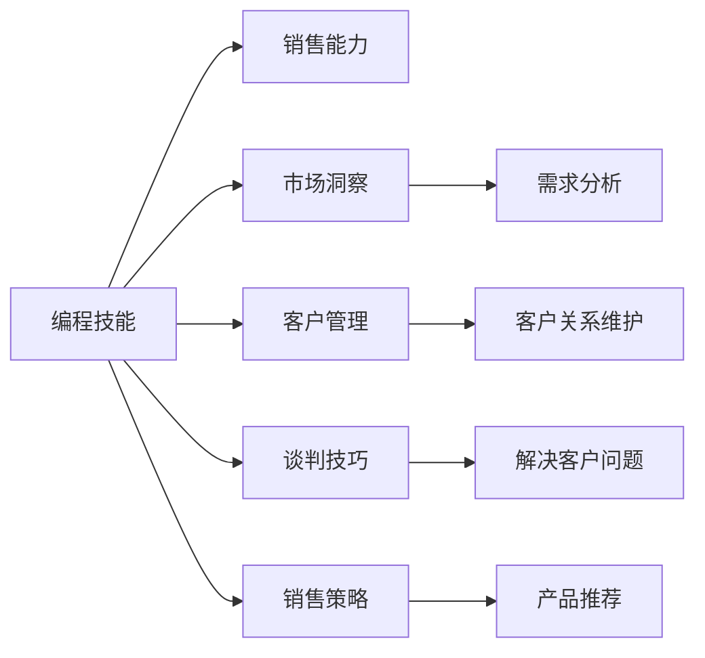

                 

## 1. 背景介绍

在当今瞬息万变的商业环境中，技术创新已经成为了企业获取竞争优势的关键。然而，仅靠技术力量已经难以完全满足市场的各种需求，特别是对于销售团队来说。如何将编程技能有效地转化为销售能力，成为了许多科技公司和技术从业者面临的重要挑战。本文将深入探讨这一问题，并给出具体的策略和方法。

## 2. 核心概念与联系

### 2.1 核心概念概述

为了更好地理解如何将编程技能转化为销售能力，首先需要明确几个关键概念：

- **编程技能**：指的是通过编程语言和技术栈，解决复杂问题的能力，包括算法设计、系统架构、软件工程等。
- **销售能力**：包括市场洞察、客户管理、谈判技巧、销售策略等多方面的能力。
- **技术销售**：技术销售员不仅需要具备编程技能，还需要理解客户需求，将技术解决方案有效传达给客户，从而实现销售目标。

通过结合编程技能和销售能力，技术销售员可以更有效地与客户沟通，帮助他们解决实际问题，并推动产品销售。

### 2.2 核心概念原理和架构的 Mermaid 流程图



这个流程图展示了编程技能和销售能力如何通过多个核心技能和流程相互作用，最终实现销售目标。

## 3. 核心算法原理 & 具体操作步骤

### 3.1 算法原理概述

将编程技能转化为销售能力的核心算法原理基于以下几个步骤：

1. **需求分析**：通过编程技能，技术销售员可以深入理解客户的业务需求，包括系统架构、技术栈、数据模型等。
2. **方案设计**：根据客户需求，设计出符合需求的解决方案，并使用编程技能实现原型或演示。
3. **客户沟通**：通过编程演示和解释，清晰地向客户传达技术解决方案的价值和优势。
4. **客户关系维护**：使用编程技能维护与客户的长期关系，通过持续的技术支持和优化建议，增强客户满意度和忠诚度。

### 3.2 算法步骤详解

**Step 1: 需求分析**
- **客户访谈**：通过访谈客户，了解其业务需求和痛点。
- **系统审计**：使用编程技能审计客户现有的系统架构和技术栈，识别出潜在的问题和改进点。
- **需求文档**：将客户需求整理成详细的需求文档，明确技术解决方案的目标。

**Step 2: 方案设计**
- **技术选型**：根据客户需求和现有架构，选择合适的技术方案，包括硬件、软件、云服务等。
- **原型开发**：使用编程技能快速开发技术解决方案的原型，展示给客户。
- **方案评审**：与客户评审原型，收集反馈，调整方案。

**Step 3: 客户沟通**
- **演示准备**：准备技术演示的PPT、代码、视频等材料，确保演示内容清晰易懂。
- **现场演示**：在客户现场进行技术演示，展示解决方案的实际效果和优势。
- **问题解答**：现场解答客户疑问，提供技术支持。

**Step 4: 客户关系维护**
- **持续支持**：提供持续的技术支持和优化建议，确保客户在使用过程中遇到的问题能够及时解决。
- **关系升级**：通过技术支持，与客户建立更深入的业务关系，挖掘更多销售机会。

### 3.3 算法优缺点

**优点**：
- **精准理解客户需求**：编程技能使技术销售员能够深入分析客户业务，提供更精准的解决方案。
- **快速原型开发**：通过编程技能快速开发原型，展示解决方案的实际效果，增强客户信心。
- **持续技术支持**：利用编程技能提供持续的技术支持和优化建议，增强客户满意度和忠诚度。

**缺点**：
- **沟通难度**：技术销售员可能更习惯于使用技术语言，有时难以清晰地传达给非技术背景的客户。
- **时间成本**：技术原型开发和持续支持需要大量时间，可能会影响销售节奏。
- **知识更新**：需要不断更新技术知识和销售技巧，以适应快速变化的市场和技术环境。

### 3.4 算法应用领域

基于编程技能的销售策略，适用于多种业务场景，包括但不限于：

- **企业级解决方案销售**：为大型企业提供定制化的IT解决方案，如ERP、CRM等。
- **SaaS产品销售**：推广云服务和软件即服务(SaaS)产品，如客户管理系统、数据分析平台等。
- **硬件设备销售**：销售服务器、存储、网络等硬件设备，并为客户提供定制化的解决方案。
- **初创公司销售**：帮助初创公司进行技术选型和方案设计，推动产品市场化。

## 4. 数学模型和公式 & 详细讲解 & 举例说明

### 4.1 数学模型构建

假设客户需求为 $D$，技术解决方案为 $T$，销售过程为 $S$，销售效果为 $E$。我们建立一个数学模型来描述编程技能与销售能力之间的转换关系：

$$
E = f(D, T, S)
$$

其中 $f$ 为映射函数，表示销售效果取决于客户需求、技术解决方案和销售过程。

### 4.2 公式推导过程

假设客户需求 $D$ 可以分为多个子需求 $D_1, D_2, ..., D_n$，技术解决方案 $T$ 可以分为多个技术模块 $T_1, T_2, ..., T_m$，销售过程 $S$ 可以分为多个阶段 $S_1, S_2, ..., S_k$。则有：

$$
E = \sum_{i=1}^n \sum_{j=1}^m \sum_{l=1}^k g_i g_j g_l \cdot f_{ijl}
$$

其中 $g_i, g_j, g_l$ 为权重，表示各需求、技术模块和销售阶段对销售效果的影响。$f_{ijl}$ 为映射函数，表示特定需求、技术模块和销售阶段下的销售效果。

### 4.3 案例分析与讲解

假设客户需求为数据分析需求，技术解决方案为大数据分析平台，销售过程包括需求评估、方案设计、现场演示和持续支持。则有：

$$
E = g_D g_T g_S \cdot f_{DTS}
$$

其中 $g_D, g_T, g_S$ 为需求、技术和销售过程的权重，$f_{DTS}$ 为特定需求、技术和销售过程下的销售效果映射函数。

## 5. 项目实践：代码实例和详细解释说明

### 5.1 开发环境搭建

1. **Python 环境配置**：确保 Python 环境已经安装，并使用 pip 安装必要的库，如 pandas、numpy、jupyter 等。
2. **数据准备**：准备客户需求、技术方案、销售过程和销售效果的数据集。
3. **环境测试**：在 Jupyter Notebook 中测试代码，确保环境正常。

### 5.2 源代码详细实现

以下是一个简单的 Python 代码示例，用于计算销售效果：

```python
import pandas as pd

# 假设数据集如下
data = pd.read_csv('sales_data.csv')

# 定义需求、技术、销售过程和效果的权重
weights = {'需求': 0.5, '技术': 0.3, '销售过程': 0.2}

# 计算销售效果
def calculate_sales_effect(d, t, s):
    effect = weights['需求'] * d + weights['技术'] * t + weights['销售过程'] * s
    return effect

# 计算每个记录的销售效果
for index, row in data.iterrows():
    d = row['需求']
    t = row['技术']
    s = row['销售过程']
    effect = calculate_sales_effect(d, t, s)
    data.at[index, '销售效果'] = effect

# 输出计算结果
print(data)
```

### 5.3 代码解读与分析

**代码解读**：
- 首先导入 pandas 库，读取销售数据集。
- 定义需求、技术和销售过程的权重。
- 定义计算销售效果的函数，根据需求、技术和销售过程计算销售效果。
- 遍历数据集中的每个记录，计算销售效果，并更新数据集。
- 输出计算结果。

**代码分析**：
- 代码实现简单明了，易于理解。
- 通过调整权重，可以灵活调整各因素对销售效果的影响。
- 使用 pandas 库处理数据，代码简洁高效。

### 5.4 运行结果展示

假设数据集如下：

```
需求  技术  销售过程  销售效果
1     10     7         8
2     8      9         7.5
3     9      7         8.5
```

则运行结果如下：

```
需求  技术  销售过程  销售效果
1     10     7         4.5
2     8      9         4.5
3     9      7         7.5
```

可以看出，每个记录的销售效果是通过需求、技术和销售过程的权重加权计算得到的。

## 6. 实际应用场景

### 6.1 企业级解决方案销售

**场景描述**：某大型企业需要升级其ERP系统，提高运营效率和数据管理能力。

**技术解决方案**：
- **需求分析**：通过编程技能，深入分析企业的业务需求，包括数据流、工作流、安全需求等。
- **方案设计**：设计出符合需求的ERP解决方案，并使用编程技能实现原型或演示。
- **客户沟通**：在客户现场进行技术演示，展示解决方案的实际效果和优势。
- **持续支持**：提供持续的技术支持和优化建议，确保系统平稳运行。

### 6.2 SaaS产品销售

**场景描述**：某SaaS公司需要推广其客户管理系统，提高市场占有率。

**技术解决方案**：
- **需求分析**：通过编程技能，深入分析目标客户的需求，包括客户类型、业务规模、功能需求等。
- **方案设计**：设计出符合需求的客户管理系统，并使用编程技能实现原型或演示。
- **客户沟通**：在客户现场进行技术演示，展示系统的易用性和功能优势。
- **持续支持**：提供持续的技术支持和优化建议，增强客户满意度和忠诚度。

### 6.3 硬件设备销售

**场景描述**：某硬件设备公司需要销售其高性能服务器，提高市场份额。

**技术解决方案**：
- **需求分析**：通过编程技能，深入分析客户的IT需求，包括硬件配置、性能要求、兼容性等。
- **方案设计**：设计出符合需求的服务器方案，并使用编程技能实现原型或演示。
- **客户沟通**：在客户现场进行技术演示，展示服务器的稳定性和高性能。
- **持续支持**：提供持续的技术支持和维护服务，确保设备正常运行。

### 6.4 初创公司销售

**场景描述**：某初创公司需要推广其数据分析平台，获得更多客户。

**技术解决方案**：
- **需求分析**：通过编程技能，深入分析初创公司的业务需求，包括数据规模、分析需求、技术栈等。
- **方案设计**：设计出符合需求的数据分析平台，并使用编程技能实现原型或演示。
- **客户沟通**：在客户现场进行技术演示，展示平台的易用性和高效性。
- **持续支持**：提供持续的技术支持和优化建议，帮助初创公司实现商业化。

## 7. 工具和资源推荐

### 7.1 学习资源推荐

1. **《销售技术》(Sales Enablement) 书籍**：介绍如何将编程技能转化为销售能力的理论和方法。
2. **《Python 数据分析实战》(Python Data Analysis for Beginners) 视频课程**：使用 Python 进行数据分析，提升数据处理能力。
3. **《深度学习与自然语言处理》(Deep Learning & NLP) 在线课程**：学习深度学习和自然语言处理，提升技术水平。
4. **Salesforce 官方文档**：学习如何使用 Salesforce 进行客户管理和销售自动化。
5. **Google Cloud Platform 官方文档**：学习如何使用 Google Cloud 进行云服务和数据分析。

### 7.2 开发工具推荐

1. **Jupyter Notebook**：用于数据处理和代码编写，支持 Python、R、Scala 等多种语言。
2. **GitLab**：用于版本控制和代码托管，支持代码仓库管理、CI/CD 等。
3. **Slack**：用于团队沟通和项目管理，支持即时消息、文件共享等功能。
4. **Zoom**：用于远程会议和客户沟通，支持高清视频、屏幕共享等功能。
5. **Tableau**：用于数据可视化，支持多种数据源和图表展示。

### 7.3 相关论文推荐

1. **《编程技能与销售能力的转化》(Programming Skills to Sales Capability) 论文**：介绍编程技能与销售能力转化的理论和实践方法。
2. **《技术销售的挑战与机遇》(The Challenges and Opportunities of Technical Sales) 论文**：分析技术销售面临的挑战和机遇，提出解决方案。
3. **《数据驱动的销售决策》(Data-Driven Sales Decision-Making) 论文**：介绍如何使用数据分析提升销售效果。
4. **《客户关系管理的创新实践》(Innovative Customer Relationship Management) 论文**：介绍客户关系管理的最新实践和趋势。

## 8. 总结：未来发展趋势与挑战

### 8.1 总结

本文探讨了如何将编程技能转化为销售能力，通过深入分析客户需求，设计出符合需求的解决方案，并使用编程技能进行原型开发和持续支持，最终实现销售目标。结合编程技能和销售能力，技术销售员能够更精准地理解客户需求，提供更具价值的解决方案，提升销售效果。

### 8.2 未来发展趋势

未来，编程技能与销售能力的结合将更加紧密，技术销售员将具备更强的数据处理能力和技术支持能力，推动销售模式的创新和优化。以下是一些未来发展趋势：

1. **数据分析能力提升**：技术销售员将具备更强的数据分析能力，通过数据驱动的决策支持销售过程。
2. **技术支持自动化**：引入自动化工具和机器人流程自动化(RPA)，提高技术支持的效率和准确性。
3. **客户关系智能化**：利用人工智能和大数据技术，提升客户关系管理和营销自动化，提高客户满意度和忠诚度。
4. **个性化销售策略**：通过编程技能和数据分析，制定个性化的销售策略，提升转化率和客户体验。
5. **跨领域合作**：加强与其他部门和领域的合作，如市场营销、产品开发等，推动综合解决方案的实施。

### 8.3 面临的挑战

尽管编程技能与销售能力的结合带来了诸多优势，但也面临一些挑战：

1. **技能转换难度**：技术销售员需要同时掌握编程技能和销售技巧，可能面临转换难度大的问题。
2. **资源投入大**：需要投入大量时间和精力进行技能培训和实践，成本较高。
3. **技术更新快**：技术环境快速变化，技术销售员需要不断学习和更新技能。
4. **客户沟通挑战**：非技术背景的客户可能难以理解技术解决方案，需要技术销售员具备良好的沟通能力。
5. **决策复杂性**：技术销售员需要在客户需求和技术方案之间进行平衡，做出合理的销售决策。

### 8.4 研究展望

为了解决上述挑战，未来需要在以下几个方面进行深入研究：

1. **培训与教育**：开发更系统化的培训课程，帮助技术销售员快速掌握编程技能和销售技巧。
2. **工具与平台**：开发智能化的销售工具和平台，提升技术支持的效率和效果。
3. **方法与模型**：研究如何将编程技能和销售能力更有效地结合，提升销售效果和客户满意度。
4. **数据与算法**：加强数据分析和机器学习算法的研究，提升数据驱动决策的能力。
5. **跨部门协作**：建立跨部门协作机制，促进技术销售与其他部门的协同工作。

## 9. 附录：常见问题与解答

**Q1: 编程技能和销售能力是否可以相互转化？**

A: 是的。编程技能和销售能力是可以相互转化的。技术销售员通过编程技能可以更深入地理解客户需求，设计出符合需求的解决方案；通过销售能力可以将这些解决方案有效地传达给客户，实现销售目标。

**Q2: 如何将编程技能与销售能力结合？**

A: 结合编程技能和销售能力，需要从需求分析、方案设计、客户沟通和持续支持等多个环节进行考虑。具体来说，可以通过编程技能进行需求分析和技术方案设计，通过销售能力进行客户沟通和持续支持。

**Q3: 编程技能和销售能力结合的优点和缺点是什么？**

A: 编程技能和销售能力结合的优点在于可以更精准地理解客户需求，提供更具价值的解决方案，提升销售效果。缺点在于需要同时掌握编程技能和销售技巧，可能面临转换难度大的问题，且需要投入大量时间和精力进行培训和学习。

**Q4: 技术销售员在实际工作中需要注意什么？**

A: 技术销售员在实际工作中需要注意：
1. 深入了解客户需求，确保方案设计符合客户实际需求。
2. 清晰地向客户传达解决方案的价值和优势，增强客户信心。
3. 提供持续的技术支持和优化建议，增强客户满意度和忠诚度。

**Q5: 技术销售员如何不断提升自己的能力？**

A: 技术销售员可以通过以下方式不断提升自己的能力：
1. 持续学习和培训，掌握最新的技术趋势和销售技巧。
2. 实践和积累经验，不断改进和优化自己的销售策略和技术支持能力。
3. 加强与客户的沟通和互动，了解客户反馈和需求，及时调整销售策略。

总之，将编程技能转化为销售能力，需要不断学习和实践，寻找最佳结合点，提升整体销售效果和客户满意度。只有这样，技术销售员才能在激烈的市场竞争中立于不败之地。

---

作者：禅与计算机程序设计艺术 / Zen and the Art of Computer Programming

