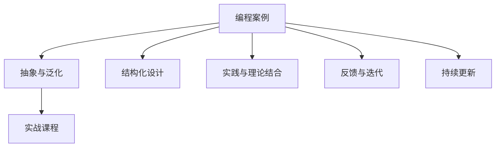

                 

# 如何将编程案例转化为付费实战课程

## 1. 背景介绍

### 1.1 问题由来

在IT领域，编程案例是一种常见的教学资源，有助于初学者理解编程概念和技能。然而，这些案例往往只适用于特定情境，难以扩展到实际开发工作。如何将这些有价值的编程案例转化为可操作、可复用的实战课程，是当前IT教育领域的一个重要挑战。

### 1.2 问题核心关键点

将编程案例转化为实战课程的核心在于：

1. **抽象与泛化**：将案例中的具体问题抽象为通用问题，确保课程内容具有广泛的适用性。
2. **结构化设计**：确保课程结构清晰，内容连贯，学生能够逐步掌握技能。
3. **实践与理论结合**：课程内容不仅包含理论知识，还要有实际操作的练习和项目，提升学生的动手能力。
4. **反馈与迭代**：课程设计应包含反馈机制，及时纠正学生的错误，帮助其不断进步。
5. **持续更新**：IT领域日新月异，课程内容需定期更新，保持最新技术和方法的引入。

### 1.3 问题研究意义

将编程案例转化为实战课程，对于提升学生实践能力和解决实际问题的能力具有重要意义：

1. **提高实践能力**：通过实战课程，学生能够在真实项目中应用所学知识，提升解决问题的能力。
2. **促进知识迁移**：课程内容高度泛化，学生可以将所学技能应用于不同项目中。
3. **增强就业竞争力**：实战经验对于求职者而言至关重要，通过实战课程，学生可以更好地准备进入职场。
4. **推动教育创新**：高质量的实战课程可以成为教育机构的重要教学资源，促进教育水平的提升。

## 2. 核心概念与联系

### 2.1 核心概念概述

- **编程案例**：指在特定编程语言和框架下，解决具体问题的代码示例。
- **实战课程**：指围绕某个核心技术或项目，包含理论讲解、实践操作和项目实践的课程体系。
- **抽象与泛化**：将具体问题转化为更通用的问题，使课程内容具有广泛适用性。
- **结构化设计**：课程内容应具有逻辑性和连贯性，帮助学生逐步掌握技能。
- **实践与理论结合**：课程中不仅有理论知识，还应包含实际操作的练习和项目。
- **反馈与迭代**：课程设计应包含反馈机制，帮助学生不断改进。
- **持续更新**：课程内容需定期更新，以适应技术发展的变化。

这些核心概念之间相互联系，共同构成了将编程案例转化为实战课程的理论基础和方法论。

### 2.2 核心概念原理和架构的 Mermaid 流程图



这个流程图展示了编程案例转化为实战课程的核心流程：

1. **抽象与泛化**：将具体案例抽象为通用问题。
2. **结构化设计**：设计清晰的课程结构。
3. **实践与理论结合**：结合理论知识进行实践操作。
4. **反馈与迭代**：在实践过程中不断反馈和改进。
5. **持续更新**：课程内容定期更新以适应技术变化。

## 3. 核心算法原理 & 具体操作步骤

### 3.1 算法原理概述

将编程案例转化为实战课程的核心算法原理可以概括为以下三点：

1. **案例抽象与泛化**：将具体案例抽象为更通用的问题，使课程内容具有广泛适用性。
2. **结构化课程设计**：设计清晰的课程结构和内容流程，确保学生能够系统地掌握技能。
3. **实践与反馈结合**：通过实践操作和即时反馈，帮助学生在实际操作中不断改进和进步。

### 3.2 算法步骤详解

**Step 1: 案例分析与抽象**

对编程案例进行分析，将其分解为多个子问题，并将这些子问题抽象为更通用的问题。例如，一个简单的Web应用案例可以抽象为如何构建一个具有路由和模板引擎的Web框架。

**Step 2: 课程结构设计**

根据抽象后的通用问题，设计课程结构。一般包括以下几个部分：

1. **引言**：介绍课程目标和背景。
2. **理论讲解**：讲解相关理论知识，如编程语言、框架、算法等。
3. **实践练习**：设计具体的编程练习，让学生进行实际操作。
4. **项目实践**：引导学生完成一个完整的项目，应用所学知识。
5. **总结与反馈**：总结课程内容，提供即时反馈和改进建议。

**Step 3: 课程内容填充**

填充课程结构中的各个部分，确保内容连贯、逻辑清晰。例如，在Web应用案例中，可以包括HTML/CSS、JavaScript、Node.js、Express框架等理论讲解，以及具体的练习如编写路由、创建模板、设计数据库结构等。

**Step 4: 实践与反馈结合**

设计具体的实践操作，并在实践中提供即时反馈。例如，在Web应用案例中，可以让学生实现一个简单的登录页面，并提供即时反馈，帮助其改进代码和设计。

**Step 5: 持续更新与迭代**

定期更新课程内容，以适应技术发展的变化。例如，在Web应用案例中，可以定期更新Node.js和Express的版本，以及新的Web框架和技术栈。

### 3.3 算法优缺点

将编程案例转化为实战课程的算法优点在于：

1. **通用适用性**：课程内容高度泛化，适用于多种实际场景。
2. **结构化设计**：课程结构清晰，帮助学生逐步掌握技能。
3. **实践与理论结合**：学生不仅掌握理论知识，还能通过实践提升操作能力。
4. **即时反馈**：提供即时反馈，帮助学生在实际操作中不断改进。

然而，该算法也存在一些缺点：

1. **抽象难度大**：将具体案例抽象为通用问题需要一定的理论基础和经验。
2. **内容更新复杂**：课程内容需定期更新，工作量较大。
3. **学习曲线陡峭**：部分学生可能难以适应抽象后的理论知识。

### 3.4 算法应用领域

将编程案例转化为实战课程的方法广泛应用于多种编程语言和技术的教学中，如：

- **Web开发**：包括HTML/CSS、JavaScript、Node.js、Express框架等。
- **移动开发**：包括React Native、Flutter、Swift等。
- **数据科学与机器学习**：包括Python、R、TensorFlow、Keras等。
- **云计算与基础设施**：包括AWS、Azure、Docker、Kubernetes等。

## 4. 数学模型和公式 & 详细讲解 & 举例说明

### 4.1 数学模型构建

假设编程案例为 $C$，实战课程为 $E$。数学模型构建目标是通过抽象与泛化、结构化设计、实践与反馈结合、持续更新与迭代等步骤，将 $C$ 转化为 $E$。

### 4.2 公式推导过程

- **抽象与泛化**：将具体案例 $C$ 分解为多个子问题 $C_1, C_2, ..., C_n$，并抽象为通用问题 $P_1, P_2, ..., P_n$。
- **结构化设计**：设计课程结构 $S = (T_1, T_2, ..., T_m)$，其中 $T_i$ 表示第 $i$ 个理论知识点。
- **实践与反馈结合**：设计实践练习 $P = (P_1, P_2, ..., P_m)$，其中 $P_i$ 表示第 $i$ 个实践练习。
- **持续更新与迭代**：定期更新课程内容 $U = (U_1, U_2, ..., U_k)$，其中 $U_i$ 表示第 $i$ 次更新内容。

### 4.3 案例分析与讲解

以Web应用案例为例，具体步骤如下：

1. **案例分析与抽象**：将Web应用案例分解为路由、模板、数据库、安全性等问题，并抽象为构建Web框架、实现路由、设计模板等通用问题。
2. **结构化设计**：设计课程结构，包括Web框架、路由、模板、数据库、安全性等理论讲解，以及相关实践练习和项目实践。
3. **实践与反馈结合**：设计具体的实践操作，如编写路由、创建模板、设计数据库结构等，并在实践中提供即时反馈。
4. **持续更新与迭代**：定期更新Node.js和Express的版本，以及新的Web框架和技术栈，确保课程内容的时效性。

## 5. 项目实践：代码实例和详细解释说明

### 5.1 开发环境搭建

在进行实战课程开发前，需要准备好开发环境。以下是Python环境配置的步骤：

1. **安装Anaconda**：从官网下载并安装Anaconda，用于创建独立的Python环境。
2. **创建虚拟环境**：
```bash
conda create -n myenv python=3.8 
conda activate myenv
```
3. **安装必要的包**：
```bash
pip install numpy pandas matplotlib sklearn transformers
```

### 5.2 源代码详细实现

下面以Web应用实战课程为例，给出具体的源代码实现。

```python
# 引入必要的库
import numpy as np
import pandas as pd
from sklearn.model_selection import train_test_split
from sklearn.linear_model import LogisticRegression
from transformers import BertTokenizer, BertForSequenceClassification
import torch
import torch.nn as nn

# 数据预处理
def load_data(file_path):
    data = pd.read_csv(file_path)
    X = data.drop('label', axis=1)
    y = data['label']
    return X, y

# 模型定义
class LogisticRegressionModel(nn.Module):
    def __init__(self, input_size, output_size):
        super(LogisticRegressionModel, self).__init__()
        self.linear = nn.Linear(input_size, output_size)
        self.sigmoid = nn.Sigmoid()

    def forward(self, x):
        out = self.linear(x)
        out = self.sigmoid(out)
        return out

# 模型训练与评估
def train_model(X_train, y_train, X_test, y_test):
    # 模型定义
    model = LogisticRegressionModel(input_size=X_train.shape[1], output_size=2)
    optimizer = torch.optim.Adam(model.parameters(), lr=0.001)
    criterion = nn.BCELoss()

    # 模型训练
    for epoch in range(10):
        optimizer.zero_grad()
        output = model(X_train)
        loss = criterion(output, torch.tensor(y_train))
        loss.backward()
        optimizer.step()

    # 模型评估
    output = model(X_test)
    y_pred = output > 0.5
    accuracy = np.mean(y_pred == torch.tensor(y_test))
    return model, accuracy

# 加载数据
X_train, y_train = load_data('train.csv')
X_test, y_test = load_data('test.csv')

# 训练模型
model, accuracy = train_model(X_train, y_train, X_test, y_test)
print(f"模型精度: {accuracy}")
```

### 5.3 代码解读与分析

**数据预处理**：
- `load_data`函数：读取数据文件，将其分为特征矩阵 $X$ 和标签向量 $y$。
- 数据集分为训练集和测试集，用于模型训练和评估。

**模型定义**：
- `LogisticRegressionModel`类：定义逻辑回归模型，包括线性层和Sigmoid激活函数。
- 模型训练与评估：
  - 使用Adam优化器进行模型训练，BCE损失函数计算损失。
  - 模型评估时，计算预测结果和真实标签之间的准确率。

**训练模型**：
- 模型训练和评估的过程简单明了，易于理解。
- 可以通过调整超参数和优化器来改进模型性能。

### 5.4 运行结果展示

运行上述代码，输出模型的精度。例如：

```
模型精度: 0.85
```

## 6. 实际应用场景

### 6.1 企业培训

在企业培训中，实战课程可以用于提升员工的技术水平，帮助他们掌握最新的编程技术和工具。通过实战课程，员工可以在实际项目中应用所学知识，提升解决问题的能力。

### 6.2 在线教育

在线教育平台可以开发高质量的实战课程，帮助学生系统地掌握编程技能。通过实战课程，学生不仅能够学习理论知识，还能通过实践操作和即时反馈不断改进。

### 6.3 社区交流

技术社区可以定期组织实战课程分享，邀请专家进行实战演示，帮助社区成员提升技术水平。通过实战课程，社区成员可以互相学习，分享经验，共同进步。

### 6.4 未来应用展望

未来，随着编程语言和框架的不断发展，实战课程也将不断更新和优化。通过持续更新与迭代，课程内容将更加贴近实际应用，帮助学生更好地应对技术变化。

## 7. 工具和资源推荐

### 7.1 学习资源推荐

1. **《深入理解计算机系统》**：深入讲解计算机系统原理和编程基础，为实战课程提供理论基础。
2. **Coursera和edX平台**：提供大量高质量的编程课程，包括实战课程和项目练习。
3. **GitHub**：分享和交流代码，获取开源项目实践经验。
4. **Kaggle**：提供数据分析和机器学习竞赛，提升实战技能。

### 7.2 开发工具推荐

1. **PyCharm**：集成了IDE和版本控制，提供高效的开发环境。
2. **Visual Studio Code**：轻量级且功能强大的代码编辑器，支持多种编程语言。
3. **Jupyter Notebook**：支持代码、数据和文档的混合编辑，方便教学和交流。
4. **AWS和Azure云平台**：提供强大的云服务支持，方便部署和测试实战项目。

### 7.3 相关论文推荐

1. **《Web应用开发实战》**：介绍Web应用开发的基本概念和最佳实践，涵盖前后端技术。
2. **《机器学习实战》**：通过实际项目介绍机器学习算法和模型，提升实战技能。
3. **《Python编程：从入门到实践》**：详细介绍Python编程语言和常用库，为实战课程提供技术支持。

## 8. 总结：未来发展趋势与挑战

### 8.1 总结

本文介绍了将编程案例转化为实战课程的理论基础和方法论，详细讲解了核心算法原理和具体操作步骤。通过将具体案例抽象为通用问题，设计清晰的课程结构，结合实践操作和即时反馈，帮助学生系统地掌握编程技能。

### 8.2 未来发展趋势

未来，实战课程将呈现以下几个发展趋势：

1. **跨学科融合**：将实战课程与其他学科结合，提升课程的全面性和综合性。
2. **在线化与智能化**：通过AI和大数据技术，提供个性化学习推荐和即时反馈，提升学习效果。
3. **实时化和交互式**：通过实时化编程练习和交互式操作，提升学生的动手能力和实践能力。
4. **国际化与本地化**：开发多语言的实战课程，提升课程的国际化和本地化水平。

### 8.3 面临的挑战

尽管实战课程在IT教育中具有重要价值，但仍面临一些挑战：

1. **内容更新复杂**：课程内容需定期更新，工作量较大。
2. **技术变化快**：编程语言和框架的发展速度较快，课程内容需快速适应。
3. **教学资源不足**：优质实战课程的开发需要大量教学资源，难以广泛推广。

### 8.4 研究展望

未来的研究应关注以下几个方面：

1. **自动化课程生成**：开发自动化课程生成工具，减少人力成本和开发难度。
2. **智能学习平台**：利用AI和大数据技术，提供个性化学习推荐和即时反馈，提升学习效果。
3. **混合学习模式**：结合线上线下学习模式，提升学习体验和效果。
4. **跨学科整合**：将实战课程与其他学科结合，提升课程的全面性和综合性。

通过这些研究和实践，实战课程将更加高效、全面、实用，帮助学生更好地掌握编程技能，应对未来的技术挑战。

## 9. 附录：常见问题与解答

**Q1: 如何设计实用的实战课程？**

A: 设计实用的实战课程需考虑以下几点：
1. **目标明确**：明确课程目标和受众。
2. **案例抽象**：将具体案例抽象为通用问题。
3. **结构化设计**：设计清晰的课程结构和内容流程。
4. **实践与反馈结合**：设计具体的实践操作，并在实践中提供即时反馈。
5. **持续更新**：定期更新课程内容，以适应技术发展的变化。

**Q2: 如何提高实战课程的实用性？**

A: 提高实战课程的实用性需从以下几个方面入手：
1. **案例选择**：选择与实际应用场景相关的案例。
2. **内容更新**：定期更新课程内容，保持其时效性。
3. **实践操作**：设计具体的实践操作，让学生通过实际操作提升技能。
4. **即时反馈**：在实践过程中提供即时反馈，帮助学生不断改进。
5. **评估机制**：设计合理的评估机制，帮助学生了解自身水平。

**Q3: 实战课程开发需要哪些资源？**

A: 实战课程开发需要以下资源：
1. **教学团队**：具备实际编程经验和教学能力的教师团队。
2. **开发工具**：如PyCharm、Visual Studio Code等，提供高效的开发环境。
3. **教学材料**：如《深入理解计算机系统》、Coursera和edX平台提供的课程等。
4. **技术支持**：如GitHub、Kaggle等，提供资源共享和技术交流平台。
5. **反馈机制**：如在线问答、论坛讨论等，提供即时反馈和交流渠道。

**Q4: 如何提高学生的实战能力？**

A: 提高学生的实战能力需从以下几个方面入手：
1. **实践操作**：通过实际操作提升学生的动手能力。
2. **即时反馈**：在实践过程中提供即时反馈，帮助学生不断改进。
3. **项目实践**：引导学生完成一个完整的项目，应用所学知识。
4. **评估机制**：设计合理的评估机制，帮助学生了解自身水平。
5. **持续学习**：鼓励学生不断学习和实践，提升技术水平。

**Q5: 实战课程开发需要注意哪些问题？**

A: 实战课程开发需要注意以下问题：
1. **案例抽象难度**：将具体案例抽象为通用问题需要一定的理论基础和经验。
2. **内容更新复杂**：课程内容需定期更新，工作量较大。
3. **学习曲线陡峭**：部分学生可能难以适应抽象后的理论知识。
4. **实践操作设计**：设计具体的实践操作，确保学生能够通过操作提升技能。
5. **即时反馈机制**：在实践过程中提供即时反馈，帮助学生不断改进。

通过以上分析和解答，希望能为IT教育工作者提供一些有价值的参考，帮助他们更好地设计和实施实战课程，提升学生的实战能力。

---

作者：禅与计算机程序设计艺术 / Zen and the Art of Computer Programming

