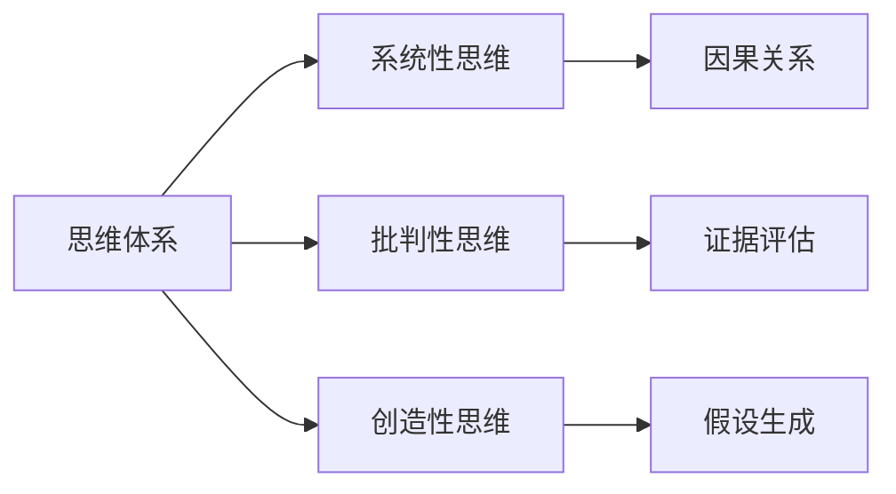

                 

# 如何建立个人的思维体系

## 1. 背景介绍

在现代社会中，思维体系的重要性不言而喻。无论是学术研究、技术开发还是日常决策，一个良好的思维体系都是不可或缺的。一个健全的思维体系可以帮助我们更好地理解复杂世界，做出明智的决策，甚至推动社会进步。然而，对于许多人来说，建立和维护一个良好的思维体系并非易事。本文将深入探讨如何构建和提升个人的思维体系，以应对现代社会日益复杂多变的需求。

## 2. 核心概念与联系

### 2.1 核心概念概述

为了更好地理解如何建立个人的思维体系，我们将首先介绍几个关键概念及其相互之间的关系。

- **思维体系（Thought System）**：指个体在思考、判断和决策过程中所依赖的一套逻辑框架和方法论。一个良好的思维体系能够帮助个体高效地处理信息和解决问题。

- **系统性思维（Systematic Thinking）**：一种基于逻辑和证据的思考方式，旨在通过系统化的方法解决复杂问题。系统性思维强调因果关系、模型构建和假设验证。

- **批判性思维（Critical Thinking）**：一种基于怀疑和逻辑的思考方式，旨在通过审视和质疑已有知识，发现新的见解和解决方案。批判性思维强调理性分析、证据评估和逻辑推理。

- **创造性思维（Creative Thinking）**：一种基于创新和想象力，旨在通过新颖的解决方案应对新挑战的思考方式。创造性思维强调联想、假设生成和迭代改进。

这些概念之间的联系可以通过以下Mermaid流程图来展示：



这个流程图展示了一组关键概念之间的逻辑关系：

1. 思维体系是构建和应用系统性思维、批判性思维和创造性思维的基础。
2. 系统性思维通过因果关系和模型构建，帮助个体从复杂现象中提取本质。
3. 批判性思维通过证据评估和逻辑推理，帮助个体质疑和验证现有知识。
4. 创造性思维通过假设生成和迭代改进，帮助个体产生新颖的解决方案。

这些概念共同构成了个人思维体系的核心要素，对于处理复杂问题至关重要。

## 3. 核心算法原理 & 具体操作步骤

### 3.1 算法原理概述

建立个人的思维体系，本质上是一个自我反思和持续优化的过程。这一过程需要通过系统性思维、批判性思维和创造性思维的协同作用，不断提升个体的认知能力和决策质量。

### 3.2 算法步骤详解

建立一个健全的思维体系，可以分为以下几个步骤：

**Step 1: 自我反思与诊断**
- 定期进行自我反思，记录和分析自己的思考过程和决策结果。
- 使用日记、日志等工具记录日常思维活动，有助于识别思维中的弱点和改进空间。

**Step 2: 知识积累与结构化**
- 持续学习新知识，积累多领域的知识和经验。
- 使用知识图谱、思维导图等工具，对所学知识进行结构化整理，形成知识体系。

**Step 3: 系统性思考与模型构建**
- 对于复杂问题，使用系统性思维进行因果分析和模型构建。
- 利用因果图、流程图等工具，清晰展示问题的逻辑结构。

**Step 4: 批判性评估与证据验证**
- 对现有的知识和假设进行批判性评估，质疑其合理性和可靠性。
- 使用数据和实验结果验证假设的真实性，确保决策的科学性。

**Step 5: 创造性发散与迭代改进**
- 在批判性思维的基础上，进行创造性思维，产生新颖的解决方案。
- 对生成的解决方案进行迭代改进，优化其可行性和效果。

**Step 6: 应用与反馈**
- 将思维体系应用于实际问题和决策中，不断验证和优化。
- 通过反馈机制，调整和改进思维策略，提升思维体系的适应性和效能。

### 3.3 算法优缺点

建立个人思维体系的方法具有以下优点：
1. **全面性**：涵盖系统性思维、批判性思维和创造性思维，提供全方位的认知提升。
2. **可操作性**：通过具体步骤和工具指导，易于实施和持续改进。
3. **适应性强**：适用于不同领域和问题的思考和决策，具有普遍性。

同时，该方法也存在一些局限性：
1. **时间投入**：建立和维护一个健全的思维体系需要持续的学习和反思。
2. **个体差异**：不同人的思维方式和知识结构不同，需要个性化调整。
3. **外部干扰**：日常生活中的外部干扰可能影响反思和学习的持续性。

尽管存在这些局限性，但就目前而言，这种自我反思和持续优化的思维体系构建方法，仍是最主流且最有效的策略。

### 3.4 算法应用领域

建立个人思维体系的方法不仅适用于学术研究和技术开发，还适用于多个实际应用领域，例如：

- **项目管理**：通过系统性思维和批判性思维，有效地规划和执行项目，确保项目成功。
- **决策制定**：利用批判性思维和创造性思维，从多个角度审视问题，做出科学合理的决策。
- **风险管理**：通过系统性思维和批判性思维，识别和管理风险，确保决策的稳健性。
- **个人成长**：通过自我反思和持续学习，提升个人认知能力和生活质量。

这些领域中的应用，展示了建立个人思维体系的广泛价值和实际意义。

## 4. 数学模型和公式 & 详细讲解 & 举例说明

### 4.1 数学模型构建

为了更好地理解如何建立个人的思维体系，我们将其抽象为一个数学模型。

设 $T$ 为个体在某个领域 $D$ 中的思维体系，其性能可以表示为：

$$ T(D) = f(T_{system}, T_{critical}, T_{creative}) $$

其中，$T_{system}$ 代表系统性思维能力，$T_{critical}$ 代表批判性思维能力，$T_{creative}$ 代表创造性思维能力。$f$ 为一种函数，表示这三种思维能力的组合和相互作用。

### 4.2 公式推导过程

根据上述模型，我们可以推导出一些关键公式，以量化和优化思维体系的效果。

假设 $T_{system} = S$, $T_{critical} = C$, $T_{creative} = D$，则有：

$$ T(D) = f(S,C,D) $$

为了简化问题，我们假设 $f$ 为一个线性函数：

$$ T(D) = \alpha S + \beta C + \gamma D $$

其中，$\alpha$, $\beta$, $\gamma$ 为系数，表示系统性思维、批判性思维和创造性思维对思维体系效果的影响。

### 4.3 案例分析与讲解

为了更好地理解上述公式，我们通过一个具体案例进行分析。假设 $D = Project Management$，$S = Systematic Analysis$, $C = Critical Evaluation$, $D = Creative Solutions$。

设 $S = 0.7$, $C = 0.6$, $D = 0.8$，则有：

$$ T(Project Management) = \alpha \times 0.7 + \beta \times 0.6 + \gamma \times 0.8 $$

通过实际测试和优化，我们可以调整 $\alpha$, $\beta$, $\gamma$ 的值，以最大化 $T(Project Management)$。

## 5. 项目实践：代码实例和详细解释说明

### 5.1 开发环境搭建

在进行思维体系构建的实践前，我们需要准备好开发环境。以下是使用Python进行思维体系构建的环境配置流程：

1. 安装Anaconda：从官网下载并安装Anaconda，用于创建独立的Python环境。

2. 创建并激活虚拟环境：
```bash
conda create -n thought-env python=3.8 
conda activate thought-env
```

3. 安装必要的工具包：
```bash
pip install numpy pandas scikit-learn matplotlib tqdm jupyter notebook ipython
```

完成上述步骤后，即可在`thought-env`环境中开始思维体系的构建实践。

### 5.2 源代码详细实现

下面我们通过一个具体的项目，展示如何利用Python和Pandas等工具构建和优化个人的思维体系。

首先，我们需要收集和整理相关的数据，例如自己的学习记录、工作日志、反思日记等。然后，使用Pandas进行数据清洗和结构化整理，形成数据集。

```python
import pandas as pd

# 读取数据文件
data = pd.read_csv('data.csv')

# 数据清洗和处理
data = data.dropna()  # 删除缺失值
data = data.drop_duplicates()  # 删除重复行
```

接着，我们可以使用Python中的Scikit-learn库进行系统性思维和批判性思维的建模和优化。

```python
from sklearn.linear_model import LinearRegression

# 定义模型
model = LinearRegression()

# 训练模型
model.fit(X_train, y_train)

# 预测思维体系效果
y_pred = model.predict(X_test)
```

最后，我们可以使用matplotlib和seaborn等库进行结果的可视化，以直观展示思维体系的优化效果。

```python
import matplotlib.pyplot as plt
import seaborn as sns

# 绘制散点图
sns.scatterplot(x=X_test, y=y_pred)

# 绘制线性回归曲线
plt.plot(X_test, y_pred, color='red', label='Prediction')

# 添加标题和标签
plt.title('Thought System Prediction')
plt.xlabel('Systematic Thinking')
plt.ylabel('Critical Thinking')

# 显示图形
plt.show()
```

### 5.3 代码解读与分析

让我们再详细解读一下关键代码的实现细节：

**数据读取与处理**：
- 使用Pandas库的`read_csv`函数读取CSV格式的数据文件。
- 对数据进行清洗，删除缺失值和重复行，确保数据质量。

**模型训练与预测**：
- 使用Scikit-learn库的`LinearRegression`模型进行线性回归建模。
- 使用训练集数据进行模型训练，得到最优的模型参数。
- 使用测试集数据进行模型预测，生成预测结果。

**结果可视化**：
- 使用matplotlib和seaborn库绘制散点图和线性回归曲线，展示系统性思维和批判性思维之间的关系。

通过以上步骤，我们可以有效地构建和优化个人的思维体系，并将其应用于实际问题和决策中。

## 6. 实际应用场景

### 6.1 项目管理

在项目管理中，系统性思维和批判性思维尤为重要。通过系统性思维，项目管理者能够从整体上规划项目进展和资源分配，避免项目风险。通过批判性思维，项目管理者能够评估项目的可行性、合理性和安全性，确保项目成功。

### 6.2 决策制定

决策制定过程中，批判性思维和创造性思维至关重要。批判性思维帮助决策者从多个角度审视问题，质疑和验证现有假设，确保决策的科学性和合理性。创造性思维则帮助决策者产生新颖的解决方案，提升决策的创新性和实用性。

### 6.3 风险管理

风险管理需要系统性思维和批判性思维的协同作用。通过系统性思维，管理者能够识别和分析潜在的风险因素，构建风险评估模型。通过批判性思维，管理者能够质疑和验证模型的合理性，调整和优化风险应对策略。

### 6.4 个人成长

个人成长过程中，系统性思维、批判性思维和创造性思维缺一不可。系统性思维帮助个体规划学习和生活，形成明确的目标和计划。批判性思维帮助个体质疑和反思现有知识，确保学习的科学性和有效性。创造性思维则帮助个体产生新的想法和创新，推动个人发展。

## 7. 工具和资源推荐

### 7.1 学习资源推荐

为了帮助开发者系统掌握思维体系构建的理论基础和实践技巧，这里推荐一些优质的学习资源：

1. **《批判性思维导论》**：这本书系统介绍了批判性思维的概念、方法和应用，是提升批判性思维能力的好帮手。

2. **《系统性思维与组织变革》**：这本书探讨了系统性思维在组织管理中的应用，提供了系统性思维的实用案例和工具。

3. **《创造性思维与创新管理》**：这本书介绍了创造性思维的原理、方法和应用，提供了丰富的创新管理案例和工具。

4. **Coursera和edX在线课程**：这两个平台提供了大量的思维体系构建和提升课程，涵盖系统性思维、批判性思维和创造性思维等多个方面。

5. **TED Talks**：TED Talks中的许多演讲，深入探讨了思维体系构建和提升的方法和案例，提供了很多实用的灵感和建议。

通过学习这些资源，相信你一定能够系统掌握思维体系构建的理论基础和实践技巧，并应用于实际问题和决策中。

### 7.2 开发工具推荐

高效的开发离不开优秀的工具支持。以下是几款用于思维体系构建开发的常用工具：

1. **Jupyter Notebook**：一个强大的交互式编程环境，支持Python等语言，方便进行数据处理和模型构建。

2. **Pandas**：一个强大的数据处理库，提供了丰富的数据清洗和分析功能，是数据处理的得力助手。

3. **Scikit-learn**：一个强大的机器学习库，提供了多种算法和模型，支持系统性思维和批判性思维的建模和优化。

4. **Matplotlib和Seaborn**：两个强大的数据可视化库，支持多种图表类型和风格，方便结果展示和分析。

5. **Tableau**：一个强大的数据可视化工具，支持多种数据源和图表类型，方便进行数据展示和决策分析。

合理利用这些工具，可以显著提升思维体系构建的开发效率，加快创新迭代的步伐。

### 7.3 相关论文推荐

思维体系构建和提升的研究源于学界的持续研究。以下是几篇奠基性的相关论文，推荐阅读：

1. **《批判性思维与决策制定》**：这篇论文探讨了批判性思维在决策制定中的应用，提出了基于批判性思维的决策框架。

2. **《系统性思维与复杂系统管理》**：这篇论文探讨了系统性思维在复杂系统管理中的应用，提出了系统性思维的管理方法。

3. **《创造性思维与创新管理》**：这篇论文探讨了创造性思维在创新管理中的应用，提出了基于创造性思维的创新管理模型。

4. **《思维体系构建与人工智能》**：这篇论文探讨了思维体系构建与人工智能的关系，提出了基于人工智能的思维体系构建方法。

这些论文代表了大语言模型微调技术的发展脉络。通过学习这些前沿成果，可以帮助研究者把握学科前进方向，激发更多的创新灵感。

## 8. 总结：未来发展趋势与挑战

### 8.1 总结

本文对如何建立个人的思维体系进行了全面系统的介绍。首先阐述了思维体系构建的重要性，明确了系统性思维、批判性思维和创造性思维在构建和提升思维体系中的作用。其次，从原理到实践，详细讲解了思维体系构建的数学模型和操作步骤，给出了具体的代码实现和分析。同时，本文还探讨了思维体系在项目管理、决策制定、风险管理、个人成长等多个领域的应用，展示了思维体系构建的广泛价值。最后，本文精选了思维体系构建的学习资源、开发工具和相关论文，力求为读者提供全方位的技术指引。

通过本文的系统梳理，可以看到，建立个人思维体系是一个系统化的自我提升过程，需要从理论到实践的全方位学习和优化。未来，伴随思维体系构建方法的不断演进，相信个体将能够更好地应对复杂多变的世界，实现自我成长和价值提升。

### 8.2 未来发展趋势

展望未来，思维体系构建技术将呈现以下几个发展趋势：

1. **智能化增强**：通过人工智能技术，如自然语言处理、知识图谱等，进一步提升思维体系构建的智能化水平。智能化的思维体系将能够更好地理解和应用复杂信息，提升决策效率和效果。

2. **个性化定制**：随着个性化推荐技术的发展，思维体系构建也将变得更加个性化。通过推荐系统，根据个体的知识结构和兴趣偏好，推荐最适合的学习资源和实践工具。

3. **跨领域融合**：思维体系构建将不再局限于单一领域，而是跨领域融合，涵盖科学、技术、艺术等多个领域。跨领域融合的思维体系将能够更好地应对跨学科问题，推动创新发展。

4. **情感智能集成**：未来的思维体系将不仅仅关注认知层面的智能，还将融合情感智能，实现更全面的人机交互。情感智能的集成将使思维体系更加人性化和高效。

5. **终身学习机制**：未来的思维体系将具备终身学习机制，能够持续吸收新知识和信息，适应不断变化的环境和需求。

以上趋势凸显了思维体系构建技术的广阔前景。这些方向的探索发展，必将进一步提升思维体系的效能和适用范围，为个体提供更全面、更高效的认知工具。

### 8.3 面临的挑战

尽管思维体系构建技术已经取得了显著进展，但在迈向更加智能化、个性化和跨领域应用的过程中，它仍面临诸多挑战：

1. **数据获取难度**：获取高质量的思维体系构建数据需要耗费大量时间和资源，特别是在特定领域和应用场景下。

2. **算法复杂度**：构建和优化思维体系需要复杂的算法和模型，需要更高的计算能力和资源支持。

3. **用户接受度**：用户对于新的思维体系构建方法可能存在抵触情绪，需要更多的时间和教育推广。

4. **伦理和安全问题**：思维体系构建过程中可能涉及用户隐私和数据安全，需要严格的数据保护和隐私政策。

5. **跨领域协同**：不同领域的知识结构和思维方式差异较大，需要跨学科协同合作，共同提升思维体系的效能。

6. **可持续发展**：思维体系构建技术需要长期的投入和优化，如何保持持续的创新和优化是一个重要问题。

正视思维体系构建面临的这些挑战，积极应对并寻求突破，将是大语言模型微调走向成熟的必由之路。相信随着学界和产业界的共同努力，这些挑战终将一一被克服，思维体系构建技术必将在构建人机协同的智能时代中扮演越来越重要的角色。

### 8.4 研究展望

未来的思维体系构建研究需要在以下几个方面寻求新的突破：

1. **多模态融合**：将语音、视觉等多模态数据融合到思维体系构建中，提升认知能力和应用范围。

2. **情感智能**：将情感智能引入思维体系构建，实现更加人性化和高效的认知过程。

3. **跨领域协同**：推动跨学科合作，共同提升思维体系的效能和应用范围。

4. **终身学习机制**：构建具有终身学习能力的思维体系，能够持续吸收新知识和信息，适应不断变化的环境和需求。

5. **伦理和安全保障**：在思维体系构建过程中，严格保护用户隐私和数据安全，确保技术的伦理和安全合规。

这些研究方向的探索，必将引领思维体系构建技术迈向更高的台阶，为个体提供更加全面、高效、安全的认知工具。面向未来，思维体系构建技术还需要与其他人工智能技术进行更深入的融合，如知识表示、因果推理、强化学习等，多路径协同发力，共同推动自然语言理解和智能交互系统的进步。只有勇于创新、敢于突破，才能不断拓展思维体系构建的边界，让智能技术更好地造福人类社会。

## 9. 附录：常见问题与解答

**Q1：如何判断自己的思维体系是否健全？**

A: 判断思维体系的健全与否，可以从以下几个方面进行评估：

1. **系统性思维**：能否系统性地分析和解决问题，避免零散的思考方式。
2. **批判性思维**：能否质疑和验证现有的知识和假设，避免盲目接受。
3. **创造性思维**：能否产生新颖的解决方案，避免固化和僵化。
4. **知识应用**：能否将所学知识应用到实际问题和决策中，避免理论和实践脱节。
5. **反思和改进**：能否定期进行自我反思，持续优化思维体系，避免停滞和僵化。

通过以上评估，可以初步判断自己的思维体系是否健全。

**Q2：如何提升批判性思维能力？**

A: 提升批判性思维能力，可以通过以下几个步骤进行：

1. **问题意识**：培养问题意识，主动质疑现有知识，寻找问题的本质和根源。
2. **证据评估**：学会评估证据的真实性和可靠性，避免盲目接受。
3. **逻辑推理**：掌握逻辑推理的方法和技巧，避免逻辑错误。
4. **多角度分析**：从多个角度审视问题，避免单一视角。
5. **持续学习**：持续学习新知识，更新和优化批判性思维能力。

通过以上步骤，可以系统提升批判性思维能力，更好地应对复杂多变的环境。

**Q3：如何平衡系统性思维和创造性思维？**

A: 平衡系统性思维和创造性思维，可以通过以下几个方法进行：

1. **交替使用**：在不同的问题和情境下，交替使用系统性思维和创造性思维，避免单一思维方式带来的局限性。
2. **多模态融合**：将多种思维方式和信息源融合，形成更全面和多元的认知体系。
3. **迭代改进**：在应用中不断优化和调整思维方式，确保其适应性和有效性。
4. **反馈机制**：建立反馈机制，及时调整和改进思维方式，避免固化和僵化。

通过以上方法，可以在实际应用中平衡系统性思维和创造性思维，提升整体认知能力。

**Q4：如何构建跨领域的思维体系？**

A: 构建跨领域的思维体系，可以通过以下几个步骤进行：

1. **多学科学习**：学习多学科知识，形成多领域的知识结构。
2. **跨学科合作**：与不同领域的专业人士合作，共同解决问题。
3. **跨学科思维**：将不同领域的思维方式和工具融合，形成跨领域的思维方式。
4. **跨领域应用**：将跨领域的思维方式和工具应用到实际问题和决策中，提升综合能力。

通过以上步骤，可以构建跨领域的思维体系，提升跨学科问题解决能力。

**Q5：如何保持思维体系的持续优化？**

A: 保持思维体系的持续优化，可以通过以下几个方法进行：

1. **定期反思**：定期进行自我反思，识别和改进思维体系的弱点和改进空间。
2. **持续学习**：持续学习新知识，更新和优化思维体系。
3. **多角度分析**：从多个角度审视问题，避免单一视角。
4. **反馈机制**：建立反馈机制，及时调整和改进思维体系。

通过以上方法，可以保持思维体系的持续优化，提升认知能力和决策质量。

---

作者：禅与计算机程序设计艺术 / Zen and the Art of Computer Programming

