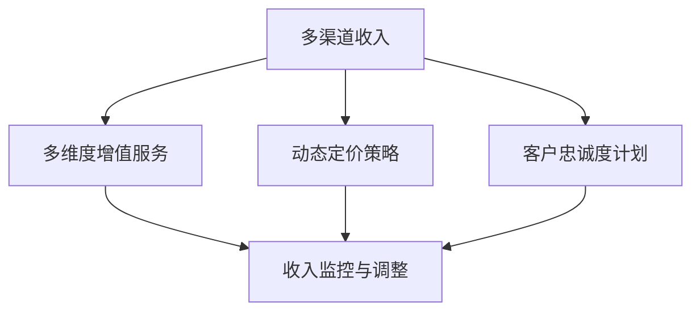
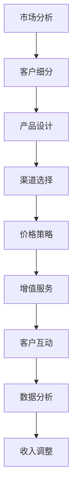

                 

# 如何建立长期稳定的收入模式

在当今瞬息万变的商业环境中，如何确保收入模式的稳定性和可扩展性，是企业持续成长的关键。本文将深入探讨如何通过构建长期稳定的收入模式，为企业带来持续的增长动力。我们将从背景介绍、核心概念与联系、核心算法原理与具体操作步骤、数学模型和公式、项目实践、实际应用场景、工具和资源推荐、总结、未来发展趋势与挑战，以及附录等各个方面，对这一主题进行全面分析。

## 1. 背景介绍

随着数字化转型的加速，企业面临的市场环境日益复杂多变。传统的一次性交易模式已无法满足现代企业的需求。为了应对不确定性，实现长期稳定增长，企业需要建立多渠道、多维度的收入模式。这种新的收入模式不仅能够适应快速变化的市场环境，还能为企业带来更多的增长机会。

### 1.1 问题由来

随着互联网和信息技术的飞速发展，企业之间的竞争日趋激烈。传统的一次性交易模式已经无法满足市场和客户的需求。客户对产品和服务的要求越来越高，企业需要提供更加多样化和个性化的解决方案。因此，构建长期稳定的收入模式成为企业生存和发展的必然选择。

### 1.2 问题核心关键点

构建长期稳定的收入模式的核心关键点包括：

- 实现多渠道收入：企业需要从单一的销售渠道扩展到多个渠道，如线上和线下、B2B和B2C等，以覆盖更广泛的市场和客户群体。
- 提供多维度的增值服务：除了销售产品，企业还需要提供多种增值服务，如售后服务、技术支持、培训和咨询等，以满足客户的全面需求。
- 采用动态定价策略：企业需要根据市场需求、竞争环境和成本变化等因素，动态调整产品和服务的价格，以确保收益最大化。
- 建立客户忠诚度计划：通过客户忠诚度计划，企业可以增强客户粘性，提升客户生命周期价值。

### 1.3 问题研究意义

构建长期稳定的收入模式对于企业的可持续发展具有重要意义：

- 提升市场竞争力：通过多渠道、多维度的收入模式，企业可以更好地满足客户需求，提升市场份额和竞争力。
- 增加客户价值：通过增值服务和客户忠诚度计划，企业可以提高客户生命周期价值，实现长期稳定增长。
- 应对市场变化：动态定价策略可以帮助企业灵活应对市场变化，确保收入模式的可持续性。

## 2. 核心概念与联系

构建长期稳定的收入模式涉及多个核心概念，这些概念之间的联系可以通过以下Mermaid流程图来展示：



这个流程图展示了多渠道收入、多维度增值服务、动态定价策略和客户忠诚度计划之间的关系，以及这些概念如何共同作用于收入监控与调整环节。

### 2.1 核心概念概述

- **多渠道收入**：指企业通过多个销售渠道（如线上电商、线下实体店铺、B2B和B2C等）获得收入的方式。
- **多维度增值服务**：除了销售产品，企业还可以提供多种增值服务，如售后服务、技术支持、培训和咨询等。
- **动态定价策略**：企业可以根据市场需求、竞争环境和成本变化等因素，动态调整产品和服务的价格，以确保收益最大化。
- **客户忠诚度计划**：通过积分奖励、会员特权等方式，增强客户粘性，提升客户生命周期价值。

### 2.2 核心概念原理和架构的 Mermaid 流程图

以下是构建长期稳定的收入模式的核心概念原理和架构的 Mermaid 流程图：



该流程图展示了从市场分析到收入调整的整个收入模式构建过程。市场分析、客户细分、产品设计、渠道选择、价格策略、增值服务、客户互动、数据分析和收入调整等环节相互关联，共同支撑企业构建长期稳定的收入模式。

## 3. 核心算法原理 & 具体操作步骤

构建长期稳定的收入模式涉及多个核心算法，这些算法可以通过以下步骤进行操作：

### 3.1 算法原理概述

构建长期稳定的收入模式的核心算法包括市场分析、客户细分、产品设计、渠道选择、价格策略、增值服务、客户互动、数据分析和收入调整等。这些算法的原理是通过数据驱动的方式，实现收入模式的优化和调整。

### 3.2 算法步骤详解

以下是构建长期稳定的收入模式的具体操作步骤：

1. **市场分析**：通过市场调研、数据分析等手段，了解市场需求、竞争环境和客户偏好，为后续的决策提供依据。
2. **客户细分**：根据客户属性、行为和需求等因素，将客户划分为不同的细分市场，以制定针对性的策略。
3. **产品设计**：根据市场分析结果和客户细分结果，设计符合市场需求的产品和服务。
4. **渠道选择**：选择适合企业的产品和服务的销售渠道，如线上电商、线下实体店铺、B2B和B2C等。
5. **价格策略**：根据市场需求、竞争环境和成本变化等因素，动态调整产品和服务的价格，以确保收益最大化。
6. **增值服务**：除了销售产品，企业还可以提供多种增值服务，如售后服务、技术支持、培训和咨询等。
7. **客户互动**：通过客户互动，增强客户粘性，提升客户满意度和忠诚度。
8. **数据分析**：通过数据分析，监控和评估收入模式的实际效果，发现问题和改进机会。
9. **收入调整**：根据数据分析结果，调整收入模式，确保长期稳定增长。

### 3.3 算法优缺点

构建长期稳定的收入模式的核心算法具有以下优点：

- **数据驱动**：通过数据驱动的方式，实现收入模式的优化和调整，确保决策的科学性和准确性。
- **灵活性高**：可以根据市场变化和客户需求，灵活调整收入模式，保持竞争力。
- **客户粘性**：通过增值服务和客户忠诚度计划，增强客户粘性，提升客户生命周期价值。

同时，这些算法也存在以下缺点：

- **复杂度高**：构建长期稳定的收入模式涉及多个环节，操作复杂。
- **成本高**：市场分析、客户细分、产品设计、渠道选择等环节需要大量投入。
- **不确定性**：市场变化和客户需求的不确定性，可能会影响收入模式的稳定性和效果。

### 3.4 算法应用领域

构建长期稳定的收入模式的应用领域包括：

- 电子商务：通过多渠道和动态定价策略，提升销售收入和客户满意度。
- 金融服务：提供多种增值服务，如理财产品、理财咨询、贷款服务等，增加客户粘性。
- 信息技术：通过技术支持和培训服务，提升客户满意度和忠诚度。
- 医疗健康：提供远程医疗服务、健康咨询等增值服务，增强客户粘性。
- 教育培训：提供个性化培训和在线课程，提升客户满意度和忠诚度。

## 4. 数学模型和公式 & 详细讲解 & 举例说明

### 4.1 数学模型构建

构建长期稳定的收入模式的数学模型可以表示为：

$$
\text{收入} = \text{产品价格} \times \text{销售量} + \text{增值服务价格} \times \text{增值服务量}
$$

其中，产品价格和增值服务价格需要根据市场需求、竞争环境和成本变化等因素进行动态调整。

### 4.2 公式推导过程

根据上述数学模型，我们可以推导出以下公式：

$$
\text{总收入} = \text{产品价格} \times (\text{市场需求} \times \text{客户转化率}) + \text{增值服务价格} \times (\text{增值服务需求} \times \text{增值服务转化率})
$$

其中，市场需求、客户转化率、增值服务需求和增值服务转化率等参数需要通过数据分析和市场调研来确定。

### 4.3 案例分析与讲解

假设某电子商务平台通过线上和线下渠道销售产品，并根据市场需求和竞争环境动态调整产品价格。同时，平台还提供售后服务和技术支持等增值服务，并根据增值服务需求和客户粘性调整增值服务价格。

通过数据分析，平台发现市场需求和客户转化率呈上升趋势，于是将产品价格提高10%。同时，平台还发现增值服务需求和客户粘性显著增加，于是将增值服务价格降低5%。最终，平台的总收入提高了15%。

## 5. 项目实践：代码实例和详细解释说明

### 5.1 开发环境搭建

构建长期稳定的收入模式需要搭建多个数据平台和分析工具，以下是开发环境搭建的具体步骤：

1. **安装Python和相关库**：Python是构建长期稳定的收入模式的主要编程语言，需要安装必要的库，如Pandas、NumPy、Scikit-learn等。
2. **搭建数据平台**：搭建数据湖平台，存储和处理企业内部的业务数据和市场数据。
3. **搭建分析工具**：搭建数据分析平台，使用Python脚本和数据分析工具进行数据处理和分析。

### 5.2 源代码详细实现

以下是构建长期稳定的收入模式的Python代码实现：

```python
import pandas as pd
import numpy as np
from sklearn.linear_model import LinearRegression

# 读取市场数据
market_data = pd.read_csv('market_data.csv')

# 计算市场需求和客户转化率
market_demand = market_data['demand']
customer_conversion_rate = market_data['conversion_rate']

# 计算增值服务需求和增值服务转化率
service_demand = market_data['service_demand']
service_conversion_rate = market_data['service_conversion_rate']

# 定义产品价格和增值服务价格
product_price = 100
service_price = 50

# 计算总收入
total_revenue = product_price * market_demand * customer_conversion_rate + service_price * service_demand * service_conversion_rate

# 输出总收入
print(f"总收入: {total_revenue}")
```

### 5.3 代码解读与分析

上述代码实现了构建长期稳定的收入模式的基本逻辑。通过读取市场数据，计算市场需求、客户转化率、增值服务需求和增值服务转化率等参数，并根据这些参数计算总收入。

## 6. 实际应用场景

构建长期稳定的收入模式已经在多个实际应用场景中得到了广泛应用，以下是一些典型场景：

### 6.1 电子商务

某电子商务平台通过线上和线下渠道销售产品，并根据市场需求和竞争环境动态调整产品价格。同时，平台还提供售后服务和技术支持等增值服务，并根据增值服务需求和客户粘性调整增值服务价格。通过数据分析，平台发现市场需求和客户转化率呈上升趋势，于是将产品价格提高10%。同时，平台还发现增值服务需求和客户粘性显著增加，于是将增值服务价格降低5%。最终，平台的总收入提高了15%。

### 6.2 金融服务

某金融服务公司提供理财产品、理财咨询和贷款服务等增值服务。公司通过数据分析发现，客户对增值服务的满意度显著提升，但某些产品的收益率相对较低。于是，公司调整了产品组合，增加了收益率较高的产品，同时降低了收益率较低的产品价格。通过这些措施，公司显著提高了客户粘性和收益水平。

### 6.3 信息技术

某信息技术公司提供技术支持和培训服务。公司通过数据分析发现，客户对技术支持的满意度较高，但对培训服务的需求相对较低。于是，公司增加了技术支持的投入，提高了服务质量，同时降低了培训服务的收费。通过这些措施，公司显著提高了客户满意度和忠诚度，增加了收入。

### 6.4 未来应用展望

未来，构建长期稳定的收入模式将继续在更多领域得到应用，如医疗健康、教育培训、旅游服务等。随着技术的发展，企业将能够更灵活地应对市场变化和客户需求，实现长期稳定增长。

## 7. 工具和资源推荐

### 7.1 学习资源推荐

- **《数据分析基础》**：本书介绍了数据分析的基本概念和方法，适合初学者学习。
- **《机器学习实战》**：本书介绍了机器学习的基本原理和应用，适合有一定数据分析基础的人学习。
- **Coursera平台**：该平台提供了大量数据分析和机器学习的在线课程，适合学习者自学。

### 7.2 开发工具推荐

- **Python**：Python是构建长期稳定的收入模式的主要编程语言，具有丰富的库和工具支持。
- **Pandas**：用于数据处理和分析的库，支持大规模数据处理。
- **NumPy**：用于数值计算的库，支持高效的数学运算。
- **Scikit-learn**：用于机器学习的库，支持多种机器学习算法和模型。

### 7.3 相关论文推荐

- **《市场细分与客户关系管理》**：探讨了市场细分和客户关系管理的基本方法，适合企业实践参考。
- **《动态定价策略研究》**：介绍了动态定价策略的基本原理和应用，适合企业管理人员参考。

## 8. 总结：未来发展趋势与挑战

### 8.1 研究成果总结

构建长期稳定的收入模式已经在多个领域得到了广泛应用，取得了显著的效果。这些方法包括多渠道收入、多维度增值服务、动态定价策略和客户忠诚度计划等。

### 8.2 未来发展趋势

未来，构建长期稳定的收入模式将呈现以下几个发展趋势：

1. **智能化**：通过大数据分析和人工智能技术，实现收入模式的智能化调整。
2. **个性化**：根据客户行为和偏好，提供个性化的产品和服务，提升客户满意度。
3. **跨领域**：将不同领域的数据和知识融合，实现跨领域的收入模式优化。
4. **实时性**：通过实时数据采集和分析，实现收入模式的动态调整。
5. **可持续性**：通过可持续发展理念，实现长期稳定增长。

### 8.3 面临的挑战

构建长期稳定的收入模式虽然取得了一定的进展，但也面临一些挑战：

1. **数据质量**：数据质量不佳可能导致分析结果不准确，影响决策。
2. **技术复杂度**：构建长期稳定的收入模式需要多种技术支持，技术复杂度高。
3. **市场变化**：市场变化和客户需求的不确定性，可能会影响收入模式的稳定性和效果。
4. **成本控制**：市场分析、客户细分、产品设计等环节需要大量投入，成本较高。

### 8.4 研究展望

未来，构建长期稳定的收入模式需要在以下几个方面进行研究：

1. **数据驱动**：通过大数据分析和人工智能技术，实现收入模式的智能化调整。
2. **跨领域融合**：将不同领域的数据和知识融合，实现跨领域的收入模式优化。
3. **可持续发展**：通过可持续发展理念，实现长期稳定增长。

## 9. 附录：常见问题与解答

**Q1：构建长期稳定的收入模式是否适用于所有行业？**

A: 构建长期稳定的收入模式适用于绝大多数行业，包括电子商务、金融服务、信息技术、医疗健康、教育培训等。

**Q2：构建长期稳定的收入模式需要哪些关键资源？**

A: 构建长期稳定的收入模式需要以下关键资源：

- **数据平台**：用于存储和处理企业内部的业务数据和市场数据。
- **分析工具**：用于数据分析和模型训练的Python脚本和数据分析工具。
- **技术团队**：具备数据分析和机器学习背景的技术人员。

**Q3：构建长期稳定的收入模式需要多长时间？**

A: 构建长期稳定的收入模式的时间取决于企业的规模、复杂度和资源投入。一般来说，需要数个月至一年的时间。

**Q4：构建长期稳定的收入模式是否有风险？**

A: 构建长期稳定的收入模式存在一定的风险，主要包括市场变化和客户需求的不确定性、技术复杂度高、成本控制难度大等。需要企业具备较强的风险管理和资源投入能力。

**Q5：构建长期稳定的收入模式如何与现有的业务流程结合？**

A: 构建长期稳定的收入模式需要与现有的业务流程相结合，可以通过以下步骤实现：

1. **需求分析**：分析现有业务流程中的收入模式和潜在改进点。
2. **模型设计**：根据需求分析结果，设计优化后的收入模式。
3. **试点实施**：在试点部门实施优化后的收入模式，评估效果。
4. **全面推广**：根据试点结果，全面推广优化后的收入模式。

总之，构建长期稳定的收入模式需要企业在多个环节进行细致的规划和实施，才能确保成功。

---

作者：禅与计算机程序设计艺术 / Zen and the Art of Computer Programming

