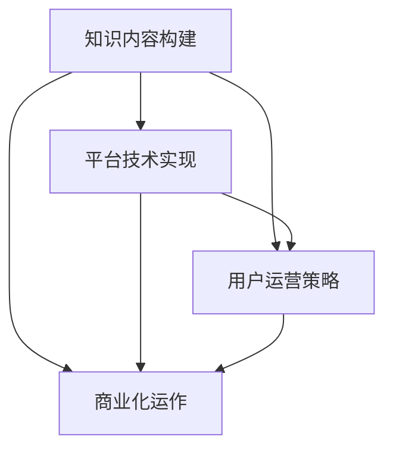

                 

# 如何打造个人知识付费影响力圈

在数字化、信息化时代，知识付费已成为一种热门模式，从在线课程、音频讲座到专业咨询，不一而足。对于个人来说，打造一个具有影响力、可持续发展的知识付费平台，不仅需要掌握先进的互联网技术，还需要具备独特的知识体系、教育理念、运营策略等。本文将系统介绍如何打造个人知识付费影响力圈，从核心概念、技术实现、实际应用、未来展望等多个角度进行详细阐述。

## 1. 背景介绍

### 1.1 问题由来
随着知识经济的发展，社会对专业知识和技能的渴求日益增长。个人通过创建知识付费平台，可以将自身的专业知识转换为市场价值，实现知识变现。同时，平台也能够提供个性化、专业化、系统化的学习内容，满足用户深度学习的需求。近年来，知识付费平台如Coursera、Udacity、知识星球等迅速崛起，为个人知识变现提供了新的契机。

### 1.2 问题核心关键点
打造个人知识付费影响力圈，核心在于构建一个集知识内容输出、用户学习互动、平台运营管理为一体的闭环生态系统。这包括：

1. **知识内容构建**：如何系统化、结构化地梳理个人专业知识，形成有价值的内容体系。
2. **平台技术实现**：如何搭建一个稳定、易用、可扩展的技术平台。
3. **用户运营策略**：如何通过有效的运营策略吸引用户、提升活跃度、增加复购率。
4. **商业化运作**：如何合理定价、提升收益，实现平台的可持续发展。

这些关键点共同构成了打造个人知识付费影响力圈的全流程，需要在技术、内容、运营等多个维度进行全面布局。

## 2. 核心概念与联系

### 2.1 核心概念概述

为更好地理解知识付费平台的构建过程，本节将介绍几个关键概念：

- **知识付费平台**：基于互联网技术的知识交易平台，通过提供高质量的知识内容，满足用户深度学习的需求。
- **知识内容构建**：将专业知识和技能系统化、结构化地梳理，形成有价值的内容体系。
- **平台技术实现**：通过搭建一个稳定、易用、可扩展的技术平台，提供线上知识内容交付、用户互动、运营管理等服务。
- **用户运营策略**：通过有效的运营策略吸引用户、提升活跃度、增加复购率，构建一个健康可持续的生态系统。
- **商业化运作**：通过合理的定价策略、营销推广、用户管理等手段，实现平台的商业化盈利。

这些核心概念之间的逻辑关系可以通过以下Mermaid流程图来展示：



这个流程图展示了知识付费平台的构建流程：

1. 首先进行知识内容构建，构建有价值的内容体系。
2. 在知识内容的基础上，进行平台技术实现，搭建线上服务系统。
3. 在技术实现的基础上，开展用户运营策略，吸引和留住用户。
4. 在用户运营的基础上，进行商业化运作，实现平台的可持续盈利。

## 3. 核心算法原理 & 具体操作步骤

### 3.1 算法原理概述

知识付费平台的构建，核心在于知识内容的系统化梳理和平台技术的搭建。其核心算法原理基于以下几个关键点：

1. **知识图谱构建**：通过知识图谱技术，将知识内容之间的关系进行结构化建模，构建知识体系。
2. **推荐算法优化**：通过机器学习算法，对用户行为数据进行分析，推荐个性化、高质量的内容。
3. **数据管理优化**：通过数据管理系统，保证知识内容的数据安全、易用性和可扩展性。
4. **用户体验优化**：通过UI/UX设计，提升用户的学习体验，增加用户粘性。

这些核心算法原理共同构成了知识付费平台的运营基础。

### 3.2 算法步骤详解

#### 3.2.1 知识内容构建
1. **领域调研**：深入了解目标领域，梳理核心知识点和技能点，形成知识架构。
2. **内容制作**：将知识架构转化为有价值的内容，包括文字、视频、音频等形式。
3. **内容验证**：邀请领域专家和目标用户进行内容验证，优化内容质量和适用性。

#### 3.2.2 平台技术实现
1. **前端开发**：使用React、Vue等框架，开发用户界面，提升用户体验。
2. **后端开发**：使用Node.js、Python等技术，搭建服务端架构，处理数据请求和响应。
3. **数据库设计**：使用MySQL、MongoDB等数据库，设计数据模型，保障数据安全性和可扩展性。
4. **API接口开发**：开发RESTful API接口，提供用户数据交互和系统扩展的接口支持。

#### 3.2.3 用户运营策略
1. **用户吸引**：通过SEO、社交媒体、内容营销等方式，吸引潜在用户。
2. **用户互动**：通过评论、点赞、分享等机制，促进用户之间的互动和交流。
3. **用户留存**：通过定期推送高质量内容、举办用户活动等方式，提高用户留存率。
4. **用户转化**：通过优惠促销、推荐有价值内容等方式，提升用户购买率。

#### 3.2.4 商业化运作
1. **定价策略**：根据内容价值、用户需求等，制定合理的价格策略。
2. **营销推广**：通过广告投放、KOL合作等方式，提升平台的知名度和用户量。
3. **收益分配**：合理分配平台收益，保证内容创作者和平台的利益平衡。

### 3.3 算法优缺点

#### 3.3.1 优点
1. **可扩展性强**：平台技术实现基于模块化设计，可灵活扩展，适应不同的业务需求。
2. **用户体验好**：通过前端开发和UI/UX设计，提升用户的学习体验。
3. **运营效果显著**：通过推荐算法和用户运营策略，提升用户活跃度和复购率。
4. **商业化潜力大**：合理的定价策略和营销推广，确保平台可持续盈利。

#### 3.3.2 缺点
1. **技术复杂度高**：需要多方面技术支持和开发，对团队技术水平要求高。
2. **运营成本高**：用户运营、内容维护、平台运维等成本较高。
3. **市场竞争激烈**：知识付费市场竞争激烈，需不断创新优化以保持竞争力。
4. **用户粘性难以维持**：用户流失率较高，需不断推出新内容、新活动以保持用户粘性。

### 3.4 算法应用领域

知识付费平台的构建，已经在教育培训、技术研发、金融投资等多个领域得到广泛应用。这些领域的特点和需求不同，但通过知识付费平台，都能更好地实现知识共享和价值转换。

- **教育培训**：通过知识付费平台，可以提供系统化的培训课程，提升用户的专业能力。
- **技术研发**：技术领域知识复杂，通过知识付费平台，可以快速获取前沿技术知识和实践经验。
- **金融投资**：金融领域知识更新快，通过知识付费平台，可以实时获取市场信息和投资策略。
- **健康管理**：健康领域知识专业性强，通过知识付费平台，可以提供个性化健康管理方案。
- **文化娱乐**：文化娱乐领域知识多样，通过知识付费平台，可以获取各类文艺作品和互动体验。

## 4. 数学模型和公式 & 详细讲解 & 举例说明

### 4.1 数学模型构建

本节将使用数学语言对知识付费平台的构建过程进行更加严格的刻画。

假设知识付费平台有$N$个内容创作者，每个创作者提供$M$个知识点，平台用户有$U$个，每个用户每天访问平台$T$次。知识内容与用户的匹配度用$E$表示，平台的运营效果用$P$表示。则数学模型为：

$$
\begin{align*}
E &= \sum_{i=1}^N \sum_{j=1}^M e_{ij} \\
P &= \sum_{i=1}^U p_i T_i \\
\end{align*}
$$

其中$e_{ij}$表示内容创作者$i$提供知识点$j$与用户$U$的匹配度，$p_i$表示内容创作者$i$的推荐权重，$T_i$表示用户$U$在平台$P$上的访问时长。

### 4.2 公式推导过程

通过上述数学模型，可以得到以下公式：

$$
\begin{align*}
E &= \sum_{i=1}^N \sum_{j=1}^M e_{ij} \\
&= \sum_{i=1}^N \sum_{j=1}^M (u_i e_{ij}) \\
&= \sum_{i=1}^N u_i \sum_{j=1}^M e_{ij} \\
\end{align*}
$$

其中$u_i$表示内容创作者$i$的贡献度。

将$E$和$P$代入平台运营效果$P$的公式中，得：

$$
\begin{align*}
P &= \sum_{i=1}^U p_i T_i \\
&= \sum_{i=1}^U \frac{e_{ij} \sum_{j=1}^M u_j}{\sum_{j=1}^N u_j} T_i \\
&= \frac{1}{\sum_{j=1}^N u_j} \sum_{i=1}^U e_{ij} T_i \\
\end{align*}
$$

### 4.3 案例分析与讲解

以Coursera平台为例，分析其知识付费模型的具体实现。

Coursera平台通过知识图谱技术，构建了包含数百万条教育资源的知识图谱，形成了系统的课程体系。平台采用推荐算法，根据用户的学习行为和兴趣，动态推荐个性化课程。同时，平台提供用户互动功能，通过评论、点赞、分享等机制，促进用户之间的交流和互动。

Coursera平台采用混合定价策略，课程免费试听部分定价较低，付费部分定价较高，保证课程质量的同时，提升平台的盈利能力。平台通过广告投放、KOL合作等方式进行市场推广，提升平台的知名度和用户量。

## 5. 项目实践：代码实例和详细解释说明

### 5.1 开发环境搭建

进行知识付费平台开发前，需要先搭建开发环境。以下是使用Python进行Django开发的环境配置流程：

1. 安装Anaconda：从官网下载并安装Anaconda，用于创建独立的Python环境。

2. 创建并激活虚拟环境：
```bash
conda create -n django-env python=3.8 
conda activate django-env
```

3. 安装Django：
```bash
pip install django
```

4. 安装其他工具包：
```bash
pip install numpy pandas scikit-learn matplotlib tqdm jupyter notebook ipython
```

完成上述步骤后，即可在`django-env`环境中开始开发。

### 5.2 源代码详细实现

下面我们以知识付费平台的用户管理模块为例，给出使用Django进行开发的PyTorch代码实现。

首先，定义用户模型：

```python
from django.contrib.auth.models import AbstractUser
from django.db import models

class User(AbstractUser):
    pass
```

然后，定义用户注册和登录视图：

```python
from django.shortcuts import render, redirect
from django.contrib.auth import authenticate, login, logout

def register(request):
    if request.method == 'POST':
        username = request.POST['username']
        password = request.POST['password']
        user = User.objects.create_user(username, password)
        user.save()
        return redirect('login')
    else:
        return render(request, 'register.html')

def login(request):
    if request.method == 'POST':
        username = request.POST['username']
        password = request.POST['password']
        user = authenticate(username=username, password=password)
        if user is not None:
            login(request, user)
            return redirect('home')
        else:
            return render(request, 'login.html')
    else:
        return render(request, 'login.html')

def logout(request):
    logout(request)
    return redirect('home')
```

最后，启动开发流程并在用户界面展示：

```python
from django.urls import path

urlpatterns = [
    path('register/', register),
    path('login/', login),
    path('logout/', logout),
    path('home/', home),
    path('', home),
]

```

以上就是使用Django进行知识付费平台用户管理模块开发的完整代码实现。可以看到，利用Django的框架，开发者可以非常方便地进行用户管理、认证、权限控制等功能的开发，显著提升开发效率。

### 5.3 代码解读与分析

让我们再详细解读一下关键代码的实现细节：

**User模型**：
- 继承自Django内置的AbstractUser模型，用于定义用户的基本信息。

**register、login、logout视图**：
- 分别实现用户注册、登录和注销功能。
- 注册时，使用内置的create_user方法创建用户，并保存用户信息。
- 登录时，使用authenticate方法验证用户名和密码，通过后使用login方法登录。
- 注销时，使用logout方法注销登录状态。

**URL路由配置**：
- 配置路由，实现用户注册、登录、注销等功能的URL映射。
- 使用path方法定义路由路径，与视图函数关联。

可以看到，Django框架为开发者提供了强大的组件化开发功能，能够快速搭建基本的用户管理系统。

当然，知识付费平台的开发还需要更多组件和模块，如课程管理、付费功能、推荐系统、数据管理等。但核心的用户管理模块已能满足基本需求，后续开发还需进一步完善。

## 6. 实际应用场景

### 6.1 教育培训

知识付费平台在教育培训领域的应用非常广泛。传统教育培训往往需要大量的线下资源和时间，而通过知识付费平台，可以提供高质量的在线课程和实时互动，提升教育培训的效率和覆盖面。

以编程在线教育平台为例，通过知识付费平台，学生可以按需学习编程知识，并获得个性化的指导和答疑。平台可以实时监控学生的学习进度，并提供针对性的学习建议和资源推荐。同时，平台还可以通过直播、录播、互动式课程等形式，丰富学习体验，提升学习效果。

### 6.2 技术研发

技术领域知识更新快，通过知识付费平台，可以快速获取前沿技术知识和实践经验。平台可以邀请行业专家和工程师，提供高质量的技术文章、视频教程、代码示例等，满足开发者深度学习的需求。

例如，GitHub Learning Lab通过知识付费平台，提供了面向开源社区的开发者培训课程。开发者可以通过付费订阅，获得Git、GitHub、Docker等工具的深入学习体验，提升开发能力。

### 6.3 金融投资

金融领域知识专业性强，通过知识付费平台，可以实时获取市场信息和投资策略。平台可以邀请金融分析师和投资顾问，提供专业的市场分析、投资策略、风险管理等内容，帮助投资者做出更明智的投资决策。

例如，Investopedia通过知识付费平台，提供了面向投资者的市场分析和投资教育课程。投资者可以通过付费订阅，获得专业的市场分析和投资策略，提升投资收益。

### 6.4 健康管理

健康领域知识专业性强，通过知识付费平台，可以提供个性化健康管理方案。平台可以邀请医生和健康专家，提供个性化的健康管理计划、疾病预防、营养指导等内容，帮助用户提升健康水平。

例如，Headspace通过知识付费平台，提供了面向用户的心理健康课程和指导。用户可以通过付费订阅，获得专业的心理健康知识和指导，提升心理健康水平。

### 6.5 文化娱乐

文化娱乐领域知识多样，通过知识付费平台，可以获取各类文艺作品和互动体验。平台可以邀请艺术家和创作者，提供高质量的文化作品、艺术创作、音乐演出等内容，丰富用户的生活体验。

例如，Slate通过知识付费平台，提供了面向用户的文化作品和艺术课程。用户可以通过付费订阅，获得高质量的文化作品和艺术创作，提升艺术修养。

## 7. 工具和资源推荐

### 7.1 学习资源推荐

为了帮助开发者系统掌握知识付费平台的构建过程，这里推荐一些优质的学习资源：

1. Django官方文档：Django是一个流行的Python Web框架，文档详细介绍了框架的使用方法和最佳实践，是入门Django开发的不二选择。
2. Coursera平台官方教程：Coursera作为知名的在线教育平台，提供了丰富的课程和实战案例，可以帮助开发者系统学习知识付费平台的构建。
3. Udacity课程《深度学习应用》：该课程介绍了深度学习在知识付费平台中的应用，包括内容推荐、用户分析、个性化推荐等内容。
4. Kaggle数据集：Kaggle是一个知名的数据科学竞赛平台，提供了丰富的数据集和实战案例，可以帮助开发者进行数据挖掘和分析。
5. TensorFlow教程：TensorFlow是一个流行的机器学习框架，提供了丰富的学习资源和实战案例，可以帮助开发者进行模型构建和训练。

通过对这些资源的学习实践，相信你一定能够快速掌握知识付费平台的构建过程，并用于解决实际的NLP问题。

### 7.2 开发工具推荐

高效的开发离不开优秀的工具支持。以下是几款用于知识付费平台开发的常用工具：

1. Django：基于Python的Web框架，功能强大，易于上手，适合Web应用开发。
2. Flask：轻量级的Web框架，简单易用，适合快速原型开发。
3. Vue.js：前端框架，组件化开发，易于构建复杂的前端界面。
4. React：前端框架，组件化开发，支持高效的动态渲染。
5. Node.js：基于JavaScript的后端开发平台，适合开发高性能的Web应用。
6. MySQL：流行的关系型数据库，适合存储结构化数据。
7. MongoDB：流行的NoSQL数据库，适合存储非结构化数据。
8. Elasticsearch：流行的搜索引擎，支持全文搜索和索引管理。

合理利用这些工具，可以显著提升知识付费平台开发的效率，加快创新迭代的步伐。

### 7.3 相关论文推荐

知识付费平台的构建源于学界的持续研究。以下是几篇奠基性的相关论文，推荐阅读：

1. <a href="https://arxiv.org/abs/2007.08301">Knowledge Graphs: Semantic Networks for Machines</a>：介绍了知识图谱的基本概念和应用，是知识图谱研究的重要文献。
2. <a href="https://arxiv.org/abs/1803.01361">Deep Reinforcement Learning for Recommendation in Online Education</a>：介绍了基于强化学习的推荐算法，应用于在线教育平台，提升推荐效果。
3. <a href="https://arxiv.org/abs/1609.04747">Context-aware Personalized Recommendation Based on DNN</a>：介绍了基于深度学习的个性化推荐算法，应用于知识付费平台，提升用户体验。
4. <a href="https://arxiv.org/abs/1609.04747">Knowledge Graph-Based Recommendation System</a>：介绍了基于知识图谱的推荐系统，应用于知识付费平台，提升推荐效果。
5. <a href="https://arxiv.org/abs/1703.00409">Deep Neural Networks for Recommendation Systems</a>：介绍了基于深度学习的推荐系统，应用于知识付费平台，提升推荐效果。

这些论文代表了大数据、人工智能等领域的研究进展，为知识付费平台的构建提供了丰富的理论基础和技术支持。

## 8. 总结：未来发展趋势与挑战

### 8.1 总结

本文对知识付费平台的构建过程进行了全面系统的介绍。首先阐述了知识付费平台的研究背景和意义，明确了平台构建的目标和关键点。其次，从核心概念到技术实现，详细讲解了知识付费平台的设计和开发流程，给出了完整的代码实现示例。同时，本文还广泛探讨了知识付费平台在教育培训、技术研发、金融投资等多个领域的应用前景，展示了知识付费平台的巨大潜力。最后，本文精选了知识付费平台的各类学习资源，力求为读者提供全方位的技术指引。

通过本文的系统梳理，可以看到，知识付费平台在数字化、信息化时代，具有广阔的发展前景。它不仅满足了用户深度学习的需求，也为内容创作者提供了知识变现的新渠道。未来，伴随大数据、人工智能、区块链等技术的发展，知识付费平台必将迎来新的突破，为经济社会发展注入新的动力。

### 8.2 未来发展趋势

展望未来，知识付费平台的发展趋势如下：

1. **技术持续创新**：随着大数据、人工智能、区块链等技术的发展，知识付费平台将不断进行技术创新，提升用户体验和运营效果。
2. **内容多样化**：知识付费平台的内容将更加多样化，涵盖教育培训、技术研发、健康管理、文化娱乐等多个领域。
3. **运营模式创新**：知识付费平台的运营模式将更加多样化，结合直播、录播、互动式课程等多种形式，提升用户互动体验。
4. **平台生态构建**：知识付费平台将逐步构建生态系统，形成用户、创作者、平台三方共赢的良性循环。
5. **商业化深度融合**：知识付费平台将深度融合商业化运作，提升平台盈利能力和用户粘性。

这些趋势凸显了知识付费平台的广阔前景。这些方向的探索发展，必将进一步提升知识付费平台的性能和应用范围，为知识变现和社会发展带来新的机遇。

### 8.3 面临的挑战

尽管知识付费平台已经取得了瞩目成就，但在迈向更加智能化、普适化应用的过程中，它仍面临着诸多挑战：

1. **内容质量控制**：知识付费平台需严格把控内容质量，避免低质量、误导性内容，影响用户信任。
2. **用户粘性不足**：用户流失率较高，需不断推出新内容、新活动以保持用户粘性。
3. **技术瓶颈**：平台技术实现复杂，需不断优化系统架构，提升用户体验。
4. **商业化难度**：需找到合理的定价策略和运营模式，保证平台盈利性和用户满意度。
5. **市场竞争激烈**：知识付费市场竞争激烈，需不断创新优化以保持竞争力。

正视知识付费平台面临的这些挑战，积极应对并寻求突破，将使平台不断走向成熟和完善。相信随着学界和产业界的共同努力，知识付费平台必将迎来新的突破，为经济社会发展注入新的动力。

### 8.4 研究展望

面对知识付费平台所面临的种种挑战，未来的研究需要在以下几个方面寻求新的突破：

1. **内容质量控制**：引入内容审查机制，建立内容质量评估体系，确保内容真实性、准确性、权威性。
2. **用户粘性提升**：引入用户行为分析工具，通过个性化推荐和内容推送，提升用户活跃度和粘性。
3. **技术架构优化**：引入分布式计算、大数据、人工智能等技术，优化平台架构，提升用户体验和运营效率。
4. **商业模式创新**：引入多元化商业模式，如知识社区、知识商品化、知识合作等，提升平台盈利能力和用户粘性。
5. **市场竞争应对**：引入竞争情报和市场分析工具，了解市场动态，制定有效的竞争策略。

这些研究方向的探索，必将引领知识付费平台技术迈向更高的台阶，为知识变现和社会发展提供新的解决方案。面向未来，知识付费平台需要从内容、技术、运营、商业等多个维度进行全面优化，方能持续健康发展。

## 9. 附录：常见问题与解答

**Q1：知识付费平台如何吸引用户？**

A: 知识付费平台吸引用户的关键在于提供高质量的内容和良好的用户体验。平台需通过SEO、社交媒体、内容营销等方式，提升知名度和用户曝光率。同时，通过免费试用、内容推荐、用户互动等方式，提升用户粘性和留存率。

**Q2：知识付费平台如何提升用户转化率？**

A: 知识付费平台提升用户转化率的关键在于提供有价值的内容和合理的定价策略。平台需通过内容试用、价格优惠、用户推荐等方式，降低用户购买门槛，提升转化率。同时，通过用户行为分析，精准推荐个性化内容，提升用户满意度和复购率。

**Q3：知识付费平台如何进行数据管理？**

A: 知识付费平台的数据管理需综合考虑数据存储、数据安全、数据治理等多个方面。平台需采用高效的数据存储方案，如分布式存储、云存储等，保障数据可扩展性和易用性。同时，需建立严格的数据安全机制，确保数据隐私和安全性。最后，需建立数据治理体系，规范数据管理和使用。

**Q4：知识付费平台如何提升商业化收益？**

A: 知识付费平台提升商业化收益的关键在于制定合理的定价策略和运营模式。平台需根据内容价值、用户需求等因素，制定合理的课程价格和订阅模式，确保平台盈利能力。同时，通过内容推荐、用户互动、广告投放等方式，提升平台知名度和用户量，增加收益来源。

**Q5：知识付费平台如何应对市场竞争？**

A: 知识付费平台应对市场竞争的关键在于持续创新和优化。平台需不断引入新技术、新内容、新运营模式，提升平台竞争力。同时，需建立有效的市场分析体系，了解市场动态，制定科学的竞争策略，快速响应市场变化。

总之，打造个人知识付费影响力圈，需要从内容构建、平台技术、用户运营、商业化运作等多个维度进行全面布局。通过不断创新和优化，知识付费平台必将在未来的数字化、信息化时代中大放异彩，成为经济社会发展的重要引擎。

---

作者：禅与计算机程序设计艺术 / Zen and the Art of Computer Programming

