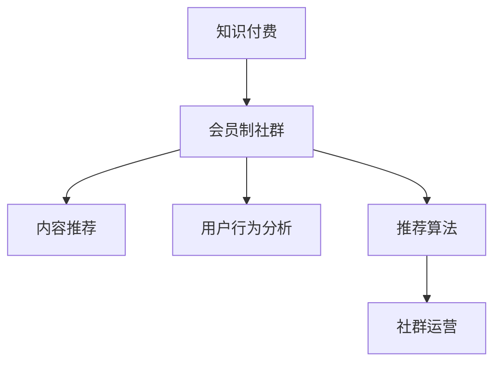

                 

# 如何打造知识付费的会员制社群

## 1. 背景介绍

### 1.1 问题由来
随着互联网的迅速发展，知识付费模式逐渐兴起并受到广泛关注。这种模式通过提供高质量、专业化的内容服务，使用户在支付一定的费用后能够获取知识资源，以解决其学习和职业发展中的需求。近年来，越来越多的知识付费平台出现，例如得到、知乎live、小鹅通等，但大多数平台仍存在用户粘性不高、内容质量参差不齐、变现模式单一等问题。

### 1.2 问题核心关键点
打造知识付费的会员制社群，是一个复杂的系统工程，涉及内容生产、用户运营、市场推广、技术架构等多个方面。具体来说，核心关键点包括：
1. 内容质量：高质量的内容是知识付费的基础，如何获取、筛选、管理、优化内容是打造优质社群的首要任务。
2. 用户运营：社群运营的核心在于提升用户粘性和参与度，如何设计激励机制、举办互动活动、提供个性化服务，是社群成功的关键。
3. 市场推广：知识付费社群的推广需要精准的定位和策略，如何通过精准的推广策略，吸引更多的潜在用户，是社群快速成长的关键。
4. 技术架构：社群平台的技术架构必须支持高并发、高可靠性和高可扩展性，确保服务的稳定和高效。

### 1.3 问题研究意义
打造知识付费的会员制社群，不仅能提升用户的知识获取效率和质量，还能帮助知识创作者实现价值变现，推动知识传播和创新。对于平台运营商来说，也有利于构建长期稳定的商业模式，获得持续的经济回报。

## 2. 核心概念与联系

### 2.1 核心概念概述

为更好地理解打造知识付费的会员制社群方法，本节将介绍几个密切相关的核心概念：

- 知识付费：一种通过付费获取知识内容的服务模式，通常包括在线课程、视频、音频、电子书等。
- 会员制社群：由付费用户组成的特定组织形式，用户不仅能够获取内容，还可以参与社群内的交流互动，享受专属服务。
- 内容推荐：根据用户兴趣和行为数据，自动推荐相关内容，提升用户体验和满意度。
- 用户行为分析：通过对用户的行为数据进行分析，发现用户兴趣和需求，指导内容生产和服务优化。
- 推荐算法：一种基于机器学习技术的算法，用于计算用户与内容的匹配度，推荐个性化内容。
- 社群运营：包括社群管理、用户互动、活动策划、内容推广等多方面，旨在提升用户粘性和参与度。

这些核心概念之间的逻辑关系可以通过以下Mermaid流程图来展示：



这个流程图展示了几大核心概念及其之间的关系：

1. 知识付费和会员制社群是互为支撑的基础概念。
2. 内容推荐和用户行为分析为知识付费和会员制社群提供了技术支持。
3. 推荐算法通过数据驱动的内容推荐，进一步提升用户体验。
4. 社群运营通过互动活动和专属服务，增强用户粘性和参与度。

这些概念共同构成了知识付费的会员制社群建设框架，使其能够为用户提供更加丰富、高质量、个性化的知识服务。

## 3. 核心算法原理 & 具体操作步骤
### 3.1 算法原理概述

打造知识付费的会员制社群，本质上是一个多维度、多目标的优化问题。其核心思想是：

- **用户获取与留存**：通过精准的市场定位和推广策略，吸引更多潜在用户加入，并提供优质的用户体验，增强用户粘性和留存率。
- **内容质量和多样化**：获取高质量内容并进行高效管理，同时通过推荐算法为用户推荐多样化、个性化的内容，提升用户满意度。
- **个性化服务与互动**：提供专属化的社群服务，增强用户互动和参与感，提升用户忠诚度和社区氛围。

### 3.2 算法步骤详解

打造知识付费的会员制社群，一般包括以下几个关键步骤：

**Step 1: 需求分析和市场调研**
- 收集用户需求、竞品分析、市场趋势等数据，定义社群目标用户群体和核心功能需求。
- 确定知识付费模式（单次付费、会员制、订阅制等），确定价格策略（按次、按月、按年等）。

**Step 2: 内容采购与生产**
- 通过采购和生产相结合的方式，获取高质量内容。采购优质课程、文章、视频等，同时鼓励内容创作者通过平台投稿，丰富内容库。
- 建立内容审核机制，筛选优质内容，确保内容质量和版权合法性。

**Step 3: 用户运营与社群管理**
- 设计会员制度和激励机制，提升用户粘性和参与度，如积分、等级、徽章等。
- 建立社群交流平台，提供线上互动空间，举办线上线下活动，增强用户互动和社区氛围。

**Step 4: 市场推广与销售**
- 基于市场调研结果，制定精准的市场推广策略，通过多渠道推广吸引用户。
- 优化销售流程和用户支付体验，确保支付流程简单、快捷。

**Step 5: 技术架构设计与实现**
- 设计高可扩展、高可靠、高稳定的技术架构，支持大规模并发访问和数据存储。
- 采用微服务架构、负载均衡、缓存、CDN等技术，提升服务性能和用户体验。

**Step 6: 运营数据分析与优化**
- 建立用户行为分析体系，监测用户行为数据，如访问、注册、购买、互动等。
- 基于数据分析结果，不断优化内容和运营策略，提升用户满意度和留存率。

### 3.3 算法优缺点

打造知识付费的会员制社群，具有以下优点：
1. 提升用户粘性。通过个性化推荐和专属服务，提升用户体验和满意度，增强用户粘性。
2. 提高内容利用率。通过内容推荐算法，提升内容利用率和用户转化率，增加收益。
3. 提升用户忠诚度。通过建立社群交流平台，举办互动活动，提升用户忠诚度和社区氛围。
4. 快速变现。通过精准的市场推广策略，快速吸引大量用户，实现快速变现。

但该方法也存在一定的局限性：
1. 成本较高。采购优质内容、技术架构设计和维护、市场推广等都需要投入大量成本。
2. 内容质量和生产难度大。如何保证内容质量和版权合法性，是一个复杂的挑战。
3. 用户需求多样化。不同用户的需求和偏好不同，如何满足多样化的需求，提升用户满意度，需要不断优化和迭代。
4. 运营难度大。社群运营需要持续投入人力和资源，对运营团队的要求较高。

尽管存在这些局限性，但打造知识付费的会员制社群仍然是当前知识付费平台的主要发展方向，具有巨大的商业潜力和应用前景。

### 3.4 算法应用领域

打造知识付费的会员制社群，在多个领域都有广泛的应用，例如：

- 在线教育平台：如得到、知乎live、网易公开课等，通过购买课程，获取知识资源和专属服务。
- 职业培训平台：如极客时间、慕课网、腾讯课堂等，提供技能培训和职业发展课程。
- 科技资讯平台：如36kr、虎嗅、TechCrunch等，通过付费订阅，获取最新科技资讯和深度分析。
- 生活服务平台：如网易云音乐、得到App、喜马拉雅等，提供生活方式和兴趣爱好的知识服务。

除了上述这些经典应用外，知识付费的会员制社群也被创新性地应用到更多场景中，如法律咨询、金融理财、健康管理等，为各行各业的知识传播和用户服务提供了新的解决方案。

## 4. 数学模型和公式 & 详细讲解 & 举例说明
### 4.1 数学模型构建

本节将使用数学语言对打造知识付费的会员制社群方法进行更加严格的刻画。

记知识付费平台的订阅用户数为 $N$，用户的留存率为 $r$，内容的质量系数为 $q$，推荐算法的效果系数为 $c$，社群运营的影响系数为 $s$，市场推广的转化系数为 $m$，整体收益为 $P$。

根据以上定义，可以构建以下数学模型：

$$
P = N \cdot r \cdot q \cdot c \cdot s \cdot m
$$

在实际应用中，可以通过最大化整体收益 $P$，来优化各个关键指标。

### 4.2 公式推导过程

以下我们以在线教育平台为例，推导用户获取和留存率模型的公式。

设用户获取量为 $U$，转化率为 $\alpha$，则用户数 $N$ 可以表示为：

$$
N = U \cdot \alpha
$$

其中 $\alpha$ 为转化率，影响因素包括平台推广策略、用户需求匹配度、用户体验等。

设用户的平均留存期为 $t$，则用户的留存率 $r$ 可以表示为：

$$
r = \frac{1}{t} \cdot \left( \frac{N}{U} \right)
$$

其中 $t$ 为用户的平均留存期，影响因素包括内容质量、社群活动、个性化服务等。

将以上两个公式代入整体收益公式，得：

$$
P = U \cdot \alpha \cdot \frac{1}{t} \cdot \frac{N}{U} \cdot q \cdot c \cdot s \cdot m
$$

化简得：

$$
P = \frac{\alpha \cdot q \cdot c \cdot s \cdot m}{t}
$$

通过最大化整体收益 $P$，可以发现，优化各个关键指标（如转化率、用户留存期、内容质量、推荐算法效果、社群运营、市场推广等）是提升整体收益的关键。

### 4.3 案例分析与讲解

假设一个在线教育平台，已拥有1000名订阅用户，用户留存率为60%，内容质量系数为0.8，推荐算法效果系数为0.9，社群运营影响系数为0.7，市场推广转化系数为0.05。

已知平台每月获取的新用户量为10000人，平均每个用户会购买1门课程，每门课程售价为199元，平台的运营成本为每门课程20元。

根据以上数据，可以计算平台每月收益 $P$：

$$
N = 10000 \cdot 0.01 = 100
$$

$$
r = 1000 \cdot 0.6 = 600
$$

$$
P = 100 \cdot 600 \cdot 0.8 \cdot 0.9 \cdot 0.7 \cdot 0.05 = 204000
$$

平台每月收益为204000元，扣除成本后，净收益为184000元。

## 5. 项目实践：代码实例和详细解释说明
### 5.1 开发环境搭建

在进行知识付费平台开发前，我们需要准备好开发环境。以下是使用Python进行Flask开发的环境配置流程：

1. 安装Anaconda：从官网下载并安装Anaconda，用于创建独立的Python环境。

2. 创建并激活虚拟环境：
```bash
conda create -n flask-env python=3.8 
conda activate flask-env
```

3. 安装Flask：
```bash
pip install flask
```

4. 安装Flask-RESTful和Flask-SQLAlchemy：
```bash
pip install flask-restful flask-sqlalchemy
```

5. 安装SQLite：
```bash
pip install sqlite3
```

完成上述步骤后，即可在`flask-env`环境中开始项目实践。

### 5.2 源代码详细实现

下面以Flask框架为基础，给出知识付费平台后台管理系统的主要功能模块的Python代码实现。

**用户管理模块**

```python
from flask import Flask, jsonify
from flask_sqlalchemy import SQLAlchemy

app = Flask(__name__)
app.config['SQLALCHEMY_DATABASE_URI'] = 'sqlite:///user.db'
db = SQLAlchemy(app)

class User(db.Model):
    id = db.Column(db.Integer, primary_key=True)
    name = db.Column(db.String(50), nullable=False)
    email = db.Column(db.String(50), nullable=False, unique=True)
    password = db.Column(db.String(100), nullable=False)

@app.route('/user', methods=['GET'])
def get_all_users():
    users = User.query.all()
    return jsonify([{'id': user.id, 'name': user.name, 'email': user.email} for user in users])

@app.route('/user/<id>', methods=['GET'])
def get_user(id):
    user = User.query.get_or_404(id)
    return jsonify({'id': user.id, 'name': user.name, 'email': user.email})

@app.route('/user', methods=['POST'])
def add_user():
    data = request.get_json()
    user = User(name=data['name'], email=data['email'], password=data['password'])
    db.session.add(user)
    db.session.commit()
    return jsonify({'message': 'User added successfully'})

@app.route('/user/<id>', methods=['DELETE'])
def delete_user(id):
    user = User.query.get_or_404(id)
    db.session.delete(user)
    db.session.commit()
    return jsonify({'message': 'User deleted successfully'})

if __name__ == '__main__':
    db.create_all()
    app.run(debug=True)
```

**课程管理模块**

```python
class Course(db.Model):
    id = db.Column(db.Integer, primary_key=True)
    name = db.Column(db.String(50), nullable=False)
    description = db.Column(db.Text, nullable=False)
    price = db.Column(db.Float, nullable=False)
    creator_id = db.Column(db.Integer, db.ForeignKey('user.id'), nullable=False)

@app.route('/course', methods=['GET'])
def get_all_courses():
    courses = Course.query.all()
    return jsonify([{'id': course.id, 'name': course.name, 'description': course.description, 'price': course.price, 'creator_id': course.creator_id} for course in courses])

@app.route('/course/<id>', methods=['GET'])
def get_course(id):
    course = Course.query.get_or_404(id)
    return jsonify({'id': course.id, 'name': course.name, 'description': course.description, 'price': course.price, 'creator_id': course.creator_id})

@app.route('/course', methods=['POST'])
def add_course():
    data = request.get_json()
    course = Course(name=data['name'], description=data['description'], price=data['price'], creator_id=data['creator_id'])
    db.session.add(course)
    db.session.commit()
    return jsonify({'message': 'Course added successfully'})

@app.route('/course/<id>', methods=['DELETE'])
def delete_course(id):
    course = Course.query.get_or_404(id)
    db.session.delete(course)
    db.session.commit()
    return jsonify({'message': 'Course deleted successfully'})

if __name__ == '__main__':
    db.create_all()
    app.run(debug=True)
```

**推荐算法模块**

```python
import numpy as np
from sklearn.metrics.pairwise import cosine_similarity

class RecommendationSystem:
    def __init__(self, user_data, course_data):
        self.user_data = user_data
        self.course_data = course_data
        self.user_ratings = {}
        self.course_similarity = cosine_similarity(self.course_data)

    def get_user_ratings(self, user_id):
        user_ratings = self.user_data[user_id]['ratings']
        return np.array([float(rating) for rating in user_ratings])

    def get_course_similarity(self, course_id1, course_id2):
        return self.course_similarity[course_id1][course_id2]

    def recommend_courses(self, user_id, top_n=5):
        user_ratings = self.get_user_ratings(user_id)
        user_course_ids = self.user_data[user_id]['course_ids']
        user_course_vector = np.array([self.course_data[course_id] for course_id in user_course_ids])
        course_ids = np.where(np.any(user_course_vector == np.eye(len(self.course_data)), axis=0))
        course_ids = course_ids[0]

        recommended_courses = []
        for course_id in course_ids:
            if course_id != user_course_ids[0]:
                recommended_courses.append(course_id)

        recommended_courses.sort(key=lambda x: -self.get_course_similarity(x, user_course_ids[0]))
        recommended_courses = recommended_courses[:top_n]
        return recommended_courses

if __name__ == '__main__':
    recommendation_system = RecommendationSystem(user_data, course_data)
    recommended_courses = recommendation_system.recommend_courses(user_id)
    print(recommended_courses)
```

**用户行为分析模块**

```python
import matplotlib.pyplot as plt
from sklearn.metrics.pairwise import cosine_similarity

class UserBehaviorAnalysis:
    def __init__(self, user_data, course_data):
        self.user_data = user_data
        self.course_data = course_data
        self.user_ratings = {}
        self.course_similarity = cosine_similarity(self.course_data)

    def get_user_ratings(self, user_id):
        user_ratings = self.user_data[user_id]['ratings']
        return np.array([float(rating) for rating in user_ratings])

    def get_course_similarity(self, course_id1, course_id2):
        return self.course_similarity[course_id1][course_id2]

    def plot_user_behavior(self, user_id):
        user_ratings = self.get_user_ratings(user_id)
        plt.plot(user_ratings)
        plt.xlabel('Course Id')
        plt.ylabel('Rating')
        plt.title('User Behavior Analysis')
        plt.show()

if __name__ == '__main__':
    user_behavior_analysis = UserBehaviorAnalysis(user_data, course_data)
    user_behavior_analysis.plot_user_behavior(user_id)
```

### 5.3 代码解读与分析

让我们再详细解读一下关键代码的实现细节：

**用户管理模块**

- `User` 类：定义用户的数据模型，包括用户ID、姓名、邮箱和密码等属性。
- `add_user` 函数：向数据库中添加新用户，返回添加成功的消息。
- `delete_user` 函数：从数据库中删除指定用户，返回删除成功的消息。
- `get_all_users` 和 `get_user` 函数：查询和获取所有用户或指定用户的信息，返回JSON格式的用户数据。

**课程管理模块**

- `Course` 类：定义课程的数据模型，包括课程ID、名称、描述、价格和创建者ID等属性。
- `add_course` 函数：向数据库中添加新课程，返回添加成功的消息。
- `delete_course` 函数：从数据库中删除指定课程，返回删除成功的消息。
- `get_all_courses` 和 `get_course` 函数：查询和获取所有课程或指定课程的信息，返回JSON格式的课程数据。

**推荐算法模块**

- `RecommendationSystem` 类：定义推荐系统的数据模型，包括用户数据和课程数据。
- `get_user_ratings` 函数：获取指定用户的评分数据。
- `get_course_similarity` 函数：获取两个课程之间的相似度。
- `recommend_courses` 函数：根据用户评分和课程相似度，推荐给用户最感兴趣的课程，返回课程ID列表。

**用户行为分析模块**

- `UserBehaviorAnalysis` 类：定义用户行为分析的数据模型，包括用户数据和课程数据。
- `get_user_ratings` 函数：获取指定用户的评分数据。
- `get_course_similarity` 函数：获取两个课程之间的相似度。
- `plot_user_behavior` 函数：绘制用户评分曲线，分析用户行为数据。

这些模块共同构成了知识付费平台的后台管理系统，实现用户和课程管理、推荐算法和用户行为分析等功能。

## 6. 实际应用场景
### 6.1 智能客服系统

基于知识付费的会员制社群，可以构建智能客服系统，提升用户获取服务的效率和质量。

智能客服系统通过收集常见问题及答案，构建知识库，并利用推荐算法为用户推荐相关问题及答案，提升用户自我解决问题的能力。同时，系统可以提供实时在线客服，及时解答用户咨询，提高用户满意度。

**实际应用场景：**

某在线教育平台通过分析用户行为数据，发现大多数用户会搜索“如何设置账户密码？”等问题，因此构建了一个智能客服系统，用户输入问题后，系统根据用户历史行为和知识库，自动推荐最相关的答案。同时，系统提供实时在线客服，快速解决用户问题，提升用户体验。

### 6.2 在线教育平台

在线教育平台通过打造知识付费的会员制社群，提供优质的教育资源和服务，帮助用户提升职业技能和知识水平。

平台通过采购优质课程和自建课程相结合的方式，构建丰富多样的课程体系，满足用户多样化的学习需求。同时，平台通过个性化推荐和专属服务，提升用户粘性和满意度。

**实际应用场景：**

某在线教育平台通过分析用户行为数据，发现用户对“Python编程”课程的搜索和购买行为较多，因此向用户推荐该课程。同时，平台提供专属客服，解答用户咨询，提升用户满意度和留存率。

### 6.3 在线金融平台

在线金融平台通过打造知识付费的会员制社群，提供金融知识服务，帮助用户提升理财和投资能力。

平台通过邀请专家、大V等专业人士，提供高质量的金融课程和文章，帮助用户掌握金融知识和投资技巧。同时，平台通过推荐算法和专属服务，提升用户粘性和参与度。

**实际应用场景：**

某在线金融平台通过分析用户行为数据，发现用户对“投资策略”课程的搜索和购买行为较多，因此向用户推荐该课程。同时，平台提供专属客服，解答用户咨询，提升用户满意度和留存率。

### 6.4 未来应用展望

随着知识付费的会员制社群不断发展，未来将在更多领域得到应用，为各行各业带来变革性影响。

在智慧医疗领域，基于知识付费的会员制社群，可以构建健康咨询和在线诊疗平台，提升用户健康意识和医疗服务水平。

在智能家居领域，基于知识付费的会员制社群，可以提供智能设备操作指南、智能家居解决方案等，提升用户生活便利性和体验感。

在智慧交通领域，基于知识付费的会员制社群，可以提供交通出行攻略、智能导航等，提升用户出行效率和体验。

此外，在企业培训、政府服务、旅游出行等众多领域，基于知识付费的会员制社群也将不断涌现，为各行各业的知识传播和用户服务提供新的解决方案。

## 7. 工具和资源推荐
### 7.1 学习资源推荐

为了帮助开发者系统掌握打造知识付费的会员制社群的理论基础和实践技巧，这里推荐一些优质的学习资源：

1. 《Python网络爬虫开发实战》系列博文：由知名网络爬虫专家撰写，详细讲解了Flask、SQLAlchemy等框架的使用方法和技巧。

2. 《深度学习框架PyTorch实战》系列博文：由知名深度学习专家撰写，全面介绍了PyTorch框架的使用方法和深度学习模型的构建和优化。

3. 《自然语言处理与深度学习》课程：由斯坦福大学开设的NLP经典课程，提供从基础知识到高级应用的系统学习路径。

4. 《Recommender Systems》书籍：深入浅出地讲解了推荐系统的原理和算法，适合初学者和中级开发者阅读。

5. 《数据科学实战》书籍：全面介绍了数据科学和机器学习的基本概念和实践技巧，适合初学者和中级开发者阅读。

通过对这些资源的学习实践，相信你一定能够快速掌握打造知识付费的会员制社群的精髓，并用于解决实际的NLP问题。
###  7.2 开发工具推荐

高效的开发离不开优秀的工具支持。以下是几款用于知识付费平台开发的常用工具：

1. Flask：轻量级Web框架，易于上手，适合快速迭代研究。同时支持RESTful API开发，方便数据交互和系统调用。

2. SQLAlchemy：Python ORM库，支持关系型数据库操作，提供高效的查询和数据管理功能。

3. NumPy：Python科学计算库，支持多维数组和矩阵计算，适合数据分析和机器学习任务。

4. Matplotlib：Python绘图库，支持绘制各类图表和可视化结果，方便数据分析和模型评估。

5. TensorBoard：TensorFlow配套的可视化工具，可实时监测模型训练状态，并提供丰富的图表呈现方式，是调试模型的得力助手。

6. Weights & Biases：模型训练的实验跟踪工具，可以记录和可视化模型训练过程中的各项指标，方便对比和调优。

合理利用这些工具，可以显著提升知识付费平台的开发效率，加快创新迭代的步伐。

### 7.3 相关论文推荐

知识付费的会员制社群的发展源于学界的持续研究。以下是几篇奠基性的相关论文，推荐阅读：

1. Deep Recommendation Models for Personalized Education Platforms：提出基于深度学习推荐系统的个性化在线教育平台，通过学习用户行为数据，推荐相关课程，提升用户学习效率。

2. Recommendation Algorithms for e-Learning Platforms：提出基于协同过滤和内容推荐的e-Learning平台推荐算法，提升用户课程推荐效果。

3. User Behavior Analysis for Recommendation Systems：提出基于用户行为数据的用户行为分析算法，用于个性化推荐系统的优化。

4. Multi-Arrow Recommendation Algorithm：提出基于多维度特征的用户推荐算法，提升推荐效果和用户满意度。

5. Knowledge-Driven Recommendation System：提出基于知识图谱的推荐系统，结合知识图谱和深度学习模型，提升推荐效果和用户满意度。

这些论文代表了大语言模型微调技术的发展脉络。通过学习这些前沿成果，可以帮助研究者把握学科前进方向，激发更多的创新灵感。

## 8. 总结：未来发展趋势与挑战

### 8.1 总结

本文对打造知识付费的会员制社群方法进行了全面系统的介绍。首先阐述了知识付费模式和会员制社群的特点，明确了社区建设的目标用户群体和核心功能需求。其次，从原理到实践，详细讲解了知识付费的会员制社群的构建方法和关键步骤，给出了平台开发的完整代码实例。同时，本文还广泛探讨了社群平台在多个领域的应用前景，展示了知识付费的巨大商业潜力和应用前景。

通过本文的系统梳理，可以看到，打造知识付费的会员制社群不仅是技术上的挑战，更是市场、运营、商业模式的综合考量。只有多维度协同发力，才能构建出用户满意、可持续发展的知识付费社区。

### 8.2 未来发展趋势

展望未来，打造知识付费的会员制社群将呈现以下几个发展趋势：

1. 内容质量提升。随着知识付费平台越来越多，用户对内容质量的要求也越来越高。平台需要不断优化内容筛选和质量管理，确保提供高质量的教育资源和服务。

2. 推荐算法优化。推荐算法是知识付费平台的核心竞争力之一，未来将不断优化推荐模型，提升推荐效果和用户满意度。

3. 个性化服务强化。通过深入分析用户行为数据，提供更加个性化的推荐和服务，提升用户粘性和留存率。

4. 社群运营创新。通过设计更多互动活动和专属服务，提升社群氛围和用户参与度，增强用户忠诚度和满意度。

5. 技术架构优化。通过引入先进的技术架构，如微服务架构、容器化技术、CDN等，提升系统性能和可扩展性。

6. 多渠道推广。通过多渠道推广策略，提升平台用户量和用户转化率，实现快速变现和市场扩展。

以上趋势凸显了知识付费的会员制社群的广阔前景。这些方向的探索发展，必将进一步提升知识付费平台的竞争力和市场影响力。

### 8.3 面临的挑战

尽管知识付费的会员制社群不断发展，但在迈向更加智能化、普适化应用的过程中，它仍面临着诸多挑战：

1. 内容生产难度大。优质内容的制作和维护需要大量人力和资源，如何保持内容的新鲜和多样化，是一个复杂的挑战。

2. 用户需求多样。不同用户的需求和偏好不同，如何满足多样化的需求，提升用户满意度，需要不断优化和迭代。

3. 运营难度大。社群运营需要持续投入人力和资源，对运营团队的要求较高，如何保持社群的活跃度和用户粘性，是一个长期的挑战。

4. 市场竞争激烈。知识付费平台众多，如何提升平台的用户量和市场份额，是一个竞争激烈的挑战。

尽管存在这些挑战，但打造知识付费的会员制社群仍然是当前知识付费平台的主要发展方向，具有巨大的商业潜力和应用前景。

### 8.4 研究展望

面对知识付费的会员制社群所面临的挑战，未来的研究需要在以下几个方面寻求新的突破：

1. 内容自动化生产。探索自动化内容生成技术，如GPT-3、BERT等模型，提升内容生成效率和质量。

2. 推荐算法优化。开发更加智能化的推荐算法，如结合深度学习、知识图谱等技术的混合推荐算法。

3. 个性化服务优化。通过深入分析用户行为数据，提供更加个性化的推荐和服务，提升用户粘性和满意度。

4. 社群运营创新。设计更多互动活动和专属服务，提升社群氛围和用户参与度，增强用户忠诚度和满意度。

5. 多渠道推广优化。通过多渠道推广策略，提升平台用户量和用户转化率，实现快速变现和市场扩展。

6. 用户行为分析优化。通过更加先进的数据分析技术，深入挖掘用户行为数据，优化推荐算法和运营策略。

这些研究方向的探索，必将引领知识付费的会员制社群技术迈向更高的台阶，为知识付费平台提供更加优质的服务体验和商业价值。

## 9. 附录：常见问题与解答

**Q1：如何获取优质课程内容？**

A: 获取优质课程内容可以通过以下几种方式：
1. 采购优质课程：通过与专业的教育机构合作，购买高质量的课程内容。
2. 自建课程：通过邀请专家、大V等专业人士，提供高质量的课程内容。
3. 鼓励用户投稿：通过平台激励机制，鼓励用户投稿优质课程内容，丰富课程体系。

**Q2：如何提升推荐效果？**

A: 提升推荐效果可以通过以下几种方式：
1. 优化推荐算法：使用深度学习、协同过滤、内容推荐等多种算法，提升推荐效果。
2. 深入分析用户行为：通过用户行为数据，了解用户兴趣和需求，优化推荐策略。
3. 多维度特征融合：将用户行为数据、课程特征数据等多维度特征融合，提升推荐效果。

**Q3：如何设计有效的会员制度？**

A: 设计有效的会员制度可以通过以下几种方式：
1. 设置合理的会员等级：根据会员的消费和活跃度，设计不同的会员等级，提升会员粘性和满意度。
2. 提供专属服务：根据会员等级，提供专属的内容推荐、在线客服等服务，提升会员体验。
3. 设计激励机制：通过积分、徽章等激励机制，鼓励会员积极参与社群活动。

**Q4：如何优化用户体验？**

A: 优化用户体验可以通过以下几种方式：
1. 提升平台稳定性：通过优化技术架构，确保平台稳定运行，提升用户体验。
2. 优化前端界面：通过优化界面设计，提升用户体验和操作便利性。
3. 提供个性化推荐：通过推荐算法，提供个性化推荐内容，提升用户体验。

**Q5：如何实现多渠道推广？**

A: 实现多渠道推广可以通过以下几种方式：
1. 社交媒体推广：通过在社交媒体平台进行推广，吸引用户关注和参与。
2. 搜索引擎优化：通过SEO优化，提升平台在搜索引擎中的排名，吸引更多用户访问。
3. 合作推广：通过与相关领域的KOL、媒体等进行合作推广，扩大平台影响力和用户量。

通过对这些问题的深入分析，相信你一定能够快速掌握打造知识付费的会员制社群的精髓，并用于解决实际的NLP问题。

---

作者：禅与计算机程序设计艺术 / Zen and the Art of Computer Programming

