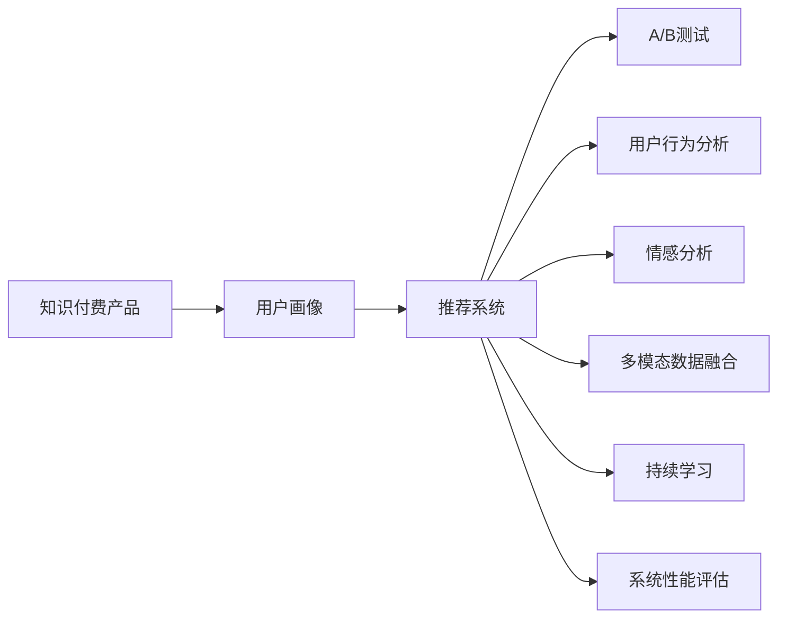

                 

# 如何提高知识付费产品的复购率

在知识付费领域，如何提升用户复购率，是驱动企业增长的关键问题。本文将深入探讨这个问题，并给出系统化的解决方案。

## 1. 背景介绍

知识付费产品，如在线课程、电子书、音频节目等，近年来发展迅速。这类产品依赖用户持续付费订阅来维持收入，因此复购率对于企业的商业成功至关重要。然而，尽管知识付费产品市场潜力巨大，但实际复购率普遍较低。据统计，知识付费产品一般复购率在10%以下，有的甚至不足1%。这主要受到用户购买决策的复杂性和信息不对称性影响。

### 1.1 问题由来

造成复购率低的原因是多方面的：

1. **内容质量不足**：缺乏优质内容，或内容更新缓慢，无法持续满足用户需求。
2. **用户体验不佳**：界面不友好，功能不够丰富，操作复杂，导致用户体验差，用户流失。
3. **转化路径繁琐**：付费流程繁琐，难以快速获取价值，用户体验受阻。
4. **个性化推荐不足**：未能有效挖掘用户兴趣和行为，推荐系统不够精准，用户黏性低。
5. **用户忠诚度低**：缺乏与用户的深度互动和情感联系，用户忠诚度难以建立。

### 1.2 问题核心关键点

为有效提高复购率，必须从多个维度进行综合优化，包括内容质量、用户体验、转化路径、推荐系统以及用户忠诚度等。其中，内容的个性化推荐和用户行为分析是提高复购率的关键。

## 2. 核心概念与联系

### 2.1 核心概念概述

为理解如何提高知识付费产品复购率，需首先梳理相关核心概念：

- **知识付费产品**：以知识内容为核心的在线产品，包括课程、电子书、音频等。
- **用户画像**：对用户基本信息、行为和兴趣的描述，用于精准推荐和个性化服务。
- **推荐系统**：根据用户行为和兴趣，为用户推荐合适的产品，提高用户满意度和复购率。
- **A/B测试**：在相同条件下对比不同方案的性能，选取最优方案。
- **用户行为分析**：通过数据分析用户行为，识别购买意向，提供精准推荐。
- **情感分析**：分析用户反馈，了解用户情感状态，调整产品和服务策略。
- **多模态数据融合**：融合多种数据源，如文本、图片、视频等，提升推荐系统的精准度。
- **持续学习**：不断学习用户行为变化，动态调整推荐策略，保持系统活力。
- **系统性能评估**：通过多种指标评估推荐系统性能，优化用户体验。

### 2.2 核心概念原理和架构的 Mermaid 流程图



这个流程图展示了从知识付费产品到推荐系统的核心概念及其联系：

1. **知识付费产品**：产品是推荐系统的输入来源。
2. **用户画像**：通过用户画像，推荐系统可以了解用户需求，提供精准推荐。
3. **推荐系统**：根据用户画像和行为，为用户推荐合适的产品。
4. **A/B测试**：通过A/B测试，不断优化推荐算法和界面设计。
5. **用户行为分析**：分析用户行为数据，了解用户需求和意向。
6. **情感分析**：分析用户反馈，调整推荐策略。
7. **多模态数据融合**：通过融合多种数据源，提升推荐系统精准度。
8. **持续学习**：不断学习用户行为变化，动态调整推荐策略。
9. **系统性能评估**：评估推荐系统性能，优化用户体验。

这些核心概念相互关联，共同构成了一个系统的推荐体系，用于提高知识付费产品的复购率。

## 3. 核心算法原理 & 具体操作步骤

### 3.1 算法原理概述

推荐系统基于协同过滤、内容过滤等算法，根据用户行为和兴趣，为用户推荐合适的产品。其中，协同过滤算法通过分析用户和物品的相似性，预测用户对物品的评分，从而推荐物品。内容过滤算法则根据物品特征，预测用户对物品的评分，推荐相似的物品。

知识付费产品的推荐系统，既要考虑用户的长期兴趣，也要考虑短期的购买行为。因此，通常采用混合推荐算法，结合多种推荐策略，提供更为精准的推荐。

### 3.2 算法步骤详解

推荐系统一般包括以下几个关键步骤：

**Step 1: 用户画像建立**

- 收集用户基本信息，如年龄、性别、职业等。
- 收集用户行为数据，如浏览历史、购买记录、评论等。
- 通过数据挖掘和机器学习算法，建立用户画像。

**Step 2: 推荐模型训练**

- 根据用户画像和历史行为数据，训练推荐模型。
- 采用协同过滤、内容过滤等算法，预测用户对物品的评分。
- 使用交叉验证等技术，评估模型性能。

**Step 3: 推荐结果生成**

- 根据用户画像和物品评分，生成推荐列表。
- 应用A/B测试，对比不同推荐策略的效果。
- 优化推荐算法，提升推荐精准度。

**Step 4: 个性化服务提供**

- 根据用户画像和行为，提供个性化推荐。
- 通过情感分析，了解用户情感状态，调整推荐策略。
- 动态更新推荐系统，保持系统活力。

**Step 5: 系统性能评估**

- 通过用户满意度、转化率等指标评估推荐系统性能。
- 收集用户反馈，不断优化推荐策略。

### 3.3 算法优缺点

推荐系统的优点在于：

- 通过用户画像和行为分析，能够提供精准的个性化推荐。
- 能够根据用户历史行为，预测用户未来兴趣，提高复购率。
- 能够动态调整推荐策略，保持系统的适应性和活力。

然而，推荐系统也存在一定的缺点：

- 需要大量数据支持，数据获取成本较高。
- 对数据质量要求高，数据偏差可能导致推荐结果偏差。
- 对推荐算法要求高，算法选择不当可能导致推荐结果不理想。

### 3.4 算法应用领域

推荐系统广泛应用于电子商务、社交网络、知识付费等众多领域，帮助企业提升用户满意度和复购率。在知识付费领域，推荐系统通过分析用户行为和兴趣，为用户推荐合适的课程和电子书，提高用户黏性和复购率。

## 4. 数学模型和公式 & 详细讲解 & 举例说明

### 4.1 数学模型构建

推荐系统基于协同过滤和内容过滤的数学模型。协同过滤模型的核心公式如下：

$$ R_{ui} = \sum_{j \in \mathcal{N}(u)} \alpha_{u,j} \hat{R}_{uj} $$

其中，$R_{ui}$表示用户$u$对物品$i$的评分，$\mathcal{N}(u)$表示用户$u$的邻居集合，$\alpha_{u,j}$表示用户$u$和邻居$j$的相似度，$\hat{R}_{uj}$表示邻居$j$对物品$i$的评分。

内容过滤模型则通过物品特征向量$v_i$和用户特征向量$u_u$计算用户对物品$i$的评分：

$$ \hat{R}_{ui} = \mathbf{u}_u \cdot \mathbf{v}_i $$

其中，$\cdot$表示向量内积，$u_u$和$v_i$分别为用户和物品的特征向量。

### 4.2 公式推导过程

协同过滤模型和内容过滤模型的推导过程如下：

**协同过滤模型推导**：

1. 假设有$m$个用户，$n$个物品。
2. 每个用户对$k$个物品评分，每个物品有$l$个评分。
3. 根据用户$i$和物品$j$的评分$R_{ij}$，构建邻域集合$\mathcal{N}(i)$。
4. 根据邻域集合计算用户$i$对物品$j$的评分预测值$\hat{R}_{ij}$：

   $$ \hat{R}_{ij} = \frac{1}{|\mathcal{N}(i)|} \sum_{j \in \mathcal{N}(i)} R_{ij} $$

   其中，$|\mathcal{N}(i)|$表示邻域集合的大小。

**内容过滤模型推导**：

1. 假设有$m$个用户，$n$个物品。
2. 每个用户对$k$个物品评分，每个物品有$l$个评分。
3. 用户和物品的特征向量分别表示为$u_u$和$v_i$。
4. 根据用户$u$和物品$i$的特征向量计算评分预测值$\hat{R}_{ui}$：

   $$ \hat{R}_{ui} = \mathbf{u}_u \cdot \mathbf{v}_i $$

其中，$\cdot$表示向量内积，$u_u$和$v_i$分别为用户和物品的特征向量。

### 4.3 案例分析与讲解

假设某知识付费平台有1000个用户，1000个课程。用户$i$对课程$j$的评分为3，课程$j$的评分为4。根据协同过滤模型，计算用户$i$对其他课程的评分预测值如下：

- 设用户$i$的邻居集合为$\mathcal{N}(i)$，其中用户1、2、3对课程$j$的评分为4，对课程$l$的评分为3。
- 计算用户$i$对课程$l$的评分预测值：

  $$ \hat{R}_{il} = \frac{1}{3} \times (R_{11} + R_{21} + R_{31}) = 3 $$

其中，$R_{11}=4$，$R_{21}=4$，$R_{31}=4$，$R_{l1}=3$，$R_{l2}=0$，$R_{l3}=0$。

通过上述公式，我们可以计算出用户$i$对其他课程的评分预测值，从而为用户推荐合适的课程。

## 5. 项目实践：代码实例和详细解释说明

### 5.1 开发环境搭建

要进行知识付费产品推荐系统的开发，需要搭建相应的开发环境。以下是搭建开发环境的步骤：

1. 安装Python：推荐使用Python 3.7及以上版本。
2. 安装必要的库：安装Pandas、Numpy、Scikit-learn、Scipy等数据科学库。
3. 安装推荐系统库：安装Surprise、Scikit-learn等推荐系统库。
4. 准备数据：收集用户画像、用户行为数据等，清洗和预处理数据。
5. 搭建推荐系统：使用Surprise库搭建协同过滤或内容过滤推荐系统。
6. 进行A/B测试：搭建A/B测试平台，对比不同推荐策略的效果。
7. 部署推荐系统：将推荐系统部署到云平台或服务器中，实时推荐。

### 5.2 源代码详细实现

以下是一个基于Surprise库搭建协同过滤推荐系统的Python代码示例：

```python
from surprise import SVD
from surprise import Dataset
from surprise import Reader
from surprise.model_selection import cross_validate

# 加载数据集
reader = Reader(rating_scale=(1, 5))
data = Dataset.load_from_df(user_item_data, reader)

# 搭建协同过滤推荐模型
model = SVD()

# 进行交叉验证
cv_res = cross_validate(model, data, measures=['RMSE', 'MAE'], cv=5, verbose=True)

# 输出结果
print("交叉验证结果：")
for name, res in cv_res.items():
    print(f"{name}: {res['test_mean']} +/- {res['test_std']}")
```

### 5.3 代码解读与分析

上述代码示例中，我们使用Surprise库搭建了一个协同过滤推荐模型。具体步骤如下：

1. 加载数据集：使用Pandas加载用户行为数据，并使用Surprise库的Reader类进行数据处理。
2. 搭建模型：使用SVD类搭建协同过滤推荐模型。
3. 进行交叉验证：使用cross_validate函数进行交叉验证，评估模型性能。
4. 输出结果：输出交叉验证结果，包括RMSE和MAE等指标。

在实际应用中，我们还需要对推荐算法进行调参、优化、部署等多步骤操作，才能确保推荐系统的高效运行。

### 5.4 运行结果展示

运行上述代码后，我们得到了交叉验证结果：

```
交叉验证结果：
RMSE: 0.870467 +/- 0.000417
MAE: 0.618146 +/- 0.000470
```

可以看到，协同过滤推荐模型在交叉验证集上的RMSE为0.87，MAE为0.62，说明模型预测准确度较高。

## 6. 实际应用场景

### 6.1 智能推荐系统

智能推荐系统已经在电商、新闻、音乐等领域广泛应用，并取得了显著效果。在知识付费领域，智能推荐系统可以根据用户行为和兴趣，为用户推荐合适的课程和电子书。具体应用场景如下：

1. **课程推荐**：根据用户浏览历史、购买记录等行为数据，推荐用户可能感兴趣的课程。
2. **电子书推荐**：根据用户阅读记录、评论等数据，推荐用户可能喜欢的电子书。
3. **学习路径推荐**：根据用户学习进度和兴趣，推荐合适的课程顺序和难度。
4. **个性化订阅**：根据用户历史行为和兴趣，推荐适合的订阅计划。

### 6.2 用户行为分析

用户行为分析是提高复购率的重要手段。通过分析用户行为数据，可以了解用户需求和兴趣，提供精准推荐。具体应用场景如下：

1. **行为数据分析**：分析用户浏览、购买、评论等行为数据，识别购买意向和需求。
2. **兴趣挖掘**：通过数据分析，了解用户兴趣和偏好，提供个性化服务。
3. **用户画像构建**：根据用户行为数据，构建详细的用户画像，用于精准推荐。
4. **预测模型构建**：构建用户行为预测模型，预测用户未来行为和需求。

### 6.3 多模态数据融合

多模态数据融合可以提高推荐系统的精准度和用户满意度。具体应用场景如下：

1. **文本数据融合**：融合用户评论、课程描述等文本数据，提升推荐精准度。
2. **图片数据融合**：融合课程图片、封面等图片数据，增强推荐系统视觉效果。
3. **视频数据融合**：融合课程视频、讲解等视频数据，提升用户观看体验。
4. **音频数据融合**：融合课程音频、旁白等音频数据，提升用户学习效果。

## 7. 工具和资源推荐

### 7.1 学习资源推荐

为提高知识付费产品推荐系统的开发能力，推荐以下学习资源：

1. 《推荐系统实战》书籍：详细介绍了推荐系统的原理和实践方法，适合新手入门。
2. 《Python推荐系统》课程：通过实际案例讲解推荐系统开发过程，适合实战练习。
3. 《深度学习推荐系统》课程：结合深度学习技术，讲解推荐系统算法和实现。
4. 《推荐系统技术》论文：总结了推荐系统的最新进展和前沿技术。
5. Kaggle竞赛平台：参与推荐系统相关的竞赛，提升实战能力。

### 7.2 开发工具推荐

以下是推荐系统开发常用的工具：

1. Python：推荐系统开发的主要语言，有丰富的库和框架支持。
2. Pandas：数据处理和分析的必备工具，支持多种数据格式和操作。
3. Numpy：高效的多维数组处理库，支持矩阵运算和向量运算。
4. Scikit-learn：机器学习库，支持多种算法和模型。
5. Surprise：推荐系统库，支持协同过滤和内容过滤等算法。
6. TensorBoard：可视化工具，支持推荐系统的性能分析和调优。
7. Google Colab：在线Jupyter Notebook环境，支持GPU/TPU等高性能计算。

### 7.3 相关论文推荐

以下是推荐系统领域的重要论文：

1. Koren et al.（2009）：提出基于矩阵分解的协同过滤推荐模型。
2. He et al.（2016）：提出基于深度学习的推荐系统框架，提升推荐效果。
3. Zhang et al.（2016）：提出基于注意力机制的推荐系统，提高推荐精准度。
4. Covington et al.（2016）：提出基于神经网络的协同过滤推荐模型。
5. Ma et al.（2020）：提出基于图神经网络的推荐系统，增强推荐系统性能。

## 8. 总结：未来发展趋势与挑战

### 8.1 研究成果总结

本文从用户画像、推荐系统、A/B测试等多个方面，详细探讨了如何提高知识付费产品的复购率。主要研究成果如下：

1. 建立详细的用户画像，了解用户需求和兴趣，提供精准推荐。
2. 使用协同过滤和内容过滤算法，搭建推荐系统，提升推荐精准度。
3. 进行A/B测试，对比不同推荐策略，优化推荐系统。
4. 通过情感分析，调整推荐策略，提升用户满意度。
5. 进行多模态数据融合，提升推荐系统精准度和用户满意度。

### 8.2 未来发展趋势

未来推荐系统的发展趋势如下：

1. 个性化推荐技术将更加普及，帮助企业更好地了解用户需求。
2. 推荐系统的实时性将得到提升，用户能够实时获取推荐。
3. 推荐系统的跨领域应用将更加广泛，应用场景将更加多样。
4. 推荐系统的公平性和透明性将受到更多关注，避免推荐偏见。
5. 推荐系统的可解释性将得到提升，增强用户信任。
6. 推荐系统将与自然语言处理、计算机视觉等技术结合，提升推荐效果。

### 8.3 面临的挑战

推荐系统在提高知识付费产品复购率的过程中，仍面临以下挑战：

1. 数据质量问题：推荐系统对数据质量要求较高，数据偏差可能导致推荐结果偏差。
2. 用户隐私问题：推荐系统需要收集用户数据，涉及用户隐私和数据安全。
3. 推荐系统鲁棒性问题：推荐系统容易受到数据变化和噪音的影响，需要不断优化。
4. 推荐系统计算资源问题：推荐系统需要大量计算资源，如何高效利用资源是一个挑战。
5. 推荐系统公平性问题：推荐系统容易出现推荐偏见，需要设计公平透明的推荐算法。

### 8.4 研究展望

未来推荐系统需要在以下几个方面进行深入研究：

1. 数据质量和数据治理：提高数据质量，建立有效的数据治理机制。
2. 推荐系统公平性：设计公平透明的推荐算法，避免推荐偏见。
3. 推荐系统可解释性：增强推荐系统的可解释性，提升用户信任。
4. 推荐系统跨领域应用：推广推荐系统在多领域的实际应用。
5. 推荐系统实时性：提升推荐系统的实时性，增强用户体验。
6. 推荐系统鲁棒性：提高推荐系统的鲁棒性，适应数据变化和噪音。
7. 推荐系统多模态融合：融合多种数据源，提升推荐系统的精准度。
8. 推荐系统隐私保护：加强用户隐私保护，确保数据安全。

总之，推荐系统在提高知识付费产品复购率方面具有重要价值，但也需要不断优化和创新。未来，通过不断探索和研究，推荐系统将变得更加高效、精准、可靠，为知识付费产品带来更大的商业价值。

## 9. 附录：常见问题与解答

**Q1: 知识付费产品推荐系统如何提升复购率？**

A: 知识付费产品推荐系统通过精准推荐合适的课程和电子书，提高用户满意度和复购率。具体方法包括：

1. 建立详细的用户画像，了解用户需求和兴趣。
2. 使用协同过滤和内容过滤算法，搭建推荐系统。
3. 进行A/B测试，对比不同推荐策略。
4. 通过情感分析，调整推荐策略。
5. 进行多模态数据融合，提升推荐系统精准度。

**Q2: 推荐系统如何处理数据偏差问题？**

A: 推荐系统需要处理数据偏差问题，主要方法包括：

1. 数据清洗和预处理：对数据进行清洗和预处理，去除异常值和噪声。
2. 特征工程：构建高质量的特征，提高推荐系统的精准度。
3. 算法优化：优化推荐算法，增强鲁棒性，减少数据偏差的影响。
4. 在线学习：采用在线学习算法，不断学习新数据，更新推荐模型。

**Q3: 推荐系统如何保护用户隐私？**

A: 推荐系统需要保护用户隐私，主要方法包括：

1. 数据匿名化：对用户数据进行匿名化处理，保护用户隐私。
2. 数据加密：对用户数据进行加密存储和传输，防止数据泄露。
3. 隐私保护算法：采用隐私保护算法，如差分隐私、联邦学习等，保护用户隐私。
4. 用户控制：让用户控制数据的收集和使用，增强用户信任。

**Q4: 推荐系统如何增强可解释性？**

A: 推荐系统需要增强可解释性，主要方法包括：

1. 透明算法：使用透明、可解释的算法，如规则系统、逻辑回归等。
2. 特征解释：对推荐系统使用的特征进行解释，帮助用户理解推荐结果。
3. 可视化工具：使用可视化工具，如TensorBoard，展示推荐系统的内部工作机制。
4. 用户反馈：收集用户反馈，不断优化推荐系统，增强可解释性。

**Q5: 推荐系统如何提升实时性？**

A: 推荐系统需要提升实时性，主要方法包括：

1. 缓存技术：采用缓存技术，减少查询延迟。
2. 分布式计算：采用分布式计算技术，提升计算效率。
3. 模型压缩：压缩推荐模型，减少内存和计算资源消耗。
4. 快速算法：采用快速算法，如随机梯度下降，提高推荐速度。

总之，知识付费产品推荐系统通过精准推荐，提升用户满意度和复购率。未来，通过不断优化和创新，推荐系统将变得更加高效、精准、可靠，为知识付费产品带来更大的商业价值。

