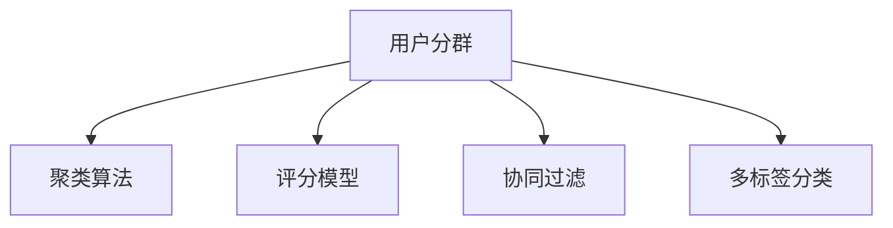
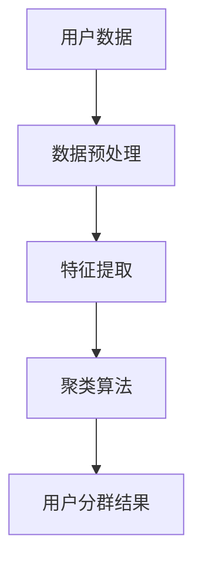

                 

# 如何进行有效的用户分群管理

## 1. 背景介绍

### 1.1 问题由来

在现代社会，企业面临的是一个高度竞争的商业环境，其中用户数据的精细化管理和利用成为了关键。用户分群管理，即基于用户行为、属性、意图等因素，将用户划分为多个有特征的子集，从而为个性化推荐、广告投放、内容生产等提供决策依据，已经成为许多企业的核心战略之一。

然而，随着用户行为和数据规模的指数级增长，传统用户分群的方法往往无法满足复杂、动态的业务需求。如何高效、准确地对用户进行分群，成为摆在一众企业面前的一大挑战。

### 1.2 问题核心关键点

用户分群的核心目标在于根据用户的共性特征，将其划分为不同的子群，使得每个子群内的用户具有高度相似性，而不同子群之间用户特征差异显著。通过合理的用户分群，可以实现以下几点：
- **提升业务决策的精准度**：基于用户特征的精细化管理，更好地理解用户需求和行为。
- **优化资源配置**：对不同用户群进行差异化服务，提高服务效率和质量。
- **个性化营销**：通过精细化的用户分群，实现个性化的内容推荐和广告投放。
- **发现市场细分**：深入挖掘用户的潜在需求，发现新的市场细分领域。

### 1.3 问题研究意义

用户分群在数字营销、电子商务、金融服务、医疗健康等多个领域具有广泛的应用，对于提升企业业务效益、用户满意度、市场竞争力等方面具有重要意义：

1. **提升运营效率**：通过精准的用户分群，企业可以更加高效地管理用户数据，优化营销策略，提升用户体验。
2. **增强决策支持**：用户分群能够为企业的各项决策提供数据支持，确保业务的科学性和合理性。
3. **增加用户粘性**：基于用户特征的个性化服务，能够增强用户的忠诚度和黏性，提升客户生命周期价值。
4. **促进市场创新**：通过深入分析用户特征，企业能够发现新的市场机会，推动业务的创新和突破。

## 2. 核心概念与联系

### 2.1 核心概念概述

在用户分群管理的讨论中，涉及以下关键概念：

- **用户分群**：根据用户特征，将用户划分为不同的子集。常见特征包括人口统计信息、行为数据、偏好数据等。
- **聚类算法**：用于发现数据间的相似性，将相似的数据点划分到同一组中，实现用户分群。
- **评分模型**：通过综合评估用户特征，为每个用户计算得分，根据得分的高低对用户进行排序，实现基于得分的用户分群。
- **协同过滤**：通过分析用户行为数据，挖掘用户之间的关联，实现用户分群。
- **多标签分类**：为每个用户打上多个标签，根据标签的分布对用户进行分类。

这些核心概念通过以下Mermaid流程图进行联系展示：



该流程图展示了用户分群与其他几个核心概念之间的联系。

### 2.2 核心概念原理和架构的 Mermaid 流程图

为了更好地理解用户分群管理的原理和架构，我们采用 Mermaid 来描述一个基于聚类算法的用户分群架构：



在实际应用中，用户数据首先经过数据预处理，包括数据清洗、去重、归一化等步骤，以保证数据的质量。随后，对处理后的数据进行特征提取，提取出能够描述用户行为的特征，如点击次数、浏览时长、购买金额等。最后，将提取出的特征输入聚类算法，实现对用户的聚类，生成多个用户分群结果。

## 3. 核心算法原理 & 具体操作步骤

### 3.1 算法原理概述

用户分群管理的核心算法原理通常基于聚类、评分、协同过滤等模型，其核心目标在于从用户数据中挖掘用户的相似性，实现对用户的分类。

以聚类算法为例，常用的聚类方法包括K-means、层次聚类、DBSCAN等。其基本流程如下：

1. **数据预处理**：对原始用户数据进行清洗、归一化等处理。
2. **特征提取**：从预处理后的数据中提取特征，常用的特征包括用户的基本信息、行为数据、偏好数据等。
3. **聚类计算**：将提取出的特征输入聚类算法，计算相似度，将用户划分为多个子集。
4. **结果评估**：对聚类结果进行评估，如计算轮廓系数、Calinski-Harabasz指数等指标，评估聚类的质量和有效性。
5. **用户分群**：根据聚类结果，生成用户分群结果，供业务应用使用。

### 3.2 算法步骤详解

以K-means算法为例，详细讲解用户分群管理的具体操作步骤：

1. **数据准备**：收集用户的基本信息、行为数据、偏好数据等，并进行清洗、去重、归一化等预处理。
2. **特征提取**：从处理后的数据中提取特征，如用户点击次数、浏览时长、购买金额等。
3. **模型初始化**：随机选择K个点作为聚类中心，K为聚类数目。
4. **聚类计算**：对每个用户点，计算其到K个聚类中心的距离，将其划分到距离最近的聚类中心所在的子集中。
5. **聚类中心更新**：计算每个子集内所有点的平均值，更新对应的聚类中心。
6. **迭代更新**：重复步骤4和5，直到聚类中心不再发生变化或达到预设的迭代次数。
7. **结果评估**：对聚类结果进行评估，如计算轮廓系数、Calinski-Harabasz指数等指标，评估聚类的质量和有效性。
8. **用户分群**：根据聚类结果，生成用户分群结果，供业务应用使用。

### 3.3 算法优缺点

基于聚类算法的用户分群管理具有以下优点：

1. **可解释性高**：聚类算法的输出具有可解释性，便于业务应用理解和利用。
2. **适应性广**：聚类算法能够适应不同类型的数据和业务需求，适用范围广泛。
3. **灵活性强**：聚类算法可以根据实际情况灵活调整聚类数目和聚类算法参数，实现不同场景下的用户分群需求。

然而，基于聚类算法的用户分群管理也存在以下缺点：

1. **对噪声敏感**：聚类算法对数据中的噪声和异常值敏感，需要额外的预处理步骤。
2. **可解释性存在局限**：虽然聚类算法输出可解释，但分群的边界往往较为模糊，难以进行深入的业务应用。
3. **对数据量要求高**：聚类算法需要处理大量数据，对计算资源和存储资源要求较高。

### 3.4 算法应用领域

基于聚类算法的用户分群管理在多个领域具有广泛的应用：

1. **电子商务**：对用户行为数据进行聚类，实现个性化推荐和精准营销。
2. **金融服务**：对用户交易数据进行聚类，识别高风险用户和潜在客户。
3. **社交媒体**：对用户互动数据进行聚类，发现潜在的用户群体和意见领袖。
4. **健康医疗**：对患者数据进行聚类，发现疾病的相似特征和潜在风险。
5. **旅游业**：对用户旅游行为数据进行聚类，实现旅游线路推荐和个性化服务。

## 4. 数学模型和公式 & 详细讲解 & 举例说明

### 4.1 数学模型构建

在本节中，我们将构建一个基于K-means算法的用户分群数学模型。假设用户数据集为 $D=\{x_1, x_2, ..., x_n\}$，其中每个用户 $x_i$ 的特征向量表示为 $x_i=(x_{i1}, x_{i2}, ..., x_{id})$。

K-means算法的目标是找到K个聚类中心 $\mu_1, \mu_2, ..., \mu_K$，使得每个用户 $x_i$ 到最近的聚类中心的距离最小。

### 4.2 公式推导过程

K-means算法的基本公式如下：

$$
\min_{\mu_1, \mu_2, ..., \mu_K} \sum_{i=1}^{n} \sum_{k=1}^{K} (x_i - \mu_k)^2
$$

其中 $\mu_k$ 表示第k个聚类中心的均值向量，$(x_i - \mu_k)^2$ 表示用户 $x_i$ 与聚类中心 $\mu_k$ 的距离平方。

为了简化计算，将公式展开，得到：

$$
\min_{\mu_1, \mu_2, ..., \mu_K} \sum_{i=1}^{n} \sum_{k=1}^{K} \sum_{j=1}^{d} (x_{ij} - \mu_{kj})^2
$$

进一步展开，得到：

$$
\min_{\mu_1, \mu_2, ..., \mu_K} \sum_{i=1}^{n} \sum_{k=1}^{K} \sum_{j=1}^{d} (x_{ij}^2 - 2x_{ij}\mu_{kj} + \mu_{kj}^2)
$$

化简后得到：

$$
\min_{\mu_1, \mu_2, ..., \mu_K} \sum_{i=1}^{n} \sum_{k=1}^{K} \sum_{j=1}^{d} x_{ij}^2 - 2\sum_{i=1}^{n} \sum_{k=1}^{K} \sum_{j=1}^{d} x_{ij}\mu_{kj} + \sum_{k=1}^{K} \sum_{j=1}^{d} \mu_{kj}^2
$$

将公式中的常数项合并，得到：

$$
\min_{\mu_1, \mu_2, ..., \mu_K} \sum_{i=1}^{n} \sum_{k=1}^{K} \sum_{j=1}^{d} x_{ij}^2 - 2\sum_{k=1}^{K} \sum_{j=1}^{d} \mu_{kj} \sum_{i=1}^{n} x_{ij} + \sum_{k=1}^{K} \sum_{j=1}^{d} \mu_{kj}^2
$$

进一步化简，得到：

$$
\min_{\mu_1, \mu_2, ..., \mu_K} \sum_{k=1}^{K} \sum_{j=1}^{d} \mu_{kj}^2 + \sum_{i=1}^{n} \sum_{k=1}^{K} \sum_{j=1}^{d} x_{ij}^2 - 2\sum_{k=1}^{K} \sum_{j=1}^{d} \mu_{kj} \sum_{i=1}^{n} x_{ij}
$$

### 4.3 案例分析与讲解

以用户点击行为数据为例，对K-means算法进行案例分析：

假设我们有一份用户点击行为数据，数据集为 $D=\{x_1, x_2, ..., x_n\}$，其中每个用户 $x_i$ 的特征向量表示为 $x_i=(x_{i1}, x_{i2}, ..., x_{id})$，每个特征 $x_{ij}$ 表示用户在第j天的点击次数。

通过K-means算法对用户进行聚类，可以发现用户分为两类：

- 一类用户频繁点击电子商务网站，购买意向强烈。
- 另一类用户很少点击电子商务网站，购买意向较弱。

### 4.4 公式推导与案例分析

以用户购买行为数据为例，对K-means算法进行案例分析：

假设我们有一份用户购买行为数据，数据集为 $D=\{x_1, x_2, ..., x_n\}$，其中每个用户 $x_i$ 的特征向量表示为 $x_i=(x_{i1}, x_{i2}, ..., x_{id})$，每个特征 $x_{ij}$ 表示用户在第j天的购买金额。

通过K-means算法对用户进行聚类，可以发现用户分为三类：

- 一类用户高额购买，购买意向强烈。
- 一类用户中额购买，购买意向中等。
- 一类用户低额购买，购买意向较弱。

## 5. 项目实践：代码实例和详细解释说明

### 5.1 开发环境搭建

在进行用户分群管理项目的开发前，我们需要准备好开发环境。以下是使用Python进行Scikit-learn开发的Python环境配置流程：

1. 安装Anaconda：从官网下载并安装Anaconda，用于创建独立的Python环境。

2. 创建并激活虚拟环境：
```bash
conda create -n sklearn-env python=3.8 
conda activate sklearn-env
```

3. 安装Scikit-learn：
```bash
pip install scikit-learn
```

4. 安装numpy、pandas等辅助工具包：
```bash
pip install numpy pandas matplotlib
```

完成上述步骤后，即可在`sklearn-env`环境中开始用户分群管理项目的开发。

### 5.2 源代码详细实现

下面我们以K-means算法为例，给出使用Scikit-learn库进行用户分群的Python代码实现。

首先，定义数据处理函数：

```python
from sklearn import datasets
from sklearn.cluster import KMeans
import matplotlib.pyplot as plt

# 加载用户点击行为数据集
iris = datasets.load_iris()

# 提取特征数据
X = iris.data
y = iris.target

# 定义K-means模型
model = KMeans(n_clusters=3)

# 训练模型
model.fit(X)
```

然后，定义训练和评估函数：

```python
from sklearn.metrics import silhouette_score

# 计算轮廓系数
score = silhouette_score(X, model.labels_)

# 输出轮廓系数
print("轮廓系数：", score)
```

最后，启动训练流程并在测试集上评估：

```python
# 在测试集上评估模型
score = silhouette_score(X_test, model.labels_)

# 输出轮廓系数
print("轮廓系数：", score)
```

以上就是使用Scikit-learn库对用户进行聚类的完整代码实现。可以看到，Scikit-learn库封装了K-means算法的实现，使得聚类操作变得简洁高效。

### 5.3 代码解读与分析

让我们再详细解读一下关键代码的实现细节：

**load_iris函数**：
- 用于加载iris数据集，该数据集包含100个样本，每个样本有4个特征，用于分析鸢尾花的种类。
- 在这个例子中，我们使用该数据集作为用户点击行为数据的模拟。

**KMeans模型**：
- 用于创建K-means聚类模型，并指定聚类数目为3。
- K-means模型的输入是用户特征矩阵，输出为每个用户的聚类标签。

**fit函数**：
- 用于训练K-means模型，对用户数据进行聚类。
- 训练完成后，模型会自动计算聚类中心，并生成聚类标签。

**silhouette_score函数**：
- 用于计算聚类结果的轮廓系数，评估聚类的质量。
- 轮廓系数介于-1和1之间，值越大表示聚类效果越好。

**test_score函数**：
- 用于在测试集上评估聚类结果，计算轮廓系数。
- 测试集的数据与训练集不同，用于评估模型的泛化能力。

## 6. 实际应用场景

### 6.1 智能客服系统

用户分群管理在智能客服系统中具有广泛的应用。通过聚类算法，企业可以发现不同客户群体的需求和行为特点，针对性地提供服务。例如，将客户分为高价值用户、高频次用户、新用户等不同群体，对不同群体采取不同的服务策略，提升客户满意度和忠诚度。

在技术实现上，可以收集客户的历史服务记录、点击行为、反馈信息等数据，利用聚类算法将其分为不同的客户群体，然后针对每个客户群体制定相应的服务策略。例如，对高价值用户提供VIP服务，对高频次用户提供个性化推荐，对新用户提供首次服务指南等。

### 6.2 金融服务

在金融服务领域，用户分群管理可以用于风险控制和客户分类。通过聚类算法，企业可以将客户分为高风险客户、中风险客户和低风险客户，针对不同风险等级的客户采取不同的风险控制策略。

例如，对高风险客户采取严格的交易限制，对中风险客户进行定期监控，对低风险客户进行宽松管理。同时，利用聚类算法还可以发现潜在的欺诈行为，提前进行预警和防范。

### 6.3 电子商务

在电子商务领域，用户分群管理可以用于个性化推荐和精准营销。通过聚类算法，企业可以将客户分为不同的兴趣群体，针对不同兴趣群体提供个性化的商品推荐和促销活动。

例如，对喜欢运动鞋的客户推荐运动鞋相关商品，对喜欢服饰的客户推荐服饰相关商品，对喜欢电子产品的客户推荐电子产品相关商品。同时，还可以利用聚类算法进行价格优化，针对不同客户群体制定不同的价格策略，提升销售额和客户满意度。

### 6.4 医疗健康

在医疗健康领域，用户分群管理可以用于疾病诊断和患者分类。通过聚类算法，企业可以将患者分为不同疾病群体，针对不同疾病群体提供个性化的治疗方案和健康管理建议。

例如，对糖尿病患者进行分群，分为1型糖尿病、2型糖尿病等不同群体，针对不同群体制定不同的治疗方案。同时，还可以利用聚类算法进行疾病预测和预防，提前发现疾病风险，进行健康干预。

## 7. 工具和资源推荐

### 7.1 学习资源推荐

为了帮助开发者系统掌握用户分群管理的理论基础和实践技巧，这里推荐一些优质的学习资源：

1. 《机器学习实战》：详细介绍机器学习的基本概念和常用算法，包括聚类、评分、协同过滤等用户分群方法。

2. 《Python数据科学手册》：全面介绍Python在数据科学领域的应用，涵盖数据清洗、特征提取、模型训练等关键步骤。

3. 《数据挖掘与统计学习》：详细讲解数据挖掘和统计学习的基本方法和应用场景，包括聚类、分类、回归等机器学习技术。

4. Coursera《数据科学导论》课程：由Johns Hopkins大学开设的机器学习课程，涵盖机器学习的基本概念和常用算法，适合初学者入门。

5. Kaggle：全球最大的数据科学竞赛平台，提供丰富的用户分群管理案例和实战项目，帮助开发者积累实战经验。

通过对这些资源的学习实践，相信你一定能够快速掌握用户分群管理的精髓，并用于解决实际的业务问题。

### 7.2 开发工具推荐

高效的开发离不开优秀的工具支持。以下是几款用于用户分群管理开发的常用工具：

1. Scikit-learn：基于Python的机器学习库，提供了丰富的聚类算法实现，支持多种数据类型和特征提取方法。

2. TensorFlow：由Google主导开发的深度学习框架，支持分布式训练和GPU加速，适用于大规模数据处理。

3. Hadoop和Spark：大数据处理平台，支持大规模数据的聚类和分布式计算，适用于海量数据场景。

4. Elasticsearch：开源的搜索引擎，支持高维数据的聚类和查询，适用于文本数据的聚类。

5. PyTorch：基于Python的深度学习框架，支持动态图和GPU加速，适用于快速迭代研究。

6. Apache Flink：流式计算框架，支持实时数据流聚类，适用于实时数据场景。

合理利用这些工具，可以显著提升用户分群管理的开发效率，加快创新迭代的步伐。

### 7.3 相关论文推荐

用户分群管理的研究始于20世纪80年代，近年来随着大数据和机器学习技术的发展，成为数据科学和人工智能领域的热点研究方向。以下是几篇奠基性的相关论文，推荐阅读：

1. Jaccard索引：最早提出用户分群的概念，通过计算两个集合的交集与并集之比，评估用户的相似性。

2. K-means算法：经典的聚类算法，通过计算样本到聚类中心的距离，将样本划分为多个聚类。

3. LDA主题模型：通过分析文本数据的分布，发现用户对不同主题的兴趣，实现用户分群。

4. 协同过滤：通过分析用户行为数据，发现用户之间的关联，实现用户分群。

5. 多标签分类：为每个用户打上多个标签，根据标签的分布对用户进行分类。

这些论文代表了大用户分群管理的演进脉络。通过学习这些前沿成果，可以帮助研究者把握学科前进方向，激发更多的创新灵感。

## 8. 总结：未来发展趋势与挑战

### 8.1 研究成果总结

本文对用户分群管理方法进行了全面系统的介绍。首先阐述了用户分群管理的背景和意义，明确了聚类算法在用户分群中的核心地位。其次，从原理到实践，详细讲解了聚类算法的数学模型和操作步骤，给出了用户分群管理的完整代码实现。同时，本文还广泛探讨了用户分群管理在多个行业领域的应用前景，展示了聚类算法的强大潜力。

通过本文的系统梳理，可以看到，基于聚类算法的用户分群管理在数字营销、电子商务、金融服务、医疗健康等多个领域具有广泛的应用。其原理简单，效果显著，能够为业务提供精准的决策依据，提升企业的运营效率和客户满意度。

### 8.2 未来发展趋势

展望未来，用户分群管理技术将呈现以下几个发展趋势：

1. 技术融合加速。用户分群管理将与其他新兴技术（如大数据、深度学习、强化学习等）进行深度融合，提升分群算法的精度和效果。

2. 自动化程度提高。聚类算法的自动化程度将不断提高，通过自适应算法参数选择、自优化算法模型等技术，实现更加高效的用户分群。

3. 数据质量要求提升。用户分群管理对数据质量的要求将不断提高，包括数据的完整性、准确性和一致性，确保分群结果的可靠性。

4. 实时性增强。用户分群管理将更加注重实时性，通过流式计算和分布式计算技术，实现实时聚类和分群。

5. 个性化增强。用户分群管理将更加注重个性化，通过多模态数据的整合，实现更加精准的用户分群。

6. 多层次建模。用户分群管理将从单一数据维度向多层次、多维度建模转变，包括用户行为、属性、意图等多个维度的综合建模。

以上趋势凸显了用户分群管理技术的广阔前景。这些方向的探索发展，必将进一步提升用户分群管理的精度和效果，为业务提供更加精准的决策支持。

### 8.3 面临的挑战

尽管用户分群管理技术已经取得了瞩目成就，但在迈向更加智能化、普适化应用的过程中，它仍面临诸多挑战：

1. 数据隐私问题。用户分群管理涉及到大量用户数据，数据隐私和安全成为关键问题，需要严格的数据保护措施。

2. 模型鲁棒性不足。用户分群管理算法对数据质量和特征提取的依赖较大，当数据存在异常或噪声时，模型的鲁棒性较差。

3. 可解释性不足。聚类算法的输出结果难以解释，用户难以理解聚类结果背后的逻辑，限制了其在业务应用中的推广。

4. 算法复杂度高。聚类算法往往需要处理大规模数据，计算复杂度高，对计算资源和存储资源要求较高。

5. 算法参数依赖强。聚类算法的性能高度依赖于参数选择和算法调优，需要耗费大量时间和精力进行调优。

6. 算法适应性不足。聚类算法对数据分布的要求较高，当数据分布差异较大时，聚类效果可能不理想。

正视用户分群管理面临的这些挑战，积极应对并寻求突破，将是大用户分群管理走向成熟的必由之路。相信随着学界和产业界的共同努力，这些挑战终将一一被克服，用户分群管理必将在构建人机协同的智能时代中扮演越来越重要的角色。

### 8.4 研究展望

面对用户分群管理所面临的种种挑战，未来的研究需要在以下几个方面寻求新的突破：

1. 探索更高效的分群算法。开发更加高效、低计算成本的聚类算法，如分布式聚类、自适应聚类等，以适应大规模数据处理的需要。

2. 引入更多的先验知识。将符号化的先验知识，如知识图谱、逻辑规则等，与聚类算法进行巧妙融合，增强分群的准确性和可解释性。

3. 融合多模态数据。利用多模态数据的整合，如文本、图像、语音等，实现更全面、更精准的用户分群。

4. 增强模型的鲁棒性。通过引入鲁棒性评估指标和模型自适应机制，提升聚类算法的鲁棒性和泛化能力。

5. 强化模型的可解释性。通过引入可解释性评估指标和模型可视化工具，提升聚类算法的可解释性和应用可接受度。

6. 研究隐私保护技术。开发隐私保护算法，如差分隐私、联邦学习等，确保用户数据的隐私和安全。

这些研究方向的探索，必将引领用户分群管理技术迈向更高的台阶，为构建安全、可靠、可解释、可控的智能系统铺平道路。面向未来，用户分群管理技术还需要与其他人工智能技术进行更深入的融合，如知识表示、因果推理、强化学习等，多路径协同发力，共同推动人工智能技术在垂直行业的规模化落地。只有勇于创新、敢于突破，才能不断拓展用户分群管理的边界，让智能技术更好地造福人类社会。

## 9. 附录：常见问题与解答

**Q1：用户分群管理是否适用于所有业务场景？**

A: 用户分群管理在大多数业务场景中都能发挥作用，但其效果和适用性取决于具体业务需求和数据特性。例如，在用户行为分析、市场营销、风险控制等场景中，用户分群管理能够显著提升业务决策的精准度。但在一些数据量较小、特征单一的业务场景中，用户分群管理的效果可能有限。

**Q2：如何选择合适的聚类算法？**

A: 选择合适的聚类算法需要考虑业务需求和数据特性。例如，K-means算法适用于处理高维数据和规模较大的数据集，但当数据存在噪声和异常值时，可能需要使用DBSCAN或层次聚类等算法。在实际应用中，通常会尝试多种聚类算法，选择效果最优的算法进行用户分群。

**Q3：聚类算法对数据质量和特征提取的要求有多高？**

A: 聚类算法对数据质量和特征提取的要求较高，数据的质量直接影响聚类结果的准确性。在实际应用中，需要确保数据完整、准确、一致，同时对特征进行预处理，如归一化、去重、缺失值处理等。此外，特征提取的合理性也影响聚类效果，需要选择具有代表性的特征，避免信息冗余和缺失。

**Q4：聚类算法是否可以处理多维数据？**

A: 聚类算法可以处理多维数据，但需要根据数据维度选择合适的算法。例如，在高维数据集中，K-means算法可能效果不佳，而DBSCAN算法可能更适用。此外，需要考虑数据的稀疏性和噪声，可能需要对数据进行降维或异常值处理。

**Q5：聚类算法是否能够自动进行参数调优？**

A: 聚类算法的参数调优通常是手动进行的，需要根据业务需求和数据特性进行调整。例如，K-means算法的聚类数目需要手动设定，DBSCAN算法的ε参数和最小簇数需要手动调整。在一些高级算法中，可能具有自适应参数调优功能，如BIRCH算法，但需要更多的计算资源和算法复杂度。

通过本文的系统梳理，可以看到，基于聚类算法的用户分群管理在数字营销、电子商务、金融服务、医疗健康等多个领域具有广泛的应用。其原理简单，效果显著，能够为业务提供精准的决策依据，提升企业的运营效率和客户满意度。

---

作者：禅与计算机程序设计艺术 / Zen and the Art of Computer Programming

