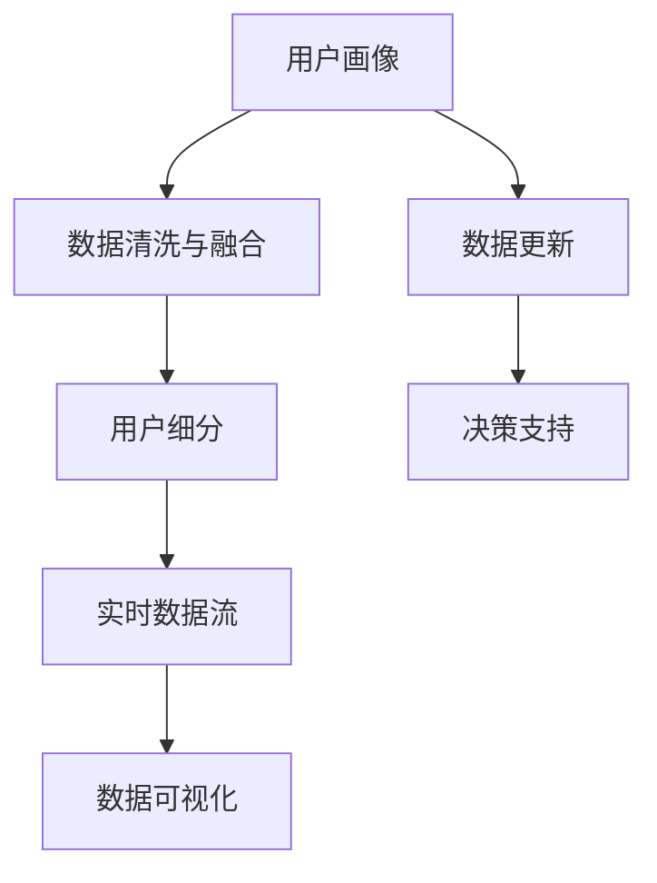

                 

# 如何进行有效的用户画像更新

> 关键词：用户画像, 用户行为分析, 数据清洗与融合, 数据可视化, 实时更新, 用户细分, 决策支持

## 1. 背景介绍

### 1.1 问题由来

在数字化时代，企业越来越依赖数据驱动的决策。用户画像作为用户数据挖掘与分析的重要成果，能够帮助企业精准理解用户需求，制定更有针对性的营销策略，优化产品设计和用户体验，提升企业竞争力。然而，构建和维护一个有效的用户画像是一项复杂的工程，需要不断对画像进行更新和优化。

当前用户画像的更新工作往往存在数据孤岛、数据质量参差不齐、用户细分不准确等问题，导致画像效果难以达到预期。因此，本文将深入探讨如何进行有效的用户画像更新，详细介绍更新流程、技术手段和应用实践，帮助企业构建更加精准、可靠的用户画像。

### 1.2 问题核心关键点

用户画像更新的核心在于如何充分利用各种数据源，进行数据清洗、融合、分析，构建准确的用户细分模型，并结合实时数据进行更新。主要问题包括以下几点：

- **数据收集与整合**：如何在多源异构数据之间建立关联，消除数据孤岛，形成完整、一致的用户数据体系。
- **数据清洗与处理**：如何识别和处理缺失、噪声、异常等数据问题，提高数据质量。
- **用户细分**：如何根据用户行为、属性等特征进行精准划分，构建稳定的用户细分模型。
- **数据可视化与交互**：如何通过可视化和交互手段，直观展示用户画像，便于业务人员理解和操作。
- **实时更新与维护**：如何结合最新数据进行实时更新，确保用户画像的时效性和准确性。
- **应用与决策支持**：如何将用户画像应用于产品、营销、客服等领域，支持业务决策。

通过解决这些问题，可以实现用户画像的持续优化和精细管理，满足企业数字化转型的需求。

## 2. 核心概念与联系

### 2.1 核心概念概述

为更好地理解用户画像的更新方法，本节将介绍几个关键概念：

- **用户画像(User Profile)**：通过对用户行为、属性等数据进行分析，构建出详细的用户档案，描述用户特征、兴趣、行为等。
- **数据清洗(Data Cleaning)**：指对数据源进行预处理，去除重复、错误、不一致等数据问题，提高数据质量。
- **数据融合(Data Integration)**：将来自不同数据源的数据进行整合，消除孤岛，形成一致的用户数据视图。
- **用户细分(User Segmentation)**：将用户群体按照某种标准进行划分，形成不同的用户群体，便于进行差异化营销和个性化服务。
- **实时数据流(Real-time Data Streams)**：通过数据采集和处理，实时更新用户画像，及时反映用户最新行为和状态。
- **数据可视化(Data Visualization)**：通过图表、仪表盘等形式，将数据可视化展示，便于直观理解数据和做出决策。

这些核心概念之间的逻辑关系可以通过以下Mermaid流程图来展示：



这个流程图展示出用户画像的更新流程：

1. 从多个数据源获取用户数据，并进行清洗和融合。
2. 根据数据特征对用户进行细分，形成稳定的用户群体。
3. 结合实时数据流，进行动态更新，保持用户画像的时效性。
4. 将用户画像可视化展示，支持决策支持。

## 3. 核心算法原理 & 具体操作步骤

### 3.1 算法原理概述

用户画像的更新是一个持续的数据驱动过程。主要包括以下几个步骤：

1. **数据收集与整合**：通过各种渠道收集用户数据，并进行数据清洗和融合，构建完整一致的用户数据体系。
2. **数据清洗与处理**：对数据进行去重、填充缺失值、处理异常值等操作，提升数据质量。
3. **用户细分**：使用聚类、分类等算法对用户进行划分，形成稳定的用户群体。
4. **实时数据流**：结合最新数据，实时更新用户画像，保持画像的时效性。
5. **数据可视化**：通过图表、仪表盘等形式，将用户画像进行可视化展示。
6. **决策支持**：将用户画像应用于产品、营销、客服等领域，支持业务决策。

### 3.2 算法步骤详解

#### 3.2.1 数据收集与整合

用户数据的收集可以通过多种方式进行：

- **直接采集**：通过用户在网站、APP、广告平台等上的行为数据进行采集。
- **第三方数据**：通过合作伙伴、供应商等获取外部数据，如社交媒体、公开数据等。
- **内部数据**：通过企业内部系统（如CRM、ERP）获取用户行为数据。

数据整合主要包括以下几个步骤：

1. **数据标准化**：对不同数据源的数据进行格式转换，使其符合统一的规范。
2. **数据关联**：将不同数据源中的用户ID、行为时间戳等信息关联起来，形成完整一致的用户数据视图。
3. **数据合并**：将来自不同数据源的数据进行合并，消除数据孤岛。

#### 3.2.2 数据清洗与处理

数据清洗的目的是提高数据质量，主要包括以下几个步骤：

1. **去重**：去除重复记录，确保数据唯一性。
2. **缺失值处理**：通过填充、删除等方式处理缺失值，提高数据完整性。
3. **异常值处理**：识别并处理异常值，避免对模型造成干扰。
4. **数据转换**：进行数据类型转换、归一化等操作，提升数据可用性。

#### 3.2.3 用户细分

用户细分是构建用户画像的重要步骤，主要包括以下几个算法：

1. **聚类算法**：如K-means、层次聚类等，将用户根据行为、属性等特征进行划分。
2. **分类算法**：如决策树、随机森林等，根据用户属性和行为预测其分类。
3. **关联规则**：如Apriori、FP-Growth等，通过分析用户行为数据，发现不同用户之间的关联关系。

#### 3.2.4 实时数据流

实时数据流通过不断收集最新数据，实时更新用户画像，主要包括以下几个步骤：

1. **数据采集**：通过API、消息队列等技术，实时收集用户数据。
2. **数据清洗**：对实时数据进行去重、缺失值处理等清洗操作。
3. **更新画像**：根据实时数据，更新用户画像，保持数据的时效性。

#### 3.2.5 数据可视化

数据可视化通过图表、仪表盘等形式，将用户画像展示出来，主要包括以下几个步骤：

1. **数据预处理**：对数据进行预处理，消除噪音和异常值。
2. **选择展示方式**：根据数据类型和业务需求，选择合适的图表类型，如柱状图、饼图、热力图等。
3. **交互设计**：通过交互手段，增强用户体验，如筛选、排序、搜索等。

#### 3.2.6 决策支持

决策支持主要通过用户画像，辅助业务决策，主要包括以下几个步骤：

1. **数据建模**：构建预测模型，如回归、分类、聚类等，分析用户行为和属性。
2. **可视化展示**：将模型结果进行可视化展示，便于理解。
3. **业务应用**：将模型结果应用于产品、营销、客服等领域，支持业务决策。

### 3.3 算法优缺点

用户画像更新方法的优缺点如下：

#### 优点

- **数据全面性**：通过多源数据整合，确保数据全面、一致，提升画像的准确性。
- **实时性**：结合实时数据流，能够动态更新用户画像，反映最新行为。
- **可视化展示**：通过可视化手段，直观展示用户画像，便于业务人员理解和操作。
- **决策支持**：结合用户画像，支持业务决策，提升业务效率和效果。

#### 缺点

- **数据隐私问题**：在数据收集和整合过程中，需要注意隐私保护，确保数据安全。
- **算法复杂性**：数据清洗、用户细分等算法复杂，需要较强的技术实力。
- **模型维护**：需要定期维护模型，更新算法，保持模型的时效性。
- **成本较高**：数据收集、数据清洗、算法实现等成本较高，需要投入较多资源。

### 3.4 算法应用领域

用户画像更新方法广泛应用于以下领域：

- **产品开发**：通过用户画像，了解用户需求和行为，优化产品设计和功能。
- **营销活动**：根据用户画像，进行精准营销，提升广告效果和ROI。
- **客户服务**：通过用户画像，提供个性化服务，提升客户满意度和忠诚度。
- **风险管理**：通过用户画像，识别高风险用户，进行风险控制和防范。

## 4. 数学模型和公式 & 详细讲解 & 举例说明

### 4.1 数学模型构建

用户画像更新涉及多个数学模型，主要包括以下几个模型：

1. **数据清洗模型**：用于处理数据缺失、异常等问题。
2. **用户细分模型**：用于将用户划分为不同的群体。
3. **预测模型**：用于预测用户行为和属性。
4. **实时更新模型**：用于实时更新用户画像。

### 4.2 公式推导过程

#### 4.2.1 数据清洗模型

数据清洗模型主要包括以下几个公式：

1. **去重公式**：
$$
G = D \cap R
$$
其中，$G$表示去重后的数据集，$D$表示原始数据集，$R$表示重复数据集。

2. **缺失值处理公式**：
$$
D' = D_{\text{complete}}
$$
其中，$D'$表示处理后的数据集，$D_{\text{complete}}$表示完整数据集。

3. **异常值处理公式**：
$$
D'' = D - V
$$
其中，$D''$表示处理后的数据集，$V$表示异常值集合。

#### 4.2.2 用户细分模型

用户细分模型主要包括以下几个公式：

1. **K-means算法公式**：
$$
k = \arg\min_{k} \sum_{i=1}^n \sum_{j=1}^m (x_{ij} - \mu_k)^2
$$
其中，$k$表示聚类数量，$x_{ij}$表示样本点，$\mu_k$表示聚类中心。

2. **决策树算法公式**：
$$
T = \arg\min_{T} \sum_{i=1}^n \ell(T, x_i, y_i)
$$
其中，$T$表示决策树，$\ell$表示损失函数，$x_i$表示样本特征，$y_i$表示样本标签。

#### 4.2.3 预测模型

预测模型主要包括以下几个公式：

1. **回归模型公式**：
$$
\hat{y} = \beta_0 + \sum_{i=1}^p \beta_i x_i
$$
其中，$\hat{y}$表示预测值，$\beta_0$表示截距，$\beta_i$表示回归系数，$x_i$表示自变量。

2. **分类模型公式**：
$$
P(y=1|x) = \frac{e^{\beta_0 + \sum_{i=1}^p \beta_i x_i}}{1 + e^{\beta_0 + \sum_{i=1}^p \beta_i x_i}}
$$
其中，$P(y=1|x)$表示预测结果为正类的概率，$e$表示自然常数。

#### 4.2.4 实时更新模型

实时更新模型主要包括以下几个公式：

1. **滑动窗口公式**：
$$
D_{\text{real}} = D - \Delta D
$$
其中，$D_{\text{real}}$表示实时数据集，$\Delta D$表示延时数据集。

2. **数据合并公式**：
$$
D_{\text{merged}} = D_{\text{merged}} \cup D
$$
其中，$D_{\text{merged}}$表示合并后的数据集，$D$表示新数据集。

### 4.3 案例分析与讲解

#### 案例1：电商用户画像更新

电商企业通过网站和APP收集用户行为数据，包括浏览、购买、评价等。为了构建用户画像，需要进行以下步骤：

1. **数据收集**：通过API、日志等方式收集用户行为数据，如浏览记录、购买记录、评价内容等。
2. **数据清洗**：去除重复记录，处理缺失值和异常值，确保数据完整性和准确性。
3. **数据整合**：将不同数据源中的用户ID、行为时间戳等信息关联起来，形成完整一致的用户数据视图。
4. **用户细分**：使用K-means算法，将用户根据浏览和购买行为进行聚类，形成稳定的用户群体。
5. **实时更新**：结合实时数据流，进行动态更新，保持用户画像的时效性。
6. **决策支持**：通过用户画像，优化产品推荐算法，提升转化率和用户满意度。

#### 案例2：金融用户画像更新

金融企业通过社交媒体、银行记录等渠道收集用户数据，包括基本信息、交易记录等。为了构建用户画像，需要进行以下步骤：

1. **数据收集**：通过API、API网关等方式收集用户数据，如社交媒体信息、银行交易记录等。
2. **数据清洗**：处理缺失值、异常值，确保数据完整性和准确性。
3. **数据整合**：将不同数据源中的用户ID、交易时间戳等信息关联起来，形成完整一致的用户数据视图。
4. **用户细分**：使用决策树算法，根据用户属性和交易记录进行分类，形成稳定的用户群体。
5. **实时更新**：结合实时数据流，进行动态更新，保持用户画像的时效性。
6. **决策支持**：通过用户画像，进行风险评估和客户管理，提升金融服务质量。

## 5. 项目实践：代码实例和详细解释说明

### 5.1 开发环境搭建

在进行用户画像更新实践前，我们需要准备好开发环境。以下是使用Python进行Pandas、NumPy、Scikit-Learn等库的环境配置流程：

1. 安装Anaconda：从官网下载并安装Anaconda，用于创建独立的Python环境。

2. 创建并激活虚拟环境：
```bash
conda create -n user_profile_env python=3.8 
conda activate user_profile_env
```

3. 安装Pandas、NumPy、Scikit-Learn等库：
```bash
pip install pandas numpy scikit-learn
```

4. 安装Jupyter Notebook：
```bash
pip install jupyter notebook
```

5. 配置Jupyter Notebook：
```bash
jupyter notebook --allow-root
```

完成上述步骤后，即可在`user_profile_env`环境中开始用户画像更新实践。

### 5.2 源代码详细实现

我们以电商用户画像更新为例，给出使用Pandas、NumPy、Scikit-Learn等库进行用户画像更新的PyTorch代码实现。

```python
import pandas as pd
import numpy as np
from sklearn.cluster import KMeans
from sklearn.ensemble import DecisionTreeClassifier

# 读取数据集
df = pd.read_csv('user_data.csv')

# 数据清洗
df = df.drop_duplicates()
df = df.fillna(method='ffill')
df = df.dropna()

# 数据整合
df['user_id'] = df['user_id'].astype(str)
df['purchase_time'] = pd.to_datetime(df['purchase_time'])
df = df.groupby(['user_id', 'purchase_time']).sum()

# 用户细分
X = df[['item_price', 'item_count']]
y = df['user_type']
kmeans = KMeans(n_clusters=4, random_state=42)
X_kmeans = kmeans.fit_predict(X)

# 实时更新
new_data = pd.read_csv('new_user_data.csv')
new_data['user_id'] = new_data['user_id'].astype(str)
new_data['purchase_time'] = pd.to_datetime(new_data['purchase_time'])
new_data = new_data.groupby(['user_id', 'purchase_time']).sum()
new_data = pd.merge(new_data, df, on=['user_id', 'purchase_time'], how='left')
new_data.fillna(method='ffill', inplace=True)
new_data['user_type'] = np.where(pd.isnull(new_data['user_type']), 'unknown', new_data['user_type'])

# 数据可视化
import matplotlib.pyplot as plt
import seaborn as sns

plt.figure(figsize=(10, 5))
sns.histplot(X_kmeans, bins=4)
plt.xlabel('User Cluster')
plt.ylabel('Count')
plt.title('User Cluster Distribution')
plt.show()

# 决策支持
from sklearn.ensemble import RandomForestRegressor

X = df[['item_price', 'item_count']]
y = df['revenue']
regr = RandomForestRegressor(n_estimators=100, random_state=42)
regr.fit(X, y)
y_pred = regr.predict(new_data[['item_price', 'item_count']])
print('Revenue Prediction:', y_pred)
```

以上代码实现了电商用户画像更新的主要步骤：

1. 读取用户数据集，进行数据清洗和整合。
2. 使用K-means算法对用户进行聚类，形成稳定的用户群体。
3. 结合实时数据，进行动态更新，保持用户画像的时效性。
4. 将用户画像用于预测用户购买金额，支持业务决策。

### 5.3 代码解读与分析

让我们再详细解读一下关键代码的实现细节：

**数据清洗**：
- `df = df.drop_duplicates()`: 去除重复记录。
- `df = df.fillna(method='ffill')`: 使用前向填充处理缺失值。
- `df = df.dropna()`: 删除缺失值过多的样本。

**数据整合**：
- `df['user_id'] = df['user_id'].astype(str)`: 将用户ID转换为字符串类型。
- `df['purchase_time'] = pd.to_datetime(df['purchase_time'])`: 将购买时间转换为日期时间类型。
- `df = df.groupby(['user_id', 'purchase_time']).sum()`: 对不同用户和购买时间进行聚合求和。

**用户细分**：
- `X = df[['item_price', 'item_count']]`: 提取特征变量。
- `y = df['user_type']`: 提取目标变量。
- `kmeans = KMeans(n_clusters=4, random_state=42)`: 创建K-means模型，指定聚类数量为4。
- `X_kmeans = kmeans.fit_predict(X)`: 对用户进行聚类，形成稳定的用户群体。

**实时更新**：
- `new_data = pd.read_csv('new_user_data.csv')`: 读取新数据集。
- `new_data['user_id'] = new_data['user_id'].astype(str)`: 将用户ID转换为字符串类型。
- `new_data['purchase_time'] = pd.to_datetime(new_data['purchase_time'])`: 将购买时间转换为日期时间类型。
- `new_data = new_data.groupby(['user_id', 'purchase_time']).sum()`: 对不同用户和购买时间进行聚合求和。
- `new_data = pd.merge(new_data, df, on=['user_id', 'purchase_time'], how='left')`: 将新数据和原有数据进行合并。
- `new_data.fillna(method='ffill', inplace=True)`: 使用前向填充处理缺失值。
- `new_data['user_type'] = np.where(pd.isnull(new_data['user_type']), 'unknown', new_data['user_type'])`: 将缺失值标记为'unknown'。

**数据可视化**：
- `plt.figure(figsize=(10, 5))`: 创建图形。
- `sns.histplot(X_kmeans, bins=4)`: 绘制直方图。
- `plt.xlabel('User Cluster')`: 设置X轴标签。
- `plt.ylabel('Count')`: 设置Y轴标签。
- `plt.title('User Cluster Distribution')`: 设置图形标题。

**决策支持**：
- `from sklearn.ensemble import RandomForestRegressor`: 导入随机森林回归模型。
- `X = df[['item_price', 'item_count']]`: 提取特征变量。
- `y = df['revenue']`: 提取目标变量。
- `regr = RandomForestRegressor(n_estimators=100, random_state=42)`: 创建随机森林回归模型，指定树的数量为100。
- `regr.fit(X, y)`: 训练模型。
- `y_pred = regr.predict(new_data[['item_price', 'item_count']])`: 预测新数据。

可以看到，Pandas、NumPy、Scikit-Learn等库在数据处理、建模和分析等方面提供了强大的支持，使得用户画像更新工作变得更加高效和灵活。

## 6. 实际应用场景

### 6.1 智能推荐系统

智能推荐系统是用户画像应用的重要场景，通过用户画像，可以精准推荐用户感兴趣的商品和服务，提升用户体验和转化率。

在实践中，智能推荐系统主要通过以下步骤：

1. **数据收集**：通过用户行为数据、社交网络数据等渠道，收集用户画像数据。
2. **数据清洗**：对数据进行去重、缺失值处理等操作，提升数据质量。
3. **数据整合**：将不同数据源中的用户ID、行为时间戳等信息关联起来，形成完整一致的用户数据视图。
4. **用户细分**：使用聚类算法，将用户根据行为特征进行划分，形成稳定的用户群体。
5. **实时更新**：结合实时数据，进行动态更新，保持用户画像的时效性。
6. **推荐算法**：结合用户画像，构建推荐模型，生成个性化推荐结果。

### 6.2 市场营销

市场营销通过用户画像，制定更加精准的营销策略，提升广告效果和ROI。

在实践中，市场营销主要通过以下步骤：

1. **数据收集**：通过社交媒体、网站日志等方式，收集用户数据。
2. **数据清洗**：处理缺失值、异常值，确保数据完整性和准确性。
3. **数据整合**：将不同数据源中的用户ID、行为时间戳等信息关联起来，形成完整一致的用户数据视图。
4. **用户细分**：使用分类算法，根据用户属性和行为进行分类，形成稳定的用户群体。
5. **实时更新**：结合实时数据，进行动态更新，保持用户画像的时效性。
6. **营销策略**：结合用户画像，制定个性化营销策略，提升广告效果和ROI。

### 6.3 客户服务

客户服务通过用户画像，提供个性化服务，提升客户满意度和忠诚度。

在实践中，客户服务主要通过以下步骤：

1. **数据收集**：通过客户服务记录、网站行为数据等方式，收集用户数据。
2. **数据清洗**：处理缺失值、异常值，确保数据完整性和准确性。
3. **数据整合**：将不同数据源中的用户ID、行为时间戳等信息关联起来，形成完整一致的用户数据视图。
4. **用户细分**：使用聚类算法，将用户根据行为特征进行划分，形成稳定的用户群体。
5. **实时更新**：结合实时数据，进行动态更新，保持用户画像的时效性。
6. **客户服务**：结合用户画像，提供个性化服务，提升客户满意度和忠诚度。

## 7. 工具和资源推荐

### 7.1 学习资源推荐

为了帮助开发者系统掌握用户画像的更新理论基础和实践技巧，这里推荐一些优质的学习资源：

1. 《用户画像：数据驱动的决策支持》系列博文：由数据科学家撰写，深入浅出地介绍了用户画像的基本概念、数据来源、建模方法等。

2. 《数据科学与机器学习》课程：斯坦福大学开设的顶级课程，系统讲解了数据清洗、数据融合、用户细分等技术。

3. 《用户画像技术与应用》书籍：系统介绍用户画像构建、维护和应用的方法，结合实际案例讲解。

4. Tableau用户画像应用指南：详细介绍了如何使用Tableau进行用户画像的数据可视化，提升决策支持效果。

5. Python用户画像实战指南：通过实际案例，讲解了使用Pandas、NumPy、Scikit-Learn等库进行用户画像的数据处理和建模。

通过对这些资源的学习实践，相信你一定能够快速掌握用户画像更新的精髓，并用于解决实际的业务问题。

### 7.2 开发工具推荐

高效的开发离不开优秀的工具支持。以下是几款用于用户画像更新的常用工具：

1. Pandas：用于数据处理、分析和可视化，支持多数据源的整合与清洗。

2. NumPy：用于数值计算和矩阵运算，提升数据处理和分析效率。

3. Scikit-Learn：用于机器学习建模和分析，支持多种算法的选择和应用。

4. Jupyter Notebook：用于数据科学和机器学习的交互式编程，方便数据处理和模型测试。

5. Tableau：用于数据可视化和交互分析，帮助业务人员直观理解数据和做出决策。

6. Power BI：用于数据可视化和报告生成，提升决策支持和业务分析的效果。

合理利用这些工具，可以显著提升用户画像更新的开发效率，加快创新迭代的步伐。

### 7.3 相关论文推荐

用户画像更新涉及多学科的交叉研究，以下是几篇奠基性的相关论文，推荐阅读：

1. "A Survey on User Profiling Techniques in Recommendation Systems"：综述了用户画像在推荐系统中的应用，详细介绍了聚类、分类、关联规则等算法。

2. "Data Mining and Statistical Learning for Marketing Applications"：介绍了数据挖掘和统计学习在市场营销中的应用，包括用户细分、行为预测等方法。

3. "User Profiling in Customer Relationship Management: A Survey"：综述了用户画像在客户关系管理中的应用，包括数据收集、清洗、建模等技术。

4. "Real-time User Profiling in Social Media Analysis"：介绍了实时用户画像在社交媒体分析中的应用，包括数据采集、清洗、更新等方法。

5. "A Framework for Mining User Profiles from Web Usage Logs"：提出了基于Web行为数据的用户画像构建方法，介绍了数据收集、清洗、建模等技术。

这些论文代表了大用户画像更新技术的发展脉络。通过学习这些前沿成果，可以帮助研究者把握学科前进方向，激发更多的创新灵感。

## 8. 总结：未来发展趋势与挑战

### 8.1 研究成果总结

本文对用户画像更新方法进行了全面系统的介绍，涵盖了数据收集与整合、数据清洗与处理、用户细分、实时数据流、数据可视化与交互等关键步骤，并通过实际案例进行了详细讲解。

通过本文的系统梳理，可以看到，用户画像的更新是一个复杂而系统的工程，需要多学科知识的融合和多源数据的整合。在未来，随着数据采集和处理技术的进步，用户画像的更新将变得更加自动化和智能化，能够更好地支持企业的数字化转型。

### 8.2 未来发展趋势

用户画像更新技术将呈现以下几个发展趋势：

1. **自动化与智能化**：随着AI技术的发展，自动化数据收集、清洗和分析将成为可能，智能化的用户画像构建将提升效率和效果。
2. **实时性与动态性**：结合实时数据流，用户画像将具备实时更新能力，能够动态反映用户最新行为和状态。
3. **多模态融合**：结合图像、语音、视频等多模态数据，用户画像将更加全面和准确。
4. **个性化与差异化**：通过深度学习等技术，用户画像将更加个性化和差异化，能够满足不同用户的不同需求。
5. **隐私保护与安全性**：在数据隐私保护和安全性方面，用户画像将更加注重数据匿名化、数据加密等技术手段。

### 8.3 面临的挑战

尽管用户画像更新技术已经取得了一定进展，但在实际应用中也面临诸多挑战：

1. **数据质量问题**：数据收集、清洗和整合过程中，数据质量问题难以完全避免，需要不断优化数据处理技术。
2. **算法复杂性**：用户细分的算法复杂，需要较强的技术实力和资源投入。
3. **实时性要求高**：结合实时数据流进行动态更新，需要高效的数据处理和存储技术。
4. **隐私保护问题**：在数据收集和处理过程中，需要严格遵守数据隐私保护法规，确保数据安全。

### 8.4 研究展望

面对用户画像更新所面临的挑战，未来的研究需要在以下几个方面寻求新的突破：

1. **自动化与智能化**：探索自动化数据处理和智能用户画像构建方法，提升效率和效果。
2. **实时性与动态性**：结合实时数据流，实现动态更新和实时反映用户行为。
3. **隐私保护与安全性**：研究数据隐私保护和安全性的新技术，确保用户数据安全。
4. **多模态融合**：探索多模态数据融合技术，提升用户画像的全面性和准确性。

这些研究方向将引领用户画像更新技术的进步，为企业的数字化转型提供强有力的数据支持。

## 9. 附录：常见问题与解答

**Q1：用户画像的构建和更新是否需要大规模数据？**

A: 用户画像的构建和更新需要数据支持，但数据规模并不是唯一的决定因素。在数据规模适中的情况下，通过数据清洗、整合、清洗等处理技术，可以构建较为准确的用户画像。但数据规模越大，用户画像的准确性和鲁棒性将越高。

**Q2：如何选择合适的用户细分算法？**

A: 用户细分算法的选取需要根据具体的业务需求和数据特征进行选择。常用的算法包括K-means、层次聚类、决策树、随机森林等。具体选择时，需要考虑数据特征、聚类数量、算法复杂度等因素，进行实验评估和选择。

**Q3：用户画像更新过程中如何处理数据隐私问题？**

A: 在数据收集和处理过程中，需要严格遵守数据隐私保护法规，如GDPR、CCPA等。可以采用数据匿名化、数据加密等技术手段，保护用户隐私和数据安全。

**Q4：用户画像更新过程中如何提升实时性？**

A: 结合实时数据流，进行动态更新，是提升用户画像实时性的关键。可以通过消息队列、数据缓存等技术手段，实现实时数据采集和处理。

**Q5：用户画像更新过程中如何提高数据质量？**

A: 数据质量问题可以通过数据清洗、数据去重、缺失值处理等技术手段进行解决。具体方法包括使用正则表达式、异常值检测、数据平滑等技术，提高数据完整性和准确性。

这些问题的解答，将帮助开发者更好地理解用户画像更新的方法和流程，提升数据处理和分析能力，构建更加准确、可靠的用户画像。

---

作者：禅与计算机程序设计艺术 / Zen and the Art of Computer Programming

