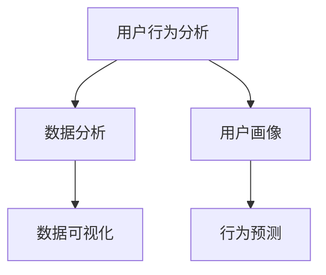

                 

# 如何进行有效的用户行为洞察

> 关键词：用户行为分析, 数据分析, 数据可视化, 用户画像, 行为预测, 数据科学

## 1. 背景介绍

### 1.1 问题由来

在数字经济时代，用户行为数据日益成为企业战略决策和市场竞争的重要资源。如何高效、准确地理解用户行为，洞察用户需求，预测市场趋势，成为企业亟需解决的难题。

### 1.2 问题核心关键点

通过大数据分析和人工智能技术，可以实现对用户行为的全方位、精准洞察。其中，用户行为分析是核心，数据分析和数据可视化是工具，用户画像和行为预测是目标。这一过程涉及数据清洗、特征工程、模型选择与训练、评估与优化等关键步骤。

### 1.3 问题研究意义

有效用户行为洞察不仅能提升企业对用户需求的理解深度，还能帮助企业优化产品设计和市场策略，提高用户体验和客户满意度，增强市场竞争力。通过对用户行为数据的全面分析，可以发现潜在用户群体，挖掘隐藏的市场机会，预测未来趋势，实现数据驱动的决策。

## 2. 核心概念与联系

### 2.1 核心概念概述

为更好地理解用户行为洞察的实现过程，本节将介绍几个关键概念：

- 用户行为分析(User Behavior Analysis, UBA)：通过对用户行为数据的全面分析，发现用户行为模式、需求和偏好，从而优化产品设计、提升用户体验。
- 数据分析(Analysis)：使用统计学、机器学习等方法对大量数据进行处理，提取有用的信息。
- 数据可视化(Data Visualization)：通过图表、仪表盘等形式，将数据转化为直观、易懂的视觉呈现。
- 用户画像(User Persona)：基于用户行为数据，构建用户特征描述，形成具体的用户角色模型。
- 行为预测(Predictive Analytics)：利用机器学习算法预测用户未来行为，如购买意向、流失风险等。

这些概念之间的联系可以通过以下Mermaid流程图来展示：



这个流程图展示了用户行为分析的全流程，从数据分析开始，到数据可视化呈现结果，最后形成用户画像，指导行为预测，形成闭环。

## 3. 核心算法原理 & 具体操作步骤
### 3.1 算法原理概述

用户行为洞察主要基于数据挖掘和机器学习技术，核心步骤包括数据预处理、特征工程、模型选择与训练、评估与优化等。通过这些步骤，可以从用户行为数据中提取有用的信息，形成用户画像，进行行为预测。

### 3.2 算法步骤详解

#### 3.2.1 数据预处理

数据预处理包括数据清洗、标准化、归一化、缺失值处理等步骤。数据清洗主要去除重复、异常值；标准化和归一化使不同特征的量纲统一，便于后续处理；缺失值处理则填补或剔除缺失数据，保证数据完整性。

#### 3.2.2 特征工程

特征工程是用户行为洞察的关键环节，通过特征选择、特征提取、特征变换等技术，将原始数据转化为模型可用的特征。常见的特征工程技术包括：

- 统计特征：如均值、方差、相关系数等，反映数据的统计特性。
- 文本特征：如TF-IDF、词频、n-gram等，用于分析用户评论、日志等文本数据。
- 时间特征：如时间戳、星期、季节等，用于分析用户行为的时序特性。
- 行为特征：如点击次数、停留时间、转化率等，反映用户行为模式。

#### 3.2.3 模型选择与训练

选择合适的机器学习模型是用户行为洞察的难点。常用的模型包括回归模型、分类模型、聚类模型、时间序列模型等。例如，线性回归、逻辑回归、决策树、随机森林、K-means聚类、ARIMA等。选择模型时需要考虑问题的类型、数据特性等因素。

在模型训练过程中，需要注意以下几个方面：

- 划分训练集、验证集、测试集，保证模型在不同数据上的泛化能力。
- 选择合适的超参数，如学习率、正则化系数、批次大小等，优化模型性能。
- 使用交叉验证等技术，避免模型过拟合或欠拟合。

#### 3.2.4 评估与优化

模型训练后，需要对模型进行评估和优化。常用的评估指标包括准确率、召回率、F1值、AUC等。模型优化包括超参数调优、模型融合、集成学习等技术。

### 3.3 算法优缺点

用户行为洞察的算法具有以下优点：

- 全面性：通过综合多种数据和技术手段，能够全面深入地分析用户行为，发现隐藏的需求和趋势。
- 准确性：通过精确的模型和算法，能够对用户行为进行准确的预测和推断。
- 动态性：能够实时更新和优化模型，快速响应用户需求变化。

同时，这些算法也存在以下局限性：

- 数据依赖：用户行为洞察的准确性依赖于数据的质量和完整性，数据偏差可能导致分析结果失真。
- 模型复杂度：模型选择和训练过程复杂，需要较高的技术和资源投入。
- 解释性不足：许多先进算法（如深度学习）缺乏可解释性，难以理解其内部工作机制。

### 3.4 算法应用领域

用户行为洞察技术广泛应用于以下几个领域：

- 电商零售：通过分析用户购买行为，预测购买意向，优化推荐系统，提升转化率。
- 金融服务：通过分析用户交易行为，预测风险，优化信贷决策，提升服务质量。
- 移动应用：通过分析用户使用行为，优化产品设计，提升用户粘性，提高用户满意度。
- 在线教育：通过分析学习行为，预测学习效果，优化课程内容，提升教学质量。
- 旅游酒店：通过分析旅游行为，预测旅行意向，优化行程规划，提升客户体验。
- 医疗健康：通过分析患者行为，预测疾病风险，优化诊疗方案，提升医疗服务。

以上领域展示了用户行为洞察技术的广泛应用，通过精准的用户行为分析，可以优化业务流程，提高用户满意度，增强市场竞争力。

## 4. 数学模型和公式 & 详细讲解  
### 4.1 数学模型构建

本节将使用数学语言对用户行为洞察的实现过程进行更加严格的刻画。

记用户行为数据集为 $D=\{(x_i, y_i)\}_{i=1}^N$，其中 $x$ 为输入特征，$y$ 为输出标签。假设问题为回归任务，目标为预测用户购买意向 $y$，基于数据集 $D$ 的回归模型为：

$$
\hat{y} = f(x;\theta)
$$

其中 $f$ 为回归函数，$\theta$ 为模型参数。假设回归模型为线性回归，即：

$$
\hat{y} = \theta_0 + \sum_{j=1}^p \theta_j x_{ij}
$$

其中 $\theta_0$ 为截距项，$\theta_j$ 为回归系数，$x_{ij}$ 为第 $i$ 个样本的第 $j$ 个特征。

### 4.2 公式推导过程

在线性回归中，模型参数 $\theta$ 的估计公式为：

$$
\hat{\theta} = (X^TX)^{-1}X^Ty
$$

其中 $X$ 为特征矩阵，$y$ 为标签向量。利用最小二乘法求解 $\hat{\theta}$，使损失函数 $L(\theta)$ 最小化：

$$
L(\theta) = \frac{1}{2N} \sum_{i=1}^N (y_i - \hat{y}_i)^2
$$

通过求解损失函数的极小值，得到最优模型参数 $\hat{\theta}$。

### 4.3 案例分析与讲解

以电商用户的购买行为预测为例，假设数据集 $D$ 包含用户基本信息、浏览历史、购买记录等特征。选择线性回归模型，用 $x_1$ 表示用户年龄，$x_2$ 表示用户收入，$x_3$ 表示用户浏览次数，$y$ 表示购买意向。回归模型的具体形式为：

$$
\hat{y} = \theta_0 + \theta_1 x_1 + \theta_2 x_2 + \theta_3 x_3
$$

假设数据集 $D$ 如表所示：

| UserID | Age | Income | Clicks | Purchase |
| --- | --- | --- | --- | --- |
| 1 | 25 | 50000 | 100 | 1 |
| 2 | 30 | 60000 | 50 | 1 |
| 3 | 28 | 45000 | 120 | 0 |
| 4 | 32 | 55000 | 80 | 0 |
| 5 | 35 | 70000 | 150 | 1 |

模型训练过程如下：

1. 数据预处理：标准化用户年龄、收入等数值型特征。
2. 特征工程：构建特征向量 $X$，如将年龄划分为几个年龄段。
3. 模型训练：使用最小二乘法求解 $\theta$，得到回归模型 $\hat{y}$。
4. 模型评估：计算均方误差（MSE）等指标评估模型性能。

最终得到模型 $\hat{y} = 0.1x_1 + 0.2x_2 + 0.3x_3$，可以预测新用户购买意向。

## 5. 项目实践：代码实例和详细解释说明
### 5.1 开发环境搭建

在进行用户行为洞察实践前，我们需要准备好开发环境。以下是使用Python进行Scikit-Learn开发的环境配置流程：

1. 安装Anaconda：从官网下载并安装Anaconda，用于创建独立的Python环境。

2. 创建并激活虚拟环境：
```bash
conda create -n behavior-analysis python=3.8 
conda activate behavior-analysis
```

3. 安装Scikit-Learn和其他相关库：
```bash
conda install scikit-learn pandas numpy matplotlib seaborn jupyter notebook ipython
```

4. 安装PyTorch和其他深度学习库（可选）：
```bash
conda install torch torchvision torchaudio
```

5. 安装各类工具包：
```bash
pip install jupyter nbconvert
```

完成上述步骤后，即可在`behavior-analysis`环境中开始用户行为洞察的实践。

### 5.2 源代码详细实现

下面我们以电商用户行为预测为例，给出使用Scikit-Learn进行回归模型的PyTorch代码实现。

首先，定义数据集和标签：

```python
import pandas as pd
from sklearn.model_selection import train_test_split

data = pd.read_csv('user_behavior.csv')
X = data[['Age', 'Income', 'Clicks']]
y = data['Purchase']

# 标准化特征
from sklearn.preprocessing import StandardScaler
scaler = StandardScaler()
X = scaler.fit_transform(X)

# 划分训练集和测试集
X_train, X_test, y_train, y_test = train_test_split(X, y, test_size=0.2, random_state=42)
```

然后，定义回归模型：

```python
from sklearn.linear_model import LinearRegression
from sklearn.metrics import mean_squared_error

model = LinearRegression()
model.fit(X_train, y_train)

# 预测测试集
y_pred = model.predict(X_test)

# 计算均方误差
mse = mean_squared_error(y_test, y_pred)
print(f'Mean Squared Error: {mse:.2f}')
```

最后，可视化结果：

```python
import matplotlib.pyplot as plt
import seaborn as sns

# 绘制回归曲线
plt.scatter(X_test, y_test, color='blue', label='Actual')
plt.plot(X_test, y_pred, color='red', label='Predicted')
plt.legend()
plt.show()

# 绘制残差图
residuals = y_test - y_pred
sns.scatterplot(x=X_test, y=residuals)
plt.xlabel('Input')
plt.ylabel('Residuals')
plt.show()
```

以上就是使用Scikit-Learn对电商用户行为进行回归模型预测的完整代码实现。可以看到，Scikit-Learn提供了强大的数据处理和机器学习工具，使得用户行为洞察的实践变得简洁高效。

### 5.3 代码解读与分析

让我们再详细解读一下关键代码的实现细节：

**数据预处理和特征工程**：
- 使用pandas库读取用户行为数据，标准化数值型特征。
- 将年龄划分为几个年龄段，增加特征维度。
- 使用train_test_split划分训练集和测试集，保证模型泛化能力。

**模型训练与评估**：
- 使用LinearRegression构建线性回归模型，fit方法进行模型训练。
- 计算均方误差，评估模型性能。

**可视化结果**：
- 使用matplotlib和seaborn库可视化回归曲线和残差图，直观展示模型预测效果。

可以看到，Scikit-Learn提供的函数式API使得用户行为洞察的实践变得简单易懂。开发者可以将更多精力放在数据处理和模型调参上，而不必过多关注底层实现细节。

当然，工业级的系统实现还需考虑更多因素，如模型保存和部署、超参数自动搜索、可视化仪表盘等。但核心的用户行为洞察流程基本与此类似。

## 6. 实际应用场景
### 6.1 电商推荐系统

电商推荐系统是用户行为洞察的重要应用场景之一。通过分析用户的购买历史、浏览行为等，推荐系统能够向用户推荐最适合的商品，提升用户满意度和购买转化率。

在技术实现上，可以收集用户的行为数据，构建用户画像，如年龄、性别、兴趣等。通过机器学习模型，预测用户对各类商品的购买意向，生成推荐列表。结合用户历史行为和实时反馈，不断调整推荐策略，形成个性化推荐。

### 6.2 金融风险管理

金融行业需要实时监测和预测用户的风险行为，及时预警和控制风险。通过分析用户的交易记录、行为模式等数据，可以构建用户画像，预测用户的风险等级和风险行为。

具体而言，可以收集用户的交易数据、社交网络信息等，构建用户画像，如收入、职业、社交关系等。通过机器学习模型，预测用户的风险等级和风险行为，如违约概率、交易频率等。实时监控用户行为，及时预警高风险用户，采取措施防范风险。

### 6.3 移动应用优化

移动应用优化是用户行为洞察的另一个重要应用场景。通过分析用户的下载、安装、使用等行为，优化应用的用户体验和功能设计。

具体而言，可以收集用户的下载数据、安装数据、使用数据等，构建用户画像，如年龄、性别、地域等。通过机器学习模型，分析用户的行为模式，预测用户的流失风险。根据用户画像和行为模式，优化应用功能，提升用户体验和留存率。

### 6.4 未来应用展望

随着数据量的不断增加和算力的提升，用户行为洞察技术将在更多领域得到应用，为传统行业带来变革性影响。

在智慧医疗领域，通过分析患者的行为数据，可以构建患者画像，预测疾病风险，优化诊疗方案，提升医疗服务。在智能教育领域，通过分析学生学习行为，可以预测学习效果，优化课程内容，提升教学质量。在智慧城市治理中，通过分析市民行为，可以优化城市规划和管理，提升城市智能化水平。

此外，在企业生产、社会治理、文娱传媒等众多领域，用户行为洞察技术也将不断涌现，为各行各业带来新的发展机遇。相信随着技术的日益成熟，用户行为洞察必将在构建智慧社会的各个方面发挥重要作用。

## 7. 工具和资源推荐
### 7.1 学习资源推荐

为了帮助开发者系统掌握用户行为洞察的理论基础和实践技巧，这里推荐一些优质的学习资源：

1. 《Python数据分析实战》书籍：详细介绍了使用Python进行数据处理和分析的基本方法，涵盖数据清洗、特征工程、模型选择与训练等关键技术。
2. 《数据科学实战》课程：斯坦福大学开设的高级数据科学课程，讲解数据分析和机器学习算法的实战应用。
3. 《用户行为分析》书籍：系统介绍了用户行为分析的理论和方法，包括数据挖掘、机器学习、用户画像等技术。
4. Kaggle平台：提供丰富的数据集和机器学习竞赛，帮助开发者积累实战经验。
5. Coursera平台：提供大量数据分析和机器学习课程，包括线性回归、决策树、随机森林等经典算法。

通过对这些资源的学习实践，相信你一定能够快速掌握用户行为洞察的精髓，并用于解决实际的业务问题。
###  7.2 开发工具推荐

高效的开发离不开优秀的工具支持。以下是几款用于用户行为洞察开发的常用工具：

1. Scikit-Learn：基于Python的开源机器学习库，提供了丰富的机器学习算法和数据处理工具，适合快速迭代研究。
2. TensorFlow：由Google主导开发的开源深度学习框架，生产部署方便，适合大规模工程应用。
3. PyTorch：基于Python的开源深度学习框架，灵活动态的计算图，适合快速迭代研究。
4. Weights & Biases：模型训练的实验跟踪工具，可以记录和可视化模型训练过程中的各项指标，方便对比和调优。
5. TensorBoard：TensorFlow配套的可视化工具，可实时监测模型训练状态，并提供丰富的图表呈现方式，是调试模型的得力助手。
6. Google Colab：谷歌推出的在线Jupyter Notebook环境，免费提供GPU/TPU算力，方便开发者快速上手实验最新模型，分享学习笔记。

合理利用这些工具，可以显著提升用户行为洞察的开发效率，加快创新迭代的步伐。

### 7.3 相关论文推荐

用户行为洞察技术的发展源于学界的持续研究。以下是几篇奠基性的相关论文，推荐阅读：

1. "A Survey of User Behavior Modeling in Recommendation Systems"（推荐系统用户行为建模综述）：介绍了推荐系统中的用户行为建模方法，包括协同过滤、内容过滤、混合模型等。
2. "User Modeling in Recommendation Systems"（推荐系统用户建模）：讨论了用户建模在推荐系统中的应用，包括用户画像、兴趣模型等。
3. "Predictive Analytics for Behavioral Insights"（行为洞察预测分析）：讨论了使用机器学习进行行为预测的方法，包括回归分析、分类算法、时间序列分析等。
4. "Context-aware User Modeling for Recommendation Systems"（推荐系统上下文感知用户建模）：讨论了基于上下文的用户建模方法，提升推荐系统的效果。
5. "Understanding the Clickstream of Online Retail"（理解在线零售点击流）：讨论了分析在线零售数据，预测用户购买意向的方法。
6. "Data Mining and Statistical Learning"（数据挖掘与统计学习）：系统介绍了数据挖掘和机器学习的基本方法和技术，适合深入理解用户行为洞察的算法原理。

这些论文代表了大语言模型微调技术的发展脉络。通过学习这些前沿成果，可以帮助研究者把握学科前进方向，激发更多的创新灵感。

## 8. 总结：未来发展趋势与挑战

### 8.1 总结

本文对用户行为洞察的实现过程进行了全面系统的介绍。首先阐述了用户行为洞察的研究背景和意义，明确了用户行为分析、数据分析、数据可视化、用户画像和行为预测等关键概念。其次，从原理到实践，详细讲解了用户行为洞察的数学模型和关键步骤，给出了用户行为洞察任务开发的完整代码实例。同时，本文还广泛探讨了用户行为洞察在电商零售、金融服务、移动应用等多个领域的应用前景，展示了用户行为洞察技术的巨大潜力。最后，本文精选了用户行为洞察技术的各类学习资源，力求为读者提供全方位的技术指引。

通过本文的系统梳理，可以看到，用户行为洞察技术正在成为数据科学和人工智能的重要范式，极大地拓展了数据分析的应用边界，催生了更多的落地场景。得益于大数据和先进算法的结合，用户行为洞察在各个领域展现出强大的生命力，为数字经济的持续发展提供了有力支撑。未来，伴随数据量的持续增加和算力的不断提升，用户行为洞察技术将更加广泛地应用于各行各业，推动数据驱动的决策和智能系统的构建。

### 8.2 未来发展趋势

展望未来，用户行为洞察技术将呈现以下几个发展趋势：

1. 数据规模持续增大。随着物联网、大数据技术的发展，用户行为数据将更加丰富多样，数据规模将持续增长。丰富的数据资源将为深度学习和机器学习提供更多训练样本，提升模型的准确性和泛化能力。
2. 算法多样化。用户行为洞察将涌现更多高效的算法，如深度强化学习、因果推断等，提高模型的解释性和鲁棒性。
3. 实时性增强。用户行为洞察将更多地结合流式数据处理技术，如Spark Streaming、Kafka等，实现实时分析和预测，提高决策的及时性。
4. 多模态融合。用户行为洞察将更多地结合图像、视频、语音等多模态数据，实现跨模态的用户行为分析，提升模型的全面性和智能性。
5. 可解释性提升。用户行为洞察将更加注重模型的可解释性，通过可视化、符号化等手段，增强模型的解释力和透明度。
6. 跨领域应用扩展。用户行为洞察将更多地应用于新领域，如医疗健康、智慧城市、智能制造等，提升各行各业的智能化水平。

以上趋势凸显了用户行为洞察技术的广阔前景。这些方向的探索发展，必将进一步提升用户行为洞察的性能和应用范围，为数字经济和智能化社会的构建提供有力支撑。

### 8.3 面临的挑战

尽管用户行为洞察技术已经取得了瞩目成就，但在迈向更加智能化、普适化应用的过程中，它仍面临着诸多挑战：

1. 数据隐私和安全。用户行为数据涉及个人隐私，如何保护用户隐私，防止数据泄露，是用户行为洞察面临的主要挑战。
2. 数据质量和完备性。用户行为数据的获取和处理过程中，容易出现数据缺失、噪音等问题，如何提升数据质量和完备性，是用户行为洞察的重要课题。
3. 模型复杂度。用户行为洞察涉及复杂的算法和模型，对技术和资源的要求较高，如何降低模型复杂度，提高模型的可解释性和可操作性，是未来研究的重点方向。
4. 实时性瓶颈。用户行为洞察在实时分析中的应用，需要高计算资源和高效的算法支持，如何实现实时高效的数据处理和模型训练，是提升用户体验的关键。
5. 跨领域应用难度。用户行为洞察在不同领域的应用，需要结合不同领域的特点和需求，如何设计合适的模型和算法，是实现跨领域应用的重要挑战。

这些挑战需要用户行为洞察技术的不断创新和改进，只有不断提升技术水平，才能适应不断变化的行业需求，推动技术的发展和应用。

### 8.4 研究展望

面对用户行为洞察所面临的种种挑战，未来的研究需要在以下几个方面寻求新的突破：

1. 数据隐私保护技术。开发更加安全和高效的隐私保护技术，保护用户隐私，防止数据滥用。
2. 数据质量提升技术。提升数据的采集和处理技术，确保数据的质量和完备性，减少数据偏差。
3. 模型简化和优化。开发更加简单高效、易于解释和操作的模型，提升模型的可操作性和实用性。
4. 跨领域融合技术。结合不同领域的特点和需求，设计更加灵活和高效的模型和算法，实现跨领域应用。
5. 实时性优化技术。优化数据处理和模型训练的算法，实现实时高效的数据处理和模型训练，提升实时性。
6. 用户行为洞察平台。构建用户行为洞察平台，整合各种数据和技术，提供一站式用户行为洞察解决方案，提升用户体验和决策效率。

这些研究方向的探索，必将引领用户行为洞察技术迈向更高的台阶，为构建智能化、普适化的智能系统提供有力支撑。只有勇于创新、敢于突破，才能不断拓展用户行为洞察的边界，让智能技术更好地造福社会。

## 9. 附录：常见问题与解答

**Q1：用户行为洞察是否适用于所有应用场景？**

A: 用户行为洞察在绝大多数应用场景中都能取得一定的效果，但有些场景由于数据特性或隐私保护要求，可能不太适用。例如，在金融风险控制等对隐私保护要求较高的领域，需要对数据进行严格的隐私保护处理，才能使用用户行为洞察技术。

**Q2：如何选择合适的特征工程方法？**

A: 选择合适的特征工程方法需要考虑数据的类型、问题的类型、模型的类型等因素。常见的特征工程方法包括统计特征、文本特征、时间特征、行为特征等。需要根据具体场景进行灵活选择和组合，以提升模型性能。

**Q3：用户行为洞察的预测精度如何保证？**

A: 用户行为洞察的预测精度依赖于数据的完备性、特征工程的质量、模型的选择和调参等。需要选择适当的模型，进行交叉验证，进行超参数调优，以提升模型预测精度。同时，需要注意数据偏差、模型过拟合等问题，保证预测结果的可靠性。

**Q4：用户行为洞察的实时性如何提升？**

A: 提升用户行为洞察的实时性需要优化数据处理和模型训练的算法，如采用流式数据处理技术、分布式计算技术、硬件加速技术等。同时，需要优化模型结构，减少计算量，实现高效的数据处理和模型训练。

**Q5：用户行为洞察的模型可解释性如何增强？**

A: 增强用户行为洞察的模型可解释性需要开发更加简单、易于理解、具有符号化解释的模型，如决策树、线性回归、朴素贝叶斯等。同时，需要结合可视化工具，如LIME、SHAP等，对模型进行解释和分析，提升模型的透明度和可信度。

这些问题的回答，有助于开发者更好地理解用户行为洞察的实现过程和应用挑战，在实际项目中更加得心应手。

---

作者：禅与计算机程序设计艺术 / Zen and the Art of Computer Programming

