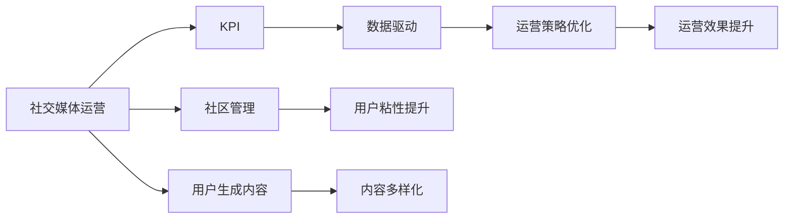

                 

# 如何进行有效的社交媒体运营

## 1. 背景介绍

随着移动互联网的普及和社交媒体的兴起，越来越多的企业将社交媒体作为品牌营销、用户互动和客户服务的核心渠道。然而，社交媒体运营不仅仅是发发帖子、回复评论那么简单，而是一个需要深入理解和运筹布局的复杂系统工程。本文章将从背景介绍、核心概念、算法原理、具体操作步骤、数学模型、案例分析、项目实践、实际应用、工具和资源推荐、总结及未来发展趋势与挑战等方面，系统阐述如何进行有效的社交媒体运营。

## 2. 核心概念与联系

### 2.1 核心概念概述

- **社交媒体运营（Social Media Operation）**：指企业在社交媒体平台上进行的一系列策划、执行、监测和优化活动，以实现品牌传播、客户互动、市场推广和客户服务等目标。
- **KPI（Key Performance Indicators）**：指用于衡量社交媒体运营效果的关键绩效指标，如点击率、参与度、转化率等。
- **数据驱动（Data-Driven）**：指基于数据分析结果，对社交媒体运营策略进行优化和调整。
- **社区管理（Community Management）**：指对社交媒体上的用户群体进行管理和引导，提升用户粘性和参与度。
- **用户生成内容（User-Generated Content, UGC）**：指用户主动在社交媒体上生成并分享的内容，如评论、分享、点赞等。

这些概念之间相互联系，共同构成了社交媒体运营的基础框架。通过理解这些核心概念，可以帮助我们系统性地进行社交媒体运营。

### 2.2 核心概念原理和架构的 Mermaid 流程图



## 3. 核心算法原理 & 具体操作步骤

### 3.1 算法原理概述

社交媒体运营的算法原理可以简单概括为以下几个步骤：

1. **数据采集**：收集社交媒体平台上的各类数据，如用户行为数据、内容数据等。
2. **数据分析**：利用数据挖掘、机器学习等技术，对采集到的数据进行分析，识别出有用的信息和模式。
3. **策略制定**：基于数据分析结果，制定出合理的运营策略，如内容发布计划、用户互动策略等。
4. **策略执行**：按照策略进行内容发布、用户互动等活动，监测运营效果。
5. **效果评估**：根据KPI等指标，评估运营效果，优化运营策略。

### 3.2 算法步骤详解

#### 3.2.1 数据采集

社交媒体运营的数据来源主要包括：

- **平台数据**：如点赞数、评论数、分享数、点击率等。
- **用户行为数据**：如访问路径、停留时间、点击位置等。
- **内容数据**：如帖子内容、标签、地理位置等。

#### 3.2.2 数据分析

社交媒体运营的数据分析主要包括以下步骤：

- **数据清洗**：去除噪音数据、缺失值等。
- **特征提取**：提取有意义的数据特征，如关键词频率、用户互动度等。
- **模型训练**：使用机器学习模型，如分类、回归、聚类等，对数据进行建模。

#### 3.2.3 策略制定

基于数据分析结果，制定出合理的运营策略：

- **内容策略**：如发布时间、频率、内容形式等。
- **互动策略**：如回复频率、互动方式、用户群体等。
- **监测策略**：如监测频率、工具选择等。

#### 3.2.4 策略执行

根据策略进行内容发布、用户互动等活动：

- **内容发布**：按照策略在社交媒体上发布内容。
- **用户互动**：根据策略回复用户评论、私信等。

#### 3.2.5 效果评估

根据KPI等指标，评估运营效果：

- **参与度**：如点赞数、评论数、分享数等。
- **转化率**：如点击率、购买率等。
- **客户满意度**：如用户反馈、投诉率等。

### 3.3 算法优缺点

#### 3.3.1 优点

1. **数据驱动**：基于数据分析结果，可以更科学地制定运营策略，提升效果。
2. **灵活性高**：社交媒体运营策略可以根据数据结果进行调整，具有高度的灵活性。
3. **资源利用率高**：通过数据分析，可以更精准地投入资源，提升ROI。

#### 3.3.2 缺点

1. **数据质量依赖性高**：运营效果受数据质量影响大，数据采集和处理成本较高。
2. **策略制定难度大**：需要综合考虑多方面因素，策略制定较为复杂。
3. **变化快**：社交媒体环境变化快，策略需要频繁调整。

### 3.4 算法应用领域

社交媒体运营的算法可以应用于多个领域，如：

- **品牌传播**：通过数据分析和策略制定，提升品牌知名度和影响力。
- **客户互动**：通过用户互动策略，提升客户满意度和忠诚度。
- **市场推广**：通过内容发布策略，吸引目标用户，提升转化率。
- **用户研究**：通过用户行为分析，了解用户需求和偏好，制定个性化策略。

## 4. 数学模型和公式 & 详细讲解 & 举例说明

### 4.1 数学模型构建

社交媒体运营的数学模型主要包括以下几个方面：

- **用户行为模型**：如用户访问路径、停留时间等。
- **内容效果模型**：如点击率、转化率等。
- **用户互动模型**：如回复率、参与度等。

### 4.2 公式推导过程

以点击率为例，推导其数学模型。

设 $x$ 为内容特征向量，$y$ 为点击标签（1表示点击，0表示未点击），则点击率 $p$ 可以用逻辑回归模型表示为：

$$ p(y=1|x;\theta) = \sigma(\theta^Tx) $$

其中 $\theta$ 为模型参数，$\sigma$ 为sigmoid函数。

### 4.3 案例分析与讲解

假设某电商平台的商品广告投放策略，通过分析历史投放数据，建立点击率预测模型。

- **数据采集**：收集投放广告的各类数据，如广告内容、目标用户、点击数等。
- **特征提取**：提取广告内容和目标用户的特征向量 $x$。
- **模型训练**：使用逻辑回归模型，对历史数据进行训练，得到模型参数 $\theta$。
- **效果评估**：对新投放的广告，根据预测模型输出点击概率，优化投放策略。

## 5. 项目实践：代码实例和详细解释说明

### 5.1 开发环境搭建

社交媒体运营的数据分析和模型训练，可以使用Python和常用的机器学习库，如Scikit-learn、TensorFlow、PyTorch等。以下是开发环境搭建的步骤：

1. **安装Python**：在操作系统上安装Python 3.x版本。
2. **安装Anaconda**：下载并安装Anaconda，用于创建虚拟环境和管理包。
3. **创建虚拟环境**：
```bash
conda create --name myenv python=3.8
conda activate myenv
```
4. **安装机器学习库**：
```bash
conda install scikit-learn
conda install tensorflow
conda install pytorch
```

### 5.2 源代码详细实现

以点击率预测模型为例，给出代码实现。

```python
import pandas as pd
from sklearn.model_selection import train_test_split
from sklearn.linear_model import LogisticRegression
from sklearn.metrics import roc_auc_score

# 加载数据
data = pd.read_csv('ad_click_data.csv')

# 特征提取
X = data[['ad_content', 'user_age', 'user_gender']]
y = data['click_label']

# 划分训练集和测试集
X_train, X_test, y_train, y_test = train_test_split(X, y, test_size=0.2, random_state=42)

# 建立逻辑回归模型
model = LogisticRegression()

# 训练模型
model.fit(X_train, y_train)

# 预测并评估
y_pred = model.predict_proba(X_test)[:, 1]
auc = roc_auc_score(y_test, y_pred)
print('AUC:', auc)
```

### 5.3 代码解读与分析

上述代码实现了基于逻辑回归模型的点击率预测。首先，通过Pandas库加载广告投放数据，提取特征和标签。然后，使用train_test_split函数将数据划分为训练集和测试集，使用LogisticRegression建立模型。最后，通过预测并评估模型的AUC值，评估模型效果。

## 6. 实际应用场景

### 6.1 品牌传播

社交媒体运营在品牌传播中的应用场景如下：

- **品牌推广**：通过发布高质量内容，提升品牌知名度和影响力。
- **用户互动**：通过与用户互动，建立品牌认知度和信任感。
- **数据分析**：通过分析用户行为数据，了解用户需求和偏好。

### 6.2 客户互动

社交媒体运营在客户互动中的应用场景如下：

- **用户反馈**：通过及时回复用户评论、私信等，提升客户满意度。
- **社区管理**：通过建立社区规则和引导，提升用户粘性和参与度。
- **活动策划**：通过策划线上活动，提升用户互动和品牌曝光。

### 6.3 市场推广

社交媒体运营在市场推广中的应用场景如下：

- **广告投放**：通过精准投放广告，吸引目标用户，提升转化率。
- **内容推广**：通过发布优质内容，提升品牌传播效果。
- **KOL合作**：通过与知名KOL合作，提升品牌曝光度和影响力。

### 6.4 用户研究

社交媒体运营在用户研究中的应用场景如下：

- **用户画像**：通过分析用户行为数据，建立用户画像。
- **需求分析**：通过用户互动数据，了解用户需求和偏好。
- **市场调研**：通过社交媒体数据分析，了解市场趋势和用户偏好。

## 7. 工具和资源推荐

### 7.1 学习资源推荐

1. **《社交媒体运营实战指南》**：详细介绍了社交媒体运营的各类技术和策略。
2. **Coursera《社交媒体营销》**：由知名教授讲解社交媒体运营的原理和实践。
3. **Medium《社交媒体运营的艺术》**：众多一线运营专家的经验分享，涵盖各种运营技巧。

### 7.2 开发工具推荐

1. **Hootsuite**：社交媒体管理工具，支持多平台内容发布和互动。
2. **Buffer**：内容管理和发布工具，支持多语言和跨平台内容管理。
3. **Google Analytics**：数据分析工具，用于监测社交媒体效果。

### 7.3 相关论文推荐

1. **《社交媒体营销策略分析与优化》**：研究社交媒体运营策略和效果评估。
2. **《基于社交媒体的客户关系管理》**：研究社交媒体在客户关系管理中的应用。
3. **《社交媒体数据分析与可视化》**：研究社交媒体数据挖掘和可视化技术。

## 8. 总结：未来发展趋势与挑战

### 8.1 研究成果总结

社交媒体运营的算法和实践已经取得了显著成果，但在数据质量、策略制定和效果评估等方面仍存在挑战。未来的研究将进一步提升数据质量，优化运营策略，增强效果评估的准确性。

### 8.2 未来发展趋势

社交媒体运营的未来发展趋势如下：

- **数据驱动**：数据质量和分析技术将进一步提升，数据驱动的运营策略将更加精准。
- **AI应用**：AI技术将进一步应用于社交媒体运营，提升运营效率和效果。
- **跨平台整合**：社交媒体平台将进一步整合，形成统一的用户画像和运营策略。
- **用户隐私保护**：用户隐私保护将成为重要课题，合规性和隐私保护将得到更多重视。

### 8.3 面临的挑战

社交媒体运营面临的挑战如下：

- **数据质量**：数据采集和处理成本高，数据质量不稳定。
- **策略复杂性**：运营策略制定复杂，需要综合考虑多方面因素。
- **效果评估**：KPI指标单一，难以全面评估运营效果。
- **用户互动**：用户互动频率低，难以提升用户粘性。

### 8.4 研究展望

未来，社交媒体运营的研究将进一步深入，探索新的技术和方法，提升运营效果和效率。研究将重点关注以下方面：

- **数据质量提升**：探索更加高效的数据采集和处理方法，提升数据质量。
- **策略优化**：研究更智能、更高效的运营策略制定方法。
- **效果评估**：研究更全面、更精确的运营效果评估方法。
- **用户互动**：研究新的用户互动方式，提升用户粘性和参与度。

## 9. 附录：常见问题与解答

**Q1：社交媒体运营需要哪些技能？**

A: 社交媒体运营需要以下技能：

- **数据分析**：能够处理和分析社交媒体数据，提取有用信息。
- **内容创作**：能够创作高质量的内容，吸引用户关注。
- **社区管理**：能够管理社交媒体上的用户群体，提升用户粘性。
- **策略制定**：能够制定合理的运营策略，提升运营效果。

**Q2：社交媒体运营的KPI指标有哪些？**

A: 社交媒体运营的KPI指标包括：

- **点击率**：用户点击广告或内容的比率。
- **转化率**：用户完成目标行为的比率，如购买、注册等。
- **参与度**：用户与内容互动的比率，如点赞、评论、分享等。
- **用户增长**：新用户的增长速度和数量。
- **用户粘性**：用户活跃度和留存率。

**Q3：如何优化社交媒体运营策略？**

A: 优化社交媒体运营策略的方法如下：

- **数据分析**：通过数据分析，了解用户行为和需求。
- **内容优化**：根据数据分析结果，优化内容形式和发布时间。
- **互动提升**：增加用户互动频率，提升用户粘性。
- **策略调整**：根据运营效果，调整策略，优化运营方案。

**Q4：社交媒体运营需要注意哪些法律和伦理问题？**

A: 社交媒体运营需要注意的法律和伦理问题包括：

- **隐私保护**：保护用户隐私，遵守数据保护法律法规。
- **版权问题**：避免使用侵权内容，保护原创权益。
- **信息真实性**：保证发布信息的真实性，避免误导用户。
- **合规性**：遵守平台规则和法律法规，确保运营合规。

**Q5：社交媒体运营如何应对平台变化？**

A: 社交媒体平台变化时，运营策略需要及时调整，具体方法包括：

- **监控变化**：及时关注平台政策变化，了解新规则和新功能。
- **策略调整**：根据平台变化，调整运营策略，优化运营效果。
- **用户引导**：通过引导用户，使其适应平台变化，保持运营稳定。

综上所述，社交媒体运营需要系统地理解核心概念和算法原理，掌握工具和资源，不断学习和优化策略，才能实现有效的社交媒体运营。未来，随着技术的进步和市场的需求变化，社交媒体运营将面临更多机遇和挑战，需要我们不断探索和创新，以提升运营效果和效率。

---

作者：禅与计算机程序设计艺术 / Zen and the Art of Computer Programming

