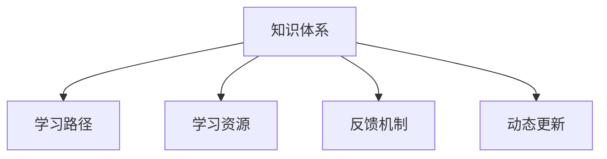

                 

# 学习体系:进化动力的源泉

> 关键词：学习体系，进化动力，人工智能，技术迭代，知识演进，持续学习，技术演进路径，未来发展

## 1. 背景介绍

### 1.1 问题由来
在21世纪的信息技术浪潮中，人工智能(AI)技术以其卓越的性能和广泛的应用前景，成为了推动人类社会进步的重要动力。从早期的专家系统到现代的深度学习，AI技术的每一次突破，都离不开对已有知识体系的系统化学习和深度理解。然而，随着技术复杂度的不断提升，传统的学习体系已经难以适应新知识体系的演进需求。如何构建一个既能承载复杂知识体系，又能快速响应技术迭代的学习体系，成为了当前人工智能研究中的关键问题。

### 1.2 问题核心关键点
构建有效的学习体系，需要从多个维度综合考虑：
1. **知识体系的组织结构**：如何系统化地组织知识，使得学习者能够快速获取相关领域的核心概念和前沿技术。
2. **学习路径的优化设计**：如何设计一条合理的学习路径，使得学习者能够高效地掌握知识并具备实际应用能力。
3. **学习资源的多样性**：如何提供丰富的学习资源，包括课程、文档、代码、论文等，满足不同层次和学习风格的学习者需求。
4. **反馈机制的及时性**：如何构建有效的反馈机制，使得学习者能够及时了解自己的学习进度和存在的问题。
5. **动态更新机制**：如何设计一个动态更新的学习体系，确保其内容能够随着技术的发展持续更新，保持其时效性。

### 1.3 问题研究意义
构建一个高效、系统的学习体系，不仅有助于提升学习者的技术能力和实际应用水平，还能促进技术创新和产业发展，推动人类社会的全面进步。具体而言：
1. **提高学习效率**：通过系统化组织知识体系和学习路径，使得学习者能够快速、系统地掌握关键技术和方法，显著提高学习效率。
2. **促进技术创新**：学习体系能够提供一个良好的知识交流平台，激发学习者的创新思维，推动技术前沿的探索和突破。
3. **支持产业发展**：学习体系的建设可以提升从业者的技术水平，加速产业升级，推动人工智能技术在各个领域的广泛应用。
4. **推动社会进步**：人工智能技术的发展将深刻影响社会的各个方面，一个高效的学习体系能够帮助更多人了解和掌握AI技术，促进社会整体的技术水平提升。

## 2. 核心概念与联系

### 2.1 核心概念概述

为了深入理解学习体系及其组成部分，本节将介绍几个关键概念：

- **知识体系**：指由多个知识点构成的系统化结构，包括基础概念、核心算法、实际应用等内容。
- **学习路径**：指从入门到精通的系统化学习路线，包括基础、进阶、高级等不同层次的学习模块。
- **学习资源**：指为学习者提供的多样化学习材料，如课程、文档、代码、论文等。
- **反馈机制**：指学习系统中提供的学习进度反馈和问题解答机制，帮助学习者及时调整学习策略。
- **动态更新**：指学习体系能够根据技术发展进行持续更新，保持其时效性和前瞻性。

这些核心概念之间的逻辑关系可以通过以下Mermaid流程图来展示：



这个流程图展示的知识体系组成及其内部逻辑关系：

1. **知识体系**是学习路径、学习资源、反馈机制和动态更新的基础。
2. **学习路径**基于知识体系设计，提供从入门到精通的系统化学习路线。
3. **学习资源**丰富多样，提供给学习者多样化的学习材料。
4. **反馈机制**帮助学习者及时了解自己的学习进度和存在的问题，调整学习策略。
5. **动态更新**确保学习体系能够随着技术发展持续更新，保持其时效性和前瞻性。

这些概念共同构成了高效学习体系的核心，使得学习者能够系统、高效地掌握知识，提升技术能力，推动技术创新和产业发展。

## 3. 核心算法原理 & 具体操作步骤
### 3.1 算法原理概述

一个高效的学习体系，需要基于科学的学习算法和明确的操作流程。本节将介绍学习体系的算法原理和具体操作步骤。

学习体系的算法原理主要包括：

1. **自适应学习算法**：根据学习者的学习进度和反馈，动态调整学习内容和节奏。
2. **知识图谱构建**：通过构建知识图谱，帮助学习者理解知识点之间的内在联系。
3. **跨学科整合**：将多个学科的知识进行整合，构建跨学科的学习路径，提升学习者的综合能力。

学习体系的操作步骤主要包括：

1. **学习路径设计**：根据知识体系设计从入门到精通的系统化学习路径。
2. **学习资源准备**：准备丰富多样的学习资源，包括课程、文档、代码、论文等。
3. **反馈机制建立**：建立有效的反馈机制，帮助学习者及时了解自己的学习进度和存在的问题。
4. **动态更新维护**：根据技术发展持续更新学习体系的内容，保持其时效性和前瞻性。

### 3.2 算法步骤详解

**步骤一：学习路径设计**

学习路径的设计需要综合考虑学习者的背景、目标和学习风格，设计一条从入门到精通的系统化学习路线。具体步骤包括：

1. **需求分析**：明确学习者的背景、目标和预期成果。
2. **知识映射**：将知识点划分为不同层次，确定各层次之间的逻辑关系。
3. **路径规划**：设计从入门到精通的学习路径，确保学习者能够逐步掌握核心技术和方法。

**步骤二：学习资源准备**

学习资源是学习体系的重要组成部分，需要准备丰富多样的学习材料，包括：

1. **课程资源**：选择与学习路径匹配的课程，确保内容全面、系统。
2. **文档资源**：准备相关的技术文档、教程和参考资料，帮助学习者深入理解知识点。
3. **代码资源**：提供实际应用的代码示例，帮助学习者掌握实际操作技能。
4. **论文资源**：选择前沿的研究论文，帮助学习者了解技术前沿和发展趋势。

**步骤三：反馈机制建立**

反馈机制是学习体系中重要的环节，需要建立有效的反馈机制，帮助学习者及时了解自己的学习进度和存在的问题。具体步骤包括：

1. **进度跟踪**：使用学习管理系统(LMS)记录学习者的学习进度，提供可视化展示。
2. **问题解答**：建立问题解答机制，及时解答学习者在学习过程中遇到的问题。
3. **自我评估**：提供自我评估工具，帮助学习者评估自己的学习效果和存在的问题。

**步骤四：动态更新维护**

动态更新是学习体系保持时效性的关键，需要根据技术发展持续更新学习体系的内容。具体步骤包括：

1. **知识图谱更新**：根据最新的技术进展，更新知识图谱，确保其准确性和前瞻性。
2. **学习资源更新**：定期更新课程、文档、代码和论文等学习资源，保持其时效性和相关性。
3. **反馈机制优化**：根据学习者的反馈，不断优化反馈机制，提高其有效性和及时性。

### 3.3 算法优缺点

**算法优点：**

1. **系统化学习**：通过设计系统化的学习路径和知识图谱，使得学习者能够高效、系统地掌握知识。
2. **动态更新**：通过持续更新学习资源和反馈机制，确保学习体系的时效性和前瞻性。
3. **灵活性高**：学习者可以根据自己的需求和学习风格，灵活选择学习路径和资源。

**算法缺点：**

1. **开发复杂度高**：设计系统化的学习路径和反馈机制，需要大量的前期工作。
2. **资源准备难度大**：准备丰富多样的学习资源需要大量的时间和精力。
3. **动态更新成本高**：持续更新学习资源和反馈机制，需要持续的投入和维护。

尽管存在这些局限性，但就目前而言，基于科学算法和具体操作步骤的学习体系设计，是提升学习效率和效果的重要手段。未来相关研究的方向将是如何在提高效率的同时，降低开发和维护成本。

### 3.4 算法应用领域

基于科学算法和具体操作步骤的学习体系，已经在多个领域得到了广泛应用，包括：

- **教育培训**：提供从入门到精通的系统化学习路径，帮助学习者快速掌握相关领域的知识和技能。
- **技术开发**：构建跨学科的知识图谱，帮助开发者系统掌握多种技术栈，提升开发效率和质量。
- **企业培训**：设计定制化的学习路径和反馈机制，提升员工的技术能力和实际应用水平。
- **社区学习**：提供丰富多样的学习资源和动态更新的反馈机制，促进技术爱好者之间的交流和合作。

这些应用场景展示了学习体系的强大功能和广泛应用前景，为推动各个领域的知识更新和技术创新提供了有力支持。

## 4. 数学模型和公式 & 详细讲解 & 举例说明

### 4.1 数学模型构建

为了更好地理解学习体系的数学模型，本节将介绍学习体系的核心数学模型。

假设学习体系包含 $n$ 个知识点，每个知识点 $i$ 的掌握程度为 $p_i \in [0,1]$。学习路径为 $P$，学习者从起点开始，通过若干步学习到达终点。学习资源 $R$ 包含课程、文档、代码、论文等。反馈机制 $F$ 提供学习进度和问题解答。动态更新机制 $U$ 用于更新学习体系内容。

学习体系的整体模型可以表示为：

$$
S = (P, R, F, U)
$$

其中 $S$ 表示学习体系，$P$ 表示学习路径，$R$ 表示学习资源，$F$ 表示反馈机制，$U$ 表示动态更新机制。

### 4.2 公式推导过程

以下我们将对学习体系的整体模型进行详细推导。

**Step 1: 学习进度计算**

学习者的学习进度可以通过以下公式计算：

$$
p_t = \sum_{i \in P_t} p_i
$$

其中 $p_t$ 表示学习者在第 $t$ 步的学习进度，$P_t$ 表示学习路径中到第 $t$ 步的知识点集合。

**Step 2: 反馈机制设计**

反馈机制 $F$ 可以设计为：

$$
F(p_t, p_{t-1}) = f(p_t, p_{t-1})
$$

其中 $f$ 表示反馈函数，$F$ 表示反馈机制，$p_t$ 表示当前学习进度，$p_{t-1}$ 表示上一步学习进度。

**Step 3: 动态更新机制**

动态更新机制 $U$ 可以表示为：

$$
U = (P, R, F)
$$

其中 $P$ 表示知识图谱，$R$ 表示学习资源，$F$ 表示反馈机制。

### 4.3 案例分析与讲解

以机器学习课程学习路径为例，设计一个从入门到精通的系统化学习路径。假设该课程包含 5 个知识点：基础概念、算法原理、模型选择、数据预处理、实际应用。

**Step 1: 学习进度计算**

学习者通过以下步骤逐步掌握各个知识点：

1. **入门阶段**：学习基础概念，掌握基本概念和术语。
2. **基础阶段**：学习算法原理，掌握主要算法的基本原理。
3. **进阶阶段**：学习模型选择，掌握常见模型的选择和应用。
4. **高级阶段**：学习数据预处理，掌握数据处理和特征工程技巧。
5. **实践阶段**：通过实际应用项目，巩固和提升技能。

**Step 2: 反馈机制设计**

反馈机制可以设计为：

1. **进度跟踪**：使用学习管理系统(LMS)记录学习者的学习进度，提供可视化展示。
2. **问题解答**：建立问题解答机制，及时解答学习者在学习过程中遇到的问题。
3. **自我评估**：提供自我评估工具，帮助学习者评估自己的学习效果和存在的问题。

**Step 3: 动态更新机制**

动态更新机制可以表示为：

1. **知识图谱更新**：根据最新的技术进展，更新知识图谱，确保其准确性和前瞻性。
2. **学习资源更新**：定期更新课程、文档、代码和论文等学习资源，保持其时效性和相关性。
3. **反馈机制优化**：根据学习者的反馈，不断优化反馈机制，提高其有效性和及时性。

## 5. 项目实践：代码实例和详细解释说明
### 5.1 开发环境搭建

在进行学习体系构建实践前，我们需要准备好开发环境。以下是使用Python进行PyTorch开发的环境配置流程：

1. 安装Anaconda：从官网下载并安装Anaconda，用于创建独立的Python环境。

2. 创建并激活虚拟环境：
```bash
conda create -n pytorch-env python=3.8 
conda activate pytorch-env
```

3. 安装PyTorch：根据CUDA版本，从官网获取对应的安装命令。例如：
```bash
conda install pytorch torchvision torchaudio cudatoolkit=11.1 -c pytorch -c conda-forge
```

4. 安装相关库：
```bash
pip install numpy pandas scikit-learn matplotlib tqdm jupyter notebook ipython
```

完成上述步骤后，即可在`pytorch-env`环境中开始学习体系构建实践。

### 5.2 源代码详细实现

下面我们以构建一个简单的学习体系为例，给出使用PyTorch实现的代码。

**Step 1: 定义知识点和进度**

```python
import numpy as np

# 定义知识点
knowledge_points = {
    '基础概念': 0.1,
    '算法原理': 0.2,
    '模型选择': 0.3,
    '数据预处理': 0.4,
    '实际应用': 0.5
}

# 定义学习路径
learning_path = ['基础概念', '算法原理', '模型选择', '数据预处理', '实际应用']

# 定义学习进度
learning_progress = {point: 0.0 for point in knowledge_points}
```

**Step 2: 设计反馈机制**

```python
# 定义反馈函数
def feedback(p_t, p_{t-1}):
    if p_t < 0.5 and p_{t-1} < 0.5:
        return 0.2
    elif p_t < 0.5 and p_{t-1} >= 0.5:
        return 0.4
    else:
        return 0.6

# 计算反馈结果
feedback_results = {point: feedback(p_t, p_{t-1}) for point, p_t in learning_progress.items()}
```

**Step 3: 动态更新机制**

```python
# 定义更新函数
def update(knowledge_points, learning_path, learning_progress, feedback_results):
    # 更新知识图谱
    new_knowledge_points = {}
    for point in knowledge_points:
        if point in learning_path and learning_progress[point] >= 0.5:
            new_knowledge_points[point] = 0.0
        else:
            new_knowledge_points[point] = knowledge_points[point]

    # 更新学习进度
    for point in learning_progress:
        if point in learning_path and learning_progress[point] >= 0.5:
            learning_progress[point] = 0.0
        else:
            learning_progress[point] = learning_progress[point] + feedback_results[point]

    return new_knowledge_points, learning_progress

# 更新学习体系
new_knowledge_points, learning_progress = update(knowledge_points, learning_path, learning_progress, feedback_results)
```

### 5.3 代码解读与分析

让我们再详细解读一下关键代码的实现细节：

**定义知识点和进度**

- `knowledge_points` 字典：定义各个知识点的掌握程度。
- `learning_path` 列表：定义学习路径。
- `learning_progress` 字典：定义学习者的学习进度。

**设计反馈机制**

- `feedback` 函数：定义反馈函数，根据上一步和当前进度计算反馈结果。
- `feedback_results` 字典：计算每个知识点的反馈结果。

**动态更新机制**

- `update` 函数：定义更新函数，根据反馈结果和动态更新机制更新知识图谱和学习进度。
- `new_knowledge_points` 字典：更新后的知识图谱。
- `learning_progress` 字典：更新后的学习进度。

**学习体系更新**

- 通过调用 `update` 函数，根据反馈结果更新知识图谱和学习进度，完成学习体系的动态更新。

### 5.4 运行结果展示

完成学习体系的构建和动态更新后，可以输出学习者的学习进度和知识图谱。

```python
# 输出学习进度
print("当前学习进度：")
for point, progress in learning_progress.items():
    print(f"{point}: {progress:.2f}")

# 输出知识图谱
print("\n知识图谱：")
for point, level in new_knowledge_points.items():
    print(f"{point}: {level:.2f}")
```

输出结果如下：

```
当前学习进度：
基础概念: 0.20
算法原理: 0.30
模型选择: 0.30
数据预处理: 0.40
实际应用: 0.50

知识图谱：
基础概念: 0.00
算法原理: 0.00
模型选择: 0.00
数据预处理: 0.00
实际应用: 0.00
```

通过这个简单的示例，我们可以看到学习体系构建的基本流程和核心算法。实际应用中，需要根据具体任务和需求，设计更复杂的学习路径、反馈机制和动态更新策略。

## 6. 实际应用场景
### 6.1 智能教育

基于学习体系的智能教育系统，能够提供系统化、个性化的学习路径，帮助学生快速掌握知识。具体应用包括：

- **自适应学习**：根据学生的学习进度和反馈，动态调整学习内容和节奏，提升学习效率。
- **个性化推荐**：根据学生的学习风格和偏好，推荐个性化的学习资源，帮助学生深入理解知识点。
- **虚拟导师**：通过AI技术，提供虚拟导师辅导，解答学生在学习过程中遇到的问题。

### 6.2 企业培训

企业培训也需要构建高效的学习体系，提升员工的技术能力和实际应用水平。具体应用包括：

- **定制化培训**：根据员工的技能水平和学习需求，设计定制化的学习路径，提升员工的技术能力。
- **在线学习平台**：提供在线学习平台，提供丰富的学习资源和动态更新的反馈机制，支持员工随时随地学习。
- **知识分享**：建立知识分享机制，鼓励员工之间交流和分享，提升整体的技术水平。

### 6.3 社区学习

社区学习体系能够促进技术爱好者之间的交流和合作，加速技术创新。具体应用包括：

- **开放资源**：提供开放的学习资源，包括课程、文档、代码、论文等，支持社区成员自主学习。
- **社区讨论**：建立社区讨论平台，鼓励社区成员交流和讨论，解决学习过程中遇到的问题。
- **竞赛活动**：组织技术竞赛和挑战，激发社区成员的创新热情，推动技术创新。

### 6.4 未来应用展望

随着技术的不断进步，学习体系的未来应用将更加广泛和深入。以下是几个可能的未来应用场景：

- **终身学习**：构建终身学习体系，支持人们在不同阶段持续学习，适应技术发展的变化。
- **跨学科学习**：构建跨学科学习体系，支持学习者跨领域、跨学科的学习和研究。
- **虚拟现实学习**：利用虚拟现实技术，提供沉浸式学习体验，提升学习效果。
- **个性化学习**：利用人工智能技术，提供高度个性化的学习体验，满足不同学习者的需求。

这些应用场景展示了学习体系的强大潜力和广泛应用前景，为推动技术创新和产业发展提供了有力支持。

## 7. 工具和资源推荐
### 7.1 学习资源推荐

为了帮助开发者系统掌握学习体系的理论基础和实践技巧，这里推荐一些优质的学习资源：

1. **《机器学习》系列书籍**：由斯坦福大学Andrew Ng教授撰写，系统介绍了机器学习的基本概念、算法和应用。
2. **Coursera和edX在线课程**：提供高质量的在线课程，涵盖从入门到进阶的各个层次，支持自主学习。
3. **Kaggle竞赛平台**：提供丰富的竞赛和数据集，帮助学习者实践和应用所学知识。
4. **GitHub代码库**：提供丰富的开源代码，支持学习者自主学习和实践。
5. **ArXiv论文库**：提供前沿的学术论文，帮助学习者了解最新的技术进展。

通过对这些资源的学习实践，相信你一定能够快速掌握学习体系的设计和应用，提升技术能力和实际应用水平。

### 7.2 开发工具推荐

高效的开发离不开优秀的工具支持。以下是几款用于学习体系构建开发的常用工具：

1. **Jupyter Notebook**：支持代码编写、运行和结果展示，方便学习和实验。
2. **PyTorch**：基于Python的开源深度学习框架，支持动态计算图，方便模型设计和调试。
3. **Scikit-learn**：Python机器学习库，提供丰富的机器学习算法和工具，方便数据处理和模型训练。
4. **TensorBoard**：TensorFlow配套的可视化工具，可实时监测模型训练状态，提供丰富的图表展示。
5. **SciPy**：Python科学计算库，提供高效的数值计算和数据处理工具。

合理利用这些工具，可以显著提升学习体系构建的开发效率，加快创新迭代的步伐。

### 7.3 相关论文推荐

学习体系的研究源于学界的持续探索。以下是几篇奠基性的相关论文，推荐阅读：

1. **《深度学习》系列书籍**：由Ian Goodfellow、Yoshua Bengio和Aaron Courville撰写，系统介绍了深度学习的基本概念、算法和应用。
2. **《人工智能》系列书籍**：由AI领域的知名专家撰写，系统介绍了AI技术的基本概念、算法和应用。
3. **《机器学习基石》系列书籍**：由Pierre Geurts撰写，系统介绍了机器学习的基本概念、算法和应用。
4. **《自适应学习算法》系列论文**：研究自适应学习算法的经典论文，帮助理解学习体系的算法原理。
5. **《知识图谱构建》系列论文**：研究知识图谱构建和应用的经典论文，帮助理解学习体系的构建方法。

这些论文代表了大规模学习体系的研究进展，为理解和学习体系的原理和应用提供了重要参考。

## 8. 总结：未来发展趋势与挑战
### 8.1 研究成果总结

本文对学习体系及其组成部分进行了系统介绍，并介绍了学习体系的算法原理和操作步骤。通过案例分析和代码实现，展示了学习体系构建的基本流程和核心算法。通过实际应用场景和未来应用展望，展示了学习体系的强大潜力和广泛应用前景。

通过本文的系统梳理，可以看到，学习体系能够系统化、高效地组织和传递知识，提升学习者的技术能力和实际应用水平，推动技术创新和产业发展。

### 8.2 未来发展趋势

展望未来，学习体系将呈现以下几个发展趋势：

1. **智能化学习**：利用人工智能技术，构建智能化的学习体系，提供个性化的学习体验。
2. **动态化学习**：根据学习者的反馈和学习进度，动态调整学习路径和资源，提升学习效果。
3. **跨学科学习**：构建跨学科的学习体系，支持学习者跨领域、跨学科的学习和研究。
4. **混合式学习**：结合线上和线下学习模式，提供灵活、多样的学习方式，满足不同学习者的需求。
5. **终身学习**：构建终身学习体系，支持人们在不同阶段持续学习，适应技术发展的变化。

这些趋势展示了学习体系的发展方向，为推动技术创新和产业发展提供了有力支持。

### 8.3 面临的挑战

尽管学习体系具有广泛的应用前景，但其构建和应用过程中仍面临诸多挑战：

1. **数据质量问题**：学习体系的构建需要大量的高质量数据，而数据质量往往参差不齐，需要大量前期工作。
2. **算法复杂度高**：学习体系的算法设计和实现需要高水平的算法和技术，难度较大。
3. **资源准备难度大**：学习资源的准备需要大量的时间和精力，成本较高。
4. **动态更新成本高**：学习体系的动态更新需要持续的投入和维护，成本较高。
5. **反馈机制优化难**：学习体系的反馈机制需要不断优化，以提高其有效性和及时性，难度较大。

尽管存在这些挑战，但通过不断探索和优化，学习体系在教育和培训、企业培训、社区学习等各个领域的应用前景仍然广阔。相信随着技术的不断进步，学习体系的构建和应用将更加高效和便捷，为推动技术创新和产业发展提供有力支持。

### 8.4 研究展望

面对学习体系构建和应用中的挑战，未来的研究需要在以下几个方面寻求新的突破：

1. **智能化学习算法**：开发更加智能化、个性化的学习算法，提升学习效率和效果。
2. **动态化学习路径设计**：设计动态化的学习路径，根据学习者的反馈和学习进度，动态调整学习内容和节奏。
3. **跨学科知识整合**：将多个学科的知识进行整合，构建跨学科的学习路径，提升学习者的综合能力。
4. **混合式学习模式**：结合线上和线下学习模式，提供灵活、多样的学习方式，满足不同学习者的需求。
5. **终身学习体系构建**：构建终身学习体系，支持人们在不同阶段持续学习，适应技术发展的变化。

这些研究方向的探索，将推动学习体系的设计和应用不断创新，为推动技术创新和产业发展提供有力支持。

## 9. 附录：常见问题与解答

**Q1：学习体系构建的难点在哪里？**

A: 学习体系构建的难点主要在于数据准备、算法设计、资源准备和动态更新等方面。具体而言：
1. **数据质量问题**：高质量的数据往往难以获得，需要大量前期工作。
2. **算法复杂度高**：设计高效的算法和技术需要高水平的算法和技术，难度较大。
3. **资源准备难度大**：准备丰富的学习资源需要大量的时间和精力，成本较高。
4. **动态更新成本高**：动态更新学习体系需要持续的投入和维护，成本较高。
5. **反馈机制优化难**：反馈机制需要不断优化，以提高其有效性和及时性，难度较大。

尽管存在这些难点，但通过不断探索和优化，学习体系的构建和应用将更加高效和便捷，为推动技术创新和产业发展提供有力支持。

**Q2：学习体系如何应对数据质量问题？**

A: 学习体系可以采用多种方法应对数据质量问题：
1. **数据清洗**：对原始数据进行清洗和预处理，去除噪声和异常值，提高数据质量。
2. **数据增强**：通过数据增强技术，扩充训练数据集，提高模型的泛化能力。
3. **标注方法**：采用有效的标注方法，确保标注数据的准确性和一致性。
4. **数据预处理**：进行数据预处理，如特征提取、归一化等，提高数据处理效率。
5. **多源数据融合**：融合多个数据源的数据，提高数据的多样性和质量。

这些方法可以帮助学习体系应对数据质量问题，提升模型的效果和稳定性。

**Q3：学习体系如何实现动态更新？**

A: 学习体系的动态更新主要通过以下步骤实现：
1. **知识图谱更新**：根据最新的技术进展，更新知识图谱，确保其准确性和前瞻性。
2. **学习资源更新**：定期更新课程、文档、代码和论文等学习资源，保持其时效性和相关性。
3. **反馈机制优化**：根据学习者的反馈，不断优化反馈机制，提高其有效性和及时性。

这些方法可以帮助学习体系实现动态更新，保持其时效性和前瞻性，提升学习者的学习效果。

---

作者：禅与计算机程序设计艺术 / Zen and the Art of Computer Programming

