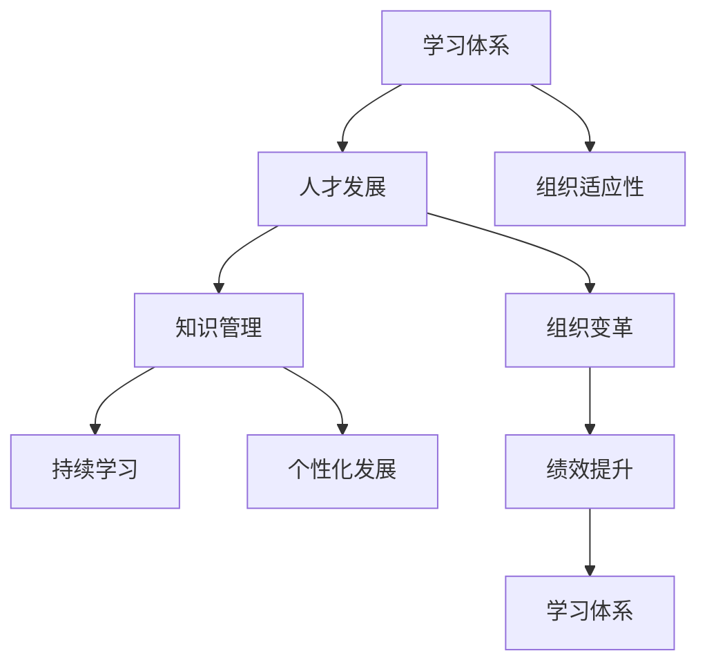

                 

# 学习体系对组织适应性的提升作用

> 关键词：学习体系, 组织适应性, 人才发展, 组织变革, 知识管理, 绩效提升

## 1. 背景介绍

在当今快速变化的市场环境中，企业面临的挑战和机遇都在不断变化。为了保持竞争力，组织必须具备高度的适应性。这种适应性不仅体现在对市场的快速响应上，也体现在对技术变革的适应和对人才发展的需求上。而一个有效的学习体系可以显著提升组织的适应性，使其能够在复杂多变的环境中快速调整策略和实施变革。

### 1.1 问题由来

在过去的几十年里，技术的飞速发展、市场竞争的加剧以及全球化趋势的加深，使得企业的运营环境和内部结构都发生了巨大变化。企业的内部运营需要更加灵活、动态和高效，而员工的技能和知识水平也必须与时俱进，才能满足新的业务需求。然而，传统的培训模式往往难以适应这些变化，特别是在面对快速的技术变革和市场变化时，培训的滞后性和不及时性使得组织在适应新环境方面显得力不从心。

### 1.2 问题核心关键点

为了解决这些挑战，许多企业开始重视建立和优化学习体系，以提升组织的适应性。有效的学习体系能够提供以下几个方面的支持：

- **持续学习**：通过提供持续的学习机会，使员工能够不断更新知识和技能，保持与行业前沿的同步。
- **个性化发展**：根据员工个人的职业发展路径和兴趣，定制个性化的学习计划，提高学习效果和参与度。
- **知识共享**：通过知识管理系统和协作工具，促进知识的共享和传播，提升组织的整体知识水平。
- **绩效提升**：通过学习体系的实施，提高员工的工作效率和创新能力，从而直接提升组织绩效。

本文将详细探讨如何构建和优化学习体系，以提升组织的适应性。

## 2. 核心概念与联系

### 2.1 核心概念概述

为了更好地理解学习体系对组织适应性的提升作用，首先需要对相关核心概念进行阐述。

- **学习体系（Learning Ecosystem）**：指的是组织内建立的一系列流程、工具和技术，用于支持员工的学习和发展。一个有效的学习体系包括学习策略、培训课程、学习管理平台、知识库、激励机制等。

- **组织适应性（Organizational Adaptability）**：是指组织根据内外环境的变化，快速调整其策略、结构、流程和能力，以适应新的挑战和机遇的能力。适应性强的组织能够更好地应对不确定性和变化，保持竞争优势。

- **人才发展（Talent Development）**：关注如何通过培训、教育和实践等方式，提升员工的技能和能力，促进其职业发展。人才发展是组织适应性提升的基础。

- **组织变革（Organizational Change）**：是指组织在战略、结构、流程、文化等方面的重大调整，以适应内外环境的变化。学习体系在组织变革中扮演重要角色，通过改变员工的知识和技能，支持变革的顺利实施。

- **知识管理（Knowledge Management）**：强调如何捕获、整理、共享和利用组织内部和外部的知识资源，提升组织整体的知识水平和创新能力。

### 2.2 核心概念原理和架构的 Mermaid 流程图



这个流程图展示了学习体系、人才发展、组织适应性、知识管理和组织变革之间的联系：

- 学习体系通过持续学习和个性化发展，促进人才发展。
- 人才发展是组织适应性提升的基础，通过提升员工能力，支持组织变革。
- 知识管理促进知识的共享和传播，提升组织的整体知识水平。
- 组织变革需要学习体系的支持，通过改变员工的知识和技能，实现战略调整。

## 3. 核心算法原理 & 具体操作步骤

### 3.1 算法原理概述

构建和优化学习体系的核心算法原理主要包括四个方面：

1. **需求分析**：通过对组织内外环境的分析，确定学习体系的目标和重点。
2. **学习路径设计**：根据需求分析的结果，设计个性化的学习路径和课程。
3. **学习内容构建**：选择和开发适合的学习内容和资源，如培训课程、在线课程、案例研究等。
4. **学习效果评估**：通过评估学习效果，持续改进学习体系，确保其有效性。

### 3.2 算法步骤详解

以下是一个有效的学习体系构建步骤的详细阐述：

**Step 1: 需求分析**
- 分析组织的战略目标和业务需求，确定员工需要掌握的技能和知识。
- 识别员工当前的差距和需求，包括技能不足、知识更新等。
- 与各部门领导和员工沟通，了解他们的学习需求和期望。

**Step 2: 学习路径设计**
- 基于需求分析的结果，设计个性化的学习路径，考虑员工的不同发展阶段和学习偏好。
- 根据组织内外的变化，动态调整学习路径，确保其时效性和相关性。
- 使用技术工具和平台，如学习管理系统(LMS)，来支持学习路径的设计和实施。

**Step 3: 学习内容构建**
- 选择合适的学习内容，包括内部培训、外部课程、在线资源等。
- 开发和定制适合的学习材料，如工作坊、案例研究、视频教程等。
- 利用知识管理系统，确保学习内容的组织和存储，便于检索和共享。

**Step 4: 学习效果评估**
- 使用评估工具和指标，如培训反馈、学习成果测试、工作表现等，评估学习效果。
- 定期收集反馈，识别问题并加以改进。
- 分析学习数据，识别学习趋势和改进点，为未来的学习体系优化提供依据。

### 3.3 算法优缺点

构建和优化学习体系有其独特的优势，但同时也面临一些挑战：

**优点**：
1. **提升员工能力**：通过持续学习和个性化发展，员工的技能和知识不断更新，提升工作效率和创新能力。
2. **支持组织变革**：学习体系在组织变革中发挥重要作用，支持员工快速适应新的业务需求和技术变革。
3. **增强组织知识管理**：通过知识共享和传播，提升组织整体的知识水平和创新能力。
4. **提升组织绩效**：通过优化学习体系，提升员工能力和组织适应性，直接促进组织绩效的提升。

**缺点**：
1. **资源投入大**：建立和优化学习体系需要投入大量的时间、金钱和人力资源。
2. **实施难度高**：学习体系的设计和实施需要跨部门协作，面临协调和沟通的挑战。
3. **效果难以量化**：学习效果的评估较为复杂，难以直接量化其对组织适应性的提升。
4. **持续性要求高**：学习体系需要持续的投入和改进，才能保持其有效性和时效性。

### 3.4 算法应用领域

学习体系在多个领域都有广泛的应用，包括但不限于：

- **高科技公司**：如Google、Facebook等，这些公司高度重视员工技能和知识的发展，通过学习体系提升员工的技术能力和创新能力。
- **金融行业**：银行、保险公司等机构，通过学习体系培训员工金融知识和风险管理技能。
- **制造业**：制造企业通过学习体系提升员工的操作技能和质量控制能力，提升生产效率。
- **医疗健康**：医疗机构通过培训医生和护士的最新医疗知识和技能，提高患者治疗效果。
- **政府和非营利组织**：通过学习体系提升公务员和员工的专业技能和公共服务能力。

## 4. 数学模型和公式 & 详细讲解 & 举例说明

### 4.1 数学模型构建

构建学习体系的过程可以抽象为一个优化问题，目标是最大化组织的适应性。我们设 $E$ 为组织的适应性评分，$L$ 为学习体系的投资成本，$F$ 为员工的学习效果。则目标函数为：

$$ \max E = F - \alpha L $$

其中 $\alpha$ 为投资成本的权重系数，反映了组织对学习体系投入的重视程度。

### 4.2 公式推导过程

为了最大化组织的适应性，我们需要对学习体系的投资成本和员工学习效果进行平衡。假设组织有 $n$ 个员工，第 $i$ 个员工的学习效果为 $F_i$，学习成本为 $C_i$。目标函数可以写为：

$$ \max E = \sum_{i=1}^n F_i - \alpha \sum_{i=1}^n C_i $$

这是一个典型的线性规划问题。使用线性规划方法，我们可以找到最优的学习内容和投资分配，最大化组织的适应性。

### 4.3 案例分析与讲解

以一家高科技公司为例，该公司有 $500$ 名员工，分布在不同的部门。公司的战略目标是提升人工智能和大数据分析技能，以支持新的业务项目。通过需求分析，公司发现人工智能和大数据分析技能不足，需要提供相应的培训课程。

基于需求分析，公司设计了个性化学习路径，包括在线课程、工作坊和实战项目。每个员工的初始学习成本为 $1000$ 美元，学习效果通过工作表现和员工反馈评估，取值范围为 $[0,1]$。公司决定投入 $500,000$ 美元用于培训。

我们设 $x_i$ 为第 $i$ 个员工的投资系数，即公司对第 $i$ 个员工的学习体系投资成本。则目标函数为：

$$ \max E = \sum_{i=1}^n (F_i - \alpha x_i) $$

约束条件为：

$$ \sum_{i=1}^n x_i = 500,000 $$

$$ 0 \leq x_i \leq 1 $$

通过线性规划算法求解，可以找到最优的 $x_i$，使得组织的适应性最大化。

## 5. 项目实践：代码实例和详细解释说明

### 5.1 开发环境搭建

要在实践中构建和优化学习体系，首先需要搭建一个开发环境。以下是使用Python进行学习体系开发的环境配置流程：

1. 安装Anaconda：从官网下载并安装Anaconda，用于创建独立的Python环境。

2. 创建并激活虚拟环境：
```bash
conda create -n learning-env python=3.8 
conda activate learning-env
```

3. 安装相关库：
```bash
conda install pandas numpy matplotlib scikit-learn scipy plotly
```

4. 下载学习内容：
```bash
git clone https://github.com/[organization]/learning-content.git
```

5. 启动开发：
```bash
jupyter notebook
```

完成上述步骤后，即可在`learning-env`环境中开始学习体系开发。

### 5.2 源代码详细实现

以下是一个基于Python的简单学习体系管理系统，用于管理员工的学习记录和评估：

```python
import pandas as pd
import matplotlib.pyplot as plt

class LearningSystem:
    def __init__(self):
        self.learning_records = pd.DataFrame(columns=['employee_id', 'learning_course', 'start_date', 'end_date', 'score'])
        self.learning_cost = pd.DataFrame(columns=['employee_id', 'cost'])

    def add_learning_record(self, employee_id, course, start_date, end_date, score):
        record = pd.DataFrame([employee_id, course, start_date, end_date, score], columns=['employee_id', 'learning_course', 'start_date', 'end_date', 'score'])
        self.learning_records = self.learning_records.append(record, ignore_index=True)

    def add_learning_cost(self, employee_id, cost):
        cost_record = pd.DataFrame([employee_id, cost], columns=['employee_id', 'cost'])
        self.learning_cost = self.learning_cost.append(cost_record, ignore_index=True)

    def calculate_adaptability(self, alpha):
        # 计算适应性得分
        adaptability = self.learning_records['score'].sum() - alpha * self.learning_cost['cost'].sum()
        return adaptability

    def visualize_adaptability(self, alpha):
        # 可视化适应性得分
        adaptability = self.calculate_adaptability(alpha)
        plt.plot(alpha, adaptability)
        plt.xlabel('投资成本权重')
        plt.ylabel('适应性得分')
        plt.title('投资成本对适应性得分的贡献')
        plt.show()

# 实例化学习系统
ls = LearningSystem()

# 添加员工学习记录
ls.add_learning_record('1', 'Python', '2022-01-01', '2022-03-31', 0.8)
ls.add_learning_record('1', 'Data Analysis', '2022-04-01', '2022-06-30', 0.9)
ls.add_learning_cost('1', 2000)

# 计算适应性得分
adaptability = ls.calculate_adaptability(0.5)
print('适应性得分:', adaptability)

# 可视化适应性得分
ls.visualize_adaptability([0.1, 0.3, 0.5, 0.7, 0.9])
```

### 5.3 代码解读与分析

这段代码实现了一个简单的学习体系管理系统，包括以下功能：

- **学习记录管理**：通过`add_learning_record`方法添加员工的学习记录，包括学习课程、开始日期、结束日期和得分。
- **学习成本管理**：通过`add_learning_cost`方法添加员工的学习成本。
- **适应性得分计算**：通过`calculate_adaptability`方法计算适应性得分，其中`alpha`为投资成本权重系数。
- **适应性得分可视化**：通过`visualize_adaptability`方法可视化适应性得分，展示不同投资成本权重下的适应性得分变化。

## 6. 实际应用场景

### 6.1 智能制造

在智能制造领域，学习体系可以显著提升员工的操作技能和质量控制能力，支持企业实现从传统制造向智能制造的转型。通过学习体系，员工可以掌握最新的生产技术和质量管理工具，提高生产效率和产品质量。例如，某制造业企业通过学习体系培训员工使用先进的机器人编程技术，显著提升了生产线的自动化水平和生产效率。

### 6.2 医疗健康

在医疗健康领域，学习体系可以提升医生的诊断和治疗能力，支持医疗技术的进步和患者治疗效果的提升。例如，某医疗机构通过学习体系培训医生使用最新的医疗设备和诊断软件，提高了诊断的准确性和治疗的效率。同时，通过知识共享和传播，医生能够及时了解最新的医学研究成果和临床实践，保持与行业前沿的同步。

### 6.3 金融行业

在金融行业，学习体系可以提升员工的风险管理和金融分析能力，支持企业的金融创新和业务发展。例如，某银行通过学习体系培训员工掌握最新的金融产品和投资策略，提升了金融产品的创新能力和市场竞争力。同时，通过知识共享和传播，员工能够及时了解最新的市场动态和金融知识，提高风险管理和投资决策的水平。

### 6.4 未来应用展望

随着技术的进步和组织变革的加速，学习体系在未来的应用将更加广泛和深入：

1. **人工智能和大数据**：通过学习体系，提升员工的人工智能和大数据分析能力，支持企业的数字化转型和智能决策。
2. **远程工作和学习**：随着远程工作的普及，学习体系可以提供在线学习资源和工具，支持员工随时随地进行学习和技能提升。
3. **知识共享和协作**：通过知识管理系统和协作工具，促进知识共享和传播，提升组织的整体知识水平和创新能力。
4. **终身学习**：推动组织的终身学习文化，鼓励员工持续学习，保持与行业前沿的同步，适应快速变化的市场环境。

## 7. 工具和资源推荐

### 7.1 学习资源推荐

为了帮助开发者和企业管理者系统掌握学习体系的理论基础和实践技巧，这里推荐一些优质的学习资源：

1. **《Learning Systems: Realizing Organizational Value》书籍**：探讨了如何构建和优化学习体系，提升组织适应性和绩效。

2. **Coursera《Learning to Teach Online》课程**：由John Swing教授讲授，介绍了在线学习平台的设计和实施。

3. **edX《Organizational Development》课程**：由密歇根大学讲授，探讨了组织变革和人才发展的策略。

4. **LinkedIn Learning《Learning and Development》课程**：提供了大量的在线课程和资源，帮助管理者提升学习体系的管理能力。

5. **American Society for Training and Development（ASTD）网站**：提供了丰富的学习体系和培训管理资源，适合企业HR和培训管理者。

通过对这些资源的学习实践，相信你一定能够快速掌握学习体系的理论基础和实践技巧，从而构建和优化适合自己组织的有效学习体系。

### 7.2 开发工具推荐

高效的开发离不开优秀的工具支持。以下是几款用于学习体系开发和优化的常用工具：

1. **Jupyter Notebook**：开源的交互式计算环境，支持Python、R等多种编程语言，方便数据可视化和代码调试。

2. **Tableau**：强大的数据可视化工具，可以轻松创建和共享数据报表和仪表板。

3. **Microsoft Power BI**：企业级的数据分析和可视化工具，支持数据的连接、清洗和可视化。

4. **Learning Management System（LMS）**：如Moodle、Canvas等，用于管理员工的学习内容和评估结果。

5. **Google Analytics**：通过分析学习系统的使用数据，优化学习路径和资源配置。

6. **Slack**：强大的协作工具，支持团队沟通和任务管理，方便学习体系的实施和监控。

合理利用这些工具，可以显著提升学习体系开发的效率和效果，确保学习体系的有效实施和持续优化。

### 7.3 相关论文推荐

学习体系的研究源于学界的持续研究。以下是几篇奠基性的相关论文，推荐阅读：

1. **《Learning in Organizations: Designing, Developing, and Assessing Effective Learning Systems》书籍**：提供了一套系统的学习体系设计、开发和评估方法。

2. **《Organizational Change Management: A Practical Approach》书籍**：探讨了组织变革和人力资源管理的策略，包括学习体系的管理。

3. **《Knowledge Sharing and Collaboration in Organizations》论文**：分析了知识共享和协作在组织中的作用，强调了学习体系的重要性。

4. **《The Role of Learning Systems in Organizational Adaptability》论文**：研究了学习体系在组织适应性提升中的作用，提出了具体的实施策略。

5. **《Effective Learning Systems: Best Practices and Case Studies》书籍**：收集了多个成功案例，展示了学习体系的最佳实践。

这些论文代表了大规模学习体系的研究方向和成果，通过学习这些前沿成果，可以帮助研究者把握学科前进方向，激发更多的创新灵感。

## 8. 总结：未来发展趋势与挑战

### 8.1 总结

本文对学习体系对组织适应性的提升作用进行了全面系统的介绍。首先阐述了学习体系在提升组织适应性方面的重要性，明确了其对人才发展、组织变革和知识管理的支持作用。其次，从原理到实践，详细讲解了学习体系的构建和优化过程，给出了具体的操作步骤和工具推荐。同时，本文还探讨了学习体系在智能制造、医疗健康、金融等行业的应用前景，展示了其广阔的应用潜力。

通过本文的系统梳理，可以看到，学习体系在提升组织适应性方面具有重要意义，能够通过持续学习和知识共享，提高员工能力和组织绩效。未来，随着技术的进步和组织变革的加速，学习体系必将更加广泛地应用于各种行业，推动组织的持续发展和创新。

### 8.2 未来发展趋势

展望未来，学习体系的发展将呈现以下几个趋势：

1. **智能化和自动化**：通过引入人工智能和大数据分析技术，学习体系能够更好地进行需求分析、个性化发展和效果评估，提升学习效果和效率。
2. **数据驱动**：学习体系的构建和优化将更加依赖数据驱动的方法，通过分析学习数据和行为数据，优化学习路径和资源配置。
3. **泛在化**：学习体系将更加泛在化，支持在线学习、移动学习和远程学习，方便员工随时随地进行学习和技能提升。
4. **终身学习文化**：推动组织的终身学习文化，鼓励员工持续学习，保持与行业前沿的同步，适应快速变化的市场环境。
5. **混合学习模式**：结合在线学习和线下培训，提供多样化的学习方式，满足不同员工的学习需求。

### 8.3 面临的挑战

尽管学习体系在提升组织适应性方面具有重要意义，但在实际应用中仍面临诸多挑战：

1. **资源投入高**：建立和优化学习体系需要大量的时间、金钱和人力资源，特别是对于大型组织而言，资源投入尤为巨大。
2. **实施难度大**：学习体系的构建和实施需要跨部门协作，面临协调和沟通的挑战，特别是在组织变革的背景下，员工可能存在抵触情绪。
3. **效果评估难**：学习效果的评估较为复杂，难以直接量化其对组织适应性的提升，需要结合定性和定量的评估方法。
4. **持续性要求高**：学习体系需要持续的投入和改进，才能保持其有效性和时效性，特别是在快速变化的市场环境中。

### 8.4 研究展望

面对这些挑战，未来的研究需要在以下几个方面寻求新的突破：

1. **资源优化**：探索如何通过技术手段优化学习体系的资源投入，降低实施难度和成本。
2. **效果评估**：研究如何构建有效的学习效果评估方法，提高学习体系的透明度和可追踪性。
3. **学习路径优化**：利用机器学习和数据分析技术，优化个性化学习路径，提升学习效果和员工参与度。
4. **知识共享与协作**：探索如何促进知识的共享和传播，提高组织整体的知识水平和创新能力。
5. **终身学习文化**：推动组织的终身学习文化，通过激励机制和政策支持，鼓励员工持续学习和技能提升。

这些研究方向的探索，将有助于克服学习体系面临的挑战，提升学习体系的有效性和可持续性，从而更好地支持组织的适应性和发展。

## 9. 附录：常见问题与解答

**Q1：学习体系和传统培训有什么区别？**

A: 学习体系和传统培训最大的区别在于其持续性和个性化。学习体系强调持续学习，通过定期的学习活动和评估，保持员工知识和技能的更新。同时，学习体系注重个性化发展，根据员工的学习需求和职业发展路径，设计个性化的学习计划，提高学习效果和参与度。而传统培训往往是一次性的，难以满足员工持续学习和个性化的需求。

**Q2：如何构建有效的学习路径？**

A: 构建有效的学习路径需要综合考虑以下几个因素：
1. **需求分析**：通过调研和分析，确定员工的学习需求和职业发展路径。
2. **目标设定**：明确学习路径的目标和预期效果。
3. **内容选择**：选择适合的学习内容和资源，包括内部培训、外部课程、在线资源等。
4. **时间安排**：合理安排学习时间，考虑到员工的日常工作和生活安排。
5. **效果评估**：定期评估学习效果，根据反馈进行调整和优化。

通过以上步骤，可以构建出符合组织需求和个人发展的个性化学习路径。

**Q3：学习体系的投资回报期是多长？**

A: 学习体系的投资回报期因组织和行业的不同而异，但一般来说，学习体系的投资回报期为1-3年。在这段时间内，通过持续的学习和技能提升，员工的绩效和组织适应性将显著提升。同时，学习体系的投入也会逐渐转化为更高效的工作流程和更高的业务成果。

**Q4：学习体系如何支持组织变革？**

A: 学习体系在组织变革中发挥重要作用，主要体现在以下几个方面：
1. **变革宣导**：通过培训和沟通，引导员工理解和支持组织的变革目标和策略。
2. **技能提升**：提供必要的技能培训，帮助员工掌握新的业务流程和技术工具。
3. **知识共享**：通过知识管理系统和协作工具，促进知识的共享和传播，提升组织整体的知识水平。
4. **文化变革**：推动组织的文化变革，营造创新和协作的工作氛围。

通过学习体系的实施，可以有效支持组织变革，提升员工的适应性和组织的整体竞争力。

**Q5：如何选择合适的学习资源？**

A: 选择合适的学习资源需要综合考虑以下几个因素：
1. **与业务相关性**：选择与组织业务相关的学习资源，确保学习内容具有实际应用价值。
2. **适用性**：选择适合员工的学习资源，考虑到员工的职业背景和学习能力。
3. **权威性**：选择权威和可信的学习资源，确保学习内容的可靠性和有效性。
4. **可访问性**：选择易于获取和使用的学习资源，方便员工随时随地进行学习。

通过以上步骤，可以确保学习资源的有效性，提升学习效果和员工参与度。

---

作者：禅与计算机程序设计艺术 / Zen and the Art of Computer Programming

