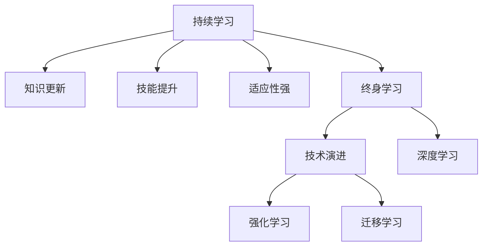

                 

# 学无止境:持续学习的重要性

> 关键词：持续学习, 终身学习, 知识更新, 技术演进, 自适应能力, 人工智能, 机器学习, 深度学习

## 1. 背景介绍

### 1.1 问题由来

在快速发展的信息技术时代，技术迭代速度越来越快，知识更新频率越来越高。如何不断学习新技术，掌握新知识，成为了每个从业者必须面对的挑战。尤其是在人工智能(AI)和机器学习(ML)领域，技术的进步不仅体现在算法创新上，还体现在模型的适应性和可扩展性上。持续学习成为了提升从业者能力，保持技术领先地位的关键。

### 1.2 问题核心关键点

持续学习是指在职业生涯中不断学习新知识、掌握新技能，并将其应用于实践的过程。持续学习的关键在于：

1. **知识更新**：随着技术的发展，旧知识可能不再适用，新知识成为工作的必备。
2. **技能提升**：通过不断的学习，提升解决复杂问题的能力，优化工作表现。
3. **适应性强**：保持对新技术和变化的敏感度，快速适应新环境和新任务。
4. **终身学习**：将学习视为一种生活方式，不断追求自我提升和专业成长。

## 2. 核心概念与联系

### 2.1 核心概念概述

为更好地理解持续学习的重要性，本节将介绍几个密切相关的核心概念：

- **持续学习(Continuous Learning)**：指在职业生涯中持续学习新知识，不断提升技能和适应能力。
- **终身学习(Lifelong Learning)**：将学习视为一种生活方式，追求知识和技能的持续发展。
- **自适应能力(Adaptability)**：指个人或系统能够根据环境变化快速调整和适应的能力。
- **技术演进(Technology Evolution)**：技术的发展和演变，包括新算法的出现、新模型的设计等。
- **知识图谱(Knowledge Graph)**：用于表示实体和关系的图形结构，帮助理解和整合知识。
- **深度学习(Deep Learning)**：一种基于神经网络的机器学习技术，擅长处理复杂数据和模式。
- **强化学习(Reinforcement Learning)**：通过与环境交互，逐步优化决策策略的学习方式。
- **迁移学习(Transfer Learning)**：利用在其他任务上学习到的知识，加速在新任务上的学习过程。

这些核心概念之间的逻辑关系可以通过以下Mermaid流程图来展示：



这个流程图展示了大模型微调的持续学习系统的核心概念及其之间的关系：

1. 持续学习通过知识更新和技能提升，提升适应性。
2. 终身学习作为一种持续学习的方式，追求知识的持续发展。
3. 技术演进推动持续学习的进步，带来新的学习工具和方法。
4. 深度学习和强化学习作为技术演进的一部分，为持续学习提供支持。
5. 迁移学习帮助持续学习跨领域应用，拓宽学习范围。

## 3. 核心算法原理 & 具体操作步骤
### 3.1 算法原理概述

持续学习的核心在于利用已有知识加速新知识的学习，利用旧技能辅助新技能的学习。这一过程可以通过监督学习、迁移学习、无监督学习和强化学习等多种方式实现。

**监督学习**：通过已有标注数据，训练模型进行新任务的预测。例如，利用过去的经验数据，训练模型对新客户的信用评分进行预测。

**迁移学习**：将在一个任务上学习到的知识，迁移到另一个相关任务上。例如，在图像分类任务上训练的模型，可以迁移到目标检测任务上进行微调。

**无监督学习**：在无标注数据上训练模型，学习数据的潜在分布和结构。例如，使用自编码器学习数据的压缩表示。

**强化学习**：通过与环境的交互，逐步优化决策策略。例如，训练机器人通过试错学习如何完成复杂的动作。

### 3.2 算法步骤详解

**Step 1: 数据收集与处理**

- **数据收集**：收集相关的数据集，可以是文本、图像、声音等。数据应该尽可能全面，涵盖不同的场景和案例。
- **数据预处理**：对数据进行清洗、归一化、特征提取等预处理步骤，确保数据质量。

**Step 2: 模型选择与训练**

- **模型选择**：选择适合的模型，如神经网络、深度学习模型、强化学习模型等。
- **模型训练**：使用监督、迁移、无监督或强化学习方法对模型进行训练。

**Step 3: 模型评估与优化**

- **评估指标**：根据任务需求，设定评估指标，如准确率、召回率、F1分数等。
- **模型优化**：根据评估结果，调整模型参数，优化模型性能。

**Step 4: 应用与迭代**

- **模型应用**：将训练好的模型应用于实际任务中，进行预测或决策。
- **持续迭代**：根据实际应用中的反馈和效果，持续进行模型更新和优化。

### 3.3 算法优缺点

持续学习有以下优点：

1. **快速适应**：在面对新任务和新数据时，能够快速学习和适应，缩短新任务上手时间。
2. **知识复用**：利用已有知识加速新知识的学习，减少从头开始的时间成本。
3. **模型鲁棒性**：通过不断的微调和优化，提高模型的稳定性和鲁棒性。
4. **性能提升**：持续学习能够逐步提升模型的性能，提高任务完成质量。

同时，持续学习也存在以下缺点：

1. **学习曲线陡峭**：对于复杂模型和新技术，学习曲线可能较为陡峭，需要较长时间掌握。
2. **资源消耗大**：持续学习需要大量的计算资源和数据支持，对硬件和数据要求较高。
3. **知识泛化能力有限**：过于依赖已有知识，可能导致新知识的学习泛化能力不足。
4. **更新频率高**：需要频繁进行模型更新和迭代，可能影响业务的稳定性。

尽管存在这些缺点，但就目前而言，持续学习是大模型微调的重要方法，能够显著提升模型的适应性和应用范围。未来相关研究的重点在于如何更好地平衡学习效率和模型性能，同时兼顾可解释性和伦理安全性等因素。

### 3.4 算法应用领域

持续学习技术在人工智能领域已经被广泛应用于多个领域，例如：

- **医疗诊断**：通过持续学习，提升医疗影像分析、病历分析的准确性。
- **金融预测**：利用持续学习，提高金融市场预测、风险评估的准确性。
- **智能客服**：通过持续学习，优化对话模型，提升客户服务质量。
- **推荐系统**：利用持续学习，优化用户行为预测和推荐策略。
- **自然语言处理**：通过持续学习，提升文本生成、语言理解的能力。
- **自动驾驶**：通过持续学习，优化决策模型，提高行车安全性。

除了上述这些领域外，持续学习还被创新性地应用到更多场景中，如个性化推荐、广告投放、内容生成等，为人工智能技术带来了全新的突破。随着持续学习方法和模型的不断进步，相信AI技术将在更广阔的应用领域大放异彩。

## 4. 数学模型和公式 & 详细讲解  
### 4.1 数学模型构建

本节将使用数学语言对持续学习过程进行更加严格的刻画。

记持续学习模型为 $M_{\theta}$，其中 $\theta$ 为模型参数。假设当前任务为 $T$，已有的知识库为 $K$。持续学习的过程可以表示为：

$$
M_{\theta} \leftarrow M_{\theta} + \alpha \sum_{i=1}^{N} \nabla_{\theta} \ell(M_{\theta},(x_i, y_i)) + \beta \sum_{k \in K} \nabla_{\theta} \ell(M_{\theta},k)
$$

其中 $\alpha$ 和 $\beta$ 为学习率和知识权重，$\ell$ 为损失函数，$(x_i, y_i)$ 为当前任务的数据样本，$k$ 为知识库中的样本。

### 4.2 公式推导过程

以下我们以金融市场预测为例，推导持续学习模型在股票价格预测中的应用。

假设已有的知识库 $K$ 包含了历史股票价格、市场指标、公司财报等信息。持续学习模型 $M_{\theta}$ 在当前时间点 $t$ 对未来时间点 $t+1$ 的股票价格 $y_{t+1}$ 进行预测。通过知识库 $K$ 中的历史数据 $(x_k, y_k)$ 对模型进行微调，使得模型在当前时间点的预测误差最小化。

假设模型 $M_{\theta}$ 在当前时间点 $t$ 的预测为 $y_{t+1} = f_{\theta}(x_t)$，其中 $f_{\theta}$ 为模型的预测函数，$x_t$ 为当前时间点的特征。模型在历史数据上的误差可以通过损失函数 $\ell$ 来衡量。

持续学习模型在每个时间点 $t$ 的更新公式为：

$$
M_{\theta} \leftarrow M_{\theta} + \alpha \nabla_{\theta} \ell(f_{\theta}(x_t), y_{t+1})
$$

其中 $\alpha$ 为学习率，$\nabla_{\theta} \ell(f_{\theta}(x_t), y_{t+1})$ 为模型在当前时间点的预测误差梯度。

通过持续学习，模型能够不断优化预测函数 $f_{\theta}$，提高股票价格预测的准确性。

## 5. 项目实践：代码实例和详细解释说明
### 5.1 开发环境搭建

在进行持续学习实践前，我们需要准备好开发环境。以下是使用Python进行TensorFlow开发的环境配置流程：

1. 安装Anaconda：从官网下载并安装Anaconda，用于创建独立的Python环境。

2. 创建并激活虚拟环境：
```bash
conda create -n tf-env python=3.8 
conda activate tf-env
```

3. 安装TensorFlow：
```bash
conda install tensorflow tensorflow-gpu=2.7.0 -c conda-forge
```

4. 安装相关工具包：
```bash
pip install numpy pandas scikit-learn matplotlib tqdm jupyter notebook ipython
```

完成上述步骤后，即可在`tf-env`环境中开始持续学习实践。

### 5.2 源代码详细实现

这里我们以金融市场预测为例，使用TensorFlow搭建一个简单的持续学习模型。

首先，定义模型的输入和输出：

```python
import tensorflow as tf
import numpy as np

# 定义模型输入和输出
input_size = 10  # 特征维度
output_size = 1  # 股票价格预测值
num_epochs = 1000  # 训练轮数
learning_rate = 0.01  # 学习率

# 定义模型结构
model = tf.keras.Sequential([
    tf.keras.layers.Dense(64, activation='relu', input_shape=(input_size,)),
    tf.keras.layers.Dense(output_size)
])
```

然后，定义损失函数和优化器：

```python
# 定义损失函数和优化器
loss_fn = tf.keras.losses.MeanSquaredError()
optimizer = tf.keras.optimizers.Adam(learning_rate=learning_rate)
```

接着，定义数据生成器：

```python
# 生成随机数据
def generate_data(num_samples):
    X = np.random.rand(num_samples, input_size)
    y = np.random.rand(num_samples, output_size)
    return X, y

# 生成历史数据
X_train, y_train = generate_data(10000)
```

最后，定义训练函数：

```python
# 定义训练函数
@tf.function
def train_step(X, y):
    with tf.GradientTape() as tape:
        y_pred = model(X)
        loss = loss_fn(y, y_pred)
    grads = tape.gradient(loss, model.trainable_variables)
    optimizer.apply_gradients(zip(grads, model.trainable_variables))
    return loss

# 训练模型
for epoch in range(num_epochs):
    loss = train_step(X_train, y_train)
    if (epoch + 1) % 100 == 0:
        print(f"Epoch {epoch+1}, Loss: {loss.numpy():.4f}")
```

### 5.3 代码解读与分析

让我们再详细解读一下关键代码的实现细节：

**训练函数**：
- `train_step`函数：使用TensorFlow定义一个训练步骤，包含前向传播和反向传播。
- 使用`tf.GradientTape`记录梯度，计算损失函数，使用`optimizer.apply_gradients`更新模型参数。

**数据生成器**：
- `generate_data`函数：生成随机数据，用于模拟历史股票价格。
- 在实际应用中，可以使用真实的历史数据集进行模型训练和验证。

**训练流程**：
- 定义训练轮数和特征维度，构建模型结构。
- 定义损失函数和优化器，进行模型初始化。
- 生成随机数据集，用于训练模型。
- 定义训练函数，在每个epoch内循环迭代，更新模型参数。
- 在每个epoch结束时，输出训练损失。

可以看到，TensorFlow使得持续学习模型的代码实现变得简洁高效。开发者可以将更多精力放在数据处理、模型改进等高层逻辑上，而不必过多关注底层的实现细节。

当然，工业级的系统实现还需考虑更多因素，如模型的保存和部署、超参数的自动搜索、更灵活的任务适配层等。但核心的持续学习范式基本与此类似。

## 6. 实际应用场景
### 6.1 智能客服系统

持续学习技术可以广泛应用于智能客服系统的构建。传统客服往往需要配备大量人力，高峰期响应缓慢，且一致性和专业性难以保证。通过持续学习，客服系统能够不断更新知识库，优化对话模型，提升服务质量。

在技术实现上，可以收集企业内部的历史客服对话记录，将问题和最佳答复构建成监督数据，在此基础上对预训练对话模型进行微调。持续学习模型能够根据最新对话记录和用户反馈，不断调整模型参数，提升对话模型的适应性和准确性。

### 6.2 金融舆情监测

金融机构需要实时监测市场舆论动向，以便及时应对负面信息传播，规避金融风险。传统的人工监测方式成本高、效率低，难以应对网络时代海量信息爆发的挑战。通过持续学习，金融舆情监测系统能够不断更新知识库，优化模型，提高对市场动态的响应速度和准确性。

具体而言，可以收集金融领域相关的新闻、报道、评论等文本数据，并对其进行主题标注和情感标注。在此基础上对预训练语言模型进行微调，使其能够自动判断文本属于何种主题，情感倾向是正面、中性还是负面。将持续学习模型应用到实时抓取的网络文本数据，就能够自动监测不同主题下的情感变化趋势，一旦发现负面信息激增等异常情况，系统便会自动预警，帮助金融机构快速应对潜在风险。

### 6.3 个性化推荐系统

当前的推荐系统往往只依赖用户的历史行为数据进行物品推荐，无法深入理解用户的真实兴趣偏好。通过持续学习，个性化推荐系统能够不断更新知识库，优化推荐策略，提升推荐效果。

在实践中，可以收集用户浏览、点击、评论、分享等行为数据，提取和用户交互的物品标题、描述、标签等文本内容。将文本内容作为模型输入，用户的后续行为（如是否点击、购买等）作为监督信号，在此基础上微调预训练语言模型。持续学习模型能够根据最新行为数据，不断调整模型参数，提升推荐模型的个性化程度和推荐效果。

### 6.4 未来应用展望

随着持续学习方法和模型的不断发展，基于微调范式将在更多领域得到应用，为传统行业带来变革性影响。

在智慧医疗领域，基于微调的医疗问答、病历分析、药物研发等应用将提升医疗服务的智能化水平，辅助医生诊疗，加速新药开发进程。

在智能教育领域，持续学习技术可应用于作业批改、学情分析、知识推荐等方面，因材施教，促进教育公平，提高教学质量。

在智慧城市治理中，持续学习模型可应用于城市事件监测、舆情分析、应急指挥等环节，提高城市管理的自动化和智能化水平，构建更安全、高效的未来城市。

此外，在企业生产、社会治理、文娱传媒等众多领域，基于大模型微调的人工智能应用也将不断涌现，为经济社会发展注入新的动力。

## 7. 工具和资源推荐
### 7.1 学习资源推荐

为了帮助开发者系统掌握持续学习技术，这里推荐一些优质的学习资源：

1. **《深度学习》by Ian Goodfellow**：深度学习领域的经典教材，涵盖深度学习的基本原理和算法。
2. **CS231n《深度学习视觉识别》课程**：斯坦福大学开设的深度学习视觉识别课程，包含丰富的视频和代码示例。
3. **Coursera《机器学习》课程**：由斯坦福大学Andrew Ng教授开设，系统介绍机器学习的基本概念和算法。
4. **Kaggle竞赛**：Kaggle是一个数据科学竞赛平台，提供大量实际问题，供开发者实践和提升技能。
5. **Google AI Blog**：谷歌AI官方博客，提供最新的AI技术和应用案例，值得关注和学习。

通过对这些资源的学习实践，相信你一定能够快速掌握持续学习技术的精髓，并用于解决实际的AI问题。
###  7.2 开发工具推荐

高效的开发离不开优秀的工具支持。以下是几款用于持续学习开发的常用工具：

1. **TensorFlow**：由Google主导开发的开源深度学习框架，生产部署方便，适合大规模工程应用。
2. **PyTorch**：基于Python的开源深度学习框架，灵活的动态计算图，适合快速迭代研究。
3. **Weights & Biases**：模型训练的实验跟踪工具，可以记录和可视化模型训练过程中的各项指标，方便对比和调优。
4. **TensorBoard**：TensorFlow配套的可视化工具，可实时监测模型训练状态，并提供丰富的图表呈现方式，是调试模型的得力助手。
5. **Jupyter Notebook**：开源的交互式计算环境，方便开发者编写和分享代码。

合理利用这些工具，可以显著提升持续学习任务的开发效率，加快创新迭代的步伐。

### 7.3 相关论文推荐

持续学习技术的发展源于学界的持续研究。以下是几篇奠基性的相关论文，推荐阅读：

1. **《TensorFlow》白皮书**：谷歌发布的TensorFlow白皮书，详细介绍了TensorFlow的架构和应用。
2. **《深度学习优化》by John Duchi**：深度学习优化算法的经典教材，涵盖各种优化算法的设计和实现。
3. **《迁移学习》by Zbigniew Witkowski**：迁移学习领域的经典教材，涵盖迁移学习的基本原理和算法。
4. **《强化学习》by Richard S. Sutton**：强化学习领域的经典教材，涵盖强化学习的基本概念和算法。
5. **《在线学习》by Hui Zou**：在线学习领域的经典教材，涵盖在线学习的基本原理和算法。

这些论文代表了大模型微调技术的发展脉络。通过学习这些前沿成果，可以帮助研究者把握学科前进方向，激发更多的创新灵感。

## 8. 总结：未来发展趋势与挑战

### 8.1 总结

本文对持续学习的重要性进行了全面系统的介绍。首先阐述了持续学习技术在快速变化的技术环境中的重要性，明确了持续学习在提升技术适应性、加速知识更新方面的独特价值。其次，从原理到实践，详细讲解了持续学习的基本步骤和关键技术，给出了持续学习任务开发的完整代码实例。同时，本文还广泛探讨了持续学习技术在多个行业领域的应用前景，展示了持续学习范式的巨大潜力。

通过本文的系统梳理，可以看到，持续学习技术正在成为AI领域的重要范式，极大地拓展了AI系统的应用边界，催生了更多的落地场景。受益于持续学习的持续进步，AI技术将在更广阔的应用领域大放异彩，深刻影响人类的生产生活方式。

### 8.2 未来发展趋势

展望未来，持续学习技术将呈现以下几个发展趋势：

1. **自动化**：通过自动化技术，减少人工干预，提升持续学习的效率和稳定性。
2. **集成化**：将持续学习与其他AI技术（如深度学习、强化学习等）进行集成，形成更加全面的AI系统。
3. **个性化**：通过个性化推荐和定制化服务，提升持续学习的用户体验和应用效果。
4. **跨领域**：将持续学习应用于跨领域任务，提升AI系统在多个领域的适应性和表现。
5. **人机协作**：通过人机协作，提升持续学习的智能水平和决策能力。

以上趋势凸显了持续学习技术的广阔前景。这些方向的探索发展，必将进一步提升AI系统的性能和应用范围，为人类认知智能的进化带来深远影响。

### 8.3 面临的挑战

尽管持续学习技术已经取得了瞩目成就，但在迈向更加智能化、普适化应用的过程中，它仍面临着诸多挑战：

1. **数据获取**：持续学习需要大量的标注数据和未标注数据，数据获取成本较高。
2. **模型复杂度**：大型模型的持续学习过程复杂，资源消耗大，需要高效的算法和硬件支持。
3. **知识更新频率**：知识库的更新频率高，需要实时监控和更新，增加系统的维护成本。
4. **模型鲁棒性**：模型面对噪声和异常情况时，鲁棒性不足，容易出现错误。
5. **安全性**：模型可能学习到有害信息，需要设计安全机制进行防范。

尽管存在这些挑战，但就目前而言，持续学习是大模型微调的重要方法，能够显著提升模型的适应性和应用范围。未来相关研究的重点在于如何更好地平衡学习效率和模型性能，同时兼顾可解释性和伦理安全性等因素。

### 8.4 研究展望

面对持续学习所面临的种种挑战，未来的研究需要在以下几个方面寻求新的突破：

1. **高效算法**：开发更加高效的持续学习算法，减少计算资源消耗，提升学习速度。
2. **自适应学习**：研究自适应学习算法，使模型能够根据数据分布自动调整学习策略。
3. **迁移学习**：进一步研究迁移学习，提升模型在跨领域任务中的表现。
4. **知识图谱**：研究知识图谱的应用，提升模型的知识整合能力。
5. **多模态学习**：研究多模态学习算法，提升模型的跨模态适应能力。

这些研究方向的探索，必将引领持续学习技术迈向更高的台阶，为构建安全、可靠、可解释、可控的智能系统铺平道路。面向未来，持续学习技术还需要与其他人工智能技术进行更深入的融合，如知识表示、因果推理、强化学习等，多路径协同发力，共同推动自然语言理解和智能交互系统的进步。只有勇于创新、敢于突破，才能不断拓展持续学习技术的边界，让智能技术更好地造福人类社会。

## 9. 附录：常见问题与解答

**Q1：持续学习是否适用于所有AI任务？**

A: 持续学习在大多数AI任务上都能取得不错的效果，特别是对于数据量较小的任务。但对于一些特定领域的任务，如医学、法律等，仅仅依靠通用语料预训练的模型可能难以很好地适应。此时需要在特定领域语料上进一步预训练，再进行微调，才能获得理想效果。此外，对于一些需要时效性、个性化很强的任务，如对话、推荐等，持续学习方法也需要针对性的改进优化。

**Q2：如何进行持续学习系统的部署和维护？**

A: 将持续学习模型转化为实际应用，还需要考虑以下因素：
1. **模型裁剪**：去除不必要的层和参数，减小模型尺寸，加快推理速度
2. **量化加速**：将浮点模型转为定点模型，压缩存储空间，提高计算效率
3. **服务化封装**：将模型封装为标准化服务接口，便于集成调用
4. **弹性伸缩**：根据请求流量动态调整资源配置，平衡服务质量和成本
5. **监控告警**：实时采集系统指标，设置异常告警阈值，确保服务稳定性
6. **安全防护**：采用访问鉴权、数据脱敏等措施，保障数据和模型安全

**Q3：持续学习在实际应用中可能面临哪些挑战？**

A: 持续学习面临的挑战主要包括：
1. **数据获取**：持续学习需要大量的标注数据和未标注数据，数据获取成本较高。
2. **模型复杂度**：大型模型的持续学习过程复杂，资源消耗大，需要高效的算法和硬件支持。
3. **知识更新频率**：知识库的更新频率高，需要实时监控和更新，增加系统的维护成本。
4. **模型鲁棒性**：模型面对噪声和异常情况时，鲁棒性不足，容易出现错误。
5. **安全性**：模型可能学习到有害信息，需要设计安全机制进行防范。

正视持续学习面临的这些挑战，积极应对并寻求突破，将是大模型微调走向成熟的必由之路。相信随着学界和产业界的共同努力，这些挑战终将一一被克服，持续学习技术必将在构建安全、可靠、可解释、可控的智能系统铺平道路。

