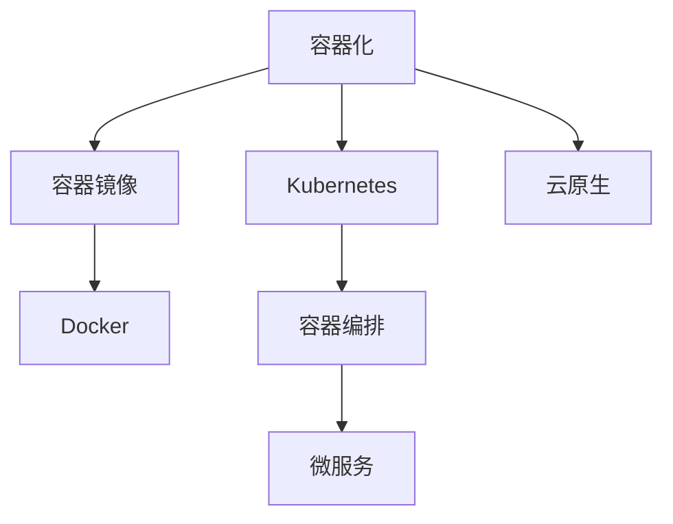

                 

# 容器化技术：Docker与Kubernetes实践

> 关键词：容器化, Docker, Kubernetes, 微服务, 部署, 容器编排, 云原生

## 1. 背景介绍

### 1.1 问题由来
随着云计算的普及和应用场景的日益增多，企业的IT架构变得越来越复杂。传统虚拟机(Virtual Machine, VM)资源浪费大、扩展困难、应用打包部署复杂等问题逐渐凸显。容器化技术应运而生，它通过轻量级的容器镜像实现应用隔离，极大地提高了资源利用率和应用部署效率。

在容器化技术中，Docker 和 Kubernetes 是两个最为核心的组件。Docker 提供了容器化的基础平台，实现了应用的软件和依赖打包成容器镜像的功能；而 Kubernetes 则是一个开源的容器编排系统，负责自动化容器调度、部署、扩展和管理，为大规模应用的容器化部署提供了强有力的支持。

## 2. 核心概念与联系

### 2.1 核心概念概述

为更好地理解Docker与Kubernetes，本节将介绍几个密切相关的核心概念：

- 容器化：通过将应用及其依赖打包成容器镜像的方式，实现应用在任意环境中的跨平台、一致性部署。
- 容器镜像：一个包含应用及其依赖的打包文件，包含了应用运行所需的所有文件、配置、库和环境变量，可以独立部署。
- Docker：开源的容器化平台，提供了一套完整的容器生命周期管理工具，包括镜像构建、运行、传输等。
- Kubernetes：开源的容器编排系统，通过集群管理和自动化部署，提供高可用性、可扩展性和自动化的容器管理能力。
- 微服务：将单体应用拆分为多个独立运行的微服务，每个服务负责单一职责，通过轻量级容器实现服务的松耦合。
- 容器编排：通过自动化工具，实现容器在集群中的调度、编排和资源管理。
- 云原生：一种新兴的计算模式，强调通过容器和微服务架构，实现应用的可移植性、可伸缩性和可弹性扩展。

这些核心概念之间的逻辑关系可以通过以下Mermaid流程图来展示：



这个流程图展示了一些核心概念及其之间的关系：

1. 容器化技术将应用打包成容器镜像，通过Docker平台实现容器化部署。
2. Kubernetes容器编排系统负责管理Docker容器，实现容器的高可用性和自动化部署。
3. 微服务架构通过容器化技术实现应用的松耦合和独立部署，增强了系统的可伸缩性和可扩展性。
4. 云原生应用采用容器化和微服务架构，实现应用的自动化部署、扩展和更新，适应了云环境下的高动态需求。

## 3. 核心算法原理 & 具体操作步骤
### 3.1 算法原理概述

Docker与Kubernetes的实践，本质上是一个从软件包管理到自动化部署的流程。其核心思想是：将应用及其依赖打包成容器镜像，通过Docker进行打包和分发，然后通过Kubernetes进行容器调度、部署和扩展管理。

形式化地，假设应用及其依赖的打包过程为 $P$，Docker的镜像构建过程为 $C$，Kubernetes的容器调度过程为 $S$，则整个流程可以表示为：

$$
\text{应用程序} \xrightarrow{P} \text{容器镜像} \xrightarrow{C} \text{容器镜像} \xrightarrow{S} \text{容器实例}
$$

即：

1. 将应用及其依赖打包成容器镜像 $P$；
2. 使用Docker构建容器镜像 $C$；
3. 使用Kubernetes进行容器调度、部署和扩展管理 $S$；
4. 运行容器实例，提供服务。

### 3.2 算法步骤详解

容器化技术Docker与Kubernetes的实践一般包括以下几个关键步骤：

**Step 1: 准备应用及其依赖**

- 选择适合容器化的应用，并分析其依赖关系，确定需要哪些第三方库和依赖项。
- 对依赖项进行管理，通常使用包管理工具如Maven、npm等。

**Step 2: 构建容器镜像**

- 编写Dockerfile文件，定义应用的构建过程，包括环境配置、依赖安装、代码编译、运行测试等步骤。
- 使用Docker命令构建容器镜像，并推送到容器镜像仓库。

**Step 3: 配置Kubernetes集群**

- 准备Kubernetes集群，可以部署在公有云平台如AWS、Azure等，或搭建私有Kubernetes集群。
- 配置集群资源，包括节点、存储、网络等。

**Step 4: 部署应用到Kubernetes**

- 将容器镜像部署到Kubernetes集群中，使用Deployment或StatefulSet等资源实现应用的自动化部署。
- 定义Kubernetes服务的配置，包括Pod的副本数、优先级、标签和选择器等。
- 使用Kubernetes的Service资源实现应用的负载均衡和网络配置。

**Step 5: 扩展和管理容器实例**

- 通过Horizontal Pod Autoscaler(HPA)或Cluster Autoscaler自动扩展容器实例，确保应用的可用性和负载均衡。
- 使用Kubernetes的ConfigMap和Secrets管理应用的配置和敏感信息。
- 监控应用性能，使用Prometheus等工具收集和分析指标。

### 3.3 算法优缺点

Docker与Kubernetes的实践具有以下优点：

- 轻量级：容器镜像只包含应用运行所需的必要文件，占用的资源少，部署速度快。
- 一致性：容器镜像在任意环境下都能一致运行，不受操作系统和硬件差异的影响。
- 可移植性：容器镜像可以在不同云平台和本地环境之间进行迁移，提高了应用的灵活性和可移植性。
- 自动化：Kubernetes提供了自动化部署和扩展管理，减少了人工干预和操作复杂度。
- 高可用性：通过Kubernetes的高可用性和自动扩展能力，提高了应用系统的可靠性和可伸缩性。

同时，该方法也存在一定的局限性：

- 学习曲线陡峭：Docker和Kubernetes的学习曲线较陡，需要掌握一定的运维和部署技能。
- 复杂性：大规模应用的环境配置和管理可能比较复杂，需要系统的规划和设计。
- 资源管理难度：需要监控和管理容器资源的消耗，防止资源浪费或过载。
- 依赖性：依赖于容器平台和基础设施的稳定性和可靠性。

尽管存在这些局限性，但就目前而言，Docker与Kubernetes的实践已经成为了企业应用容器化的主流范式。未来相关研究的重点在于如何进一步简化容器化部署流程，优化容器编排的自动化和灵活性，以及提高容器环境的稳定性和可扩展性。

### 3.4 算法应用领域

Docker与Kubernetes的实践在企业应用中得到了广泛应用，涵盖了许多不同的场景：

- 云原生应用：通过容器化和微服务架构，实现应用的高可用性、可伸缩性和可扩展性。
- 持续集成与持续部署(CI/CD)：通过容器化技术，实现自动化构建、测试和部署流程。
- 微服务架构：将单体应用拆分为多个独立运行的微服务，通过轻量级容器实现服务的松耦合和独立部署。
- 应用自动化部署：通过Kubernetes的自动化部署能力，实现应用的快速部署和更新。
- 服务网格(Istio)：通过服务网格技术，实现微服务的智能路由、流量控制和负载均衡。

除了上述这些经典场景外，Docker与Kubernetes的实践也被创新性地应用到更多场景中，如DevOps、边缘计算、移动应用等，为企业的数字化转型和智能化升级提供了新的技术路径。

## 4. 数学模型和公式 & 详细讲解  
### 4.1 数学模型构建

本节将使用数学语言对Docker与Kubernetes的实践过程进行更加严格的刻画。

记应用及其依赖的打包过程为 $P$，Docker的镜像构建过程为 $C$，Kubernetes的容器调度过程为 $S$，则整个流程可以表示为：

$$
\text{应用程序} \xrightarrow{P} \text{容器镜像} \xrightarrow{C} \text{容器镜像} \xrightarrow{S} \text{容器实例}
$$

其中，$P$、$C$、$S$ 分别对应于应用打包、Docker构建和Kubernetes调度的数学模型。

### 4.2 公式推导过程

以应用打包过程 $P$ 为例，假设应用及其依赖需要打包成镜像，每个依赖的打包过程可以表示为 $P_i$，其中 $i$ 表示依赖的序号。则应用打包过程可以表示为：

$$
P = P_1 \times P_2 \times \ldots \times P_n
$$

其中 $\times$ 表示并行执行。假设每个依赖的打包过程是独立的，则应用打包过程的总时间为：

$$
T_P = T_{P_1} + T_{P_2} + \ldots + T_{P_n}
$$

假设每个依赖的打包时间为 $T_i$，则：

$$
T_{P_i} = \max(T_i, T_i')
$$

其中 $T_i'$ 表示依赖的检查和安装时间。因此，应用打包过程的总时间为：

$$
T_P = \sum_{i=1}^n \max(T_i, T_i')
$$

Docker镜像构建过程 $C$ 和 Kubernetes容器调度过程 $S$ 的数学模型推导与 $P$ 类似。

### 4.3 案例分析与讲解

下面以一个简单的Web应用为例，展示Docker与Kubernetes的实践过程。

**Step 1: 准备应用及其依赖**

假设应用是一个基于Java Web框架的Web应用，需要依赖Tomcat服务器和MySQL数据库。

**Step 2: 构建容器镜像**

编写Dockerfile文件，定义应用的构建过程：

```Dockerfile
# 使用官方Java基础镜像
FROM java:11-jre-alpine
# 设置工作目录
WORKDIR /app
# 复制代码和依赖
COPY . /app
COPY ./docker-entrypoint.sh .
RUN mvn package
# 打包JAR文件
RUN mvn jar:jar
# 暴露端口
EXPOSE 8080
# 启动JAR文件
ENTRYPOINT ["sh", "docker-entrypoint.sh"]
```

使用Docker命令构建容器镜像，并推送到容器镜像仓库：

```bash
docker build -t my-web-app .
docker push my-web-app:latest
```

**Step 3: 配置Kubernetes集群**

假设Kubernetes集群已经搭建完毕，集群中的节点数量为3，每个节点配置了2个CPU和4GB内存。

**Step 4: 部署应用到Kubernetes**

定义Deployment和Service资源配置文件，将容器镜像部署到Kubernetes集群中：

```yaml
apiVersion: apps/v1
kind: Deployment
metadata:
  name: my-web-app
spec:
  replicas: 3
  selector:
    matchLabels:
      app: my-web-app
  template:
    metadata:
      labels:
        app: my-web-app
    spec:
      containers:
      - name: my-web-app
        image: my-web-app:latest
        ports:
        - containerPort: 8080
        env:
        - name: DB_HOST
          value: db
        - name: DB_PORT
          value: 3306
---
apiVersion: v1
kind: Service
metadata:
  name: my-web-app
spec:
  selector:
    app: my-web-app
  ports:
  - protocol: TCP
    port: 80
    targetPort: 8080
```

使用kubectl命令部署应用：

```bash
kubectl apply -f deployment.yaml
kubectl apply -f service.yaml
```

**Step 5: 扩展和管理容器实例**

使用Horizontal Pod Autoscaler(HPA)实现应用的自动扩展：

```yaml
apiVersion: autoscaling/v1
kind: HorizontalPodAutoscaler
metadata:
  name: my-web-app
spec:
  scaleTargetRef:
    apiVersion: apps/v1
    kind: Deployment
    name: my-web-app
  minReplicas: 1
  maxReplicas: 10
  targetCPUUtilizationPercentage: 70
```

通过Prometheus和Grafana监控应用性能：

```bash
kubectl apply -f prometheus.yaml
kubectl apply -f grafana.yaml
```

以上就是使用Docker与Kubernetes进行Web应用容器化部署的完整流程。可以看到，Docker与Kubernetes的实践使得应用部署和管理变得更加简单、高效和可靠。

## 5. 项目实践：代码实例和详细解释说明
### 5.1 开发环境搭建

在进行Docker与Kubernetes实践前，我们需要准备好开发环境。以下是使用Python进行Kubernetes开发的安装环境配置流程：

1. 安装Anaconda：从官网下载并安装Anaconda，用于创建独立的Python环境。

2. 创建并激活虚拟环境：
```bash
conda create -n k8s-env python=3.8 
conda activate k8s-env
```

3. 安装kubectl：
```bash
conda install kubectl
```

4. 安装Kubernetes客户端：
```bash
pip install kubernetes
```

5. 安装Python的kube-rbac-proxy：
```bash
pip install kube-rbac-proxy
```

完成上述步骤后，即可在`k8s-env`环境中开始Kubernetes开发。

### 5.2 源代码详细实现

下面我们以部署MySQL数据库为例，展示如何使用Docker与Kubernetes进行容器化部署。

首先，编写Dockerfile文件，定义MySQL数据库的构建过程：

```Dockerfile
# 使用官方MySQL基础镜像
FROM mysql:8.0
# 设置工作目录
WORKDIR /mysql
# 设置MySQL用户和密码
ENV MYSQL_ROOT_PASSWORD=my-secret
# 暴露端口
EXPOSE 3306
# 启动MySQL服务
CMD ["mysqld"]
```

使用Docker命令构建容器镜像，并推送到容器镜像仓库：

```bash
docker build -t mysql .
docker push mysql:latest
```

接着，定义Kubernetes集群和MySQL数据库的配置文件：

```yaml
apiVersion: v1
kind: Service
metadata:
  name: mysql
spec:
  selector:
    app: mysql
  ports:
  - protocol: TCP
    port: 3306
    targetPort: 3306
---
apiVersion: apps/v1
kind: Deployment
metadata:
  name: mysql
spec:
  replicas: 3
  selector:
    matchLabels:
      app: mysql
  template:
    metadata:
      labels:
        app: mysql
    spec:
      containers:
      - name: mysql
        image: mysql:latest
        ports:
        - containerPort: 3306
        env:
        - name: MYSQL_ROOT_PASSWORD
          value: my-secret
```

使用kubectl命令部署MySQL数据库：

```bash
kubectl apply -f mysql-service.yaml
kubectl apply -f mysql-deployment.yaml
```

### 5.3 代码解读与分析

让我们再详细解读一下关键代码的实现细节：

**Dockerfile文件**：
- 使用官方MySQL基础镜像，设置MySQL用户和密码，暴露端口，并启动MySQL服务。

**Kubernetes配置文件**：
- 定义了一个Service资源，用于负载均衡和暴露MySQL数据库的端口。
- 定义了一个Deployment资源，指定了MySQL容器的镜像、副本数、标签等，实现了MySQL数据库的自动化部署和管理。

**部署命令**：
- 使用kubectl命令分别将Service和Deployment资源文件应用到Kubernetes集群中，实现了MySQL数据库的部署和自动扩展。

通过以上代码，可以看到，Docker与Kubernetes的实践使得容器化部署变得非常简单高效。开发者可以将更多精力放在应用开发上，而不必过多关注底层的容器管理细节。

当然，工业级的系统实现还需考虑更多因素，如安全管理、网络配置、资源优化等。但核心的容器化流程基本与此类似。

## 6. 实际应用场景
### 6.1 云原生应用

基于Docker与Kubernetes的实践，云原生应用可以更好地实现高可用性、可伸缩性和可扩展性。云原生应用通常采用微服务架构，通过容器化技术实现服务的松耦合和独立部署。

在技术实现上，可以收集应用的历史运行数据，将日志、配置、代码等打包成容器镜像，再通过Kubernetes进行自动化部署和扩展管理。云原生应用可以自动应对负载波动，快速扩展和更新，适应大规模应用的部署需求。

### 6.2 持续集成与持续部署(CI/CD)

Docker与Kubernetes的实践为CI/CD提供了坚实的基础。通过容器化技术，可以将应用及其依赖打包成容器镜像，在测试和部署时通过Docker构建镜像，使用Kubernetes进行自动化部署和管理。

在实践上，可以通过Jenkins、GitLab CI等CI/CD工具，集成Docker与Kubernetes，实现应用的自动化构建、测试和部署。通过自动化流程，可以快速迭代开发，缩短产品上市时间。

### 6.3 微服务架构

微服务架构通过容器化技术，实现服务的松耦合和独立部署。每个微服务独立运行在容器实例中，通过Kubernetes进行管理，提高了系统的可伸缩性和可扩展性。

在实践上，可以将应用拆分为多个独立的服务，每个服务实现单一的业务逻辑，通过容器化和Kubernetes部署。每个服务可以独立扩展和更新，减少系统的整体耦合度和维护复杂度。

### 6.4 未来应用展望

随着Docker与Kubernetes的不断发展，基于容器化技术的部署和运维将成为主流范式。未来，Docker与Kubernetes将在更多领域得到应用，为传统行业数字化转型升级提供新的技术路径。

在智慧城市、智慧农业、智慧医疗等垂直行业，Docker与Kubernetes的实践将极大地提高系统的高可用性、可伸缩性和可扩展性，提升业务的智能化水平。

此外，在企业内部，基于Docker与Kubernetes的实践，可以实现应用的快速迭代和扩展，提升IT系统的效率和稳定性，助力企业数字化转型。

## 7. 工具和资源推荐
### 7.1 学习资源推荐

为了帮助开发者系统掌握Docker与Kubernetes的理论基础和实践技巧，这里推荐一些优质的学习资源：

1. 《Docker实战》：一本全面介绍Docker技术的书籍，涵盖了Docker的基础、高级特性和实践应用。
2. 《Kubernetes实战》：一本全面介绍Kubernetes技术的书籍，涵盖了Kubernetes的基础、高级特性和实践应用。
3. Docker官方文档：Docker的官方文档，提供了详细的Docker使用指南和最佳实践。
4. Kubernetes官方文档：Kubernetes的官方文档，提供了详细的Kubernetes使用指南和最佳实践。
5. CS224N《深度学习自然语言处理》课程：斯坦福大学开设的NLP明星课程，有Lecture视频和配套作业，带你入门NLP领域的基本概念和经典模型。
6. 《云原生之路》：一本介绍云原生技术的书籍，涵盖了云原生架构、容器化、微服务、持续交付等核心内容。

通过对这些资源的学习实践，相信你一定能够快速掌握Docker与Kubernetes的精髓，并用于解决实际的IT问题。
###  7.2 开发工具推荐

高效的开发离不开优秀的工具支持。以下是几款用于Docker与Kubernetes开发的常用工具：

1. Docker Desktop：Docker的桌面版工具，支持Windows、Mac和Linux系统，方便本地开发和测试。
2. Minikube：Kubernetes的本地开发工具，支持在本地环境中快速搭建Kubernetes集群。
3. Helm：Kubernetes的包管理工具，方便管理和部署Kubernetes应用。
4. Jenkins：CI/CD工具，支持集成Docker与Kubernetes，实现应用的自动化构建和部署。
5. GitLab CI/CD：GitLab提供的CI/CD工具，支持集成Docker与Kubernetes，实现应用的自动化构建和部署。
6. Terraform：云资源管理工具，支持自动化管理云资源，方便Kubernetes集群的部署和扩展。

合理利用这些工具，可以显著提升Docker与Kubernetes的开发效率，加快创新迭代的步伐。

### 7.3 相关论文推荐

Docker与Kubernetes的不断发展源于学界的持续研究。以下是几篇奠基性的相关论文，推荐阅读：

1. Docker: The Docker File System（Docker文件系统）：介绍Docker镜像打包的基本原理和实现机制。
2. Kubernetes: Automated container orchestration for generalized distributed systems（Kubernetes：通用分布式系统的自动化容器编排）：介绍Kubernetes容器编排的基本原理和实现机制。
3. Microservices with Docker: Microservices architecture, containers, and Docker（Docker与微服务的结合）：介绍微服务架构与Docker结合的基本原理和实现机制。
4. Kubernetes Cluster Autoscaler：介绍Kubernetes集群的自动扩展机制，确保集群资源的合理利用。
5. Prometheus：介绍开源监控系统Prometheus的基本原理和实现机制。

这些论文代表了大语言模型微调技术的发展脉络。通过学习这些前沿成果，可以帮助研究者把握学科前进方向，激发更多的创新灵感。

## 8. 总结：未来发展趋势与挑战

### 8.1 总结

本文对Docker与Kubernetes的实践进行了全面系统的介绍。首先阐述了Docker与Kubernetes的研究背景和意义，明确了容器化技术在提高系统性能、简化部署流程、提升系统灵活性方面的独特价值。其次，从原理到实践，详细讲解了Docker与Kubernetes的数学模型和操作步骤，给出了Docker与Kubernetes实践的完整代码实例。同时，本文还广泛探讨了Docker与Kubernetes在云原生应用、CI/CD、微服务架构等众多场景中的应用前景，展示了容器化技术的巨大潜力。此外，本文精选了Docker与Kubernetes的学习资源，力求为读者提供全方位的技术指引。

通过本文的系统梳理，可以看到，基于容器化技术的Docker与Kubernetes实践已经成为现代IT架构的重要组成部分，极大地提高了系统的性能、灵活性和可扩展性，为企业的数字化转型和智能化升级提供了坚实的技术基础。未来，伴随Docker与Kubernetes的持续演进，容器化技术必将进一步推动云计算、边缘计算、人工智能等领域的创新发展。

### 8.2 未来发展趋势

展望未来，Docker与Kubernetes的实践将呈现以下几个发展趋势：

1. 容器编排复杂化：随着应用的复杂性增加，容器编排的复杂度也将进一步提升。未来将出现更多的编排工具和调度算法，支持更复杂的编排需求。
2. 容器编排自动化：容器编排的自动化和智能化将进一步提升，自动化调度、自愈、故障转移等功能将成为常态。
3. 容器编排跨云化：容器编排将支持跨云平台的部署和管理，实现应用的跨云化迁移。
4. 容器编排安全化：容器编排的安全机制将进一步完善，防止容器注入、恶意攻击等问题。
5. 容器编排多云化：容器编排将支持多云平台的部署和管理，实现应用的弹性扩展和资源优化。

以上趋势凸显了Docker与Kubernetes的持续演进，将为容器化技术的进一步发展和应用提供坚实的基础。这些方向的探索发展，必将进一步提升系统的性能、灵活性和可扩展性，为企业的数字化转型和智能化升级提供更强大的技术支持。

### 8.3 面临的挑战

尽管Docker与Kubernetes的实践已经取得了瞩目成就，但在迈向更加智能化、普适化应用的过程中，它仍面临着诸多挑战：

1. 学习曲线陡峭：Docker与Kubernetes的学习曲线较陡，需要掌握一定的运维和部署技能。
2. 复杂性：大规模应用的环境配置和管理可能比较复杂，需要系统的规划和设计。
3. 资源管理难度：需要监控和管理容器资源的消耗，防止资源浪费或过载。
4. 依赖性：依赖于容器平台和基础设施的稳定性和可靠性。

尽管存在这些挑战，但就目前而言，Docker与Kubernetes的实践已经成为了企业应用容器化的主流范式。未来相关研究的重点在于如何进一步简化容器化部署流程，优化容器编排的自动化和灵活性，以及提高容器环境的稳定性和可扩展性。

### 8.4 未来突破

面对Docker与Kubernetes面临的挑战，未来的研究需要在以下几个方面寻求新的突破：

1. 探索无容器化部署：尝试脱离容器技术，探索直接部署应用代码的方法，简化部署流程。
2. 研究分布式容器的调度机制：研究新的调度算法和机制，提高容器编排的灵活性和扩展性。
3. 引入更多第三方服务：将更多第三方服务（如数据库、缓存、消息队列等）与容器编排系统集成，提高系统的完备性和可靠性。
4. 引入机器学习与自动化：引入机器学习算法，实现容器编排的自动化优化和调度，提升系统的智能化水平。
5. 引入更多数据驱动的决策：通过数据分析和优化，实现容器编排的智能化和自适应，提高系统的稳定性和性能。

这些研究方向的探索，必将引领Docker与Kubernetes实践技术迈向更高的台阶，为构建安全、可靠、可解释、可控的智能系统铺平道路。面向未来，Docker与Kubernetes的实践需要与其他人工智能技术进行更深入的融合，如知识表示、因果推理、强化学习等，多路径协同发力，共同推动自然语言理解和智能交互系统的进步。只有勇于创新、敢于突破，才能不断拓展容器化的边界，让智能技术更好地造福人类社会。

## 9. 附录：常见问题与解答

**Q1：什么是容器化技术？**

A: 容器化技术是通过将应用及其依赖打包成容器镜像的方式，实现应用在任意环境中的跨平台、一致性部署。容器化技术包括Docker、Kubernetes等技术，是现代云原生架构的核心组成部分。

**Q2：Docker与Kubernetes的主要功能是什么？**

A: Docker与Kubernetes的主要功能包括：
- Docker：实现应用的打包、分发、部署和管理，提供容器化的基础平台。
- Kubernetes：实现容器编排和自动化部署、扩展和管理，提供高可用性、可扩展性和自动化的容器管理能力。

**Q3：如何使用Docker与Kubernetes进行微服务架构的部署？**

A: 使用Docker与Kubernetes进行微服务架构的部署，可以按照以下步骤进行：
1. 将应用拆分为多个独立的服务，每个服务独立部署在容器实例中。
2. 定义Kubernetes的Deployment资源，实现服务的自动扩展和更新。
3. 定义Kubernetes的Service资源，实现服务的负载均衡和网络配置。
4. 使用Kubernetes的Horizontal Pod Autoscaler(HPA)实现服务的自动扩展和负载均衡。

**Q4：Kubernetes集群的搭建和维护有哪些关键步骤？**

A: Kubernetes集群的搭建和维护包括以下关键步骤：
1. 准备Kubernetes集群的基础设施，包括节点、存储、网络等。
2. 配置Kubernetes集群的网络和存储，确保集群的可扩展性和可靠性。
3. 安装Kubernetes集群的管理节点和节点，确保集群的可用性和可扩展性。
4. 配置Kubernetes集群的安全性，确保集群的安全性和隐私性。
5. 使用Kubernetes集群进行容器的部署和扩展，确保应用的可用性和稳定性。

通过这些关键步骤，可以实现Kubernetes集群的搭建和维护，确保集群的安全性、可靠性和可扩展性。

**Q5：Docker与Kubernetes的未来发展方向是什么？**

A: Docker与Kubernetes的未来发展方向包括：
1. 容器编排复杂化：随着应用的复杂性增加，容器编排的复杂度也将进一步提升。未来将出现更多的编排工具和调度算法，支持更复杂的编排需求。
2. 容器编排自动化：容器编排的自动化和智能化将进一步提升，自动化调度、自愈、故障转移等功能将成为常态。
3. 容器编排跨云化：容器编排将支持跨云平台的部署和管理，实现应用的跨云化迁移。
4. 容器编排安全化：容器编排的安全机制将进一步完善，防止容器注入、恶意攻击等问题。
5. 容器编排多云化：容器编排将支持多云平台的部署和管理，实现应用的弹性扩展和资源优化。

这些发展方向将推动容器化技术的持续演进，为容器化技术的进一步发展和应用提供坚实的基础。

**Q6：如何评估Docker与Kubernetes的性能？**

A: 评估Docker与Kubernetes的性能，可以从以下几个方面入手：
1. 容器镜像的构建和分发时间：评估容器镜像的构建和分发时间，确保容器化部署的效率。
2. 容器实例的启动和停止时间：评估容器实例的启动和停止时间，确保容器化部署的稳定性。
3. Kubernetes集群的可用性和可扩展性：评估Kubernetes集群的可用性和可扩展性，确保容器编排的高可用性和可扩展性。
4. 容器编排的自动化和智能化：评估容器编排的自动化和智能化水平，确保容器编排的自动化和智能化水平。
5. 容器编排的跨云化和安全性：评估容器编排的跨云化和安全性，确保容器编排的跨云化和安全性。

通过这些评估方法，可以全面评估Docker与Kubernetes的性能，发现和解决性能瓶颈，提升容器化部署的效率和稳定性。

以上问题及解答可以帮助读者更好地理解Docker与Kubernetes的实践，掌握容器化技术的精髓，用于解决实际的IT问题。

---

作者：禅与计算机程序设计艺术 / Zen and the Art of Computer Programming

