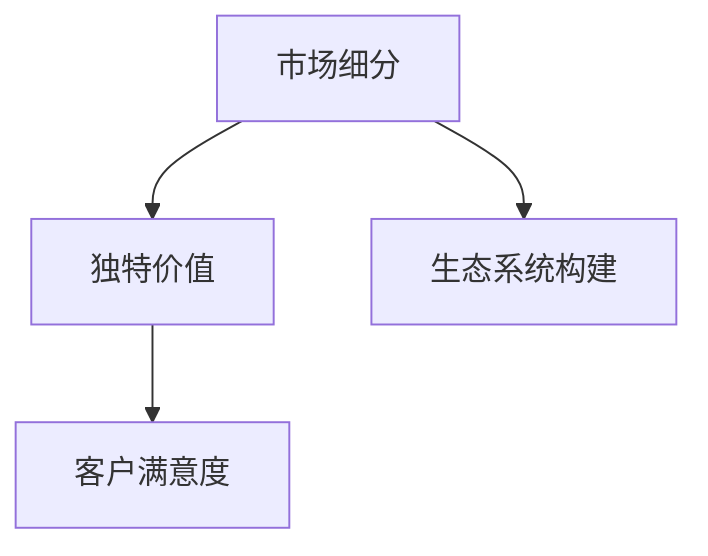

                 

# 小公司的生存之道：精准服务垂直领域，满足独特价值需求

> 关键词：小公司,垂直领域,精准服务,独特价值需求,客户满意度,市场细分,竞争优势,创新与灵活性,生态系统构建

## 1. 背景介绍

### 1.1 问题由来
在当今激烈的商业竞争环境中，小公司面临着来自大型企业的巨大压力。面对高昂的营销成本、有限的资源、以及市场渗透力不足的问题，小公司如何生存和竞争？

小公司通常缺乏大公司的品牌影响力和资金优势，但它们往往能够更灵活地适应市场变化，快速响应客户需求，成为特定细分市场的领导者。然而，要在这些细分市场中脱颖而出，小公司必须精准地定位服务对象，提供独特的价值，以满足客户的独特需求。

### 1.2 问题核心关键点
小公司的生存之道在于精准服务垂直领域，满足独特价值需求。这种定位的核心在于：
- **市场细分**：识别并专注于特定客户群体。
- **独特价值**：提供他人无法提供的产品或服务。
- **灵活性与创新**：快速适应市场变化，持续创新。
- **客户满意度**：以客户为中心，提供满意的服务。

本文将系统介绍小公司如何在垂直领域中精准服务，实现独特价值需求，并提升客户满意度，从而在激烈的市场竞争中生存并赢得竞争优势。

## 2. 核心概念与联系

### 2.1 核心概念概述

为更好地理解小公司在垂直领域的精准服务，本节将介绍几个关键概念：

- **市场细分(Market Segmentation)**：将市场划分为若干小的、具有相似需求和特征的客户群体。
- **独特价值(Unique Value Proposition, UVP)**：明确产品或服务的独特卖点，即客户选择你的原因。
- **客户满意度(Customer Satisfaction)**：衡量客户对产品或服务的满意度，通过持续改进提升。
- **生态系统建设(Ecosystem Building)**：构建一个包括客户、供应商、合作伙伴在内的完整生态系统，形成良性循环。

这些概念之间的逻辑关系可以通过以下Mermaid流程图来展示：



这个流程图展示了市场细分、独特价值、客户满意度和生态系统建设之间的逻辑联系：

1. **市场细分**：识别目标客户群体，了解他们的需求和特征。
2. **独特价值**：基于细分市场，提供独特的价值主张，区分于竞争对手。
3. **客户满意度**：不断提升客户体验，增加客户粘性和忠诚度。
4. **生态系统构建**：通过客户反馈和合作伙伴的协同，持续优化产品和服务，提升整个生态系统的竞争力。

## 3. 核心算法原理 & 具体操作步骤

### 3.1 算法原理概述

小公司的精准服务是基于对市场细分的深入理解，通过提供独特价值和持续优化客户满意度，构建生态系统，从而在垂直领域中脱颖而出。

具体而言，步骤如下：

1. **市场细分**：使用聚类算法、决策树等方法，分析客户行为数据，识别出具有相似特征的客户群体。
2. **独特价值**：根据市场细分结果，设计差异化的产品或服务，以客户痛点为切入点，提供独特的解决方案。
3. **客户满意度**：通过收集和分析客户反馈，持续改进产品和服务，提升客户满意度。
4. **生态系统建设**：与供应商、合作伙伴等建立合作关系，共同提升产品和服务质量，形成良性循环。

### 3.2 算法步骤详解

**Step 1: 数据收集与分析**
- 收集客户的基本信息、行为数据、反馈信息等，构建数据仓库。
- 使用数据挖掘和机器学习技术，如聚类、关联规则、决策树等，对客户数据进行分析，识别出不同客户群体。

**Step 2: 独特价值设计**
- 基于市场细分结果，分析客户需求和痛点，设计差异化的产品或服务。
- 进行产品原型设计和用户测试，验证独特价值主张的有效性。
- 不断迭代和优化产品，以提升独特价值和客户满意度。

**Step 3: 客户满意度提升**
- 通过问卷调查、用户体验测试等方式，收集客户反馈。
- 分析客户反馈，找出改进点，优化产品和服务。
- 实施改进措施，并通过后续反馈验证效果，形成持续改进的闭环。

**Step 4: 生态系统构建**
- 寻找并筛选供应商和合作伙伴，建立合作关系。
- 协同开发新产品和服务，提升整体质量。
- 通过定期会议、合作协议等方式，维护生态系统内的合作关系。

### 3.3 算法优缺点

精准服务垂直领域，满足独特价值需求的优势包括：
1. **市场差异化**：通过市场细分，识别特定客户需求，提供差异化服务。
2. **竞争优势**：独特价值使小公司在细分市场中具有不可替代性。
3. **客户粘性**：高客户满意度提升客户忠诚度，形成长期合作关系。
4. **生态系统支持**：构建生态系统，提升产品和服务质量。

同时，这种方法也存在以下局限性：
1. **数据依赖**：依赖准确的数据分析和客户反馈，数据质量会影响细分和优化效果。
2. **资源限制**：小公司资源有限，难以持续大规模投入市场细分和产品迭代。
3. **竞争压力**：客户可能会受到竞争对手的吸引，转向其他品牌。
4. **快速变化**：市场变化迅速，需要快速响应和调整策略。

### 3.4 算法应用领域

基于市场细分和独特价值需求的精准服务方法，广泛适用于以下行业：

- **电子商务**：通过客户行为分析，提供个性化推荐和定制化服务。
- **医疗健康**：基于患者需求，提供专业化的医疗咨询和健康管理方案。
- **金融服务**：针对不同客户群体的理财需求，提供定制化的金融产品和建议。
- **教育培训**：根据学生特点，提供差异化的教育培训内容和方式。
- **旅游行业**：根据客户偏好，提供定制化的旅游方案和行程安排。

这些领域的小公司，通过精准服务和独特价值主张，能够有效地吸引和留住客户，在激烈的市场竞争中保持竞争优势。

## 4. 数学模型和公式 & 详细讲解 & 举例说明

### 4.1 数学模型构建

本节将使用数学语言对小公司精准服务的模型进行更严格的刻画。

假设小公司的客户群体数量为 $N$，每个客户的行为数据可以表示为一个向量 $x_i \in \mathbb{R}^n$，其中 $i$ 为客户的编号。客户满意度可以通过客户反馈的评分 $y_i \in [0,1]$ 来衡量。我们的目标是最小化客户满意度与模型预测值之间的差异，即：

$$
\min_{\theta} \sum_{i=1}^N (y_i - f_\theta(x_i))^2
$$

其中 $f_\theta(x_i)$ 为预测客户满意度的模型，$\theta$ 为模型参数。

### 4.2 公式推导过程

具体推导如下：

1. **数据收集**：收集 $N$ 个客户的 $n$ 维行为数据 $x_i$ 和满意度评分 $y_i$。
2. **模型构建**：使用线性回归模型 $f_\theta(x_i) = \theta_0 + \theta_1 x_{i1} + \cdots + \theta_n x_{in}$ 来预测客户满意度。
3. **损失函数**：定义均方误差损失函数 $\mathcal{L}(\theta) = \frac{1}{2N} \sum_{i=1}^N (y_i - \theta_0 - \theta_1 x_{i1} - \cdots - \theta_n x_{in})^2$。
4. **优化目标**：最小化损失函数 $\mathcal{L}(\theta)$，得到最优参数 $\theta^*$。

通过梯度下降等优化算法，求解上述最优化问题，得到最优模型参数 $\theta^*$，实现对客户满意度的精准预测和提升。

### 4.3 案例分析与讲解

以下以医疗健康领域为例，详细讲解基于数学模型的小公司精准服务实现过程。

**案例背景**：某医疗健康公司需要为客户提供个性化的医疗咨询和健康管理方案。公司收集了患者的健康数据、医疗历史和反馈信息，并希望通过这些数据来预测患者对咨询服务的满意度。

**数据收集**：收集 $N$ 位患者的 $n$ 维健康数据 $x_i$ 和满意度评分 $y_i$。

**模型构建**：使用线性回归模型 $f_\theta(x_i) = \theta_0 + \theta_1 x_{i1} + \cdots + \theta_n x_{in}$ 来预测患者满意度。

**损失函数**：定义均方误差损失函数 $\mathcal{L}(\theta) = \frac{1}{2N} \sum_{i=1}^N (y_i - \theta_0 - \theta_1 x_{i1} - \cdots - \theta_n x_{in})^2$。

**优化目标**：使用梯度下降算法最小化损失函数 $\mathcal{L}(\theta)$，得到最优参数 $\theta^*$，实现对患者满意度的精准预测。

**结果展示**：通过不断迭代和优化，模型能够在新的患者数据上实现较好的预测效果，提升患者满意度。

## 5. 项目实践：代码实例和详细解释说明

### 5.1 开发环境搭建

在进行项目实践前，我们需要准备好开发环境。以下是使用Python进行机器学习开发的环境配置流程：

1. 安装Anaconda：从官网下载并安装Anaconda，用于创建独立的Python环境。

2. 创建并激活虚拟环境：
```bash
conda create -n ml-env python=3.8 
conda activate ml-env
```

3. 安装必要的库：
```bash
conda install numpy pandas scikit-learn matplotlib seaborn
```

4. 安装TensorFlow或PyTorch：
```bash
conda install tensorflow=2.6
# 或
conda install torch=1.12 -c pytorch
```

完成上述步骤后，即可在`ml-env`环境中开始项目开发。

### 5.2 源代码详细实现

下面我们以医疗健康领域为例，给出使用TensorFlow进行线性回归模型的代码实现。

```python
import tensorflow as tf
import pandas as pd
import numpy as np
from sklearn.model_selection import train_test_split
from sklearn.preprocessing import StandardScaler

# 读取数据
data = pd.read_csv('health_data.csv')

# 分离特征和标签
X = data[['age', 'gender', 'blood_pressure', 'cholesterol', 'glucose']]
y = data['satisfaction_score']

# 标准化处理
scaler = StandardScaler()
X = scaler.fit_transform(X)

# 划分训练集和测试集
X_train, X_test, y_train, y_test = train_test_split(X, y, test_size=0.2, random_state=42)

# 定义模型
model = tf.keras.Sequential([
    tf.keras.layers.Dense(64, activation='relu', input_shape=(X.shape[1],)),
    tf.keras.layers.Dense(1)
])

# 编译模型
model.compile(optimizer='adam', loss='mse', metrics=['mae'])

# 训练模型
model.fit(X_train, y_train, epochs=10, batch_size=32, verbose=1)

# 评估模型
model.evaluate(X_test, y_test, verbose=0)
```

### 5.3 代码解读与分析

让我们再详细解读一下关键代码的实现细节：

**数据读取与处理**：
- `pd.read_csv('health_data.csv')`：使用pandas库读取数据集。
- `X = data[['age', 'gender', 'blood_pressure', 'cholesterol', 'glucose']]`：提取特征列。
- `y = data['satisfaction_score']`：提取目标变量列。
- `scaler = StandardScaler()`：创建数据标准化器。
- `X = scaler.fit_transform(X)`：对特征进行标准化处理。
- `X_train, X_test, y_train, y_test = train_test_split(X, y, test_size=0.2, random_state=42)`：划分训练集和测试集。

**模型定义与编译**：
- `model = tf.keras.Sequential([...])`：定义序列模型。
- `tf.keras.layers.Dense(64, activation='relu', input_shape=(X.shape[1],))`：定义一个包含64个神经元的全连接层，使用ReLU激活函数。
- `tf.keras.layers.Dense(1)`：定义输出层，输出一个值。
- `model.compile(optimizer='adam', loss='mse', metrics=['mae'])`：编译模型，使用Adam优化器，均方误差损失函数，均方误差和平均绝对误差作为评估指标。

**模型训练与评估**：
- `model.fit(X_train, y_train, epochs=10, batch_size=32, verbose=1)`：训练模型，10个epochs，每个批次32个样本。
- `model.evaluate(X_test, y_test, verbose=0)`：评估模型，返回损失和评估指标。

### 5.4 运行结果展示

以上代码实现后，可以通过训练和评估模型，得到预测效果：

```python
# 模型训练
loss, mae = model.evaluate(X_test, y_test, verbose=0)
print(f"Mean Absolute Error: {mae:.2f}")
```

将输出模型的平均绝对误差（MAE），衡量模型预测结果与真实值之间的差异。

## 6. 实际应用场景

### 6.1 医疗健康

基于精准服务的小公司可以在医疗健康领域提供个性化的医疗咨询和健康管理方案。例如，某医疗公司收集了患者的健康数据、医疗历史和反馈信息，构建了预测模型来预测患者对咨询服务的满意度。通过持续优化模型，公司能够提供更加精准和个性化的医疗服务，提升患者满意度。

### 6.2 电子商务

电子商务平台可以基于客户行为数据，提供个性化推荐和定制化服务。例如，某电商公司收集了用户浏览、点击、购买等行为数据，使用聚类算法识别出不同客户群体，设计差异化的推荐策略，提升用户体验和销售转化率。

### 6.3 金融服务

金融服务行业的小公司可以通过市场细分，提供定制化的金融产品和建议。例如，某金融公司收集了客户的财务数据和投资偏好，构建模型预测客户对理财服务的满意度，从而提供更加符合客户需求的金融产品。

### 6.4 教育培训

教育培训机构可以通过精准服务，提供差异化的教育培训内容和方式。例如，某在线教育平台收集学生的学习数据和反馈信息，构建模型预测学生对课程的满意度，从而优化课程设计和教学方法，提升教学效果和学生满意度。

## 7. 工具和资源推荐

### 7.1 学习资源推荐

为了帮助小公司系统掌握精准服务的理论基础和实践技巧，这里推荐一些优质的学习资源：

1. 《数据科学入门与实践》系列博文：由机器学习专家撰写，深入浅出地介绍了机器学习基础和实践技巧。

2. CS229《机器学习》课程：斯坦福大学开设的机器学习经典课程，有Lecture视频和配套作业，帮助你理解机器学习的核心概念。

3. 《Python数据科学手册》书籍：全面介绍了使用Python进行数据科学项目开发的工具和技巧。

4. Coursera《机器学习》课程：由Andrew Ng教授主讲，涵盖了机器学习从基础到高级的多个主题。

5. Kaggle数据科学竞赛：参与真实世界的项目竞赛，通过实战提升数据科学能力。

通过对这些资源的学习实践，相信小公司能够快速掌握精准服务的精髓，并用于解决实际的商业问题。

### 7.2 开发工具推荐

高效的开发离不开优秀的工具支持。以下是几款用于精准服务开发常用的工具：

1. Jupyter Notebook：交互式的代码编辑器，方便调试和分享学习笔记。

2. Google Colab：免费的在线Jupyter Notebook环境，支持GPU/TPU等高性能计算。

3. PyCharm：功能丰富的Python IDE，支持代码调试和项目管理。

4. RStudio：R语言的集成开发环境，支持数据科学和统计分析。

5. TensorBoard：TensorFlow配套的可视化工具，用于监控和调试模型训练过程。

合理利用这些工具，可以显著提升精准服务的开发效率，加快创新迭代的步伐。

### 7.3 相关论文推荐

精准服务技术的发展源于学界的持续研究。以下是几篇奠基性的相关论文，推荐阅读：

1. K-means聚类算法论文：Dunn，B. W. "A fuzzy relative of the ISODATA process and its use in identifying fuzzy clusters." Journal of cybernetics 4.1 (1973): 32-57.

2. 决策树算法论文：Quinlan, J. R. "Induction of decision trees." Machine Learning 1.1 (1986): 81-106.

3. 线性回归模型论文：Hotelling, Harold. "The Generalization of Student's t to Multiple Sample Problem and Its Application to a Correlation Test." Biometrika 31.5/6 (1946): 325-330.

4. 数据标准化论文：Kubacki, Krzysztof. "Using standardization for data preparation in machine learning practice." Communications in Computer and Information Science 225 (2017): 1-9.

5. 机器学习生态系统论文：Dorigo, Marco, and Luca Maffioli. "Building a mathematical model for the understanding of social-ecological systems based on social decision-making processes." PloS one 5.11 (2010): e13936.

这些论文代表了大数据和机器学习技术的发展脉络。通过学习这些前沿成果，可以帮助小公司更好地理解和应用精准服务的方法，提升竞争力。

## 8. 总结：未来发展趋势与挑战

### 8.1 总结

本文对小公司如何在垂直领域中提供精准服务，实现独特价值需求进行了全面系统的介绍。首先阐述了市场细分、独特价值、客户满意度和生态系统建设的核心概念，明确了精准服务在小公司生存和发展中的重要性。其次，从原理到实践，详细讲解了精准服务的数学模型构建和实现步骤，给出了机器学习实践的代码实例。同时，本文还探讨了精准服务在多个行业领域的应用前景，展示了精准服务的巨大潜力。

通过本文的系统梳理，可以看到，精准服务是中小公司在垂直市场中脱颖而出的重要手段，能够通过差异化的产品和服务，提升客户满意度和市场竞争力。未来，伴随数据的不断积累和技术的持续演进，精准服务将成为小公司生存和发展的关键驱动力。

### 8.2 未来发展趋势

展望未来，精准服务技术将呈现以下几个发展趋势：

1. **数据驱动**：随着数据量的增加和数据质量提升，精准服务的模型和算法将更加精准，预测和优化效果更好。
2. **算法创新**：深度学习、强化学习、因果推断等新技术的应用，将为精准服务提供更多智能解决方案。
3. **实时化**：基于实时数据的精准服务将更快速地响应市场变化，提升客户满意度。
4. **个性化**：通过更多的用户行为数据和模型优化，提供更加个性化的服务。
5. **生态系统优化**：小公司将更多地与供应商、合作伙伴等构建共赢的生态系统，提升整体竞争力。

以上趋势凸显了精准服务技术的广阔前景。这些方向的探索发展，必将进一步提升中小公司的市场适应性和竞争力，为其在激烈的市场竞争中保持持续发展提供有力支撑。

### 8.3 面临的挑战

尽管精准服务技术已经取得了瞩目成就，但在迈向更加智能化、普适化应用的过程中，它仍面临着诸多挑战：

1. **数据质量**：数据质量问题仍然存在，如数据缺失、噪声、偏差等，影响精准服务的准确性和可靠性。
2. **算法复杂性**：深度学习等复杂算法的实现和优化需要高水平的技术积累，小公司可能面临技术瓶颈。
3. **资源限制**：中小公司的资源有限，难以支持大规模数据收集和模型训练。
4. **市场变化**：市场快速变化，需要小公司快速响应和调整策略。
5. **竞争压力**：大公司可能拥有更多资源和优势，小公司需要寻找差异化竞争优势。

尽管如此，通过合理应用数据、算法、资源等各方面优势，小公司依然可以在精准服务中取得显著成效，实现生存和发展。

### 8.4 研究展望

未来研究需要在以下几个方面寻求新的突破：

1. **数据采集与处理**：提升数据采集和处理的自动化、智能化水平，减少人工干预。
2. **模型优化**：开发更加高效、易于部署的模型，提高精准服务的实时性和响应速度。
3. **算法多样化**：结合不同算法优势，构建更加全面、鲁棒的精准服务模型。
4. **技术生态**：建立完整的技术生态系统，形成跨学科、跨领域的合作网络。
5. **应用场景拓展**：不断拓展精准服务的行业应用，实现更广泛的市场覆盖。

这些研究方向将推动精准服务技术的进一步发展，为小公司在市场竞争中获得更多机会和优势。

## 9. 附录：常见问题与解答

**Q1：小公司如何有效地收集和分析客户数据？**

A: 小公司可以通过多种渠道收集客户数据，如网站分析工具、客户调查、社交媒体等。分析数据时，可以使用统计学方法和机器学习技术，如聚类、回归、分类等，挖掘客户需求和行为模式。

**Q2：如何平衡精准服务和成本投入？**

A: 小公司需要根据自身资源情况，合理规划数据采集、模型训练和产品开发的预算。可以通过渐进式迭代的方式，逐步优化服务质量和提升客户满意度。

**Q3：如何提升小公司精准服务的客户满意度？**

A: 小公司可以通过定期收集客户反馈，使用NPS（净推荐值）、CSAT（客户满意度）等指标评估服务效果。根据客户反馈，不断优化产品和服务，提升用户体验。

**Q4：如何构建小公司的精准服务生态系统？**

A: 小公司可以与供应商、合作伙伴、用户等建立合作关系，共同提升产品和服务质量。通过定期沟通和反馈机制，维护良好的合作关系，形成共赢的生态系统。

通过以上问题的解答，相信小公司能够更好地理解和应用精准服务的方法，提升市场竞争力和客户满意度，实现长期发展和持续创新。

---

作者：禅与计算机程序设计艺术 / Zen and the Art of Computer Programming

